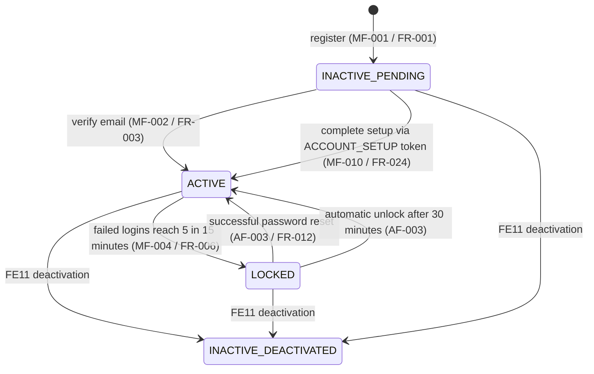

# SPEC.md - FE02 Authentication

# Version: 0.6.3

# Status: APPROVED - BASELINE 2026-07-17

# Owner: Dat

# Last Updated: 2026-07-19

# Feature ID: FE02

# Feature folder: `.sdd/specs/feat-auth/`

> Source of truth for FE02 Authentication. This spec is approved for Phase 2 planning. It is intentionally detailed because FE02 is the foundation of all access control and security in the system.
>
> Decisions in this spec were reviewed and approved on 2026-06-10. See `.sdd/reviews/open-questions-resolution-packet-2026-06-10.md`.
>
> Nhat approved the FE02/FE10 OTP revision and FE02/FE10/FE11 account-setup baseline on 2026-07-17. Implementation changes still require focused validation and human review before merge. See ADR-004 and ADR-005.

---

## 1. Feature Overview

### 1.1 Feature Name

Authentication

### 1.2 Business Context

Authentication is the mechanism by which the Library Management System verifies user identity and establishes secure sessions for controlled access. Every user (Guest, Member, Librarian, Admin) must authenticate to gain access to protected features.

This feature is core because compromised authentication can expose sensitive data, allow unauthorized borrowing, prevent legitimate users from accessing the system, and create audit liability.

### 1.3 Goal / Outcome

The system shall:

- Allow users to register accounts with email verification.
- Allow users to login with email/username and password.
- Establish secure sessions/tokens for authenticated requests.
- Allow users to change their password securely.
- Allow users to reset forgotten passwords via email.
- Invalidate sessions when users logout.
- Validate authentication on every protected request.
- Maintain audit logs of all authentication events.

### 1.4 Scope Level

- [x] Full Spec - core business logic, high risk, must be correct from the beginning
- [ ] Standard Spec - normal feature with business rules and validations
- [ ] Light Spec - simple UI, documentation, or low-risk feature

---

## 2. Actors and Permissions

| Actor | Description | Permission / Responsibility |
| ----- | ----------- | --------------------------- |
| Guest | Unauthenticated visitor | Can register, login, and request password reset. Cannot access member/librarian/admin features. |
| Member | Registered authenticated user with member role | Can login, logout, change password, view profile. Access member features (borrow, reserve, etc.). |
| Librarian | Authenticated user with librarian role | Can login, logout, change password. Access librarian features (approve borrows, process returns, etc.). |
| Admin | Authenticated user with admin role | Can login, logout, change password. Access all admin features. |
| FE10 Notification Management | Internal dependency | Receives account-verification and password-reset OTP requests only through the requester bound to `FE02`, then renders, delivers, and records safe status/attempt metadata. |
| Email Provider | External or mocked service | FE10 uses the configured provider adapter for verification/reset delivery; direct `CHANGE_PASSWORD_OTP` delivery is compatibility-only and outside the canonical Phase 1 API. |
| Audit Logger | System component | Records all authentication events (login attempt, success, failure, logout, password change, password reset). |

---

## 3. Preconditions

The feature can only start when:

- PRE-FE02-001: The database has Users, Roles, UserRoles, and AuditLogs tables.
- PRE-FE02-002: FE10's configured email-provider adapter is available or an injected mock is used for development/tests.
- PRE-FE02-003: Password hashing library (bcrypt) is available in the tech stack.
- PRE-FE02-004: Session/token management strategy is JWT access tokens plus database-backed refresh/session credentials; session-cookie alternatives are out of scope for Phase 1.
- PRE-FE02-005: HTTPS is enforced or can be enforced in the deployment environment.
- PRE-FE02-006: Team has resolved password policy (length, complexity) and session timeout values.

---

## 4. Main Flows

### MF-FE02-001: User Registration

1. Guest accesses the registration form.
2. Guest enters email, password, confirm password, and optional full name/phone.
3. The system validates input and checks for duplicate email.
4. The system hashes the password with bcrypt.
5. The system creates a user record with status `INACTIVE`.
6. The system assigns the `Member` role through `UserRoles`; self-registration cannot create a `Librarian` or `Admin` account.
7. The system generates a six-digit email verification OTP with 24-hour expiration and stores only its hash.
8. FE02 requests verification OTP delivery exactly once through the FE10 requester bound to `FE02`, using the persisted `AuthTokens.TokenId` for source traceability and idempotency.
9. The system shows the OTP verification step and asks the user to check their inbox.

### MF-FE02-002: Email Verification (Registration)

1. User enters the six-digit verification OTP together with the registered email. Legacy verification-link tokens remain accepted for compatibility.
2. The system validates the OTP or legacy token (format, expiration, matches user record).
3. If valid, the system sets user status to `ACTIVE`.
4. The system invalidates the OTP/token.
5. The system shows success message and redirects to login.

### MF-FE02-003: User Login

1. User (authenticated or unauthenticated) accesses the login form.
2. User enters email/username and password.
3. The system looks up the user by email/username.
4. The system verifies the password against the stored hash.
5. The system checks user status (must be `ACTIVE`, not `INACTIVE` or `LOCKED`).
6. If valid, the system creates a session/token with expiration.
7. The system stores or returns the session/token to the client.
8. The system writes an audit log: login success.
9. The system redirects user to the home page or member dashboard.

### MF-FE02-004: Failed Login Attempt

1. User enters invalid credentials.
2. The system verifies the password and detects mismatch.
3. The system increments failed login counter for the user.
4. If the account reaches 5 consecutive failed password attempts within a rolling 15-minute window, the system sets `LOCKED` and `lockedUntil` to 30 minutes after the locking event.
5. The system returns generic error message (not revealing user existence).
6. The system writes an audit log: login failed, reason.

### MF-FE02-005: User Logout

1. Authenticated user requests logout (clicks logout button or API call).
2. The system revokes the current refresh/session credential and rejects later protected requests associated with that revoked credential.
3. The system clears session/token from client (cookie deletion or local storage clear).
4. The system writes an audit log: logout.
5. The system redirects to login page or home page.

### MF-FE02-006: Change Password

1. Authenticated user accesses change password form.
2. User enters current password and new password (twice).
3. The system verifies current password against user's stored hash.
4. The system validates new password meets complexity requirements.
5. The system hashes the new password.
6. The system updates the user's password in the database.
7. The system revokes all other active refresh/session credentials for the user and preserves only the credential used by the current request.
8. The system writes an audit log: password changed.
9. The system shows success message.

### MF-FE02-007: Forgot Password Request

1. Unauthenticated user accesses forgot password form.
2. User enters their email address.
3. The system looks up the user by email.
4. Only when the account has verified email ownership, `deactivatedAt = null`, and status `ACTIVE` or `LOCKED`, the system generates a six-digit password reset OTP with 15-minute expiration and stores only its hash.
5. For an eligible account, FE02 requests password-reset OTP delivery exactly once through the FE10 requester bound to `FE02`, using the persisted `AuthTokens.TokenId` for source traceability and idempotency.
6. The system shows the same success message whether the email is missing, ineligible, or eligible, to prevent user enumeration.

### MF-FE02-008: Reset Password

1. User enters the six-digit reset OTP together with the requested email. Legacy password-reset tokens remain accepted for compatibility.
2. The system validates the OTP or legacy token (format, expiration, matches user record).
3. If valid, the system shows password reset form.
4. User enters new password (twice).
5. The system validates new password meets complexity requirements.
6. The system hashes the new password.
7. The system updates the user's password. If the eligible account is `LOCKED`, the same transaction sets it to `ACTIVE` and clears `failedLoginCount` and `lockedUntil`; an `ACTIVE` account remains `ACTIVE`.
8. The system invalidates the reset OTP/token.
9. The system writes an audit log: password reset.
10. The system shows success message and redirects to login.

### MF-FE02-009: Validate Session/Token (Per-Request)

1. Client sends a protected API request with session/token in header/cookie.
2. The system extracts and validates the session/token.
3. The system checks expiration, format, and signature (if JWT).
4. If valid, the system identifies the user and allows the request to proceed.
5. If invalid or expired, the system returns 401 Unauthorized and asks user to login again.

### MF-FE02-010: Complete Admin-Created Account Setup

1. User opens the FE11 setup link and submits the opaque `ACCOUNT_SETUP` token with a new password and confirmation.
2. FE02 hashes the submitted token and loads an active, unused, unrevoked `ACCOUNT_SETUP` record.
3. FE02 confirms the token is unexpired, belongs to an `INACTIVE` admin-created account, and the account has not completed setup.
4. FE02 validates the new password using the approved FE02 password policy.
5. In one transaction, FE02 stores the bcrypt password hash, sets `EmailVerifiedAt` when absent, resets failed-login lock fields, changes status to `ACTIVE`, marks the setup token used, revokes any other active setup tokens, and writes the setup-completion audit event.
6. The system returns a safe success response and directs the user to login.

---

## 5. Alternative Flows

### AF-FE02-001: User Email Already Registered

1. Guest submits registration form with email already in use.
2. The system detects duplicate email.
3. The system returns error: "Email is already registered. Please login or use forgot password."

### AF-FE02-002: Email Verification Credential Expired

1. User submits an old verification OTP or legacy verification link.
2. The system detects the OTP/token is expired or invalid.
3. The system returns a safe expiry message and displays the approved resend-verification action.

### AF-FE02-003: Account Locked Due to Too Many Failed Logins

1. User makes too many failed login attempts.
2. The system locks the account automatically.
3. The system returns error: "Account is locked due to too many failed attempts. Please reset your password or wait for the lock period to end."
4. The account unlocks only after a successful password reset or automatically when `lockedUntil` has elapsed; either transition clears `failedLoginCount` and `lockedUntil`.

### AF-FE02-004: Session Expired During User Activity

1. User's session/token expires while user is using the system.
2. Client makes a request with expired token.
3. The system returns 401 Unauthorized.
4. The client redirects user to login page with message: "Your session expired. Please login again."

### AF-FE02-005: Reset Credential Already Used

1. User successfully resets password using an OTP or legacy token.
2. The same reset credential is used again.
3. The system detects the OTP/token is already used and invalid.
4. The system returns a safe invalid-code message and offers a new reset OTP.

### AF-FE02-006: New Password Matches Old Password

1. User attempts to change password to the same password as the current password.
2. The system compares the submitted password with the current password hash.
3. The system returns error: "New password must be different from current password. Do not reuse recent passwords."

### AF-FE02-007: Password Does Not Meet Complexity Requirements

1. User enters a password that is too weak (e.g., too short, no uppercase/number).
2. The system returns error: "Password must be at least [N] characters and contain uppercase, lowercase, and number."

---

## 6. Business Rules

Use these stable IDs for tasks and tests.

- BR-FE02-001: A guest must provide valid email, password, and confirmations to register.
- BR-FE02-002: A guest cannot access member/librarian/admin features without logging in.
- BR-FE02-003: A user can only be created in the registration flow; users cannot be created by other actors in this feature.
- BR-FE02-004: A registered user account must be verified via email before being activated.
- BR-FE02-005: A user password must be hashed with bcrypt (cost ≥ 10) before storage.
- BR-FE02-006: A user password verification must compare plaintext input against the stored hash, not store or transmit plaintext.
- BR-FE02-007: Login must not reveal whether a user email is registered (prevent user enumeration).
- BR-FE02-008: For a known account, 5 consecutive failed password attempts within a rolling 15-minute window trigger the account lock. All login requests are also rate-limited to 10 requests per IP address in a rolling 15-minute window.
- BR-FE02-009: When the failed-attempt threshold is reached, the system must set `status = LOCKED`, set `lockedUntil` to exactly 30 minutes after the locking event, and reject login until either a successful password reset or automatic lock expiry. Phase 1 has no admin-unlock action.
- BR-FE02-010: JWT access tokens expire after 15 minutes and refresh tokens expire after 7 days.
- BR-FE02-011: Logout must revoke the submitted/current refresh-session credential and make subsequent protected requests associated with that credential fail authorization.
- BR-FE02-012: Every protected request must validate the session/token before processing.
- BR-FE02-013: Password reset and account setup must prove email ownership through the purpose-specific credential.
- BR-FE02-014: Password reset tokens expire after 15 minutes. Admin-created account setup tokens expire exactly 24 hours after issuance.
- BR-FE02-015: A user's role(s) are determined by `UserRoles` table and may be cached but must be verified on sensitive operations.
- BR-FE02-016: Every authentication event (login attempt, success, failure, logout, password change/reset) must be auditable.
- BR-FE02-017: HTTPS must be enforced for login/password/token transmission; plain HTTP is forbidden.
- BR-FE02-018: A user may change their password only if authenticated.
- BR-FE02-019: A password change must require entry of the current password for verification.
- BR-FE02-020: FE02 must use the FE10 requester bound to `FE02` as the single notification delivery boundary for account-verification and password-reset OTPs; FE02 must not also create a notification record, send either email directly, or return either OTP in public/test HTTP response fields.
- BR-FE02-021: Each verification/reset OTP delivery request must reference the persisted `AuthTokens.TokenId` as `sourceEntityId` and derive its idempotency key from notification type plus token ID, never from the OTP. A resend creates a new token ID and a new notification event/key.
- BR-FE02-022: FE10 delivery failure must not roll back user creation, OTP creation, or the generic forgot-password response. FE02 must allow the approved resend flow to issue a new OTP event.
- BR-FE02-023: FE02 owns consumption, not issuance or delivery, of FE11 `ACCOUNT_SETUP` tokens. FE11 creates/rotates the token and FE10 delivers the setup link through the requester bound to `FE11`.
- BR-FE02-024: Successful account setup must atomically update the password hash, email verification timestamp, lock fields, `INACTIVE -> ACTIVE` status, setup-token usage/revocation, and auth audit entry.
- BR-FE02-025: Password-reset OTP/token processing must never activate an ordinary inactive account; only a valid `ACCOUNT_SETUP` token may activate an admin-created setup account.
- BR-FE02-026: A successful password change revokes every other active refresh/session credential for the user and preserves only the current credential.

---

## 7. Functional Requirements

- FR-FE02-001: When a guest submits valid registration data, the system shall create a new user with `INACTIVE` status.
- FR-FE02-002: When a user is registered, FE02 shall create a six-digit verification OTP with a 24-hour expiry, store only its hash, and request exactly one delivery through the FE10 requester bound to `FE02`; legacy verification tokens remain accepted for compatibility.
- FR-FE02-003: When a user submits a valid verification OTP and email, or a valid legacy verification token, the system shall activate the user account and invalidate the OTP/token.
- FR-FE02-004: When a user submits login form with valid credentials and active account, the system shall create a session/token and return it to the client.
- FR-FE02-005: When a user submits login form with invalid email or password, the system shall reject the request and not reveal whether the email exists.
- FR-FE02-006: When a known account reaches 5 consecutive failed password attempts within a rolling 15-minute window, the system shall set `LOCKED`, set `lockedUntil` to 30 minutes after the locking event, and reject further login attempts until unlock.
- FR-FE02-007: When a user requests logout, the system shall invalidate the session/token immediately.
- FR-FE02-008: When a user makes a protected request, the system shall validate the session/token before allowing the request.
- FR-FE02-009: When a session/token expires, the system shall return 401 Unauthorized for subsequent requests using that token.
- FR-FE02-010: When an authenticated user submits change password form, the system shall verify current password, update to a password of 8..255 characters meeting the approved complexity policy, revoke all other active refresh/session credentials, and preserve the current credential.
- FR-FE02-011: When a guest submits forgot password for an account with verified email ownership, `deactivatedAt = null`, and status `ACTIVE` or `LOCKED`, FE02 shall create a six-digit password-reset OTP with a 15-minute expiry, store only its hash, and request exactly one delivery through the FE10 requester bound to `FE02`; every ineligible or unknown email receives the same generic public response without token creation.
- FR-FE02-012: When a user submits a valid reset OTP and email, or a valid legacy password-reset token, with a new password, the system shall update the password for an eligible previously activated account and invalidate the reset credential without activating an `INACTIVE` account; a `LOCKED` account becomes `ACTIVE` and clears its lock counters, while an `ACTIVE` account remains `ACTIVE`.
- FR-FE02-013: When a guest completes self-registration, the system shall assign exactly the `Member` role through `UserRoles`; Librarian and Admin accounts are created only by FE11.
- FR-FE02-014: When checking user permissions, the system shall retrieve the user's current roles from `UserRoles` and enforce them server-side for protected operations.
- FR-FE02-022: When FE02 requests verification/reset OTP delivery, it shall send `otp`, `expiresInMinutes`, `sourceEntityType: AuthToken`, `sourceEntityId: tokenId`, and an idempotency key derived from type plus token ID; it shall not perform a second direct send, direct notification-record write, or HTTP debug-token response.

### 7.1 Unwanted Behavior Requirements (EARS)

The following requirements formalize the error-handling and abnormal-condition branches already described in Sections 5 (Alternative Flows), 6 (Business Rules), and 9 (Edge Cases). Each is expressed in EARS Unwanted syntax (`IF ...` / `WHERE ...`) and traces back to a source AF/EC/BR.

- FR-FE02-015: IF a guest submits registration data with an email that is already registered, the system shall reject the registration and return the message "Email is already registered. Please login or use forgot password." without creating a new user record. (Source: AF-FE02-001, EC-FE02-003, BR-FE02-001)
- FR-FE02-016: IF a user submits an email verification OTP/token that is expired, malformed, or does not match any user record, the system shall reject activation, keep the account `INACTIVE`, and offer to resend a new verification email. (Source: AF-FE02-002, BR-FE02-004)
- FR-FE02-017: IF a user attempts to log in to an account whose status is `LOCKED`, the system shall reject the login and return the account-lock message instructing the user to reset their password or wait until `lockedUntil` elapses. (Source: AF-FE02-003, BR-FE02-009)
- FR-FE02-018: IF a user submits a password-reset or account-setup credential that has already been used, expired, or does not match an eligible user, the system shall reject the request and return a safe invalid-code message without changing any password. (Source: AF-FE02-005, BR-FE02-014)
- FR-FE02-019: IF a submitted new password (during registration, change, or reset) does not meet the configured complexity policy, the system shall reject the operation and return a complexity-requirement error without persisting the password. (Source: AF-FE02-007, BR-FE02-005, Q-FE02-001)
- FR-FE02-020: IF an authenticated user attempts to change their password to a value identical to the current password, the system shall reject the change and return the message "New password must be different from current password." (Source: AF-FE02-006)
- FR-FE02-021: IF a protected request presents a session/token that is malformed, has an invalid signature, or has expired, the system shall reject the request with 401 Unauthorized and shall not process the requested operation. (Source: AF-FE02-004, EC-FE02-014, BR-FE02-012)
- FR-FE02-023: IF FE10 returns `FAILED` or throws a safe requester error during verification/reset delivery, FE02 shall preserve the completed source transaction and public response semantics, record no raw OTP in logs/audits, and allow resend to create a new OTP token event. (Source: EC-FE02-009, BR-FE02-022)
- FR-FE02-024: When a user submits a valid FE11 `ACCOUNT_SETUP` token and compliant password, FE02 shall atomically complete setup and activate the account according to MF-FE02-010.
- FR-FE02-025: IF an `ACCOUNT_SETUP` token is invalid, expired, used, revoked, belongs to an ineligible account, or loses a concurrent completion race, FE02 shall reject setup without changing password, account state, token state, or audit success state.
- FR-FE02-026: When a client submits a valid unexpired refresh token without an access token, FE02 shall atomically revoke that refresh token and issue one replacement refresh token plus one 15-minute access token; an expired, used, or revoked refresh token returns `401 Unauthorized`.

---

## 8. Acceptance Criteria

- AC-FE02-001: Given valid registration data and unique email, when a guest registers, then the system creates an inactive user, persists the verification OTP hash, and requests one FE10 verification email without a duplicate direct send.
- AC-FE02-002: Given a valid six-digit verification OTP and registered email, when the user submits them, then the account is activated and the user can login; a valid legacy verification token produces the same result.
- AC-FE02-003: Given an expired verification OTP/token, when the user submits it, then the system rejects it and offers to resend.
- AC-FE02-004: Given valid email and password and active account, when user logs in, then the system returns a valid session/token.
- AC-FE02-005: Given invalid email, when user logs in, then the system returns error without revealing email existence.
- AC-FE02-006: Given valid email but invalid password, when user logs in, then the system returns error and increments failed attempt counter.
- AC-FE02-007: Given inactive account, when user logs in, then the system rejects login.
- AC-FE02-008: Given locked account, when user logs in, then the system rejects login with account lock message.
- AC-FE02-009: Given valid session/token, when user makes a protected request, then the request is allowed.
- AC-FE02-010: Given expired session/token, when user makes a protected request, then the system returns 401 Unauthorized.
- AC-FE02-011: Given authenticated user, when user logs out, then the session/token is invalidated.
- AC-FE02-012: Given an authenticated user with the correct current password, when the user changes password, then the system updates the password, revokes all other active refresh/session credentials, preserves the current credential, and returns success.
- AC-FE02-013: Given authenticated user with incorrect current password, when user changes password, then the system rejects the change.
- AC-FE02-014: Given valid registered email, when user requests password reset, then FE02 persists the reset OTP hash and requests one six-digit reset OTP email through FE10 without a duplicate direct send.
- AC-FE02-015: Given invalid registered email, when user requests password reset, then the system returns success message (no user enumeration).
- AC-FE02-016: Given a valid reset OTP/email or legacy password-reset token for an eligible `ACTIVE` or `LOCKED` account, when the user submits a new password, then the system updates the password, invalidates the reset credential, keeps `ACTIVE` active or unlocks `LOCKED`, and never activates an `INACTIVE` account.
- AC-FE02-017: Given an expired reset OTP/token, when the user submits a new password, then the system rejects the request.
- AC-FE02-018: Given a reset OTP/token used once, when the same credential is reused, then the system rejects the request.
- AC-FE02-019: Given FE10 delivery fails after a verification/reset OTP token is created, when FE02 completes the source request, then the user/token state remains valid, no raw OTP is exposed, and the resend flow can issue a new token ID and notification key.
- AC-FE02-020: Given a valid unused FE11 `ACCOUNT_SETUP` token for an inactive admin-created account, when the user submits a compliant password, then password, verification timestamp, lock fields, status, token usage, and audit commit atomically.
- AC-FE02-021: Given an invalid, expired, used, revoked, ineligible, or concurrently consumed setup token, when setup is submitted, then FE02 rejects it and persists no partial activation.
- AC-FE02-022: Given a guest completes self-registration, when the account transaction commits, then exactly the `Member` role is assigned through `UserRoles` and no Librarian/Admin role is created.
- AC-FE02-023: Given a protected operation, when authorization is evaluated, then the server uses the user's current `UserRoles` assignments and does not trust a client-supplied role.
- AC-FE02-024: Given an authentication endpoint is reached over plain HTTP in a deployed environment, when the request arrives, then it is redirected to HTTPS or rejected before credentials or tokens are processed.
- AC-FE02-025: Given a valid refresh token and no access token, when the client requests refresh, then the system atomically revokes the submitted refresh token and returns a replacement refresh token plus a 15-minute access token.

---

## 9. Edge Cases and Error Handling

| ID | Edge Case / Error | Expected System Behavior |
| -- | ----------------- | ------------------------ |
| EC-FE02-001 | Registration with SQL injection payload in email | Sanitize input and reject as invalid email format. |
| EC-FE02-002 | Registration with password longer than 255 characters | Reject with a field validation error and create no account. |
| EC-FE02-003 | Duplicate registration attempt with same email within seconds | Reject with "Email already registered" message. |
| EC-FE02-004 | User registration with email containing spaces or special chars | Validate email format strictly. |
| EC-FE02-005 | Login attempt with SQL injection in username field | Use parameterized queries; reject as invalid. |
| EC-FE02-006 | User locks their own account by exceeding failed login attempts | Provide password reset or wait until `lockedUntil`; Phase 1 has no admin-unlock action. |
| EC-FE02-007 | Multiple password reset requests from same user in quick succession | Invalidate previous token, allow new reset request. |
| EC-FE02-008 | User changes password while having active sessions | Revoke all other refresh/session credentials and keep only the current credential. |
| EC-FE02-009 | FE10/provider cannot deliver a verification or reset OTP | Preserve the created user/token and public response semantics, expose no OTP, and allow resend to create a new OTP token event. |
| EC-FE02-010 | Password hash update fails in database | Roll back transaction; return error to user. |
| EC-FE02-011 | Token generation library fails | Return 500 error; log incident; offer user to try again. |
| EC-FE02-012 | User claims email was compromised; requests immediate logout all sessions | Admin can manually invalidate all tokens for the user. |
| EC-FE02-013 | Concurrent login attempts from same user | Allow both successful sessions and issue separate refresh credentials. |
| EC-FE02-014 | Client sends malformed JWT token | Return 401 Unauthorized. |
| EC-FE02-015 | Clock skew between server and client token validation | Use a fixed 30-second validation tolerance. |
| EC-FE02-016 | Two setup-completion requests use the same token concurrently | Exactly one transaction succeeds; the other receives a safe invalid/used credential error. |
| EC-FE02-017 | Password-reset credential targets an inactive account | Reject reset; do not activate. Account activation requires `ACCOUNT_SETUP`. |

---

## 10. Data Requirements

### 10.1 Entities Involved

| Entity | Purpose in this feature |
| ------ | ----------------------- |
| Users | Stores user account, email, password hash, status, and metadata. |
| Roles | Defines role names (Member, Librarian, Admin) and descriptions. |
| UserRoles | Maps users to roles. |
| AuthTokens | Stores hashes and lifecycle metadata for verification OTPs, password-reset credentials, account-setup credentials, refresh tokens, and compatibility-only change-password OTPs. |
| AuditLogs | Records all authentication events. |

### 10.2 Data Fields

| Field | Type | Required | Validation / Notes |
| ----- | ---- | -------- | ------------------ |
| userId | integer | Yes | Primary key. |
| email | string | Yes | Unique, valid email format, max 255 chars. |
| username | string | No | Optional alternative login field. |
| passwordHash | string | Yes | bcrypt hash, never plaintext. Before setup, FE11 stores an unusable bcrypt hash of a discarded server-generated random value; fixed literal placeholders are forbidden. |
| fullName | string | No | User's display name. |
| phoneNumber | string | No | User's phone number. |
| address | string | No | User's address. |
| status | enum | Yes | Values: `ACTIVE`, `INACTIVE`, `LOCKED`, matching the current Users table constraint. |
| createdAt | datetime | Yes | Account creation timestamp. |
| updatedAt | datetime | No | Nullable storage remains compatible with legacy rows. FE11 managed-user responses expose the non-null concurrency version `COALESCE(Users.UpdatedAt, Users.CreatedAt)`; FE02 authentication behavior is unchanged. |
| lastLoginAt | datetime | No | Last successful login timestamp (for audit). |
| failedLoginCount | integer | No | Counter for failed login attempts. |
| lockedUntil | datetime | No | Timestamp when account will auto-unlock. |
| deactivatedAt | datetime | No | Server timestamp set by FE11 when a previously usable account is deactivated; null for accounts pending activation or currently active. |
| tokenId | integer | Conditional | `AuthTokens` primary key; used as FE10 source reference and sensitive-notification idempotency input. |
| tokenType | enum/string | Conditional | Distinguishes verification OTP, password reset, account setup, refresh, and compatibility-only change-password OTP purposes. |
| tokenHash | string | Conditional | Hash of the raw OTP/token; raw credentials are never persisted. |
| expiresAt | datetime | Conditional | Server-enforced credential expiry. Verification OTP and account setup are 24 hours; password-reset OTP is 15 minutes. |
| usedAt | datetime | No | Set when a one-time credential is consumed. |
| revokedAt | datetime | No | Set when an older credential is invalidated or a refresh token is revoked. |

### 10.3 State Model & Transition Rules (User Account)

This subsection formalizes the lifecycle of the persisted `User.status` field (see 10.2 Data Fields). The database state set is fixed to `ACTIVE`, `INACTIVE`, and `LOCKED`. `INACTIVE` has two explicit logical modes: `PENDING_ACTIVATION` when `deactivatedAt` is null and the account has not completed verification/setup, and `DEACTIVATED` when `deactivatedAt` is non-null. These logical modes are not additional database enum values.

#### a) State Diagram

#### b) Trạng thái (State meanings)

| State | Ý nghĩa |
| ----- | ------- |
| INACTIVE | Tài khoản không thể đăng nhập. `deactivatedAt = null` nghĩa là `PENDING_ACTIVATION`; `deactivatedAt != null` nghĩa là `DEACTIVATED`. |
| ACTIVE | Tài khoản đã xác minh và đang hoạt động. Đây là trạng thái duy nhất cho phép đăng nhập thành công. |
| LOCKED | Tài khoản bị khóa tự động do vượt ngưỡng số lần đăng nhập sai. Không thể đăng nhập cho đến khi được mở khóa. |

#### c) Valid Transitions

| From | To | Trigger / Event | Điều kiện | FR / BR liên quan |
| ---- | -- | --------------- | --------- | ----------------- |
| `[*]` (none) | INACTIVE/PENDING_ACTIVATION | Guest đăng ký tài khoản | Dữ liệu đăng ký hợp lệ, email chưa tồn tại | MF-FE02-001, FR-FE02-001, BR-FE02-001, BR-FE02-004 |
| INACTIVE/PENDING_ACTIVATION | ACTIVE | Người dùng xác minh email | Verification token hợp lệ, chưa hết hạn (24h), khớp user | MF-FE02-002, FR-FE02-003, BR-FE02-004 |
| INACTIVE/PENDING_ACTIVATION | ACTIVE | Hoàn tất thiết lập mật khẩu cho tài khoản admin tạo | `ACCOUNT_SETUP` hợp lệ, chưa dùng/chưa thu hồi, `deactivatedAt` null | MF-FE02-010, FR-FE02-024, BR-FE02-023, BR-FE02-024 |
| ACTIVE | LOCKED | Số lần đăng nhập sai đạt ngưỡng | failedLoginCount đạt 5 trong rolling 15-minute window | MF-FE02-004, FR-FE02-006, BR-FE02-008, BR-FE02-009 |
| LOCKED | ACTIVE | Reset mật khẩu thành công | Reset token hợp lệ, mật khẩu mới đạt độ phức tạp; account đã từng ACTIVE | AF-FE02-003, FR-FE02-012, Q-FE02-001 |
| LOCKED | ACTIVE | Tự động mở khóa sau 30 phút | `lockedUntil` đã qua thời điểm hiện tại | AF-FE02-003, EC-FE02-006 |
| ACTIVE | INACTIVE/DEACTIVATED | FE11 deactivate | `deactivatedAt` được ghi bởi FE11; FE02 không tự thực hiện transition này | FE11 BR-FE11-006 |
| LOCKED | INACTIVE/DEACTIVATED | FE11 deactivate | `deactivatedAt` được ghi bởi FE11; FE02 không tự thực hiện transition này | FE11 BR-FE11-006 |

#### d) Invalid Transitions (cấm tường minh)

- INACTIVE/DEACTIVATED → ACTIVE: tài khoản đã bị FE11 deactivate không thể được kích hoạt lại trong Phase 1; reactivation là ngoài phạm vi FE11.
- INACTIVE/PENDING_ACTIVATION → LOCKED: tài khoản chưa kích hoạt không thể đăng nhập, do đó không thể tích lũy đủ số lần đăng nhập sai để bị khóa (MF-FE02-003 b5, BR-FE02-002).
- LOCKED → ACTIVE khi chưa thỏa điều kiện mở khóa: không được tự chuyển về ACTIVE nếu chưa qua reset mật khẩu hoặc đủ thời gian auto-unlock (AF-FE02-003).
- INACTIVE → ACTIVE bằng đăng nhập: đăng nhập không kích hoạt tài khoản; chỉ xác minh email hoặc hoàn tất setup mới chuyển sang ACTIVE (FR-FE02-003, Q-FE02-008).
- INACTIVE / LOCKED → đăng nhập thành công: chỉ ACTIVE mới đăng nhập được (MF-FE02-003 b5, FR-FE02-005, FR-FE02-017, Q-FE02-008).

#### e) Invariants (bất biến luôn đúng)

- INV-FE02-001: Một user luôn có đúng một giá trị `status` tại một thời điểm, thuộc tập {ACTIVE, INACTIVE, LOCKED}. `deactivatedAt` distinguishes the two logical INACTIVE modes. (10.2)
- INV-FE02-002: Chỉ tài khoản có `status = ACTIVE` mới có thể đăng nhập thành công. (MF-FE02-003 b5, FR-FE02-004, Q-FE02-008)
- INV-FE02-003: Tài khoản mới tạo qua đăng ký luôn bắt đầu ở `INACTIVE`, không bao giờ ở `ACTIVE` ngay lập tức. (MF-FE02-001 b5, FR-FE02-001)
- INV-FE02-004: `INACTIVE/DEACTIVATED` is terminal in Phase 1; FE11 deactivation does not provide a reactivation path.
- INV-FE02-005: Khi tài khoản chuyển sang `LOCKED`, mọi nỗ lực đăng nhập đều bị từ chối với thông báo khóa cho đến khi được mở khóa. (AF-FE02-003, FR-FE02-017)
- INV-FE02-006: Mọi chuyển trạng thái liên quan đến xác thực (kích hoạt, khóa, mở khóa, reset) đều phải ghi audit log. (BR-FE02-016, NFR-FE02-LOG-001..005)
- INV-FE02-007: The transition to `LOCKED` occurs only when the account reaches 5 consecutive failed password attempts within the rolling 15-minute window. (MF-FE02-004, FR-FE02-006, BR-FE02-008)

---

## 11. API / Interface Contract

> The endpoints and request/response shapes below are the canonical Phase 1 contract for this feature.

| Method | Endpoint | Actor | Request | Response | Notes |
| ------ | -------- | ----- | ------- | -------- | ----- |
| POST | `/api/auth/register` | Guest | `{ email: string, username?: string, password: string, confirmPassword: string, fullName?: string, phoneNumber?: string }` | `{ userId: number, email: string, message: "Verification email sent" }` | Sends a six-digit verification OTP. |
| POST | `/api/auth/verify-email` | Guest | `{ email: string, otp: string }` or `{ token: string }` | `{ message: "Account verified. You can now login." }` | Primary OTP flow plus legacy token compatibility. |
| POST | `/api/auth/resend-verification` | Guest | `{ email: string }` | `{ message: "Verification email sent" }` | Resends verification email. |
| POST | `/api/auth/login` | Guest | `{ email: string, password: string }` | `{ userId: number, accessToken: string, refreshToken: string, accessTokenExpiresIn: 900, refreshTokenExpiresIn: 604800 }` | Returns JWT access and refresh credentials. |
| POST | `/api/auth/logout` | Authenticated access token or client presenting a valid refresh token | `{ refreshToken?: string }` | `{ message: "Logged out" }` | At least one valid access/refresh credential is required; the current refresh/session credential is revoked. |
| POST | `/api/auth/refresh-token` | Client presenting a valid refresh token | `{ refreshToken: string }` | `{ accessToken: string, refreshToken: string, accessTokenExpiresIn: 900, refreshTokenExpiresIn: 604800 }` | Does not require an access token; the submitted refresh token is atomically revoked and replaced. |
| POST | `/api/auth/change-password` | Authenticated | `{ currentPassword: string, newPassword: string }` | `{ message: "Password changed" }` | Requires current password verification. |
| POST | `/api/auth/forgot-password` | Guest | `{ email: string }` | `{ message: "Password reset email sent" }` | Sends a six-digit reset OTP for eligible accounts; no user enumeration. |
| POST | `/api/auth/reset-password` | Guest | `{ email: string, otp: string, newPassword: string }` or `{ token: string, newPassword: string }` | `{ message: "Password reset successful" }` | OTP/legacy reset updates eligible previously activated `ACTIVE`/`LOCKED` accounts, unlocking `LOCKED`; canonical `ACCOUNT_SETUP` follows MF-FE02-010 and activates pending setup atomically. |
| POST | `/api/auth/verify-session` | Authenticated | `{}` | `{ valid: boolean, userId: number, roles: string[] }` | Checks if session/token is still valid. |

---

## 12. Non-functional Requirements

### 12.1 Security

- NFR-FE02-SEC-001: All passwords must be hashed using bcrypt with cost factor ≥ 10.
- NFR-FE02-SEC-002: Plaintext passwords must never be logged, stored, or transmitted except over HTTPS.
- NFR-FE02-SEC-003: HTTPS must be enforced for all authentication endpoints; HTTP requests must be redirected or rejected.
- NFR-FE02-SEC-004: JWT access tokens must expire after 15 minutes and refresh tokens after 7 days.
- NFR-FE02-SEC-005: Login requests must be limited to 10 requests per IP in each rolling 15-minute window, and 5 consecutive failed password attempts for a known account in that window must lock the account for exactly 30 minutes.
- NFR-FE02-SEC-006: Account lockout must occur at 5 consecutive failed password attempts within 15 minutes and last exactly 30 minutes unless a successful password reset occurs first; Phase 1 has no admin-unlock action.
- NFR-FE02-SEC-007: Verification and reset tokens must be cryptographically secure (high entropy).
- NFR-FE02-SEC-008: Verification OTPs expire after 24 hours, password-reset OTPs after 15 minutes, and admin-created account setup tokens after 24 hours.
- NFR-FE02-SEC-009: Password reset must require email verification; old password verification alone is insufficient.
- NFR-FE02-SEC-010: Login responses must not reveal whether email is registered (prevent user enumeration).
- NFR-FE02-SEC-011: All inputs (email, password, token) must be validated and sanitized on the server.
- NFR-FE02-SEC-012: SQL injection must be prevented using parameterized queries.
- NFR-FE02-SEC-013: Cross-site request forgery (CSRF) protection must be implemented if using session cookies.
- NFR-FE02-SEC-014: Cross-site scripting (XSS) must be prevented by escaping output and setting secure headers.
- NFR-FE02-SEC-015: Verification/reset OTPs may exist in FE02 and FE10 provider memory only for the active request. They must not appear in notification persistence, application logs, audit metadata, production or test HTTP responses, or idempotency keys. Tests must capture deterministic OTPs through injected dependencies rather than debug response fields.

### 12.2 Transaction Integrity

- NFR-FE02-TXN-001: User creation and verification token generation must be atomic.
- NFR-FE02-TXN-002: Login and session/token creation must be atomic.
- NFR-FE02-TXN-003: Password change, revocation of all other refresh/session credentials, and audit log write must be atomic.
- NFR-FE02-TXN-004: Password reset and token invalidation must be atomic.
- NFR-FE02-TXN-005: Account setup completion must atomically update password, verification/status/lock state, token usage/revocation, and audit success.

### 12.3 Performance

- NFR-FE02-PERF-001: Server processing for a valid login must complete in less than 1 second in the project's documented local/staging performance environment, excluding client-network latency.
- NFR-FE02-PERF-002: Verification/reset OTP delivery follows the approved synchronous FE10 sensitive-delivery contract; provider latency is excluded from login/session targets, and delivery failure must not roll back the completed FE02 source transaction.
- NFR-FE02-PERF-003: Password hashing must retain bcrypt cost >= 10; performance tuning must not reduce the approved hashing cost.
- NFR-FE02-PERF-004: Server-side session/token validation, excluding the downstream business handler, must complete in less than 50 ms at p95 in the project's documented local/staging performance environment.

### 12.4 Logging and Audit

- NFR-FE02-LOG-001: Every login attempt (success and failure) must be logged with timestamp, email/username, IP address, and reason.
- NFR-FE02-LOG-002: Every logout must be logged.
- NFR-FE02-LOG-003: Every password change must be logged.
- NFR-FE02-LOG-004: Every password reset must be logged.
- NFR-FE02-LOG-005: Account lockout events must be logged.
- NFR-FE02-LOG-006: Failed token validations on protected endpoints must be logged (in debug mode only, not production).

### 12.5 Usability

- NFR-FE02-UX-001: Error messages must be clear but not reveal sensitive details (e.g., "Invalid email or password", not "Email not found").
- NFR-FE02-UX-002: Registration and login forms must provide password strength indicators.
- NFR-FE02-UX-003: Verification email must clearly identify the six-digit OTP and its expiry without exposing unrelated account data.
- NFR-FE02-UX-004: Password reset email must clearly identify the six-digit OTP and its expiry without implying that the email contains a reset link.
- NFR-FE02-UX-005: Registration shall show account-details and email-verification steps, preserve non-secret values after recoverable failures, and focus the OTP input when verification begins.
- NFR-FE02-UX-006: The frontend shall prevent duplicate resend requests while pending and apply a visible 60-second cooldown after a successful verification or reset OTP resend.
- NFR-FE02-UX-007: OTP controls shall accept exactly six digits and use a masked destination email in user-facing copy.

---

## 13. Out of Scope

This feature does not include:

- FE03 User Profile management (name, address, phone updates).
- FE11 User & Role Management admin interface (creating users, changing roles).
- Multi-factor authentication (MFA, 2FA, TOTP).
- OAuth 2.0 or OpenID Connect integration.
- LDAP/Active Directory integration.
- Social login (Google, Facebook, etc.).
- Biometric authentication (fingerprint, face recognition).
- Single sign-on (SSO) across multiple systems.
- Real payment gateway integration.
- Hardware token (RSA, YubiKey) support.
- Promoting compatibility-only `CHANGE_PASSWORD_OTP` into the canonical Phase 1 API or FE10; any future promotion requires an approved notification type, use case, expiry, response, and retry contract.

---

## 14. Dependencies

| Dependency | Type | Notes |
| ---------- | ---- | ----- |
| FE03 User Profile | Internal | After authentication, users manage profile in FE03. |
| FE10 Notification Management | Internal | FE10 is the single rendering/delivery/status owner for account-verification and password-reset OTP email through the requester bound to `FE02`. |
| FE11 User & Role Management | Internal | Provides roles and owns admin-created account/setup-token issuance and resend; FE02 consumes setup tokens and activates accounts. |
| SQL Server database | Technical | Stores Users, Roles, UserRoles, and AuditLogs tables; the approved lifecycle contract requires a nullable `Users.DeactivatedAt` column before implementation. |
| Configured Email Provider Adapter | Technical | FE10 uses the configured provider adapter in deployed environments and an injected mock in tests. Compatibility-only `CHANGE_PASSWORD_OTP` delivery is outside the canonical Phase 1 contract. |
| bcrypt library | Technical | Node.js bcrypt or equivalent for password hashing. |
| JWT library | Technical | jsonwebtoken or equivalent if using JWT strategy. |

---

## 15. Resolved Questions

| ID | Approved Decision | Source | Status |
| -- | ----------------- | ------ | ------ |
| Q-FE02-001 | Password requires at least 8 chars, 1 uppercase, 1 number, and 1 special char. | Review packet 2026-06-10 | APPROVED |
| Q-FE02-002 | Access token expires after 15 minutes; refresh token expires after 7 days. | Review packet 2026-06-10 | APPROVED |
| Q-FE02-003 | Email verification is required. FE02 generates the OTP and FE10 delivers it through a configured provider adapter; tests inject a mock provider. | Review packet 2026-06-10; ADR-004 approval 2026-07-15 | APPROVED |
| Q-FE02-004 | Multiple concurrent sessions are allowed in Phase 1. | Review packet 2026-06-10 | APPROVED |
| Q-FE02-005 | Known accounts lock after 5 consecutive failed password attempts in a rolling 15-minute window; all login requests are limited to 10 per IP in that window; unlock occurs only by successful password reset or automatically after 30 minutes. | Auth policy normalization 2026-07-17 | APPROVED |
| Q-FE02-006 | Password reset token expires after 15 minutes. | Review packet 2026-06-10 | APPROVED |
| Q-FE02-007 | Password change attempts and failed login attempts are logged. | Review packet 2026-06-10 | APPROVED |
| Q-FE02-008 | Inactive users cannot log in; inactive-user auto-lock job is out of scope for Phase 1. | Review packet 2026-06-10 | APPROVED |
| Q-FE02-009 | Use JWT access token plus refresh token. | Review packet 2026-06-10 | APPROVED |
| Q-FE02-010 | Password reset requires verified email ownership through a six-digit reset OTP; legacy password-reset tokens remain accepted for compatibility. | Review packet 2026-06-10; OTP alignment 2026-07-14 | APPROVED |
| Q-FE02-011 | The interactive frontend uses six-digit email OTPs for verification and reset, keeps legacy token payloads for compatibility, and applies a 60-second client resend cooldown. | Nhat confirmation 2026-07-14 | APPROVED |
| Q-FE02-012 | FE02 creates/validates verification and reset OTPs; FE10 exclusively renders and delivers those two email types through the requester bound to `FE02`. Delivery failure is non-blocking and resend creates a new token event. | ADR-004; Nhat approval 2026-07-15 | APPROVED |
| Q-FE02-013 | FE11 issues `ACCOUNT_SETUP`; FE10 delivers it only for FE11; FE02 atomically consumes it and changes the account from `INACTIVE` to `ACTIVE`. | ADR-005; Nhat approval 2026-07-15 | APPROVED |
| Q-FE02-014 | FE02 self-registration always creates a Member account; FE11 is the only Phase 1 feature that creates Librarian or Admin accounts. | Cross-feature normalization 2026-07-17 | APPROVED |
| Q-FE02-015 | Every FE11 `ACCOUNT_SETUP` token expires exactly 24 hours after issuance. | Cross-feature normalization 2026-07-17 | APPROVED |
| Q-FE02-016 | `/api/auth/refresh-token` authenticates the client by the submitted refresh token, does not require a valid access token, and rotates the submitted refresh token atomically. | Auth contract normalization 2026-07-17 | APPROVED |
| Q-FE02-017 | Persisted user status values are `ACTIVE`, `INACTIVE`, and `LOCKED`; FE11 deactivation uses `INACTIVE` plus `deactivatedAt`, and Phase 1 has no reactivation flow. | Cross-feature lifecycle normalization 2026-07-17 | APPROVED |

---

## 15.1 Approved Design Decisions

The following decisions were approved in the Phase 1 review packet on 2026-06-10 and are now part of this spec.

| Decision | Approved Answer | Status |
| -------- | --------------- | ------ |
| Q-FE02-001 | Password requires at least 8 chars, 1 uppercase, 1 number, and 1 special char. | APPROVED |
| Q-FE02-002 | Access token expires after 15 minutes; refresh token expires after 7 days. | APPROVED |
| Q-FE02-003 | Email verification is required; FE02 generates the OTP and FE10 delivers it through the configured provider adapter. | APPROVED |
| Q-FE02-004 | Multiple concurrent sessions are allowed in Phase 1. | APPROVED |
| Q-FE02-005 | Known accounts lock after 5 consecutive failed password attempts in a rolling 15-minute window; all login requests are limited to 10 per IP in that window; unlock occurs only by successful password reset or automatically after 30 minutes. | APPROVED |
| Q-FE02-006 | Password reset token expires after 15 minutes. | APPROVED |
| Q-FE02-007 | Password change attempts and failed login attempts are logged. | APPROVED |
| Q-FE02-008 | Inactive users cannot log in; inactive-user auto-lock job is out of scope for Phase 1. | APPROVED |
| Q-FE02-009 | Use JWT access token plus refresh token. | APPROVED |
| Q-FE02-010 | Password reset requires verified email ownership through a six-digit reset OTP; legacy password-reset tokens remain compatible. | APPROVED |
| Q-FE02-011 | Six-digit OTP is the primary frontend flow; legacy token payloads remain compatible; successful resend starts a 60-second client cooldown. | APPROVED |
| Q-FE02-012 | FE02 owns verification/reset OTP credentials; FE10 owns their rendering/delivery/status through the FE02-bound requester, with non-blocking failure and new-token resend semantics. | APPROVED |
| Q-FE02-013 | FE02 consumes canonical FE11 setup tokens and atomically activates the account; it does not issue or resend those tokens. | APPROVED |
| Q-FE02-014 | Self-registration assigns exactly the Member role; FE11 owns Librarian/Admin account creation. | APPROVED |
| Q-FE02-015 | `ACCOUNT_SETUP` expires exactly 24 hours after issuance. | APPROVED |
| Q-FE02-016 | Refresh-token exchange does not require a valid access token and atomically rotates the submitted refresh token. | APPROVED |
| Q-FE02-017 | `INACTIVE` uses `deactivatedAt` to distinguish pending activation from FE11 deactivation; Phase 1 has no reactivation flow. | APPROVED |

---

## 16. Traceability Matrix

### FE02 Acceptance Criteria to Requirements to Tests

| AC ID | Acceptance Criterion | Related FR | Related BR | Test Case | Status |
| ----- | -------------------- | ---------- | ---------- | --------- | ------ |
| AC-FE02-001 | Guest registers with valid data and unique email -> system creates INACTIVE user and requests one FE10 verification OTP delivery | FR-FE02-001, FR-FE02-002, FR-FE02-022 | BR-FE02-001, BR-FE02-003, BR-FE02-004, BR-FE02-020, BR-FE02-021 | FT05 | Ready for review |
| AC-FE02-002 | Valid verification OTP/email or legacy token submitted -> account activated, user can login | FR-FE02-003 | BR-FE02-004 | FT05 | Ready for review |
| AC-FE02-003 | Expired verification OTP/token submitted -> system rejects, offers resend | FR-FE02-003, FR-FE02-016 | BR-FE02-004 | FT05 | Ready for review |
| AC-FE02-004 | Valid email/password/active account at login -> system returns session/token | FR-FE02-004 | BR-FE02-001, BR-FE02-005, BR-FE02-010 | FT06 | Ready for review |
| AC-FE02-005 | Invalid email at login -> system returns error without revealing email existence | FR-FE02-005 | BR-FE02-007 | FT07 | Ready for review |
| AC-FE02-006 | Valid email but invalid password at login -> error returned, failed attempt counter incremented | FR-FE02-005, FR-FE02-006 | BR-FE02-007, BR-FE02-008 | FT07 | Ready for review |
| AC-FE02-007 | Inactive account login attempt -> system rejects login | FR-FE02-005 | BR-FE02-002 | FT07 | Ready for review |
| AC-FE02-008 | Locked account login attempt -> system rejects with lock message | FR-FE02-005, FR-FE02-006 | BR-FE02-008, BR-FE02-009 | FT07 | Ready for review |
| AC-FE02-009 | Valid session/token in protected request -> request allowed | FR-FE02-008 | BR-FE02-012 | FT06 | Ready for review |
| AC-FE02-010 | Expired session/token in protected request -> 401 Unauthorized returned | FR-FE02-008, FR-FE02-009 | BR-FE02-010, BR-FE02-012 | FT07 | Ready for review |
| AC-FE02-011 | Authenticated user logs out -> session/token invalidated | FR-FE02-007 | BR-FE02-011 | FT08 | Ready for review |
| AC-FE02-012 | Authenticated user changes password with correct current password -> system updates password, revokes other sessions, returns success | FR-FE02-010 | BR-FE02-018, BR-FE02-019, BR-FE02-006, BR-FE02-026 | FT09 | Ready for review |
| AC-FE02-013 | Authenticated user changes password with incorrect current password -> system rejects change | FR-FE02-010 | BR-FE02-018, BR-FE02-019 | FT09 | Ready for review |
| AC-FE02-014 | Guest requests password reset with valid registered email -> system requests one FE10 reset OTP delivery | FR-FE02-011, FR-FE02-022 | BR-FE02-013, BR-FE02-014, BR-FE02-016, BR-FE02-020, BR-FE02-021 | FT10 | Ready for review |
| AC-FE02-015 | Guest requests password reset with invalid email -> system returns success message (no enumeration) | FR-FE02-011 | BR-FE02-007, BR-FE02-016 | FT10 | Ready for review |
| AC-FE02-016 | Valid reset OTP/legacy reset token updates an eligible ACTIVE/LOCKED account, unlocks LOCKED, and never activates INACTIVE | FR-FE02-012 | BR-FE02-006, BR-FE02-009, BR-FE02-013, BR-FE02-014, BR-FE02-025 | FT11 | Ready for review |
| AC-FE02-017 | Expired reset token + new password submitted -> system rejects request | FR-FE02-012 | BR-FE02-014 | FT11 | Ready for review |
| AC-FE02-018 | Already-used reset token reused -> system rejects request | FR-FE02-012 | BR-FE02-014 | FT11 | Ready for review |
| AC-FE02-019 | FE10 verification/reset delivery fails -> source state remains valid and resend can issue a new token event | FR-FE02-023 | BR-FE02-022 | FT05, FT10 | Approved for implementation |
| AC-FE02-020 | Valid FE11 setup token completes password setup and atomically activates the account | FR-FE02-024 | BR-FE02-023, BR-FE02-024 | FT11 | Approved for implementation |
| AC-FE02-021 | Invalid/expired/used/revoked/ineligible/concurrent setup token cannot partially activate | FR-FE02-025 | BR-FE02-024, BR-FE02-025 | FT11 | Approved for implementation |
| AC-FE02-022 | Guest self-registration assigns exactly the Member role through UserRoles | FR-FE02-013 | BR-FE02-003, BR-FE02-015, Q-FE02-014 | Planned registration role-assignment integration case | Not Started |
| AC-FE02-023 | Protected authorization uses current server-side UserRoles and rejects client role claims | FR-FE02-014 | BR-FE02-015 | Planned authorization middleware role-source case | Not Started |
| AC-FE02-024 | Deployed HTTP authentication request is redirected or rejected before credential processing | NFR-FE02-SEC-003 | BR-FE02-017 | Planned HTTPS enforcement deployment case | Not Started |
| AC-FE02-025 | Refresh-token exchange rotates the submitted refresh token without requiring an access token | FR-FE02-026 | BR-FE02-010, BR-FE02-011 | Planned refresh rotation/revocation case | Ready for review |

### FE02 Unwanted Functional Requirements to Sources to Tests

| FR ID | Unwanted Requirement (summary) | Source AF / EC | Related BR / Q | Test Case | Status |
| ----- | ------------------------------ | -------------- | -------------- | --------- | ------ |
| FR-FE02-015 | Reject registration with already-registered email; no new user created | AF-FE02-001, EC-FE02-003 | BR-FE02-001 | FT05 | Ready for review |
| FR-FE02-016 | Reject expired/malformed verification token; keep account INACTIVE, offer resend | AF-FE02-002 | BR-FE02-004 | FT05 | Ready for review |
| FR-FE02-017 | Reject login to LOCKED account with lock message | AF-FE02-003 | BR-FE02-009 | FT07 | Ready for review |
| FR-FE02-018 | Reject already-used/expired reset token; no password change | AF-FE02-005 | BR-FE02-014 | FT11 | Ready for review |
| FR-FE02-019 | Reject password not meeting complexity policy; do not persist | AF-FE02-007 | BR-FE02-005, Q-FE02-001 | FT09, FT11 | Ready for review |
| FR-FE02-020 | Reject password change reusing current password | AF-FE02-006 | BR-FE02-019 | FT09 | Ready for review |
| FR-FE02-021 | Reject protected request with malformed/invalid/expired token (401) | AF-FE02-004, EC-FE02-014 | BR-FE02-012 | FT07 | Ready for review |
| FR-FE02-023 | Preserve source state and safe public semantics when FE10 verification/reset delivery fails | EC-FE02-009 | BR-FE02-022, Q-FE02-012 | FT05, FT10 | Approved for implementation |
| FR-FE02-025 | Reject invalid or losing-concurrency setup completion without partial state | EC-FE02-016, EC-FE02-017 | BR-FE02-024, BR-FE02-025, Q-FE02-013 | FT11 | Approved for implementation |
| FR-FE02-026 | Rotate a valid refresh token and reject expired/used/revoked refresh credentials | Q-FE02-002, Q-FE02-016 | BR-FE02-010, BR-FE02-011 | Planned refresh rotation/revocation case | Ready for review |

### Coverage Summary (FE02)
- **Total AC**: 25 (AC-FE02-001 to AC-FE02-025) - all mapped.
- **Total FR**: 26 (FR-FE02-001 to FR-FE02-026) - all mapped.
- **EARS Unwanted FR**: 9 (FR-FE02-015 to FR-FE02-021, FR-FE02-023, FR-FE02-025) = 36% of total FR.
- **Total BR**: 26 (BR-FE02-001 to BR-FE02-026) - all BR mapped directly or through AC/NFR traceability.
- **Total Tests**: 7 (FT05 to FT11) - aligned with assignment sheet

### External Assignment Traceability (Excel UC IDs)

| Assignment UC ID | Excel Use Case | Related Main Flow / Requirement | Related Test |
| ---------------- | -------------- | ------------------------------- | ------------ |
| UC05 | Register Account | MF-FE02-001, MF-FE02-002; FR-FE02-001 to FR-FE02-003 | FT05 |
| UC06 | Login | MF-FE02-003, MF-FE02-004, MF-FE02-009; FR-FE02-004 to FR-FE02-006, FR-FE02-008, FR-FE02-009 | FT06, FT07 |
| UC07 | Logout | MF-FE02-005; FR-FE02-007 | FT08 |
| UC08 | Change Password | MF-FE02-006; FR-FE02-010 | FT09 |
| UC09 | Forgot Password | MF-FE02-007; FR-FE02-011 | FT10 |
| UC10 | Reset Password | MF-FE02-008; FR-FE02-012 | FT11 |

---

## 17. Review Checklist

All decisions in section 15.1 were approved in the Phase 1 review packet on 2026-06-10.

Phase 1 approval checklist (completed on 2026-06-10):

- [x] Approved decisions in Section 15.1 are recorded in the Phase 1 review packet.
- [x] Q-FE02-008 (auto-lock inactive users) is explicitly out of scope for Phase 1.
- [x] Password policy (length, complexity) matches approved decision from Section 15.1.
- [x] Session timeout duration matches approved decision from Section 15.1.
- [x] Session management strategy (JWT vs cookies vs refresh tokens) is confirmed in Section 15.1 approved decision.
- [ ] Database schema for Users, Roles, UserRoles, token storage, `Users.Email NVARCHAR(255)`, and nullable `Users.DeactivatedAt` is confirmed; the approved FE11 finalization migration is active but not yet implemented/validated.
- [x] FE02/FE10 OTP requester and configured-provider integration approach is confirmed through ADR-004.
- [x] API contract is approved in this SPEC.md or copied to a dedicated shared API contract file if the team reintroduces one.
- [x] FE03, FE10, FE11 dependencies are checked for conflicts.
- [x] Every acceptance criterion can become a test.
- [x] Security requirements are reviewed and approved by security/architect.
- [x] Bcrypt cost factor and token generation randomness are specified.
- [x] Verification/reset delivery has one owner, uses token-ID idempotency, rejects duplicate direct sends, and remains non-blocking on FE10 failure.
