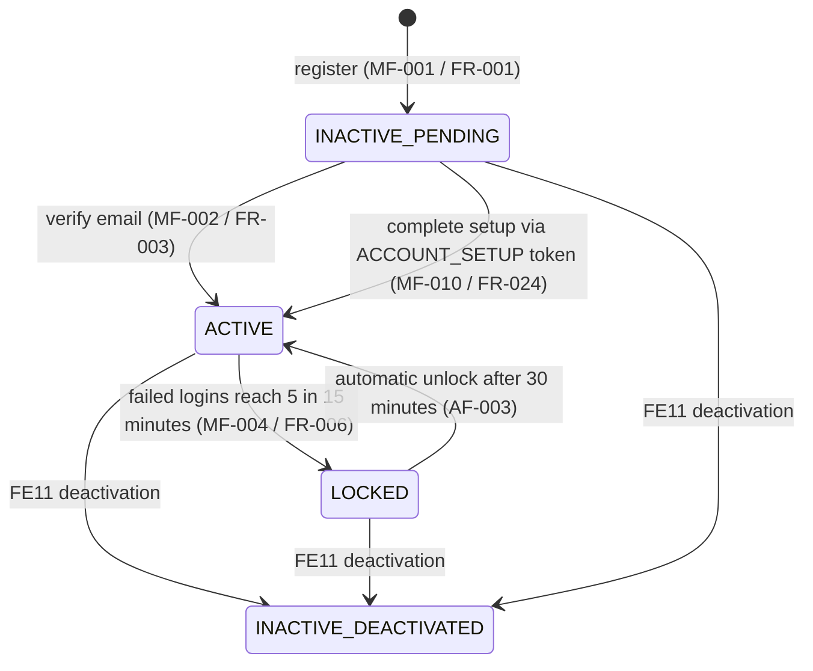

# SPEC.md - Xác thực FE02

## CAPTCHA đăng nhập và đăng ký

- BR-FE02-029: Trước khi tạo tài khoản hoặc xác thực thông tin đăng nhập, Khách phải giải CAPTCHA gồm 4-6 chữ cái Latin do máy chủ phát hành. Máy chủ phải giữ bộ xác minh đáp án, thời hạn và trạng thái đã sử dụng; token công khai phải là giá trị ngẫu nhiên opaque và chỉ hợp lệ cho một lần xác minh.
- FR-FE02-028: `GET /api/auth/captcha` phải trả đúng ba trường công khai `image`, `captchaToken`, `expiresIn`; không được trả thêm trường công khai khác. `image` là ảnh SVG không chứa text hoặc metadata làm lộ đáp án, `captchaToken` là giá trị ngẫu nhiên opaque hết hạn sau 5 phút và `expiresIn` bằng `300`. Cả 4-6 glyph phải hiển thị đầy đủ trong viewport SVG 180x54. Bộ nhớ challenge trong tiến trình phải giới hạn tối đa 5.000 bản ghi cho kiến trúc một instance đã phê duyệt.
- FR-FE02-029: `POST /api/auth/register` và `POST /api/auth/login` phải yêu cầu và tiêu thụ `captchaToken` cùng `captchaAnswer` trước khi dispatch service, so sánh đáp án sau trim và không phân biệt hoa thường.
- FR-FE02-030: CAPTCHA thiếu, hết hạn, không tồn tại, đã dùng, bị replay hoặc sai phải trả `400 CAPTCHA_INVALID`; khi kho challenge đầy, hệ thống phải fail-closed và không dispatch service xác thực. Giao diện phải giữ dữ liệu biểu mẫu, hiển thị lỗi tiếng Việt, thử lại đúng một lần khi lần tải ban đầu thất bại do lỗi mạng/timeout hoặc HTTP `408`/`425`/`429`/`5xx`, không retry lỗi HTTP cố định khác, giữ challenge còn dùng được nếu thao tác đổi mã thủ công thất bại và tải challenge mới sau `CAPTCHA_INVALID`.
- AC-FE02-027: Challenge đúng và còn hạn chỉ cho phép luồng đăng ký/đăng nhập hiện có tiếp tục đúng một lần. Challenge sai hoặc replay không được tạo người dùng, OTP, phiên, bản ghi login failure hoặc audit xác thực.
- EC-FE02-019: Khi API CAPTCHA không tải được lúc khởi tạo do lỗi tạm thời, giao diện thử lại đúng một lần rồi giữ nút gửi đăng nhập/đăng ký ở trạng thái vô hiệu hóa nếu vẫn không có challenge; lỗi HTTP cố định không bị retry. Khi yêu cầu đổi mã thủ công thất bại, challenge còn dùng được không bị xóa; dữ liệu biểu mẫu luôn được giữ nguyên và người dùng vẫn có thể yêu cầu challenge mới.

| Phương thức | Endpoint | Tác nhân | Request | Response | Ghi chú |
| --- | --- | --- | --- | --- | --- |
| GET | `/api/auth/captcha` | Khách | Không có | `{ image: string, captchaToken: string, expiresIn: 300 }` | `image` là SVG data URI không chứa text/metadata đáp án; token là định danh opaque dùng một lần. |
| POST | `/api/auth/register` | Khách | Payload đăng ký hiện có cộng `{ captchaToken: string, captchaAnswer: string }` | Hợp đồng hiện có | Từ chối `400 CAPTCHA_INVALID` trước khi tạo bất kỳ trạng thái nào. |
| POST | `/api/auth/login` | Khách | `{ email: string, password: string, captchaToken: string, captchaAnswer: string }` | Hợp đồng hiện có | Từ chối `400 CAPTCHA_INVALID` trước khi kiểm tra mật khẩu hoặc ghi nhận thất bại đăng nhập. |

# Phiên bản: 0.6.26

# Trạng thái: FE02-T071 H3 REMEDIATION ROUND 2 H2 APPROVED - PENDING EXACT-HEAD CI/H3

# Chủ sở hữu: Dat

# Cập nhật lần cuối: 2026-08-04

# ID tính năng: FE02

# Thư mục tính năng: `.sdd/specs/feat-auth/`

> Trạng thái phân phối được ghi nhận (2026-08-03): `COMPLETE` chỉ áp dụng cho baseline Giai đoạn 1 đã được phê duyệt.
> `TASKS.md` và `.sdd/reviews/phase2-full-exit-validation-2026-07-19.md`
> là nguồn có thẩm quyền về trạng thái triển khai hiện tại. Mục 16 ghi nhận
> bằng chứng nghiệm thu hiện có và các khoảng trống còn lại về tính tuân thủ của kho mã nguồn.
> FE02-T049 và đối soát hợp đồng đã hoàn tất bằng H3 hồi cứu hiện tại tại
> [PR #107](https://github.com/SWP391-LibraryManagement/LibraryManagement/pull/107#issuecomment-5162255705),
> đồng thời giữ rõ rằng PR #60 không có H3 lịch sử. Implementation State là `COMPLETE`;
> amendment PR C vẫn cần H2 vòng 2, CI exact-head và H3 cuối trước merge.

> Nguồn sự thật cho Xác thực FE02. Phiên bản 0.6.22 đóng đối soát FE02-T043 bằng H3 hồi cứu hiện tại có permalink thật, sau khi xác minh commit `241907d`, PR #60 và CI/deploy lịch sử. Không có H3 lịch sử nào được backdate hoặc suy diễn. Đặc tả này được chủ đích viết chi tiết vì FE02 là nền tảng cho mọi cơ chế kiểm soát truy cập và bảo mật của hệ thống.
>
> Các quyết định trong đặc tả này đã được xem xét và phê duyệt trên 2026-06-10. Xem `.sdd/reviews/open-questions-resolution-packet-2026-06-10.md`.
>
> Nhat đã phê duyệt bản sửa đổi OTP của FE02/FE10 và baseline thiết lập tài khoản FE02/FE10/FE11 vào 2026-07-17. Phần triển khai FE02/FE10 đã được hợp nhất qua PR #42-#44 và chịu sự điều chỉnh của ADR-004; tài liệu này ghi lại hợp đồng ràng buộc với bên yêu cầu đã được hợp nhất.

---

## 1. Tổng quan về tính năng

### 1.1 Tên tính năng

Xác thực

### 1.2 Bối cảnh kinh doanh

Xác thực là cơ chế mà Hệ thống Quản lý Thư viện xác minh danh tính người dùng và thiết lập các phiên bảo mật để kiểm soát quyền truy cập. Mọi người dùng (Khách, Thành viên, Thủ thư, Quản trị viên) phải xác thực để có quyền truy cập vào các tính năng được bảo vệ.

Tính năng này là cốt lõi vì xác thực bị xâm phạm có thể làm lộ dữ liệu nhạy cảm, cho phép mượn trái phép, ngăn người dùng hợp pháp truy cập vào hệ thống và tạo ra trách nhiệm kiểm toán.

### 1.3 Mục tiêu / Kết quả

Hệ thống sẽ:

- Cho phép người dùng đăng ký tài khoản bằng xác minh email.
- Cho phép người dùng đăng nhập bằng email/username và mật khẩu.
- Thiết lập sessions/tokens an toàn cho các yêu cầu được xác thực.
- Cho phép người dùng thay đổi mật khẩu một cách an toàn.
- Cho phép người dùng đặt lại mật khẩu đã quên qua email.
- Vô hiệu hóa phiên khi người dùng đăng xuất.
- Thực thi xác thực trên mọi yêu cầu được bảo vệ.
- Duy trì log audit cho mọi sự kiện xác thực.

### 1.4 Mức độ phạm vi

- [x] Đặc tả đầy đủ - logic nghiệp vụ cốt lõi, rủi ro cao, phải đúng ngay từ đầu
- [ ] Đặc tả tiêu chuẩn - tính năng thông thường, có quy tắc nghiệp vụ và bước xác thực dữ liệu
- [ ] Đặc tả rút gọn - UI đơn giản, tài liệu hoặc tính năng ít rủi ro

---

## 2. Tác nhân và quyền

| Tác nhân | Mô tả | Quyền/Trách nhiệm |
| ----- | ----------- | --------------------------- |
| Khách | Khách truy cập chưa được xác thực | Có thể đăng ký, đăng nhập và yêu cầu đặt lại mật khẩu. Không thể truy cập các tính năng dành cho Thành viên/Thủ thư/Quản trị viên. |
| Thành viên | Người dùng đã đăng ký và xác thực với vai trò thành viên | Có thể đăng nhập, đăng xuất, thay đổi mật khẩu, xem hồ sơ. Truy cập các tính năng của thành viên (mượn, đặt chỗ, v.v.). |
| Thủ thư | Người dùng đã xác thực với vai trò thủ thư | Có thể đăng nhập, đăng xuất, thay đổi mật khẩu. Truy cập các tính năng của thủ thư (phê duyệt yêu cầu mượn, xử lý trả sách, v.v.). |
| Quản trị viên | Người dùng được xác thực với vai trò quản trị viên | Có thể đăng nhập, đăng xuất, thay đổi mật khẩu. Truy cập tất cả các tính năng quản trị. |
| Quản lý thông báo FE10 | Phụ thuộc nội bộ | Cung cấp bên yêu cầu gắn với FE02 để xác thực, kết xuất, gửi và ghi nhận an toàn kết quả thông báo xác minh tài khoản và đặt lại mật khẩu. |
| Nhà cung cấp email | Dịch vụ bên ngoài hoặc mock | FE10 gửi email OTP xác minh/đặt lại qua bộ điều hợp nhà cung cấp đã cấu hình; FE02 giữ đường gửi trực tiếp cho `CHANGE_PASSWORD_OTP`. Lỗi nhà cung cấp được xử lý mà không làm lộ OTP thô trong log/audit. |
| Bộ ghi log audit | Thành phần hệ thống | Ghi lại mọi sự kiện xác thực (lần thử đăng nhập, thành công, thất bại, đăng xuất, thay đổi mật khẩu, đặt lại mật khẩu). |

---

## 3. Điều kiện tiên quyết

Tính năng này chỉ có thể bắt đầu khi:

- PRE-FE02-001: Cơ sở dữ liệu có các bảng Users, Roles, UserRoles và AuditLogs.
- PRE-FE02-002: Bên yêu cầu FE10 gắn với FE02 và bộ điều hợp nhà cung cấp đã cấu hình phải sẵn sàng; hoặc sử dụng mock được chèn trong môi trường phát triển/kiểm thử. Dịch vụ email trực tiếp của FE02 vẫn sẵn sàng cho `CHANGE_PASSWORD_OTP`.
- PRE-FE02-003: Thư viện băm mật khẩu (bcrypt) có sẵn trong kho công nghệ.
- PRE-FE02-004: Chiến lược quản lý Session/token là mã thông báo truy cập JWT cộng với thông tin xác thực refresh/session được cơ sở dữ liệu hỗ trợ; các lựa chọn thay thế cookie phiên nằm ngoài phạm vi của Giai đoạn 1.
- PRE-FE02-005: HTTPS được thực thi hoặc có thể được thực thi trong môi trường triển khai.
- PRE-FE02-006: Nhóm đã giải quyết chính sách mật khẩu (độ dài, độ phức tạp) và giá trị thời gian chờ của phiên.

---

## 4. Luồng chính

### MF-FE02-001: Đăng ký người dùng

1. Khách truy cập biểu mẫu đăng ký.
2. Khách nhập tên người dùng, email, mật khẩu, xác nhận mật khẩu và tùy chọn họ tên/số điện thoại.
3. Hệ thống xác thực dữ liệu đầu vào và kiểm tra cả tên người dùng lẫn email chưa được đăng ký trước khi tạo bất kỳ tài khoản hoặc trạng thái OTP xác minh nào.
4. Hệ thống băm mật khẩu bằng bcrypt.
5. Hệ thống tạo bản ghi người dùng với trạng thái `INACTIVE`.
6. Hệ thống gán vai trò `Member` thông qua `UserRoles`; tự đăng ký không thể tạo tài khoản `Librarian` hoặc `Admin`.
7. Hệ thống tạo OTP xác minh email gồm sáu chữ số, có thời hạn 15 phút và chỉ lưu trữ giá trị băm của OTP.
8. FE02 gửi một yêu cầu `ACCOUNT_VERIFICATION` qua `createSourceNotificationRequester('FE02')`; FE10 gửi OTP và chỉ ghi nhận siêu dữ liệu nguồn an toàn, trạng thái cùng thông tin về lần thử.
9. Hệ thống hiển thị bước xác minh OTP và yêu cầu người dùng kiểm tra hộp thư đến của họ.

### MF-FE02-002: Xác minh email (Đăng ký)

1. Người dùng nhập mã xác minh sáu chữ số OTP cùng với email đã đăng ký. Mã thông báo liên kết xác minh kế thừa vẫn được chấp nhận để tương thích.
2. Hệ thống xác thực OTP hoặc mã thông báo cũ (định dạng, thời hạn, khớp với tài khoản tự đăng ký đủ điều kiện đang chờ xử lý).
3. Nếu hợp lệ và tài khoản chưa bị vô hiệu hóa, hệ thống sẽ đặt trạng thái người dùng thành `ACTIVE`.
4. Hệ thống vô hiệu hóa OTP/token.
5. Hệ thống hiển thị thông báo thành công và chuyển hướng đến đăng nhập.

### MF-FE02-003: Đăng nhập người dùng

1. Người dùng (được xác thực hoặc chưa được xác thực) truy cập vào biểu mẫu đăng nhập.
2. Người dùng nhập email/username và mật khẩu.
3. Hệ thống tra cứu người dùng theo email/username.
4. Hệ thống xác minh mật khẩu dựa trên hàm băm được lưu trữ.
5. Nếu mật khẩu đúng đối với tài khoản tự đăng ký vẫn đang chờ xác minh email, hệ thống sẽ trả về `403 EMAIL_VERIFICATION_REQUIRED` cùng với email đã đăng ký, không phát hành phiên nào và máy khách sẽ mở `/verify-email`.
6. Nếu không, hệ thống sẽ kiểm tra trạng thái người dùng (phải là `ACTIVE`, không phải `INACTIVE` hoặc `LOCKED`).
7. Nếu hợp lệ, hệ thống tạo phiên/mã thông báo có thời hạn.
8. Hệ thống lưu trữ hoặc trả về session/token cho máy khách.
9. Hệ thống ghi log audit: đăng nhập thành công.
10. Hệ thống chuyển hướng người dùng đến trang chủ hoặc bảng thông tin thành viên.

### MF-FE02-004: Lần đăng nhập thất bại

1. Người dùng nhập thông tin đăng nhập không hợp lệ.
2. Hệ thống xác minh mật khẩu và phát hiện mật khẩu không khớp.
3. Hệ thống tăng bộ đếm đăng nhập không thành công cho người dùng.
4. Nếu tài khoản đạt 5 lần nhập sai mật khẩu liên tiếp trong cửa sổ trượt 15 phút, hệ thống đặt trạng thái thành `LOCKED` và đặt `lockedUntil` ở thời điểm 30 phút sau sự kiện khóa.
5. Trước khi đạt ngưỡng, hệ thống trả về thông báo chung về thông tin xác thực không hợp lệ. Ở lần thử đạt ngưỡng, hệ thống trả về `ACCOUNT_LOCKED` cùng thời gian khóa còn lại để máy khách đăng nhập vô hiệu hóa thao tác gửi cho đến khi hết thời gian khóa.
6. Hệ thống ghi log audit: đăng nhập thất bại và lý do.

### MF-FE02-005: Người dùng đăng xuất

1. Người dùng đã xác thực yêu cầu đăng xuất (nhấp vào nút đăng xuất hoặc cuộc gọi API).
2. Hệ thống thu hồi thông tin xác thực refresh/session hiện tại và từ chối các yêu cầu được bảo vệ sau này liên quan đến thông tin xác thực bị thu hồi đó.
3. Hệ thống xóa session/token khỏi máy khách (xóa cookie hoặc xóa bộ nhớ cục bộ).
4. Hệ thống ghi log audit: đăng xuất.
5. Hệ thống chuyển hướng đến trang đăng nhập hoặc trang chủ.

### MF-FE02-006: Đổi mật khẩu

1. Người dùng được xác thực truy cập vào biểu mẫu thay đổi mật khẩu và nhập mật khẩu hiện tại và mật khẩu mới hai lần.
2. Hệ thống xác minh mật khẩu hiện tại và xác thực mật khẩu mới theo chính sách đã được phê duyệt.
3. Đối với đường dẫn trực tiếp, hệ thống sẽ băm và cập nhật mật khẩu mới ngay lập tức.
4. Đối với đường dẫn OTP, FE02 phát hành `CHANGE_PASSWORD_OTP` gồm sáu chữ số có mục đích thông qua luồng email trực tiếp của nó; xác nhận chỉ chấp nhận OTP hợp lệ, chưa sử dụng, chưa hết hạn của người dùng đã được xác thực trước khi băm và cập nhật mật khẩu mới.
5. Việc triển khai hiện tại không thu hồi thông tin xác thực refresh/session đang hoạt động khác trong quá trình thay đổi mật khẩu.
6. Hệ thống ghi log audit cho lần thử/kết quả và hiển thị thông báo thành công hoặc thất bại theo cách an toàn.

### MF-FE02-007: Yêu cầu quên mật khẩu

1. Người dùng không được xác thực truy cập vào biểu mẫu quên mật khẩu.
2. Người dùng nhập địa chỉ email của họ.
3. Hệ thống tra cứu người dùng qua email.
4. Chỉ khi tài khoản đã xác minh quyền sở hữu email và có trạng thái `ACTIVE`, hệ thống mới tạo OTP đặt lại mật khẩu gồm sáu chữ số, có thời hạn 15 phút và chỉ lưu trữ giá trị băm của OTP.
5. Với tài khoản đủ điều kiện, FE02 gửi một yêu cầu `PASSWORD_RESET` qua `createSourceNotificationRequester('FE02')`; FE10 gửi OTP và chỉ ghi nhận siêu dữ liệu nguồn an toàn, trạng thái cùng thông tin về lần thử.
6. Hệ thống hiển thị thông báo thành công tương tự cho dù email bị thiếu, không đủ điều kiện hay đủ điều kiện để ngăn chặn việc liệt kê người dùng.

### MF-FE02-008: Đặt lại mật khẩu

1. Người dùng nhập OTP đặt lại gồm sáu chữ số cùng với email được yêu cầu. Mã thông báo đặt lại mật khẩu cũ vẫn được chấp nhận để tương thích.
2. Hệ thống xác thực OTP hoặc mã thông báo kế thừa (định dạng, thời hạn, khớp với hồ sơ người dùng).
3. Nếu hợp lệ, hệ thống hiển thị biểu mẫu đặt lại mật khẩu.
4. Người dùng nhập mật khẩu mới (hai lần).
5. Hệ thống xác thực mật khẩu mới đáp ứng yêu cầu phức tạp.
6. Hệ thống băm mật khẩu mới.
7. Hệ thống cập nhật mật khẩu cho tài khoản `ACTIVE` đủ điều kiện và giữ nguyên các tài khoản không hoạt động hoặc bị khóa.
8. Hệ thống vô hiệu hóa OTP/mã thông báo đặt lại.
9. Hệ thống ghi log audit: đặt lại mật khẩu.
10. Hệ thống hiển thị thông báo thành công và chuyển hướng đến đăng nhập.

### MF-FE02-009: Xác thực Session/Token (Theo yêu cầu)

1. Máy khách gửi yêu cầu API được bảo vệ với session/token trong header/cookie.
2. Hệ thống trích xuất và xác nhận session/token.
3. Hệ thống kiểm tra ngày hết hạn, định dạng và chữ ký (nếu JWT).
4. Nếu hợp lệ, hệ thống sẽ xác định người dùng và cho phép tiếp tục yêu cầu.
5. Nếu không hợp lệ hoặc hết hạn, hệ thống trả về 401 Unauthorized và yêu cầu người dùng đăng nhập lại.

### MF-FE02-010: Hoàn tất thiết lập tài khoản do quản trị viên tạo

1. Người dùng mở liên kết thiết lập FE11 và gửi mã thông báo `ACCOUNT_SETUP` mờ đục cùng với mật khẩu mới và xác nhận.
2. FE02 băm mã thông báo đã gửi và tải bản ghi `ACCOUNT_SETUP` đang hoạt động, chưa được sử dụng, chưa bị thu hồi.
3. FE02 xác nhận mã thông báo chưa hết hạn, thuộc về tài khoản `INACTIVE` do quản trị viên tạo và tài khoản chưa hoàn tất thiết lập.
4. FE02 xác thực mật khẩu mới bằng chính sách mật khẩu FE02 đã được phê duyệt.
5. Trong một giao dịch, FE02 lưu giá trị băm mật khẩu bcrypt, đặt `EmailVerifiedAt` nếu trường này chưa có giá trị, đặt lại các trường khóa do đăng nhập thất bại, chuyển trạng thái thành `ACTIVE`, đánh dấu mã thông báo thiết lập là đã sử dụng, thu hồi mọi mã thông báo thiết lập đang hoạt động khác và ghi sự kiện audit hoàn tất thiết lập.
6. Hệ thống trả về phản hồi thành công an toàn và hướng dẫn người dùng đăng nhập.

---

## 5. Luồng thay thế

### AF-FE02-001: Tên Người Dùng Hoặc Email Đã Được Đăng Ký

1. Khách gửi biểu mẫu đăng ký với tên người dùng hoặc email đang được sử dụng.
2. Hệ thống phát hiện giá trị trùng lặp trước khi gửi OTP xác minh, kể cả khi một đăng ký đồng thời giành quyền ghi sau bước kiểm tra ban đầu.
3. Hệ thống trả về xung đột theo trường cụ thể và giữ người dùng ở biểu mẫu đăng ký.

### AF-FE02-002: Thông tin xác thực email đã hết hạn

1. Người dùng gửi OTP xác minh cũ hoặc liên kết xác minh legacy.
2. Hệ thống phát hiện OTP/token đã hết hạn hoặc không hợp lệ.
3. Hệ thống trả về thông báo hết hạn an toàn và hiển thị hành động xác minh gửi lại đã được phê duyệt.

### AF-FE02-003: Tài khoản bị khóa do đăng nhập thất bại quá nhiều lần

1. Người dùng thực hiện quá nhiều lần đăng nhập không thành công.
2. Hệ thống tự động khóa tài khoản.
3. Hệ thống trả về lỗi: "Tài khoản bị khóa do nhập sai quá nhiều lần. Vui lòng đặt lại mật khẩu hoặc đợi thời gian khóa kết thúc."
4. Tài khoản sẽ tự động mở khóa khi `lockedUntil` hết hạn; việc triển khai đặt lại mật khẩu hiện tại không mở khóa tài khoản `LOCKED`.

### AF-FE02-004: Phiên hết hạn trong hoạt động của người dùng

1. session/token của người dùng hết hạn khi người dùng đang sử dụng hệ thống.
2. Máy khách gửi yêu cầu kèm mã thông báo đã hết hạn.
3. Hệ thống trả về 401 Unauthorized.
4. Máy khách chuyển hướng người dùng đến trang đăng nhập với thông báo: "Phiên của bạn đã hết hạn. Vui lòng đăng nhập lại."

### AF-FE02-005: Đặt lại thông tin xác thực đã được sử dụng

1. Người dùng đặt lại mật khẩu thành công bằng OTP hoặc mã thông báo cũ.
2. Thông tin xác thực đặt lại tương tự sẽ được sử dụng lại.
3. Hệ thống phát hiện OTP/token đã được sử dụng và không hợp lệ.
4. Hệ thống trả về thông báo mã không hợp lệ theo cách an toàn và cung cấp hành động yêu cầu OTP đặt lại mới.

### AF-FE02-006: Mật khẩu mới khớp với mật khẩu cũ

1. Người dùng cố gắng thay đổi mật khẩu thành mật khẩu giống với mật khẩu hiện tại.
2. Hệ thống so sánh mật khẩu đã gửi với hàm băm mật khẩu hiện tại.
3. Hệ thống trả về lỗi: "Mật khẩu mới phải khác với mật khẩu hiện tại. Không sử dụng lại mật khẩu gần đây."

### AF-FE02-007: Mật khẩu không đáp ứng yêu cầu phức tạp

1. Người dùng nhập mật khẩu quá yếu (ví dụ: ít hơn 8 ký tự hoặc thiếu chữ in hoa, số hoặc ký tự đặc biệt).
2. Hệ thống trả về lỗi giải thích mức tối thiểu được phê duyệt: 8 ký tự có ít nhất một chữ in hoa, một số và một ký tự đặc biệt.

---

## 6. Quy tắc kinh doanh

Sử dụng các ID ổn định này cho các nhiệm vụ và bài kiểm tra.

- BR-FE02-001: Khách phải cung cấp email hợp lệ và duy nhất, mật khẩu cùng phần xác nhận để đăng ký; tên người dùng được cung cấp hoặc do hệ thống suy ra cũng phải là duy nhất. Khi request không cung cấp username, hệ thống suy ra username tất định từ phần local trước `@` của email đã chuẩn hóa, không nối hậu tố ngẫu nhiên; xung đột username được trả về theo quy tắc trùng lặp hiện hành.
- BR-FE02-002: Khách không thể truy cập các chức năng dành cho Thành viên/Thủ thư/Quản trị viên nếu chưa đăng nhập.
- BR-FE02-003: Chỉ có thể tạo người dùng trong quy trình đăng ký; người dùng khác không thể được tạo bởi các tác nhân khác trong tính năng này.
- BR-FE02-004: Tài khoản người dùng đã đăng ký phải được xác minh qua email trước khi được kích hoạt.
- BR-FE02-005: Mật khẩu người dùng phải được băm bằng bcrypt (chi phí ≥ 10) trước khi lưu trữ.
- BR-FE02-006: Quá trình xác minh mật khẩu người dùng phải so sánh văn bản gốc đầu vào với hàm băm được lưu trữ, không lưu trữ hoặc truyền văn bản gốc.
- BR-FE02-007: Mã định danh không xác định và mật khẩu không chính xác phải nhận được cùng một từ chối đăng nhập chung. Chỉ sau khi bằng chứng mật khẩu chính xác, tài khoản tự đăng ký đủ điều kiện mới có thể nhận được phản hồi khôi phục cần xác minh được xác định bởi BR-FE02-028.
- BR-FE02-008: Với một tài khoản đã biết, 5 lần nhập sai mật khẩu liên tiếp trong cửa sổ trượt 15 phút sẽ kích hoạt khóa tài khoản. Giới hạn tốc độ đăng nhập trên toàn IP chưa được triển khai trong baseline mã hiện tại.
- BR-FE02-009: Khi đạt đến ngưỡng thử không thành công, hệ thống phải đặt `status = LOCKED`, đặt `lockedUntil` chính xác 30 phút sau sự kiện khóa và từ chối đăng nhập cho đến khi khóa tự động hết hạn. Giai đoạn 1 không có hành động mở khóa quản trị viên.
- BR-FE02-010: Mã thông báo truy cập JWT hết hạn sau 15 phút và mã thông báo làm mới sẽ hết hạn sau 7 ngày.
- BR-FE02-011: Đăng xuất phải thu hồi thông tin xác thực của phiên làm mới hiện tại đã gửi và khiến các yêu cầu được bảo vệ tiếp theo gắn với thông tin xác thực đó không còn được xác thực.
- BR-FE02-012: Mọi yêu cầu được bảo vệ phải xác thực session/token trước khi xử lý.
- BR-FE02-013: Đặt lại mật khẩu và thiết lập tài khoản phải chứng minh quyền sở hữu email thông qua thông tin xác thực dành riêng cho mục đích.
- BR-FE02-014: Mã thông báo đặt lại mật khẩu sẽ hết hạn sau 15 phút. Mã thông báo thiết lập tài khoản do quản trị viên tạo sẽ hết hạn đúng 24 giờ sau khi phát hành.
- BR-FE02-015: Vai trò duy nhất của người dùng được xác định bằng đúng một ánh xạ `UserRoles` và có thể được lưu đệm trong mảng tương thích `roles`, nhưng phải được xác minh lại trong các thao tác nhạy cảm.
- BR-FE02-016: Mọi sự kiện xác thực (lần đăng nhập, đăng nhập thành công, đăng nhập thất bại, đăng xuất, đổi/đặt lại mật khẩu) đều phải được ghi audit.
- BR-FE02-017: Phải bắt buộc dùng HTTPS để truyền thông tin đăng nhập, mật khẩu và mã thông báo; cấm HTTP không mã hóa.
- BR-FE02-018: Người dùng chỉ có thể thay đổi mật khẩu nếu được xác thực.
- BR-FE02-019: Việc thay đổi mật khẩu phải yêu cầu nhập mật khẩu hiện tại để xác minh.
- BR-FE02-020: FE02 sở hữu việc tạo, băm, đặt thời hạn, thu hồi và xác thực OTP dùng cho xác minh/đặt lại, sau đó gửi yêu cầu thông báo chuẩn qua requester gắn với `FE02`. FE10 sở hữu việc kết xuất, gửi qua nhà cung cấp, trạng thái, số lần thử và siêu dữ liệu thông báo an toàn. Phản hồi công khai không được làm lộ OTP xác minh/đặt lại, kể cả trong môi trường phát triển hoặc kiểm thử.
- BR-FE02-021: Mỗi yêu cầu xác minh/đặt lại dùng khóa idempotency lấy từ `AuthTokens.TokenId` đã được lưu; thao tác gửi lại phải thu hồi mã thông báo đang hoạt động, tạo ID mã thông báo mới và gửi một sự kiện thông báo mới.
- BR-FE02-022: Lỗi requester/nhà cung cấp không được hoàn tác việc tạo người dùng, tạo OTP hoặc phản hồi quên mật khẩu chung. FE02 phải cho phép gửi lại để phát hành OTP và sự kiện thông báo mới; đường gửi email trực tiếp cho `CHANGE_PASSWORD_OTP` vẫn tách biệt.
- BR-FE02-023: FE02 sở hữu việc sử dụng, không sở hữu việc phát hành hoặc gửi mã thông báo `ACCOUNT_SETUP` của FE11. FE11 tạo/luân chuyển mã thông báo và FE10 gửi liên kết thiết lập qua requester gắn với `FE11`.
- BR-FE02-024: Thiết lập tài khoản thành công phải cập nhật nguyên tử hàm băm mật khẩu, dấu thời gian xác minh email, các trường khóa, trạng thái `INACTIVE -> ACTIVE`, trạng thái sử dụng/thu hồi mã thông báo thiết lập và bản ghi audit xác thực.
- BR-FE02-025: Quá trình xử lý OTP/token đặt lại mật khẩu không bao giờ được kích hoạt một tài khoản không hoạt động thông thường; chỉ mã thông báo `ACCOUNT_SETUP` hợp lệ mới có thể kích hoạt tài khoản thiết lập do quản trị viên tạo.
- BR-FE02-026: Thay đổi mật khẩu thành công, dù theo luồng trực tiếp hay được OTP xác nhận, đều cập nhật giá trị băm mật khẩu đã lưu và dấu vết audit. `CHANGE_PASSWORD_OTP` vẫn được ràng buộc theo mục đích và do FE02 gửi trực tiếp; baseline mã hiện tại không thu hồi các thông tin xác thực refresh/session đang hoạt động khác.
- BR-FE02-027: OTP xác minh email cho tài khoản tự đăng ký hết hạn đúng 15 phút sau khi phát hành; thao tác gửi lại thu hồi OTP xác minh đang hoạt động trước đó và cấp thông tin xác thực mới có thời hạn 15 phút.
- BR-FE02-028: Tài khoản `INACTIVE`, chưa xác minh, có lịch sử tự đăng ký `EMAIL_VERIFY` và không có lịch sử `ACCOUNT_SETUP` chỉ được tiếp tục xác minh sau khi chứng minh đúng mật khẩu. Luồng đăng nhập không được cấp phiên, phải trả về `403 EMAIL_VERIFICATION_REQUIRED` kèm email đã đăng ký và hướng máy khách đến `/verify-email`; tài khoản đã bị vô hiệu hóa và tài khoản thiết lập do quản trị viên tạo đều không đủ điều kiện.

---

## 7. Yêu cầu chức năng

- FR-FE02-001: Khi Khách gửi dữ liệu đăng ký hợp lệ với tên người dùng và email chưa được sử dụng, hệ thống phải tạo người dùng mới có trạng thái `INACTIVE`.
- FR-FE02-002: Khi người dùng được đăng ký, FE02 phải tạo OTP xác minh gồm sáu chữ số có thời hạn 15 phút, chỉ lưu giá trị băm của OTP và gửi một yêu cầu thông báo `ACCOUNT_VERIFICATION` gắn với FE02, chứa ID mã thông báo cùng dữ liệu mẫu bắt buộc; mã thông báo xác minh legacy vẫn được chấp nhận để bảo đảm tương thích.
- FR-FE02-003: Khi người dùng gửi OTP kèm email xác minh hợp lệ hoặc mã thông báo xác minh legacy hợp lệ cho tài khoản tự đăng ký đủ điều kiện đang chờ xử lý, hệ thống phải kích hoạt tài khoản theo cách nguyên tử, vô hiệu hóa OTP/mã thông báo và ghi audit xác minh; tài khoản đã bị vô hiệu hóa vẫn ở trạng thái không hoạt động và thông tin xác thực không bị sử dụng.
- FR-FE02-004: Khi người dùng gửi biểu mẫu đăng nhập với thông tin xác thực hợp lệ và trạng thái tài khoản đã lưu vẫn là `ACTIVE` tại thời điểm giao dịch đăng nhập được xác nhận, hệ thống phải tạo phiên/mã thông báo và trả về cho máy khách.
- FR-FE02-005: Khi người dùng gửi biểu mẫu đăng nhập bằng email hoặc mật khẩu không hợp lệ, hệ thống sẽ từ chối yêu cầu và không tiết lộ liệu email có tồn tại hay không.
- FR-FE02-006: Khi một tài khoản đã biết và hiện có trạng thái `ACTIVE` đạt 5 lần nhập sai mật khẩu liên tiếp trong cửa sổ trượt 15 phút, hệ thống phải đặt `LOCKED` theo cách nguyên tử, đặt `lockedUntil` ở thời điểm 30 phút sau sự kiện khóa, trả về `ACCOUNT_LOCKED` cùng `retryAfterSeconds` và từ chối các lần đăng nhập tiếp theo cho đến khi mở khóa; máy khách đăng nhập phải vô hiệu hóa thao tác gửi trong khoảng thời gian do máy chủ cung cấp, và thao tác ghi nhận đăng nhập thất bại không được ghi đè thay đổi đồng thời đưa tài khoản sang trạng thái kết thúc.
- FR-FE02-007: Khi người dùng yêu cầu đăng xuất, hệ thống phải vô hiệu hóa phiên/mã thông báo ngay lập tức.
- FR-FE02-008: Khi người dùng thực hiện một yêu cầu được bảo vệ, hệ thống sẽ xác thực mã thông báo truy cập, trạng thái người dùng `ACTIVE` hiện tại, thông tin xác thực refresh/session đang hoạt động được liên kết, thời hạn sử dụng và các vai trò phía máy chủ hiện tại trước khi cho phép yêu cầu.
- FR-FE02-009: Khi mã thông báo truy cập hoặc thông tin xác thực phiên/làm mới liên kết bị thiếu, không hợp lệ, hết hạn, bị thu hồi, thuộc về người dùng khác hoặc người dùng hiện tại không còn là `ACTIVE`, hệ thống trả về 401 Unauthorized trước khi xử lý thao tác được bảo vệ.
- FR-FE02-010: Khi người dùng được xác thực gửi biểu mẫu thay đổi mật khẩu, hệ thống sẽ xác minh mật khẩu hiện tại và xác thực mật khẩu mới gồm 8..255 ký tự theo chính sách phức tạp đã được phê duyệt. Đường dẫn trực tiếp cập nhật nó ngay lập tức; đường dẫn OTP chỉ cập nhật nó sau khi cùng một người dùng được xác thực xác nhận một `CHANGE_PASSWORD_OTP` có mục đích hợp lệ, chưa sử dụng, chưa hết hạn.
- FR-FE02-011: Khi Khách gửi yêu cầu quên mật khẩu cho tài khoản đã xác minh quyền sở hữu email và có trạng thái `ACTIVE`, FE02 phải tạo OTP đặt lại mật khẩu gồm sáu chữ số có thời hạn 15 phút, chỉ lưu giá trị băm của OTP và gửi một yêu cầu thông báo `PASSWORD_RESET` gắn với FE02, chứa ID mã thông báo cùng dữ liệu mẫu bắt buộc; mọi email không đủ điều kiện hoặc không xác định đều nhận cùng một phản hồi công khai chung và không tạo mã thông báo.
- FR-FE02-012: Khi người dùng gửi OTP và email đặt lại hợp lệ hoặc mã thông báo đặt lại mật khẩu cũ hợp lệ cùng với mật khẩu mới, hệ thống sẽ cập nhật mật khẩu cho tài khoản `ACTIVE` đủ điều kiện và vô hiệu hóa thông tin xác thực đặt lại mà không kích hoạt tài khoản `INACTIVE` hoặc mở khóa tài khoản `LOCKED`.
- FR-FE02-013: Khi Khách hoàn tất tự đăng ký, hệ thống chỉ gán chính xác vai trò `Member` thông qua `UserRoles`; tài khoản Thủ thư và Quản trị viên chỉ do FE11 tạo.
- FR-FE02-014: Khi kiểm tra quyền của người dùng, hệ thống sẽ truy xuất vai trò đơn hiện tại của người dùng từ `UserRoles` và thực thi vai trò đó ở phía máy chủ đối với các hoạt động được bảo vệ; mảng `roles` tương thích chứa chính xác một mục.
- FR-FE02-022: Khi FE02 yêu cầu gửi OTP xác minh/đặt lại, tính năng chỉ gửi yêu cầu chuẩn gắn với FE02, không ghi log OTP thô và giữ ngữ nghĩa phản hồi công khai an toàn. FE10 sở hữu việc gửi qua nhà cung cấp; các route công khai không làm lộ trường debug chứa OTP xác minh/đặt lại, kể cả trong kiểm thử.

### 7.1 Yêu cầu về hành vi không mong muốn (EARS)

Các yêu cầu sau đây chính thức hóa các nhánh xử lý lỗi và tình trạng bất thường đã được mô tả trong Phần 5 (Luồng thay thế), 6 (Quy tắc kinh doanh) và 9 (Trường hợp biên). Mỗi cái được thể hiện bằng EARS Cú pháp không mong muốn (`IF ...` / `WHERE ...`) và truy ngược về nguồn AF/EC/BR.

- FR-FE02-015: NẾU Khách gửi dữ liệu đăng ký với tên người dùng hoặc email đã được đăng ký, kể cả khi một thao tác chèn đồng thời giành quyền ghi sau bước kiểm tra trùng lặp ban đầu, hệ thống phải từ chối đăng ký bằng `USERNAME_ALREADY_REGISTERED` hoặc `EMAIL_ALREADY_REGISTERED`, giữ máy khách ở biểu mẫu đăng ký với phản hồi theo trường cụ thể và không tạo người dùng, mã thông báo xác minh hay yêu cầu gửi OTP. (Nguồn: AF-FE02-001, EC-FE02-003, BR-FE02-001)
- FR-FE02-016: NẾU người dùng gửi OTP/mã thông báo xác minh email đã hết hạn, sai định dạng hoặc không khớp với bất kỳ bản ghi người dùng nào, hệ thống phải từ chối kích hoạt, giữ tài khoản ở trạng thái `INACTIVE` và cung cấp hành động gửi lại email xác minh mới. (Nguồn: AF-FE02-002, BR-FE02-004)
- FR-FE02-017: NẾU người dùng cố gắng đăng nhập vào tài khoản có trạng thái là `LOCKED`, hệ thống sẽ từ chối đăng nhập và trả về thông báo khóa tài khoản hướng dẫn người dùng đặt lại mật khẩu của họ hoặc đợi cho đến khi `lockedUntil` trôi qua. (Nguồn: AF-FE02-003, BR-FE02-009)
- FR-FE02-018: NẾU người dùng gửi thông tin xác thực đặt lại mật khẩu hoặc thiết lập tài khoản đã được sử dụng, hết hạn hoặc không khớp với người dùng đủ điều kiện, hệ thống sẽ từ chối yêu cầu và trả lại thông báo mã không hợp lệ an toàn mà không thay đổi bất kỳ mật khẩu nào. (Nguồn: AF-FE02-005, BR-FE02-014)
- FR-FE02-019: NẾU mật khẩu mới đã gửi (trong quá trình đăng ký, thay đổi hoặc đặt lại) không đáp ứng chính sách độ phức tạp đã định cấu hình, hệ thống sẽ từ chối thao tác và trả về lỗi yêu cầu độ phức tạp mà không duy trì mật khẩu. (Nguồn: AF-FE02-007, BR-FE02-005, Q-FE02-001)
- FR-FE02-020: NẾU người dùng được xác thực cố gắng thay đổi mật khẩu của họ thành giá trị giống với mật khẩu hiện tại, hệ thống sẽ từ chối thay đổi và trả về thông báo "Mật khẩu mới phải khác với mật khẩu hiện tại." (Nguồn: AF-FE02-006)
- FR-FE02-021: NẾU một yêu cầu được bảo vệ cung cấp phiên/mã thông báo sai định dạng, có chữ ký không hợp lệ hoặc đã hết hạn, hệ thống phải từ chối yêu cầu với 401 Unauthorized và không xử lý thao tác được yêu cầu. (Nguồn: AF-FE02-004, EC-FE02-014, BR-FE02-012)
- FR-FE02-023: NẾU requester hoặc nhà cung cấp email gắn với FE02 gửi OTP xác minh/đặt lại thất bại, FE02 phải giữ nguyên giao dịch nguồn đã hoàn thành và ngữ nghĩa phản hồi công khai, không ghi OTP thô vào log/audit và cho phép gửi lại để tạo sự kiện mã thông báo OTP mới. (Nguồn: EC-FE02-009, BR-FE02-022)
- FR-FE02-024: Khi người dùng gửi mã thông báo FE11 `ACCOUNT_SETUP` hợp lệ và mật khẩu tuân thủ, FE02 sẽ hoàn tất quá trình thiết lập và kích hoạt tài khoản theo MF-FE02-010.
- FR-FE02-025: NẾU mã thông báo `ACCOUNT_SETUP` không hợp lệ, hết hạn, đã sử dụng, bị thu hồi, thuộc về tài khoản không đủ điều kiện hoặc thua một yêu cầu hoàn tất đồng thời, FE02 phải từ chối thiết lập mà không thay đổi mật khẩu, trạng thái tài khoản, trạng thái mã thông báo hoặc trạng thái audit thành công.
- FR-FE02-026: Khi máy khách gửi mã thông báo làm mới hợp lệ, chưa hết hạn mà không có mã thông báo truy cập, FE02 cấp mã thông báo truy cập mới có thời hạn 15 phút và trả lại nguyên trạng mã thông báo làm mới đã gửi; mã thông báo làm mới đã hết hạn, đã sử dụng hoặc bị thu hồi trả về `401 Unauthorized`.
- FR-FE02-027: Khi thông tin xác thực chính xác xác định một tài khoản tự đăng ký vẫn đang chờ xác minh email, FE02 phải từ chối phát hành mã thông báo bằng `403 EMAIL_VERIFICATION_REQUIRED` chứa email đã đăng ký và máy khách phải điều hướng đến `/verify-email`; nhánh này không áp dụng cho tài khoản đã bị vô hiệu hóa hoặc tài khoản `ACCOUNT_SETUP`.

---

## 8. Tiêu chí chấp nhận

- AC-FE02-001: Cho trước dữ liệu đăng ký hợp lệ cùng tên người dùng và email chưa được sử dụng, khi Khách đăng ký thì hệ thống tạo người dùng không hoạt động, lưu giá trị băm OTP xác minh và yêu cầu gửi; nếu một trong hai giá trị đã tồn tại, hệ thống trả về phản hồi theo trường cụ thể trước khi gửi OTP và giữ biểu mẫu đăng ký hoạt động.
- AC-FE02-002: Với thông tin xác thực hợp lệ của tài khoản tự đăng ký đang chờ xử lý và đủ điều kiện, khi người dùng gửi thông tin xác thực đó, hệ thống phải xác nhận nguyên tử việc kích hoạt, sử dụng thông tin xác thực và ghi audit xác minh; sau đó người dùng có thể đăng nhập. Cả OTP và mã thông báo xác minh legacy đều phải từ chối tài khoản đã bị vô hiệu hóa mà không sử dụng thông tin xác thực.
- AC-FE02-003: Cho trước OTP/mã thông báo xác minh đã hết hạn, khi người dùng gửi thông tin xác thực đó thì hệ thống từ chối và cung cấp hành động gửi lại.
- AC-FE02-004: Với email, mật khẩu hợp lệ và tài khoản đang hoạt động, khi người dùng đăng nhập, hệ thống trả về phiên/mã thông báo hợp lệ.
- AC-FE02-005: Email không hợp lệ, khi người dùng đăng nhập hệ thống báo lỗi không hiển thị email tồn tại.
- AC-FE02-006: Email hợp lệ nhưng mật khẩu không hợp lệ, khi người dùng đăng nhập, hệ thống trả về lỗi và tăng bộ đếm lần thử không thành công.
- AC-FE02-007: Với tài khoản không hoạt động và không đủ điều kiện để tự khôi phục đăng ký, khi người dùng đăng nhập, hệ thống sẽ từ chối đăng nhập mà không hiển thị trạng thái xác minh.
- AC-FE02-008: Cho trước lần nhập sai mật khẩu thứ năm hoặc tài khoản có khóa theo thời gian chưa hết hạn, khi người dùng đăng nhập thì hệ thống trả về thông báo khóa tài khoản cùng thời gian khóa còn lại, và nút đăng nhập vẫn bị vô hiệu hóa cho đến khi khoảng thời gian đó kết thúc.
- AC-FE02-009: Cho trước một mã thông báo truy cập hợp lệ, được liên kết với thông tin xác thực refresh/session đang hoạt động của người dùng hiện có trạng thái `ACTIVE`, khi người dùng gửi yêu cầu được bảo vệ thì hệ thống tải các vai trò hiện tại ở phía máy chủ và cho phép yêu cầu.
- AC-FE02-010: Với mã thông báo truy cập không hợp lệ/hết hạn, thông tin xác thực phiên/làm mới liên kết không hợp lệ, hết hạn, bị thu hồi hoặc sai người dùng, hoặc người dùng hiện tại không có trạng thái `ACTIVE`, khi có yêu cầu được bảo vệ, hệ thống trả về 401 Unauthorized trước khi xử lý nghiệp vụ.
- AC-FE02-011: Với người dùng đã được xác thực, khi người dùng đăng xuất, session/token sẽ bị vô hiệu.
- AC-FE02-012: Cho trước người dùng đã xác thực và cung cấp đúng mật khẩu hiện tại, khi người dùng hoàn tất luồng trực tiếp hoặc luồng xác nhận OTP hợp lệ, hệ thống cập nhật mật khẩu và trả về thành công mà không thu hồi các thông tin xác thực refresh/session đang hoạt động khác.
- AC-FE02-013: Cung cấp mật khẩu hiện tại không chính xác hoặc `CHANGE_PASSWORD_OTP` không hợp lệ, hết hạn, được sử dụng hoặc sai người dùng, khi người dùng được xác thực thử bước thay đổi mật khẩu tương ứng thì hệ thống sẽ từ chối thay đổi mà không cập nhật mật khẩu.
- AC-FE02-014: Cho trước email hợp lệ của một tài khoản đã đăng ký và đang hoạt động, khi người dùng yêu cầu đặt lại mật khẩu, FE02 lưu giá trị băm OTP đặt lại, gửi một yêu cầu thông báo gắn với FE02 và FE10 đồng bộ thử gửi qua nhà cung cấp, đồng thời ghi nhận `SENT` hoặc `FAILED`; nếu nhà cung cấp chấp nhận thành công thì một email chứa OTP đặt lại gồm sáu chữ số được gửi đi.
- AC-FE02-015: Email đăng ký không hợp lệ, khi người dùng yêu cầu đặt lại mật khẩu thì hệ thống trả về thông báo thành công (không liệt kê người dùng).
- AC-FE02-016: Cho trước OTP kèm email đặt lại hợp lệ hoặc mã thông báo đặt lại mật khẩu legacy của tài khoản `ACTIVE` đủ điều kiện, khi người dùng gửi mật khẩu mới thì hệ thống cập nhật mật khẩu, vô hiệu hóa thông tin xác thực đặt lại và không bao giờ kích hoạt tài khoản `INACTIVE` hoặc mở khóa tài khoản `LOCKED`.
- AC-FE02-017: OTP/token được đặt lại đã hết hạn, khi người dùng gửi mật khẩu mới, hệ thống sẽ từ chối yêu cầu.
- AC-FE02-018: OTP/token được đặt lại được sử dụng một lần, khi thông tin xác thực tương tự được sử dụng lại thì hệ thống sẽ từ chối yêu cầu.
- AC-FE02-019: Với trường hợp nhà cung cấp email hoặc requester gắn với FE02 thất bại sau khi tạo OTP xác minh/đặt lại, khi FE02 hoàn tất yêu cầu nguồn, trạng thái người dùng/mã thông báo vẫn hợp lệ, không có OTP thô nào bị ghi log và luồng gửi lại có thể tạo mã thông báo mới.
- AC-FE02-020: Với mã thông báo `ACCOUNT_SETUP` FE11 hợp lệ, chưa sử dụng cho tài khoản không hoạt động do quản trị viên tạo, khi người dùng gửi mật khẩu đáp ứng chính sách, hệ thống phải xác nhận nguyên tử mật khẩu, dấu thời gian xác minh, các trường khóa, trạng thái, việc sử dụng mã thông báo và bản ghi audit.
- AC-FE02-021: Cho trước mã thông báo thiết lập không hợp lệ, hết hạn, đã sử dụng, bị thu hồi, không đủ điều kiện hoặc đã bị một yêu cầu đồng thời sử dụng, khi yêu cầu thiết lập được gửi thì FE02 từ chối mã đó và không lưu bất kỳ trạng thái kích hoạt một phần nào.
- AC-FE02-022: Với trường hợp Khách hoàn tất tự đăng ký, khi giao dịch tài khoản được xác nhận, hệ thống gán chính xác vai trò `Member` thông qua `UserRoles` và không tạo vai trò Thủ thư/Quản trị viên.
- AC-FE02-023: Cho trước một thao tác được bảo vệ, khi hệ thống đánh giá quyền thì máy chủ sử dụng các phép gán `UserRoles` hiện tại của người dùng và không tin cậy vai trò do máy khách cung cấp.
- AC-FE02-024: Với request `/api` hoặc `/api/*` truyền credential/token qua HTTP không mã hóa trong môi trường triển khai, khi yêu cầu đến, hệ thống phải chuyển hướng sang HTTPS hoặc từ chối trước khi parse body hoặc dispatch route; liveness/readiness và static asset ngoài namespace API không bị gate này chặn.
- AC-FE02-025: Với mã thông báo làm mới hợp lệ và không có mã thông báo truy cập, khi máy khách yêu cầu làm mới, hệ thống trả về mã thông báo truy cập mới có thời hạn 15 phút và chính mã thông báo làm mới đã gửi.
- AC-FE02-026: Cho trước thông tin xác thực chính xác của tài khoản tự đăng ký có email chưa được xác minh, khi người dùng đăng nhập thì không có mã thông báo nào được phát hành và máy khách mở `/verify-email` với email đã đăng ký; mật khẩu sai, tài khoản bị vô hiệu hóa và tài khoản thiết lập do quản trị viên tạo không đi vào luồng này.

---

## 9. Trường hợp biên và xử lý lỗi

| ID | Trường hợp biên / Lỗi | Hành vi hệ thống mong đợi |
| -- | ----------------- | ------------------------ |
| EC-FE02-001 | Đăng ký với payload SQL injection trong email | Làm sạch đầu vào và từ chối vì định dạng email không hợp lệ. |
| EC-FE02-002 | Đăng ký bằng mật khẩu dài hơn 255 ký tự | Từ chối với lỗi xác thực trường và không tạo tài khoản. |
| EC-FE02-003 | Cố đăng ký trùng cùng tên người dùng hoặc email, kể cả các yêu cầu đồng thời chạy đua sau bước kiểm tra trùng lặp ban đầu | Từ chối bằng `409 USERNAME_ALREADY_REGISTERED` hoặc `409 EMAIL_ALREADY_REGISTERED` tương ứng; giữ biểu mẫu đăng ký hoạt động và không tạo thêm trạng thái người dùng/mã thông báo/gửi thông báo. |
| EC-FE02-004 | Đăng ký người dùng bằng email chứa dấu cách hoặc ký tự đặc biệt | Xác thực định dạng email một cách nghiêm ngặt. |
| EC-FE02-005 | Thử đăng nhập bằng cách tiêm SQL vào trường tên người dùng | Sử dụng các truy vấn được tham số hóa; từ chối vì không hợp lệ. |
| EC-FE02-006 | Người dùng khóa tài khoản của chính mình do vượt quá số lần đăng nhập thất bại | Cung cấp đặt lại mật khẩu hoặc đợi đến `lockedUntil`; Giai đoạn 1 không có hành động mở khóa quản trị viên. |
| EC-FE02-007 | Nhiều yêu cầu đặt lại mật khẩu liên tiếp từ cùng một người dùng | Mã thông báo trước đó không còn hiệu lực, cho phép yêu cầu đặt lại mới. |
| EC-FE02-008 | Người dùng thay đổi mật khẩu khi đang có phiên hoạt động | Chỉ cập nhật mật khẩu; thông tin xác thực refresh/session hiện có vẫn hoạt động trong baseline mã hiện tại. |
| EC-FE02-009 | Requester hoặc nhà cung cấp email gắn với FE02 không gửi được OTP xác minh/đặt lại | Giữ nguyên người dùng/mã thông báo đã tạo và ngữ nghĩa phản hồi công khai, không ghi OTP thô vào log/audit và cho phép gửi lại để tạo sự kiện mã thông báo OTP mới. |
| EC-FE02-010 | Cập nhật băm mật khẩu không thành công trong cơ sở dữ liệu | Quay lại giao dịch; trả lại lỗi cho người dùng. |
| EC-FE02-011 | Thư viện tạo mã thông báo thất bại | Trả về lỗi 500; ghi log sự cố; đề nghị người dùng thử lại. |
| EC-FE02-012 | Người dùng khiếu nại email đã bị xâm phạm và yêu cầu đăng xuất ngay lập tức khỏi tất cả các phiên | Giai đoạn 1 không có quy trình thu hồi mã thông báo quản trị viên hoặc đăng xuất toàn cầu; các phiên hiện tại phải được thu hồi riêng lẻ hoặc hết hạn. |
| EC-FE02-013 | Thay đổi đồng thời trạng thái đăng nhập/tài khoản của cùng một người dùng | Chỉ cho phép phiên khi trạng thái tài khoản được lưu hiện tại vẫn đủ điều kiện; không tạo phiên hoặc ghi đè trạng thái không hoạt động/bị khóa mới hơn. |
| EC-FE02-014 | Máy khách gửi mã thông báo JWT sai định dạng | Trả về 401 Unauthorized. |
| EC-FE02-015 | Đồng hồ lệch giữa xác thực mã thông báo máy chủ và máy khách | Sử dụng dung sai xác thực cố định trong 30 giây. |
| EC-FE02-016 | Hai yêu cầu hoàn tất thiết lập đồng thời dùng cùng một mã thông báo | Chính xác một giao dịch thành công; giao dịch còn lại nhận lỗi thông tin xác thực không hợp lệ/đã sử dụng an toàn. |
| EC-FE02-017 | Thông tin xác thực đặt lại mật khẩu nhắm mục tiêu tài khoản không hoạt động | Từ chối thiết lập lại; không kích hoạt. Kích hoạt tài khoản yêu cầu `ACCOUNT_SETUP`. |
| EC-FE02-018 | Người dùng đóng đăng ký trước khi hoàn tất xác minh email, sau đó gửi thông tin đăng nhập chính xác | Trả lại `403 EMAIL_VERIFICATION_REQUIRED` mà không cần phiên và mở `/verify-email` bằng email đã đăng ký. |
| EC-FE02-019 | API CAPTCHA không tải được hoặc challenge đã mất sau khi backend khởi động lại | Vô hiệu hóa nút gửi đăng nhập/đăng ký, giữ nguyên dữ liệu biểu mẫu và cho phép người dùng yêu cầu challenge mới. |

---

## 10. Yêu cầu về dữ liệu

### 10.1 Các thực thể có liên quan

| Thực thể | Mục đích trong tính năng này |
| ------ | ----------------------- |
| Users | Lưu trữ tài khoản người dùng, email, hàm băm mật khẩu, trạng thái và siêu dữ liệu. |
| Roles | Xác định tên vai trò (Thành viên, Thủ thư, Quản trị viên) và mô tả. |
| UserRoles | Ánh xạ người dùng tới các vai trò. |
| AuthTokens | Lưu trữ hàm băm và siêu dữ liệu vòng đời để xác minh OTP, thông tin xác thực đặt lại mật khẩu, thông tin xác thực thiết lập tài khoản, mã thông báo làm mới và OTP thay đổi mật khẩu. |
| LoginFailureAttempts | Lưu các lần đăng nhập thất bại có dấu thời gian của tài khoản đã biết để áp dụng cửa sổ khóa trượt 15 phút. |
| AuditLogs | Ghi lại tất cả các sự kiện xác thực. |

### 10.2 Trường dữ liệu

| Trường | Kiểu | Bắt buộc | Validation / Ghi chú |
| ----- | ---- | -------- | ------------------ |
| userId | số nguyên | Có | Khóa chính. |
| email | chuỗi | Có | Định dạng email duy nhất, hợp lệ, tối đa 255 ký tự. |
| username | chuỗi | Không | Trường đăng nhập thay thế duy nhất, dài 3..50 ký tự khi được cung cấp; nếu không, giá trị được suy ra tất định từ phần local trước `@` của email đã chuẩn hóa và không có hậu tố ngẫu nhiên. |
| passwordHash | chuỗi | Có | băm bcrypt, không bao giờ là văn bản gốc. Trước khi thiết lập, FE11 lưu trữ hàm băm bcrypt không thể sử dụng được của giá trị ngẫu nhiên do máy chủ tạo ra bị loại bỏ; giữ chỗ theo nghĩa đen cố định bị cấm. |
| fullName | chuỗi | Không | Tên hiển thị của người dùng. |
| phoneNumber | chuỗi | Không | Số điện thoại của người dùng. |
| address | chuỗi | Không | Địa chỉ của người dùng. |
| status | enum | Có | Các giá trị: `ACTIVE`, `INACTIVE`, `LOCKED`, khớp với ràng buộc hiện tại của bảng Users. |
| createdAt | ngày giờ | Có | Dấu thời gian tạo tài khoản. |
| updatedAt | ngày giờ | Không | Việc cho phép lưu giá trị null vẫn tương thích với các hàng legacy. Phản hồi người dùng do FE11 quản lý cung cấp phiên bản kiểm soát đồng thời không null `COALESCE(Users.UpdatedAt, Users.CreatedAt)`; hành vi xác thực FE02 không thay đổi. |
| lastLoginAt | ngày giờ | Không | Dấu thời gian đăng nhập thành công lần cuối (để kiểm tra). |
| failedLoginCount | số nguyên | Không | Bộ đếm số lần đăng nhập thất bại. |
| lockedUntil | ngày giờ | Không | Dấu thời gian khi tài khoản sẽ tự động mở khóa. |
| deactivatedAt | ngày giờ | Không | Dấu thời gian của máy chủ do FE11 đặt khi tài khoản có thể sử dụng trước đó bị vô hiệu hóa; null đối với các tài khoản đang chờ kích hoạt hoặc hiện đang hoạt động. |
| tokenId | số nguyên | Có điều kiện | Khóa chính `AuthTokens`; được sử dụng để xác định và sử dụng thông tin xác thực lâu dài. |
| tokenType | enum/string | Có điều kiện | Phân biệt các mục đích: OTP xác minh, đặt lại mật khẩu, thiết lập tài khoản, làm mới và OTP thay đổi mật khẩu chỉ dành cho tương thích. |
| tokenHash | chuỗi | Có điều kiện | Băm của OTP/token thô; thông tin xác thực thô không bao giờ được tồn tại. |
| expiresAt | ngày giờ | Có điều kiện | Hết hạn thông tin xác thực do máy chủ thực thi. Xác minh OTP và đặt lại mật khẩu OTP là 15 phút; thiết lập tài khoản là 24 giờ. |
| usedAt | ngày giờ | Không | Đặt thời điểm sử dụng thông tin xác thực một lần. |
| revokedAt | ngày giờ | Không | Đặt khi thông tin xác thực cũ bị vô hiệu hoặc mã thông báo làm mới bị thu hồi. |

### 10.3 Quy tắc chuyển đổi và mô hình trạng thái (tài khoản người dùng)

Tiểu mục này chính thức hóa vòng đời của trường `User.status` được lưu (xem Trường dữ liệu 10.2). Tập trạng thái cơ sở dữ liệu được cố định thành `ACTIVE`, `INACTIVE` và `LOCKED`. `INACTIVE` có hai chế độ logic rõ ràng: `PENDING_ACTIVATION` khi `deactivatedAt` là null và tài khoản chưa hoàn tất xác minh/thiết lập, và `DEACTIVATED` khi `deactivatedAt` khác null. Các chế độ logic này không phải giá trị enum bổ sung trong cơ sở dữ liệu.

#### a) Sơ đồ trạng thái

```mermaid
stateDiagram-v2
    [*] --> INACTIVE_PENDING : register (MF-001 / FR-001)
    INACTIVE_PENDING --> ACTIVE : verify email (MF-002 / FR-003)
    INACTIVE_PENDING --> ACTIVE : complete setup via ACCOUNT_SETUP token (MF-010 / FR-024)
    ACTIVE --> LOCKED : failed logins reach 5 in 15 minutes (MF-004 / FR-006)
    LOCKED --> ACTIVE : automatic unlock after 30 minutes (AF-003)
    ACTIVE --> INACTIVE_DEACTIVATED : FE11 deactivation
    LOCKED --> INACTIVE_DEACTIVATED : FE11 deactivation
    INACTIVE_PENDING --> INACTIVE_DEACTIVATED : FE11 deactivation
```

#### b) Ý nghĩa trạng thái

| Trạng thái | Ý nghĩa |
| ----- | ------- |
| INACTIVE | Tài khoản không thể đăng nhập. `deactivatedAt = null` nghĩa là `PENDING_ACTIVATION`; `deactivatedAt != null` nghĩa là `DEACTIVATED`. |
| ACTIVE | Tài khoản đã được xác thực và đang hoạt động. Đây là trạng thái duy nhất được phép đăng nhập thành công. |
| LOCKED | Tài khoản tự động bị khóa do vượt ngưỡng đăng nhập sai. Không thể đăng nhập cho đến khi được mở khóa. |

#### c) Chuyển đổi hợp lệ

| Từ | Đến | Kích hoạt / Sự kiện | Điều kiện | FR / BR liên quan |
| ---- | -- | --------------- | --------- | ----------------- |
| `[*]` (không có) | INACTIVE/PENDING_ACTIVATION | Khách đăng ký tài khoản | Dữ liệu đăng ký hợp lệ, email chưa tồn tại | MF-FE02-001, FR-FE02-001, BR-FE02-001, BR-FE02-004 |
| INACTIVE/PENDING_ACTIVATION | ACTIVE | Người dùng xác minh email | Mã thông báo xác minh hợp lệ, chưa hết hạn (15 phút), khớp người dùng | MF-FE02-002, FR-FE02-003, BR-FE02-004, BR-FE02-027 |
| INACTIVE/PENDING_ACTIVATION | ACTIVE | Hoàn tất thiết lập mật khẩu cho tài khoản do quản trị viên tạo | `ACCOUNT_SETUP` hợp lệ, chưa sử dụng/chưa thu hồi, `deactivatedAt` là null | MF-FE02-010, FR-FE02-024, BR-FE02-023, BR-FE02-024 |
| ACTIVE | LOCKED | Số lần đăng nhập sai đạt ngưỡng | failedLoginCount đạt 5 trong cửa sổ trượt 15 phút | MF-FE02-004, FR-FE02-006, BR-FE02-008, BR-FE02-009 |
| LOCKED | ACTIVE | Tự động mở khóa sau 30 phút | Thời điểm hiện tại đã qua `lockedUntil` | AF-FE02-003, EC-FE02-006 |
| ACTIVE | INACTIVE/DEACTIVATED | FE11 vô hiệu hóa | `deactivatedAt` được ghi bởi FE11; FE02 không tự động thực hiện quá trình chuyển đổi này | FE11 BR-FE11-006 |
| LOCKED | INACTIVE/DEACTIVATED | FE11 vô hiệu hóa | `deactivatedAt` được ghi bởi FE11; FE02 không tự động thực hiện quá trình chuyển đổi này | FE11 BR-FE11-006 |

#### d) Chuyển đổi không hợp lệ (bị cấm)

- INACTIVE/DEACTIVATED → ACTIVE: tài khoản đã bị vô hiệu hóa FE11 không thể kích hoạt lại trong Giai đoạn 1; việc kích hoạt lại nằm ngoài phạm vi của FE11.
- INACTIVE/PENDING_ACTIVATION → LOCKED: tài khoản chưa kích hoạt không thể đăng nhập, do đó không thể tích lũy đủ số lần đăng nhập sai để khóa (MF-FE02-003 b5, BR-FE02-002).
- LOCKED → ACTIVE khi chưa thỏa điều kiện mở khóa: không được tự động chuyển về ACTIVE nếu chưa đủ thời gian tự động mở khóa (AF-FE02-003).
- INACTIVE → ACTIVE bằng thao tác đăng nhập: đăng nhập không kích hoạt tài khoản; chỉ xác minh email hoặc hoàn tất thiết lập mới chuyển sang ACTIVE (FR-FE02-003, Q-FE02-008).
- INACTIVE / LOCKED → đăng nhập thành công: chỉ ACTIVE mới được đăng nhập (MF-FE02-003 b5, FR-FE02-005, FR-FE02-017, Q-FE02-008).

#### e) Bất biến (bất biến luôn đúng)

- INV-FE02-001: Một người dùng luôn có đúng một giá trị `status` tại mỗi thời điểm, thuộc tập {ACTIVE, INACTIVE, LOCKED}. `deactivatedAt` phân biệt hai chế độ INACTIVE logic. (10.2)
- INV-FE02-002: Chỉ tài khoản có `status = ACTIVE` mới có thể đăng nhập thành công. (MF-FE02-003 b5, FR-FE02-004, Q-FE02-008)
- INV-FE02-003: Tạo tài khoản mới qua đăng ký luôn bắt đầu ở `INACTIVE`, không bao giờ ở `ACTIVE` ngay lập tức. (MF-FE02-001 b5, FR-FE02-001)
- INV-FE02-004: `INACTIVE/DEACTIVATED` là trạng thái kết thúc trong Giai đoạn 1; việc vô hiệu hóa của FE11 không cung cấp luồng kích hoạt lại.
- INV-FE02-005: Khi tài khoản chuyển sang `LOCKED`, mọi lần đăng nhập đều bị từ chối kèm thông báo khóa cho đến khi tài khoản được mở khóa. (AF-FE02-003, FR-FE02-017)
- INV-FE02-006: Mọi chuyển trạng thái liên quan đến xác thực (kích hoạt, khóa, mở khóa, đặt lại) đều phải được ghi audit. (BR-FE02-016, NFR-FE02-LOG-001..005)
- INV-FE02-007: Quá trình chuyển đổi sang `LOCKED` chỉ xảy ra khi tài khoản đạt 5 lần thử mật khẩu không thành công liên tiếp trong cửa sổ trượt 15 phút. (MF-FE02-004, FR-FE02-006, BR-FE02-008)

---

## 11. Hợp đồng API / giao diện

> Các endpoint và cấu trúc yêu cầu/phản hồi dưới đây là hợp đồng chuẩn của Giai đoạn 1 cho tính năng này.

| Phương thức | Endpoint | Tác nhân | Yêu cầu | Phản hồi | Ghi chú |
| ------ | -------- | ----- | ------- | -------- | ----- |
| GET | `/api/auth/captcha` | Khách | Không có | `{ image: string, captchaToken: string, expiresIn: 300 }` | Token ngẫu nhiên opaque dùng một lần; SVG chỉ chứa path, không chứa text/metadata đáp án. Kho challenge trong tiến trình giới hạn 5.000 bản ghi. |
| POST | `/api/auth/register` | Khách | `{ email: string, username?: string, password: string, confirmPassword: string, fullName?: string, phoneNumber?: string, captchaToken: string, captchaAnswer: string }` | `{ userId: number, email: string, message: "Verification email sent" }` | Tiêu thụ CAPTCHA trước validator/service xác thực; sau đó kiểm tra tính duy nhất của username/email trước khi tạo hoặc gửi OTP. |
| POST | `/api/auth/verify-email` | Khách | `{ email: string, otp: string }` hoặc `{ token: string }` | `{ message: "Account verified. You can now login." }` | Luồng OTP chính cộng với khả năng tương thích mã thông báo cũ. |
| POST | `/api/auth/resend-verification` | Khách | `{ email: string }` | `{ message: "Verification email sent" }` | Chỉ gửi lại cho tài khoản tự đăng ký đủ điều kiện đang chờ xử lý; các trạng thái khác vẫn nhận cùng một phản hồi công khai. |
| POST | `/api/auth/login` | Khách | `{ email: string, password: string, captchaToken: string, captchaAnswer: string }` | Thành công: `{ userId: number, email: string, roles: string[], accessToken: string, refreshToken: string, expiresIn: 900 }`; đang chờ xác minh: `403 { error: { code: "EMAIL_VERIFICATION_REQUIRED", message: string, details: { email: string } } }` | Tiêu thụ CAPTCHA trước khi kiểm tra thông tin xác thực hoặc ghi login failure. Trường `email` cũ chấp nhận địa chỉ email hoặc tên người dùng. |
| POST | `/api/auth/logout` | Máy khách gửi mã thông báo làm mới | `{ refreshToken: string }` | `{ message: "Logged out" }` | Thu hồi thông tin xác thực làm mới đang hoạt động đã gửi; thông tin xác thực không xác định/đã thu hồi vẫn cho kết quả đăng xuất an toàn có tính lặp lại. |
| POST | `/api/auth/refresh-token` | Máy khách gửi mã thông báo làm mới hợp lệ | `{ refreshToken: string }` | `{ accessToken: string, refreshToken: string, expiresIn: 900 }` | Không yêu cầu mã thông báo truy cập; trả về mã thông báo truy cập mới và chính mã thông báo làm mới đã gửi. |
| POST | `/api/auth/change-password` | Đã xác thực | `{ currentPassword: string, newPassword: string }` | `{ message: "Password changed" }` | Yêu cầu xác minh mật khẩu hiện tại. |
| POST | `/api/auth/change-password/request-otp` | Đã xác thực | `{ currentPassword: string, newPassword: string, confirmNewPassword: string }` | `{ message: string, maskedEmail: string }` | Xác minh mật khẩu hiện tại và gửi `CHANGE_PASSWORD_OTP` gồm sáu chữ số trực tiếp qua FE02. |
| POST | `/api/auth/change-password/confirm` | Đã xác thực | `{ otp: string, newPassword: string }` | `{ message: string }` | Sử dụng `CHANGE_PASSWORD_OTP` gồm sáu chữ số hợp lệ của người dùng được xác thực. |
| POST | `/api/auth/forgot-password` | Khách | `{ email: string }` | `{ message: "Password reset email sent" }` | Gửi OTP đặt lại gồm sáu chữ số cho các tài khoản đủ điều kiện; không có liệt kê người dùng. |
| POST | `/api/auth/reset-password` | Khách | `{ email: string, otp: string, newPassword: string }` hoặc `{ token: string, newPassword: string }` | `{ message: "Password reset successful" }` | Đặt lại OTP/legacy chỉ cập nhật các tài khoản `ACTIVE` đủ điều kiện; `ACCOUNT_SETUP` chuẩn tuân theo MF-FE02-010 và kích hoạt thiết lập đang chờ xử lý một cách nguyên tử. |
| GET | `/api/auth/me` | Đã xác thực | Không có | `{ userId: number, email: string, username: string, roles: string[], status: string }` | Xác thực mã thông báo truy cập và trả về trạng thái vai trò và tài khoản phía máy chủ hiện tại. |

---

## 12. Yêu cầu phi chức năng

### 12.1 Bảo mật

- NFR-FE02-SEC-001: Tất cả mật khẩu phải được băm bằng bcrypt với hệ số chi phí ≥ 10.
- NFR-FE02-SEC-002: Mật khẩu văn bản thuần không bao giờ được ghi lại, lưu trữ hoặc truyền ngoại trừ qua HTTPS.
- NFR-FE02-SEC-003: HTTPS phải được thực thi cho tất cả request `/api` và `/api/*` có thể mang credential hoặc token; request HTTP phải được chuyển hướng bằng canonical host đã cấu hình hoặc bị từ chối trước khi xử lý. `/`, `/health`, `/health/ready`, `/api-docs` và static assets giữ hợp đồng triển khai riêng.
- NFR-FE02-SEC-004: Mã thông báo truy cập JWT phải hết hạn sau 15 phút và mã thông báo làm mới phải hết hạn sau 7 ngày.
- NFR-FE02-SEC-005: Khóa tài khoản đã biết sau 5 lần nhập sai mật khẩu liên tiếp trong cửa sổ trượt 15 phút. Giới hạn yêu cầu trên toàn IP chưa được triển khai trong baseline mã hiện tại.
- NFR-FE02-SEC-006: Khóa tài khoản phải xảy ra sau 5 lần nhập mật khẩu không thành công liên tiếp trong vòng 15 phút và kéo dài đúng 30 phút trừ khi việc mở khóa tự động xảy ra sau `lockedUntil`; Giai đoạn 1 không có hành động mở khóa quản trị viên.
- NFR-FE02-SEC-007: Mã thông báo xác minh và đặt lại phải an toàn về mặt mật mã (entropy cao).
- NFR-FE02-SEC-008: OTP xác minh và OTP đặt lại mật khẩu sẽ hết hạn sau 15 phút; mã thông báo thiết lập tài khoản do quản trị viên tạo sẽ hết hạn sau 24 giờ.
- NFR-FE02-SEC-009: Đặt lại mật khẩu phải yêu cầu xác minh email; chỉ xác minh mật khẩu cũ là không đủ.
- NFR-FE02-SEC-010: Số nhận dạng không xác định và mật khẩu không chính xác không được tiết lộ liệu email có được đăng ký hay không. Email đã đăng ký chỉ có thể được trả lại sau khi bằng chứng mật khẩu chính xác cho nhánh khôi phục BR-FE02-028.
- NFR-FE02-SEC-011: Mọi dữ liệu đầu vào (email, mật khẩu, mã thông báo) phải được kiểm tra hợp lệ và làm sạch ở máy chủ.
- NFR-FE02-SEC-012: Việc tiêm SQL phải được ngăn chặn bằng cách sử dụng các truy vấn được tham số hóa.
- NFR-FE02-SEC-013: Phải triển khai biện pháp bảo vệ giả mạo yêu cầu chéo trang (CSRF) nếu sử dụng cookie phiên.
- NFR-FE02-SEC-014: Phải ngăn chặn tập lệnh chéo trang (XSS) bằng cách thoát đầu ra và đặt tiêu đề an toàn.
- NFR-FE02-SEC-015: OTP xác minh/đặt lại chỉ được tồn tại trong bộ nhớ của yêu cầu FE02 đang xử lý và bộ nhớ của bộ điều hợp nhà cung cấp FE10. OTP không được xuất hiện trong thông báo đã lưu, log ứng dụng, siêu dữ liệu audit hoặc phản hồi HTTP công khai; kiểm thử lấy OTP tất định qua thành phần phụ thuộc được chèn thay vì qua trường gỡ lỗi trong phản hồi.

### 12.2 Tính toàn vẹn giao dịch

- NFR-FE02-TXN-001: Việc tạo mã thông báo xác minh và tạo người dùng phải là nguyên tử.
- NFR-FE02-TXN-002: Đăng nhập thành công phải commit việc đặt lại trạng thái đăng nhập, tạo refresh token và `AUTH_LOGIN_SUCCESS` trong cùng giao dịch; đăng xuất phải commit việc thu hồi refresh token hiện tại khi có và `AUTH_LOGOUT` trong cùng giao dịch. Lỗi audit bắt buộc làm rollback state transition tương ứng.
- NFR-FE02-TXN-003: Thay đổi mật khẩu, sử dụng thông tin xác thực dùng một lần khi áp dụng và ghi log audit bắt buộc phải hoàn tất theo cách nguyên tử; việc thu hồi các thông tin xác thực refresh/session khác chưa được triển khai trong baseline mã hiện tại.
- NFR-FE02-TXN-004: Việc đặt lại mật khẩu và vô hiệu hóa mã thông báo phải ở mức nguyên tử.
- NFR-FE02-TXN-005: Việc hoàn tất thiết lập tài khoản phải cập nhật nguyên tử mật khẩu, trạng thái xác minh/tài khoản/khóa, trạng thái sử dụng/thu hồi mã thông báo và bản ghi audit thành công.

### 12.3 Hiệu năng

- NFR-FE02-PERF-001: Quá trình xử lý máy chủ để có thông tin đăng nhập hợp lệ phải hoàn tất trong chưa đầy 1 giây trong môi trường hiệu suất local/staging được ghi lại của dự án, không bao gồm độ trễ mạng máy khách.
- NFR-FE02-PERF-002: OTP xác minh/đặt lại được gửi qua đường requester FE10 đồng bộ gắn với FE02; độ trễ nhà cung cấp không thuộc mục tiêu đăng nhập/phiên và lỗi requester/nhà cung cấp không được hoàn tác giao dịch nguồn FE02 đã hoàn tất. `CHANGE_PASSWORD_OTP` vẫn là đường email trực tiếp riêng của FE02.
- NFR-FE02-PERF-003: Băm mật khẩu phải giữ lại chi phí bcrypt >= 10; điều chỉnh hiệu suất không được giảm chi phí băm được phê duyệt.
- NFR-FE02-PERF-004: Xác thực session/token phía máy chủ, ngoại trừ trình xử lý nghiệp vụ hạ nguồn, phải hoàn thành trong vòng chưa đầy 50 mili giây ở tốc độ p95 trong môi trường hiệu suất local/staging được ghi lại của dự án.

### 12.4 Mức Sẵn Sàng Triển Khai

- NFR-FE02-DEP-001: Trước khi phục vụ lưu lượng staging, quá trình khởi động phải xác minh `CK_AuthTokens_TokenType` cho phép `CHANGE_PASSWORD_OTP`; khi ràng buộc đã triển khai bị lỗi thời, hệ thống áp dụng migration tương thích lũy đẳng đã được rà soát và từ chối khởi động nếu hậu điều kiện vẫn chưa được đáp ứng.

### 12.5 Ghi Log Và Audit

- NFR-FE02-LOG-001: Mọi lần đăng nhập (thành công và thất bại) phải được ghi lại bằng dấu thời gian, email/username, địa chỉ IP và lý do.
- NFR-FE02-LOG-002: Mỗi lần đăng xuất phải được ghi lại.
- NFR-FE02-LOG-003: Mọi thay đổi mật khẩu phải được ghi lại.
- NFR-FE02-LOG-004: Mỗi lần đặt lại mật khẩu phải được ghi lại.
- NFR-FE02-LOG-005: Sự kiện khóa tài khoản phải được ghi lại.
- NFR-FE02-LOG-006: Việc xác thực mã thông báo không thành công trên các điểm cuối được bảo vệ phải được ghi lại (chỉ ở chế độ gỡ lỗi, không phải chế độ sản xuất).

### 12.6 Khả Năng Sử Dụng

- NFR-FE02-UX-001: Thông báo lỗi phải rõ ràng nhưng không tiết lộ chi tiết nhạy cảm (ví dụ: "Email hoặc mật khẩu không hợp lệ", không phải "Không tìm thấy email").
- NFR-FE02-UX-002: Các biểu mẫu đăng ký, thiết lập tài khoản, thay đổi mật khẩu và đặt lại mật khẩu phải cung cấp hướng dẫn yêu cầu mật khẩu đã được phê duyệt khi người dùng tạo mật khẩu mới. Đăng nhập không được từ chối mật khẩu hiện có dựa trên các quy tắc phức tạp tại thời điểm tạo.
- NFR-FE02-UX-003: Email xác minh phải xác định rõ ràng OTP gồm sáu chữ số và thời hạn sử dụng của nó mà không để lộ dữ liệu tài khoản không liên quan.
- NFR-FE02-UX-004: Email đặt lại mật khẩu phải xác định rõ ràng OTP gồm sáu chữ số và thời hạn sử dụng của nó mà không ngụ ý rằng email có chứa liên kết đặt lại.
- NFR-FE02-UX-005: Luồng đăng ký phải hiển thị các bước nhập thông tin tài khoản và xác minh email, giữ lại các giá trị không bí mật sau lỗi có thể khôi phục và đưa tiêu điểm vào ô OTP khi bắt đầu xác minh.
- NFR-FE02-UX-006: Giao diện người dùng phải ngăn yêu cầu gửi lại trùng lặp khi một yêu cầu đang chờ xử lý và hiển thị thời gian chờ 60 giây sau khi gửi lại OTP xác minh hoặc đặt lại thành công.
- NFR-FE02-UX-007: Thành phần nhập OTP phải chỉ chấp nhận đúng sáu chữ số và dùng email đích đã che bớt trong nội dung hiển thị cho người dùng.
- NFR-FE02-UX-008: Giao diện đăng nhập phải từ chối mã định danh trống hoặc chỉ có khoảng trắng, mật khẩu trống và giá trị mã định danh/mật khẩu dài hơn 255 ký tự trước khi gửi; giao diện phải hiển thị phản hồi tiếng Việt ở cấp trường và ánh xạ các mã lỗi API ổn định, an toàn mà không làm lộ thông báo thô từ backend. Mã định danh không xác định và mật khẩu không chính xác vẫn không thể phân biệt được; chỉ nhánh BR-FE02-028 đã chứng minh đúng mật khẩu mới được xác định email đang chờ xác minh.
- NFR-FE02-UX-009: Mỗi yêu cầu giao diện người dùng được bảo vệ sẽ sử dụng bộ lưu trữ local/session đã chọn, thử lại nhiều nhất một lần sau 401 bằng cách trao đổi thông tin xác thực làm mới được lưu trữ, duy trì mã thông báo truy cập thay thế trong cùng một bộ lưu trữ và xóa cả hai bộ lưu trữ cùng với chuyển hướng để đăng nhập khi quá trình khôi phục không thành công.

---

## 13. Ngoài phạm vi

Tính năng này không bao gồm:

- FE03 Quản lý hồ sơ người dùng (tên, địa chỉ, cập nhật số điện thoại).
- Giao diện quản trị User & Role Management FE11 (tạo người dùng, thay đổi vai trò).
- Xác thực đa yếu tố (MFA, 2FA, TOTP).
- Tích hợp OAuth 2.0 hoặc OpenID Connect.
- Tích hợp thư mục LDAP/Active.
- Đăng nhập xã hội (Google, Facebook, v.v.).
- Xác thực sinh trắc học (vân tay, nhận dạng khuôn mặt).
- Đăng nhập một lần (SSO) trên nhiều hệ thống.
- Tích hợp cổng thanh toán thực.
- Hỗ trợ mã thông báo phần cứng (RSA, YubiKey).
- Di chuyển `CHANGE_PASSWORD_OTP` sang FE10, hộp thư thông báo UI, thử lại UI, SMS, thông báo đẩy và quản trị provider/template.

---

## 14. Sự phụ thuộc

| Phụ thuộc | Loại | Ghi chú |
| ---------- | ---- | ----- |
| Hồ sơ người dùng FE03 | Nội bộ | Sau khi xác thực, người dùng quản lý hồ sơ trong FE03. |
| Quản lý thông báo FE10 | Nội bộ | FE02 gửi yêu cầu xác minh tài khoản và đặt lại mật khẩu qua requester gắn với FE02; FE10 sở hữu việc gửi qua nhà cung cấp và lưu thông báo theo cách an toàn. |
| FE11 Quản lý vai trò và người dùng | Nội bộ | Cung cấp các vai trò và sở hữu việc phát hành, gửi lại mã thông báo thiết lập tài khoản do quản trị viên tạo; FE02 sử dụng mã thông báo thiết lập và kích hoạt tài khoản. |
| Cơ sở dữ liệu máy chủ SQL | Kỹ thuật | Lưu trữ `Users`, `Roles`, `UserRoles`, `AuthTokens` và `AuditLogs`; lược đồ hiện tại bao gồm `Users.DeactivatedAt` có thể rỗng. |
| Dịch vụ email đã cấu hình | Kỹ thuật | FE10 dùng bộ điều hợp nhà cung cấp đã cấu hình và mock được chèn để gửi thông báo xác minh/đặt lại; FE02 chỉ dùng trực tiếp `emailService` cho `CHANGE_PASSWORD_OTP`. |
| thư viện bcrypt | Kỹ thuật | Node.js bcrypt hoặc tương đương để băm mật khẩu. |
| Thư viện JWT | Kỹ thuật | jsonwebtoken hoặc tương đương nếu sử dụng chiến lược JWT. |

---

## 15. Câu hỏi đã được giải quyết

| ID | Quyết định phê duyệt | Nguồn | Trạng thái |
| -- | ----------------- | ------ | ------ |
| Q-FE02-001 | Mật khẩu yêu cầu ít nhất 8 ký tự, 1 chữ hoa, 1 số và 1 ký tự đặc biệt. | Gói review 2026-06-10 | APPROVED |
| Q-FE02-002 | Mã thông báo truy cập hết hạn sau 15 phút; mã thông báo làm mới sẽ hết hạn sau 7 ngày. | Gói review 2026-06-10 | APPROVED |
| Q-FE02-003 | Bắt buộc xác minh email. FE02 tạo, xác thực OTP và gửi OTP qua requester FE10 gắn với FE02; các kiểm thử chèn một nhà cung cấp mock tại ranh giới FE10. | Gói review 2026-06-10; ADR-004; căn chỉnh mã 2026-07-19 | APPROVED |
| Q-FE02-004 | Cho phép nhiều phiên đồng thời trong Giai đoạn 1. | Gói review 2026-06-10 | APPROVED |
| Q-FE02-005 | Khóa tài khoản đã biết sau 5 lần nhập sai mật khẩu liên tiếp trong cửa sổ trượt 15 phút; chưa triển khai giới hạn tốc độ đăng nhập trên toàn IP; tự động mở khóa sau 30 phút. | Chuẩn hóa chính sách xác thực 2026-07-17; căn chỉnh mã 2026-07-19 | APPROVED |
| Q-FE02-006 | Mã thông báo đặt lại mật khẩu sẽ hết hạn sau 15 phút. | Gói review 2026-06-10 | APPROVED |
| Q-FE02-007 | Những lần thay đổi mật khẩu và những lần đăng nhập thất bại đều được ghi lại. | Gói review 2026-06-10 | APPROVED |
| Q-FE02-008 | Người dùng không hoạt động không thể đăng nhập; công việc tự động khóa người dùng không hoạt động nằm ngoài phạm vi của Giai đoạn 1. | Gói review 2026-06-10 | APPROVED |
| Q-FE02-009 | Sử dụng mã thông báo truy cập JWT cộng với mã thông báo làm mới. | Gói review 2026-06-10 | APPROVED |
| Q-FE02-010 | Đặt lại mật khẩu yêu cầu quyền sở hữu email được xác minh thông qua đặt lại sáu chữ số OTP; Mã thông báo đặt lại mật khẩu cũ vẫn được chấp nhận để tương thích. | Gói review 2026-06-10; OTP căn chỉnh 2026-07-14 | APPROVED |
| Q-FE02-011 | Giao diện người dùng tương tác sử dụng OTP email gồm sáu chữ số để xác minh và đặt lại, giữ payload mã thông báo legacy để tương thích và áp dụng thời gian chờ gửi lại 60 giây ở máy khách. | Xác nhận của Nhat 2026-07-14 | APPROVED |
| Q-FE02-012 | FE02 tạo/xác thực OTP xác minh và đặt lại, đồng thời gửi yêu cầu chuẩn qua requester FE10 gắn với FE02. FE10 kết xuất/gửi các OTP đó; lỗi không chặn giao dịch nguồn và thao tác gửi lại tạo sự kiện mã thông báo mới. | ADR-004; Nhat phê duyệt 2026-07-15; căn chỉnh mã 2026-07-19 | APPROVED |
| Q-FE02-013 | FE11 phát hành `ACCOUNT_SETUP`; FE10 chỉ gửi mã thông báo đó cho FE11; FE02 sử dụng mã thông báo theo cách nguyên tử và chuyển tài khoản từ `INACTIVE` sang `ACTIVE`. | ADR-005; Nhat phê duyệt 2026-07-15 | APPROVED |
| Q-FE02-014 | FE02 tự đăng ký luôn tạo tài khoản Thành viên; FE11 là tính năng Giai đoạn 1 duy nhất tạo tài khoản Thủ thư hoặc Quản trị viên. | Chuẩn hóa tính năng chéo 2026-07-17 | APPROVED |
| Q-FE02-015 | Mỗi mã thông báo FE11 `ACCOUNT_SETUP` sẽ hết hạn đúng 24 giờ sau khi phát hành. | Chuẩn hóa nhiều tính năng 2026-07-17 | APPROVED |
| Q-FE02-016 | `/api/auth/refresh-token` xác thực ứng dụng khách bằng mã thông báo làm mới đã gửi, không yêu cầu mã thông báo truy cập hợp lệ, trả về mã thông báo truy cập mới và trả về mã thông báo làm mới đã gửi không thay đổi. | Chuẩn hóa hợp đồng xác thực 2026-07-17; căn chỉnh mã 2026-07-19 | APPROVED |
| Q-FE02-017 | Các giá trị trạng thái người dùng liên tục là `ACTIVE`, `INACTIVE` và `LOCKED`; Việc hủy kích hoạt FE11 sử dụng `INACTIVE` cộng với `deactivatedAt` và Giai đoạn 1 không có quy trình kích hoạt lại. | Chuẩn hóa vòng đời đa tính năng 2026-07-17 | APPROVED |
| Q-FE02-018 | OTP xác minh email tự đăng ký hết hạn đúng 15 phút sau khi phát hành; gửi lại thay thế OTP hoạt động trước đó bằng thông tin xác thực 15 phút mới. | Xác nhận của Nhat 2026-07-21 | APPROVED |

---

## 15.1 Quyết định thiết kế được phê duyệt

Các quyết định sau đây đã được phê duyệt trong gói đánh giá Giai đoạn 1 trên 2026-06-10 và hiện là một phần của đặc tả này.

| Quyết định | Câu trả lời được phê duyệt | Trạng thái |
| -------- | --------------- | ------ |
| Q-FE02-001 | Mật khẩu yêu cầu ít nhất 8 ký tự, 1 chữ hoa, 1 số và 1 ký tự đặc biệt. | APPROVED |
| Q-FE02-002 | Mã thông báo truy cập hết hạn sau 15 phút; mã thông báo làm mới sẽ hết hạn sau 7 ngày. | APPROVED |
| Q-FE02-003 | Bắt buộc xác minh email; FE02 tạo OTP và gửi qua requester FE10 gắn với FE02, còn requester này sở hữu việc gửi qua nhà cung cấp. | APPROVED |
| Q-FE02-004 | Cho phép nhiều phiên đồng thời trong Giai đoạn 1. | APPROVED |
| Q-FE02-005 | Khóa tài khoản đã biết sau 5 lần nhập sai mật khẩu liên tiếp trong cửa sổ trượt 15 phút; chưa triển khai giới hạn tốc độ đăng nhập trên toàn IP; tự động mở khóa sau 30 phút. | APPROVED |
| Q-FE02-006 | Mã thông báo đặt lại mật khẩu sẽ hết hạn sau 15 phút. | APPROVED |
| Q-FE02-007 | Những lần thay đổi mật khẩu và những lần đăng nhập thất bại đều được ghi lại. | APPROVED |
| Q-FE02-008 | Người dùng không hoạt động không thể đăng nhập; công việc tự động khóa người dùng không hoạt động nằm ngoài phạm vi của Giai đoạn 1. | APPROVED |
| Q-FE02-009 | Sử dụng mã thông báo truy cập JWT cùng với mã thông báo làm mới. | APPROVED |
| Q-FE02-010 | Đặt lại mật khẩu yêu cầu quyền sở hữu email được xác minh thông qua đặt lại sáu chữ số OTP; mã thông báo đặt lại mật khẩu cũ vẫn tương thích. | APPROVED |
| Q-FE02-011 | OTP sáu chữ số là luồng giao diện người dùng chính; payload mã thông báo legacy vẫn tương thích; gửi lại thành công sẽ bắt đầu thời gian chờ 60 giây ở máy khách. | APPROVED |
| Q-FE02-012 | FE02 sở hữu thông tin xác thực OTP xác minh/đặt lại và gửi yêu cầu chuẩn qua requester FE10 gắn với FE02, với lỗi không chặn giao dịch nguồn và ngữ nghĩa gửi lại bằng mã thông báo mới. | APPROVED |
| Q-FE02-013 | FE02 sử dụng mã thông báo thiết lập chuẩn của FE11 và kích hoạt tài khoản theo cách nguyên tử; tính năng này không phát hành hoặc gửi lại các mã thông báo đó. | APPROVED |
| Q-FE02-014 | Tự đăng ký chỉ gán chính xác vai trò Thành viên; FE11 sở hữu việc tạo tài khoản Thủ thư/Quản trị viên. | APPROVED |
| Q-FE02-015 | `ACCOUNT_SETUP` hết hạn đúng 24 giờ sau khi phát hành. | APPROVED |
| Q-FE02-016 | Trao đổi mã thông báo làm mới không yêu cầu mã thông báo truy cập hợp lệ và trả về mã thông báo truy cập mới trong khi vẫn giữ nguyên mã thông báo làm mới đã gửi. | APPROVED |
| Q-FE02-017 | `INACTIVE` sử dụng `deactivatedAt` để phân biệt việc kích hoạt đang chờ xử lý với việc hủy kích hoạt FE11; Giai đoạn 1 không có quy trình kích hoạt lại. | APPROVED |
| Q-FE02-018 | OTP xác minh email sẽ hết hạn sau 15 phút và việc gửi lại sẽ bắt đầu thời hạn 15 phút mới. | APPROVED |

---

## 16. Ma trận truy vết

### Tiêu chí chấp nhận FE02 liên kết với yêu cầu và kiểm thử

| ID AC | Tiêu chí chấp nhận | FR liên quan | BR liên quan | Trường hợp thử nghiệm | Trạng thái |
| ----- | -------------------- | ---------- | ---------- | --------- | ------ |
| AC-FE02-001 | Tên người dùng/email chưa được sử dụng -> tạo người dùng INACTIVE và yêu cầu gửi OTP; tên người dùng/email trùng lặp -> xung đột theo trường cụ thể trước khi tạo trạng thái người dùng/mã thông báo/gửi mới và biểu mẫu đăng ký vẫn hoạt động | FR-FE02-001, FR-FE02-002, FR-FE02-015, FR-FE02-022 | BR-FE02-001, BR-FE02-003, BR-FE02-004, BR-FE02-020, BR-FE02-021, BR-FE02-027 | `backend/tests/authRoutes.test.js`; `frontend/test/verificationRecoveryFrontend.test.js` | Được chấp nhận; bằng chứng tự động được ghi lại |
| AC-FE02-002 | OTP/email xác minh hoặc mã thông báo legacy hợp lệ cho tài khoản đủ điều kiện -> thao tác kích hoạt, sử dụng mã thông báo và ghi audit được xác nhận cùng nhau; tài khoản đã bị vô hiệu hóa vẫn không hoạt động | FR-FE02-003 | BR-FE02-004 | Hồi quy xác minh đủ điều kiện và bị vô hiệu hóa `backend/tests/authRoutes.test.js` | Được chấp nhận; bằng chứng tự động được ghi lại |
| AC-FE02-003 | Xác minh đã hết hạn OTP/token đã gửi -> hệ thống từ chối, đề nghị gửi lại | FR-FE02-003, FR-FE02-016 | BR-FE02-004 | FT05 | Được chấp nhận; bằng chứng tự động được ghi lại |
| AC-FE02-004 | Tài khoản email/password/active hợp lệ khi đăng nhập -> hệ thống trả về session/token | FR-FE02-004 | BR-FE02-001, BR-FE02-005, BR-FE02-010 | FT06 | Được chấp nhận; bằng chứng tự động được ghi lại |
| AC-FE02-005 | Email không hợp lệ khi đăng nhập -> hệ thống trả về lỗi mà không tiết lộ sự tồn tại của email | FR-FE02-005 | BR-FE02-007 | FT07 | Được chấp nhận; bằng chứng tự động được ghi lại |
| AC-FE02-006 | Email hợp lệ nhưng mật khẩu không hợp lệ khi đăng nhập -> trả về lỗi, bộ đếm số lần thử không thành công tăng lên | FR-FE02-005, FR-FE02-006 | BR-FE02-007, BR-FE02-008 | FT07 | Được chấp nhận; bằng chứng tự động được ghi lại |
| AC-FE02-007 | Đăng nhập bằng tài khoản không hoạt động -> hệ thống từ chối đăng nhập | FR-FE02-005 | BR-FE02-002 | FT07 | Được chấp nhận; bằng chứng tự động được ghi lại |
| AC-FE02-008 | Cố gắng đăng nhập tài khoản bị khóa -> hệ thống từ chối bằng thông báo khóa | FR-FE02-005, FR-FE02-006 | BR-FE02-008, BR-FE02-009 | FT07 | Được chấp nhận; chính xác mặc định 30 phút và hồi quy thời lượng được ghi lại |
| AC-FE02-009 | Mã thông báo truy cập hợp lệ được liên kết với phiên hoạt động cho người dùng ACTIVE hiện tại -> các vai trò phía máy chủ hiện tại đã được tải và cho phép yêu cầu | FR-FE02-008 | BR-FE02-012, BR-FE02-015 | `backend/tests/authRoutes.test.js` hồi quy phiên liên kết và vai trò hiện tại | Được chấp nhận; bằng chứng tự động được ghi lại |
| AC-FE02-010 | Mã thông báo không hợp lệ/hết hạn, phiên liên kết không hợp lệ hoặc người dùng hiện tại không phải ACTIVE -> 401 trước khi xử lý nghiệp vụ | FR-FE02-008, FR-FE02-009 | BR-FE02-010, BR-FE02-012 | `backend/tests/authRoutes.test.js` phiên không hợp lệ cộng với hồi quy `INACTIVE`/`LOCKED` sau phát hành | Được chấp nhận; bằng chứng tự động được ghi lại |
| AC-FE02-011 | Người dùng đã xác thực đăng xuất -> session/token bị vô hiệu | FR-FE02-007 | BR-FE02-011 | FT08 | Được chấp nhận; bằng chứng tự động được ghi lại |
| AC-FE02-012 | Người dùng được xác thực hoàn thành đường dẫn trực tiếp hoặc đường dẫn xác nhận OTP hợp lệ -> hệ thống cập nhật mật khẩu mà không thu hồi các phiên khác | FR-FE02-010 | BR-FE02-018, BR-FE02-019, BR-FE02-006, BR-FE02-026 | `backend/tests/authRoutes.test.js` trực tiếp và hồi quy thành công xác nhận OTP | Được chấp nhận; bằng chứng tự động được ghi lại |
| AC-FE02-013 | Mật khẩu hiện tại không đúng hoặc OTP đổi mật khẩu không hợp lệ/hết hạn/đã dùng/sai người dùng -> hệ thống từ chối mà không cập nhật mật khẩu | FR-FE02-010 | BR-FE02-018, BR-FE02-019, BR-FE02-026 | Hồi quy từ chối luồng trực tiếp và OTP trong `backend/tests/authRoutes.test.js` | Được chấp nhận; bằng chứng tự động được ghi lại |
| AC-FE02-014 | Khách yêu cầu đặt lại mật khẩu bằng email hợp lệ của tài khoản đã đăng ký và đang hoạt động -> hệ thống lưu giá trị băm OTP, gửi một yêu cầu gắn với FE02 và FE10 thử gửi qua nhà cung cấp với kết quả `SENT`/`FAILED`; khi nhà cung cấp chấp nhận thành công, một email OTP đặt lại được gửi đi | FR-FE02-011, FR-FE02-022 | BR-FE02-013, BR-FE02-014, BR-FE02-016, BR-FE02-020, BR-FE02-021 | FT10 | Được chấp nhận; bằng chứng tự động được ghi lại |
| AC-FE02-015 | Khách yêu cầu đặt lại mật khẩu bằng email không hợp lệ -> hệ thống trả về thông báo thành công mà không cho phép liệt kê người dùng | FR-FE02-011 | BR-FE02-007, BR-FE02-016 | FT10 | Được chấp nhận; bằng chứng tự động được ghi lại |
| AC-FE02-016 | OTP/mã thông báo đặt lại legacy hợp lệ cập nhật tài khoản ACTIVE đủ điều kiện và không bao giờ kích hoạt INACTIVE hoặc mở khóa LOCKED | FR-FE02-012 | BR-FE02-006, BR-FE02-013, BR-FE02-014, BR-FE02-025 | FT11 | Được chấp nhận; bằng chứng tự động được ghi lại |
| AC-FE02-017 | Mã thông báo đặt lại đã hết hạn + mật khẩu mới được gửi -> hệ thống từ chối yêu cầu | FR-FE02-012 | BR-FE02-014 | FT11 | Được chấp nhận; bằng chứng tự động được ghi lại |
| AC-FE02-018 | Mã thông báo đặt lại đã được sử dụng được sử dụng lại -> hệ thống từ chối yêu cầu | FR-FE02-012 | BR-FE02-014 | FT11 | Được chấp nhận; bằng chứng tự động được ghi lại |
| AC-FE02-019 | Requester gắn với FE02 hoặc nhà cung cấp gửi thất bại -> trạng thái nguồn vẫn hợp lệ và thao tác gửi lại có thể phát hành một sự kiện mã thông báo mới | FR-FE02-023 | BR-FE02-022 | FT05, FT10 | Được chấp nhận; bằng chứng tự động được ghi lại |
| AC-FE02-020 | Mã thông báo thiết lập FE11 hợp lệ hoàn tất thiết lập mật khẩu và kích hoạt tài khoản một cách nguyên tử | FR-FE02-024 | BR-FE02-023, BR-FE02-024 | FT11 | Được chấp nhận; bằng chứng tự động được ghi lại |
| AC-FE02-021 | Mã thông báo thiết lập không hợp lệ/hết hạn/đã dùng/bị thu hồi/không đủ điều kiện/được dùng đồng thời không thể gây kích hoạt một phần | FR-FE02-025 | BR-FE02-024, BR-FE02-025 | FT11 | Được chấp nhận; bằng chứng tự động được ghi lại |
| AC-FE02-022 | Khách tự đăng ký chỉ được gán chính xác vai trò Thành viên qua UserRoles | FR-FE02-013 | BR-FE02-003, BR-FE02-015, Q-FE02-014 | `backend/tests/authRoutes.test.js`: đăng ký -> xác minh -> đăng nhập -> xác nhận vai trò qua `/me` | Được chấp nhận; bằng chứng tự động được ghi lại |
| AC-FE02-023 | Phân quyền cho thao tác được bảo vệ sử dụng UserRoles hiện tại ở phía máy chủ và từ chối claim vai trò do máy khách cung cấp | FR-FE02-014 | BR-FE02-015 | `backend/tests/authRoutes.test.js` thay đổi vai trò đã lưu sau khi phát hành mã thông báo | Được chấp nhận; bằng chứng tự động được ghi lại |
| AC-FE02-024 | Request HTTP tới namespace API đã triển khai bị chuyển hướng hoặc từ chối trước khi xử lý credential/token; health/static exclusions vẫn hoạt động | NFR-FE02-SEC-003 | BR-FE02-017 | `backend/tests/httpsEnforcement.test.js` | COMPLETE - PR #95; CI `30711057582`; staging `30711210037` |
| AC-FE02-025 | Trao đổi mã thông báo làm mới trả về mã thông báo truy cập mới và mã thông báo làm mới tương tự mà không yêu cầu mã thông báo truy cập | FR-FE02-026 | BR-FE02-010 | Các trường hợp mã thông báo làm mới `backend/tests/authRoutes.test.js` | Được chấp nhận; bằng chứng tự động được ghi lại |
| AC-FE02-026 | Thông tin xác thực chính xác của tài khoản tự đăng ký đang chờ xử lý trả về yêu cầu xác minh và định tuyến máy khách đến `/verify-email`; trạng thái không hoạt động không đủ điều kiện vẫn nhận phản hồi chung | FR-FE02-027 | BR-FE02-004, BR-FE02-007, BR-FE02-025, BR-FE02-028 | `backend/tests/authRoutes.test.js`; `frontend/test/verificationRecoveryFrontend.test.js` | Được chấp nhận; bằng chứng tự động được ghi lại |
| AC-FE02-027 | CAPTCHA opaque dùng một lần cho phép đúng một lần dispatch đăng nhập/đăng ký hợp lệ; challenge sai, hết hạn, replay hoặc không khả dụng bị chặn trước thay đổi trạng thái xác thực | FR-FE02-028, FR-FE02-029, FR-FE02-030 | BR-FE02-029 | `backend/tests/captchaService.test.js`; `backend/tests/captchaRoutes.test.js`; `frontend/test/captchaFrontend.test.js`; `frontend/test/captchaRecovery.test.js`; browser E2E | COMPLETE IN PR #111; FE02-T071 H3 REMEDIATION ROUND 2 H2 APPROVED - PENDING EXACT-HEAD CI/H3 |

### Yêu cầu chức năng về hành vi không mong muốn FE02 liên kết với nguồn và kiểm thử

| ID FR | Yêu cầu không mong muốn (tóm tắt) | Nguồn AF/EC | BR/Q liên quan | Trường hợp thử nghiệm | Trạng thái |
| ----- | ------------------------------ | -------------- | -------------- | --------- | ------ |
| FR-FE02-015 | Từ chối đăng ký với email đã đăng ký; không có người dùng mới nào được tạo | AF-FE02-001, EC-FE02-003 | BR-FE02-001 | FT05 | Được chấp nhận; bằng chứng tự động được ghi lại |
| FR-FE02-016 | Từ chối mã thông báo xác minh hết hạn/sai định dạng; giữ tài khoản INACTIVE và đề nghị gửi lại | AF-FE02-002 | BR-FE02-004 | FT05 | Được chấp nhận; bằng chứng tự động được ghi lại |
| FR-FE02-017 | Từ chối đăng nhập tài khoản LOCKED bằng tin nhắn khóa | AF-FE02-003 | BR-FE02-009 | FT07 | Được chấp nhận; bằng chứng tự động được ghi lại |
| FR-FE02-018 | Từ chối mã thông báo đặt lại đã dùng/hết hạn; không đổi mật khẩu | AF-FE02-005 | BR-FE02-014 | FT11 | Được chấp nhận; bằng chứng tự động được ghi lại |
| FR-FE02-019 | Từ chối mật khẩu không đáp ứng chính sách độ phức tạp; không lưu mật khẩu | AF-FE02-007 | BR-FE02-005, Q-FE02-001 | FT09, FT11 | Được chấp nhận; bằng chứng tự động được ghi lại |
| FR-FE02-020 | Từ chối thay đổi mật khẩu bằng cách sử dụng lại mật khẩu hiện tại | AF-FE02-006 | BR-FE02-019 | FT09 | Được chấp nhận; bằng chứng tự động được ghi lại |
| FR-FE02-021 | Từ chối yêu cầu được bảo vệ bằng mã thông báo sai định dạng/không hợp lệ/hết hạn (401) | AF-FE02-004, EC-FE02-014 | BR-FE02-012 | FT07 | Được chấp nhận; bằng chứng tự động được ghi lại |
| FR-FE02-023 | Bảo toàn trạng thái nguồn và ngữ nghĩa công khai an toàn khi requester gắn với FE02 hoặc nhà cung cấp gửi thất bại | EC-FE02-009 | BR-FE02-022, Q-FE02-012 | FT05, FT10 | Được chấp nhận; bằng chứng tự động được ghi lại |
| FR-FE02-025 | Từ chối hoàn thành thiết lập không hợp lệ hoặc mất đồng thời mà không có trạng thái một phần | EC-FE02-016, EC-FE02-017 | BR-FE02-024, BR-FE02-025, Q-FE02-013 | FT11 | Được chấp nhận; bằng chứng tự động được ghi lại |
| FR-FE02-026 | Dùng mã thông báo làm mới hợp lệ để cấp mã thông báo truy cập mới và từ chối thông tin xác thực làm mới đã hết hạn/đã dùng/bị thu hồi | Q-FE02-002, Q-FE02-016 | BR-FE02-010 | Các trường hợp mã thông báo làm mới `backend/tests/authRoutes.test.js` | Được chấp nhận; bằng chứng tự động được ghi lại |
| FR-FE02-030 | Từ chối CAPTCHA thiếu, hết hạn, không tồn tại, đã dùng, replay hoặc sai trước khi dispatch service xác thực; chỉ retry lỗi tải tạm thời và không xóa challenge còn dùng được | EC-FE02-019 | BR-FE02-029 | `backend/tests/captchaService.test.js`; `backend/tests/captchaRoutes.test.js`; `frontend/test/captchaFrontend.test.js`; `frontend/test/captchaRecovery.test.js` | FE02-T071 H3 REMEDIATION ROUND 2 H2 APPROVED - PENDING EXACT-HEAD CI/H3 |

### Tóm tắt độ bao phủ (FE02)
- **Tổng AC**: 27 (AC-FE02-001 đến AC-FE02-027) - tất cả được ánh xạ.
- **Tổng FR**: 30 (FR-FE02-001 đến FR-FE02-030) - tất cả được ánh xạ.
- **EARS FR** không mong muốn: 10 (FR-FE02-015 đến FR-FE02-021, FR-FE02-023, FR-FE02-025, FR-FE02-030) = 33.3% tổng FR.
- **Tổng BR**: 29 (BR-FE02-001 đến BR-FE02-029) - tất cả BR được ánh xạ trực tiếp hoặc thông qua truy vết AC/NFR.
- **Tổng số bài kiểm tra**: 7 (FT05 đến FT11) - căn chỉnh với bảng bài tập

### Khoảng trống về mức độ phù hợp hiện tại (2026-08-04)

- PR #115 head `c80c1d8` đã đạt exact-head CI `30858849852`, nhưng H3 Spec review phát hiện guard chưa kiểm tra lại sát Azure write và retry chưa phân loại lỗi tạm thời. Hai blocker đã được khắc phục bằng RED-GREEN và H2 re-review đã phê duyệt complete remediation diff trước commit; vẫn cần exact-head CI/H3 mới và staging verification.

### Các khoảng trống về mức độ phù hợp đã giải quyết (2026-07-27)

- CG-FE02-003: Được giải quyết bởi H3 hồi cứu hiện tại tại [PR #107](https://github.com/SWP391-LibraryManagement/LibraryManagement/pull/107#issuecomment-5162255705). FE02-T043 đã được xác minh qua commit `241907d`, PR #60 và ba run CI/deploy lịch sử; PR #60 vẫn được ghi trung thực là không có review H3 lịch sử.
- CG-FE02-005: Được giải quyết bởi FE02-T048. Bộ đo hiệu năng tất định đã ghi tài liệu đo 30 mẫu đăng nhập hợp lệ và 50 mẫu `/api/auth/me` với chi phí bcrypt là 10; lần chạy lại 2026-07-27 ghi nhận p95 lần lượt là `61.46 ms` và `1.52 ms`, nằm trong giới hạn NFR-FE02-PERF-001/004.

### Truy xuất nguồn gốc bài tập bên ngoài (ID Excel UC)

| Bài tập UC ID | Trường hợp sử dụng Excel | Luồng chính / Yêu cầu liên quan | Kiểm tra liên quan |
| ---------------- | -------------- | ------------------------------- | ------------ |
| UC05 | Đăng ký tài khoản | MF-FE02-001, MF-FE02-002; FR-FE02-001 đến FR-FE02-003, FR-FE02-028 đến FR-FE02-030 | FT05; hồi quy CAPTCHA dùng một lần |
| UC06 | Đăng nhập | MF-FE02-003, MF-FE02-004, MF-FE02-009; FR-FE02-004 đến FR-FE02-006, FR-FE02-008, FR-FE02-009, FR-FE02-027 đến FR-FE02-030 | FT06, FT07; hồi quy đăng ký bị gián đoạn; hồi quy CAPTCHA dùng một lần |
| UC07 | Đăng xuất | MF-FE02-005; FR-FE02-007 | FT08 |
| UC08 | Đổi mật khẩu | MF-FE02-006; FR-FE02-010 | Đường dẫn trực tiếp FT09 và hồi quy OTP chuyên dụng |
| UC09 | Quên mật khẩu | MF-FE02-007; FR-FE02-011 | FT10 |
| UC10 | Đặt lại mật khẩu | MF-FE02-008; FR-FE02-012 | FT11 |

---

## 17. Danh sách kiểm tra đánh giá

Tất cả các quyết định trong phần 15.1 đã được phê duyệt trong gói đánh giá Giai đoạn 1 về 2026-06-10.

Danh sách kiểm tra phê duyệt giai đoạn 1 (hoàn thành trên 2026-06-10):

- [x] Các quyết định đã được phê duyệt trong Phần 15.1 được ghi lại trong gói đánh giá Giai đoạn 1.
- [x] Q-FE02-008 (tự động khóa người dùng không hoạt động) rõ ràng nằm ngoài phạm vi của Giai đoạn 1.
- [x] Chính sách mật khẩu (độ dài, độ phức tạp) phù hợp với quyết định đã được phê duyệt từ Phần 15.1.
- [x] Thời lượng hết thời gian của phiên khớp với quyết định đã được phê duyệt từ Phần 15.1.
- [x] Chiến lược quản lý phiên (JWT so với cookie so với mã thông báo làm mới) được xác nhận trong quyết định phê duyệt Phần 15.1.
- [x] Lược đồ cơ sở dữ liệu cho Users, Roles, UserRoles, nơi lưu mã thông báo, `Users.Email NVARCHAR(255)` và `Users.DeactivatedAt` có thể null được xác nhận bằng migration hoàn thiện FE11 đã hợp nhất và bằng chứng kết thúc Giai đoạn 2.
- [x] Quyền sở hữu thông tin xác thực OTP của FE02 và cơ chế gửi qua requester FE10 được ghi nhận là baseline mã hiện tại; việc gửi trực tiếp bằng `emailService` vẫn chỉ giới hạn ở `CHANGE_PASSWORD_OTP`.
- [x] Hợp đồng API được phê duyệt trong SPEC.md này hoặc được sao chép vào tệp hợp đồng API được chia sẻ chuyên dụng nếu nhóm giới thiệu lại một tệp.
- [x] Các phần phụ thuộc FE03, FE10, FE11 được kiểm tra xung đột.
- [x] Mọi tiêu chí chấp nhận đều có thể trở thành một bài kiểm tra.
- [x] Các yêu cầu bảo mật đã được chuyên gia bảo mật/kiến trúc sư review và phê duyệt.
- [x] Hệ số chi phí Bcrypt và tính ngẫu nhiên của việc tạo mã thông báo được chỉ định.
- [x] Việc gửi thông báo xác minh/đặt lại dùng requester FE10 gắn với FE02, lấy khóa idempotency từ `AuthTokens.TokenId`, không làm lộ OTP thô trong bất kỳ phản hồi công khai nào kể cả kiểm thử và vẫn không chặn giao dịch nguồn khi requester/nhà cung cấp thất bại.

Kiểm tra đối chiếu 2026-07-23:

- [x] Căn chỉnh các mặc định của kho lưu trữ và triển khai với hợp đồng khóa 30 phút chính xác đã được phê duyệt.
- [x] Thêm bằng chứng hồi quy AC-FE02-023 rõ ràng cho ủy quyền `UserRoles` phía máy chủ.
- [x] Liên kết phần đóng tích hợp FE02-T043 bằng H3 hồi cứu hiện tại tại PR #107; không tuyên bố tồn tại H3 lịch sử.
- [x] Thêm bằng chứng hồi quy `CHANGE_PASSWORD_OTP` request/confirm chuyên dụng cho AC-FE02-012 và AC-FE02-013.
- [x] Từ chối các yêu cầu được bảo vệ khi người dùng hiện tại vẫn tồn tại không còn là `ACTIVE` nữa, có bằng chứng hồi quy phiên được liên kết.
- [x] Đồng bộ các yêu cầu giao diện được bảo vệ của FE02 với hợp đồng đã phê duyệt: chỉ thử lại một lần và xóa trạng thái khi khôi phục thất bại.
- [x] Chứng minh tính nguyên tử bắt buộc giữa người dùng/mã thông báo/audit hoặc ghi lại một ngoại lệ có giới hạn đã được phê duyệt.
- [x] Rà soát thủ công và phê duyệt bản đối soát hợp đồng qua H3 vòng 1 PR #107.
