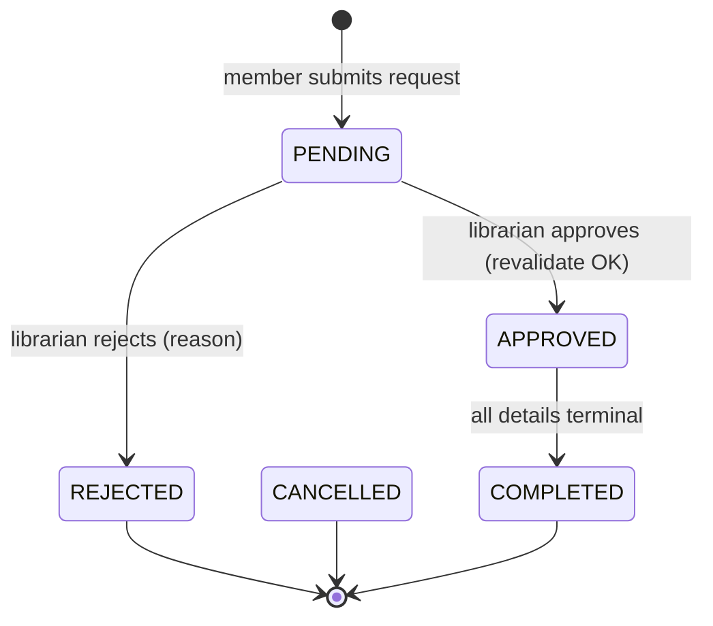
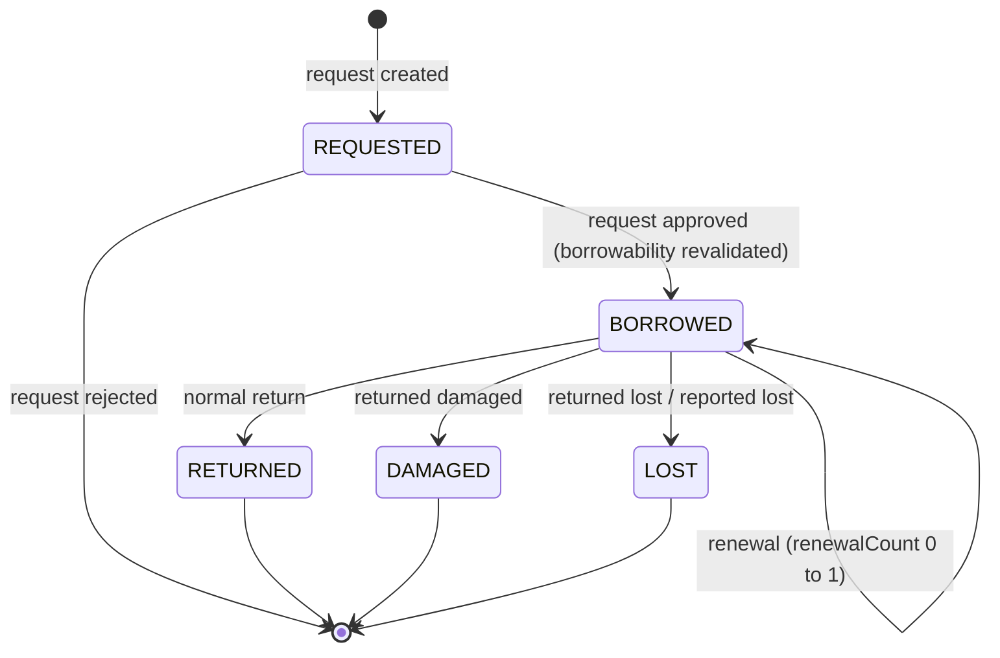

# SPEC.md - FE07 Borrowing Management

# Version: 0.5.1

# Status: APPROVED - BASELINE 2026-07-17

# Owner: Nhat

# Last Updated: 2026-07-17

# Feature ID: FE07

# Feature folder: `.sdd/specs/feat-borrowing-management/`

> Source of truth for FE07 Borrowing Management. v0.5.1 preserves the approved reconciliation contract and makes borrowing-history filters, pagination, ordering, and date semantics deterministic; human re-review is required.

---

## 1. Feature Overview

### 1.1 Feature Name

Borrowing Management

### 1.2 Business Context

Borrowing Management controls the main circulation workflow of the library: members request to borrow books, librarians approve and process the request, borrowed copies are returned, loans may be renewed, and borrowing history is kept for later reports and fine calculation.

This feature is core because wrong borrowing data can break inventory, fines, reservation, reports, and audit history.

### 1.3 Goal / Outcome

The system shall:

- Allow eligible members to create borrow requests.
- Allow librarians/admins to approve or reject borrow requests.
- Record borrowed book copies with due dates and statuses.
- Process returned book copies and update inventory accurately.
- Allow renewals when policy allows.
- Provide borrowing history for members and librarians.
- Keep every borrow/return action traceable for audit and reporting.

### 1.4 Scope Level

- [x] Full Spec - core business logic, high risk, must be correct from the beginning
- [ ] Standard Spec - normal feature with business rules and validations
- [ ] Light Spec - simple UI, documentation, or low-risk feature

---

## 2. Actors and Permissions

| Actor     | Description                  | Permission / Responsibility |
| --------- | ---------------------------- | --------------------------- |
| Member    | Registered library user      | Create borrow request, view own borrowing history, request renewal if allowed. |
| Librarian | Library staff                | View member borrowing information, approve/reject borrow requests, process borrow handover, process returns. |
| Admin     | System administrator         | Has librarian permissions and can view all borrowing records. |
| Guest     | Unauthenticated visitor      | No borrowing permissions. |
| Notification Service | External service | May receive notification requests when borrow/return/renewal result changes. |

---

## 3. Preconditions

The feature can only start when:

- PRE-FE07-001: The user account exists and has an active status.
- PRE-FE07-002: The member has canonical `Members.Status = APPROVED` before borrowing.
- PRE-FE07-003: The requested book copy exists in `BookCopies`.
- PRE-FE07-004: Protected actions are performed by an authenticated actor with the correct role.
- PRE-FE07-005: Loan policy values are approved: maximum active borrowed copies is 5, default loan duration is 14 calendar days, and renewal limit is 1 renewal per borrowed copy.

---

## 4. Main Flows

### MF-FE07-001: Create Borrow Request

1. Member searches or browses books.
2. Member selects one or more physical copies that FE07 may classify as borrowable.
3. The system validates member eligibility.
4. The system validates borrow limit and reservation-aware copy borrowability.
5. The system creates a `BorrowRequests` record with status `PENDING`.
6. The system creates related `BorrowDetails` records for requested copies with status `REQUESTED`.
7. The system shows the request result to the member.

### MF-FE07-002: Approve And Process Borrow Request

1. Librarian opens pending borrow requests.
2. Librarian reviews member information, requested copies, and eligibility warnings.
3. Librarian approves the request.
4. The system revalidates member eligibility and reservation-aware copy borrowability.
5. The system sets `BorrowRequests.Status` to `APPROVED`.
6. The system sets each approved `BorrowDetails.Status` to `BORROWED`.
7. The system stores `ApprovedAt`, `ApprovedBy`, and each detail's `BorrowDate` using the server business time/date in `Asia/Ho_Chi_Minh`.
8. The system assigns each due date as `BorrowDate + 14 calendar days`.
9. The system updates each related `BookCopies.Status` to `BORROWED`.
10. For each requester-owned `NOTIFIED` hold, the system changes the matching reservation to `FULFILLED`.
11. The system writes borrowing and reservation-fulfillment audit log entries in the same transaction.

### MF-FE07-003: Reject Borrow Request

1. Librarian opens a pending borrow request.
2. Librarian enters a rejection reason.
3. The system sets `BorrowRequests.Status` to `REJECTED`.
4. The system keeps all related book copies available.
5. The system writes an audit log entry.

### MF-FE07-004: Process Return Request

1. Librarian searches for the member or borrow request.
2. Librarian selects the borrowed copy being returned.
3. Librarian confirms return condition: normal, damaged, or lost.
4. The system sets `BorrowDetails.ReturnDate` to the return date.
5. The system updates `BorrowDetails.Status` to `RETURNED`, `DAMAGED`, or `LOST`.
6. The system updates `BookCopies.Status` to `AVAILABLE`, `DAMAGED`, or `LOST`.
7. The system detects overdue, damaged, or lost return data and exposes it for FE09 Fine Management.
8. If all details in the request are `RETURNED`, `DAMAGED`, or `LOST`, the system sets `BorrowRequests.Status` to `COMPLETED`.
9. The system writes an audit log entry.

### MF-FE07-005: Renew Borrowed Books

1. Member or librarian opens active borrowed items.
2. Actor selects a borrowed copy to renew.
3. The system checks renewal eligibility: not overdue, no unpaid fine, renewal count is 0, and no active reservation conflict from FE08.
4. The system extends due date by 14 calendar days from the current due date.
5. The system sets renewal count to 1.
6. The system writes an audit log entry and shows the new due date.

### MF-FE07-006: View Borrowing History

1. Member opens own borrowing history, or librarian/admin opens a member's borrowing information.
2. The system validates optional `status`, `fromDate`, `toDate`, `page`, and `limit` before querying.
3. The system returns only the member-scoped records allowed to the actor, using `BorrowDate` for approved details and `RequestDate` for still-requested details when date filters are applied.
4. The system returns page 1 with 20 rows by default, never more than 100 rows per page, in stable order: `BorrowDate DESC` with nulls last, then `BorrowDetailId DESC`.
5. The system supports filtering by detail status and inclusive business-date range.

---

## 5. Alternative Flows

### AF-FE07-001: Member Is Not Eligible

1. The system detects inactive membership, unpaid blocking fine, overdue active loan, or exceeded borrow limit.
2. The system rejects the request or approval action.
3. The system returns a clear error message explaining the blocking reason.

### AF-FE07-002: Copy Becomes Non-Borrowable Before Approval

1. Member creates a borrow request while the copy satisfies the reservation-aware borrowability contract.
2. Before librarian approval, another process changes the copy or reservation state.
3. The system revalidates copy status and reservation claims during approval.
4. The system rejects the whole approval (all-or-nothing in Phase 1), keeps the request `PENDING`, and returns the safe blocking conflict.

### AF-FE07-003: Partial Return

1. A borrow request contains multiple borrowed copies.
2. Member returns only some copies.
3. The system updates only returned `BorrowDetails`.
4. The remaining details stay `BORROWED` until returned, lost, or damaged.

### AF-FE07-004: Renewal Not Allowed

1. Actor requests renewal.
2. The system detects a blocking condition: overdue item, unpaid blocking fine, renewal limit reached, or active reservation by another member.
3. The system rejects renewal and keeps the due date unchanged.

---

## 6. Business Rules

Use these stable IDs for tasks and tests.

- BR-FE07-001: A guest cannot create, approve, process, or view protected borrowing records.
- BR-FE07-002: A member can create borrow requests only for their own account.
- BR-FE07-003: A librarian/admin can view and process borrow requests for any member.
- BR-FE07-004: A member must have `Users.Status = ACTIVE` and canonical `Members.Status = APPROVED` before borrowing or renewal.
- BR-FE07-005: At create and approval, `activeBorrowedCount + requestedDetailCount` must be less than or equal to 5. `activeBorrowedCount` counts only the member's current `BorrowDetails.Status = BORROWED`; approval acquires the member-scoped lock and relevant rows in the order defined by NFR-FE07-TXN-003 before calculating the count, so concurrent approvals cannot exceed 5.
- BR-FE07-006: A member with overdue active loans or any unpaid fine with amount greater than 0 cannot create a new borrow request or renew an existing borrowed copy.
- BR-FE07-007: A copy can be borrowed only when FE07 classifies it as borrowable under BR-FE07-023.
- BR-FE07-008: Approval must recheck reservation-aware copy borrowability and member eligibility.
- BR-FE07-009: When a borrow request is approved, each borrowed copy status must change to `BORROWED`.
- BR-FE07-010: Every borrowed copy must store `BorrowDate`; the default due date is `BorrowDate + 14 calendar days`.
- BR-FE07-011: Every return must store a return date in the library business timezone `Asia/Ho_Chi_Minh`; it cannot precede `BorrowDate` or be later than the current server business date.
- BR-FE07-012: A returned normal copy must become `AVAILABLE`; if an `ACTIVE` FE08 reservation queue exists for that copy, the return transaction must preserve that queue claim and ordinary FE07 create/approve actions remain blocked until FE08 processes or terminally resolves the queue.
- BR-FE07-013: A lost or damaged copy must not become available automatically.
- BR-FE07-014: Overdue return must be detectable and traceable for FE09 Fine Management.
- BR-FE07-015: Each borrow detail may be renewed at most 1 time; a valid renewal extends the due date by 14 calendar days from the current due date.
- BR-FE07-016: Every create/approve/reject/return/renew action must be auditable.
- BR-FE07-017: Borrowing history must be read-only for members.
- BR-FE07-018: Renewal must not be allowed when the item is overdue, the member has an unpaid fine, the renewal limit has been reached, or the item is reserved by another member.
- BR-FE07-019: Pending borrow request items must be stored in `BorrowDetails` with status `REQUESTED`; no separate request-detail table is used in Phase 1.
- BR-FE07-020: When all details in a borrow request reach a terminal status (`RETURNED`, `LOST`, or `DAMAGED`), the request status must become `COMPLETED`.
- BR-FE07-021: FE07 must not calculate or create fine records for overdue, damaged, or lost returns; it only exposes return data for FE09 Fine Management.
- BR-FE07-022: Phase 1 borrow-request handling is all-or-nothing: if any requested copy is duplicate, non-existent, or not borrowable under BR-FE07-023 (at create or approval), the entire request/approval is rejected and no partial request is created. Per-item rejection (keeping the valid copies) is deferred to a later phase.
- BR-FE07-023: FE07 may accept a copy only when its parent `Books.Status = ACTIVE` and it is `AVAILABLE` with no `ACTIVE`/`NOTIFIED` reservation claim, or when its parent book is `ACTIVE` and it is `RESERVED` by a `NOTIFIED` reservation owned by the requesting member.
- BR-FE07-024: An `ACTIVE` reservation queue for a copy blocks ordinary borrow-request creation and approval until staff processes or resolves that queue.
- BR-FE07-025: Approving a borrow request for a requester-owned `NOTIFIED` reservation must atomically change the matching reservation to `FULFILLED` with the borrow request, details, copy status, and audit records.
- BR-FE07-026: Every request stores `CreatedBy`; approval stores `ApprovedAt` and `ApprovedBy`; every approved detail stores `BorrowDate`. These fields are required transaction history, not optional audit-only metadata.
- BR-FE07-027: Rejection requires a trimmed non-empty reason of at most 500 characters and stores it in the rejection audit metadata.
- BR-FE07-028: Borrowing-history endpoints accept only `status?`, `fromDate?`, `toDate?`, `page?`, and `limit?`; defaults are `page=1`, `limit=20`, bounds are `page>=1`, `limit=1..100`, the date range is inclusive, and rows use stable `BorrowDate DESC (nulls last), BorrowDetailId DESC` ordering.

---

## 7. Functional Requirements

- FR-FE07-001: When a member submits a borrow request, the system shall validate member eligibility before creating the request.
- FR-FE07-002: When a member submits a borrow request with valid data, the system shall create a pending borrow request and store requested items as `BorrowDetails.Status = REQUESTED`.
- FR-FE07-003: If any requested copy is not borrowable under BR-FE07-023, the system shall reject the whole borrow request and shall not create a partial request. (Phase 1 policy: all-or-nothing; per-item rejection is future work - see Section 6 BR-FE07-022.)
- FR-FE07-004: When a librarian approves a borrow request, the system shall revalidate all business rules before approval.
- FR-FE07-005: When approval succeeds, the system shall store `ApprovedAt`, `ApprovedBy`, `BorrowDate`, due dates, request/detail states, copy states, matching reservation fulfillment, and audits in one transaction.
- FR-FE07-006: When a librarian rejects a borrow request, the system shall require and store the rejection reason in audit metadata while keeping copy statuses unchanged.
- FR-FE07-007: When a librarian processes a return, the system shall lock the copy and relevant reservation claims, then atomically update return date, detail status, copy status, and audit state; a normal return sets the copy `AVAILABLE` while preserving any `ACTIVE` FE08 queue claim.
- FR-FE07-008: If the return is overdue, damaged, or lost, the system shall expose enough data for FE09 to calculate or create the related fine.
- FR-FE07-009: When renewal is requested, the system shall allow at most 1 renewal per borrow detail and extend the due date by 14 calendar days only when all renewal rules pass.
- FR-FE07-010: When a member views borrowing history, the system shall return only that member's records.
- FR-FE07-011: When a librarian/admin views member borrowing information, the system shall allow searching by member identity.
- FR-FE07-012: While a borrow detail is `BORROWED`, the related copy shall not be available for another borrow approval.
- FR-FE07-013: When all details in a borrow request are `RETURNED`, `LOST`, or `DAMAGED`, the system shall update the request status to `COMPLETED`.
- FR-FE07-028: When a member or authorized staff requests borrowing history, the system shall validate `status`, date-only `fromDate/toDate`, `page`, and `limit` before querying, apply the member scope, and return deterministic paginated results using the BR-FE07-028 ordering.

### 7.1 Unwanted Behaviour Requirements (Error / Abnormal Conditions)

These EARS requirements cover error and abnormal conditions. Each traces back to an existing Edge Case (EC-*), Business Rule (BR-*), or Alternative Flow (AF-*).

- FR-FE07-014: IF `activeBorrowedCount + requestedDetailCount > 5` at create or approval, the system shall reject the whole action with `BORROW_LIMIT_EXCEEDED` and change no record. Approval must acquire the member-scoped lock and relevant rows in the NFR-FE07-TXN-003 order before performing this calculation. (Source: BR-FE07-005, AF-FE07-001, AC-FE07-003)
- FR-FE07-015: IF a member submits a borrow request or renewal request while the account is inactive or the membership is not approved, the system shall reject the action and return an eligibility error explaining the blocking reason. (Source: BR-FE07-004, EC-FE07-002, EC-FE07-003, AF-FE07-001)
- FR-FE07-016: IF a member submits a borrow request or renewal request while having an overdue active loan or any `UNPAID` fine with amount greater than 0, the system shall reject the action and return an error identifying the blocking fine or overdue loan. (Source: BR-FE07-006, BR-FE07-018, AF-FE07-001, AF-FE07-004)
- FR-FE07-017: IF a borrow request contains a duplicate copy, a non-existent copy, or any copy that fails BR-FE07-023, the system shall reject the whole request and shall not create any `BorrowRequests`/`BorrowDetails` record. (Phase 1 policy: all-or-nothing; per-item rejection is future work - see BR-FE07-022.) (Source: EC-FE07-004, EC-FE07-006, EC-FE07-007)
- FR-FE07-018: IF any copy fails the reservation-aware borrowability contract at the moment of approval, the system shall reject the whole approval, keep all data unchanged (request stays `PENDING`), and return the safe blocking conflict. (Phase 1 policy: all-or-nothing.) (Source: BR-FE07-007, BR-FE07-008, EC-FE07-005, AF-FE07-002, AC-FE07-005)
- FR-FE07-019: WHERE approval actions target the same copy or the same member concurrently, the system shall serialize them using `member-scoped lock -> BookCopies -> BorrowRequests/BorrowDetails -> Reservations`; all active-count and copy/reservation revalidation occurs only after the relevant locks are acquired, so at most one conflicting action succeeds. (Source: EC-FE07-011, EC-FE07-013, FR-FE07-012, BR-FE07-005)
- FR-FE07-020: IF a renewal is requested for a borrow detail that is overdue, already renewed once, blocked by an unpaid fine, or reserved by another member, the system shall reject the renewal and keep the existing due date unchanged. (Source: BR-FE07-015, BR-FE07-018, AF-FE07-004, EC-FE07-010, AC-FE07-010)
- FR-FE07-021: IF a return or renewal targets an invalid detail state, or a supplied return date is earlier than `BorrowDate` or later than the current business date in `Asia/Ho_Chi_Minh`, the system shall reject the action without changing due date, return data, copy state, or audit success state. (Source: EC-FE07-008, EC-FE07-009, EC-FE07-010)
- FR-FE07-022: IF any step of an approve or return transaction fails, the system shall roll back the whole transaction so that request status, detail status, due date, copy status, reservation status, and audit log remain consistent. (Source: EC-FE07-012, NFR-FE07-TXN-001, NFR-FE07-TXN-002)
- FR-FE07-023: IF a requested copy has an `ACTIVE` reservation queue, FE07 shall reject create/approve with `RESERVATION_QUEUE_PRIORITY` and shall change no record.
- FR-FE07-024: IF a copy is `RESERVED` by a `NOTIFIED` reservation owned by the borrowing member, FE07 shall allow request creation and shall revalidate that ownership during approval.
- FR-FE07-025: WHEN staff approves a held owner's request, FE07 shall update every matching `NOTIFIED` reservation to `FULFILLED` in the approval transaction.
- FR-FE07-026: IF the parent book is `INACTIVE` at request creation or approval, FE07 shall reject the action with `BOOK_INACTIVE` and shall change no borrowing, copy, reservation, or audit state.
- FR-FE07-027: IF rejection reason is missing, blank after trimming, or longer than 500 characters, FE07 shall reject the rejection command and keep the request `PENDING`.

---

## 8. Acceptance Criteria

- AC-FE07-001: Given an eligible member and an `AVAILABLE` copy with no reservation claim, when the member creates a borrow request, then the system creates a `PENDING` borrow request with requested details marked `REQUESTED`.
- AC-FE07-002: Given an inactive member, when the member creates a borrow request, then the system rejects the request.
- AC-FE07-003: Given a member has 4 active borrowed details and submits/approves a request containing 2 details, when the limit is checked, then FE07 returns `BORROW_LIMIT_EXCEEDED` and preserves all state.
- AC-FE07-004: Given a pending request and copies that still satisfy BR-FE07-023, when a librarian approves it, then FE07 stores approver/approval time/borrow dates, marks request/details/copies correctly, sets due dates to borrow date +14 days, and commits matching reservation/audit updates atomically.
- AC-FE07-005: Given a pending request whose copy is no longer borrowable under BR-FE07-023, when a librarian approves it, then the system rejects approval and keeps data unchanged.
- AC-FE07-006: Given a borrowed copy, when the librarian processes a normal return, then the system stores return date and marks the copy `AVAILABLE`; if an `ACTIVE` FE08 queue exists, the queue claim remains and ordinary borrowing stays blocked until FE08 resolves it.
- AC-FE07-007: Given a borrowed copy returned damaged, when the librarian processes the return, then the system marks the copy `DAMAGED` and does not make it available.
- AC-FE07-008: Given an overdue borrowed copy, when it is returned, then the system exposes overdue data for fine calculation.
- AC-FE07-009: Given a borrowed copy with no previous renewal and no blocking condition, when renewal succeeds, then the due date is extended by 14 calendar days and renewal count becomes 1.
- AC-FE07-010: Given a borrowed copy that is overdue, already renewed, blocked by unpaid fine, or reserved by another member, when renewal is requested, then the due date remains unchanged and the system returns a reason.
- AC-FE07-011: Given a logged-in member, when viewing borrowing history, then only that member's borrowing records are returned.
- AC-FE07-012: Given a librarian/admin, when viewing member borrowing information, then the system can return records for the selected member.
- AC-FE07-013: Given all details in a borrow request are `RETURNED`, `LOST`, or `DAMAGED`, when the return processing finishes, then the request status becomes `COMPLETED`.
- AC-FE07-014: Given a damaged or lost return, when FE07 records it, then FE07 does not create a fine record and FE09 can later calculate or create the fine from the recorded data.
- AC-FE07-015: Given an active reservation queue, when another member creates or approves a borrow request, then FE07 returns `409 RESERVATION_QUEUE_PRIORITY` and preserves all state.
- AC-FE07-016: Given a requester-owned notified reservation and reserved copy, when the owner creates a borrow request, then FE07 creates the normal pending request without releasing the hold.
- AC-FE07-017: Given that pending request, when staff approves it, then borrowing records, copy status, reservation fulfillment, and audits commit atomically.
- AC-FE07-018: Given a copy whose parent book is `INACTIVE`, when create or approval is attempted, then FE07 returns `BOOK_INACTIVE` and preserves all state.
- AC-FE07-019: Given two concurrent approvals that would take one member from 4 to 6 active borrowed details, then at most one approval succeeds and the committed total never exceeds 5.
- AC-FE07-020: Given a return date before `BorrowDate` or after the current `Asia/Ho_Chi_Minh` business date, when return is submitted, then FE07 returns `INVALID_RETURN_DATE` and preserves all state.
- AC-FE07-021: Given a pending request and missing/blank/overlength rejection reason, when staff rejects it, then FE07 rejects the command and leaves the request `PENDING`.
- AC-FE07-022: Given a valid history request, when no pagination is supplied, then FE07 uses `page=1`, `limit=20`, inclusive date filters, and stable `BorrowDate DESC`/`BorrowDetailId DESC` ordering; invalid values are rejected before query execution.

---

## 9. Edge Cases and Error Handling

| ID | Edge Case / Error | Expected System Behavior |
| -- | ----------------- | ------------------------ |
| EC-FE07-001 | Member ID does not exist | Return not found error. |
| EC-FE07-002 | Member account inactive | Reject borrow/renewal action. |
| EC-FE07-003 | Membership not approved | Reject borrow request. |
| EC-FE07-004 | Copy ID does not exist | Reject request item. |
| EC-FE07-005 | Copy or reservation state fails BR-FE07-023 during approval | Reject the whole approval and preserve all state. |
| EC-FE07-006 | Duplicate copy in the same borrow request | Reject duplicate item. |
| EC-FE07-007 | Borrow request has zero valid items | Reject request. |
| EC-FE07-008 | Return action on already returned item | Reject as invalid state transition. |
| EC-FE07-009 | Return date before persisted `BorrowDate` | Reject invalid date. |
| EC-FE07-010 | Renewal requested after item is already returned | Reject renewal. |
| EC-FE07-011 | Concurrent approval of same copy | Only one approval may succeed; later action must fail safely. |
| EC-FE07-012 | Database update partially fails | Roll back the whole transaction. |
| EC-FE07-013 | Concurrent approvals for the same member would exceed 5 active details | Serialize by member; at most one conflicting approval succeeds. |
| EC-FE07-014 | Return date is in the future in `Asia/Ho_Chi_Minh` | Reject invalid date and preserve all state. |
| EC-FE07-015 | Missing/blank/overlength rejection reason | Reject command; request remains `PENDING`. |
| EC-FE07-016 | History request has invalid status/date/page/limit | Reject with a validation response before querying; do not silently normalize. |

---

## 10. Data Requirements

### 10.1 Entities Involved

| Entity | Purpose in this feature |
| ------ | ----------------------- |
| Users | Stores member, librarian, and admin accounts. |
| UserRoles | Checks actor permission. |
| Members | Canonical FE04 membership eligibility projection; only `APPROVED` passes. |
| Books | Provides book display information and the required `ACTIVE` parent status guard. |
| BookCopies | Tracks physical copy status and location. |
| BorrowRequests | Stores borrow request header and workflow status. |
| BorrowDetails | Stores copy-level due date, return date, and borrow status. |
| Fines | Read to block borrowing if unpaid fines are configured as blocking. |
| Reservations | Read to enforce create/approval priority and renewal rules; update matching `NOTIFIED` holds to `FULFILLED` during approval. |
| AuditLogs | Records important borrowing actions. |

### 10.2 Data Fields

| Field | Type | Required | Validation / Notes |
| ----- | ---- | -------- | ------------------ |
| requestId | integer | Yes for updates | Must exist in `BorrowRequests`. |
| userId | integer | Yes | Must reference a member user. |
| copyId | integer | Yes | Must reference `BookCopies`. |
| requestDate | datetime | Yes | Defaults to current server time. |
| createdBy | integer | Yes | Request creator; member-created requests use the authenticated member ID. |
| approvedAt | datetime | Required on approval | Server timestamp in `Asia/Ho_Chi_Minh`; stored on `BorrowRequests`. |
| approvedBy | integer | Required on approval | Authenticated Librarian/Admin who approved the request. |
| borrowDate | date | Required when approved | Server business date in `Asia/Ho_Chi_Minh`; stored on each approved detail. |
| dueDate | date | Required when approved | `borrowDate + 14 calendar days`. |
| returnDate | date | Required for returned/lost/damaged | Defaults to current `Asia/Ho_Chi_Minh` business date; must be between `borrowDate` and current business date inclusive. |
| renewalCount | integer | Yes for renewal support | Defaults to 0; maximum 1 per `BorrowDetail`; existing SQL supports this field. |
| requestStatus | string | Yes | Values: `PENDING`, `APPROVED`, `REJECTED`, `COMPLETED`, `CANCELLED`. |
| detailStatus | string | Yes | Persisted values: `REQUESTED`, `BORROWED`, `RETURNED`, `LOST`, `DAMAGED`. `OVERDUE` is derived when `status = BORROWED` and `dueDate < today`. |
| copyStatus | string | Yes | Approved values: `AVAILABLE`, `BORROWED`, `RESERVED`, `DAMAGED`, `LOST`, `INACTIVE`; FE07 uses only its owned transitions. |
| actionReason | string | Required for rejection; optional otherwise | Rejection reason is trimmed 1..500 characters and stored in audit metadata; return/renew notes remain optional. |
| activeBorrowedCount | integer | Derived | Count of the member's current `BorrowDetails.Status = BORROWED`, computed under the approval member lock. |
| requestedDetailCount | integer | Derived | Number of unique details in the current create/approval action; `activeBorrowedCount + requestedDetailCount <= 5`. |
| historyStatus | string | No | Query-only; one of `REQUESTED`, `BORROWED`, `RETURNED`, `LOST`, `DAMAGED`, `OVERDUE`; `OVERDUE` is derived. |
| fromDate | date | No | Query-only inclusive `YYYY-MM-DD` in `Asia/Ho_Chi_Minh`; must be <= `toDate` when both are supplied. |
| toDate | date | No | Query-only inclusive `YYYY-MM-DD` in `Asia/Ho_Chi_Minh`; must be >= `fromDate` when both are supplied. |
| page | integer | No | Query-only; defaults to 1 and must be at least 1. |
| limit | integer | No | Query-only; defaults to 20 and must be from 1 through 100. |

### 10.3 State Model & Transition Rules

FE07 has two lifecycles that must be modeled separately but kept consistent: the request-level lifecycle (`BorrowRequests.Status`) and the copy-level lifecycle (`BorrowDetails.Status`). Persisted states use the values declared in Section 10.2. `OVERDUE` remains a derived reporting/filter result, not a persisted detail state.

The two lifecycles are linked: a request aggregates one or more details, and the request reaches a terminal `COMPLETED` state only when every detail it owns has reached a terminal copy-level state (BR-FE07-020, FR-FE07-013).

#### (A) BorrowRequest Lifecycle (`BorrowRequests.Status`)

State values: `PENDING`, `APPROVED`, `REJECTED`, `COMPLETED`, `CANCELLED`.

##### A.1 State Diagram

##### A.2 State Descriptions

| State | Description |
| ----- | ----------- |
| `PENDING` | Request created by the member; requested copies stored as `BorrowDetails.Status = REQUESTED`. Awaiting librarian/admin decision. |
| `APPROVED` | Librarian/admin approved the request; each approved detail moved to `BORROWED`, due dates set, related copies set to `BORROWED`. Request is active until all details are returned/lost/damaged. |
| `REJECTED` | Librarian/admin rejected the request; all copies stay available, no detail becomes `BORROWED`. Terminal. |
| `COMPLETED` | Every detail of the request has reached a terminal copy-level state (`RETURNED`, `LOST`, or `DAMAGED`). Terminal. |
| `CANCELLED` | Terminal enum value retained for future compatibility. It is outside the current endpoint/task scope because its actor, trigger, and payload rules are not approved. |

##### A.3 Valid Transitions

| From | To | Trigger | Condition | FR/BR |
| ---- | -- | ------- | --------- | ----- |
| `[*]` | `PENDING` | Member submits a valid borrow request | Member eligible; every requested copy satisfies BR-FE07-023 | MF-FE07-001, FR-FE07-001, FR-FE07-002, BR-FE07-004, BR-FE07-005, BR-FE07-023 |
| `PENDING` | `APPROVED` | Librarian/admin approves | Eligibility, member-scoped borrow limit, parent book, and reservation-aware borrowability revalidation pass | MF-FE07-002, FR-FE07-004, FR-FE07-005, BR-FE07-005, BR-FE07-008, BR-FE07-009, BR-FE07-023 |
| `PENDING` | `REJECTED` | Librarian/admin rejects | Rejection reason provided; copies left unchanged | MF-FE07-003, FR-FE07-006, BR-FE07-001 |
| `APPROVED` | `COMPLETED` | Return processing finishes | All owned details are `RETURNED`, `LOST`, or `DAMAGED` | MF-FE07-004, FR-FE07-013, BR-FE07-020 |

##### A.4 Invalid Transitions (Explicitly Forbidden)

| Forbidden | Reason |
| --------- | ------ |
| `REJECTED` → `APPROVED` | A rejected request is terminal; it cannot be approved without a new request. |
| `REJECTED` → any state | `REJECTED` is terminal. |
| `CANCELLED` → any state | `CANCELLED` is terminal. |
| `COMPLETED` → `APPROVED` / `PENDING` | A completed request cannot reopen; a returned loan does not re-borrow. |
| `PENDING` → `COMPLETED` | A request cannot complete without being approved first (no detail can be terminal before `BORROWED`). |
| `APPROVED` → `PENDING` / `REJECTED` | Once approved (copies set to `BORROWED`), the request cannot revert to pending or be rejected. |

##### A.5 Invariants

| ID | Invariant |
| -- | --------- |
| INV-FE07-A1 | A `BorrowRequests` record always holds exactly one `Status` value from the declared enum. |
| INV-FE07-A2 | A request may move to `APPROVED` only after eligibility and reservation-aware borrowability are revalidated (BR-FE07-008, BR-FE07-023). |
| INV-FE07-A3 | Only an `APPROVED` request can own `BORROWED` details; `PENDING`/`REJECTED`/`CANCELLED` requests never own a `BORROWED` detail. |
| INV-FE07-A4 | A request becomes `COMPLETED` if and only if all of its details are in a terminal copy-level state (`RETURNED`/`LOST`/`DAMAGED`) (BR-FE07-020, FR-FE07-013). |
| INV-FE07-A5 | Every request-level transition writes an audit log entry (BR-FE07-016, NFR-FE07-LOG-001). |
| INV-FE07-A6 | `REJECTED`, `CANCELLED`, and `COMPLETED` are terminal and cannot transition further. |
| INV-FE07-A7 | Approval cannot commit if the member's locked active borrowed count plus this request's detail count exceeds 5 (BR-FE07-005, FR-FE07-014, FR-FE07-019). |

#### (B) BorrowDetail Lifecycle (`BorrowDetails.Status`)

Persisted state values: `REQUESTED`, `BORROWED`, `RETURNED`, `LOST`, `DAMAGED`.

> **Phase 1 implementation note (OVERDUE is derived):** In Phase 1 the system does **not** persist
> `BorrowDetails.Status = 'OVERDUE'`. "Overdue" is computed at query time as a `BORROWED` detail whose
> `dueDate` is earlier than the current `Asia/Ho_Chi_Minh` business date, and this derived value is what FE09 consumes (BR-FE07-014).
> Returns and renewal validation are processed from `BORROWED` regardless of whether the item is past
> due. A persisted `OVERDUE` status plus a scheduled job to set it is deferred to a later phase.

##### B.1 State Diagram

##### B.2 State Descriptions

| State | Description |
| ----- | ----------- |
| `REQUESTED` | Copy requested inside a `PENDING` request; copy not yet handed over, no due date. |
| `BORROWED` | Copy approved and handed over; has persisted `BorrowDate` and due date (`BorrowDate + 14 calendar days`). May be renewed once. Related `BookCopies.Status = BORROWED`. |
| `OVERDUE` | Copy still held past its due date and not yet returned. **Derived in Phase 1 (not persisted)** — computed from a `BORROWED` detail with `dueDate < today`; must be detectable/traceable for FE09 (BR-FE07-014). Not a terminal state — a return still follows. |
| `RETURNED` | Copy returned in normal condition; related `BookCopies.Status = AVAILABLE`. Terminal. |
| `DAMAGED` | Copy returned damaged; related `BookCopies.Status = DAMAGED`; not auto-available. Terminal. |
| `LOST` | Copy reported lost; related `BookCopies.Status = LOST`; not auto-available. Terminal. |

##### B.3 Valid Transitions

| From | To | Trigger | Condition | FR/BR |
| ---- | -- | ------- | --------- | ----- |
| `[*]` | `REQUESTED` | Borrow request created | Owning request is `PENDING` | MF-FE07-001, FR-FE07-002, BR-FE07-019 |
| `REQUESTED` | `BORROWED` | Request approved | Locked member limit passes; copy satisfies BR-FE07-023; borrow/due dates and approver metadata stored; matching notified hold fulfilled | MF-FE07-002, FR-FE07-005, FR-FE07-025, BR-FE07-005, BR-FE07-007, BR-FE07-009, BR-FE07-010, BR-FE07-025, BR-FE07-026 |
| `REQUESTED` | `[*]` | Owning request rejected | Copy stays available, never handed over | MF-FE07-003, BR-FE07-019 |
| `BORROWED` | `BORROWED` | Renewal | Not overdue, no unpaid fine, renewalCount = 0, no reservation conflict; due date +14 days, renewalCount → 1 | MF-FE07-005, FR-FE07-009, BR-FE07-015, BR-FE07-018 |
| `BORROWED` | `RETURNED` | Normal return | Return date stored; copy → `AVAILABLE`; any `ACTIVE` FE08 queue claim remains enforced | MF-FE07-004, FR-FE07-007, BR-FE07-011, BR-FE07-012 |
| `BORROWED` | `DAMAGED` | Return reported damaged | Return date stored; copy → `DAMAGED`; not auto-available | MF-FE07-004, FR-FE07-007, BR-FE07-013 |
| `BORROWED` | `LOST` | Return/report lost | Return date stored; copy → `LOST`; not auto-available | MF-FE07-004, FR-FE07-007, BR-FE07-013 |

##### B.4 Invalid Transitions (Explicitly Forbidden)

| Forbidden | Reason |
| --------- | ------ |
| `RETURNED` / `DAMAGED` / `LOST` → `BORROWED` | Terminal copy-level states cannot reopen; a returned copy cannot become borrowed again on the same detail (FR-FE07-021, EC-FE07-008, EC-FE07-010). |
| `RETURNED` / `DAMAGED` / `LOST` → any state | Terminal states cannot transition further. |
| Past-due `BORROWED` → renewal | Renewal is not allowed when `dueDate < today` (BR-FE07-018, FR-FE07-020, AF-FE07-004). |
| `REQUESTED` → `RETURNED` / `LOST` / `DAMAGED` | A copy that was never handed over (`BORROWED`) cannot be returned, lost, or damaged. |
| `BORROWED` → `BORROWED` second renewal | At most 1 renewal per detail; second renewal forbidden (BR-FE07-015, FR-FE07-009, FR-FE07-020). |
| Any return with date before `BorrowDate` or after current `Asia/Ho_Chi_Minh` business date | Invalid date transition (BR-FE07-011, FR-FE07-021, EC-FE07-009, EC-FE07-014). |

##### B.5 Invariants

| ID | Invariant |
| -- | --------- |
| INV-FE07-B1 | A `BorrowDetails` record always holds exactly one `Status` value from the declared enum. |
| INV-FE07-B2 | A detail can be `BORROWED` only if its owning request is `APPROVED` (mirrors INV-FE07-A3). |
| INV-FE07-B3 | Every `BORROWED` detail has non-null `BorrowDate` and due date = `BorrowDate + 14 calendar days` (BR-FE07-010, BR-FE07-026). |
| INV-FE07-B4 | `renewalCount` is in {0, 1}; a renewal is allowed only from `BORROWED` with `renewalCount = 0` and no blocking condition (BR-FE07-015, BR-FE07-018). |
| INV-FE07-B5 | Reaching `RETURNED`, `LOST`, or `DAMAGED` requires a stored return date between `BorrowDate` and the current `Asia/Ho_Chi_Minh` business date inclusive (BR-FE07-011, FR-FE07-021). |
| INV-FE07-B6 | The related `BookCopies.Status` is kept consistent with the detail status: `BORROWED` -> `BORROWED`, `RETURNED` -> `AVAILABLE`, `DAMAGED` -> `DAMAGED`, `LOST` -> `LOST`; an `ACTIVE` FE08 queue claim can remain over an `AVAILABLE` copy and still blocks ordinary borrowing; requester-owned notified holds become `FULFILLED` with approval (BR-FE07-007, BR-FE07-012, BR-FE07-013, BR-FE07-025, FR-FE07-012). |
| INV-FE07-B7 | Every detail-level transition (approve/return/renew/lost/damaged) writes an audit log entry (BR-FE07-016, NFR-FE07-LOG-001). |
| INV-FE07-B8 | Approve and return transitions are atomic with their related updates; approval includes matching reservation fulfillment and all related audits, and partial failure rolls back the whole transaction (FR-FE07-022, FR-FE07-025, NFR-FE07-TXN-001, NFR-FE07-TXN-002). |

---

## 11. API / Interface Contract

> API contract approved for FE07 Phase 1. Final contract stays in this SPEC.md unless the team reintroduces a dedicated shared API contract document.

| Method | Endpoint | Actor | Request | Response | Notes |
| ------ | -------- | ----- | ------- | -------- | ----- |
| POST | `/api/borrow-requests` | Member | `{ copyIds: number[] }` | Created borrow request | Creates pending request. |
| GET | `/api/borrow-requests/me` | Member | Query: `status?, fromDate?, toDate?, page=1, limit=20` | Paginated own borrowing history | `status` is a detail status including derived `OVERDUE`; date filters are inclusive and use BorrowDate, or RequestDate for still-requested rows; stable order is BorrowDate DESC nulls last, BorrowDetailId DESC. |
| GET | `/api/borrow-requests` | Librarian/Admin | Query: status, memberId | Borrow request list | Protected endpoint. |
| GET | `/api/members/{memberId}/borrowings` | Librarian/Admin | Query: `status?, fromDate?, toDate?, page=1, limit=20` | Paginated selected-member borrowing history | Same validation, date semantics, member scope, bounds, and stable ordering as the member endpoint. |
| PATCH | `/api/borrow-requests/{requestId}/approve` | Librarian/Admin | Optional notes | Approved request | Transactional update. |
| PATCH | `/api/borrow-requests/{requestId}/reject` | Librarian/Admin | `{ reason: string }` | Rejected request | Reason required, trimmed, max 500; stored in audit metadata. |
| PATCH | `/api/borrow-details/{borrowDetailId}/return` | Librarian/Admin | `{ condition: "NORMAL"|"DAMAGED"|"LOST", returnDate?: date, notes?: string }` | Updated borrow detail | Defaults to current `Asia/Ho_Chi_Minh` business date; future/pre-borrow dates are rejected; a normal return preserves any `ACTIVE` FE08 queue claim and its borrowing priority. |
| PATCH | `/api/borrow-details/{borrowDetailId}/renew` | Member/Librarian/Admin | Optional notes | Updated due date | Must validate renewal rules. |

---

## 12. Non-functional Requirements

### 12.1 Security

- NFR-FE07-SEC-001: All protected endpoints must require authentication.
- NFR-FE07-SEC-002: Role-based access must be enforced on the server.
- NFR-FE07-SEC-003: A member must not access another member's borrowing history.
- NFR-FE07-SEC-004: All request IDs, copy IDs, status values, and dates must be validated on the server.

### 12.2 Transaction Integrity

- NFR-FE07-TXN-001: Approving a borrow request must be atomic: member-scoped limit check, approver metadata, borrow/due dates, request/detail/copy status, matching reservation fulfillment, and audit logs must succeed together or roll back together.
- NFR-FE07-TXN-002: Returning a copy must be atomic: detail status, return date, copy status, FE08 reservation-claim revalidation, and audit log must succeed together or roll back together. The return path locks `BookCopies -> BorrowDetails -> Reservations` before committing the normal-return state.
- NFR-FE07-TXN-003: Approval lock order is `member-scoped borrow-limit lock -> BookCopies -> BorrowRequests/BorrowDetails -> Reservations`. The active borrowed count and copy/reservation revalidation occur only after the relevant rows are locked, and all approval writes remain in the same transaction. The shared copy-related suffix stays consistent with FE06: `BookCopies -> BorrowDetails -> Reservations`.

### 12.3 Performance

- NFR-FE07-PERF-001: Borrowing history must support the canonical `page`/`limit` pagination contract.
- NFR-FE07-PERF-002: Borrowing-history queries must apply member, status, date, and pagination filters in the database before materializing rows; full-table application scans are not permitted.
- NFR-FE07-PERF-003: History endpoints must apply pagination and stable ordering before returning rows; default `limit=20` and maximum `limit=100` are fixed contract values.

### 12.4 Logging and Audit

- NFR-FE07-LOG-001: Create, approve, reservation fulfillment, reject, return, damaged, lost, and renewal actions must write audit log entries.

### 12.5 Usability

- NFR-FE07-UX-001: Validation errors must explain the reason: inactive member, borrow limit, unavailable copy, reservation queue priority, reservation state conflict, unpaid fine, overdue loan, or invalid state.
- NFR-FE07-TIME-001: Borrow, due, return, and overdue business dates use `Asia/Ho_Chi_Minh`; persisted timestamps may use UTC internally only if API/business-date conversion remains deterministic.

---

## 13. Out of Scope

This feature does not include:

- FE08 queue selection, hold expiration, or cancellation ownership; FE07 only reads reservation claims and fulfills a matching requester-owned `NOTIFIED` hold during approval.
- FE09 Fine calculation implementation, although this feature exposes overdue/return data for FE09.
- FE10 Notification delivery implementation.
- Real online payment gateway.
- RFID/QR hardware integration.
- Study seat reservation.

---

## 14. Dependencies

| Dependency | Type | Notes |
| ---------- | ---- | ----- |
| FE02 Authentication | Internal | Required for actor identity. |
| FE04 Membership Management | Internal | Determines membership approval/status. |
| FE06 Inventory / Book Copy Management | Internal | Provides copy availability and status updates. |
| FE08 Reservation Management | Internal | FE08 owns queue order, hold selection, cancellation, and expiration. FE07 reads `ACTIVE`/`NOTIFIED` claims for create/approval/renewal and changes only matching requester-owned `NOTIFIED` holds to `FULFILLED` during approval. |
| FE09 Fine Management | Internal | Checked on 2026-06-10: any unpaid fine with amount greater than 0 blocks new borrowing and renewal. FE09 owns fine calculation/creation from FE07 return data. |
| FE10 Notification Management | Internal | May notify borrow/return/renewal results. |
| FE11 User & Role Management | Internal | Provides roles and permissions. |
| SQL Server database | Technical | Current SQL script has `BorrowRequests`, `BorrowDetails`, and `BookCopies`. |

---

## 15. Resolved Questions

| ID | Question | Owner | Status |
| -- | -------- | ----- | ------ |
| Q-FE07-001 | What is the maximum number of active borrowed copies per member? | Team/Teacher | Resolved: 5 active borrowed copies per member (DEC-GEN-001). |
| Q-FE07-002 | What is the default loan duration in days? | Team/Teacher | Resolved: 14 calendar days from persisted `BorrowDate`, which is the approval business date in `Asia/Ho_Chi_Minh` (DEC-GEN-002). |
| Q-FE07-003 | How many renewals are allowed per borrow detail? | Team/Teacher | Resolved: 1 renewal per `BorrowDetail`, adding 14 calendar days from current due date. |
| Q-FE07-004 | Does unpaid fine block new borrowing? If yes, what fine statuses/amounts block it? | Team/Teacher | Resolved: any `UNPAID` fine with amount greater than 0 blocks new borrowing and renewal. |
| Q-FE07-005 | Can a member create borrow request directly, or must librarian create it at the desk? | Team/Teacher | Resolved: member creates own borrow request; librarian/admin approves, rejects, returns, renews, and views history. |
| Q-FE07-006 | Should `BorrowDetails` support `REQUESTED`, or should requested copies be stored in another table before approval? | Team/DB owner | Resolved: use `BorrowDetails.Status = REQUESTED`; no extra request-detail table in Phase 1. |
| Q-FE07-007 | Should request status become `COMPLETED` automatically when all details are returned/lost/damaged? | Team | Resolved: yes, mark `BorrowRequests.Status = COMPLETED` when all details are terminal. |
| Q-FE07-008 | Should damaged/lost returns immediately create a fine record, or only expose data for FE09? | Team/Teacher | Resolved: FE07 records damaged/lost return data only; FE09 owns fine creation. |
| Q-FE07-009 | What is the borrowing-history query contract? | Spec normalization 2026-07-17 | Resolved: `status?, fromDate?, toDate?, page?, limit?`; page 1/limit 20, max 100, inclusive business dates, stable BorrowDate/BorrowDetailId order, and validation before query. |

---

## 15.1 Approval Review Notes

| Review Item | Result |
| ----------- | ------ |
| Flow review | Create request, approve/reject, return, renewal, and history flows were reviewed against resolved FE07 decisions. Flow updates are reflected in Sections 4, 6, 7, and 8. |
| API contract | Approved in Section 11 for Phase 1 RESTful API planning. Endpoints stay in this SPEC.md unless a shared API contract document is reintroduced. |
| FE08 dependency | Approved integration: `ACTIVE` queue priority blocks ordinary create/approve, the notified owner may request the held copy, and FE07 approval atomically fulfills the matching reservation. FE08 retains queue ownership. |
| FE09 dependency | No FE07 conflict after decision: unpaid fines block borrowing/renewal; FE07 exposes return data and FE09 owns fine calculation/creation. |
| Testability | AC-FE07-001 to AC-FE07-022 are concrete and observable. The v0.5.1 history contract maps to a focused validation/pagination/order test before implementation conformance can be claimed. |

---

## 16. Traceability Matrix

| Requirement ID | Related Use Case | Related Test Case | Status |
| -------------- | ---------------- | ----------------- | ------ |
| AC-FE07-001 | UC29 | borrowingRoutes.test.js > "member creates a pending request only for available unique copies" | Ready for review |
| AC-FE07-002 | UC29 | borrowingRoutes.test.js > "inactive account or unapproved membership cannot create a borrow request" | Ready for review |
| AC-FE07-003 | UC29, UC32 | Planned: 4 active + 2 requested is rejected at create/approval | Planned |
| AC-FE07-004 | UC32 | Planned: approval persists approver, borrow date, due date, copy/reservation/audit atomically | Planned |
| AC-FE07-005 | UC32 | borrowingRoutes.test.js > "approval is rejected when a copy is no longer available and leaves data unchanged" | Ready for review |
| AC-FE07-006 | UC33 | borrowingRoutes.test.js > "normal return marks the copy AVAILABLE, stores the return date, and preserves reservation priority" | Ready for review |
| AC-FE07-007 | UC33 | borrowingRoutes.test.js > "return processing updates detail, copy, completion, and fine candidate data" | Ready for review |
| AC-FE07-008 | UC33 | borrowingRoutes.test.js > "return processing updates detail, copy, completion, and fine candidate data" | Ready for review |
| AC-FE07-009 | UC31 | borrowingRoutes.test.js > "renewal uses the FE07-bound requester with the canonical due-date request" | Ready for review |
| AC-FE07-010 | UC31 | borrowingRoutes.test.js > "renewal blockers reject and preserve due date: <blocker>" | Ready for review |
| AC-FE07-011 | UC30 | borrowingRoutes.test.js > "member history excludes another member request" | Ready for review |
| AC-FE07-012 | UC34 | borrowingRoutes.test.js > "librarian retrieves only the matching selected-member borrowing with status and date filters"; "librarian filters selected-member borrowings by derived OVERDUE status" | Ready for review |
| AC-FE07-013 | UC33 | borrowingRoutes.test.js > "return processing updates detail, copy, completion, and fine candidate data" | Ready for review |
| AC-FE07-014 | UC33 | borrowingRoutes.test.js > "return processing updates detail, copy, completion, and fine candidate data" | Ready for review |
| AC-FE07-015 | UC29, UC32 | FE07-T029 route and SQL reservation-priority tests | Planned |
| AC-FE07-016 | UC29 | FE07-T029 route test for requester-owned notified hold | Planned |
| AC-FE07-017 | UC32, UC35 | FE07-T030 approval and rollback tests | Planned |
| AC-FE07-018 | UC29, UC32 | Planned: inactive parent book returns `BOOK_INACTIVE` | Planned |
| AC-FE07-019 | UC32 | Planned: concurrent same-member approvals never exceed 5 | Planned |
| AC-FE07-020 | UC33 | Planned: pre-borrow/future return date rejection test | Planned |
| AC-FE07-021 | UC32 | Planned: required rejection reason boundary test | Planned |
| AC-FE07-022 | UC30, UC34 | Planned: history filter/date/page/limit validation and stable-order case | Planned |
| BR-FE07-001 | UC29-UC35 | Planned: guest/protected borrowing authorization matrix | Planned |
| BR-FE07-002 | UC29 | Planned: member request identity is token-bound test | Planned |
| BR-FE07-003 | UC32-UC35 | Planned: staff cross-member processing authorization test | Planned |
| BR-FE07-004 | UC29, UC32 | FT30, FT33 | Ready for review |
| BR-FE07-005 | UC29, UC32 | Planned: formula + member-scoped approval lock test | Planned |
| BR-FE07-006 | UC29, UC31, UC32 | Planned: overdue/unpaid-fine blocker test | Planned |
| BR-FE07-007 | UC29, UC32 | FT30, FT33 | Ready for review |
| BR-FE07-008 | UC32 | Planned: approval revalidates all eligibility/copy rules | Planned |
| BR-FE07-009 | UC32, UC35 | FT33, FT36 | Ready for review |
| BR-FE07-010 | UC32, UC35 | Planned: BorrowDate +14 due-date test | Planned |
| BR-FE07-011 | UC33 | FT34 | Ready for review |
| BR-FE07-012 | UC33 | Planned: normal return sets copy AVAILABLE atomically while preserving an ACTIVE reservation claim | Planned |
| BR-FE07-013 | UC33 | Planned: damaged/lost copy remains unavailable test | Planned |
| BR-FE07-014 | UC33 | FT34 | Ready for review |
| BR-FE07-015 | UC31 | FT32 | Ready for review |
| BR-FE07-016 | UC29, UC31-UC33, UC35 | Planned: required action audit coverage test | Planned |
| BR-FE07-017 | UC30 | Planned: member history is read-only/owner-only test | Planned |
| BR-FE07-018 | UC31 | FT32 | Ready for review |
| BR-FE07-019 | UC29 | FT30 | Ready for review |
| BR-FE07-020 | UC33 | FT34 | Ready for review |
| BR-FE07-021 | UC33 | FT34 | Ready for review |
| BR-FE07-022 | UC29, UC32 | Planned: all-or-nothing multi-copy create/approval test | Planned |
| BR-FE07-023 | UC29, UC32 | FE07-T029 | Planned |
| BR-FE07-024 | UC29, UC32 | FE07-T029 | Planned |
| BR-FE07-025 | UC32, UC35 | FE07-T030 | Planned |
| BR-FE07-026 | UC29, UC32 | Planned: CreatedBy/ApprovedAt/ApprovedBy/BorrowDate persistence test | Planned |
| BR-FE07-027 | UC32 | Planned: rejection reason stored in audit metadata test | Planned |
| BR-FE07-028 | UC30, UC34 | Planned: deterministic history contract case | Planned |
| FR-FE07-001 | UC29 | Planned: eligibility validation precedes request insert | Planned |
| FR-FE07-002 | UC29 | Planned: PENDING request + REQUESTED details creation test | Planned |
| FR-FE07-003 | UC29 | Planned: non-borrowable item rejects whole request test | Planned |
| FR-FE07-004 | UC32 | Planned: approval revalidation test | Planned |
| FR-FE07-005 | UC32, UC35 | Planned: complete approval metadata/state transaction test | Planned |
| FR-FE07-006 | UC32 | Planned: rejection reason audit + unchanged copies test | Planned |
| FR-FE07-007 | UC33 | Planned: return detail/date/copy/reservation-claim transaction test | Planned |
| FR-FE07-008 | UC33 | Planned: FE09 fine-candidate output contract test | Planned |
| FR-FE07-009 | UC31 | Planned: one renewal +14 days test | Planned |
| FR-FE07-010 | UC30 | FT31 | Ready for review |
| FR-FE07-011 | UC34 | FT35 | Ready for review |
| FR-FE07-012 | UC32, UC35 | Planned: BORROWED copy blocks another approval test | Planned |
| FR-FE07-013 | UC33 | FT34 | Ready for review |
| FR-FE07-014 | UC29, UC32 | Planned: active count + request count boundary/rollback test | Planned |
| FR-FE07-015 | UC29, UC31 | borrowingRoutes.test.js > "inactive account or unapproved membership cannot create a borrow request" | Ready for review |
| FR-FE07-016 | UC29, UC31 | borrowingRoutes.test.js > "member with an unpaid fine cannot create a borrow request" | Ready for review |
| FR-FE07-017 | UC29 | borrowingRoutes.test.js > "member creates a pending request only for available unique copies" | Ready for review |
| FR-FE07-018 | UC32 | borrowingRoutes.test.js > "approval is rejected when a copy is no longer available and leaves data unchanged" | Ready for review |
| FR-FE07-019 | UC32 | Planned: same-copy and same-member concurrent approval test | Planned |
| FR-FE07-020 | UC31 | borrowingRoutes.test.js > "renewal blockers reject and preserve due date: <blocker>" | Ready for review |
| FR-FE07-021 | UC31, UC33 | Planned: invalid state + pre-borrow/future business-date rejection test | Planned |
| FR-FE07-022 | UC29, UC32, UC33 | borrowingConcurrency.sqltest.js > "SQL create audit failure rolls back request, detail, copy, and audit rows"; "SQL approval audit failure rolls back request, detail due date, copy, and audit rows"; "SQL return audit failure rolls back request, detail return date, copy, and audit rows" | Ready for review |
| FR-FE07-023 | UC29, UC32 | FE07-T029 route and SQL reservation-priority tests | Planned |
| FR-FE07-024 | UC29, UC32 | FE07-T029 owner-held-copy tests | Planned |
| FR-FE07-025 | UC32, UC35 | FE07-T030 approval fulfillment and rollback tests | Planned |
| FR-FE07-026 | UC29, UC32 | Planned: parent book inactive create/approval rejection test | Planned |
| FR-FE07-027 | UC32 | Planned: rejection reason trim/length validation test | Planned |
| FR-FE07-028 | UC30, UC34 | Planned: member/staff history scope, filters, pagination, and order case | Planned |

---

## 17. Review Checklist

Phase 1 approval checklist (completed on 2026-06-10):

- [x] Resolved questions Q-FE07-001 to Q-FE07-008 are recorded in Section 15 with approved decisions.
- [x] Borrow limit and loan duration are approved.
- [x] Database design for requested copies before approval is confirmed.
- [x] Return, renewal, and borrowing history flows are reviewed by the team.
- [x] API contract is approved in this SPEC.md or copied to a dedicated shared API contract file if the team reintroduces one.
- [x] FE08/FE09 dependencies are checked for conflicts.
- [x] Every acceptance criterion can become a test.

### 17.1 Revision v0.5.0 Review Gate

- [x] Confirm canonical `Members.Status` and `Books.Status = ACTIVE` guards.
- [x] Confirm `activeBorrowedCount + requestedDetailCount <= 5` and member-scoped approval locking.
- [x] Confirm required request/approval/borrow metadata and `Asia/Ho_Chi_Minh` business dates.
- [x] Confirm future return-date rejection and mandatory rejection reason.
