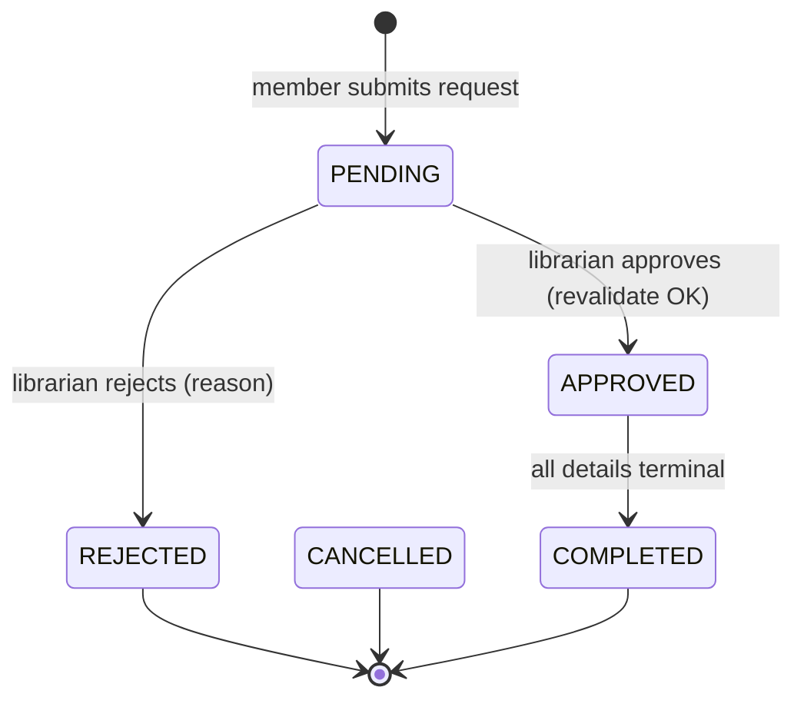
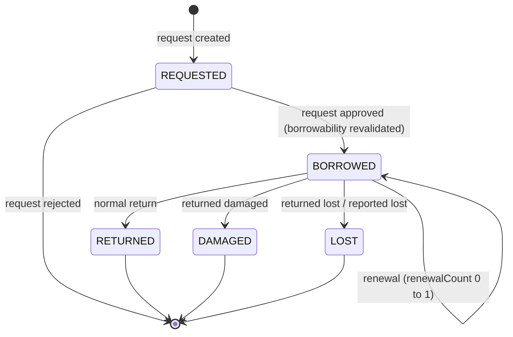

# SPEC.md - FE07 Quản lý mượn

# Phiên bản: 0.9.0

# Trạng thái: HOÀN THÀNH; PR #89 ĐÃ HỢP NHẤT; CI VÀ AZURE ĐÃ CHẠY THÀNH CÔNG TRÊN ĐÚNG COMMIT

# Chủ sở hữu: Nhat

# Cập nhật lần cuối: 2026-08-01

# ID tính năng: FE07

# Thư mục tính năng: `.sdd/specs/feat-borrowing-management/`

> Trạng thái triển khai hiện tại (2026-08-01): `COMPLETE`. PR #89 đã hoàn tất;
> CI `30675444178` và Azure `30675744992` đều đạt trên đúng commit.
> `TASKS.md` và `.sdd/reviews/phase2-full-exit-validation-2026-07-19.md`
> là nguồn thông tin chính thức về trạng thái triển khai hiện tại. Các nhãn `Not Started`,
> `PARTIAL`, `READY FOR REVIEW` hoặc các nhãn đang chờ xem xét được giữ lại bên dưới là
> chỉ là bản ghi lịch sử về kế hoạch và bằng chứng, không phải trạng thái triển khai hiện tại.

> Nguồn thông tin chính thức của FE07 Quản lý mượn. v0.5.1 giữ nguyên hợp đồng đối chiếu đã được phê duyệt và xác định rõ bộ lọc, phân trang, thứ tự cùng ngữ nghĩa ngày tháng của lịch sử mượn; bắt buộc có con người rà soát lại.
>
> Bản sửa đổi v0.7.4 yêu cầu các quyết định quá hạn khi trả/gia hạn phải dùng trình hỗ trợ ngày làm việc
> `Asia/Ho_Chi_Minh` dùng chung và xử lý bản sao vật lý không ở trạng thái `BORROWED`
> như một xung đột trạng thái trả sách rõ ràng.
>
> Bản sửa đổi v0.7.5 ban đầu mô hình hóa quyền nhân viên đối với tác nhân gia hạn có nhiều vai trò,
> yêu cầu phản hồi/kiểm toán khi trả sách phải dùng hạn trả đã khóa trong giao dịch,
> đồng thời cấm phép tính ngày gia hạn theo múi giờ cục bộ của máy chủ.
> Nhat đã phê duyệt bản sửa đổi bằng văn bản này vào 2026-07-27. Việc phê duyệt chỉ cho phép
> chuẩn bị PLAN/TASKS; triển khai vẫn chưa được xác nhận cho đến khi hoàn tất bằng chứng
> RED-GREEN và cổng chấp nhận. Tiền đề đa vai trò của bản sửa đổi này chỉ mang tính lịch sử
> và đã được v0.7.6 thay thế.
>
> Bản sửa đổi v0.7.6 dung hòa v0.7.5 với `DEC-GEN-005` trên toàn dự án: mọi
> tài khoản có chính xác một vai trò. Tài khoản đa vai trò không phải mô hình tác nhân được hỗ trợ.
> Tự phục vụ của Thành viên chỉ dành cho `MEMBER`; Thủ thư/Quản trị viên vẫn có phạm vi gia hạn
> cho nhân viên nhưng không được bỏ qua điều kiện của chủ sở hữu khoản mượn. Nhat đã xác nhận
> quyết định này và cho phép đối chiếu vào 2026-07-27.
>
> Bản sửa đổi v0.7.7 tích hợp thao tác bàn giao bản sao chuẩn ở phía FE08, đồng thời
> duy trì các quy tắc một vai trò, chính thức và ngày làm việc.
>
> Bản sửa đổi v0.7.8 tích hợp tín hiệu mượn hiện tại ở phía FE07 để FE08
> loại trừ đặt chỗ cùng một cuốn sách, đồng thời giữ nguyên thao tác bàn giao của v0.7.7 và mọi
> hợp đồng đối chiếu quy tắc.
>
> Bản sửa đổi v0.7.9 đối chiếu nhánh v0.7.8 song song với quy tắc chặn chuẩn của FE09 cho
> giá trị dương `UNPAID` và ngữ cảnh tiền phạt chỉ đọc của Thành viên từ
> `main@8d0059b`; quyền sở hữu bộ sưu tập nhân viên và tất cả các bất biến FE07 trước đó là
> không thay đổi.
>
> Bản sửa đổi v0.8.0 khép khoảng trống quyền sở hữu bản sao đang chờ: một `PENDING`
> BorrowRequest độc quyền giữ quyền sở hữu từng bản sao được yêu cầu mà không thay đổi
> `BookCopies.Status`. Danh sách ứng viên của Thành viên và thao tác tạo đều loại trừ bản sao đã được yêu cầu;
> các thay đổi thủ công của FE06 tôn trọng quyền sở hữu này; quyết định của Quản trị viên/Thủ thư
> tải lại trạng thái chuẩn và thao tác từ chối giải phóng quyền sở hữu một cách nguyên tử.
>
> Bản sửa đổi v0.8.1 thu hẹp khoảng cách spam cùng tiêu đề: một Thành viên có thể có nhiều nhất
> một quy trình mượn đang hoạt động cho mỗi `BookId` (`PENDING + REQUESTED` hoặc
> `BORROWED`). Ứng viên đọc và tạo giao dịch thực thi quy tắc; di sản
> các yêu cầu đang chờ trùng lặp vẫn có thể bị từ chối, còn thao tác phê duyệt không thể tạo
> khoản mượn hoạt động thứ hai cho cùng một tiêu đề.

---

## 1. Tổng quan về tính năng

### 1.1 Tên tính năng

Quản lý mượn

### 1.2 Bối cảnh kinh doanh

Quản lý mượn sách kiểm soát quy trình lưu thông chính của thư viện: thành viên yêu cầu mượn sách, thủ thư phê duyệt và xử lý yêu cầu, trả lại bản sao đã mượn, có thể gia hạn khoản mượn và lịch sử mượn sách được lưu giữ để báo cáo sau này và tính toán tiền phạt.

Tính năng này là cốt lõi vì dữ liệu mượn sai có thể làm hỏng hàng tồn kho, tiền phạt, đặt trước, báo cáo và lịch sử kiểm tra.

### 1.3 Mục tiêu / Kết quả

Hệ thống sẽ:

- Cho phép Thành viên đủ điều kiện tạo yêu cầu mượn.
- Cho phép Thủ thư/Quản trị viên phê duyệt hoặc từ chối yêu cầu mượn.
- Ghi lại các bản sao sách đã mượn với hạn trả và trạng thái.
- Xử lý các bản sao sách bị trả lại và cập nhật hàng tồn kho một cách chính xác.
- Cho phép gia hạn khi chính sách cho phép.
- Cung cấp lịch sử mượn sách cho thành viên và thủ thư.
- Giữ mọi thao tác mượn/trả có thể truy vết để kiểm toán và báo cáo.

### 1.4 Mức độ phạm vi

- [x] Đặc tả đầy đủ - logic nghiệp vụ cốt lõi, rủi ro cao, phải đúng ngay từ đầu
- [ ] Đặc tả tiêu chuẩn - tính năng thông thường, có quy tắc nghiệp vụ và bước xác thực
- [ ] Đặc tả rút gọn - UI đơn giản, tài liệu hoặc tính năng ít rủi ro

---

## 2. Tác nhân và quyền

| Tác nhân | Mô tả | Quyền/Trách nhiệm |
| --------- | ---------------------------- | --------------------------- |
| Thành viên | Người dùng thư viện không phải là nhân viên đã đăng ký | Tạo yêu cầu mượn của riêng mình, xem lịch sử mượn của riêng mình và chỉ gia hạn chi tiết đã mượn của riêng mình. |
| Thủ thư | Nhân viên thư viện | Xem thông tin mượn của Thành viên, phê duyệt/từ chối yêu cầu mượn, xử lý bàn giao/trả sách và gia hạn chi tiết mượn đủ điều kiện cho bất kỳ Thành viên nào. |
| Quản trị viên | Quản trị viên hệ thống | Có quyền của thủ thư, bao gồm cả việc gia hạn giữa các thành viên và có thể xem tất cả hồ sơ mượn. |
| Khách | Khách truy cập không được xác thực | Không có quyền mượn. |
| Dịch vụ thông báo | Dịch vụ bên ngoài | Có thể nhận yêu cầu thông báo khi kết quả mượn/trả/gia hạn thay đổi. |

---

## 3. Điều kiện tiên quyết

Tính năng này chỉ có thể bắt đầu khi:

- PRE-FE07-001: Tài khoản người dùng tồn tại và có trạng thái hoạt động.
- PRE-FE07-002: Thành viên/chủ sở hữu khoản mượn có vai trò duy nhất là `MEMBER` và `Users.Status = ACTIVE`; không yêu cầu phê duyệt tư cách Thành viên FE04. Tài khoản Thủ thư/Quản trị viên đã xác thực với vai trò nhân viên duy nhất có thể thay mặt Thành viên xử lý thao tác nhân viên được phép.
- PRE-FE07-003: Bản sao sách được yêu cầu tồn tại trong `BookCopies`.
- PRE-FE07-004: Hành động được bảo vệ được thực hiện bởi tác nhân được xác thực với vai trò chính xác.
- PRE-FE07-005: Giá trị chính sách cho mượn được phê duyệt: số bản mượn hoạt động tối đa là 5; giới hạn hàng ngày là 5 bản cho `Members.Status = APPROVED` chuẩn và 3 bản cho các bản khác; thời hạn cho mượn mặc định là 14 ngày dương lịch; giới hạn gia hạn là 1 lần gia hạn cho mỗi bản sao được mượn.

---

## 4. Luồng chính

### MF-FE07-001: Tạo yêu cầu mượn

1. Thành viên tìm kiếm hoặc duyệt sách.
2. Thành viên chọn một hoặc nhiều bản sao vật lý mà FE07 có thể phân loại là có thể mượn được.
3. Hệ thống xác nhận tính đủ điều kiện của thành viên.
4. Hệ thống xác nhận giới hạn mượn và khả năng mượn bản sao có nhận biết trước.
5. Hệ thống tạo bản ghi `BorrowRequests` với trạng thái `PENDING`.
6. Hệ thống tạo các bản ghi `BorrowDetails` liên quan cho các bản sao được yêu cầu với trạng thái `REQUESTED`.
7. Hệ thống hiển thị kết quả yêu cầu cho thành viên.

### MF-FE07-002: Phê duyệt và xử lý yêu cầu mượn

1. Thủ thư mở các yêu cầu mượn đang chờ xử lý.
2. Thủ thư xem xét thông tin thành viên, bản sao được yêu cầu và cảnh báo về tính đủ điều kiện.
3. Thủ thư phê duyệt yêu cầu.
4. Hệ thống xác nhận lại tính đủ điều kiện của thành viên và khả năng mượn bản sao có nhận biết trước.
5. Hệ thống đặt `BorrowRequests.Status` thành `APPROVED`.
6. Hệ thống đặt mỗi `BorrowDetails.Status` được phê duyệt thành `BORROWED`.
7. Hệ thống lưu `ApprovedAt`, `ApprovedBy` và `BorrowDate` của từng chi tiết bằng ngày/giờ máy chủ trong `Asia/Ho_Chi_Minh`.
8. Hệ thống chỉ định mỗi hạn trả là `BorrowDate + 14 calendar days`.
9. Hệ thống cập nhật từng `BookCopies.Status` liên quan thành `BORROWED`.
10. Đối với mỗi khoản giữ `NOTIFIED` thuộc sở hữu của người yêu cầu, hệ thống sẽ thay đổi việc đặt chỗ phù hợp thành `FULFILLED`.
11. Hệ thống ghi các mục nhật ký kiểm toán về thao tác mượn và hoàn tất đặt chỗ trong cùng một giao dịch.

### MF-FE07-003: Từ chối yêu cầu mượn

1. Thủ thư mở một yêu cầu mượn đang chờ xử lý.
2. Thủ thư nhập lý do từ chối.
3. Hệ thống đặt `BorrowRequests.Status` thành `REJECTED`.
4. Hệ thống giữ tất cả các bản sao sách liên quan có sẵn.
5. Hệ thống ghi một mục nhật ký kiểm toán.

### MF-FE07-004: Xử lý trả sách

1. Thủ thư tìm kiếm thành viên hoặc yêu cầu mượn.
2. Thủ thư chọn bản mượn đang được trả lại.
3. Thủ thư xác nhận tình trạng trả lại: bình thường, hư hỏng hoặc thất lạc.
4. Hệ thống xác nhận lại rằng cả bản sao chi tiết và bản sao vật lý đều là `BORROWED`, sau đó lưu trữ ngày trả lại bằng cách sử dụng ngày làm việc của `Asia/Ho_Chi_Minh`.
5. Hệ thống cập nhật `BorrowDetails.Status` thành `RETURNED`, `DAMAGED` hoặc `LOST`.
6. Hệ thống cập nhật `BookCopies.Status` thành `AVAILABLE`, `DAMAGED` hoặc `LOST`.
7. Hệ thống tính số ngày quá hạn theo lịch giữa hạn trả và ngày làm việc trả sách trong `Asia/Ho_Chi_Minh`, rồi cung cấp dữ liệu trả quá hạn, hư hỏng hoặc thất lạc cho FE09 Quản lý tiền phạt.
8. Nếu tất cả chi tiết trong yêu cầu là `RETURNED`, `DAMAGED` hoặc `LOST`, hệ thống sẽ đặt `BorrowRequests.Status` thành `COMPLETED`.
9. Hệ thống ghi một mục nhật ký kiểm toán.

### MF-FE07-005: Gia hạn sách mượn

1. Thành viên có một vai trò mở mục đang mượn của chính mình, hoặc Thủ thư/Quản trị viên có một vai trò mở mục đang mượn của bất kỳ Thành viên nào.
2. Tác nhân chọn bản mượn để gia hạn.
3. Hệ thống kiểm tra tính đủ điều kiện gia hạn của chủ sở hữu khoản mượn so với ngày kinh doanh `Asia/Ho_Chi_Minh` hiện tại: không quá hạn, không có khoản tiền phạt chưa thanh toán, số lần gia hạn là 0 và không có xung đột bảo lưu hoạt động từ FE08.
4. Hệ thống kéo dài hạn trả thêm 14 ngày theo lịch kể từ hạn trả hiện tại bằng cách sử dụng trình trợ giúp ngày làm việc chung.
5. Hệ thống đặt số lần gia hạn thành 1.
6. Hệ thống ghi một mục nhật ký kiểm toán và hiển thị hạn trả mới.

### MF-FE07-006: Xem lịch sử mượn

1. Thành viên mở lịch sử mượn của chính mình hoặc Thủ thư/Quản trị viên mở thông tin mượn của Thành viên.
2. Hệ thống xác thực `status`, `fromDate`, `toDate`, `page` và `limit` tùy chọn trước khi truy vấn.
3. Hệ thống chỉ trả về các bản ghi trong phạm vi thành viên được phép cho tác nhân, sử dụng `BorrowDate` cho các chi tiết được phê duyệt và `RequestDate` cho các chi tiết vẫn được yêu cầu khi áp dụng bộ lọc ngày.
4. Hệ thống trả về trang 1 với 20 hàng theo mặc định, không bao giờ nhiều hơn 100 hàng trên mỗi trang, theo thứ tự ổn định: `BorrowDate DESC` có giá trị rỗng cuối cùng, sau đó đến `BorrowDetailId DESC`.
5. Hệ thống hỗ trợ lọc theo trạng thái chi tiết và phạm vi ngày làm việc toàn diện.

---

## 5. Luồng thay thế

### AF-FE07-001: Thành viên không đủ điều kiện

1. Hệ thống phát hiện tài khoản không hoạt động, phạt chặn chưa thanh toán, khoản mượn quá hạn hoặc vượt quá hạn mức mượn.
2. Hệ thống từ chối yêu cầu hoặc hành động phê duyệt.
3. Hệ thống trả về thông báo lỗi rõ ràng giải thích lý do chặn.

### AF-FE07-002: Bản sao trở nên không thể mượn trước khi được phê duyệt

1. Thành viên tạo yêu cầu mượn khi bản sao đáp ứng hợp đồng khả năng mượn có xét đến đặt chỗ.
2. Trước khi thủ thư phê duyệt, một quy trình khác sẽ thay đổi trạng thái bản sao hoặc trạng thái đặt trước.
3. Hệ thống xác nhận lại trạng thái bản sao và quyền sở hữu đặt chỗ trong quá trình phê duyệt.
4. Hệ thống từ chối toàn bộ phê duyệt (tất cả hoặc không có gì trong Giai đoạn 1), giữ yêu cầu `PENDING` và trả về xung đột chặn an toàn.

### AF-FE07-003: Hoàn trả một phần

1. Một yêu cầu mượn có chứa nhiều bản sao được mượn.
2. Thành viên chỉ trả lại một số bản sao.
3. Hệ thống chỉ cập nhật các `BorrowDetails` được trả.
4. Các chi tiết còn lại sẽ được lưu giữ ở `BORROWED` cho đến khi được trả lại, bị mất hoặc bị hư hỏng.

### AF-FE07-004: Không được phép gia hạn

1. Tác nhân yêu cầu gia hạn.
2. Hệ thống phát hiện tình trạng chặn: mục quá hạn, phạt chặn chưa thanh toán, đạt đến giới hạn gia hạn hoặc đặt chỗ đang hoạt động của thành viên khác.
3. Hệ thống từ chối gia hạn và giữ nguyên hạn trả.

---

## 6. Quy tắc nghiệp vụ

Sử dụng các ID ổn định này cho các nhiệm vụ và bài kiểm tra.

- BR-FE07-001: Khách không thể tạo, phê duyệt, xử lý hoặc xem hồ sơ mượn được bảo vệ.
- BR-FE07-002: Thành viên chỉ có thể tạo yêu cầu mượn cho tài khoản của chính họ.
- BR-FE07-003: Mỗi tài khoản có chính xác một vai trò theo `DEC-GEN-005`. `LIBRARIAN` hoặc `ADMIN` có thể xem và xử lý thao tác mượn, bao gồm gia hạn, cho bất kỳ Thành viên nào. `MEMBER` chỉ được truy cập chi tiết của chính mình; quyền nhân viên không được bỏ qua các điều kiện được đánh giá đối với chủ sở hữu khoản mượn.
- BR-FE07-004: Thành viên phải có vai trò `MEMBER` và `Users.Status = ACTIVE` trước khi mượn hoặc gia hạn; Trạng thái đăng ký thành viên FE04 không chặn FE07.
- BR-FE07-005A: Phê duyệt FE04 xác định mức mượn hàng ngày mà không chặn việc mượn: `Members.Status = APPROVED` chuẩn cho phép 5 bản sao mỗi ngày làm việc của `Asia/Ho_Chi_Minh`; `NONE`, `PENDING`, `REJECTED` hoặc `INACTIVE` cho phép 3 bản sao mỗi ngày làm việc.
- BR-FE07-005: Khi tạo và phê duyệt, `activeBorrowedCount + requestedDetailCount` phải nhỏ hơn hoặc bằng 5. `activeBorrowedCount` chỉ tính `BorrowDetails.Status = BORROWED` hiện tại của thành viên; phê duyệt lấy khóa trong phạm vi thành viên và các hàng có liên quan theo thứ tự được xác định bởi NFR-FE07-TXN-003 trước khi tính toán số lượng, do đó các phê duyệt đồng thời không thể vượt quá 5.
- BR-FE07-006: Thành viên có khoản mượn quá hạn hoặc bất kỳ khoản phạt FE09 `UNPAID` nào lớn hơn 0 không thể tạo yêu cầu mượn mới hoặc gia hạn bản sao đang mượn. Thành viên có thể đối chiếu số tiền phạt với hạn trả/trả sách của FE07 qua `/fines/mine` chỉ đọc; chỉ Thủ thư/Quản trị viên mới có thể ghi nhận thu tiền.
- BR-FE07-007: Chỉ có thể mượn một bản sao khi FE07 phân loại nó là có thể mượn được theo BR-FE07-023.
- BR-FE07-008: Phê duyệt phải kiểm tra lại khả năng mượn bản sao nhận biết đặt trước và tính đủ điều kiện của thành viên.
- BR-FE07-009: Khi yêu cầu mượn được phê duyệt, mỗi trạng thái bản sao được mượn phải thay đổi thành `BORROWED`.
- BR-FE07-010: Mọi bản sao được mượn đều phải lưu trữ `BorrowDate`; hạn trả mặc định là `BorrowDate + 14 calendar days`.
- BR-FE07-011: Mỗi lần trả sách phải lưu ngày trả trong múi giờ hoạt động của thư viện `Asia/Ho_Chi_Minh`; ngày này không thể trước `BorrowDate` hoặc sau ngày làm việc hiện tại của máy chủ. Thao tác trả yêu cầu cả chi tiết mượn và bản sao vật lý vẫn ở trạng thái `BORROWED`; trạng thái bản sao không nhất quán trả về `BORROW_STATE_CONFLICT` mà không thay đổi dữ liệu.
- BR-FE07-012: Bản sao được trả bình thường phải trở thành `AVAILABLE`; nếu có hàng đợi đặt chỗ FE08 `ACTIVE` cho bản sao đó thì giao dịch trả phải giữ quyền sở hữu hàng đợi, và thao tác tạo/phê duyệt FE07 thông thường vẫn bị chặn đến khi FE08 xử lý hoặc giải quyết dứt điểm hàng đợi.
- BR-FE07-013: Bản sao bị mất hoặc bị hỏng không được tự động cung cấp.
- BR-FE07-014: Phải phát hiện và truy vết lượt trả quá hạn cho FE09 Quản lý tiền phạt. Số ngày quá hạn là khoảng cách theo ngày lịch giữa hạn trả được khóa bởi giao dịch trả sách chính thức và ngày trả đã commit trong `Asia/Ho_Chi_Minh`; không bao giờ dùng hạn trả cũ từ bước kiểm tra trước hoặc ranh giới nửa đêm theo múi giờ cục bộ của máy chủ. `fineCandidate` trả về phải phản ánh cùng các giá trị đã khóa.
- BR-FE07-015: Mỗi chi tiết mượn được gia hạn tối đa 1 lần; một lần gia hạn hợp lệ sẽ kéo dài hạn trả hiện tại thêm 14 ngày theo lịch bằng cách sử dụng trình trợ giúp ngày làm việc `Asia/Ho_Chi_Minh` được chia sẻ và không bao giờ sử dụng số học `Date` trên máy chủ lưu trữ.
- BR-FE07-016: Mọi thao tác tạo/phê duyệt/từ chối/trả/gia hạn đều phải được kiểm toán. Siêu dữ liệu kiểm toán khi trả sách phải dùng cùng hạn trả đã khóa trong giao dịch, ngày trả đã commit, tình trạng và kết quả quá hạn như `fineCandidate` trả về.
- BR-FE07-017: Lịch sử mượn phải ở chế độ chỉ đọc đối với thành viên.
- BR-FE07-018: Không được phép gia hạn khi vật phẩm đã quá hạn, thành viên chưa thanh toán tiền phạt, đã đạt đến giới hạn gia hạn hoặc vật phẩm đã được thành viên khác bảo lưu.
- BR-FE07-019: Các mục yêu cầu mượn đang chờ xử lý phải được lưu trữ trong `BorrowDetails` với trạng thái `REQUESTED`; không có bảng chi tiết yêu cầu riêng biệt nào được sử dụng trong Giai đoạn 1.
- BR-FE07-020: Khi tất cả chi tiết trong yêu cầu mượn đạt đến trạng thái cuối (`RETURNED`, `LOST` hoặc `DAMAGED`), trạng thái yêu cầu phải trở thành `COMPLETED`.
- BR-FE07-021: FE07 không được tính hoặc tạo bản ghi phạt cho lượt trả quá hạn, hư hỏng hoặc thất lạc; tính năng này chỉ cung cấp dữ liệu trả cho FE09 Quản lý tiền phạt.
- BR-FE07-022: Xử lý yêu cầu mượn ở Giai đoạn 1 là tất cả hoặc không có gì: nếu bất kỳ bản sao được yêu cầu nào bị trùng, không tồn tại hoặc không thể mượn theo BR-FE07-023 tại thời điểm tạo hay phê duyệt, toàn bộ yêu cầu/phê duyệt sẽ bị từ chối và không tạo yêu cầu một phần. Việc từ chối từng mục nhưng giữ các bản sao hợp lệ được hoãn sang giai đoạn sau.
- BR-FE07-023: FE07 chỉ có thể chấp nhận bản sao khi sách gốc có `Books.Status = ACTIVE` và bản sao là `AVAILABLE` mà không có quyền sở hữu đặt chỗ `ACTIVE`/`NOTIFIED`; hoặc khi sách gốc là `ACTIVE` và bản sao là `RESERVED` bởi đặt chỗ `NOTIFIED` thuộc Thành viên yêu cầu.
- BR-FE07-024: Hàng đợi đặt trước `ACTIVE` cho một bản sao chặn việc tạo và phê duyệt yêu cầu mượn thông thường cho đến khi nhân viên xử lý hoặc giải quyết hàng đợi đó.
- BR-FE07-025: Việc phê duyệt yêu cầu mượn cho đặt chỗ `NOTIFIED` thuộc người yêu cầu phải chuyển đặt chỗ phù hợp thành `FULFILLED` một cách nguyên tử cùng yêu cầu mượn, chi tiết, trạng thái bản sao và bản ghi kiểm toán.
- BR-FE07-026: Mọi yêu cầu đều lưu `CreatedBy`; lần phê duyệt lưu `ApprovedAt` và `ApprovedBy`; mọi chi tiết được phê duyệt đều lưu `BorrowDate`. Đây là các trường lịch sử giao dịch bắt buộc, không phải siêu dữ liệu kiểm toán tùy chọn.
- BR-FE07-027: Thao tác từ chối yêu cầu lý do không trống, đã cắt khoảng trắng, dài tối đa 500 ký tự và lưu lý do trong siêu dữ liệu kiểm toán từ chối.
- BR-FE07-028: Endpoint lịch sử mượn chỉ chấp nhận `status?`, `fromDate?`, `toDate?`, `page?` và `limit?`; mặc định là `page=1`, `limit=20`, giới hạn là `page>=1`, `limit=1..100`, phạm vi ngày bao gồm hai đầu và các hàng dùng thứ tự ổn định `BorrowDate DESC (nulls last), BorrowDetailId DESC`.
- BR-FE07-029: Các hàng chi tiết lịch sử mượn phải hiển thị trạng thái yêu cầu sở hữu tách biệt với trạng thái chi tiết được duy trì. Khi yêu cầu sở hữu là `REJECTED`, trạng thái hiển thị thành viên bị từ chối trong khi chi tiết vẫn tồn tại vẫn là `REQUESTED`.
- BR-FE07-030: Trước khi Thủ thư/Quản trị viên được phân quyền phê duyệt hoặc từ chối yêu cầu đang chờ, hộp thoại quyết định phải xác định chính xác yêu cầu, Thành viên, ngày yêu cầu và mọi bản sao vật lý được yêu cầu bằng phản hồi đọc chuẩn. Trường lý do từ chối phải luôn chỉnh sửa được, yêu cầu lý do đã cắt khoảng trắng dài 1..500 ký tự và không được mất tiêu điểm khi hộp thoại render lại.
- BR-FE07-031: Danh sách ứng viên mượn tự phục vụ của Thành viên, endpoint tạo yêu cầu và lịch sử cá nhân yêu cầu vai trò duy nhất của tài khoản là `MEMBER`; tài khoản `LIBRARIAN` và `ADMIN` không thể tự đặt hoặc mượn sách.
- BR-FE07-032: Chi tiết `BorrowDetails.Status = BORROWED` hiện tại là tín hiệu chính thức của FE08 rằng cùng một Thành viên không thể đặt trước bất kỳ bản sao nào khác có cùng `BookId`; trạng thái chi tiết đầu cuối không chặn việc đặt chỗ sau này.
- BR-FE07-033: Một bản sao có thể thuộc nhiều nhất một quyền sở hữu yêu cầu mượn đang hoạt động, được định nghĩa bằng `BorrowRequests.Status = PENDING` cùng `BorrowDetails.Status = REQUESTED`. Thao tác tạo quyền sở hữu phải khóa và kiểm tra lại bản sao cùng các quyền sở hữu hiện có một cách nguyên tử. Quyền sở hữu này không thêm giá trị `BookCopies.Status` mới; phê duyệt chuyển bản sao sang `BORROWED`, còn từ chối giải phóng quyền sở hữu vì yêu cầu không còn là `PENDING`.
- BR-FE07-034: Một Thành viên có thể có nhiều nhất một quy trình mượn đang hoạt động cho mỗi `BookId`, và mỗi yêu cầu chỉ được chứa nhiều nhất một bản sao vật lý của BookId đó. Hoạt động nghĩa là `BorrowRequests.Status = PENDING` với `BorrowDetails.Status = REQUESTED` hoặc `BorrowDetails.Status = BORROWED`. Quy trình bị từ chối hoặc đã kết thúc/đã trả không chặn yêu cầu sau này.

---

## 7. Yêu cầu chức năng

- FR-FE07-001: Khi thành viên gửi yêu cầu mượn, hệ thống sẽ xác thực tính đủ điều kiện của thành viên trước khi tạo yêu cầu.
- FR-FE07-002: Khi thành viên gửi yêu cầu mượn với dữ liệu hợp lệ, hệ thống sẽ tạo một yêu cầu mượn đang chờ xử lý và lưu trữ các mục được yêu cầu dưới dạng `BorrowDetails.Status = REQUESTED`.
- FR-FE07-003: Nếu không thể mượn bất kỳ bản sao nào được yêu cầu theo BR-FE07-023 thì hệ thống sẽ từ chối toàn bộ yêu cầu mượn và sẽ không tạo một phần yêu cầu. (Chính sách Giai đoạn 1: tất cả hoặc không có gì; việc từ chối từng mục là công việc trong tương lai - xem Phần 6 BR-FE07-022.)
- FR-FE07-004: Khi thủ thư phê duyệt yêu cầu mượn, hệ thống sẽ xác nhận lại tất cả các quy tắc kinh doanh trước khi phê duyệt.
- FR-FE07-005: Khi phê duyệt thành công, hệ thống sẽ lưu `ApprovedAt`, `ApprovedBy`, `BorrowDate`, hạn trả, trạng thái yêu cầu/chi tiết, trạng thái bản sao, thao tác hoàn tất đặt chỗ phù hợp và kiểm toán trong một giao dịch.
- FR-FE07-006: Khi Thủ thư từ chối yêu cầu mượn, hệ thống sẽ yêu cầu và lưu lý do từ chối trong siêu dữ liệu kiểm toán, đồng thời giữ nguyên trạng thái bản sao.
- FR-FE07-007: Khi Thủ thư xử lý trả sách, hệ thống sẽ khóa và yêu cầu bản sao vật lý ở trạng thái `BORROWED`, khóa chi tiết cùng các quyền sở hữu đặt chỗ liên quan, rồi cập nhật nguyên tử ngày trả, trạng thái chi tiết, trạng thái bản sao và kiểm toán; lượt trả bình thường đặt bản sao thành `AVAILABLE` nhưng giữ nguyên mọi quyền sở hữu hàng đợi `ACTIVE` của FE08. Kết quả giao dịch trả về hạn trả đã khóa và các giá trị trả đã commit để tạo phản hồi và kiểm toán.
- FR-FE07-008: Nếu hàng trả lại quá hạn, bị hư hỏng hoặc bị mất, hệ thống sẽ cung cấp đủ dữ liệu để FE09 tính toán hoặc tạo ra khoản tiền phạt liên quan và `fineCandidate` cộng với siêu dữ liệu kiểm tra trả lại sẽ chỉ được lấy từ các giá trị được trả về bởi giao dịch bị khóa chính thức.
- FR-FE07-009: Khi yêu cầu gia hạn, hệ thống sẽ cấp phạm vi nhiều thành viên cho tài khoản `LIBRARIAN` hoặc `ADMIN` một vai trò. Tài khoản `MEMBER` một vai trò phải sở hữu chi tiết. Hệ thống sẽ đánh giá mọi trình chặn đối với chủ sở hữu khoản mượn, cho phép tối đa 1 lần gia hạn và gia hạn hạn trả thêm 14 ngày theo lịch thông qua trình trợ giúp ngày làm việc `Asia/Ho_Chi_Minh` được chia sẻ chỉ khi tất cả các quy tắc đều vượt qua.
- FR-FE07-010: Khi thành viên xem lịch sử mượn, hệ thống sẽ chỉ trả về hồ sơ của thành viên đó.
- FR-FE07-011: Khi Thủ thư/Quản trị viên xem thông tin mượn của Thành viên, hệ thống sẽ cho phép tìm kiếm theo danh tính Thành viên.
- FR-FE07-012: Mặc dù chi tiết khoản mượn là `BORROWED`, bản sao liên quan sẽ không có sẵn để phê duyệt khoản mượn khác.
- FR-FE07-013: Khi tất cả chi tiết trong yêu cầu mượn là `RETURNED`, `LOST` hoặc `DAMAGED`, hệ thống sẽ cập nhật trạng thái yêu cầu thành `COMPLETED`.
- FR-FE07-028: Khi một thành viên hoặc nhân viên được ủy quyền yêu cầu lịch sử mượn, hệ thống sẽ xác thực `status`, `fromDate/toDate`, `page` và `limit` trước khi truy vấn, áp dụng phạm vi thành viên và trả về kết quả phân trang xác định bằng cách sử dụng thứ tự BR-FE07-028.
- FR-FE07-029: Khi thành viên xem chi tiết mượn có yêu cầu sở hữu là `REJECTED`, hệ thống sẽ trả về `requestStatus = REJECTED` và giao diện người dùng sẽ hiển thị `Đã từ chối` thay vì `Chờ xử lý` mà không thay đổi `BorrowDetails.Status`.
- FR-FE07-030: Khi Thủ thư/Quản trị viên mở quyết định phê duyệt hoặc từ chối, UI sẽ hiển thị dữ liệu yêu cầu/Thành viên/liên hệ cùng tiêu đề, tác giả, định danh, mã vạch, vị trí và trạng thái hiện tại của mọi bản sao đã có trong phản hồi nhân viên chuẩn, không lặp lại các trạng thái đó trong biểu ngữ tính khả dụng chung; trường lý do từ chối giữ nguyên tiêu điểm và toàn bộ giá trị được kiểm soát qua các lần render lại.
- FR-FE07-031: Khi Thủ thư/Quản trị viên xem xét khoản mượn đang hoạt động để trả, UI sẽ giữ nguyên ngày mượn, hạn trả và số lần gia hạn `BorrowDetails` chuẩn, dẫn xuất tình trạng hạn trả so với ngày làm việc `Asia/Ho_Chi_Minh` hiện tại và gắn nhãn rõ `Còn N ngày`, `Đến hạn hôm nay` hoặc `Quá hạn N ngày`, thay vì đặt `Đúng hạn` dưới tiêu đề `Quá hạn`.
- FR-FE07-032: NẾU mảng vai trò tương thích là dữ liệu kế thừa không hợp lệ chứa `MEMBER` cùng với `LIBRARIAN` hoặc `ADMIN` mặc dù có `DEC-GEN-005`, hệ thống sẽ từ chối một cách phòng thủ ứng cử viên tự phục vụ, tạo yêu cầu và truy cập lịch sử riêng bằng `403 ROLE_REQUIRED`; nhân viên vận hành các tuyến FE07 vẫn có sẵn theo vai trò bảo vệ hiện có của họ. Đây không phải là mô hình tài khoản đa vai trò được hỗ trợ.
- FR-FE07-033: KHI Thành viên tuân theo quá trình chuyển giao FE08 cho khoản lưu giữ `NOTIFIED` thuộc sở hữu của người yêu cầu, giao diện người dùng FE07 sẽ chọn `bookId` và `copyId` chuẩn chính xác được trả về bởi danh mục ứng viên mượn được bảo vệ và gửi bản sao đó thông qua quy trình làm việc yêu cầu chờ xử lý thông thường; Kiểm tra nhận thức đặt trước phía máy chủ vẫn chính thức.
- FR-FE07-034: KHI Thành viên liệt kê ứng viên mượn hoặc tạo yêu cầu, FE07 sẽ loại trừ/từ chối mọi bản sao đã thuộc một yêu cầu đang chờ khác; giao dịch tạo chính thức trả về `409 COPY_PENDING_REQUEST_CONFLICT` mà không ghi một phần yêu cầu/chi tiết/kiểm toán.
- FR-FE07-035: KHI Quản trị viên/Thủ thư phê duyệt hoặc từ chối yêu cầu, UI sẽ tải lại trạng thái yêu cầu chuẩn sau cả thành công lẫn xung đột. Chi tiết Quản trị viên hiển thị trạng thái hiện tại của từng bản sao vật lý; thao tác từ chối giải thích rằng lý do bắt buộc dài 1..500 ký tự sẽ giải phóng quyền sở hữu đang chờ.
- FR-FE07-036: KHI Thành viên liệt kê ứng viên hoặc tạo yêu cầu, FE07 sẽ ẩn/từ chối mọi bản sao có `BookId` đã có quy trình đang hoạt động cho Thành viên đó; giao dịch tạo chính thức trả về `409 BOOK_ALREADY_IN_BORROWING_WORKFLOW` mà không ghi một phần. Dữ liệu gửi chứa hai bản sao của cùng một `BookId` trả về `400 DUPLICATE_BOOK_IN_REQUEST`.
- FR-FE07-037: NẾU một yêu cầu đang chờ xử lý cũ sẽ cung cấp cho chủ sở hữu của nó bản sao `BORROWED` thứ hai của cùng một `BookId`, phê duyệt sẽ trả về `409 BOOK_ALREADY_BORROWED_BY_MEMBER`, giữ nguyên yêu cầu đang chờ xử lý và vẫn cho phép nhân viên từ chối với lý do chính đáng.
- FR-FE07-038: KHI Quản trị viên xem danh sách lưu hành, bảng sẽ hiển thị các trường thao tác `borrowDetailId`, Thành viên, tên sách, ngày mượn, hạn trả, ngày trả, số lần gia hạn, trạng thái và thao tác khả dụng trong các cột khớp, không yêu cầu cuộn ngang trên bố cục màn hình máy tính được hỗ trợ. `requestId` và mã vạch bản sao vẫn là dữ liệu nội bộ/chi tiết chuẩn nhưng không phải cột riêng trong danh sách.
- FR-FE07-039: KHI Thủ thư/Quản trị viên chọn một khoản mượn đang hoạt động có trạng thái hạn trả là `OVERDUE`, không gian làm việc trả sách phải hiển thị thao tác `Tạo phiếu phạt` chỉ truyền `borrowDetailId` chuẩn sang phép tính FE09; FE09 tiếp tục là nguồn chính thức đối với ngày tháng đã lưu, số ngày quá hạn, số tiền, xử lý trùng lặp và trạng thái khoản phạt.

### 7.1 Yêu cầu hành vi không mong muốn (Lỗi / Điều kiện bất thường)

Các yêu cầu EARS này bao gồm lỗi và các điều kiện bất thường. Mỗi dấu vết quay trở lại Trường hợp biên hiện có (EC-*), Quy tắc kinh doanh (BR-*) hoặc Luồng thay thế (AF-*).

- FR-FE07-014: NẾU `activeBorrowedCount + requestedDetailCount > 5` khi tạo hoặc phê duyệt, hệ thống sẽ từ chối toàn bộ hành động với `BORROW_LIMIT_EXCEEDED` và không thay đổi bản ghi nào. Sự phê duyệt phải có được khóa phạm vi thành viên và các hàng có liên quan theo thứ tự NFR-FE07-TXN-003 trước khi thực hiện phép tính này. (Nguồn: BR-FE07-005, AF-FE07-001, AC-FE07-003)
- FR-FE07-014A: NẾU bản sao của thành viên đã được yêu cầu vào ngày làm việc yêu cầu cộng với yêu cầu mới vượt quá cấp hàng ngày bắt nguồn từ FE04 hoặc các bản sao đã được phê duyệt vào ngày làm việc phê duyệt cộng với phê duyệt vượt quá cấp đó thì hệ thống sẽ từ chối toàn bộ hành động với `BORROW_DAILY_LIMIT_EXCEEDED`. Giới hạn là 5 đối với `APPROVED` và 3 đối với các trường hợp khác, sử dụng ngày `Asia/Ho_Chi_Minh`.
- FR-FE07-015: NẾU thành viên gửi yêu cầu mượn hoặc yêu cầu gia hạn trong khi tài khoản không hoạt động, hệ thống sẽ từ chối hành động đó và trả về lỗi về tính đủ điều kiện; một `MEMBER` đang hoạt động có thể tiếp tục mà không cần sự chấp thuận của FE04. (Nguồn: BR-FE07-004, EC-FE07-002, AF-FE07-001)
- FR-FE07-016: NẾU thành viên gửi yêu cầu mượn hoặc yêu cầu gia hạn trong khi có khoản mượn quá hạn hoặc bất kỳ khoản phạt `UNPAID` nào với số tiền lớn hơn 0, hệ thống sẽ từ chối hành động và trả về lỗi xác định khoản tiền phạt chặn hoặc khoản mượn quá hạn. (Nguồn: BR-FE07-006, BR-FE07-018, AF-FE07-001, AF-FE07-004)
- FR-FE07-017: NẾU yêu cầu mượn có chứa bản sao trùng lặp, bản sao không tồn tại hoặc bất kỳ bản sao nào không đạt BR-FE07-023, hệ thống sẽ từ chối toàn bộ yêu cầu và sẽ không tạo bất kỳ bản ghi `BorrowRequests`/`BorrowDetails` nào. (Chính sách Giai đoạn 1: tất cả hoặc không có gì; việc từ chối từng mặt hàng là công việc trong tương lai - xem BR-FE07-022.) (Nguồn: EC-FE07-004, EC-FE07-006, EC-FE07-007)
- FR-FE07-018: NẾU bất kỳ bản sao nào không đạt được hợp đồng mượn nhận biết đặt trước tại thời điểm phê duyệt, hệ thống sẽ từ chối toàn bộ phê duyệt, giữ nguyên tất cả dữ liệu (yêu cầu vẫn là `PENDING`) và trả về xung đột chặn an toàn. (Chính sách Giai đoạn 1: tất cả hoặc không có gì.) (Nguồn: BR-FE07-007, BR-FE07-008, EC-FE07-005, AF-FE07-002, AC-FE07-005)
- FR-FE07-019: KHI các thao tác phê duyệt đồng thời nhắm vào cùng bản sao hoặc cùng Thành viên, hệ thống sẽ tuần tự hóa chúng bằng `member-scoped lock -> BookCopies -> BorrowRequests/BorrowDetails -> Reservations`; mọi phép đếm đang hoạt động và việc xác nhận lại bản sao/đặt chỗ chỉ diễn ra sau khi lấy các khóa liên quan, vì vậy nhiều nhất một thao tác xung đột có thể thành công. (Nguồn: EC-FE07-011, EC-FE07-013, FR-FE07-012, BR-FE07-005)
- FR-FE07-020: NẾU yêu cầu gia hạn đối với chi tiết khoản mượn đã quá hạn theo ngày làm việc `Asia/Ho_Chi_Minh` hiện tại, đã được gia hạn một lần, bị chặn do chưa thanh toán tiền phạt hoặc được thành viên khác bảo lưu, hệ thống sẽ từ chối gia hạn và giữ nguyên hạn trả hiện tại. Việc so sánh quá hạn sẽ sử dụng trình trợ giúp ngày làm việc chung và độc lập với múi giờ của máy chủ. (Nguồn: BR-FE07-015, BR-FE07-018, AF-FE07-004, EC-FE07-010, AC-FE07-010)
- FR-FE07-021: NẾU thao tác trả hoặc gia hạn nhắm đến trạng thái chi tiết không hợp lệ, thao tác trả phát hiện bản sao vật lý không ở trạng thái `BORROWED`, hoặc ngày trả được cung cấp trước `BorrowDate` hay sau ngày làm việc hiện tại trong `Asia/Ho_Chi_Minh`, hệ thống sẽ từ chối thao tác mà không thay đổi hạn trả, dữ liệu trả, trạng thái bản sao hoặc kiểm toán thành công. Bản sao vật lý không nhất quán trả về `BORROW_STATE_CONFLICT`. (Nguồn: EC-FE07-008, EC-FE07-009, EC-FE07-010)
- FR-FE07-022: NẾU bất kỳ bước nào trong giao dịch phê duyệt hoặc trả sách thất bại, hệ thống sẽ hoàn tác toàn bộ giao dịch để trạng thái yêu cầu, trạng thái chi tiết, hạn trả, trạng thái bản sao, trạng thái đặt chỗ và nhật ký kiểm toán vẫn nhất quán. (Nguồn: EC-FE07-012, NFR-FE07-TXN-001, NFR-FE07-TXN-002)
- FR-FE07-023: NẾU bản sao được yêu cầu có hàng đợi đặt chỗ `ACTIVE`, FE07 sẽ từ chối tạo/phê duyệt bằng `RESERVATION_QUEUE_PRIORITY` và không thay đổi bản ghi nào.
- FR-FE07-024: NẾU bản sao là `RESERVED` theo đặt trước `NOTIFIED` thuộc sở hữu của thành viên bên mượn, FE07 sẽ cho phép tạo yêu cầu và sẽ xác nhận lại quyền sở hữu đó trong quá trình phê duyệt.
- FR-FE07-025: KHI nhân viên phê duyệt yêu cầu của chủ sở hữu đã nắm giữ, FE07 sẽ cập nhật mọi đặt chỗ `NOTIFIED` phù hợp thành `FULFILLED` trong giao dịch phê duyệt.
- FR-FE07-026: NẾU sách gốc là `INACTIVE` khi tạo hoặc phê duyệt yêu cầu, FE07 sẽ từ chối thao tác bằng `BOOK_INACTIVE` và không thay đổi trạng thái mượn, bản sao, đặt chỗ hoặc kiểm toán.
- FR-FE07-027: NẾU thiếu lý do từ chối, trống sau khi cắt bớt hoặc dài hơn 500 ký tự, FE07 sẽ từ chối lệnh từ chối và giữ nguyên yêu cầu `PENDING`.

---

## 8. Tiêu chí chấp nhận

- AC-FE07-001: Với Thành viên đủ điều kiện và bản sao `AVAILABLE` không có quyền sở hữu đặt chỗ, khi Thành viên tạo yêu cầu mượn, hệ thống sẽ tạo yêu cầu `PENDING` với các chi tiết được đánh dấu `REQUESTED`.
- AC-FE07-002: Với thành viên không hoạt động, khi thành viên tạo yêu cầu mượn thì hệ thống sẽ từ chối yêu cầu.
- AC-FE07-003: Với Thành viên có 4 chi tiết mượn đang hoạt động và gửi/phê duyệt yêu cầu chứa 2 chi tiết, khi kiểm tra giới hạn, FE07 sẽ trả về `BORROW_LIMIT_EXCEEDED` và giữ nguyên mọi trạng thái.
- AC-FE07-003A: Với một `MEMBER` đang hoạt động mà không có phê duyệt FE04 chuẩn đã yêu cầu 3 bản sao vào ngày làm việc hiện tại, khi một bản sao khác được yêu cầu, thì FE07 sẽ trả về `BORROW_DAILY_LIMIT_EXCEEDED`; với trạng thái chuẩn `APPROVED`, cho phép yêu cầu tối đa 5 bản sao vào ngày hôm đó theo tất cả các quy tắc mượn khác.
- AC-FE07-004: Với yêu cầu đang chờ và các bản sao vẫn đáp ứng BR-FE07-023, khi Thủ thư phê duyệt, FE07 sẽ lưu người phê duyệt/thời điểm phê duyệt/ngày mượn, đặt đúng trạng thái yêu cầu/chi tiết/bản sao, đặt hạn trả bằng ngày mượn +14 ngày và commit nguyên tử các cập nhật đặt chỗ/kiểm toán phù hợp.
- AC-FE07-005: Đưa ra yêu cầu đang chờ xử lý có bản sao không thể mượn được nữa theo BR-FE07-023, khi thủ thư phê duyệt yêu cầu đó thì hệ thống sẽ từ chối phê duyệt và giữ nguyên dữ liệu.
- AC-FE07-006: Khi cả chi tiết và bản sao vật lý vẫn là `BORROWED`, nếu Thủ thư xử lý lượt trả bình thường, hệ thống sẽ lưu ngày làm việc trả sách theo `Asia/Ho_Chi_Minh` và đánh dấu bản sao là `AVAILABLE`; nếu có hàng đợi FE08 `ACTIVE`, quyền sở hữu hàng đợi vẫn được giữ và thao tác mượn thông thường tiếp tục bị chặn cho đến khi FE08 giải quyết. Nếu trạng thái bản sao không nhất quán, thao tác trả bị từ chối bằng `BORROW_STATE_CONFLICT` mà không thay đổi dữ liệu.
- AC-FE07-007: Đối với một bản sao mượn được trả lại bị hỏng, khi thủ thư xử lý bản trả lại thì hệ thống sẽ đánh dấu bản sao `DAMAGED` và không cung cấp bản sao đó.
- AC-FE07-008: Đưa ra một bản sao mượn quá hạn có hạn trả thay đổi trước khi giao dịch trả lại nhận được khóa của nó, khi cam kết trả lại, thì `fineCandidate.overdueDays`, dữ liệu phản hồi và siêu dữ liệu kiểm tra được tính từ hạn trả bị khóa bởi giao dịch đó và ngày trả lại `Asia/Ho_Chi_Minh` đã cam kết.
- AC-FE07-009: Được cấp một bản sao được mượn đủ điều kiện mà không gia hạn trước đó, khi tài khoản chủ sở hữu một vai trò hoặc tài khoản Librarian/Admin một vai trò gia hạn nó thì hạn trả sẽ được kéo dài thêm 14 ngày theo lịch bằng cách sử dụng trình trợ giúp `Asia/Ho_Chi_Minh` được chia sẻ và số lần gia hạn sẽ trở thành 1. Tài khoản Thành viên không thể gia hạn chi tiết của thành viên khác.
- AC-FE07-010: Cung cấp một bản sao đã mượn quá hạn theo ngày làm việc chung của `Asia/Ho_Chi_Minh`, đã được gia hạn, bị chặn do chưa thanh toán tiền phạt hoặc được thành viên khác bảo lưu, khi gia hạn được yêu cầu theo bất kỳ múi giờ nào của máy chủ thì hạn trả vẫn không thay đổi và hệ thống sẽ trả về lý do.
- AC-FE07-011: Với thành viên đã đăng nhập, khi xem lịch sử mượn sẽ chỉ trả về hồ sơ mượn của thành viên đó.
- AC-FE07-012: Với Thủ thư/Quản trị viên, khi xem thông tin mượn của Thành viên, hệ thống có thể trả về hồ sơ cho Thành viên đã chọn.
- AC-FE07-013: Với tất cả các chi tiết trong yêu cầu mượn là `RETURNED`, `LOST` hoặc `DAMAGED`, khi quá trình xử lý trả lại kết thúc thì trạng thái yêu cầu sẽ trở thành `COMPLETED`.
- AC-FE07-014: Với lượt trả bị hư hỏng hoặc thất lạc, khi FE07 ghi nhận, FE07 không tạo bản ghi phạt; FE09 có thể tính hoặc tạo tiền phạt sau đó từ dữ liệu đã ghi.
- AC-FE07-015: Cho một hàng đặt trước đang hoạt động, khi thành viên khác tạo hoặc phê duyệt yêu cầu mượn, thì FE07 trả về `409 RESERVATION_QUEUE_PRIORITY` và giữ nguyên tất cả trạng thái.
- AC-FE07-016: Với bản sao RESERVED và đặt chỗ NOTIFIED thuộc người yêu cầu, khi chủ sở hữu tạo yêu cầu mượn, FE07 sẽ tạo yêu cầu đang chờ thông thường mà không giải phóng lượt giữ chỗ.
- AC-FE07-017: Với yêu cầu đang chờ, khi nhân viên phê duyệt, các bản ghi mượn, trạng thái bản sao, thao tác hoàn tất đặt chỗ và kiểm toán sẽ được commit nguyên tử.
- AC-FE07-018: Cho một bản sao có sổ gốc là `INACTIVE`, khi cố gắng tạo hoặc phê duyệt, thì FE07 trả về `BOOK_INACTIVE` và giữ nguyên tất cả trạng thái.
- AC-FE07-019: Với hai phê duyệt đồng thời sẽ đưa một thành viên từ 4 đến 6 chi tiết mượn hoạt động, sau đó tối đa một phê duyệt thành công và tổng số cam kết không bao giờ vượt quá 5.
- AC-FE07-020: Cho ngày trả lại trước `BorrowDate` hoặc sau ngày kinh doanh `Asia/Ho_Chi_Minh` hiện tại, khi gửi trả lại thì FE07 trả về `INVALID_RETURN_DATE` và giữ nguyên tất cả trạng thái.
- AC-FE07-021: Với yêu cầu đang chờ và lý do từ chối bị thiếu/trống/quá dài, khi nhân viên từ chối yêu cầu, FE07 sẽ từ chối lệnh và giữ yêu cầu ở trạng thái `PENDING`.
- AC-FE07-022: Đưa ra một yêu cầu lịch sử hợp lệ, khi không cung cấp phân trang thì FE07 sử dụng `page=1`, `limit=20`, bộ lọc ngày bao gồm và thứ tự `BorrowDate DESC`/`BorrowDetailId DESC` ổn định; các giá trị không hợp lệ sẽ bị từ chối trước khi thực hiện truy vấn.
- AC-FE07-023: Đưa ra yêu cầu mượn đang chờ xử lý của thành viên, khi nhân viên từ chối và thành viên tải lại lịch sử mượn, thì mọi chi tiết thuộc yêu cầu đó sẽ hiển thị `Đã từ chối`; yêu cầu vẫn là `REJECTED` và mỗi chi tiết được lưu giữ vẫn là `REQUESTED`.
- AC-FE07-024: Với yêu cầu đang chờ có một hoặc nhiều bản sao, khi Thủ thư/Quản trị viên mở thao tác phê duyệt hoặc từ chối, hộp thoại sẽ xác định yêu cầu/Thành viên và liệt kê mọi bản sao cùng các trường lưu hành liên quan, không có biểu ngữ tính khả dụng chung dư thừa; khi tác nhân nhập lý do từ chối nhiều ký tự, vùng văn bản giữ tiêu điểm/giá trị và lệnh từ chối chuẩn nhận lý do đã cắt khoảng trắng.
- AC-FE07-025: Với khoản mượn đang hoạt động có ngày mượn/đến hạn chuẩn và `renewalCount`, khi nhân viên mở quy trình Trả trước, đúng hoặc sau hạn trả, màn hình sẽ hiển thị nhãn còn lại/hôm nay/quá hạn phù hợp theo `Asia/Ho_Chi_Minh` và giải thích khoản mượn đã được gia hạn hay chưa mà không thay đổi ngày đã lưu.
- AC-FE07-026: Với mảng vai trò tương thích legacy cố ý bị hỏng, chứa `MEMBER + LIBRARIAN` hoặc `MEMBER + ADMIN`, khi tác nhân trực tiếp mở hoặc gọi danh sách ứng viên mượn của Thành viên, thao tác tạo yêu cầu hoặc lịch sử cá nhân, UI sẽ chuyển hướng đến trang chủ nhân viên và backend trả về `403 ROLE_REQUIRED` mà không tạo hay tiết lộ trạng thái tự phục vụ của Thành viên; các tài khoản được lưu vẫn có chính xác một vai trò.
- AC-FE07-027: Khi FE08 liên kết bản sao được giữ cho Thành viên đến `/borrowing/new?bookId={bookId}&copyId={copyId}`, nếu danh mục ứng viên FE07 chứa lượt giữ thuộc người yêu cầu, FE07 sẽ chọn trước chính xác bản sao và tạo yêu cầu `PENDING` thông thường để Thủ thư/Quản trị viên phê duyệt.
- AC-FE07-028: Cho Thành viên A có yêu cầu cấp bản sao đang chờ xử lý, khi Thành viên B tải ứng viên hoặc gửi cùng bản sao đó, thì bản sao đó sẽ không có trong ứng viên và tạo ra kết quả `409 COPY_PENDING_REQUEST_CONFLICT`; sau khi nhân viên từ chối yêu cầu của A, bản sao có thể được yêu cầu lại nếu tất cả các quy tắc FE07/FE08 khác đều vượt qua.
- AC-FE07-029: Với yêu cầu cũ đang chờ có bản sao vật lý không còn đủ điều kiện phê duyệt, khi Quản trị viên/Thủ thư cố phê duyệt, FE07 sẽ giữ yêu cầu ở trạng thái chờ, trả về xung đột có hướng xử lý, tải lại trạng thái bản sao/yêu cầu chuẩn và vẫn cho phép từ chối bằng lý do hợp lệ.
- AC-FE07-030: Với Thành viên đã có yêu cầu đang chờ hoặc khoản mượn đang hoạt động cho một đầu sách, khi Thành viên tải ứng viên hoặc gửi bản sao khác của đầu sách đó, đầu sách sẽ bị ẩn và thao tác tạo trả về `409 BOOK_ALREADY_IN_BORROWING_WORKFLOW`; sau khi yêu cầu bị từ chối hoặc bản sao được trả về trạng thái cuối, có thể tiếp tục tạo yêu cầu mới.
- AC-FE07-031: Với các hàng lưu hành chuẩn của Quản trị viên, khi danh sách trên màn hình hiển thị, mỗi hàng sẽ căn với chín tiêu đề đã phê duyệt, các giá trị Thành viên/sách dài được ngắt dòng trong ô tương ứng và cả cột `Mã yêu cầu` lẫn `Barcode` đều không gây tràn ngang.
- AC-FE07-032: Cho trước Thủ thư/Quản trị viên chọn một khoản mượn đang hoạt động và quá hạn, khi tác nhân chọn `Tạo phiếu phạt` thì frontend gọi phép tính FE09 chuẩn bằng `borrowDetailId` của khoản mượn đó, thông báo kết quả từ máy chủ và không bao giờ gửi số tiền phạt do máy khách kiểm soát; thao tác này không xuất hiện với khoản mượn chưa quá hạn.

---

## 9. Trường hợp biên và xử lý lỗi

| ID | Trường hợp biên / Lỗi | Hành vi hệ thống mong đợi |
| -- | ----------------- | ------------------------ |
| EC-FE07-001 | ID thành viên không tồn tại | Trả về lỗi không tìm thấy. |
| EC-FE07-002 | Tài khoản Thành viên không hoạt động | Từ chối thao tác mượn/gia hạn. |
| EC-FE07-003 | `MEMBER` đang hoạt động không được FE04 phê duyệt | Đừng từ chối chỉ vì tư cách thành viên; áp dụng cấp ba bản hàng ngày và tất cả các quy tắc FE07 khác. |
| EC-FE07-004 | ID bản sao không tồn tại | Từ chối mục yêu cầu. |
| EC-FE07-005 | Trạng thái bản sao hoặc đặt chỗ không đạt BR-FE07-023 trong quá trình phê duyệt | Từ chối toàn bộ phê duyệt và giữ nguyên mọi trạng thái. |
| EC-FE07-006 | Bản sao trùng trong cùng một yêu cầu mượn | Từ chối mục trùng lặp. |
| EC-FE07-007 | Yêu cầu mượn không có mục hợp lệ | Từ chối yêu cầu. |
| EC-FE07-008 | Hành động trả lại đối với mặt hàng đã được trả lại | Từ chối vì quá trình chuyển đổi trạng thái không hợp lệ. |
| EC-FE07-009 | Ngày trả về trước khi tồn tại `BorrowDate` | Từ chối ngày không hợp lệ. |
| EC-FE07-010 | Yêu cầu gia hạn sau khi mặt hàng đã được trả lại | Từ chối gia hạn. |
| EC-FE07-011 | Đồng thời phê duyệt cùng một bản sao | Chỉ có một sự chấp thuận có thể thành công; hành động sau đó phải thất bại một cách an toàn. |
| EC-FE07-012 | Cập nhật cơ sở dữ liệu bị lỗi một phần | Quay lại toàn bộ giao dịch. |
| EC-FE07-013 | Phê duyệt đồng thời cho cùng một thành viên sẽ vượt quá 5 chi tiết hoạt động | Tuần tự hóa theo thành viên; nhiều nhất một phê duyệt xung đột sẽ thành công. |
| EC-FE07-014 | Ngày trở về trong tương lai trong `Asia/Ho_Chi_Minh` | Từ chối ngày không hợp lệ và giữ nguyên tất cả trạng thái. |
| EC-FE07-015 | Lý do từ chối bị thiếu/trống/quá dài | Từ chối lệnh; yêu cầu vẫn là `PENDING`. |
| EC-FE07-016 | Yêu cầu lịch sử có trạng thái/ngày/trang/giới hạn không hợp lệ | Từ chối bằng phản hồi xác thực trước khi truy vấn; không âm thầm chuẩn hóa. |
| EC-FE07-017 | Hạn trả thay đổi sau bước kiểm tra trước nhưng trước khi giao dịch trả sách khóa chi tiết | Dùng hạn trả đã khóa trong giao dịch cho thao tác thay đổi, `fineCandidate` và siêu dữ liệu kiểm toán; không trộn giá trị kiểm tra trước với giá trị đã commit. |
| EC-FE07-018 | Dữ liệu tài khoản chứa nhiều hơn một vai trò mặc dù `DEC-GEN-005` | Hãy coi tài khoản là dữ liệu cũ không hợp lệ cần được FE11 sửa chữa; tài khoản đa vai trò không nằm trong mô hình tác nhân FE07 được hỗ trợ. |
| EC-FE07-019 | Việc gia hạn diễn ra theo múi giờ của máy chủ khác với `Asia/Ho_Chi_Minh` | Đưa ra quyết định đủ điều kiện và hạn trả giống như mọi máy chủ khác bằng cách sử dụng công cụ trợ giúp ngày làm việc chung. |

---

## 10. Yêu cầu về dữ liệu

### 10.1 Các thực thể có liên quan

| Thực thể | Mục đích trong tính năng này |
| ------ | ----------------------- |
| Users | Lưu tài khoản Thành viên, Thủ thư và Quản trị viên. |
| UserRoles | Kiểm tra quyền của tác nhân. |
| Users/UserRoles | Nguồn tài khoản và quyền vai trò chuẩn của FE02/FE11; `MEMBER` đang hoạt động sẽ đạt điều kiện. |
| Books | Cung cấp thông tin hiển thị sách và bảo vệ trạng thái sách gốc `ACTIVE` bắt buộc. |
| BookCopies | Theo dõi trạng thái và vị trí bản sao vật lý. |
| BorrowRequests | Lưu trữ tiêu đề yêu cầu mượn và trạng thái quy trình làm việc. |
| BorrowDetails | Lưu trữ hạn trả cấp bản sao, ngày trả lại và trạng thái mượn. |
| Fines | Được đọc để chặn mượn khi tiền phạt chưa thanh toán được cấu hình là điều kiện chặn. |
| Reservations | Được đọc để thực thi quy tắc ưu tiên và gia hạn khi tạo/phê duyệt; đặt chỗ `NOTIFIED` phù hợp được cập nhật nguyên tử thành `FULFILLED` khi phê duyệt. |
| Kiểm toánLogs | Ghi lại các hoạt động mượn mượn quan trọng. |

### 10.2 Trường dữ liệu

| Trường | Kiểu | Bắt buộc | Xác thực / Ghi chú |
| ----- | ---- | -------- | ------------------ |
| requestId | số nguyên | Có để cập nhật | Phải tồn tại trong `BorrowRequests`. |
| userId | số nguyên | Có | Phải tham khảo một người dùng thành viên. |
| copyId | số nguyên | Có | Phải tham khảo `BookCopies`. |
| requestDate | ngày giờ | Có | Mặc định theo thời gian máy chủ hiện tại. |
| createdBy | số nguyên | Có | Yêu cầu người tạo; yêu cầu do thành viên tạo sử dụng ID thành viên được xác thực. |
| approvedAt | ngày giờ | Bắt buộc phải phê duyệt | Dấu thời gian của máy chủ trong `Asia/Ho_Chi_Minh`; được lưu trữ trên `BorrowRequests`. |
| approvedBy | số nguyên | Bắt buộc phải phê duyệt | Đã xác thực Librarian/Admin, người đã phê duyệt yêu cầu. |
| borrowDate | ngày | Bắt buộc khi được phê duyệt | Ngày hoạt động của máy chủ ở `Asia/Ho_Chi_Minh`; được lưu trữ trên từng chi tiết được phê duyệt. |
| dueDate | ngày | Bắt buộc khi được phê duyệt | `borrowDate + 14 calendar days`. |
| returnDate | ngày | Cần thiết cho returned/lost/damaged | Mặc định là ngày kinh doanh `Asia/Ho_Chi_Minh` hiện tại; phải nằm trong khoảng từ `borrowDate` đến ngày làm việc hiện tại. |
| renewalCount | số nguyên | Có để được hỗ trợ gia hạn | Mặc định là 0; tối đa 1 cho mỗi `BorrowDetail`; SQL hiện có hỗ trợ trường này. |
| requestStatus | chuỗi | Có | Các giá trị: `PENDING`, `APPROVED`, `REJECTED`, `COMPLETED`, `CANCELLED`. Phản hồi chi tiết về lịch sử mượn mượn hiển thị trạng thái yêu cầu sở hữu này tách biệt với `detailStatus` vẫn tồn tại. |
| detailStatus | chuỗi | Có | Giá trị ổn định: `REQUESTED`, `BORROWED`, `RETURNED`, `LOST`, `DAMAGED`. `OVERDUE` được suy ra khi `status = BORROWED` và `dueDate < today`. |
| copyStatus | chuỗi | Có | Các giá trị được phê duyệt: `AVAILABLE`, `BORROWED`, `RESERVED`, `DAMAGED`, `LOST`, `INACTIVE`; FE07 chỉ sử dụng các chuyển tiếp thuộc sở hữu của nó. |
| actionReason | chuỗi | Bắt buộc khi từ chối; trường hợp khác là tùy chọn | Lý do từ chối được cắt khoảng trắng, dài 1..500 ký tự và lưu trong siêu dữ liệu kiểm toán; ghi chú trả/gia hạn vẫn là tùy chọn. |
| activeBorrowedCount | số nguyên | Dẫn xuất | Đếm `BorrowDetails.Status = BORROWED` hiện tại của Thành viên, được tính dưới khóa Thành viên khi phê duyệt. |
| requestedDetailCount | số nguyên | Dẫn xuất | Số chi tiết duy nhất trong thao tác tạo/phê duyệt hiện tại; `activeBorrowedCount + requestedDetailCount <= 5`. |
| historyStatus | chuỗi | Không | Chỉ truy vấn; một trong các `REQUESTED`, `BORROWED`, `RETURNED`, `LOST`, `DAMAGED`, `OVERDUE`; `OVERDUE` có nguồn gốc. |
| fromDate | ngày | Không | `YYYY-MM-DD` chỉ bao gồm truy vấn trong `Asia/Ho_Chi_Minh`; phải <= `toDate` khi cả hai đều được cung cấp. |
| toDate | ngày | Không | `YYYY-MM-DD` chỉ bao gồm truy vấn trong `Asia/Ho_Chi_Minh`; phải >= `fromDate` khi cả hai đều được cung cấp. |
| page | số nguyên | Không | Chỉ dùng cho truy vấn; mặc định là 1 và phải ít nhất bằng 1. |
| limit | số nguyên | Không | Chỉ dùng cho truy vấn; mặc định là 20 và phải từ 1 đến 100. |

### 10.3 Mô hình trạng thái & Quy tắc chuyển đổi

FE07 có hai vòng đời phải được mô hình hóa riêng nhưng nhất quán: vòng đời cấp yêu cầu (`BorrowRequests.Status`) và vòng đời cấp bản sao (`BorrowDetails.Status`). Trạng thái được lưu sử dụng các giá trị khai báo tại Mục 10.2. `OVERDUE` vẫn là kết quả báo cáo/bộ lọc dẫn xuất, không phải trạng thái chi tiết được lưu lâu dài.

Hai vòng đời được liên kết với nhau: một yêu cầu tổng hợp một hoặc nhiều chi tiết và yêu cầu đó chỉ đạt đến trạng thái `COMPLETED` đầu cuối khi mọi chi tiết mà nó sở hữu đã đạt đến trạng thái cấp bản sao đầu cuối (BR-FE07-020, FR-FE07-013).

#### (A) Vòng đời BorrowRequest (`BorrowRequests.Status`)

Giá trị trạng thái: `PENDING`, `APPROVED`, `REJECTED`, `COMPLETED`, `CANCELLED`.

##### A.1 Sơ đồ trạng thái

```mermaid
stateDiagram-v2
    [*] --> PENDING : member submits request
    PENDING --> APPROVED : librarian approves (revalidate OK)
    PENDING --> REJECTED : librarian rejects (reason)
    APPROVED --> COMPLETED : all details terminal
    REJECTED --> [*]
    CANCELLED --> [*]
    COMPLETED --> [*]
```

##### A.2 Mô tả trạng thái

| Trạng thái | Mô tả |
| ----- | ----------- |
| `PENDING` | Yêu cầu do Thành viên tạo; bản sao được yêu cầu được lưu dưới dạng `BorrowDetails.Status = REQUESTED`. Đang chờ quyết định của Thủ thư/Quản trị viên. |
| `APPROVED` | Thủ thư/Quản trị viên đã phê duyệt yêu cầu; mỗi chi tiết được phê duyệt chuyển sang `BORROWED`, hạn trả được đặt và bản sao liên quan chuyển thành `BORROWED`. Yêu cầu vẫn hoạt động đến khi mọi chi tiết đã trả/thất lạc/hư hỏng. |
| `REJECTED` | Thủ thư/Quản trị viên từ chối yêu cầu; mọi bản sao vẫn có sẵn và không chi tiết nào chuyển thành `BORROWED`. Trạng thái cuối. |
| `COMPLETED` | Mọi chi tiết của yêu cầu đã đạt trạng thái cấp bản sao cuối (`RETURNED`, `LOST` hoặc `DAMAGED`). Trạng thái cuối. |
| `CANCELLED` | Giá trị enum cuối được giữ để tương thích trong tương lai. Trạng thái này nằm ngoài phạm vi endpoint/nhiệm vụ hiện tại vì chưa phê duyệt quy tắc tác nhân, trình kích hoạt và dữ liệu. |

##### A.3 Chuyển tiếp hợp lệ

| Từ | Đến | Kích hoạt | Tình trạng | FR/BR |
| ---- | -- | ------- | --------- | ----- |
| `[*]` | `PENDING` | Thành viên gửi yêu cầu mượn hợp lệ | Thành viên đủ điều kiện; mọi bản sao được yêu cầu đều đáp ứng BR-FE07-023 | MF-FE07-001, FR-FE07-001, FR-FE07-002, BR-FE07-004, BR-FE07-005, BR-FE07-023 |
| `PENDING` | `APPROVED` | Thủ thư/Quản trị viên phê duyệt | Xác nhận lại điều kiện, giới hạn mượn trong phạm vi Thành viên, sách gốc và khả năng mượn có xét đặt chỗ | MF-FE07-002, FR-FE07-004, FR-FE07-005, BR-FE07-005, BR-FE07-008, BR-FE07-009, BR-FE07-023 |
| `PENDING` | `REJECTED` | Thủ thư/Quản trị viên từ chối | Có lý do từ chối; bản sao không thay đổi | MF-FE07-003, FR-FE07-006, BR-FE07-001 |
| `APPROVED` | `COMPLETED` | Trả lại kết thúc xử lý | Tất cả các chi tiết được sở hữu là `RETURNED`, `LOST` hoặc `DAMAGED` | MF-FE07-004, FR-FE07-013, BR-FE07-020 |

##### A.4 Chuyển đổi không hợp lệ (Bị cấm rõ ràng)

| Bị cấm | Lý do |
| --------- | ------ |
| `REJECTED` → `APPROVED` | Yêu cầu bị từ chối là trạng thái cuối; không thể phê duyệt nếu không tạo yêu cầu mới. |
| `REJECTED` → bất kỳ trạng thái nào | `REJECTED` là trạng thái cuối. |
| `CANCELLED` → bất kỳ trạng thái nào | `CANCELLED` là trạng thái cuối. |
| `COMPLETED` → `APPROVED` / `PENDING` | Yêu cầu đã hoàn thành không thể mở lại; khoản mượn được trả lại không được mượn lại. |
| `PENDING` → `COMPLETED` | Một yêu cầu không thể hoàn thành nếu không được phê duyệt trước (không có chi tiết nào có thể kết thúc trước `BORROWED`). |
| `APPROVED` → `PENDING` / `REJECTED` | Sau khi được phê duyệt (bản sao được đặt thành `BORROWED`), yêu cầu không thể trở lại trạng thái chờ xử lý hoặc bị từ chối. |

##### A.5 Bất biến

| ID | Bất biến |
| -- | --------- |
| INV-FE07-A1 | Một bản ghi `BorrowRequests` luôn giữ chính xác một giá trị `Status` từ enum được khai báo. |
| INV-FE07-A2 | Yêu cầu chỉ có thể chuyển đến `APPROVED` sau khi tính đủ điều kiện và khả năng mượn theo yêu cầu đặt trước được xác nhận lại (BR-FE07-008, BR-FE07-023). |
| INV-FE07-A3 | Chỉ yêu cầu `APPROVED` mới có thể sở hữu thông tin chi tiết về `BORROWED`; Các yêu cầu `PENDING`/`REJECTED`/`CANCELLED` không bao giờ sở hữu chi tiết `BORROWED`. |
| INV-FE07-A4 | Một yêu cầu trở thành `COMPLETED` khi và chỉ khi mọi chi tiết ở trạng thái cấp bản sao cuối (`RETURNED`/`LOST`/`DAMAGED`) (BR-FE07-020, FR-FE07-013). |
| INV-FE07-A5 | Mỗi chuyển đổi cấp yêu cầu đều ghi một mục nhật ký kiểm toán (BR-FE07-016, NFR-FE07-LOG-001). |
| INV-FE07-A6 | `REJECTED`, `CANCELLED` và `COMPLETED` là trạng thái cuối, không thể chuyển đổi thêm. |
| INV-FE07-A7 | Phê duyệt không thể cam kết nếu số lượng khoản mượn đang hoạt động bị khóa của thành viên cộng với số lượng chi tiết của yêu cầu này vượt quá 5 (BR-FE07-005, FR-FE07-014, FR-FE07-019). |

#### (B) Vòng đời BorrowDetail (`BorrowDetails.Status`)

Các giá trị trạng thái được lưu: `REQUESTED`, `BORROWED`, `RETURNED`, `LOST`, `DAMAGED`.

> Ghi chú triển khai **Giai đoạn 1 (OVERDUE dẫn xuất):** Trong Giai đoạn 1, hệ thống **không** lưu
> `BorrowDetails.Status = 'OVERDUE'`. “Quá hạn” được tính tại thời điểm truy vấn cho chi tiết `BORROWED` có
> `dueDate` trước ngày làm việc `Asia/Ho_Chi_Minh` hiện tại; FE09 sử dụng giá trị dẫn xuất này (BR-FE07-014).
> Việc xác thực trả và gia hạn bắt đầu từ `BORROWED` bất kể mục đó đã quá hạn hay chưa.
> Việc lưu trạng thái `OVERDUE` cùng công việc định kỳ để đặt trạng thái này được hoãn sang giai đoạn sau.

##### B.1 Sơ đồ trạng thái

```mermaid
stateDiagram-v2
    [*] --> REQUESTED : request created
    REQUESTED --> BORROWED : request approved (borrowability revalidated)
    REQUESTED --> [*] : request rejected
    BORROWED --> RETURNED : normal return
    BORROWED --> DAMAGED : returned damaged
    BORROWED --> LOST : returned lost / reported lost
    BORROWED --> BORROWED : renewal (renewalCount 0 to 1)
    RETURNED --> [*]
    DAMAGED --> [*]
    LOST --> [*]
```

##### B.2 Mô tả trạng thái

| Trạng thái | Mô tả |
| ----- | ----------- |
| `REQUESTED` | Bản sao được yêu cầu bên trong yêu cầu `PENDING`; bản sao chưa bàn giao, chưa có thời hạn nộp. |
| `BORROWED` | Bản sao được phê duyệt và bàn giao; vẫn tồn tại `BorrowDate` và hạn trả (`BorrowDate + 14 calendar days`). Có thể gia hạn một lần. `BookCopies.Status = BORROWED` liên quan. |
| `OVERDUE` | Bản sao vẫn bị giữ sau hạn trả và chưa được trả. **Dẫn xuất trong Giai đoạn 1 (không được lưu)** — được tính từ chi tiết `BORROWED` có `dueDate < today`; phải có thể phát hiện/truy vết cho FE09 (BR-FE07-014). Đây không phải trạng thái cuối; vẫn có thể trả sách. |
| `RETURNED` | Bản sao được trả trong tình trạng bình thường; `BookCopies.Status = AVAILABLE` tương ứng. Trạng thái cuối. |
| `DAMAGED` | Bản sao trả lại bị hư hỏng; `BookCopies.Status = DAMAGED` tương ứng; không tự động có sẵn. Trạng thái cuối. |
| `LOST` | Bản sao được báo thất lạc; `BookCopies.Status = LOST` tương ứng; không tự động có sẵn. Trạng thái cuối. |

##### B.3 Chuyển tiếp hợp lệ

| Từ | Đến | Kích hoạt | Tình trạng | FR/BR |
| ---- | -- | ------- | --------- | ----- |
| `[*]` | `REQUESTED` | Đã tạo yêu cầu mượn | Yêu cầu sở hữu là `PENDING` | MF-FE07-001, FR-FE07-002, BR-FE07-019 |
| `REQUESTED` | `BORROWED` | Yêu cầu được phê duyệt | Giới hạn Thành viên được khóa; bản sao đáp ứng BR-FE07-023; lưu ngày mượn/đến hạn và siêu dữ liệu người phê duyệt; hoàn tất lượt giữ NOTIFIED phù hợp | MF-FE07-002, FR-FE07-005, FR-FE07-025, BR-FE07-005, BR-FE07-007, BR-FE07-009, BR-FE07-010, BR-FE07-025, BR-FE07-026 |
| `REQUESTED` | `[*]` | Yêu cầu sở hữu bị từ chối | Bản sao có sẵn, chưa bàn giao | MF-FE07-003, BR-FE07-019 |
| `BORROWED` | `BORROWED` | Gia hạn | Không quá hạn, không nộp phạt chưa nộp, renewalCount = 0, không xung đột bảo lưu; hạn trả +14 ngày, renewalCount → 1 | MF-FE07-005, FR-FE07-009, BR-FE07-015, BR-FE07-018 |
| `BORROWED` | `RETURNED` | Trả bình thường | Lưu ngày trả; bản sao → `AVAILABLE`; mọi quyền sở hữu hàng đợi FE08 `ACTIVE` vẫn được thực thi | MF-FE07-004, FR-FE07-007, BR-FE07-011, BR-FE07-012 |
| `BORROWED` | `DAMAGED` | Trả và báo hư hỏng | Lưu ngày trả; bản sao → `DAMAGED`; không tự động có sẵn | MF-FE07-004, FR-FE07-007, BR-FE07-013 |
| `BORROWED` | `LOST` | Trả/báo thất lạc | Lưu ngày trả; bản sao → `LOST`; không tự động có sẵn | MF-FE07-004, FR-FE07-007, BR-FE07-013 |

##### B.4 Chuyển tiếp không hợp lệ (Bị cấm rõ ràng)

| Bị cấm | Lý do |
| --------- | ------ |
| `RETURNED` / `DAMAGED` / `LOST` → `BORROWED` | Trạng thái cấp bản sao cuối không thể mở lại; bản sao đã trả không thể được mượn lại trên cùng một chi tiết (FR-FE07-021, EC-FE07-008, EC-FE07-010). |
| `RETURNED` / `DAMAGED` / `LOST` → bất kỳ trạng thái nào | Trạng thái cuối không thể chuyển đổi thêm. |
| Quá hạn `BORROWED` → đổi mới | Không được phép gia hạn khi `dueDate < today` (BR-FE07-018, FR-FE07-020, AF-FE07-004). |
| `REQUESTED` → `RETURNED` / `LOST` / `DAMAGED` | Một bản sao chưa bao giờ được bàn giao (`BORROWED`) không thể được trả lại, bị mất hoặc bị hư hỏng. |
| `BORROWED` → `BORROWED` gia hạn lần thứ hai | Tối đa 1 lần gia hạn cho mỗi chi tiết; cấm gia hạn lần thứ hai (BR-FE07-015, FR-FE07-009, FR-FE07-020). |
| Bất kỳ khoản hoàn trả nào có ngày trước `BorrowDate` hoặc sau ngày kinh doanh `Asia/Ho_Chi_Minh` hiện tại | Chuyển đổi ngày không hợp lệ (BR-FE07-011, FR-FE07-021, EC-FE07-009, EC-FE07-014). |

##### B.5 Bất biến

| ID | Bất biến |
| -- | --------- |
| INV-FE07-B1 | Một bản ghi `BorrowDetails` luôn giữ chính xác một giá trị `Status` từ enum được khai báo. |
| INV-FE07-B2 | Một chi tiết chỉ có thể là `BORROWED` nếu yêu cầu sở hữu của nó là `APPROVED` (mirror INV-FE07-A3). |
| INV-FE07-B3 | Mọi chi tiết `BORROWED` đều có `BorrowDate` khác null và hạn trả = `BorrowDate + 14 calendar days` (BR-FE07-010, BR-FE07-026). |
| INV-FE07-B4 | `renewalCount` nằm trong {0, 1}; chỉ được phép gia hạn từ `BORROWED` với `renewalCount = 0` và không có điều kiện chặn (BR-FE07-015, BR-FE07-018). |
| INV-FE07-B5 | Chuyển đến `RETURNED`, `LOST` hoặc `DAMAGED` yêu cầu ngày trả được lưu trong khoảng bao gồm từ `BorrowDate` đến ngày làm việc `Asia/Ho_Chi_Minh` hiện tại (BR-FE07-011, FR-FE07-021). |
| INV-FE07-B6 | `BookCopies.Status` liên quan được giữ nhất quán với trạng thái chi tiết: `BORROWED` -> `BORROWED`, `RETURNED` -> `AVAILABLE`, `DAMAGED` -> `DAMAGED`, `LOST` -> `LOST`; yêu cầu xếp hàng `ACTIVE` FE08 có thể vẫn tồn tại trên bản sao `AVAILABLE` và vẫn chặn việc mượn mượn thông thường; khoản lưu giữ được thông báo thuộc sở hữu của người yêu cầu trở thành `FULFILLED` với sự chấp thuận (BR-FE07-007, BR-FE07-012, BR-FE07-013, BR-FE07-025, FR-FE07-012). |
| INV-FE07-B7 | Mọi chuyển đổi cấp chi tiết (phê duyệt/trả/gia hạn/thất lạc/hư hỏng) đều ghi một mục nhật ký kiểm toán (BR-FE07-016, NFR-FE07-LOG-001). |
| INV-FE07-B8 | Phê duyệt và trả lại các quá trình chuyển đổi là nguyên tử với các bản cập nhật liên quan của chúng; phê duyệt bao gồm việc thực hiện đặt chỗ phù hợp và tất cả các hoạt động kiểm tra liên quan, đồng thời việc thất bại một phần sẽ hủy bỏ toàn bộ giao dịch (FR-FE07-022, FR-FE07-025, NFR-FE07-TXN-001, NFR-FE07-TXN-002). |

---

## 11. API / Hợp đồng giao diện

> Hợp đồng API đã được phê duyệt cho FE07 Giai đoạn 1. Hợp đồng cuối cùng vẫn có trong SPEC.md này trừ khi nhóm giới thiệu lại tài liệu hợp đồng API được chia sẻ chuyên dụng.

| Phương thức | Endpoint | Tác nhân | Yêu cầu | Phản hồi | Ghi chú |
| ------ | -------- | ----- | ------- | -------- | ----- |
| GET | `/api/borrow-requests/candidates` | Thành viên | Truy vấn: `bookId?` là số nguyên dương, `q?` tối đa 200 ký tự | `{ books: [{ bookId, title, author, category, copies: [{ copyId, barcode, location }] }] }` | Danh mục được bảo vệ, chỉ trả các bản sao Thành viên hiện tại có thể đưa vào yêu cầu mượn; vẫn xác thực lại mọi quy tắc FE07/FE08 khi tạo yêu cầu. |
| POST | `/api/borrow-requests` | Thành viên | `{ copyIds: number[] }` | Đã tạo yêu cầu mượn | Tạo yêu cầu đang chờ xử lý. |
| GET | `/api/borrow-requests/me` | Thành viên | Truy vấn: `status?, fromDate?, toDate?, page=1, limit=20` | Lịch sử mượn mượn của chính mình được phân trang | `status` là trạng thái chi tiết bao gồm `OVERDUE` dẫn xuất; bộ lọc ngày được bao gồm và sử dụng BorrowDate hoặc RequestDate cho các hàng vẫn được yêu cầu; thứ tự ổn định là BorrowDate DESC null cuối cùng, BorrowDetailId DESC. Mỗi chi tiết được trả về bao gồm `requestStatus` từ yêu cầu sở hữu của nó; `status` vẫn giữ nguyên trạng thái chi tiết được các bộ lọc sử dụng. |
| GET | `/api/borrow-requests` | Librarian/Admin | Truy vấn: trạng thái, memberId | Danh sách yêu cầu mượn | Endpoint được bảo vệ. |
| GET | `/api/members/{memberId}/borrowings` | Librarian/Admin | Truy vấn: `status?, fromDate?, toDate?, page=1, limit=20` | Lịch sử mượn của Thành viên được chọn, có phân trang | Dùng cùng xác thực, ngữ nghĩa ngày, phạm vi Thành viên, giới hạn và thứ tự ổn định như endpoint Thành viên. Mỗi chi tiết trả về bao gồm `requestStatus` từ yêu cầu sở hữu; `status` vẫn là trạng thái chi tiết được bộ lọc sử dụng. |
| PATCH | `/api/borrow-requests/{requestId}/approve` | Librarian/Admin | Ghi chú tùy chọn | Yêu cầu được phê duyệt | Cập nhật giao dịch. |
| PATCH | `/api/borrow-requests/{requestId}/reject` | Librarian/Admin | `{ reason: string }` | Yêu cầu bị từ chối | Bắt buộc có lý do đã cắt khoảng trắng, tối đa 500 ký tự; lưu trong siêu dữ liệu kiểm toán. |
| PATCH | `/api/borrow-details/{borrowDetailId}/return` | Librarian/Admin | `{ condition: "NORMAL"|"DAMAGED"|"LOST", returnDate?: date, notes?: string }` | Chi tiết mượn đã cập nhật cùng `fineCandidate` | Mặc định là ngày làm việc `Asia/Ho_Chi_Minh` hiện tại; từ chối ngày tương lai/trước ngày mượn; lượt trả bình thường giữ mọi quyền sở hữu hàng đợi FE08 `ACTIVE` và ưu tiên mượn tương ứng. Phản hồi và kiểm toán lấy từ các giá trị hạn trả/trả đã khóa trong giao dịch. |
| PATCH | `/api/borrow-details/{borrowDetailId}/renew` | Member/Librarian/Admin | Ghi chú tùy chọn | Hạn trả đã cập nhật | Mỗi tài khoản có một vai trò. Thủ thư/Quản trị viên được gia hạn cho nhiều Thành viên; Thành viên phải sở hữu chi tiết. Mọi quy tắc về điều kiện của chủ sở hữu khoản mượn và ngày làm việc vẫn áp dụng. |

---

## 12. Yêu cầu phi chức năng

### 12.1 Bảo mật

- NFR-FE07-SEC-001: Mọi endpoint được bảo vệ phải yêu cầu xác thực.
- NFR-FE07-SEC-002: Quyền truy cập dựa trên vai trò phải được thực thi trên máy chủ.
- NFR-FE07-SEC-003: Thành viên không được truy cập vào lịch sử mượn mượn của thành viên khác.
- NFR-FE07-SEC-004: Tất cả ID yêu cầu, ID bản sao, giá trị trạng thái và ngày phải được xác thực trên máy chủ.

### 12.2 Tính toàn vẹn giao dịch

- NFR-FE07-TXN-001: Phê duyệt yêu cầu mượn phải nguyên tử: kiểm tra giới hạn trong phạm vi Thành viên, siêu dữ liệu người phê duyệt, ngày mượn/đến hạn, trạng thái yêu cầu/chi tiết/bản sao, thao tác hoàn tất đặt chỗ phù hợp và nhật ký kiểm toán phải cùng thành công hoặc cùng hoàn tác.
- NFR-FE07-TXN-002: Trả bản sao phải nguyên tử: trạng thái chi tiết, ngày trả, trạng thái bản sao, xác nhận lại quyền sở hữu đặt chỗ FE08 và nhật ký kiểm toán phải cùng thành công hoặc cùng hoàn tác. Luồng trả khóa `BookCopies -> BorrowDetails -> Reservations` trước khi chuyển trạng thái trả bình thường; kết quả giao dịch là nguồn chính thức duy nhất cho hạn trả, ngày trả, tình trạng và số ngày quá hạn trong phản hồi/kiểm toán.
- NFR-FE07-TXN-003: Thứ tự khóa phê duyệt là `member-scoped borrow-limit lock -> BookCopies -> BorrowRequests/BorrowDetails -> Reservations`. Việc đếm khoản mượn đang hoạt động và xác nhận lại bản sao/đặt chỗ chỉ diễn ra sau khi khóa các hàng liên quan; mọi lần ghi phê duyệt vẫn thuộc cùng giao dịch. Hậu tố liên quan đến bản sao dùng chung vẫn nhất quán với FE06: `BookCopies -> BorrowDetails -> Reservations`.

### 12.3 Hiệu năng

- NFR-FE07-PERF-001: Lịch sử mượn phải hỗ trợ hợp đồng phân trang `page`/`limit` chuẩn.
- NFR-FE07-PERF-002: Truy vấn lịch sử mượn mượn phải áp dụng các bộ lọc thành viên, trạng thái, ngày tháng và phân trang trong cơ sở dữ liệu trước khi cụ thể hóa các hàng; không được phép quét ứng dụng toàn bảng.
- NFR-FE07-PERF-003: Điểm cuối lịch sử phải áp dụng phân trang và thứ tự ổn định trước khi trả về hàng; `limit=20` mặc định và `limit=100` tối đa là các giá trị hợp đồng cố định.

### 12.4 Ghi log và kiểm toán

- NFR-FE07-LOG-001: Các thao tác tạo, phê duyệt, hoàn tất đặt chỗ, từ chối, trả, hư hỏng, thất lạc và gia hạn phải ghi các mục nhật ký kiểm toán.

### 12.5 Khả năng sử dụng

- NFR-FE07-UX-001: Lỗi xác thực phải giải thích lý do: thành viên không hoạt động, giới hạn mượn, bản sao không có sẵn, ưu tiên hàng đợi đặt trước, xung đột trạng thái đặt trước, tiền phạt chưa thanh toán, khoản mượn quá hạn hoặc trạng thái không hợp lệ.
- NFR-FE07-UX-002: Xác nhận yêu cầu mượn của thành viên sẽ chỉ hiển thị thông tin sách liên quan đến lưu hành và không hiển thị xếp hạng.
- NFR-FE07-UX-003: Thanh công cụ, bảng và phân trang lịch sử mượn của thành viên sẽ vẫn được tách biệt về mặt trực quan mà không chồng chéo hoặc phá vỡ bố cục thẻ.
- NFR-FE07-UX-004: Hộp thoại quyết định FE07 phải duy trì tiêu điểm bàn phím khi render trường nhập được kiểm soát, cung cấp quan hệ nhãn/trợ giúp có thể truy cập cho lý do từ chối và vẫn sử dụng được trên màn hình máy tính lẫn màn hình hẹp.
- NFR-FE07-UX-005: Không gian làm việc trả sách của nhân viên chỉ hiển thị cảnh báo xem xét tiền phạt cho kết quả đặc biệt là quá hạn, hư hỏng hoặc thất lạc; không hiển thị biểu ngữ xác nhận dư thừa khi lượt trả đúng hạn và chọn `NORMAL`.
- NFR-FE07-TIME-001: Ngày mượn, đến hạn, trả lại, gia hạn và quá hạn sử dụng công cụ trợ giúp ngày `Asia/Ho_Chi_Minh` được chia sẻ, bao gồm so sánh khả năng đủ điều kiện gia hạn và `dueDate + 14 calendar days`; `Date.setDate()` của máy chủ cục bộ, múi giờ của máy chủ và chuyển đổi UTC-nửa đêm không được làm thay đổi kết quả theo ngày theo lịch. Dấu thời gian liên tục chỉ có thể sử dụng UTC nội bộ nếu chuyển đổi API/business-date vẫn mang tính quyết định.

---

## 13. Ngoài phạm vi

Tính năng này không bao gồm:

- Lựa chọn hàng đợi FE08, hết hạn lượt giữ hoặc hủy quyền sở hữu; FE07 chỉ đọc quyền sở hữu đặt chỗ và hoàn tất lượt giữ `NOTIFIED` phù hợp thuộc người yêu cầu trong quá trình phê duyệt.
- Triển khai tính tiền phạt FE09, dù tính năng này cung cấp dữ liệu quá hạn/trả sách cho FE09.
- Triển khai gửi thông báo FE10.
- Cổng thanh toán trực tuyến thực sự.
- Tích hợp phần cứng RFID/QR.
- Đặt chỗ ngồi học.

---

## 14. Sự phụ thuộc

| Phụ thuộc | Loại | Ghi chú |
| ---------- | ---- | ----- |
| Xác thực FE02 | Nội bộ | Cần thiết cho danh tính tác nhân. |
| Quản lý Thành viên FE04 | Độc lập | Theo dõi đơn đăng ký Thành viên tùy chọn; không làm cổng chặn FE07. |
| FE06 Quản lý tồn kho / bản sao sách | Nội bộ | Cung cấp tính khả dụng bản sao và cập nhật trạng thái. |
| Quản lý đặt chỗ FE08 | Nội bộ | FE08 sở hữu thứ tự hàng đợi, lựa chọn lượt giữ, hủy và hết hạn. FE07 đọc quyền sở hữu `ACTIVE`/`NOTIFIED` khi tạo/phê duyệt/gia hạn và chỉ chuyển lượt giữ `NOTIFIED` phù hợp thuộc người yêu cầu thành `FULFILLED` trong quá trình phê duyệt. |
| FE09 Quản lý tiền phạt | Nội bộ | Đối chiếu ngày 2026-06-10: mọi khoản phạt chưa thanh toán lớn hơn 0 chặn khoản mượn mới và gia hạn. FE09 sở hữu việc tính/tạo tiền phạt từ dữ liệu trả sách FE07. |
| Quản lý thông báo FE10 | Nội bộ | Có thể thông báo kết quả mượn/trả/gia hạn. |
| FE11 Quản lý vai trò và người dùng | Nội bộ | Cung cấp vai trò và quyền. |
| Cơ sở dữ liệu SQL Server | Kỹ thuật | Script SQL hiện tại có `BorrowRequests`, `BorrowDetails` và `BookCopies`. |

---

## 15. Câu hỏi đã được giải quyết

| ID | Câu hỏi | Chủ sở hữu | Trạng thái |
| -- | -------- | ----- | ------ |
| Q-FE07-001 | Số lượng bản sao được mượn tối đa cho mỗi thành viên là bao nhiêu? | Team/Teacher | Đã giải quyết: 5 bản mượn đang hoạt động cho mỗi thành viên (DEC-GEN-001); cấp hàng ngày là 5 đối với các thành viên được FE04 phê duyệt và 3 đối với các tài khoản `MEMBER` đang hoạt động khác (quyết định của người dùng 2026-07-21). |
| Q-FE07-002 | Thời hạn cho mượn mặc định tính bằng ngày là bao nhiêu? | Team/Teacher | Đã giải quyết: 14 ngày theo lịch kể từ `BorrowDate` vẫn tồn tại, đây là ngày kinh doanh được phê duyệt trong `Asia/Ho_Chi_Minh` (DEC-GEN-002). |
| Q-FE07-003 | Mỗi chi tiết mượn được phép gia hạn bao nhiêu lần? | Team/Teacher | Đã giải quyết: 1 lần gia hạn cho mỗi `BorrowDetail`, thêm 14 ngày theo lịch kể từ hạn trả hiện tại. |
| Q-FE07-004 | Tiền phạt chưa thanh toán có chặn khoản mượn mới không? Nếu có, trạng thái/số tiền nào gây chặn? | Team/Teacher | Đã giải quyết: mọi khoản tiền phạt `UNPAID` lớn hơn 0 chặn khoản mượn mới và gia hạn. |
| Q-FE07-005 | Thành viên có thể tạo yêu cầu mượn trực tiếp hay Thủ thư phải tạo tại quầy? | Team/Teacher | Đã giải quyết: Thành viên tự tạo yêu cầu mượn; Thủ thư/Quản trị viên phê duyệt, từ chối, trả, gia hạn và xem lịch sử. |
| Q-FE07-006 | `BorrowDetails` có nên hỗ trợ `REQUESTED` hay các bản sao được yêu cầu nên được lưu trữ trong một bảng khác trước khi được phê duyệt? | Chủ sở hữu Team/DB | Đã giải quyết: sử dụng `BorrowDetails.Status = REQUESTED`; không có bảng chi tiết yêu cầu bổ sung trong Giai đoạn 1. |
| Q-FE07-007 | Trạng thái yêu cầu có tự động trở thành `COMPLETED` khi mọi chi tiết đã trả/thất lạc/hư hỏng không? | Đội | Đã giải quyết: có, đặt `BorrowRequests.Status = COMPLETED` khi mọi chi tiết đều ở trạng thái cuối. |
| Q-FE07-008 | Lượt trả hư hỏng/thất lạc có tạo ngay bản ghi phạt hay chỉ cung cấp dữ liệu cho FE09? | Team/Teacher | Đã giải quyết: FE07 chỉ ghi dữ liệu trả hư hỏng/thất lạc; FE09 sở hữu việc tạo tiền phạt. |
| Q-FE07-009 | Hợp đồng truy vấn lịch sử mượn là gì? | Chuẩn hóa đặc tả 2026-07-17 | Đã giải quyết: `status?, fromDate?, toDate?, page?, limit?`; trang 1/giới hạn 20, tối đa 100, phạm vi ngày làm việc bao gồm hai đầu, thứ tự BorrowDate/BorrowDetailId ổn định và xác thực trước truy vấn. |
| Q-FE07-010 | Tài khoản đa vai trò có được hỗ trợ không và vai trò nào có phạm vi gia hạn? | Nhat, 2026-07-27 | Đã giải quyết: không. Mỗi tài khoản có chính xác một vai trò theo DEC-GEN-005. Tài khoản Thành viên chỉ gia hạn chi tiết của chính mình; tài khoản Thủ thư/Quản trị viên có thể gia hạn chi tiết của bất kỳ Thành viên nào, và mọi bộ chặn nghiệp vụ đều được đánh giá theo chủ sở hữu khoản mượn. |

---

## 15.1 Ghi Chú Rà Soát Phê Duyệt

| Đánh giá sản phẩm | Kết quả |
| ----------- | ------ |
| Rà soát luồng | Các luồng tạo yêu cầu, phê duyệt/từ chối, trả, gia hạn và lịch sử đã được rà soát theo các quyết định FE07 đã giải quyết. Cập nhật luồng được phản ánh tại Mục 4, 6, 7 và 8. |
| Hợp đồng API | Được phê duyệt tại Mục 11 để lập kế hoạch API RESTful Giai đoạn 1. Các endpoint vẫn nằm trong SPEC.md này trừ khi tài liệu hợp đồng API dùng chung được giới thiệu lại. |
| Phụ thuộc FE08 | Tích hợp được phê duyệt: ưu tiên hàng đợi `ACTIVE` chặn tạo/phê duyệt thông thường; chủ sở hữu đã nhận thông báo có thể yêu cầu bản sao được giữ và phê duyệt FE07 sẽ hoàn tất đặt chỗ phù hợp một cách nguyên tử. FE08 vẫn sở hữu hàng đợi. |
| Phụ thuộc FE09 | Không còn xung đột FE07 sau quyết định: tiền phạt chưa thanh toán chặn mượn/gia hạn; FE07 cung cấp dữ liệu trả và FE09 sở hữu việc tính/tạo tiền phạt. |
| Khả năng kiểm tra | AC-FE07-001 đến AC-FE07-026 là cụ thể và có thể quan sát được. Lịch sử, quyết định của nhân viên, trạng thái trả lại, gia hạn một vai trò và hợp đồng bảo vệ mảng vai trò kế thừa không hợp lệ ánh xạ tới xác thực tập trung, phân trang, đặt hàng, hiển thị yêu cầu bị từ chối, bối cảnh quyết định, đầu vào ổn định, thời gian kinh doanh, siêu dữ liệu gia hạn và kiểm tra ranh giới vai trò trước khi có thể yêu cầu tuân thủ triển khai. |

---

## 16. Ma trận truy vết

| ID yêu cầu | Trường hợp sử dụng liên quan | Trường hợp thử nghiệm liên quan | Trạng thái |
| -------------- | ---------------- | ----------------- | ------ |
| AC-FE07-001 | UC29 | borrowingTuyến APIs.test.js > "thành viên chỉ tạo một yêu cầu đang chờ xử lý đối với các bản sao duy nhất có sẵn" | Sẵn sàng để xem xét |
| AC-FE07-002 | UC29 | borrowingTuyến APIs.test.js > "tài khoản không hoạt động bị từ chối trong khi MEMBER đang hoạt động có thể tạo yêu cầu mượn" | Sẵn sàng để xem xét |
| AC-FE07-003 | UC29, UC32 | Đã lên kế hoạch: từ chối 4 khoản đang hoạt động + yêu cầu 2 chi tiết khi tạo/phê duyệt | Đã lên kế hoạch |
| AC-FE07-004 | UC32 | Đã lên kế hoạch: lưu người phê duyệt, ngày mượn, hạn trả và cập nhật bản sao/đặt chỗ/kiểm toán nguyên tử | Đã lên kế hoạch |
| AC-FE07-005 | UC32 | borrowingTuyến APIs.test.js > "sự phê duyệt bị từ chối khi bản sao không còn tồn tại và dữ liệu không thay đổi" | Sẵn sàng để xem xét |
| AC-FE07-006 | UC33 | borrowingTuyến APIs.test.js > "trả lại bình thường đánh dấu bản sao AVAILABLE, lưu ngày trả lại và giữ nguyên mức độ ưu tiên đặt trước" | Sẵn sàng để xem xét |
| AC-FE07-007 | UC33 | borrowingTuyến APIs.test.js > "trả lại thông tin cập nhật xử lý chi tiết, sao chép, hoàn thiện và dữ liệu ứng viên tốt" | Sẵn sàng để xem xét |
| AC-FE07-008 | UC33 | borrowingTuyến APIs.test.js > "trả lời phản hồi và kiểm tra sử dụng hạn trả bị khóa bởi kho lưu trữ"; borrowingTầng truy cập dữ liệu.test.js > hợp đồng nguồn hoàn trả giao dịch | Hoàn thành |
| AC-FE07-009 | UC31 | borrowingTuyến APIs.test.js > "thủ thư một vai trò gia hạn khoản mượn thành viên khác trong khi thành viên vẫn thuộc phạm vi chủ sở hữu" | Hoàn thành |
| AC-FE07-010 | UC31 | Ma trận múi giờ UTC và America/New_York cộng với các trường hợp bảo tồn trình chặn gia hạn hiện có | Hoàn thành |
| AC-FE07-011 | UC30 | borrowingTuyến APIs.test.js > "lịch sử thành viên loại trừ yêu cầu thành viên khác" | Sẵn sàng để xem xét |
| AC-FE07-012 | UC34 | borrowingTuyến APIs.test.js > "thủ thư chỉ truy xuất tài liệu mượn của thành viên được chọn phù hợp với các bộ lọc trạng thái và ngày tháng"; "thủ thư lọc các khoản mượn của thành viên được chọn theo trạng thái QUÁ HẠN" | Sẵn sàng để xem xét |
| AC-FE07-013 | UC33 | borrowingTuyến APIs.test.js > "trả lại các bản cập nhật xử lý chi tiết, sao chép, hoàn thiện và dữ liệu ứng viên tốt" | Sẵn sàng để xem xét |
| AC-FE07-014 | UC33 | borrowingTuyến APIs.test.js > "trả lại thông tin cập nhật xử lý chi tiết, sao chép, hoàn thiện và dữ liệu ứng viên tốt" | Sẵn sàng để xem xét |
| AC-FE07-015 | UC29, UC32 | Tuyến FE07-T029 và các bài kiểm tra ưu tiên đặt trước SQL | Đã lên kế hoạch |
| AC-FE07-016 | UC29 | Kiểm tra lộ trình FE07-T029 dành cho lưu giữ thông báo thuộc sở hữu của người yêu cầu | Đã lên kế hoạch |
| AC-FE07-017 | UC32, UC35 | Các thử nghiệm phê duyệt và khôi phục FE07-T030 | Đã lên kế hoạch |
| AC-FE07-018 | UC29, UC32 | Đã lên kế hoạch: sách gốc không hoạt động trả về `BOOK_INACTIVE` | Đã lên kế hoạch |
| AC-FE07-019 | UC32 | Dự kiến: số phê duyệt đồng thời của các thành viên không bao giờ vượt quá 5 | Đã lên kế hoạch |
| AC-FE07-020 | UC33 | Đã lên kế hoạch: kiểm thử từ chối ngày trả trước ngày mượn/trong tương lai | Đã lên kế hoạch |
| AC-FE07-021 | UC32 | Đã lên kế hoạch: yêu cầu kiểm tra ranh giới lý do từ chối | Đã lên kế hoạch |
| AC-FE07-022 | UC30, UC34 | Đã lên kế hoạch: lịch sử xác thực filter/date/page/limit và trường hợp trật tự ổn định | Đã lên kế hoạch |
| AC-FE07-023 | UC30 | borrowingTuyến APIs.test.js > "lịch sử thành viên hiển thị yêu cầu sở hữu bị từ chối mà không thay đổi trạng thái chi tiết"; borrowingFrontend.test.js > "lịch sử thành viên hiển thị các yêu cầu bị từ chối mà không gắn nhãn lại các chi tiết đang chờ xử lý" | Hoàn thành |
| AC-FE07-024 | UC32, UC35 | borrowingFrontend.test.js > "các quyết định yêu cầu mượn hiển thị đầy đủ bối cảnh và đầu vào từ chối giúp tập trung vào các kết xuất" | Hoàn thành |
| AC-FE07-025 | UC33 | borrowingFrontend.test.js > "tình trạng hoàn trả sử dụng ngày kinh doanh tại Châu Á Hồ Chí Minh và giải thích trạng thái"; "các hàng trả về bảo toàn siêu dữ liệu gia hạn chuẩn từ BorrowDetails" | Hoàn thành |
| BR-FE07-001 | UC29-UC35 | Đã lên kế hoạch: ma trận phân quyền Khách/thao tác mượn được bảo vệ | Đã lên kế hoạch |
| BR-FE07-002 | UC29 | Đã lên kế hoạch: danh tính yêu cầu thành viên là thử nghiệm gắn với mã thông báo | Đã lên kế hoạch |
| BR-FE07-003 | UC31-UC35 | borrowingTuyến APIs.test.js > "thủ thư một vai trò gia hạn khoản mượn thành viên khác trong khi thành viên vẫn thuộc phạm vi chủ sở hữu" | Hoàn thành |
| BR-FE07-004 | UC29, UC32 | FT30, FT33 | Sẵn sàng để xem xét |
| BR-FE07-005 | UC29, UC32 | Đã lên kế hoạch: công thức + kiểm tra khóa phê duyệt trong phạm vi thành viên | Đã lên kế hoạch |
| BR-FE07-006 | UC29, UC31, UC32 | Đã lên kế hoạch: kiểm thử bộ chặn quá hạn/tiền phạt chưa thanh toán | Đã lên kế hoạch |
| BR-FE07-007 | UC29, UC32 | FT30, FT33 | Sẵn sàng để xem xét |
| BR-FE07-008 | UC32 | Đã lên kế hoạch: phê duyệt xác nhận lại mọi quy tắc điều kiện/bản sao | Đã lên kế hoạch |
| BR-FE07-009 | UC32, UC35 | FT33, FT36 | Sẵn sàng để xem xét |
| BR-FE07-010 | UC32, UC35 | Đã lên kế hoạch: Kiểm tra hạn trả BorrowDate +14 | Đã lên kế hoạch |
| BR-FE07-011 | UC33 | FT34 | Sẵn sàng để xem xét |
| BR-FE07-012 | UC33 | Đã lên kế hoạch: lượt trả bình thường đặt bản sao thành AVAILABLE một cách nguyên tử trong khi giữ quyền sở hữu đặt chỗ ACTIVE | Đã lên kế hoạch |
| BR-FE07-013 | UC33 | Đã lên kế hoạch: kiểm thử bản sao hư hỏng/thất lạc vẫn không khả dụng | Đã lên kế hoạch |
| BR-FE07-014 | UC33 | borrowingTuyến APIs.test.js > "trả lời phản hồi và kiểm tra sử dụng hạn trả bị khóa bởi kho lưu trữ" | Hoàn thành |
| BR-FE07-015 | UC31 | Ma trận múi giờ gia hạn UTC và America/New_York | Hoàn thành |
| BR-FE07-016 | UC29, UC31-UC33, UC35 | hồi quy kiểm toán lợi nhuận bị khóa cộng với phạm vi kiểm toán hành động bắt buộc hiện có | Hoàn thành |
| BR-FE07-017 | UC30 | Đã lên kế hoạch: kiểm thử lịch sử Thành viên chỉ đọc/chỉ chủ sở hữu | Đã lên kế hoạch |
| BR-FE07-018 | UC31 | FT32 | Sẵn sàng để xem xét |
| BR-FE07-019 | UC29 | FT30 | Sẵn sàng để xem xét |
| BR-FE07-020 | UC33 | FT34 | Sẵn sàng để xem xét |
| BR-FE07-021 | UC33 | FT34 | Sẵn sàng để xem xét |
| BR-FE07-022 | UC29, UC32 | Đã lên kế hoạch: kiểm thử tạo/phê duyệt nhiều bản sao theo nguyên tắc tất cả hoặc không có gì | Đã lên kế hoạch |
| BR-FE07-023 | UC29, UC32 | FE07-T029 | Đã lên kế hoạch |
| BR-FE07-024 | UC29, UC32 | FE07-T029 | Đã lên kế hoạch |
| BR-FE07-025 | UC32, UC35 | FE07-T030 | Đã lên kế hoạch |
| BR-FE07-026 | UC29, UC32 | Đã lên kế hoạch: Kiểm tra độ bền CreatedBy/ApprovedAt/ApprovedBy/BorrowDate | Đã lên kế hoạch |
| BR-FE07-027 | UC32 | Đã lên kế hoạch: lý do từ chối được lưu trữ trong kiểm tra siêu dữ liệu kiểm tra | Đã lên kế hoạch |
| BR-FE07-028 | UC30, UC34 | Đã lên kế hoạch: trường hợp hợp đồng lịch sử xác định | Đã lên kế hoạch |
| BR-FE07-029 | UC30 | FE07-T041 | Hoàn thành |
| BR-FE07-030 | UC32, UC35 | FE07-T042 | Hoàn thành |
| BR-FE07-032 | UC29, UC36, UC39 | FE08-T045 Bài kiểm tra loại trừ đặt trước cùng một cuốn sách | Thẻ tự động; đang chờ đánh giá của con người |
| FR-FE07-001 | UC29 | Đã lên kế hoạch: xác nhận tính đủ điều kiện trước khi chèn yêu cầu | Đã lên kế hoạch |
| FR-FE07-002 | UC29 | Đã lên kế hoạch: Yêu cầu ĐANG CHỜ + Thử nghiệm tạo chi tiết YÊU CẦU | Đã lên kế hoạch |
| FR-FE07-003 | UC29 | Đã lên kế hoạch: mục không thể mượn được từ chối toàn bộ bài kiểm tra yêu cầu | Đã lên kế hoạch |
| FR-FE07-004 | UC32 | Đã lên kế hoạch: kiểm tra xác nhận lại phê duyệt | Đã lên kế hoạch |
| FR-FE07-005 | UC32, UC35 | Đã lên kế hoạch: hoàn thành phê duyệt thử nghiệm giao dịch siêu dữ liệu/state | Đã lên kế hoạch |
| FR-FE07-006 | UC32 | Đã lên kế hoạch: kiểm tra lý do từ chối + kiểm tra bản sao không thay đổi | Đã lên kế hoạch |
| FR-FE07-007 | UC33 | hồi quy tuyến đường trả về bị khóa và hợp đồng nguồn giao dịch kho lưu trữ | Hoàn thành |
| FR-FE07-008 | UC33 | Hồi quy tuyến trả đã khóa chứng minh cùng ảnh chụp hạn trả/trả cho ứng viên phạt và kiểm toán | Hoàn thành |
| FR-FE07-009 | UC31 | Ranh giới nhân viên/Thành viên một vai trò, bộ chặn chủ sở hữu và ma trận gia hạn +14 ngày trên hai múi giờ | Hoàn thành |
| FR-FE07-010 | UC30 | FT31 | Sẵn sàng để xem xét |
| FR-FE07-011 | UC34 | FT35 | Sẵn sàng để xem xét |
| FR-FE07-012 | UC32, UC35 | Đã lên kế hoạch: Bản sao Mượn chặn một bài kiểm tra phê duyệt khác | Đã lên kế hoạch |
| FR-FE07-013 | UC33 | FT34 | Sẵn sàng để xem xét |
| FR-FE07-014 | UC29, UC32 | Đã lên kế hoạch: số lượng hoạt động + số lượng yêu cầu Kiểm tra boundary/hoàn tác | Đã lên kế hoạch |
| FR-FE07-015 | UC29, UC31 | borrowingTuyến APIs.test.js > "tài khoản không hoạt động bị từ chối trong khi MEMBER đang hoạt động có thể tạo yêu cầu mượn" | Sẵn sàng để xem xét |
| FR-FE07-016 | UC29, UC31 | borrowingTuyến APIs.test.js > "thành viên chưa nộp phạt không thể tạo yêu cầu mượn" | Sẵn sàng để xem xét |
| FR-FE07-017 | UC29 | borrowingTuyến APIs.test.js > "thành viên chỉ tạo một yêu cầu đang chờ xử lý đối với các bản sao duy nhất có sẵn" | Sẵn sàng để xem xét |
| FR-FE07-018 | UC32 | borrowingTuyến APIs.test.js > "sự phê duyệt bị từ chối khi bản sao không còn tồn tại và dữ liệu không thay đổi" | Sẵn sàng để xem xét |
| FR-FE07-019 | UC32 | Đã lên kế hoạch: kiểm tra phê duyệt đồng thời cùng một bản sao và cùng một thành viên | Đã lên kế hoạch |
| FR-FE07-020 | UC31 | borrowingTuyến APIs.test.js > "các trình chặn gia hạn từ chối và duy trì hạn trả: <điều kiện chặn>" | Sẵn sàng để xem xét |
| FR-FE07-021 | UC31, UC33 | Đã lên kế hoạch: trạng thái không hợp lệ + kiểm thử từ chối ngày làm việc trước ngày mượn/trong tương lai | Đã lên kế hoạch |
| FR-FE07-022 | UC29, UC32, UC33 | borrowingConcurrency.sqltest.js > "SQL tạo lỗi kiểm tra khôi phục các hàng yêu cầu, chi tiết, sao chép và kiểm tra"; "Lỗi kiểm tra phê duyệt SQL khôi phục yêu cầu, hạn trả chi tiết, bản sao và hàng kiểm tra"; "Lỗi kiểm tra trả lại SQL yêu cầu quay lại, ngày trả lại chi tiết, bản sao và hàng kiểm tra" | Sẵn sàng để xem xét |
| FR-FE07-023 | UC29, UC32 | Tuyến FE07-T029 và các bài kiểm tra ưu tiên đặt trước SQL | Đã lên kế hoạch |
| FR-FE07-024 | UC29, UC32 | FE07-T029 bài kiểm tra bản sao do chủ sở hữu giữ | Đã lên kế hoạch |
| FR-FE07-025 | UC32, UC35 | FE07-T030 thực hiện các thử nghiệm hoàn thành và khôi phục phê duyệt | Đã lên kế hoạch |
| FR-FE07-026 | UC29, UC32 | Đã lên kế hoạch: kiểm thử từ chối tạo/phê duyệt khi sách gốc không hoạt động | Đã lên kế hoạch |
| FR-FE07-027 | UC32 | Đã lên kế hoạch: lý do từ chối Kiểm tra xác thực trim/length | Đã lên kế hoạch |
| FR-FE07-028 | UC30, UC34 | Đã lên kế hoạch: phạm vi lịch sử Thành viên/nhân viên, bộ lọc, phân trang và thứ tự | Đã lên kế hoạch |
| FR-FE07-029 | UC30 | FE07-T041 | Hoàn thành |
| FR-FE07-030 | UC32, UC35 | FE07-T042 | Hoàn thành |
| FR-FE07-031 | UC33 | FE07-T045 | Hoàn thành |
| FR-FE07-032 | UC29-UC31 | Các bài kiểm tra truy cập đơn vai trò FE07-T047 | Hoàn thành |
| FR-FE07-033 | UC29, UC36 | FE07-T048 thử nghiệm giao diện bàn giao bản sao chính xác được giữ lại | Hoàn thành |
| AC-FE07-026 | UC29-UC31 | FE07-T047 kiểm tra từ chối mảng kế thừa không hợp lệ | Hoàn thành |
| AC-FE07-027 | UC29, UC36 | FE07-T048 kiểm tra chọn trước bản sao chính xác | Hoàn thành |
| BR-FE07-033; FR-FE07-034; AC-FE07-028 | UC29, UC32 | Hồi quy quyền sở hữu bản sao của yêu cầu đang chờ ở tuyến/tầng truy cập dữ liệu | Kiểm thử tự động đạt; đang chờ con người rà soát |
| FR-FE07-035; AC-FE07-029 | UC32, UC35 | Kiểm thử hiển thị trạng thái bản sao và tải lại chuẩn cho Quản trị viên/Thủ thư | Kiểm thử tự động đạt; đang chờ con người rà soát |
| FR-FE07-038; AC-FE07-031 | UC34 | Cột lưu thông của quản trị viên và bài kiểm tra hợp đồng giao diện người dùng phù hợp với máy tính để bàn | Thẻ tự động; đang chờ đánh giá của con người |
| FR-FE07-039; AC-FE07-032 | UC33, UC42 | Kiểm thử hợp đồng frontend từ không gian trả sách quá hạn tới phép tính FE09 | Kiểm thử tự động đạt; đang chờ con người rà soát |

---

## 17. Danh sách kiểm tra đánh giá

Danh sách kiểm tra phê duyệt giai đoạn 1 (hoàn thành trên 2026-06-10):

- [x] Các câu hỏi đã giải quyết Q-FE07-001 đến Q-FE07-008 được ghi vào Mục 15 với các quyết định đã được phê duyệt.
- [x] Hạn mức mượn và thời hạn mượn đã được phê duyệt.
- [x] Thiết kế cơ sở dữ liệu cho các bản sao được yêu cầu trước khi phê duyệt được xác nhận.
- [x] Nhóm xem xét các luồng lịch sử trả lại, gia hạn và mượn.
- [x] Hợp đồng API được phê duyệt trong SPEC.md này hoặc được sao chép vào tệp hợp đồng API được chia sẻ chuyên dụng nếu nhóm giới thiệu lại một tệp.
- [x] Các phần phụ thuộc FE08/FE09 được kiểm tra xung đột.
- [x] Mọi tiêu chí chấp nhận đều có thể trở thành một bài kiểm tra.

### 17.1 Cổng Rà Soát Bản Sửa Đổi v0.5.0

- [x] Xác nhận bộ bảo vệ `Members.Status` và `Books.Status = ACTIVE` chuẩn.
- [x] Xác nhận `activeBorrowedCount + requestedDetailCount <= 5` và khóa phê duyệt trong phạm vi thành viên.
- [x] Xác nhận siêu dữ liệu yêu cầu/phê duyệt/mượn bắt buộc và ngày làm việc `Asia/Ho_Chi_Minh`.
- [x] Xác nhận việc từ chối ngày trả lại trong tương lai và lý do từ chối bắt buộc.
## Chỉnh sửa không gian làm việc trả sách 2026-07-22

- Danh sách Trả về Quy trình và chi tiết khoản mượn đã chọn sử dụng không gian làm việc một cột ổn định để bảng giao dịch bảy cột không thể va chạm với bảng chi tiết trên máy tính để bàn hoặc có chiều rộng hẹp.
- Các lệnh phê duyệt và từ chối lấy rõ mục tiêu yêu cầu, xác thực ID dạng số, gọi endpoint FE07 chuẩn và tải lại trạng thái máy chủ. Cơ sở dữ liệu hiện tại phải có các cột dấu thời gian quy trình BorrowRequests chuẩn qua migration tương thích 2026-07-22.

### 17.2 Cổng UX Cho Quyết Định Và Trả Sách Của Nhân Viên Trong Bản Sửa Đổi v0.7.3

- [x] Xác nhận thao tác phê duyệt/từ chối vẫn giới hạn cho tác nhân `LIBRARIAN`/`ADMIN` đã xác thực và dùng endpoint FE07 chuẩn.
- [x] Hộp thoại xác nhận quyết định chỉ sử dụng các trường chuẩn do nhân viên đọc và không tạo ra bằng chứng đủ điều kiện.
- [x] Xác nhận thao tác phê duyệt vẫn xác nhận lại điều kiện, giới hạn, bản sao, đặt chỗ, tiền phạt, quá hạn và trạng thái đặt chỗ trên máy chủ.
- [x] Xác nhận thao tác từ chối vẫn yêu cầu lý do chuẩn dài 1..500 ký tự đã cắt khoảng trắng và không thay đổi trạng thái bản sao.
- [x] Con người đã xem xét khác biệt hoàn chỉnh; các lượt H2/H3, PR #89, CI và Azure trên đúng commit đã đóng bằng chứng tích hợp.

### 17.3 Bản sửa đổi v0.7.5 Cổng điều chỉnh quy tắc kinh doanh

- [x] Quyết định ưu tiên đa vai trò v0.7.5 lịch sử được ghi lại; được thay thế bằng hợp đồng vai trò đơn v0.7.6 bên dưới.
- [x] Khóa phản hồi trả về và tính toán kiểm tra đối với kết quả giao dịch chính thức.
- [x] Khóa so sánh gia hạn và mở rộng cho những người trợ giúp `Asia/Ho_Chi_Minh` được chia sẻ.
- [x] Nhat đã trực tiếp xem xét và phê duyệt SPEC v0.7.5 bằng văn bản vào 2026-07-27; PLAN/TASKS có thể tiếp tục, trong khi việc triển khai vẫn bị chặn trong khi chờ phê duyệt kế hoạch.

### 17.4 Bản sửa đổi v0.7.6 Cổng tích hợp chính

- [x] Áp dụng `DEC-GEN-005` trên toàn dự án: mỗi tài khoản được duy trì đều có chính xác một vai trò.
- [x] Từ chối các tài khoản đa vai trò dưới dạng mô hình tác nhân không được hỗ trợ; FE11 sửa chữa các ánh xạ cũ thành một vai trò.
- [x] Duy trì tính năng tự phục vụ dành riêng cho thành viên đối với tài khoản Thành viên trong khi vẫn duy trì việc gia hạn hoạt động Librarian/Admin.
- [x] Duy trì tính đủ điều kiện của chủ sở hữu khoản mượn, tiền phạt, quá hạn, bảo lưu và kiểm tra giới hạn gia hạn.
- [x] Nhat ủy quyền thực hiện đối chiếu vào 2026-07-27; khác biệt tích hợp vẫn tuân theo phụ lục H2 trước khi commit.

## 18. Phụ lục luồng demo liên hoàn FE07-FE12 v0.9.0

Đợt: `BATCH-FE07-FE12-CONNECTED-DEMO-2026-07-29`.

### 18.1 Quy tắc kinh doanh

- BR-FE07-035: Sau khi transaction FE07 commit, yêu cầu thông báo kết quả mượn
  gửi tới FE10 phải lũy đẳng theo khóa sự kiện nguồn và không được hoàn tác
  transaction FE07 nếu FE10 thất bại.
- BR-FE07-036: Phản hồi trả sách chỉ được công khai một bàn giao FE08 chỉ đọc;
  bàn giao không tự xử lý hàng đợi hay đổi trạng thái reservation.
- BR-FE07-037: Timeline hành trình mượn chỉ được suy ra từ trạng thái và dấu
  thời gian chuẩn; không tạo trạng thái hoặc thời gian giả.

### 18.2 Yêu cầu chức năng

- FR-FE07-040: Sau phê duyệt hoặc từ chối yêu cầu, FE07 yêu cầu FE10 tạo thông
  báo kết quả an toàn cho đúng thành viên.
- FR-FE07-041: Sau gia hạn hoặc trả thành công, FE07 yêu cầu FE10 tạo thông báo
  kết quả an toàn cho đúng thành viên.
- FR-FE07-042: Kết quả trả có thể bổ sung
  `reservationQueueAction = { copyId, hasActiveQueue, actionPath }`; action path
  cố định là `/librarian/reservations`.
- FR-FE07-043: Lịch sử thành viên hiển thị timeline từ trạng thái/timestamp
  chuẩn.
- FR-FE07-044: UI ánh xạ điều kiện chặn/lỗi thời conflict sang hướng dẫn tải lại hoặc
  hành động tiếp theo trung thực.

### 18.3 Tiêu chí chấp nhận và truy vết

- AC-FE07-033: Duyệt/từ chối tạo đúng một thông báo kết quả, ánh xạ `AT-002`,
  `AT-003`.
- AC-FE07-034: Trả bản sao có hàng đợi commit FE07 nhưng không thao tác thay đổi dữ liệu FE08 và
  trả bàn giao chỉ đọc, ánh xạ `AT-004`.
- AC-FE07-035: FE10 thất bại không hoàn tác FE07 và UI hiện cảnh báo trung thực,
  ánh xạ `AT-009`.
- AC-FE07-036: Timeline màn hình máy tính dùng đúng trạng thái/timestamp chuẩn, không
  tạo thời gian giả, ánh xạ `AT-001`, `AT-012`.

Triển khai phải đi qua `SL-003` và `SL-006` của kế hoạch đợt; product code
giữ chưa được commit đến H2.
