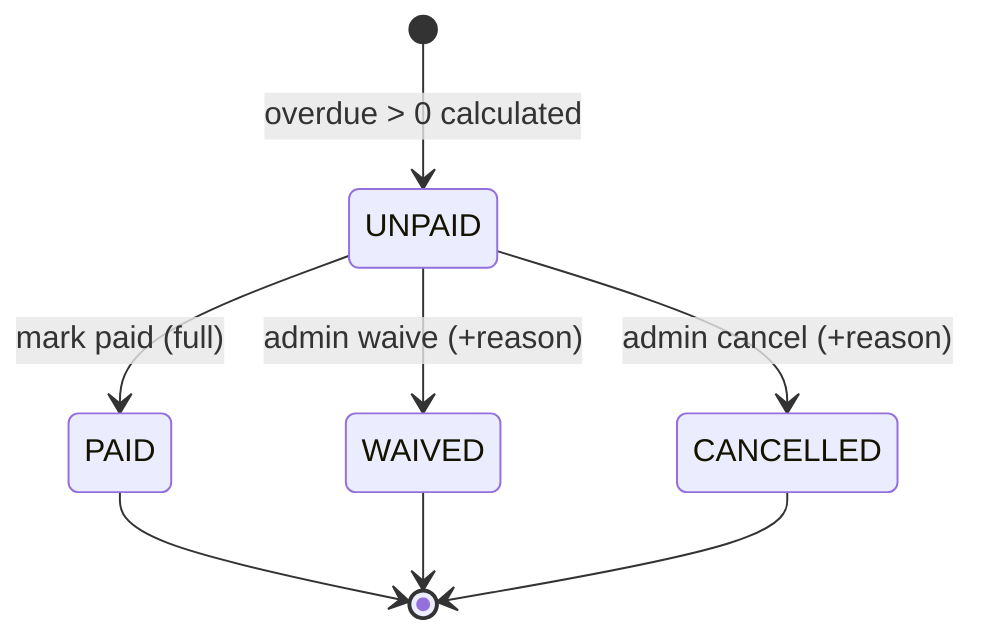

# SPEC.md - FE09 Fine Management

# Version: 0.2.0

# Status: APPROVED

# Owner: Dung

# Last Updated: 2026-06-25

# Feature ID: FE09

# Feature folder: `.sdd/specs/feat-fine-management/`

> Source of truth for FE09 Fine Management. This spec is approved for Phase 2 planning. It is intentionally detailed because fine calculation is a core business rule.

---

## 1. Feature Overview

### 1.1 Feature Name

Fine Management

### 1.2 Business Context

The library needs a traceable way to calculate and collect fines when books are returned late or violate library policy. Fines affect member trust, borrowing eligibility, staff workload, and reports.

Fine Management must calculate fines consistently from borrowing data, record collection status, and avoid charging the same member twice for the same borrowing violation.

### 1.3 Goal / Outcome

The system shall:

- Allow authorized users to view fine information.
- Calculate overdue fines using approved policy.
- Record fine collection.
- Mark fines as paid when collection is complete.
- Keep fine calculation traceable and testable.
- Provide unpaid fine status for borrowing eligibility and reports.

### 1.4 Scope Level

- [x] Full Spec - core business logic, high risk, must be correct from the beginning
- [ ] Standard Spec - normal feature with business rules and validations
- [ ] Light Spec - simple UI, documentation, or low-risk feature

---

## 2. Actors and Permissions

| Actor | Description | Permission / Responsibility |
| ----- | ----------- | --------------------------- |
| Member | Registered library user | View own fine information. |
| Librarian | Library staff | View member fines, calculate/confirm fines, record collection, mark paid if allowed. |
| Admin | System administrator | Has librarian permissions and may manage all fine records. |
| Guest | Unauthenticated visitor | No fine access. |
| Borrowing Feature | Internal feature | Provides due date, return date, and overdue data. |
| Notification Feature | Internal feature | Sends fine/overdue notifications when requested. |

---

## 3. Preconditions

The feature can only start when:

- PRE-FE09-001: The member user exists.
- PRE-FE09-002: The borrowing detail exists before a fine can reference it.
- PRE-FE09-003: Due date exists for the borrowed item.
- PRE-FE09-004: Fine policy values are approved: overdue rate, start date, and blocking rule.
- PRE-FE09-005: Protected fine actions are performed by authenticated actors with correct roles.

---

## 4. Main Flows

### MF-FE09-001: View Fine Information

1. Member opens own fine page, or librarian/admin opens a member's fine information.
2. The system verifies actor permissions.
3. The system retrieves fine records.
4. The system displays amount, reason, status, related borrowing detail, and payment timestamp when available.
5. The system does not expose another member's fine information to ordinary members.

### MF-FE09-002: Calculate Fine

1. FE07 or librarian/admin identifies a borrow detail that may be overdue.
2. The system loads due date, return date or current server date, member, and existing fine records.
3. The system calculates overdue days starting the day after due date.
4. The system multiplies overdue days by the approved daily rate.
5. The system creates or updates a fine record without duplicating the same fine.
6. The system records reason and status `UNPAID` unless the calculated amount is zero.

### MF-FE09-003: Record Fine Collection

1. Librarian/admin opens an unpaid fine.
2. Librarian/admin records collection information according to approved fields.
3. The system validates actor permission and fine state.
4. The system records collection event or payment timestamp if schema supports it.
5. The system keeps the fine traceable.

### MF-FE09-004: Mark Fine As Paid

1. Librarian/admin selects an unpaid fine.
2. The system verifies the fine exists and is payable.
3. The system updates fine status to `PAID`.
4. The system records `PaidAt`.
5. The system writes an audit log entry if approved.

---

## 5. Alternative Flows

### AF-FE09-001: Not Overdue

1. Fine calculation runs for a borrow detail.
2. Return/current date is on or before due date.
3. The system calculates zero overdue days.
4. The system does not create an overdue fine.

### AF-FE09-002: Fine Already Exists

1. Fine calculation runs for a borrow detail that already has an active overdue fine.
2. The system detects existing fine.
3. The system updates it according to approved recalculation policy or returns existing record without duplicate.

### AF-FE09-003: Unauthorized Fine Update

1. Member attempts to mark a fine as paid or record collection.
2. The system checks role permission.
3. The system denies the action.

### AF-FE09-004: Paid Fine Updated Again

1. Librarian/admin attempts to mark an already paid fine as paid again.
2. The system returns current state or rejects duplicate update.
3. `PaidAt` remains traceable and not overwritten unless policy allows correction.

---

## 6. Business Rules

Use these stable IDs for tasks and tests.

- BR-FE09-001: Guests cannot view or manage fines.
- BR-FE09-002: Members can view only their own fine information.
- BR-FE09-003: Librarians/admins can view fine information for any member.
- BR-FE09-004: Only librarians/admins may record fine collection or mark fines as paid.
- BR-FE09-005: Overdue fine is 5,000 VND per overdue day per copy for Phase 1.
- BR-FE09-006: Overdue days start the day after the due date.
- BR-FE09-007: Fine calculation must use server-side date values and stored due/return dates.
- BR-FE09-008: Fine amount must not be accepted directly from member/client input for calculation.
- BR-FE09-009: A borrow detail must not have duplicate active overdue fines for the same reason.
- BR-FE09-010: Fine records must reference the related member and borrow detail.
- BR-FE09-011: Unpaid fines must remain visible until paid, waived, or otherwise resolved by approved policy.
- BR-FE09-012: Marking a fine as paid must set status `PAID` and record `PaidAt`.
- BR-FE09-013: Paid fines must not block borrowing.
- BR-FE09-014: Any `UNPAID` fine with amount greater than 0 blocks new borrowing and renewal according to approved FE07 policy.
- BR-FE09-015: Fine calculation and payment state changes must be traceable.
- BR-FE09-016: Online payment gateway is out of scope; FE09 records offline collection/payment status only.

---

## 7. Functional Requirements

- FR-FE09-001: When a member views fine information, the system shall return only that member's fine records.
- FR-FE09-002: When a librarian/admin views fine information, the system shall allow lookup by member or fine status.
- FR-FE09-003: When calculating overdue fine, the system shall compute overdue days from due date and return/current server date.
- FR-FE09-004: If overdue days are zero or negative, then the system shall not create an overdue fine.
- FR-FE09-005: When overdue days are positive, the system shall calculate amount using 5,000 VND per day per copy.
- FR-FE09-006: If an active fine already exists for the same borrow detail and reason, then the system shall not create a duplicate fine.
- FR-FE09-007: When a librarian/admin records fine collection, the system shall validate the fine and record collection information.
- FR-FE09-008: When a librarian/admin marks a fine as paid, the system shall set status to `PAID` and record paid timestamp.
- FR-FE09-009: If an unauthorized actor attempts fine collection or paid marking, then the system shall deny access.
- FR-FE09-010: When fine status changes, the system shall make the new status available for FE07 and FE12.

---

## 8. Acceptance Criteria

- AC-FE09-001: Given a logged-in member, when the member views fines, then only that member's fines are returned.
- AC-FE09-002: Given a librarian/admin, when viewing a member's fines, then the selected member's fines are returned.
- AC-FE09-003: Given a borrow detail returned after due date, when fine is calculated, then amount equals overdue days times 5,000 VND.
- AC-FE09-004: Given a borrow detail returned on or before due date, when fine is calculated, then no overdue fine is created.
- AC-FE09-005: Given an existing active overdue fine for the same borrow detail, when calculation runs again, then no duplicate fine is created.
- AC-FE09-006: Given an unpaid fine, when a librarian/admin records collection, then collection information is stored according to approved schema.
- AC-FE09-007: Given an unpaid fine, when a librarian/admin marks it paid, then status becomes `PAID` and `PaidAt` is recorded.
- AC-FE09-008: Given a member, when the member attempts to mark a fine paid, then access is denied.
- AC-FE09-009: Given a paid fine, when borrowing eligibility checks unpaid fines, then the paid fine does not block borrowing.
- AC-FE09-010: Given a member has any `UNPAID` fine with amount greater than 0, when FE07 checks borrowing or renewal eligibility, then the member is considered blocked.

---

## 9. Edge Cases and Error Handling

| ID | Edge Case / Error | Expected System Behavior |
| -- | ----------------- | ------------------------ |
| EC-FE09-001 | Member ID does not exist | Return not found. |
| EC-FE09-002 | Borrow detail does not exist | Reject fine calculation. |
| EC-FE09-003 | Borrow detail has no due date | Reject calculation as incomplete borrowing data. |
| EC-FE09-004 | Return date before due date | Calculate zero overdue fine. |
| EC-FE09-005 | Return date missing for active borrowed item | Use current server date if scheduled/current fine view is approved. |
| EC-FE09-006 | Duplicate fine calculation request | Return or update existing fine; do not duplicate active fine. |
| EC-FE09-007 | Fine amount would be negative | Treat as zero and do not create overdue fine. |
| EC-FE09-008 | Unauthorized actor marks paid | Return forbidden response. |
| EC-FE09-009 | Fine already paid | Return current state or reject duplicate paid action. |
| EC-FE09-010 | Database update partially fails | Roll back fine status/payment/audit changes. |

---

## 10. Data Requirements

### 10.1 Entities Involved

| Entity | Purpose in this feature |
| ------ | ----------------------- |
| Users | Identifies member and staff actors. |
| UserRoles | Checks fine management permission. |
| BorrowRequests | Provides member relationship for borrowing records. |
| BorrowDetails | Provides due date, return date, and copy relationship. |
| BookCopies | Provides copy reference/status for fine context. |
| Fines | Stores fine amount, reason, status, and payment timestamp. |
| AuditLogs | Records fine calculation/payment actions if approved. |

### 10.2 Data Fields

| Field | Type | Required | Validation / Notes |
| ----- | ---- | -------- | ------------------ |
| fineId | integer | Yes for updates | Must exist in `Fines`. |
| userId | integer | Yes | Must reference member user. |
| borrowDetailId | integer | Yes | Must reference related borrow detail. |
| amount | decimal | Yes | Calculated by server; non-negative. |
| reason | string | Yes | Example: `OVERDUE`, `LOST`, `DAMAGED`; Phase 1 requires overdue at minimum. |
| status | string | Yes | Proposed values: `UNPAID`, `PAID`, `WAIVED`, `CANCELLED`. |
| paidAt | datetime | Required when paid | Set by server when marked paid. |
| collectedAmount | decimal | Recommended | Add if partial collection is required. |
| collectedBy | integer | Recommended | Staff user ID if collection history is required. |
| collectionNote | string | Optional | Safe staff note if approved. |

### 10.3 State Model & Transition Rules (Fine)

This subsection formalizes the lifecycle of `Fine.status`. The state set is taken directly from the approved values in section 10.2 (`UNPAID`, `PAID`, `WAIVED`, `CANCELLED`). Phase 1 has **no partial payment** (Q-FE09-003), so there is no `PARTIALLY_PAID` state: a single mark-paid action moves an `UNPAID` fine straight to `PAID`. The `amount` field is immutable after creation; `collectedAmount` only records how much was physically collected and never alters `amount`.

#### a) State Diagram

Note: when calculated overdue days are zero or negative, **no fine record is created** (FR-FE09-004, AF-FE09-001, EC-FE09-004/007); the lifecycle starts only when `amount > 0`.

#### b) State Descriptions

| State | Description |
| ----- | ----------- |
| `UNPAID` | A fine has been created with `amount > 0` and is awaiting collection. Blocks new borrowing/renewal in FE07 (BR-FE09-014). This is the only entry state. |
| `PAID` | Full amount has been collected; `PaidAt` is recorded. Terminal state. Does not block borrowing (BR-FE09-013). |
| `WAIVED` | Admin forgave the fine with a required reason and audit log (Q-FE09-005). Terminal state. No collection expected. |
| `CANCELLED` | Fine was cancelled/voided by admin with a required reason and audit log (e.g. created in error). Terminal state. |

#### c) Valid Transitions

| From | To | Trigger | Condition | Related FR/BR/AF/EC |
| ---- | -- | ------- | --------- | ------------------- |
| `[*]` | `UNPAID` | Fine calculated (on return or manual run) | Overdue days > 0 and computed `amount > 0`; no existing active fine for same borrow detail + reason | MF-FE09-002, FR-FE09-005, FR-FE09-006, BR-FE09-005, BR-FE09-006, BR-FE09-009 |
| `UNPAID` | `PAID` | Librarian/admin marks fine paid | Actor is librarian/admin; fine exists and is `UNPAID`; full amount collected; sets `PaidAt` | MF-FE09-004, FR-FE09-008, BR-FE09-004, BR-FE09-012 |
| `UNPAID` | `WAIVED` | Admin waives fine | Actor is admin; required reason provided; audit log written | Q-FE09-005, BR-FE09-011, BR-FE09-015 |
| `UNPAID` | `CANCELLED` | Admin cancels/voids fine | Actor is admin; required reason provided; audit log written | Q-FE09-005, BR-FE09-011, BR-FE09-015 |

#### d) Invalid Transitions (explicitly forbidden)

| Forbidden | Reason | Related |
| --------- | ------ | ------- |
| `PAID` → `UNPAID` | A collected fine must not be reverted to unpaid; terminal state. | BR-FE09-012, AF-FE09-004 |
| `WAIVED` / `CANCELLED` → any state | Terminal states cannot be reactivated. | Q-FE09-005, BR-FE09-011 |
| `PAID` → `PAID` (re-collect) | No collection or paid action on a fine already `PAID`; return current state or reject. `PaidAt` is not overwritten unless an approved correction policy applies. | AF-FE09-004, EC-FE09-009, FR-FE09-008 |
| Any collection on `PAID` / `WAIVED` / `CANCELLED` | No money may be collected against a resolved fine. | BR-FE09-004, NFR-FE09-TXN-002 |
| Change `amount` after creation | `amount` is immutable; recalculation must not mutate the stored amount of an existing active fine (duplicate prevention only). | BR-FE09-008, BR-FE09-009, AF-FE09-002, EC-FE09-006 |
| Direct `[*]` → `PAID` / `WAIVED` / `CANCELLED` | A fine must first exist as `UNPAID`; it cannot be born resolved. | MF-FE09-002 |

#### e) Invariants

- INV-1: A fine always has exactly one `status` from {`UNPAID`, `PAID`, `WAIVED`, `CANCELLED`} at any time.
- INV-2: `amount > 0` for any persisted fine; if computed overdue amount is ≤ 0, no fine is created (FR-FE09-004, EC-FE09-007).
- INV-3: `amount` is immutable after creation; only `status`, `PaidAt`, and collection metadata may change.
- INV-4: `collectedAmount`, when used, must satisfy `0 ≤ collectedAmount ≤ amount` and never exceed `amount`.
- INV-5: `status = PAID` **if and only if** the full amount has been collected and `PaidAt` is set (no partial-paid state in Phase 1, per Q-FE09-003).
- INV-6: A fine in `PAID`, `WAIVED`, or `CANCELLED` is terminal and accepts no further state change or collection.
- INV-7: Only `UNPAID` fines with `amount > 0` block borrowing/renewal in FE07 (BR-FE09-013, BR-FE09-014).
- INV-8: Every state transition (calculate, collect, mark paid, waive, cancel) is traceable via audit log; idempotent retries must not produce duplicate active fines or double-collect (BR-FE09-009, BR-FE09-015, NFR-FE09-TXN-001, NFR-FE09-TXN-002, EC-FE09-006).

---

## 11. API / Interface Contract

> Endpoint names are proposed for RESTful API. Final contract may stay in this SPEC.md unless the team reintroduces a dedicated shared API contract document.

| Method | Endpoint | Actor | Request | Response | Notes |
| ------ | -------- | ----- | ------- | -------- | ----- |
| GET | `/api/fines/me` | Member | Query: `status?, page?, limit?` | Own fines | Member can see own fines only. |
| GET | `/api/fines` | Librarian/Admin | Query: `userId?, status?, page?, limit?` | Fine list | Protected endpoint. |
| GET | `/api/fines/{fineId}` | Owner or Librarian/Admin | - | Fine detail | Owner can view own fine only. |
| POST | `/api/fines/calculate` | Librarian/Admin/System | `{ borrowDetailId }` | Fine result | Calculates from stored borrowing data. |
| POST | `/api/fines/{fineId}/collections` | Librarian/Admin | `{ collectedAmount?, note? }` | Collection record/status | Optional if schema supports collection records. |
| PATCH | `/api/fines/{fineId}/paid` | Librarian/Admin | `{ note? }` | Paid fine | Sets status `PAID`, `PaidAt`. |

### 11.1 Prototype Alignment Note

The current FE09 React prototype may keep fine records in browser storage for classroom/demo workflows. This is acceptable only as a temporary prototype behavior. The production-aligned implementation must move fine calculation, duplicate prevention, collection recording, and paid marking to the server-side FE09 API so BR-FE09-007, BR-FE09-008, NFR-FE09-SEC-003, and NFR-FE09-TXN-001 remain enforceable.

---

## 12. Non-functional Requirements

### 12.1 Security

- NFR-FE09-SEC-001: Fine endpoints must require authentication except internal scheduled calculation if approved.
- NFR-FE09-SEC-002: Members must not view another member's fine records.
- NFR-FE09-SEC-003: Collection and paid marking must enforce librarian/admin permission on the server.
- NFR-FE09-SEC-004: Fine amount calculation must not trust client-provided amount.
- NFR-FE09-SEC-005: Inputs such as IDs, status, notes, and date-related parameters must be validated.

### 12.2 Transaction Integrity

- NFR-FE09-TXN-001: Fine calculation/create/update must be atomic and avoid duplicate active fines.
- NFR-FE09-TXN-002: Mark paid must update status, paid timestamp, and audit/collection records atomically if used.

### 12.3 Performance

- NFR-FE09-PERF-001: Fine lists should support pagination and filtering by member/status.
- NFR-FE09-PERF-002: Borrow detail lookup for fine calculation should use primary/foreign keys.

### 12.4 Logging and Audit

- NFR-FE09-LOG-001: Fine calculation, collection, paid marking, waiver/cancellation if added, and failed payment actions should be traceable.
- NFR-FE09-LOG-002: Logs must not expose sensitive personal data beyond what is required for audit.

### 12.5 Usability

- NFR-FE09-UX-001: Fine display must show amount, reason, status, and related borrowing context clearly.
- NFR-FE09-UX-002: Payment/collection errors must explain whether the fine is already paid, missing, or unauthorized.

---

## 13. Out of Scope

This feature does not include:

- Borrow approval, return processing, or due date assignment.
- Physical copy condition/status management.
- Online payment gateway or payment provider integration.
- Notification delivery.
- Reporting dashboard implementation.
- Membership approval.

---

## 14. Dependencies

| Dependency | Type | Notes |
| ---------- | ---- | ----- |
| FE07 Borrowing Management | Internal | Provides borrow detail due/return data and may call fine calculation. Checked on 2026-06-10: FE07 treats any `UNPAID` fine with amount greater than 0 as blocking new borrowing and renewal. |
| FE06 Inventory / Book Copy Management | Internal | Provides copy condition/status for lost/damaged cases. |
| FE10 Notification Management | Internal | Sends fine/overdue notifications. |
| FE11 User & Role Management | Internal | Provides staff permissions. |
| FE12 Reporting & Statistics | Internal | Reads fine data for reports. |
| SQL Server database | Technical | Current SQL script has `Fines`. |

---

## 15. Resolved Questions

| ID | Approved Decision | Source | Status |
| -- | ----------------- | ------ | ------ |
| Q-FE09-001 | Phase 1 supports overdue fines only; lost/damaged fines are out of scope. | Review packet 2026-06-10 | APPROVED |
| Q-FE09-002 | Any UNPAID fine with amount greater than 0 blocks new borrowing and renewal. | Review packet 2026-06-10 | APPROVED |
| Q-FE09-003 | No partial payments in Phase 1. | Review packet 2026-06-10 | APPROVED |
| Q-FE09-004 | Store collector ID and note with the fine payment record/table if payment tracking exists; otherwise store on fine record for Phase 1. | Review packet 2026-06-10 | APPROVED |
| Q-FE09-005 | Admin can waive/cancel fines with required reason and audit log. | Review packet 2026-06-10 | APPROVED |
| Q-FE09-006 | Fine calculation runs on return and may also run manually by librarian/admin; scheduled daily job is future work. | Review packet 2026-06-10 | APPROVED |
| Q-FE09-007 | Prototype UI may store fine records locally for demo continuity, but final FE09 behavior must use server-side calculation and persistence. | User correction 2026-06-21 | APPROVED |

---

## 16. Traceability Matrix

| Requirement ID | Related Use Case | Related Test Case | Status |
| -------------- | ---------------- | ----------------- | ------ |
| BR-FE09-002 | UC41 | FT42 | Not Started |
| FR-FE09-001 | UC41 | FT42 | Not Started |
| BR-FE09-005 | UC42 | FT43 | Not Started |
| BR-FE09-006 | UC42 | FT43 | Not Started |
| FR-FE09-003 | UC42 | FT43 | Not Started |
| FR-FE09-005 | UC42 | FT43 | Not Started |
| BR-FE09-009 | UC42 | FT43 | Not Started |
| FR-FE09-007 | UC43 | FT44 | Not Started |
| BR-FE09-012 | UC44 | FT45 | Not Started |
| FR-FE09-008 | UC44 | FT45 | Not Started |
| BR-FE09-014 | UC42 | FT43 | Not Started |

---

## 17. Review Checklist

Phase 1 approval checklist (completed on 2026-06-10):

- [x] Overdue fine policy is confirmed as 5,000 VND/day/copy or updated in shared context.
- [x] Borrowing-block rule for unpaid fines is approved with FE07.
- [x] Lost/damaged fine policy is approved or marked out of scope.
- [x] Collection/paid schema is confirmed.
- [x] Duplicate fine prevention rule is approved.
- [x] API contract is approved in SPEC.md or copied to a dedicated shared API contract file if the team reintroduces one.
- [x] Every acceptance criterion can become a test.
