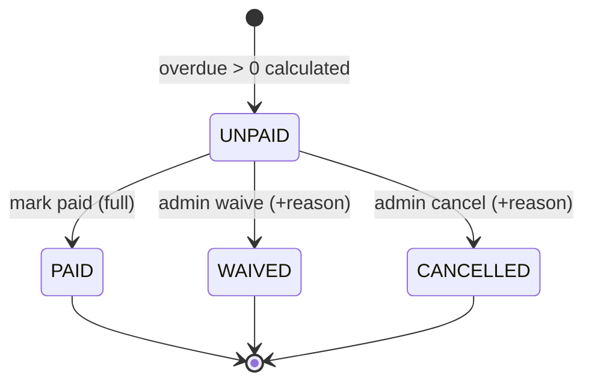

# SPEC.md - FE09 Fine Management

# Version: 0.4.2

# Status: APPROVED BASELINE 2026-07-17 - PHASE 2 EXIT COMPLETE

# Owner: Dung

# Last Updated: 2026-07-21

# Feature ID: FE09

# Feature folder: `.sdd/specs/feat-fine-management/`

> Current delivery status (2026-07-20): `COMPLETE` for the approved Phase 1 scope.
> `TASKS.md` and `.sdd/reviews/phase2-full-exit-validation-2026-07-19.md`
> are authoritative for current implementation state. Older `Not Started`,
> `PARTIAL`, `READY FOR REVIEW`, or pending-review labels retained below are
> historical planning/evidence snapshots, not the current delivery state.

> Source of truth for FE09 Fine Management. Baseline v0.4.0 is approved after payment, resolution, pagination, timezone, and server-prototype boundaries were made deterministic.

---

## 1. Feature Overview

### 1.1 Feature Name

Fine Management

### 1.2 Business Context

The library needs a traceable way to calculate and collect fines when books are returned late or violate library policy. Fines affect member trust, borrowing eligibility, staff workload, and reports.

Fine Management must calculate fines consistently from borrowing data, record collection status, and avoid charging the same member twice for the same borrowing violation.

### 1.3 Goal / Outcome

The system shall:

- Allow authorized users to view fine information.
- Calculate overdue fines using approved policy.
- Record fine collection.
- Mark fines as paid when collection is complete.
- Let librarian/admin manage the fine list UI with search/filter/detail and ascending fine ID ordering for traceable review.
- Keep fine calculation traceable and testable.
- Provide unpaid fine status for borrowing eligibility and reports.

### 1.4 Scope Level

- [x] Full Spec - core business logic, high risk, must be correct from the beginning
- [ ] Standard Spec - normal feature with business rules and validations
- [ ] Light Spec - simple UI, documentation, or low-risk feature

---

## 2. Actors and Permissions

| Actor | Description | Permission / Responsibility |
| ----- | ----------- | --------------------------- |
| Member | Registered library user | View own fine information. |
| Librarian | Library staff | View member fines, calculate/confirm fines, record collection, mark paid if allowed. |
| Admin | System administrator | Has librarian permissions and may manage all fine records. |
| Guest | Unauthenticated visitor | No fine access. |
| Borrowing Feature | Internal feature | Provides due date, return date, and overdue data. |
| Notification Feature | Internal feature | Sends fine/overdue notifications when requested. |

---

## 3. Preconditions

The feature can only start when:

- PRE-FE09-001: The member user exists.
- PRE-FE09-002: The borrowing detail exists before a fine can reference it.
- PRE-FE09-003: Due date exists for the borrowed item.
- PRE-FE09-004: Fine policy values are approved: overdue rate, start date, and blocking rule.
- PRE-FE09-005: Protected fine actions are performed by authenticated actors with correct roles.

---

## 4. Main Flows

### MF-FE09-001: View Fine Information

1. Member opens own fine page, or librarian/admin opens a member's fine information.
2. The system verifies actor permissions.
3. The system retrieves fine records.
4. The system displays amount, reason, status, and related borrowing detail; it displays payment timestamp and collection metadata when the record is `PAID`.
5. The system does not expose another member's fine information to ordinary members.

### MF-FE09-002: Calculate Fine

1. FE07 or librarian/admin identifies a borrow detail that may be overdue.
2. The system loads due date, return date or current server date, member, and existing fine records.
3. The system calculates overdue days starting the day after due date.
4. The system multiplies overdue days by the approved daily rate.
5. If the calculated amount is greater than zero, the system creates an `UNPAID` fine when none exists. If an existing fine for the same borrow detail and reason is still `UNPAID`, the system updates its server-calculated `overdueDays`, `amount`, and `calculatedAt` instead of creating a duplicate. Terminal fines are returned unchanged.
6. If the calculated amount is zero, the system creates no fine record.

### MF-FE09-003: Record Fine Collection

1. Librarian/admin opens an unpaid fine.
2. Librarian/admin records one full offline collection using a required payment method and optional note; partial amounts are not accepted in Phase 1.
3. The system validates actor permission and fine state.
4. In one transaction, the system sets `PaidAmount = Amount`, `CollectedBy`, `PaymentMethod`, `PaidAt`, and `Status = PAID`.
5. The system writes collection and audit metadata without exposing sensitive data.
6. The system keeps the fine traceable.

### MF-FE09-004: Mark Fine As Paid

1. Librarian/admin selects an unpaid fine.
2. The system verifies the fine exists and is payable.
3. In one transaction, the system sets `PaidAmount = Amount`, `CollectedBy`, `PaymentMethod`, `PaidAt`, and `Status = PAID`.
4. The system writes the paid-state audit log entry in the same transaction.

### MF-FE09-005: Manage Fine List In Librarian UI

1. Librarian opens Fine Management.
2. The system lists fines with member, book, overdue days, amount, status, and related borrow detail.
3. The list is always sorted by fine ID ascending for Phase 1 reconciliation.
4. Librarian can search/filter and view detail without modifying the record.
5. Paid/resolved fines remain visible for traceability.

### MF-FE09-006: Resolve Fine Without Collection

1. Admin selects an `UNPAID` fine that must be waived or cancelled.
2. Admin supplies a trimmed reason of 1..500 characters.
3. The system changes the fine to `WAIVED` or `CANCELLED` atomically with the audit record.
4. The resolved fine remains visible and no longer blocks FE07 borrowing eligibility.

---

## 5. Alternative Flows

### AF-FE09-001: Not Overdue

1. Fine calculation runs for a borrow detail.
2. Return/current date is on or before due date.
3. The system calculates zero overdue days.
4. The system does not create an overdue fine.

### AF-FE09-002: Fine Already Exists

1. Fine calculation runs for a borrow detail that already has an active overdue fine.
2. The system detects existing fine.
3. If the existing fine is `UNPAID`, the system recalculates and updates its server-derived amount, overdue days, and calculation timestamp under the same fine lock; if it is terminal, the system returns it unchanged.

### AF-FE09-003: Unauthorized Fine Update

1. Member attempts to mark a fine as paid or record collection.
2. The system checks role permission.
3. The system denies the action.

### AF-FE09-004: Paid Fine Updated Again

1. Librarian/admin attempts to mark an already paid fine as paid again.
2. The system rejects the request with `409 FINE_NOT_PAYABLE`.
3. `PaidAt` and all payment metadata remain unchanged.

### AF-FE09-005: Resolve Fine Without Collection

1. Admin attempts to waive or cancel an `UNPAID` fine without a valid reason.
2. The system trims the reason; an empty result returns `REASON_REQUIRED`, and a result longer than 500 characters returns `REASON_TOO_LONG`.
3. The fine and audit state remain unchanged.

---

## 6. Business Rules

Use these stable IDs for tasks and tests.

- BR-FE09-001: Guests cannot view or manage fines.
- BR-FE09-002: Members can view only their own fine information.
- BR-FE09-003: Librarians/admins can view fine information for any member.
- BR-FE09-004: Only librarians/admins may record fine collection or mark fines as paid.
- BR-FE09-005: Overdue fine is 5,000 VND per overdue day per copy for Phase 1.
- BR-FE09-006: Overdue days start the day after the due date.
- BR-FE09-007: Fine calculation must use server-side date values and stored due/return dates.
- BR-FE09-008: Fine amount must not be accepted directly from member/client input for calculation.
- BR-FE09-009: A borrow detail must not have duplicate active overdue fines for the same reason; an existing `UNPAID` fine is recalculated in place, while terminal fine records are never reopened.
- BR-FE09-010: Fine records must reference the related member and borrow detail.
- BR-FE09-011: Unpaid fines must remain visible until they transition to `PAID`, `WAIVED`, or `CANCELLED`.
- BR-FE09-012: Marking a fine as paid must set status `PAID` and record `PaidAt`.
- BR-FE09-013: Paid fines must not block borrowing.
- BR-FE09-014: Any `UNPAID` fine with amount greater than 0 blocks new borrowing and renewal according to approved FE07 policy.
- BR-FE09-015: Fine calculation and payment state changes must be traceable.
- BR-FE09-016: Online payment gateway is out of scope; FE09 records offline collection/payment status only.
- BR-FE09-017: Phase 1 does not require an admin confirm/refuse payment step after librarian collection; a full offline collection by librarian/admin may directly resolve the fine as `PAID`.
- BR-FE09-018: Fine lists must use stable ordering by fine ID ascending by default to support reconciliation and classroom review.
- BR-FE09-019: Overdue-day calculation uses the current server business date in `Asia/Ho_Chi_Minh`.

---

## 7. Functional Requirements

- FR-FE09-001: When a member views fine information, the system shall return only that member's fine records.
- FR-FE09-002: When a librarian/admin views fine information, the system shall allow lookup by member or fine status.
- FR-FE09-003: When calculating overdue fine, the system shall compute overdue days from due date and return/current server date.
- FR-FE09-004: If overdue days are zero or negative, then the system shall not create an overdue fine.
- FR-FE09-005: When overdue days are positive, the system shall calculate amount using 5,000 VND per day per copy.
- FR-FE09-006: If an `UNPAID` fine already exists for the same borrow detail and reason, then the system shall recalculate its server-derived amount, overdue days, and calculation timestamp in place without creating a duplicate; terminal fines remain unchanged.
- FR-FE09-007: When a librarian/admin records fine collection, the system shall validate the fine and record collection information.
- FR-FE09-008: When a librarian/admin marks a fine as paid, the system shall set status to `PAID` and record paid timestamp.
- FR-FE09-009: If an unauthorized actor attempts fine collection or paid marking, then the system shall deny access.
- FR-FE09-010: When fine status changes, the system shall make the new status available for FE07 and FE12.
- FR-FE09-011: When displaying the librarian fine list, the system shall support search/filter and default to fine ID ascending order.
- FR-FE09-012: When a librarian/admin records full offline collection for an unpaid fine, the system shall mark the fine `PAID`, set payment metadata supported by the schema, and expose the updated state to borrowing eligibility and reports.
- FR-FE09-013: IF a client submits collection for a resolved fine, the system shall return `409 FINE_NOT_COLLECTIBLE` without collecting again or changing terminal metadata.
- FR-FE09-014: When an admin waives an unpaid fine with a valid reason, the system shall set status `WAIVED` and write the audit record atomically.
- FR-FE09-015: When an admin cancels an unpaid fine with a valid reason, the system shall set status `CANCELLED` and write the audit record atomically.
- FR-FE09-016: IF a supplied fine-list page, limit, status, or user ID is invalid, the system shall reject the request without normalizing the value or querying fines.
- FR-FE09-017: When calculating a fine, the system shall derive overdue days from the `Asia/Ho_Chi_Minh` business date and stored due/return dates.
- FR-FE09-018: The Librarian/Admin fine workspace shall preserve the selected fine across list, calculation, collection, and paid-reconciliation steps. A newly calculated overdue fine shall become the selected `UNPAID` fine for collection, and payment steps shall reject entry unless an `UNPAID` fine is selected, including when that selected fine is outside the currently rendered server page.

---

## 8. Acceptance Criteria

- AC-FE09-001: Given a logged-in member, when the member views fines, then only that member's fines are returned.
- AC-FE09-002: Given a librarian/admin, when viewing a member's fines, then the selected member's fines are returned.
- AC-FE09-003: Given a borrow detail returned after due date, when fine is calculated, then amount equals overdue days times 5,000 VND.
- AC-FE09-004: Given a borrow detail returned on or before due date, when fine is calculated, then no overdue fine is created.
- AC-FE09-005: Given an existing `UNPAID` overdue fine for the same borrow detail, when calculation runs again, then the existing fine is recalculated in place without creating a duplicate; terminal fines are unchanged.
- AC-FE09-006: Given an unpaid fine, when a librarian/admin records collection, then collection information is stored according to approved schema.
- AC-FE09-007: Given an unpaid fine, when a librarian/admin marks it paid, then status becomes `PAID` and `PaidAt` is recorded.
- AC-FE09-008: Given a member, when the member attempts to mark a fine paid, then access is denied.
- AC-FE09-009: Given a paid fine, when borrowing eligibility checks unpaid fines, then the paid fine does not block borrowing.
- AC-FE09-010: Given a member has any `UNPAID` fine with amount greater than 0, when FE07 checks borrowing or renewal eligibility, then the member is considered blocked.
- AC-FE09-011: Given fines exist, when a librarian opens the fine list, then records are shown in fine ID ascending order by default and can be searched/filtered.
- AC-FE09-012: Given an unpaid fine and full offline collection, when librarian/admin records the collection, then the fine becomes `PAID` and no longer blocks FE07 borrowing eligibility.
- AC-FE09-013: Given an unpaid fine and a valid admin reason, when the admin waives the fine, then status becomes `WAIVED`, the fine remains visible, and an audit record is written atomically.
- AC-FE09-014: Given an unpaid fine and a valid admin reason, when the admin cancels the fine, then status becomes `CANCELLED`, the fine remains visible, and an audit record is written atomically.
- AC-FE09-015: Given a fine calculation at a timezone boundary, when the server business date is evaluated, then overdue days use `Asia/Ho_Chi_Minh` consistently.
- AC-FE09-016: Given a Librarian/Admin calculates or selects an unpaid fine, when moving to collection or paid reconciliation, then the same fine ID, member, borrowing context, and amount remain selected; after success, the returned canonical `PAID` fine is shown and FE07/FE12 consume the resolved state.

---

## 9. Edge Cases and Error Handling

| ID | Edge Case / Error | Expected System Behavior |
| -- | ----------------- | ------------------------ |
| EC-FE09-001 | Member ID does not exist | Return not found. |
| EC-FE09-002 | Borrow detail does not exist | Reject fine calculation. |
| EC-FE09-003 | Borrow detail has no due date | Reject calculation as incomplete borrowing data. |
| EC-FE09-004 | Return date before due date | Calculate zero overdue fine. |
| EC-FE09-005 | Return date missing for active borrowed item | Use current `Asia/Ho_Chi_Minh` server business date. |
| EC-FE09-006 | Duplicate fine calculation request | Recalculate an existing `UNPAID` fine in place under a database lock; do not create a duplicate. Return terminal fines unchanged. |
| EC-FE09-007 | Fine amount would be negative | Treat as zero and do not create overdue fine. |
| EC-FE09-008 | Unauthorized actor marks paid | Return forbidden response. |
| EC-FE09-009 | Fine already paid | `PATCH /paid` returns `409 FINE_NOT_PAYABLE`; `POST /collections` returns `409 FINE_NOT_COLLECTIBLE`; payment metadata remains unchanged. |
| EC-FE09-010 | Database update partially fails | Roll back fine status/payment/audit changes. |
| EC-FE09-011 | Collection attempted on resolved fine | Return `409 FINE_NOT_COLLECTIBLE`; do not double-collect or change terminal metadata. |
| EC-FE09-012 | Waive/cancel reason missing or over 500 characters | Return validation error and preserve fine/audit state. |
| EC-FE09-013 | Fine-list query contains invalid page/limit/status/user ID | Return validation error before repository query. |
| EC-FE09-014 | Business date crosses UTC/local-day boundary | Use `Asia/Ho_Chi_Minh` date only. |

---

## 10. Data Requirements

### 10.1 Entities Involved

| Entity | Purpose in this feature |
| ------ | ----------------------- |
| Users | Identifies member and staff actors. |
| UserRoles | Checks fine management permission. |
| BorrowRequests | Provides member relationship for borrowing records. |
| BorrowDetails | Provides due date, return date, and copy relationship. |
| BookCopies | Provides copy reference/status for fine context. |
| Fines | Stores fine amount, reason, status, and payment timestamp. |
| AuditLogs | Records fine calculation, collection, paid, waive, and cancel actions. |

### 10.2 Data Fields

| Field | Type | Required | Validation / Notes |
| ----- | ---- | -------- | ------------------ |
| fineId | integer | Yes for updates | Must exist in `Fines`. |
| userId | integer | Yes | Must reference member user. |
| borrowDetailId | integer | Yes | Must reference related borrow detail. |
| overdueDays | integer | Yes | Server-calculated non-negative number of overdue business days. |
| ratePerDay | decimal | Yes | Server-controlled Phase 1 rate: 5,000 VND. |
| amount | decimal | Yes | Server-calculated; strictly greater than 0 for persisted fine rows. |
| reason | string | Yes | Phase 1 value is `OVERDUE`; lost/damaged fines are out of scope. |
| status | string | Yes | Values: `UNPAID`, `PAID`, `WAIVED`, `CANCELLED`. |
| paidAmount | decimal | Yes | Schema field `PaidAmount`; `0` while `UNPAID`, `WAIVED`, or `CANCELLED`, and exactly `Amount` when `PAID`. Partial payment is not accepted. |
| paidAt | datetime | Required when paid | Set by server when marked paid; null for `UNPAID`, `WAIVED`, and `CANCELLED`. |
| calculatedAt | datetime | Yes | Server calculation timestamp. |
| createdBy | integer | Required on calculation | Staff actor who triggered manual calculation. |
| collectedBy | integer | Required when paid | Staff actor who recorded full offline collection or reconciliation. |
| paymentMethod | string | Required when paid | Schema field `PaymentMethod`; trimmed and validated at 1..50 characters. Null for `UNPAID`, `WAIVED`, and `CANCELLED`. |
| collectionNote | string | Not persisted | Optional note is stored only in audit metadata, not in `Fines`. |

### 10.3 State Model & Transition Rules (Fine)

This subsection formalizes the lifecycle of `Fine.status`. The state set is `UNPAID`, `PAID`, `WAIVED`, and `CANCELLED`. Phase 1 has no partial payment, so a full offline collection sets `PaidAmount = Amount` and moves an `UNPAID` fine directly to `PAID`. `amount` and `overdueDays` may be recalculated while a fine is `UNPAID`, but are immutable after a terminal transition.

#### a) State Diagram

Note: when calculated overdue days are zero or negative, **no fine record is created** (FR-FE09-004, AF-FE09-001, EC-FE09-004/007); the lifecycle starts only when `amount > 0`.

#### b) State Descriptions

| State | Description |
| ----- | ----------- |
| `UNPAID` | A fine has been created with `amount > 0` and is awaiting collection. Blocks new borrowing/renewal in FE07 (BR-FE09-014). This is the only entry state. |
| `PAID` | Full amount has been collected; `PaidAt` is recorded. Terminal state. Does not block borrowing (BR-FE09-013). |
| `WAIVED` | Admin forgave the fine with a required reason and audit log (Q-FE09-005). Terminal state. No collection expected. |
| `CANCELLED` | Fine was cancelled/voided by admin with a required reason and audit log (e.g. created in error). Terminal state. |

#### c) Valid Transitions

| From | To | Trigger | Condition | Related FR/BR/AF/EC |
| ---- | -- | ------- | --------- | ------------------- |
| `[*]` | `UNPAID` | Fine calculated (on return or manual run) | Overdue days > 0 and computed `amount > 0`; no existing active fine for same borrow detail + reason | MF-FE09-002, FR-FE09-005, FR-FE09-006, BR-FE09-005, BR-FE09-006, BR-FE09-009 |
| `UNPAID` | `PAID` | Librarian/admin marks fine paid | Actor is librarian/admin; fine exists and is `UNPAID`; full amount collected; sets `PaidAt` | MF-FE09-004, FR-FE09-008, BR-FE09-004, BR-FE09-012 |
| `UNPAID` | `WAIVED` | Admin waives fine | Actor is admin; required reason provided; audit log written | Q-FE09-005, BR-FE09-011, BR-FE09-015 |
| `UNPAID` | `CANCELLED` | Admin cancels/voids fine | Actor is admin; required reason provided; audit log written | Q-FE09-005, BR-FE09-011, BR-FE09-015 |

#### d) Invalid Transitions (explicitly forbidden)

| Forbidden | Reason | Related |
| --------- | ------ | ------- |
| `PAID` → `UNPAID` | A collected fine must not be reverted to unpaid; terminal state. | BR-FE09-012, AF-FE09-004 |
| `WAIVED` / `CANCELLED` → any state | Terminal states cannot be reactivated. | Q-FE09-005, BR-FE09-011 |
| `PAID` → `PAID` (re-collect) | No collection or paid action on a fine already `PAID`; collection returns `409 FINE_NOT_COLLECTIBLE` and paid reconciliation returns `409 FINE_NOT_PAYABLE`. `PaidAt` and payment metadata are not overwritten. | AF-FE09-004, EC-FE09-009, FR-FE09-008 |
| Any collection on `PAID` / `WAIVED` / `CANCELLED` | No money may be collected against a resolved fine. | BR-FE09-004, NFR-FE09-TXN-002 |
| Change `amount` after creation | An existing `UNPAID` fine may be recalculated from stored dates; `PAID`, `WAIVED`, and `CANCELLED` fines cannot be reopened or changed. | BR-FE09-008, BR-FE09-009, AF-FE09-002, EC-FE09-006 |
| Direct `[*]` → `PAID` / `WAIVED` / `CANCELLED` | A fine must first exist as `UNPAID`; it cannot be born resolved. | MF-FE09-002 |

#### e) Invariants

- INV-1: A fine always has exactly one `status` from {`UNPAID`, `PAID`, `WAIVED`, `CANCELLED`} at any time.
- INV-2: `amount > 0` for any persisted fine; if computed overdue amount is ≤ 0, no fine is created (FR-FE09-004, EC-FE09-007).
- INV-3: `amount`, `overdueDays`, and `calculatedAt` may change only while `status = UNPAID`; all three are immutable after a terminal transition.
- INV-4: `PaidAmount = 0`, `PaidAt = null`, `CollectedBy = null`, and `PaymentMethod = null` while `status` is `UNPAID`, `WAIVED`, or `CANCELLED`; `PAID` requires `PaidAmount = Amount`, `PaidAt`, `CollectedBy`, and `PaymentMethod`.
- INV-5: `status = PAID` **if and only if** `PaidAmount = Amount` and `PaidAt` is set (no partial-paid state in Phase 1, per Q-FE09-003).
- INV-6: A fine in `PAID`, `WAIVED`, or `CANCELLED` is terminal and accepts no further state change or collection.
- INV-7: Only `UNPAID` fines with `amount > 0` block borrowing/renewal in FE07 (BR-FE09-013, BR-FE09-014).
- INV-8: Every state transition (calculate, collect, mark paid, waive, cancel) is traceable via audit log; idempotent retries must not produce duplicate active fines or double-collect (BR-FE09-009, BR-FE09-015, NFR-FE09-TXN-001, NFR-FE09-TXN-002, EC-FE09-006).

---

## 11. API / Interface Contract

> The endpoints and request/response shapes below are the canonical Phase 1 contract for this feature.

| Method | Endpoint | Actor | Request | Response | Notes |
| ------ | -------- | ----- | ------- | -------- | ----- |
| GET | `/api/fines/me` | Member | Query: `status?, page?, limit?` | Own fines | Defaults `page = 1`, `limit = 20`; member sees own fines only. |
| GET | `/api/fines` | Librarian/Admin | Query: `q?, userId?, status?, page?, limit?` | Fine list | Defaults `page = 1`, `limit = 20`; fixed order is `FineId ASC`. |
| GET | `/api/fines/{fineId}` | Owner or Librarian/Admin | - | Fine detail | Owner can view own fine only. |
| POST | `/api/fines/calculate` | Librarian/Admin | `{ borrowDetailId }` | Fine result | Manual Phase 1 calculation from stored borrowing data; no scheduler actor. |
| POST | `/api/fines/{fineId}/collections` | Librarian/Admin | `{ paymentMethod: string, note?: string }` | Paid fine | Records one full offline collection and sets `PaidAmount = Amount`, `CollectedBy`, `PaidAt`, `PaymentMethod`, `Status = PAID` atomically. |
| PATCH | `/api/fines/{fineId}/paid` | Librarian/Admin | `{ paymentMethod: string, note?: string }` | Paid fine | Explicit full-payment reconciliation; same atomic metadata and terminal-state rules as collection. |
| PATCH | `/api/fines/{fineId}/waive` | Admin | `{ reason }` | Waived fine | Reason trimmed 1..500; atomic state/audit update. |
| PATCH | `/api/fines/{fineId}/cancel` | Admin | `{ reason }` | Cancelled fine | Reason trimmed 1..500; atomic state/audit update. |

### 11.1 Deterministic Error Contract

- A collection request against `PAID`, `WAIVED`, or `CANCELLED` returns `409 FINE_NOT_COLLECTIBLE`.
- A paid-reconciliation request against `PAID`, `WAIVED`, or `CANCELLED` returns `409 FINE_NOT_PAYABLE`.
- A waive/cancel request against `PAID`, `WAIVED`, or `CANCELLED` returns `409 FINE_NOT_RESOLVABLE`.
- A missing or whitespace-only admin reason returns `400 REASON_REQUIRED`; a trimmed reason longer than 500 characters returns `400 REASON_TOO_LONG`.

### 11.2 Prototype Alignment Note

The current FE09 React prototype may keep fine records in browser storage for classroom/demo workflows. This is not production completion evidence. The production-aligned implementation must use the server-side FE09 API for calculation, list/detail, collection, paid, waive, and cancel behavior.

---

## 12. Non-functional Requirements

### 12.1 Security

- NFR-FE09-SEC-001: Fine endpoints must require authentication; Phase 1 exposes manual calculation only to Librarian/Admin.
- NFR-FE09-SEC-002: Members must not view another member's fine records.
- NFR-FE09-SEC-003: Collection and paid marking must enforce librarian/admin permission on the server.
- NFR-FE09-SEC-004: Fine amount calculation must not trust client-provided amount.
- NFR-FE09-SEC-005: Fine IDs, status, payment method, collection notes, and date-related parameters must be validated server-side.

### 12.2 Transaction Integrity

- NFR-FE09-TXN-001: Fine calculation/create and recalculation of an existing `UNPAID` fine must be atomic under a database lock; terminal fine records must not be modified.
- NFR-FE09-TXN-002: Collection, paid, waive, and cancel must update fine state, payment/reason metadata, and audit records atomically.

### 12.3 Performance

- NFR-FE09-PERF-001: Fine lists use `page = 1`, `limit = 20` by default; supplied `page` is an integer >= 1 and `limit` is an integer 1..100.
- NFR-FE09-PERF-002: Borrow-detail lookup for fine calculation must use the `BorrowDetails` primary key or its approved foreign-key path; unbounded scans are not permitted.

### 12.4 Logging and Audit

- NFR-FE09-LOG-001: Fine calculation, collection, paid marking, waiver, cancellation, and failed state changes must be traceable.
- NFR-FE09-LOG-002: Logs must not expose sensitive personal data beyond what is required for audit.

### 12.5 Usability

- NFR-FE09-UX-001: Fine display must show amount, reason, status, and related borrowing context clearly.
- NFR-FE09-UX-002: Payment/collection errors must explain whether the fine is already paid, missing, or unauthorized.
- NFR-FE09-TIME-001: Overdue-day calculation uses the `Asia/Ho_Chi_Minh` business date for both returned and active borrowed details.

---

## 13. Out of Scope

This feature does not include:

- Borrow approval, return processing, or due date assignment.
- Physical copy condition/status management.
- Online payment gateway or payment provider integration.
- Notification delivery.
- Reporting dashboard implementation.
- Membership approval.

---

## 14. Dependencies

| Dependency | Type | Notes |
| ---------- | ---- | ----- |
| FE07 Borrowing Management | Internal | Provides borrow detail due/return data and may call fine calculation. Checked on 2026-06-10: FE07 treats any `UNPAID` fine with amount greater than 0 as blocking new borrowing and renewal. |
| FE06 Inventory / Book Copy Management | Internal | Provides copy condition/status for lost/damaged cases. |
| FE10 Notification Management | Internal | Sends fine/overdue notifications. |
| FE11 User & Role Management | Internal | Provides staff permissions. |
| FE12 Reporting & Statistics | Internal | Reads fine data for reports. |
| SQL Server database | Technical | Current SQL script has `Fines`. |

---

## 15. Resolved Questions

| ID | Approved Decision | Source | Status |
| -- | ----------------- | ------ | ------ |
| Q-FE09-001 | Phase 1 supports overdue fines only; lost/damaged fines are out of scope. | Review packet 2026-06-10 | APPROVED |
| Q-FE09-002 | Any UNPAID fine with amount greater than 0 blocks new borrowing and renewal. | Review packet 2026-06-10 | APPROVED |
| Q-FE09-003 | No partial payments in Phase 1. | Review packet 2026-06-10 | APPROVED |
| Q-FE09-004 | Phase 1 stores `CollectedBy`, `PaymentMethod`, and `PaidAt` on `Fines`; no separate payment table is required. The optional collection note is stored only in safe audit metadata and is not a `Fines` column. | Review packet 2026-06-10; payment normalization 2026-07-17 | APPROVED |
| Q-FE09-005 | Admin can waive/cancel fines with required reason and audit log. | Review packet 2026-06-10 | APPROVED |
| Q-FE09-006 | Fine calculation runs on return and may also run manually by librarian/admin; scheduled daily job is future work. | Review packet 2026-06-10 | APPROVED |
| Q-FE09-007 | Prototype UI may store fine records locally for demo continuity, but final FE09 behavior must use server-side calculation and persistence. | User correction 2026-06-21 | APPROVED |
| Q-FE09-008 | Phase 1 librarian collection resolves an offline-paid overdue fine directly; admin payment confirmation/refusal is not required. | User correction 2026-06-30 | APPROVED |
| Q-FE09-009 | Librarian fine list defaults to fine ID ascending order for stable review. | User correction 2026-06-30 | APPROVED |
| Q-FE09-010 | Overdue-day calculation uses the server business date in `Asia/Ho_Chi_Minh`. | Nhat normalization review 2026-07-17 | APPROVED |
| Q-FE09-011 | An existing `UNPAID` overdue fine is recalculated in place from stored dates; terminal fine states are immutable and never reopened. | Fine policy normalization 2026-07-17 | APPROVED |
| Q-FE09-012 | `PaymentMethod` is required for `PAID` fines; `PaidAmount`, `PaidAt`, `CollectedBy`, and `PaymentMethod` are zero/null for non-paid terminal states. | Fine payment normalization 2026-07-17 | APPROVED |

---

## 16. Traceability Matrix

| Requirement ID | Related Use Case | Related Test Intent | Status |
| -------------- | ---------------- | ------------------- | ------ |
| BR-FE09-001 | UC41-UC44 | Guest access denied on all fine endpoints | Ready for review |
| BR-FE09-002 | UC41 | Member own-fines isolation test | Ready for review |
| BR-FE09-003 | UC41 | Staff lookup by member/status test | Ready for review |
| BR-FE09-004 | UC43, UC44 | Member collection/paid forbidden test | Ready for review |
| BR-FE09-005 | UC42 | Server calculation rate test | Ready for review |
| BR-FE09-006 | UC42 | Day-after-due-date boundary test | Ready for review |
| BR-FE09-007 | UC42 | Stored-date/server-date calculation test | Ready for review |
| BR-FE09-008 | UC42 | Client amount/overdueDays ignored test | Ready for review |
| BR-FE09-009 | UC42 | Concurrent duplicate calculation test | Ready for review |
| BR-FE09-010 | UC42, UC41 | Fine foreign-key/member-context test | Ready for review |
| BR-FE09-011 | UC41, UC44 | Resolved fines remain visible test | Ready for review |
| BR-FE09-012 | UC44 | Paid status, PaidAmount, PaidAt test | Ready for review |
| BR-FE09-013 | UC42 | Paid fine does not block FE07 test | Ready for review |
| BR-FE09-014 | UC42 | Unpaid positive fine blocks FE07 test | Ready for review |
| BR-FE09-015 | UC42-UC44 | Audit coverage for all state changes | Ready for review |
| BR-FE09-016 | UC43, UC44 | Online payment endpoint absence/scope test | Ready for review |
| BR-FE09-017 | UC43, UC44 | Full collection directly resolves fine test | Ready for review |
| BR-FE09-018 | UC41 | Fixed `FineId ASC` list order test | Ready for review |
| BR-FE09-019 | UC42 | `Asia/Ho_Chi_Minh` date boundary test | Ready for review |
| FR-FE09-001 | UC41 | Member own-fines endpoint | Ready for review |
| FR-FE09-002 | UC41 | Staff list/detail filter endpoint | Ready for review |
| FR-FE09-003 | UC42 | Overdue-day calculation endpoint | Ready for review |
| FR-FE09-004 | UC42 | Non-overdue creates no fine | Ready for review |
| FR-FE09-005 | UC42 | Positive overdue amount calculation | Ready for review |
| FR-FE09-006 | UC42 | Recalculate `UNPAID` fine in place; terminal fine remains unchanged | Ready for review |
| FR-FE09-007 | UC43 | Full collection records payment metadata | Ready for review |
| FR-FE09-008 | UC44 | Mark-paid state transition | Ready for review |
| FR-FE09-009 | UC43, UC44 | Role guard test | Ready for review |
| FR-FE09-010 | UC41-UC44 | FE07/FE12 status readback contract | Ready for review |
| FR-FE09-011 | UC41 | Paginated fixed-order staff list | Ready for review |
| FR-FE09-012 | UC43, UC44 | Full offline collection resolves fine | Ready for review |
| FR-FE09-013 | UC43, UC44 | Resolved-fine collection conflict | Ready for review |
| FR-FE09-014 | UC44 | Admin waive with reason and audit | Ready for review |
| FR-FE09-015 | UC44 | Admin cancel with reason and audit | Ready for review |
| FR-FE09-016 | UC41 | Invalid list query rejected before repository | Ready for review |
| FR-FE09-017 | UC42 | Business-date calculation boundary | Ready for review |
| FR-FE09-018 | UC41-UC44 | Selected-fine workflow continuity source/UI test | Ready for review |
| AC-FE09-001 | UC41 | Own-fines response contains only actor records | Ready for review |
| AC-FE09-002 | UC41 | Staff selected-member fines response | Ready for review |
| AC-FE09-003 | UC42 | Overdue amount equals days * 5000 | Ready for review |
| AC-FE09-004 | UC42 | On-time return creates no fine | Ready for review |
| AC-FE09-005 | UC42 | Recalculation updates `UNPAID` fine without duplication | Ready for review |
| AC-FE09-006 | UC43 | Collection metadata stored according to schema | Ready for review |
| AC-FE09-007 | UC44 | Paid/PaidAmount/PaidAt committed | Ready for review |
| AC-FE09-008 | UC43, UC44 | Member cannot collect or mark paid | Ready for review |
| AC-FE09-009 | UC42 | Paid fine no longer blocks borrowing | Ready for review |
| AC-FE09-010 | UC42 | Unpaid positive fine blocks borrowing/renewal | Ready for review |
| AC-FE09-011 | UC41 | Fixed-order searchable/filterable list | Ready for review |
| AC-FE09-012 | UC43 | Full collection resolves and unblocks FE07 | Ready for review |
| AC-FE09-013 | UC44 | Valid admin waive is terminal and audited | Ready for review |
| AC-FE09-014 | UC44 | Valid admin cancel is terminal and audited | Ready for review |
| AC-FE09-015 | UC42 | Ho Chi Minh business date is deterministic | Ready for review |
| AC-FE09-016 | UC41-UC44 | Calculate/select -> collect/paid preserves one canonical fine | Ready for review |

---

## 17. Review Checklist

Phase 1 approval checklist (completed on 2026-06-10):

- [x] Overdue fine policy is confirmed as 5,000 VND/day/copy or updated in shared context.
- [x] Borrowing-block rule for unpaid fines is approved with FE07.
- [x] Lost/damaged fine policy is approved or marked out of scope.
- [x] Collection/paid schema is confirmed.
- [x] Duplicate fine prevention rule is approved.
- [x] API contract is approved in SPEC.md or copied to a dedicated shared API contract file if the team reintroduces one.
- [x] Every acceptance criterion can become a test.

### 17.1 Revision v0.4.0 Review Gate

- [x] Confirm full offline collection is the only Phase 1 collection mode and `collectedAmount` is not accepted.
- [x] Confirm `/waive` and `/cancel` are admin-only and require a 1..500 character reason.
- [x] Confirm list pagination defaults/bounds and fixed `FineId ASC` ordering.
- [x] Confirm overdue-day calculation uses `Asia/Ho_Chi_Minh`.
- [x] Confirm fine state/payment/audit writes are atomic and terminal-state retries return deterministic conflicts.
