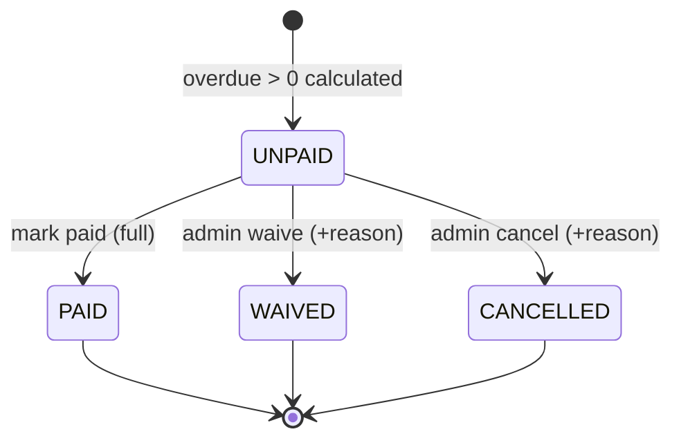

# SPEC.md - FE09 Quản lý tiền phạt

# Phiên bản: 0.4.3

# Trạng thái: APPROVED - MỐC CƠ SỞ 2026-07-17 - CỔNG THOÁT GIAI ĐOẠN 2 COMPLETE

# Chủ sở hữu: Dung

# Cập nhật lần cuối: 2026-07-21

# ID tính năng: FE09

# Thư mục tính năng: `.sdd/specs/feat-fine-management/`

> Trạng thái bàn giao hiện tại (2026-07-20): `COMPLETE` cho phạm vi Giai đoạn 1 đã được phê duyệt.
> `TASKS.md` và `.sdd/reviews/phase2-full-exit-validation-2026-07-19.md`
> là nguồn chuẩn cho trạng thái triển khai hiện tại. Các nhãn cũ `Not Started`,
> `PARTIAL`, `READY FOR REVIEW` hoặc đang chờ rà soát được giữ lại bên dưới chỉ là
> ảnh chụp nhanh kế hoạch/bằng chứng lịch sử, không phải trạng thái bàn giao hiện tại.

> Nguồn chuẩn cho Quản lý tiền phạt FE09. Mốc cơ sở v0.4.0 được phê duyệt sau khi các ranh giới về thanh toán, giải quyết tiền phạt, phân trang, múi giờ và nguyên mẫu máy chủ đã được xác định tất định.

---

## 1. Tổng quan về tính năng

### 1.1 Tên tính năng

Quản lý tiền phạt

### 1.2 Bối cảnh nghiệp vụ

Thư viện cần một phương thức có khả năng truy vết để tính và thu tiền phạt khi sách được trả muộn hoặc vi phạm chính sách thư viện. Tiền phạt ảnh hưởng đến niềm tin của Thành viên, điều kiện mượn sách, khối lượng công việc của nhân viên và báo cáo.

Quản lý tiền phạt phải tính tiền phạt nhất quán từ dữ liệu mượn, ghi nhận trạng thái thu tiền và tránh tính phí hai lần cho cùng một Thành viên đối với cùng một vi phạm mượn sách.

### 1.3 Mục tiêu / Kết quả

Hệ thống sẽ:

- Cho phép người dùng được cấp quyền xem thông tin tiền phạt.
- Tính tiền phạt quá hạn theo chính sách đã phê duyệt.
- Ghi nhận việc thu tiền phạt.
- Đánh dấu tiền phạt là đã thanh toán khi việc thu tiền hoàn tất.
- Cho phép Thủ thư/Quản trị viên quản lý giao diện danh sách tiền phạt với chức năng tìm kiếm/lọc/xem chi tiết và sắp xếp ID tiền phạt tăng dần để phục vụ truy vết.
- Bảo đảm việc tính tiền phạt có thể truy vết và kiểm thử.
- Cung cấp trạng thái tiền phạt chưa thanh toán cho việc đánh giá điều kiện mượn sách và lập báo cáo.

### 1.4 Mức đặc tả

- [x] Đặc tả đầy đủ - logic nghiệp vụ cốt lõi, rủi ro cao, phải đúng ngay từ đầu
- [ ] Đặc tả tiêu chuẩn - chức năng thông thường có quy tắc nghiệp vụ và kiểm tra hợp lệ
- [ ] Đặc tả rút gọn - giao diện đơn giản, tài liệu hoặc chức năng ít rủi ro

---

## 2. Tác nhân và quyền

| Tác nhân | Mô tả | Quyền / Trách nhiệm |
| ----- | ----------- | --------------------------- |
| Thành viên | Người dùng thư viện đã đăng ký | Xem thông tin tiền phạt của chính mình. |
| Thủ thư | Nhân viên thư viện | Xem tiền phạt của Thành viên, tính/xác nhận tiền phạt, ghi nhận việc thu tiền và đánh dấu đã thanh toán khi được phép. |
| Quản trị viên | Quản trị viên hệ thống | Có quyền của Thủ thư và có thể quản lý mọi bản ghi tiền phạt. |
| Khách | Khách truy cập chưa xác thực | Không có quyền truy cập tiền phạt. |
| Chức năng mượn sách | Chức năng nội bộ | Cung cấp hạn trả, ngày trả và dữ liệu quá hạn. |
| Chức năng thông báo | Chức năng nội bộ | Gửi thông báo tiền phạt/quá hạn khi được yêu cầu. |

---

## 3. Điều kiện tiên quyết

Tính năng này chỉ có thể bắt đầu khi:

- PRE-FE09-001: Người dùng là Thành viên tồn tại.
- PRE-FE09-002: Chi tiết mượn tồn tại trước khi một khoản tiền phạt có thể tham chiếu tới nó.
- PRE-FE09-003: Bản sao được mượn có hạn trả.
- PRE-FE09-004: Các giá trị của chính sách tiền phạt đã được phê duyệt: mức phạt quá hạn, ngày bắt đầu tính và quy tắc chặn.
- PRE-FE09-005: Các hành động tiền phạt được bảo vệ do tác nhân đã xác thực có đúng vai trò thực hiện.

---

## 4. Luồng chính

### MF-FE09-001: Xem thông tin tiền phạt

1. Thành viên mở trang tiền phạt của mình, hoặc Thủ thư/Quản trị viên mở thông tin tiền phạt của một Thành viên.
2. Hệ thống xác minh quyền của tác nhân.
3. Hệ thống truy xuất các bản ghi tiền phạt.
4. Hệ thống hiển thị số tiền, lý do, trạng thái và chi tiết mượn liên quan; khi bản ghi là `PAID`, hệ thống hiển thị dấu thời gian thanh toán và siêu dữ liệu thu tiền.
5. Hệ thống không làm lộ thông tin tiền phạt của Thành viên khác cho Thành viên thông thường.

### MF-FE09-002: Tính tiền phạt

1. FE07 hoặc Thủ thư/Quản trị viên xác định chi tiết mượn có thể đã quá hạn.
2. Hệ thống tải hạn trả, ngày trả hoặc ngày máy chủ hiện tại, Thành viên và các bản ghi tiền phạt hiện có.
3. Hệ thống tính số ngày quá hạn bắt đầu từ ngày sau ngày đến hạn.
4. Hệ thống nhân số ngày quá hạn với mức phạt hằng ngày đã phê duyệt.
5. Nếu số tiền được tính lớn hơn không, hệ thống sẽ tạo khoản phạt `UNPAID` khi chưa có bản ghi. Nếu khoản phạt hiện có cho cùng chi tiết mượn và lý do vẫn là `UNPAID`, hệ thống sẽ cập nhật `overdueDays`, `amount` và `calculatedAt` do máy chủ tính thay vì tạo bản ghi trùng lặp. Các khoản phạt ở trạng thái cuối được trả về mà không thay đổi.
6. Nếu số tiền được tính bằng không, hệ thống sẽ không tạo bản ghi phạt.

### MF-FE09-003: Ghi nhận việc thu tiền phạt

1. Thủ thư/Quản trị viên mở một khoản tiền phạt chưa thanh toán.
2. Thủ thư/Quản trị viên ghi nhận một lần thu đủ toàn bộ số tiền ngoại tuyến bằng phương thức thanh toán bắt buộc và ghi chú tùy chọn; Giai đoạn 1 không chấp nhận số tiền một phần.
3. Hệ thống kiểm tra quyền của tác nhân và trạng thái tiền phạt.
4. Trong một giao dịch, hệ thống đặt `PaidAmount = Amount`, `CollectedBy`, `PaymentMethod`, `PaidAt` và `Status = PAID`.
5. Hệ thống ghi siêu dữ liệu thu tiền và kiểm toán mà không làm lộ dữ liệu nhạy cảm.
6. Hệ thống duy trì khả năng truy vết của khoản tiền phạt.

### MF-FE09-004: Đánh dấu phạt là đã thanh toán

1. Thủ thư/Quản trị viên chọn một khoản tiền phạt chưa thanh toán.
2. Hệ thống xác minh khoản tiền phạt tồn tại và phải trả.
3. Trong một giao dịch, hệ thống đặt `PaidAmount = Amount`, `CollectedBy`, `PaymentMethod`, `PaidAt` và `Status = PAID`.
4. Hệ thống ghi mục nhật ký kiểm toán trạng thái đã thanh toán trong cùng giao dịch.

### MF-FE09-005: Quản lý danh sách tiền phạt trong giao diện Thủ thư

1. Thủ thư mở Quản lý tiền phạt.
2. Hệ thống liệt kê các khoản tiền phạt cùng Thành viên, sách, số ngày quá hạn, số tiền, trạng thái và chi tiết mượn liên quan.
3. Trong Giai đoạn 1, danh sách luôn được sắp xếp theo ID tiền phạt tăng dần để đối chiếu.
4. Thủ thư có thể tìm kiếm/lọc và xem chi tiết mà không sửa đổi bản ghi.
5. Các khoản tiền phạt đã thanh toán/giải quyết vẫn được hiển thị để truy vết.

### MF-FE09-006: Giải quyết tiền phạt mà không thu tiền

1. Quản trị viên chọn một khoản tiền phạt `UNPAID` cần được miễn hoặc hủy.
2. Quản trị viên cung cấp lý do đã loại khoảng trắng đầu/cuối dài 1..500 ký tự.
3. Hệ thống đổi khoản tiền phạt thành `WAIVED` hoặc `CANCELLED` theo cách nguyên tử cùng bản ghi kiểm toán.
4. Khoản tiền phạt đã giải quyết vẫn được hiển thị và không còn chặn điều kiện mượn sách FE07.

---

## 5. Luồng thay thế

### AF-FE09-001: Chưa quá hạn

1. Quá trình tính tiền phạt chạy cho một chi tiết mượn.
2. Ngày trả/ngày hiện tại trùng hoặc trước hạn trả.
3. Hệ thống tính số ngày quá hạn bằng không.
4. Hệ thống không tạo ra khoản phạt quá hạn.

### AF-FE09-002: Tiền phạt đã tồn tại

1. Quá trình tính tiền phạt chạy cho một chi tiết mượn đã có khoản phạt quá hạn đang hoạt động.
2. Hệ thống phát hiện khoản tiền phạt hiện có.
3. Nếu khoản tiền phạt hiện có là `UNPAID`, hệ thống tính lại và cập nhật số tiền do máy chủ suy ra, số ngày quá hạn và dấu thời gian tính dưới cùng khóa tiền phạt; nếu khoản tiền phạt ở trạng thái cuối, hệ thống trả về mà không thay đổi.

### AF-FE09-003: Cập nhật tiền phạt trái phép

1. Thành viên cố đánh dấu khoản tiền phạt đã thanh toán hoặc ghi nhận việc thu tiền.
2. Hệ thống kiểm tra quyền của vai trò.
3. Hệ thống từ chối hành động.

### AF-FE09-004: Cập nhật lại khoản tiền phạt đã thanh toán

1. Thủ thư/Quản trị viên cố đánh dấu lại một khoản tiền phạt đã thanh toán là đã thanh toán.
2. Hệ thống từ chối yêu cầu bằng `409 FINE_NOT_PAYABLE`.
3. `PaidAt` và tất cả siêu dữ liệu thanh toán không thay đổi.

### AF-FE09-005: Giải quyết tiền phạt mà không thu tiền

1. Quản trị viên cố miễn hoặc hủy khoản tiền phạt `UNPAID` mà không có lý do hợp lệ.
2. Hệ thống loại khoảng trắng đầu/cuối của lý do; kết quả rỗng trả về `REASON_REQUIRED`, còn kết quả dài hơn 500 ký tự trả về `REASON_TOO_LONG`.
3. Trạng thái tiền phạt và kiểm toán giữ nguyên.

---

## 6. Quy tắc nghiệp vụ

Dùng các ID ổn định này cho nhiệm vụ và kiểm thử.

- BR-FE09-001: Khách không thể xem hoặc quản lý tiền phạt.
- BR-FE09-002: Thành viên chỉ có thể xem thông tin tiền phạt của chính mình.
- BR-FE09-003: Thủ thư/Quản trị viên có thể xem thông tin tiền phạt của mọi Thành viên.
- BR-FE09-004: Chỉ Thủ thư/Quản trị viên được ghi nhận việc thu tiền phạt hoặc đánh dấu tiền phạt đã thanh toán.
- BR-FE09-005: Trong Giai đoạn 1, mức phạt quá hạn là 5,000 VND cho mỗi ngày quá hạn trên mỗi bản sao.
- BR-FE09-006: Ngày quá hạn bắt đầu từ ngày sau ngày đến hạn.
- BR-FE09-007: Việc tính tiền phạt phải dùng các giá trị ngày phía máy chủ và hạn trả/ngày trả đã lưu.
- BR-FE09-008: Không được dùng trực tiếp số tiền phạt do Thành viên/máy khách cung cấp làm đầu vào tính toán.
- BR-FE09-009: Một chi tiết mượn không được có các khoản phạt quá hạn đang hoạt động trùng lặp cho cùng một lý do; khoản tiền phạt `UNPAID` hiện có được tính lại tại chỗ, còn bản ghi tiền phạt ở trạng thái cuối không bao giờ được mở lại.
- BR-FE09-010: Bản ghi tiền phạt phải tham chiếu Thành viên và chi tiết mượn liên quan.
- BR-FE09-011: Tiền phạt chưa thanh toán phải tiếp tục được hiển thị cho đến khi chuyển sang `PAID`, `WAIVED` hoặc `CANCELLED`.
- BR-FE09-012: Đánh dấu một khoản tiền phạt đã thanh toán phải thiết lập trạng thái `PAID` và ghi `PaidAt`.
- BR-FE09-013: Tiền phạt đã thanh toán không được chặn mượn sách.
- BR-FE09-014: Mọi khoản tiền phạt `UNPAID` có số tiền lớn hơn 0 phải chặn lượt mượn mới và gia hạn theo chính sách FE07 đã phê duyệt.
- BR-FE09-015: Việc tính tiền phạt và các thay đổi trạng thái thanh toán phải có khả năng truy vết.
- BR-FE09-016: Cổng thanh toán trực tuyến nằm ngoài phạm vi; FE09 chỉ ghi nhận việc thu tiền/trạng thái thanh toán ngoại tuyến.
- BR-FE09-017: Giai đoạn 1 không yêu cầu bước Quản trị viên xác nhận/từ chối thanh toán sau khi Thủ thư thu tiền; một lần thu đủ toàn bộ số tiền ngoại tuyến do Thủ thư/Quản trị viên thực hiện có thể trực tiếp giải quyết khoản tiền phạt thành `PAID`.
- BR-FE09-018: Theo mặc định, danh sách tiền phạt phải dùng thứ tự ổn định theo ID tiền phạt tăng dần để hỗ trợ đối chiếu và rà soát trên lớp.
- BR-FE09-019: Việc tính số ngày quá hạn phải dùng ngày nghiệp vụ hiện tại của máy chủ theo `Asia/Ho_Chi_Minh`.
- BR-FE09-020: `GET /api/fines/me` là chức năng tự phục vụ của Thành viên và yêu cầu vai trò duy nhất của tài khoản là `MEMBER`; Thủ thư/Quản trị viên dùng không gian làm việc tiền phạt dành cho nhân viên, Thành viên không thể thu hoặc giải quyết tiền phạt, và quyền miễn/hủy chỉ dành cho Quản trị viên vẫn giữ nguyên.

---

## 7. Yêu cầu chức năng

- FR-FE09-001: Khi Thành viên xem thông tin tiền phạt, hệ thống phải chỉ trả về bản ghi tiền phạt của Thành viên đó.
- FR-FE09-002: Khi Thủ thư/Quản trị viên xem thông tin tiền phạt, hệ thống phải cho phép tra cứu theo Thành viên hoặc trạng thái tiền phạt.
- FR-FE09-003: Khi tính tiền phạt quá hạn, hệ thống phải tính số ngày quá hạn từ hạn trả và ngày trả/ngày máy chủ hiện tại.
- FR-FE09-004: Nếu số ngày quá hạn bằng không hoặc âm thì hệ thống không được tạo khoản phạt quá hạn.
- FR-FE09-005: Khi số ngày quá hạn dương, hệ thống phải tính số tiền theo mức 5,000 VND mỗi ngày trên mỗi bản sao.
- FR-FE09-006: Nếu đã tồn tại khoản tiền phạt `UNPAID` cho cùng chi tiết mượn và lý do, hệ thống phải tính lại tại chỗ số tiền do máy chủ suy ra, số ngày quá hạn và dấu thời gian tính mà không tạo bản ghi trùng lặp; các khoản phạt ở trạng thái cuối phải giữ nguyên.
- FR-FE09-007: Khi Thủ thư/Quản trị viên ghi nhận việc thu tiền phạt, hệ thống phải kiểm tra khoản tiền phạt và ghi thông tin thu tiền.
- FR-FE09-008: Khi Thủ thư/Quản trị viên đánh dấu tiền phạt đã thanh toán, hệ thống phải thiết lập trạng thái `PAID` và ghi dấu thời gian thanh toán.
- FR-FE09-009: Nếu tác nhân không được cấp quyền cố thu tiền phạt hoặc đánh dấu đã thanh toán, hệ thống phải từ chối truy cập.
- FR-FE09-010: Khi trạng thái tiền phạt thay đổi, hệ thống phải cung cấp trạng thái mới cho FE07 và FE12.
- FR-FE09-011: Khi hiển thị danh sách tiền phạt cho Thủ thư, hệ thống phải hỗ trợ tìm kiếm/lọc và mặc định sắp xếp theo ID tiền phạt tăng dần.
- FR-FE09-012: Khi Thủ thư/Quản trị viên ghi nhận việc thu đủ toàn bộ số tiền ngoại tuyến cho một khoản tiền phạt chưa thanh toán, hệ thống phải chuyển khoản tiền phạt thành `PAID`, thiết lập siêu dữ liệu thanh toán được lược đồ hỗ trợ và cung cấp trạng thái cập nhật cho việc đánh giá điều kiện mượn sách và báo cáo.
- FR-FE09-013: NẾU máy khách gửi yêu cầu thu tiền cho một khoản phạt đã giải quyết, hệ thống phải trả về `409 FINE_NOT_COLLECTIBLE` mà không thu lại hoặc thay đổi siêu dữ liệu ở trạng thái cuối.
- FR-FE09-014: Khi Quản trị viên miễn khoản tiền phạt chưa thanh toán với lý do hợp lệ, hệ thống phải thiết lập trạng thái `WAIVED` và ghi bản ghi kiểm toán theo cách nguyên tử.
- FR-FE09-015: Khi Quản trị viên hủy khoản tiền phạt chưa thanh toán với lý do hợp lệ, hệ thống phải thiết lập trạng thái `CANCELLED` và ghi bản ghi kiểm toán theo cách nguyên tử.
- FR-FE09-016: NẾU trang, giới hạn, trạng thái hoặc ID người dùng được cung cấp cho danh sách tiền phạt không hợp lệ, hệ thống phải từ chối yêu cầu mà không chuẩn hóa giá trị hoặc truy vấn tiền phạt.
- FR-FE09-017: Khi tính tiền phạt, hệ thống phải suy ra số ngày quá hạn từ ngày nghiệp vụ `Asia/Ho_Chi_Minh` và hạn trả/ngày trả đã lưu.
- FR-FE09-018: Không gian làm việc tiền phạt của Thủ thư/Quản trị viên phải giữ khoản tiền phạt đã chọn xuyên suốt các bước liệt kê, tính toán, thu tiền và đối chiếu đã thanh toán. Khoản tiền phạt quá hạn mới được tính phải trở thành khoản `UNPAID` được chọn để thu, còn các bước thanh toán phải từ chối truy cập nếu chưa chọn khoản tiền phạt `UNPAID`, kể cả khi khoản đã chọn nằm ngoài trang máy chủ đang hiển thị.
- FR-FE09-019: KHI Thành viên chỉ có một vai trò xem “Tiền phạt của tôi”, hệ thống phải chỉ trả về các khoản tiền phạt của Thành viên đó cùng sách liên quan, `borrowDetailId`, hạn trả, ngày trả, số tiền, lý do, trạng thái và dấu thời gian thanh toán; giao diện phải giải thích rằng khoản tiền phạt `UNPAID` có số tiền dương sẽ chặn việc mượn/gia hạn FE07, liên kết tới lịch sử mượn để đối chiếu và giữ ở chế độ chỉ đọc.

---

## 8. Tiêu chí chấp nhận

- AC-FE09-001: Với Thành viên đã đăng nhập, khi Thành viên xem tiền phạt, hệ thống phải chỉ trả về tiền phạt của Thành viên đó.
- AC-FE09-002: Với Thủ thư/Quản trị viên, khi xem tiền phạt của một Thành viên, hệ thống phải trả về tiền phạt của Thành viên đã chọn.
- AC-FE09-003: Với một chi tiết mượn được trả sau hạn, khi tính tiền phạt, số tiền phải bằng số ngày quá hạn nhân với 5,000 VND.
- AC-FE09-004: Với một chi tiết mượn được trả vào hoặc trước hạn trả, khi tính tiền phạt, hệ thống phải không tạo khoản phạt quá hạn.
- AC-FE09-005: Với một khoản phạt quá hạn `UNPAID` hiện có cho cùng chi tiết mượn, khi tính lại, khoản tiền phạt hiện có phải được tính lại tại chỗ mà không tạo bản ghi trùng lặp; khoản phạt ở trạng thái cuối phải giữ nguyên.
- AC-FE09-006: Với khoản tiền phạt chưa thanh toán, khi Thủ thư/Quản trị viên ghi nhận việc thu tiền, thông tin thu tiền phải được lưu theo lược đồ đã phê duyệt.
- AC-FE09-007: Với khoản tiền phạt chưa thanh toán, khi Thủ thư/Quản trị viên đánh dấu đã thanh toán, trạng thái phải chuyển thành `PAID` và `PaidAt` phải được ghi.
- AC-FE09-008: Với một Thành viên, khi Thành viên cố đánh dấu khoản tiền phạt đã thanh toán, hệ thống phải từ chối truy cập.
- AC-FE09-009: Với khoản tiền phạt đã thanh toán, khi quy trình đánh giá điều kiện mượn kiểm tra tiền phạt chưa thanh toán, khoản tiền phạt đã thanh toán không được chặn mượn sách.
- AC-FE09-010: Với một Thành viên có bất kỳ khoản tiền phạt `UNPAID` nào có số tiền lớn hơn 0, khi FE07 kiểm tra điều kiện mượn hoặc gia hạn, Thành viên phải được xem là bị chặn.
- AC-FE09-011: Với các khoản tiền phạt hiện có, khi Thủ thư mở danh sách tiền phạt, theo mặc định các bản ghi phải được hiển thị theo ID tiền phạt tăng dần và có thể tìm kiếm/lọc.
- AC-FE09-012: Với khoản tiền phạt chưa thanh toán và một lần thu đủ toàn bộ số tiền ngoại tuyến, khi Thủ thư/Quản trị viên ghi nhận việc thu tiền, khoản tiền phạt phải chuyển thành `PAID` và không còn chặn điều kiện mượn sách FE07.
- AC-FE09-013: Với khoản tiền phạt chưa thanh toán và lý do hợp lệ của Quản trị viên, khi Quản trị viên miễn tiền phạt, trạng thái phải chuyển thành `WAIVED`, khoản tiền phạt phải tiếp tục hiển thị và bản ghi kiểm toán phải được ghi nguyên tử.
- AC-FE09-014: Với khoản tiền phạt chưa thanh toán và lý do hợp lệ của Quản trị viên, khi Quản trị viên hủy tiền phạt, trạng thái phải chuyển thành `CANCELLED`, khoản tiền phạt phải tiếp tục hiển thị và bản ghi kiểm toán phải được ghi nguyên tử.
- AC-FE09-015: Với phép tính tiền phạt tại ranh giới múi giờ, khi đánh giá ngày nghiệp vụ của máy chủ, số ngày quá hạn phải dùng `Asia/Ho_Chi_Minh` một cách nhất quán.
- AC-FE09-016: Với Thủ thư/Quản trị viên tính hoặc chọn một khoản tiền phạt chưa thanh toán, khi chuyển sang thu tiền hoặc đối chiếu đã thanh toán, cùng ID tiền phạt, Thành viên, bối cảnh mượn và số tiền phải tiếp tục được chọn; sau khi thành công, hệ thống phải hiển thị khoản phạt chuẩn `PAID` được trả về và FE07/FE12 phải sử dụng trạng thái đã giải quyết.
- AC-FE09-017: Với các tác nhân Khách, Thủ thư, Quản trị viên và Thành viên, khi truy cập `/api/fines/me`, Khách phải nhận `401`, Thủ thư/Quản trị viên phải nhận `403 ROLE_REQUIRED`, và chỉ Thành viên được nhận bản ghi tiền phạt liên kết với lượt mượn của chính mình; Thành viên không được thấy hành động tính, thu tiền, đánh dấu đã thanh toán, miễn hoặc hủy.

---

## 9. Trường hợp biên và xử lý lỗi

| ID | Trường hợp biên / Lỗi | Hành vi hệ thống dự kiến |
| -- | ----------------- | ------------------------ |
| EC-FE09-001 | ID Thành viên không tồn tại | Trả về lỗi không tìm thấy. |
| EC-FE09-002 | Chi tiết mượn không tồn tại | Từ chối tính tiền phạt. |
| EC-FE09-003 | Chi tiết mượn không có hạn trả | Từ chối tính vì dữ liệu mượn chưa đầy đủ. |
| EC-FE09-004 | Ngày trả trước hạn trả | Tính số tiền phạt quá hạn bằng không. |
| EC-FE09-005 | Thiếu ngày trả cho bản sao đang được mượn | Dùng ngày nghiệp vụ hiện tại của máy chủ theo `Asia/Ho_Chi_Minh`. |
| EC-FE09-006 | Yêu cầu tính tiền phạt trùng lặp | Tính lại khoản phạt `UNPAID` hiện có tại chỗ dưới khóa cơ sở dữ liệu; không tạo bản ghi trùng lặp. Trả về các khoản phạt ở trạng thái cuối mà không thay đổi. |
| EC-FE09-007 | Số tiền phạt có thể âm | Xem như bằng không và không tạo khoản phạt quá hạn. |
| EC-FE09-008 | Tác nhân không được cấp quyền đánh dấu đã thanh toán | Trả về phản hồi bị cấm. |
| EC-FE09-009 | Tiền phạt đã thanh toán | `PATCH /paid` trả về `409 FINE_NOT_PAYABLE`; `POST /collections` trả về `409 FINE_NOT_COLLECTIBLE`; siêu dữ liệu thanh toán giữ nguyên. |
| EC-FE09-010 | Cập nhật cơ sở dữ liệu thất bại một phần | Hoàn tác các thay đổi trạng thái tiền phạt/thanh toán/kiểm toán. |
| EC-FE09-011 | Cố thu tiền cho khoản phạt đã giải quyết | Trả về `409 FINE_NOT_COLLECTIBLE`; không thu hai lần hoặc thay đổi siêu dữ liệu ở trạng thái cuối. |
| EC-FE09-012 | Thiếu lý do miễn/hủy hoặc lý do dài hơn 500 ký tự | Trả về lỗi kiểm tra hợp lệ và giữ nguyên trạng thái tiền phạt/kiểm toán. |
| EC-FE09-013 | Truy vấn danh sách tiền phạt chứa trang/giới hạn/trạng thái/ID người dùng không hợp lệ | Trả về lỗi kiểm tra hợp lệ trước khi truy vấn tầng kho lưu trữ. |
| EC-FE09-014 | Ngày nghiệp vụ vượt ranh giới ngày UTC/cục bộ | Chỉ dùng ngày `Asia/Ho_Chi_Minh`. |

---

## 10. Yêu cầu về dữ liệu

### 10.1 Các thực thể có liên quan

| Thực thể | Mục đích trong tính năng này |
| ------ | ----------------------- |
| Users | Xác định tác nhân là Thành viên và nhân viên. |
| UserRoles | Kiểm tra quyền quản lý tiền phạt. |
| BorrowRequests | Cung cấp quan hệ Thành viên cho các bản ghi mượn. |
| BorrowDetails | Cung cấp hạn trả, ngày trả và quan hệ với bản sao. |
| BookCopies | Cung cấp tham chiếu/trạng thái bản sao cho ngữ cảnh tiền phạt. |
| Fines | Lưu số tiền phạt, lý do, trạng thái và dấu thời gian thanh toán. |
| AuditLogs | Ghi các hành động tính, thu tiền, đánh dấu đã thanh toán, miễn và hủy. |

### 10.2 Trường dữ liệu

| Trường | Kiểu | Bắt buộc | Kiểm tra hợp lệ / Ghi chú |
| ----- | ---- | -------- | ------------------ |
| fineId | integer | Có khi cập nhật | Phải tồn tại trong `Fines`. |
| userId | integer | Có | Phải tham chiếu người dùng là Thành viên. |
| borrowDetailId | integer | Có | Phải tham chiếu chi tiết mượn liên quan. |
| bookTitle | string | Phép chiếu đọc | Tiêu đề FE05 được liên kết qua ngữ cảnh bản sao FE07. |
| dueDate | date | Phép chiếu đọc | Hạn trả chuẩn của FE07 dùng để Thành viên/nhân viên đối chiếu. |
| returnDate | date/null | Phép chiếu đọc | Ngày trả chuẩn của FE07; là null khi chưa trả. |
| borrowStatus | string | Phép chiếu đọc | Giá trị chuẩn `BorrowDetails.Status`; FE09 không thay đổi trường này. |
| overdueDays | integer | Có | Số ngày nghiệp vụ quá hạn không âm do máy chủ tính. |
| ratePerDay | decimal | Có | Mức phạt Giai đoạn 1 do máy chủ kiểm soát: 5,000 VND. |
| amount | decimal | Có | Do máy chủ tính; lớn hơn 0 đối với mọi bản ghi tiền phạt được lưu bền. |
| reason | string | Có | Giá trị Giai đoạn 1 là `OVERDUE`; tiền phạt do mất/hỏng nằm ngoài phạm vi. |
| status | string | Có | Các giá trị: `UNPAID`, `PAID`, `WAIVED`, `CANCELLED`. |
| paidAmount | decimal | Có | Trường lược đồ `PaidAmount`; bằng `0` khi là `UNPAID`, `WAIVED` hoặc `CANCELLED`, và chính xác bằng `Amount` khi là `PAID`. Không chấp nhận thanh toán một phần. |
| paidAt | datetime | Bắt buộc khi đã thanh toán | Do máy chủ thiết lập khi đánh dấu đã thanh toán; là null đối với `UNPAID`, `WAIVED` và `CANCELLED`. |
| calculatedAt | datetime | Có | Dấu thời gian máy chủ tính tiền phạt. |
| createdBy | integer | Bắt buộc khi tính | Tác nhân nhân viên kích hoạt phép tính thủ công. |
| collectedBy | integer | Bắt buộc khi đã thanh toán | Tác nhân nhân viên ghi nhận việc thu đủ toàn bộ số tiền ngoại tuyến hoặc đối chiếu. |
| paymentMethod | string | Bắt buộc khi đã thanh toán | Trường lược đồ `PaymentMethod`; được loại khoảng trắng đầu/cuối và kiểm tra trong giới hạn 1..50 ký tự. Là null đối với `UNPAID`, `WAIVED` và `CANCELLED`. |
| collectionNote | string | Không lưu bền | Ghi chú tùy chọn chỉ được lưu trong siêu dữ liệu kiểm toán, không nằm trong `Fines`. |

### 10.3 Mô hình trạng thái và quy tắc chuyển đổi (Tiền phạt)

Tiểu mục này chính thức hóa vòng đời của `Fine.status`. Tập trạng thái gồm `UNPAID`, `PAID`, `WAIVED` và `CANCELLED`. Giai đoạn 1 không có thanh toán một phần, vì vậy một lần thu đủ toàn bộ số tiền ngoại tuyến sẽ thiết lập `PaidAmount = Amount` và chuyển trực tiếp khoản tiền phạt từ `UNPAID` sang `PAID`. `amount` và `overdueDays` có thể được tính lại khi khoản tiền phạt là `UNPAID`, nhưng trở thành bất biến sau khi chuyển sang trạng thái cuối.

#### a) Sơ đồ trạng thái

```mermaid
stateDiagram-v2
    [*] --> UNPAID: overdue > 0 calculated
    UNPAID --> PAID: mark paid (full)
    UNPAID --> WAIVED: admin waive (+reason)
    UNPAID --> CANCELLED: admin cancel (+reason)
    PAID --> [*]
    WAIVED --> [*]
    CANCELLED --> [*]
```

Lưu ý: khi số ngày quá hạn được tính bằng không hoặc âm, **không có bản ghi phạt nào được tạo** (FR-FE09-004, AF-FE09-001, EC-FE09-004/007); vòng đời chỉ bắt đầu khi `amount > 0`.

#### b) Mô tả trạng thái

| Trạng thái | Mô tả |
| ----- | ----------- |
| `UNPAID` | Khoản tiền phạt đã được tạo với `amount > 0` và đang chờ thu. Chặn lượt mượn/gia hạn mới trong FE07 (BR-FE09-014). Đây là trạng thái đầu vào duy nhất. |
| `PAID` | Toàn bộ số tiền đã được thu; `PaidAt` được ghi. Đây là trạng thái cuối và không chặn mượn sách (BR-FE09-013). |
| `WAIVED` | Quản trị viên đã miễn tiền phạt với lý do bắt buộc và nhật ký kiểm toán (Q-FE09-005). Đây là trạng thái cuối; không dự kiến thu tiền. |
| `CANCELLED` | Quản trị viên đã hủy/vô hiệu hóa khoản tiền phạt với lý do bắt buộc và nhật ký kiểm toán (ví dụ: khoản phạt được tạo nhầm). Đây là trạng thái cuối. |

#### c) Chuyển đổi hợp lệ

| Từ | Đến | Tác nhân kích hoạt | Điều kiện | FR/BR/AF/EC liên quan |
| ---- | -- | ------- | --------- | ------------------- |
| `[*]` | `UNPAID` | Tính tiền phạt (khi trả sách hoặc chạy thủ công) | Số ngày quá hạn > 0 và `amount > 0` được tính; không có khoản phạt đang hoạt động cho cùng chi tiết mượn + lý do | MF-FE09-002, FR-FE09-005, FR-FE09-006, BR-FE09-005, BR-FE09-006, BR-FE09-009 |
| `UNPAID` | `PAID` | Thủ thư/Quản trị viên đánh dấu tiền phạt đã thanh toán | Tác nhân là Thủ thư/Quản trị viên; khoản tiền phạt tồn tại và là `UNPAID`; đã thu đủ toàn bộ số tiền; thiết lập `PaidAt` | MF-FE09-004, FR-FE09-008, BR-FE09-004, BR-FE09-012 |
| `UNPAID` | `WAIVED` | Quản trị viên miễn tiền phạt | Tác nhân là Quản trị viên; đã cung cấp lý do bắt buộc; đã ghi nhật ký kiểm toán | Q-FE09-005, BR-FE09-011, BR-FE09-015 |
| `UNPAID` | `CANCELLED` | Quản trị viên hủy/vô hiệu hóa tiền phạt | Tác nhân là Quản trị viên; đã cung cấp lý do bắt buộc; đã ghi nhật ký kiểm toán | Q-FE09-005, BR-FE09-011, BR-FE09-015 |

#### d) Chuyển đổi không hợp lệ (bị cấm rõ ràng)

| Bị cấm | Lý do | Liên quan |
| --------- | ------ | ------- |
| `PAID` → `UNPAID` | Khoản tiền phạt đã thu không được hoàn nguyên thành chưa thanh toán; đây là trạng thái cuối. | BR-FE09-012, AF-FE09-004 |
| `WAIVED` / `CANCELLED` → bất kỳ trạng thái nào | Các trạng thái cuối không thể được kích hoạt lại. | Q-FE09-005, BR-FE09-011 |
| `PAID` → `PAID` (thu lại) | Không được thu hoặc đánh dấu đã thanh toán lại khoản tiền phạt đã là `PAID`; thao tác thu trả về `409 FINE_NOT_COLLECTIBLE`, còn đối chiếu đã thanh toán trả về `409 FINE_NOT_PAYABLE`. `PaidAt` và siêu dữ liệu thanh toán không bị ghi đè. | AF-FE09-004, EC-FE09-009, FR-FE09-008 |
| Mọi thao tác thu tiền trên `PAID` / `WAIVED` / `CANCELLED` | Không được thu tiền đối với khoản tiền phạt đã giải quyết. | BR-FE09-004, NFR-FE09-TXN-002 |
| Thay đổi `amount` sau khi tạo | Khoản tiền phạt `UNPAID` hiện có có thể được tính lại từ các ngày đã lưu; các khoản tiền phạt `PAID`, `WAIVED` và `CANCELLED` không thể được mở lại hoặc thay đổi. | BR-FE09-008, BR-FE09-009, AF-FE09-002, EC-FE09-006 |
| Trực tiếp `[*]` → `PAID` / `WAIVED` / `CANCELLED` | Khoản tiền phạt trước tiên phải tồn tại dưới dạng `UNPAID`; không thể được tạo ra ngay ở trạng thái đã giải quyết. | MF-FE09-002 |

#### e) Bất biến

- INV-1: Một khoản tiền phạt luôn có đúng một `status` trong {`UNPAID`, `PAID`, `WAIVED`, `CANCELLED`} tại mọi thời điểm.
- INV-2: `amount > 0` đối với mọi khoản tiền phạt được lưu bền; nếu số tiền quá hạn được tính là ≤ 0 thì không tạo khoản tiền phạt (FR-FE09-004, EC-FE09-007).
- INV-3: `amount`, `overdueDays` và `calculatedAt` chỉ được thay đổi khi `status = UNPAID`; cả ba trở thành bất biến sau khi chuyển sang trạng thái cuối.
- INV-4: `PaidAmount = 0`, `PaidAt = null`, `CollectedBy = null` và `PaymentMethod = null` trong khi `status` là `UNPAID`, `WAIVED` hoặc `CANCELLED`; `PAID` yêu cầu `PaidAmount = Amount`, `PaidAt`, `CollectedBy` và `PaymentMethod`.
- INV-5: `status = PAID` **khi và chỉ khi** `PaidAmount = Amount` và `PaidAt` đã được thiết lập (Giai đoạn 1 không có trạng thái thanh toán một phần, theo Q-FE09-003).
- INV-6: Khoản tiền phạt ở `PAID`, `WAIVED` hoặc `CANCELLED` là trạng thái cuối và không chấp nhận thay đổi trạng thái hoặc thu thêm tiền.
- INV-7: Chỉ khoản tiền phạt `UNPAID` có `amount > 0` mới chặn mượn/gia hạn trong FE07 (BR-FE09-013, BR-FE09-014).
- INV-8: Mọi chuyển đổi trạng thái (tính, thu tiền, đánh dấu đã thanh toán, miễn, hủy) phải có khả năng truy vết qua nhật ký kiểm toán; các lần thử lại có tính lũy đẳng không được tạo khoản phạt đang hoạt động trùng lặp hoặc thu hai lần (BR-FE09-009, BR-FE09-015, NFR-FE09-TXN-001, NFR-FE09-TXN-002, EC-FE09-006).

---

## 11. API / Hợp đồng giao diện

> Các điểm cuối và cấu trúc yêu cầu/phản hồi dưới đây là hợp đồng chuẩn của Giai đoạn 1 cho chức năng này.

| Phương thức | Điểm cuối | Tác nhân | Yêu cầu | Phản hồi | Ghi chú |
| ------ | -------- | ----- | ------- | -------- | ----- |
| GET | `/api/fines/me` | Chỉ Thành viên | Truy vấn: `status?, page?, limit?` | Tiền phạt của bản thân cùng sách và các ngày mượn | Mặc định `page = 1`, `limit = 20`; Thành viên chỉ có một vai trò chỉ thấy tiền phạt của mình; Thủ thư/Quản trị viên nhận `403 ROLE_REQUIRED`. |
| GET | `/api/fines` | Thủ thư/Quản trị viên | Truy vấn: `q?, userId?, status?, page?, limit?` | Danh sách tiền phạt | Mặc định `page = 1`, `limit = 20`; thứ tự cố định là `FineId ASC`. |
| GET | `/api/fines/{fineId}` | Chủ sở hữu hoặc Thủ thư/Quản trị viên | - | Chi tiết tiền phạt | Chủ sở hữu chỉ được xem tiền phạt của mình. |
| POST | `/api/fines/calculate` | Thủ thư/Quản trị viên | `{ borrowDetailId }` | Kết quả tiền phạt | Tính thủ công trong Giai đoạn 1 từ dữ liệu mượn đã lưu; không có tác nhân bộ lập lịch. |
| POST | `/api/fines/{fineId}/collections` | Thủ thư/Quản trị viên | `{ paymentMethod: string, note?: string }` | Tiền phạt đã thanh toán | Ghi nhận một lần thu đủ toàn bộ số tiền ngoại tuyến và thiết lập nguyên tử `PaidAmount = Amount`, `CollectedBy`, `PaidAt`, `PaymentMethod`, `Status = PAID`. |
| PATCH | `/api/fines/{fineId}/paid` | Thủ thư/Quản trị viên | `{ paymentMethod: string, note?: string }` | Tiền phạt đã thanh toán | Đối chiếu rõ ràng việc thanh toán đủ toàn bộ số tiền; dùng cùng quy tắc nguyên tử về siêu dữ liệu và trạng thái cuối như thao tác thu tiền. |
| PATCH | `/api/fines/{fineId}/waive` | Quản trị viên | `{ reason }` | Tiền phạt đã miễn | Lý do đã loại khoảng trắng đầu/cuối dài 1..500 ký tự; cập nhật trạng thái/kiểm toán theo cách nguyên tử. |
| PATCH | `/api/fines/{fineId}/cancel` | Quản trị viên | `{ reason }` | Tiền phạt đã hủy | Lý do đã loại khoảng trắng đầu/cuối dài 1..500 ký tự; cập nhật trạng thái/kiểm toán theo cách nguyên tử. |

### 11.1 Hợp đồng lỗi tất định

- Yêu cầu thu tiền đối với `PAID`, `WAIVED` hoặc `CANCELLED` trả về `409 FINE_NOT_COLLECTIBLE`.
- Yêu cầu đối chiếu đã thanh toán đối với `PAID`, `WAIVED` hoặc `CANCELLED` trả về `409 FINE_NOT_PAYABLE`.
- Yêu cầu miễn/hủy đối với `PAID`, `WAIVED` hoặc `CANCELLED` trả về `409 FINE_NOT_RESOLVABLE`.
- Thiếu lý do của Quản trị viên hoặc lý do chỉ chứa khoảng trắng trả về `400 REASON_REQUIRED`; lý do sau khi loại khoảng trắng đầu/cuối dài hơn 500 ký tự trả về `400 REASON_TOO_LONG`.

### 11.2 Lưu ý về sự phù hợp của nguyên mẫu

Nguyên mẫu React FE09 hiện tại có thể lưu bản ghi tiền phạt trong bộ nhớ trình duyệt cho luồng thao tác trên lớp/trình diễn. Đây không phải bằng chứng hoàn thành ở môi trường vận hành. Phần triển khai phù hợp môi trường vận hành phải dùng API FE09 phía máy chủ cho các hành vi tính, danh sách/chi tiết, thu tiền, đánh dấu đã thanh toán, miễn và hủy.

---

## 12. Yêu cầu phi chức năng

### 12.1 Bảo mật

- NFR-FE09-SEC-001: Các điểm cuối tiền phạt phải yêu cầu xác thực; Giai đoạn 1 chỉ cho phép Thủ thư/Quản trị viên tính thủ công.
- NFR-FE09-SEC-002: Thành viên không được xem bản ghi tiền phạt của Thành viên khác.
- NFR-FE09-SEC-003: Việc thu tiền và đánh dấu đã thanh toán phải thực thi quyền Thủ thư/Quản trị viên ở máy chủ.
- NFR-FE09-SEC-004: Việc tính số tiền phạt không được tin tưởng số tiền do máy khách cung cấp.
- NFR-FE09-SEC-005: ID tiền phạt, trạng thái, phương thức thanh toán, ghi chú thu tiền và các tham số liên quan đến ngày phải được kiểm tra hợp lệ ở máy chủ.

### 12.2 Tính toàn vẹn của giao dịch

- NFR-FE09-TXN-001: Việc tính/tạo tiền phạt và tính lại khoản phạt `UNPAID` hiện có phải được thực hiện nguyên tử dưới khóa cơ sở dữ liệu; không được sửa các bản ghi tiền phạt ở trạng thái cuối.
- NFR-FE09-TXN-002: Thu tiền, đánh dấu đã thanh toán, miễn và hủy phải cập nhật nguyên tử trạng thái tiền phạt, siêu dữ liệu thanh toán/lý do và bản ghi kiểm toán.

### 12.3 Hiệu năng

- NFR-FE09-PERF-001: Danh sách tiền phạt mặc định dùng `page = 1`, `limit = 20`; giá trị `page` được cung cấp phải là số nguyên >= 1 và `limit` phải là số nguyên trong 1..100.
- NFR-FE09-PERF-002: Việc tra cứu chi tiết mượn để tính tiền phạt phải dùng khóa chính `BorrowDetails` hoặc đường dẫn khóa ngoại đã phê duyệt; không được phép quét không giới hạn.

### 12.4 Ghi nhật ký và kiểm toán

- NFR-FE09-LOG-001: Việc tính tiền phạt, thu tiền, đánh dấu đã thanh toán, miễn, hủy và các thay đổi trạng thái thất bại phải có khả năng truy vết.
- NFR-FE09-LOG-002: Nhật ký không được làm lộ dữ liệu cá nhân nhạy cảm vượt quá mức cần thiết cho kiểm toán.

### 12.5 Khả năng sử dụng

- NFR-FE09-UX-001: Phần hiển thị tiền phạt phải nêu rõ số tiền, lý do, trạng thái và bối cảnh mượn liên quan.
- NFR-FE09-UX-002: Lỗi thanh toán/thu tiền phải giải thích khoản tiền phạt đã thanh toán, không tồn tại hay tác nhân không được cấp quyền.
- NFR-FE09-TIME-001: Việc tính số ngày quá hạn phải dùng ngày nghiệp vụ `Asia/Ho_Chi_Minh` cho cả chi tiết đã trả và chi tiết đang mượn.

---

## 13. Ngoài phạm vi

Tính năng này không bao gồm:

- Phê duyệt mượn sách, xử lý trả sách hoặc gán hạn trả.
- Quản lý tình trạng/trạng thái bản sao vật lý.
- Cổng thanh toán trực tuyến hoặc tích hợp nhà cung cấp thanh toán.
- Gửi thông báo.
- Triển khai bảng điều khiển báo cáo.
- Phê duyệt tư cách thành viên.

---

## 14. Phụ thuộc

| Phụ thuộc | Loại | Ghi chú |
| ---------- | ---- | ----- |
| Quản lý mượn sách FE07 | Nội bộ | Cung cấp dữ liệu hạn trả/ngày trả của chi tiết mượn và có thể gọi tính tiền phạt. Đã kiểm tra ngày 2026-06-10: FE07 xem mọi khoản tiền phạt `UNPAID` có số tiền lớn hơn 0 là yếu tố chặn lượt mượn mới và gia hạn. |
| Quản lý kho / Bản sao sách FE06 | Nội bộ | Cung cấp tình trạng/trạng thái bản sao cho các trường hợp mất/hỏng. |
| Quản lý thông báo FE10 | Nội bộ | Gửi thông báo tiền phạt/quá hạn. |
| Quản lý người dùng và vai trò FE11 | Nội bộ | Cung cấp quyền của nhân viên. |
| Báo cáo và thống kê FE12 | Nội bộ | Đọc dữ liệu tiền phạt để lập báo cáo. |
| Cơ sở dữ liệu SQL Server | Kỹ thuật | Tập lệnh SQL hiện tại có `Fines`. |

---

## 15. Câu hỏi đã được giải quyết

| ID | Quyết định phê duyệt | Nguồn | Trạng thái |
| -- | ----------------- | ------ | ------ |
| Q-FE09-001 | Giai đoạn 1 chỉ hỗ trợ tiền phạt quá hạn; tiền phạt do mất/hỏng nằm ngoài phạm vi. | Gói rà soát 2026-06-10 | APPROVED |
| Q-FE09-002 | Mọi khoản tiền phạt UNPAID có số tiền lớn hơn 0 đều chặn lượt mượn mới và gia hạn. | Gói rà soát 2026-06-10 | APPROVED |
| Q-FE09-003 | Giai đoạn 1 không có thanh toán một phần. | Gói rà soát 2026-06-10 | APPROVED |
| Q-FE09-004 | Giai đoạn 1 lưu `CollectedBy`, `PaymentMethod` và `PaidAt` trên `Fines`; không yêu cầu bảng thanh toán riêng. Ghi chú thu tiền tùy chọn chỉ được lưu trong siêu dữ liệu kiểm toán an toàn và không phải cột của `Fines`. | Gói rà soát 2026-06-10; chuẩn hóa thanh toán 2026-07-17 | APPROVED |
| Q-FE09-005 | Quản trị viên có thể miễn/hủy tiền phạt với lý do bắt buộc và nhật ký kiểm toán. | Gói rà soát 2026-06-10 | APPROVED |
| Q-FE09-006 | Việc tính tiền phạt chạy khi trả sách và Thủ thư/Quản trị viên cũng có thể chạy thủ công; tác vụ hằng ngày theo lịch là công việc tương lai. | Gói rà soát 2026-06-10 | APPROVED |
| Q-FE09-007 | Nguyên mẫu giao diện có thể lưu cục bộ bản ghi tiền phạt để duy trì phần trình diễn, nhưng hành vi FE09 cuối cùng phải dùng phép tính và cơ chế lưu bền phía máy chủ. | Người dùng chỉnh sửa 2026-06-21 | APPROVED |
| Q-FE09-008 | Trong Giai đoạn 1, Thủ thư thu tiền sẽ trực tiếp giải quyết một khoản phạt quá hạn đã thanh toán ngoại tuyến; không yêu cầu Quản trị viên xác nhận/từ chối thanh toán. | Người dùng chỉnh sửa 2026-06-30 | APPROVED |
| Q-FE09-009 | Danh sách tiền phạt của Thủ thư mặc định sắp xếp ID tiền phạt tăng dần để rà soát ổn định. | Người dùng chỉnh sửa 2026-06-30 | APPROVED |
| Q-FE09-010 | Việc tính số ngày quá hạn dùng ngày nghiệp vụ của máy chủ theo `Asia/Ho_Chi_Minh`. | Rà soát chuẩn hóa của Nhat 2026-07-17 | APPROVED |
| Q-FE09-011 | Khoản phạt quá hạn `UNPAID` hiện có được tính lại tại chỗ từ các ngày đã lưu; trạng thái cuối của tiền phạt là bất biến và không bao giờ được mở lại. | Chuẩn hóa chính sách tiền phạt 2026-07-17 | APPROVED |
| Q-FE09-012 | `PaymentMethod` là bắt buộc đối với khoản tiền phạt `PAID`; `PaidAmount`, `PaidAt`, `CollectedBy` và `PaymentMethod` bằng không/null đối với các trạng thái cuối không phải đã thanh toán. | Chuẩn hóa thanh toán tiền phạt 2026-07-17 | APPROVED |

---

## 16. Ma trận truy vết

| ID yêu cầu | Trường hợp sử dụng liên quan | Ý định thử nghiệm liên quan | Trạng thái |
| -------------- | ---------------- | ------------------- | ------ |
| BR-FE09-001 | UC41-UC44 | Khách bị từ chối truy cập tại mọi điểm cuối tiền phạt | Sẵn sàng rà soát |
| BR-FE09-002 | UC41 | Kiểm thử cô lập tiền phạt của chính Thành viên | Sẵn sàng rà soát |
| BR-FE09-003 | UC41 | Kiểm thử nhân viên tra cứu theo Thành viên/trạng thái | Sẵn sàng rà soát |
| BR-FE09-004 | UC43, UC44 | Kiểm thử cấm Thành viên thu tiền/đánh dấu đã thanh toán | Sẵn sàng rà soát |
| BR-FE09-005 | UC42 | Kiểm thử mức phạt do máy chủ tính | Sẵn sàng rà soát |
| BR-FE09-006 | UC42 | Kiểm thử ranh giới ngày sau hạn trả | Sẵn sàng rà soát |
| BR-FE09-007 | UC42 | Kiểm thử tính từ ngày đã lưu/ngày máy chủ | Sẵn sàng rà soát |
| BR-FE09-008 | UC42 | Kiểm thử bỏ qua amount/overdueDays do máy khách cung cấp | Sẵn sàng rà soát |
| BR-FE09-009 | UC42 | Kiểm thử tính toán trùng lặp đồng thời | Sẵn sàng rà soát |
| BR-FE09-010 | UC42, UC41 | Kiểm thử khóa ngoại/ngữ cảnh Thành viên của tiền phạt | Sẵn sàng rà soát |
| BR-FE09-011 | UC41, UC44 | Kiểm thử tiền phạt đã giải quyết vẫn được hiển thị | Sẵn sàng rà soát |
| BR-FE09-012 | UC44 | Kiểm thử trạng thái đã thanh toán, PaidAmount và PaidAt | Sẵn sàng rà soát |
| BR-FE09-013 | UC42 | Kiểm thử tiền phạt đã thanh toán không chặn FE07 | Sẵn sàng rà soát |
| BR-FE09-014 | UC42 | Kiểm thử tiền phạt dương chưa thanh toán chặn FE07 | Sẵn sàng rà soát |
| BR-FE09-015 | UC42-UC44 | Kiểm thử ghi nhật ký kiểm toán cho mọi thay đổi trạng thái | Sẵn sàng rà soát |
| BR-FE09-016 | UC43, UC44 | Kiểm thử phạm vi và việc không có điểm cuối thanh toán trực tuyến | Sẵn sàng rà soát |
| BR-FE09-017 | UC43, UC44 | Kiểm thử thu đủ tiền trực tiếp giải quyết tiền phạt | Sẵn sàng rà soát |
| BR-FE09-018 | UC41 | Kiểm thử thứ tự danh sách cố định `FineId ASC` | Sẵn sàng rà soát |
| BR-FE09-019 | UC42 | Kiểm thử ranh giới ngày `Asia/Ho_Chi_Minh` | Sẵn sàng rà soát |
| BR-FE09-020 | UC41-UC44 | FE09-T024 kiểm thử danh sách của chính mình với một vai trò và ranh giới thao tác của nhân viên | Đã đạt kiểm tra tự động; đang chờ rà soát của con người |
| FR-FE09-001 | UC41 | Điểm cuối tiền phạt của chính Thành viên | Sẵn sàng rà soát |
| FR-FE09-002 | UC41 | Điểm cuối danh sách/chi tiết có bộ lọc dành cho nhân viên | Sẵn sàng rà soát |
| FR-FE09-003 | UC42 | Điểm cuối tính số ngày quá hạn | Sẵn sàng rà soát |
| FR-FE09-004 | UC42 | Không tạo tiền phạt khi chưa quá hạn | Sẵn sàng rà soát |
| FR-FE09-005 | UC42 | Tính số tiền phạt quá hạn dương | Sẵn sàng rà soát |
| FR-FE09-006 | UC42 | Tính lại tiền phạt `UNPAID` tại chỗ; tiền phạt ở trạng thái cuối không đổi | Sẵn sàng rà soát |
| FR-FE09-007 | UC43 | Thu đủ tiền và ghi siêu dữ liệu thanh toán | Sẵn sàng rà soát |
| FR-FE09-008 | UC44 | Chuyển trạng thái sang đã thanh toán | Sẵn sàng rà soát |
| FR-FE09-009 | UC43, UC44 | Kiểm thử chốt bảo vệ vai trò | Sẵn sàng rà soát |
| FR-FE09-010 | UC41-UC44 | Hợp đồng đọc lại trạng thái FE07/FE12 | Sẵn sàng rà soát |
| FR-FE09-011 | UC41 | Danh sách nhân viên được phân trang theo thứ tự cố định | Sẵn sàng rà soát |
| FR-FE09-012 | UC43, UC44 | Thu đủ tiền ngoại tuyến để giải quyết tiền phạt | Sẵn sàng rà soát |
| FR-FE09-013 | UC43, UC44 | Xung đột khi thu tiền cho tiền phạt đã giải quyết | Sẵn sàng rà soát |
| FR-FE09-014 | UC44 | Quản trị viên miễn tiền phạt kèm lý do và nhật ký kiểm toán | Sẵn sàng rà soát |
| FR-FE09-015 | UC44 | Quản trị viên hủy tiền phạt kèm lý do và nhật ký kiểm toán | Sẵn sàng rà soát |
| FR-FE09-016 | UC41 | Từ chối truy vấn danh sách không hợp lệ trước tầng kho lưu trữ | Sẵn sàng rà soát |
| FR-FE09-017 | UC42 | Ranh giới tính theo ngày nghiệp vụ | Sẵn sàng rà soát |
| FR-FE09-018 | UC41-UC44 | Kiểm thử mã nguồn/giao diện về tính liên tục của quy trình với tiền phạt đã chọn | Sẵn sàng rà soát |
| FR-FE09-019 | UC41 | FE09-T024 kiểm thử ngữ cảnh mượn của Thành viên, giải thích điều kiện chặn và vai trò | Đã đạt kiểm tra tự động; đang chờ rà soát của con người |
| AC-FE09-001 | UC41 | Phản hồi tiền phạt của chính mình chỉ chứa bản ghi của tác nhân | Sẵn sàng rà soát |
| AC-FE09-002 | UC41 | Phản hồi tiền phạt của Thành viên do nhân viên chọn | Sẵn sàng rà soát |
| AC-FE09-003 | UC42 | Số tiền quá hạn bằng số ngày * 5000 | Sẵn sàng rà soát |
| AC-FE09-004 | UC42 | Trả đúng hạn không tạo tiền phạt | Sẵn sàng rà soát |
| AC-FE09-005 | UC42 | Tính lại cập nhật tiền phạt `UNPAID` mà không tạo bản ghi trùng | Sẵn sàng rà soát |
| AC-FE09-006 | UC43 | Siêu dữ liệu thu tiền được lưu theo lược đồ | Sẵn sàng rà soát |
| AC-FE09-007 | UC44 | Paid/PaidAmount/PaidAt được cam kết | Sẵn sàng rà soát |
| AC-FE09-008 | UC43, UC44 | Thành viên không thể thu tiền hoặc đánh dấu đã thanh toán | Sẵn sàng rà soát |
| AC-FE09-009 | UC42 | Tiền phạt đã thanh toán không còn chặn mượn sách | Sẵn sàng rà soát |
| AC-FE09-010 | UC42 | Tiền phạt dương chưa thanh toán chặn mượn/gia hạn | Sẵn sàng rà soát |
| AC-FE09-011 | UC41 | Danh sách theo thứ tự cố định, có thể tìm kiếm/lọc | Sẵn sàng rà soát |
| AC-FE09-012 | UC43 | Thu đủ tiền để giải quyết tiền phạt và gỡ chặn FE07 | Sẵn sàng rà soát |
| AC-FE09-013 | UC44 | Thao tác miễn tiền phạt hợp lệ của Quản trị viên là trạng thái cuối và được ghi nhật ký kiểm toán | Sẵn sàng rà soát |
| AC-FE09-014 | UC44 | Thao tác hủy tiền phạt hợp lệ của Quản trị viên là trạng thái cuối và được ghi nhật ký kiểm toán | Sẵn sàng rà soát |
| AC-FE09-015 | UC42 | Ngày nghiệp vụ tại Thành phố Hồ Chí Minh có tính xác định | Sẵn sàng rà soát |
| AC-FE09-016 | UC41-UC44 | Tính/chọn -> thu tiền/đã thanh toán vẫn giữ một bản ghi tiền phạt chuẩn duy nhất | Sẵn sàng rà soát |
| AC-FE09-017 | UC41-UC44 | Khách/nhân viên bị từ chối danh sách của chính mình và trang tiền phạt Thành viên chỉ cho phép đọc | Đã đạt kiểm tra tự động; đang chờ rà soát của con người |

---

## 17. Danh sách kiểm tra rà soát

Danh sách kiểm tra phê duyệt Giai đoạn 1 (hoàn thành ngày 2026-06-10):

- [x] Chính sách phạt quá hạn được xác nhận là 5,000 VND/ngày/bản sao hoặc được cập nhật trong ngữ cảnh dùng chung.
- [x] Quy tắc cấm vay đối với các khoản tiền phạt chưa thanh toán được phê duyệt với FE07.
- [x] Chính sách phạt đối với sách mất/hỏng được phê duyệt hoặc đánh dấu ngoài phạm vi.
- [x] Lược đồ thu tiền/đã thanh toán được xác nhận.
- [x] Quy tắc ngăn ngừa phạt trùng lặp được phê duyệt.
- [x] Hợp đồng API được phê duyệt trong SPEC.md hoặc được sao chép vào một tệp hợp đồng API dùng chung chuyên biệt nếu nhóm tạo lại tệp đó.
- [x] Mọi tiêu chí chấp nhận đều có thể trở thành một kiểm thử.

### 17.1 Cổng rà soát bản sửa đổi v0.4.0

- [x] Xác nhận thu đủ tiền ngoại tuyến là chế độ thu tiền duy nhất của Giai đoạn 1 và không chấp nhận `collectedAmount`.
- [x] Xác nhận `/waive` và `/cancel` chỉ dành cho Quản trị viên và yêu cầu lý do dài 1..500 ký tự.
- [x] Xác nhận giá trị mặc định/giới hạn phân trang danh sách và thứ tự `FineId ASC` cố định.
- [x] Xác nhận tính toán ngày quá hạn sử dụng `Asia/Ho_Chi_Minh`.
- [x] Xác nhận việc ghi trạng thái/thanh toán/nhật ký kiểm toán tiền phạt là nguyên tử và các lần thử lại ở trạng thái cuối trả về xung đột xác định.
