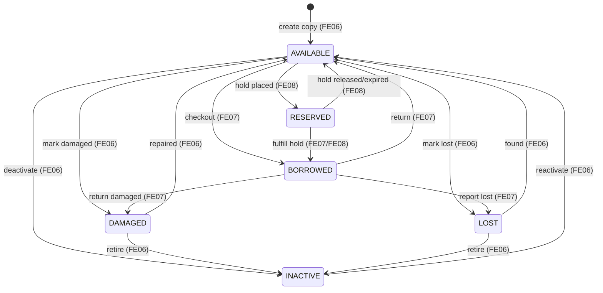

# SPEC.md - FE06 Inventory / Book Copy Management

# Version: 0.4.1

# Status: APPROVED - BASELINE 2026-07-17

# Implementation Status: PROTOTYPE EXISTS - CODE BASELINE DOCUMENTED

# Owner: Dat

# Last Updated: 2026-07-19

# Feature ID: FE06

# Feature folder: `.sdd/specs/feat-inventory-book-copy/`

> Source of truth for FE06 Inventory / Book Copy Management. Revision v0.4.1 aligns the spec with the current prototype implementation without expanding code scope.
>
> **Implementation status (2026-07-19): prototype exists.** The repository contains FE06 routes,
> controller, service, repository, validators, frontend API methods, and focused route/frontend tests.
> The current baseline does not implement SQL `rowversion` / `If-Match`, same-transaction audit,
> parent-book ACTIVE guards, mandatory status-change reasons, or server-backed inventory list UI.

---

## 1. Feature Overview

### 1.1 Feature Name

Inventory / Book Copy Management

### 1.2 Business Context

The library catalog tells users which books exist, but circulation depends on physical copies. Each physical copy needs a unique barcode, a location, and one status from `AVAILABLE`, `BORROWED`, `RESERVED`, `DAMAGED`, `LOST`, or `INACTIVE`.

Inventory / Book Copy Management keeps these physical copies accurate so that borrowing, reservation, public availability, fines, and reports all read the same source of truth.

### 1.3 Goal / Outcome

The system shall:

- Allow librarians/admins to view inventory.
- Allow librarians/admins to check a specific book copy status.
- Allow authorized staff to update copy availability/status safely.
- Allow authorized staff to manage physical book copies.
- Prevent invalid status transitions that would conflict with borrowing or reservation records.
- Keep copy status traceable and consistent for other features.

### 1.4 Scope Level

- [x] Full Spec - core business logic, high risk, must be correct from the beginning
- [ ] Standard Spec - normal feature with business rules and validations
- [ ] Light Spec - simple UI, documentation, or low-risk feature

---

## 2. Actors and Permissions

| Actor | Description | Permission / Responsibility |
| ----- | ----------- | --------------------------- |
| Librarian | Library staff | View inventory, check copy status, add/update/deactivate copies if allowed. |
| Admin | System administrator | Has librarian permissions and can manage all copies. |
| Member | Registered library user | May see derived availability through FE01/FE05; no direct copy management permission. |
| Guest | Unauthenticated visitor | May see derived public availability only; no direct copy management permission. |
| Borrowing Feature | Internal feature | Updates copy status during borrow/return workflows. |
| Reservation Feature | Internal feature | Uses reserved copy status and reservation availability. |

---

## 3. Preconditions

The feature can only start when:

- PRE-FE06-001: The related book exists in `Books`.
- PRE-FE06-002: Protected inventory actions are performed by authenticated Librarian/Admin.
- PRE-FE06-003: Barcode uniqueness rules are enforced.
- PRE-FE06-004: Allowed copy statuses and status transitions are approved.
- PRE-FE06-005: Active borrow/reservation records can be checked before manual status changes.
- PRE-FE06-006: The current FE06 code verifies that the parent book exists, but does not enforce `Books.Status = ACTIVE` before creating or manually setting an `AVAILABLE` copy.

---

## 4. Main Flows

### MF-FE06-001: View Inventory

1. Librarian/admin opens inventory management.
2. The system retrieves matching copy rows with related book summary data.
3. The system returns pagination metadata.
4. The system displays inventory with the approved `bookId`, `status`, `barcode`, and `location` filters.
5. The system supports pagination for large inventories.

### MF-FE06-002: Check Book Copy Status

1. Librarian/admin enters or scans a copy barcode, or selects a copy.
2. The system validates the copy identifier.
3. The system retrieves copy details, related book metadata, current status, and location.
4. The system shows whether the copy is available for borrowing according to approved status rules.
5. The response does not include borrower/member identity, reservation-owner identity, fine data, or protected audit data; staff use FE07/FE08 for those workflows.

### MF-FE06-003: Update Book Copy Availability

1. Librarian/admin selects a copy.
2. Librarian/admin chooses a new FE06-owned status and may enter a reason.
3. The system validates the requested status.
4. The system checks active borrowing/reservation conflicts before mutation.
5. The system updates copy status if valid.
6. The system writes the audit log entry after the copy mutation.

### MF-FE06-004: Manage Book Copies

1. Librarian/admin opens copy management for a book.
2. Librarian/admin adds, updates, or deactivates a physical copy.
3. The system validates book existence, barcode uniqueness, location, and optional manual status.
4. The system saves the copy record.
5. The system updates derived inventory counts.
6. The system writes the audit log entry after the copy mutation.

---

## 5. Alternative Flows

### AF-FE06-001: Duplicate Barcode

1. Librarian/admin submits a copy with an existing barcode.
2. The system detects duplicate barcode.
3. The system rejects the create/update.

### AF-FE06-002: Book Does Not Exist

1. Librarian/admin attempts to create a copy for a missing book.
2. The system rejects the request.
3. No copy is created.

### AF-FE06-003: Manual Status Change Conflicts With Borrowing

1. Librarian/admin attempts to mark a borrowed copy as available.
2. The system detects active `BorrowDetails` record.
3. The system rejects the manual status change and directs staff to FE07 return flow.

### AF-FE06-004: Manual Status Change Conflicts With Reservation

1. Librarian/admin attempts to mark a reserved copy as available.
2. The system detects active `Reservations` record.
3. The system rejects the manual status change with `RESERVATION_STATE_CONFLICT` and directs staff to the FE08 reservation workflow.

### AF-FE06-005: Copy Deactivation

1. Librarian/admin requests deactivation for a copy that is not actively borrowed or reserved.
2. The system checks conflicts and changes status to `INACTIVE`.
3. The copy is excluded from available copies and audit logging is attempted after the status update.

---

## 6. Business Rules

Use these stable IDs for tasks and tests.

- BR-FE06-001: Only librarians/admins may manage book copies directly.
- BR-FE06-002: Each book copy must belong to an existing book.
- BR-FE06-003: Each physical copy must have a unique barcode.
- BR-FE06-004: Copy status must be one of the approved values.
- BR-FE06-005: A copy is borrow-available only when its status is `AVAILABLE`.
- BR-FE06-006: `BORROWED`, `RESERVED`, `DAMAGED`, `LOST`, and `INACTIVE` copies must not be counted as available.
- BR-FE06-007: Manual status changes must not override active borrowing records.
- BR-FE06-008: Manual status changes must not override active reservation records.
- BR-FE06-009: Adding a copy is reflected by database-backed inventory list totals/pagination; the current FE06 API does not return grouped status counts.
- BR-FE06-010: Deactivating a copy is always status-based (`Status = INACTIVE`); physical deletion is forbidden in Phase 1.
- BR-FE06-011: Location is optional; when omitted or blank after trimming it is stored as `null`, and non-blank values are trimmed and limited to 100 characters.
- BR-FE06-012: Create, update, deactivate, and manual status-change actions attempt to write a traceable audit record after the copy mutation.
- BR-FE06-013: FE06 must not change book title, ISBN, author, category, publisher, or description.
- BR-FE06-014: FE06 must not approve borrow/return/reservation workflows; it only provides inventory state and protected copy update operations.
- BR-FE06-015: Current FE06 code only verifies that the parent book exists before copy creation; it does not enforce parent `Books.Status = ACTIVE` for create or manual `AVAILABLE` transitions.
- BR-FE06-016: Current FE06 existing-copy mutations do not use SQL `rowversion` or `If-Match`; conflicts are limited to active borrow/reservation checks before mutation.
- BR-FE06-017: Manual copy-status transitions accept an optional reason; when supplied, route validation limits it to 255 characters.
- BR-FE06-018: Inventory pagination uses `page` default `1` and `limit` default `20`; `page` must be an integer greater than or equal to `1`, and `limit` must be an integer from `1` through `100`. Invalid supplied values are rejected rather than normalized.

---

## 7. Functional Requirements

- FR-FE06-001: When a librarian/admin views inventory, the system shall return a paginated copy list with pagination metadata for the applied inventory filters.
- FR-FE06-002: When a librarian/admin searches by barcode, the system shall return the matching copy status and book information.
- FR-FE06-003: If a copy barcode does not exist, then the system shall return not found.
- FR-FE06-004: When a librarian/admin creates a copy with valid data, the system shall create the copy.
- FR-FE06-005: If barcode is duplicate, then the system shall reject the copy create/update.
- FR-FE06-006: When a librarian/admin updates copy availability with a valid transition, the system shall update copy status.
- FR-FE06-007: If a manual status update conflicts with active borrow/reservation records, then the system shall reject the update.
- FR-FE06-008: When a copy is deactivated, the system shall exclude it from available copy counts.
- FR-FE06-009: When inventory data is returned, the system shall not expose unrelated user, fine, or protected audit data.
- FR-FE06-010: When copy management changes data, the system shall attempt to record traceable action information after the copy mutation.

### 7.1 Unwanted Behavior Requirements (Error / Abnormal Conditions)

> EARS Unwanted-behavior requirements derived from approved Alternative Flows, Business Rules, and Edge Cases. No new logic is introduced; each requirement traces to an existing source.

- FR-FE06-011: IF a copy create/update request targets a book that does not exist in `Books`, the system shall reject the request and create no copy. (Source: AF-FE06-002, BR-FE06-002, EC-FE06-001)
- FR-FE06-012: IF a copy create/update request has an empty or missing barcode, the system shall reject the request. (Source: BR-FE06-003, EC-FE06-002)
- FR-FE06-013: IF a requested copy status is not one of the approved status values, the system shall reject the request. (Source: BR-FE06-004, EC-FE06-004)
- FR-FE06-014: IF a manual status change attempts to set `BORROWED` or `RESERVED` directly, the system shall reject the change and require the FE07/FE08 workflow. (Source: Q-FE06-002, BR-FE06-014)
- FR-FE06-015: IF staff attempts to manually mark a borrowed copy as available, the system shall reject the change and direct staff to the FE07 return flow. (Source: AF-FE06-003, BR-FE06-007, EC-FE06-006)
- FR-FE06-016: IF staff attempts to manually release a reserved copy, the system shall return `409 RESERVATION_STATE_CONFLICT`, change no record, and direct staff to FE08. (Source: AF-FE06-004, BR-FE06-008, EC-FE06-007)
- FR-FE06-017: IF a copy is already `INACTIVE` and duplicate deactivation is requested, the system shall return `200` with the current copy state and no second status transition. (Source: AF-FE06-005, BR-FE06-010, EC-FE06-008)
- FR-FE06-018: Current FE06 copy mutations do not require `If-Match` and do not return stale-version errors. (Source: EC-FE06-009, NFR-FE06-TXN-002)
- FR-FE06-019: Current FE06 writes audit after the copy mutation; audit failure is not wrapped in the same database transaction as the copy update. (Source: EC-FE06-010, NFR-FE06-TXN-001)
- FR-FE06-020: IF an actor without the Librarian/Admin role attempts direct copy management, the system shall deny access. (Source: BR-FE06-001, AC-FE06-010, NFR-FE06-SEC-002)
- FR-FE06-021: WHERE a location value is blank after trimming, the system shall store it as `null`; when it exceeds 100 characters, the system shall reject the value. (Source: BR-FE06-011, EC-FE06-005)
- FR-FE06-022: Current FE06 create, repair, found, or reactivation flows do not reject `AVAILABLE` when the parent book is inactive; they only require the parent book to exist. (Source: PRE-FE06-006, BR-FE06-015, EC-FE06-011)
- FR-FE06-023: IF a supplied manual status-transition reason is longer than 255 characters, the system shall reject the command; missing or blank reasons are accepted by the current route contract. (Source: BR-FE06-017, EC-FE06-012)
- FR-FE06-024: IF a supplied inventory `page` or `limit` violates BR-FE06-018, the system shall reject the request with a validation error and shall not normalize the value or query inventory. (Source: BR-FE06-018, EC-FE06-013)

---

## 8. Acceptance Criteria

- AC-FE06-001: Given existing copies, when a librarian views inventory, then the system returns the requested page of copies with pagination metadata for the applied filters.
- AC-FE06-002: Given a valid barcode, when a librarian checks copy status, then the system returns the copy status and related book.
- AC-FE06-003: Given an invalid barcode, when copy status is checked, then the system returns not found.
- AC-FE06-004: Given valid copy data and unique barcode, when a librarian adds a copy, then the copy is created.
- AC-FE06-005: Given a duplicate barcode, when a librarian adds or updates a copy, then the system rejects the request.
- AC-FE06-006: Given a copy without active borrow/reservation conflict, when status is updated through a valid FE06 transition, then the system saves the status and attempts audit logging after the mutation.
- AC-FE06-007: Given a copy has active borrow detail, when staff tries to mark it available manually, then the system rejects the update.
- AC-FE06-008: Given a copy has an active reservation, when staff tries to mark it available manually, then the system returns `409 RESERVATION_STATE_CONFLICT`, preserves state, and directs staff to FE08.
- AC-FE06-009: Given a copy is deactivated, when availability is calculated, then the copy is not counted as available.
- AC-FE06-010: Given a guest/member, when attempting direct copy management, then access is denied.
- AC-FE06-011: Given an inactive parent book, current FE06 copy creation/status code does not enforce a parent ACTIVE guard and only checks parent existence on create.
- AC-FE06-012: Given a staff update/deactivate/reactivate request, current FE06 does not require a stale-state version header.
- AC-FE06-013: Given a missing or blank manual status reason, current FE06 accepts the transition; given an over-255-character reason, route validation rejects it.
- AC-FE06-014: Given omitted pagination values, when staff views inventory, then FE06 uses `page = 1` and `limit = 20`; given a supplied non-integer, `page < 1`, `limit < 1`, or `limit > 100`, FE06 rejects the request without normalization.

---

## 9. Edge Cases and Error Handling

| ID | Edge Case / Error | Expected System Behavior |
| -- | ----------------- | ------------------------ |
| EC-FE06-001 | Book ID does not exist | Reject copy creation/update. |
| EC-FE06-002 | Barcode is empty | Reject request. |
| EC-FE06-003 | Barcode already exists | Reject request. |
| EC-FE06-004 | Unsupported status value | Reject request. |
| EC-FE06-005 | Location blank/over 100 characters | Blank normalizes to `null`; over 100 characters is rejected. |
| EC-FE06-006 | Copy is borrowed and staff marks available manually | Reject; use FE07 return flow. |
| EC-FE06-007 | Copy is reserved and staff marks available manually | Return `409 RESERVATION_STATE_CONFLICT`; use FE08. |
| EC-FE06-008 | Copy already inactive | Return `200` with current copy state; no second status transition. |
| EC-FE06-009 | Missing/stale `If-Match` rowversion | Not applicable in current FE06 code; no version header is required. |
| EC-FE06-010 | Audit write fails after database update | Current FE06 does not wrap copy update and audit write in one transaction. |
| EC-FE06-011 | Parent book is `INACTIVE` during any FE06-owned create/manual transition to `AVAILABLE` | Current FE06 does not enforce a parent ACTIVE guard. |
| EC-FE06-012 | Missing/blank/overlength manual status reason | Missing/blank is accepted; over 255 characters is rejected by route validation. |
| EC-FE06-013 | Invalid inventory `page`/`limit` | Reject with validation error; do not normalize or query inventory. |

---

## 10. Data Requirements

### 10.1 Entities Involved

| Entity | Purpose in this feature |
| ------ | ----------------------- |
| Books | Parent book record for each physical copy. |
| BookCopies | Stores physical copy barcode, status, and location. |
| BorrowDetails | Used to detect active borrowed copies before manual status change. |
| Reservations | Used to detect active reserved copies before manual status change. |
| UserRoles | Checks librarian/admin permissions. |
| AuditLogs | Records every copy management transition. |

### 10.2 Data Fields

| Field | Type | Required | Validation / Notes |
| ----- | ---- | -------- | ------------------ |
| copyId | integer | Yes for updates | Must exist in `BookCopies`. |
| bookId | integer | Yes | Must reference `Books`. |
| barcode | string | Yes | Unique, non-empty, max length per schema. |
| status | string | Yes | Values: `AVAILABLE`, `BORROWED`, `RESERVED`, `DAMAGED`, `LOST`, `INACTIVE`. |
| location | string | No | Omitted/blank values are stored as `null`; non-blank values are trimmed and limited to 100 characters. |
| reason | string | No | Optional for manual status transition; max 255 characters when supplied. |
| createdAt | datetime | Yes | Server creation timestamp. |
| updatedAt | datetime | Yes | Server update timestamp; changed on every mutation. |
| version | opaque string | No | Not present in the current FE06 API; existing-copy mutations do not use `If-Match`. |

### 10.3 State Model & Transition Rules (Book Copy)

> Defines the formal lifecycle of `BookCopy.status`. State set is fixed by Q-FE06-001 and section 10.2: `AVAILABLE`, `BORROWED`, `RESERVED`, `DAMAGED`, `LOST`, `INACTIVE`. Some transitions are **not** performed manually via FE06; they are driven by FE07 (Borrowing) or FE08 (Reservation). Current FE06 code enforces manual status values and active borrow/reservation conflicts, but does not enforce parent ACTIVE guards, version checks, or mandatory reasons.

#### a) State Diagram

#### b) States

| State | Ý nghĩa |
| ----- | ------- |
| `AVAILABLE` | Copy vật lý ở trạng thái sẵn sàng theo `BookCopies.Status`; current FE06 code does not recheck parent `Books.Status` for manual transitions. |
| `BORROWED` | Copy đang được một thành viên mượn (đang có `BorrowDetails` active). Không tính available. |
| `RESERVED` | Copy đang bị giữ chỗ cho một reservation active. Không tính available. |
| `DAMAGED` | Copy hư hỏng, không cho mượn cho tới khi được sửa hoặc loại bỏ. Không tính available. |
| `LOST` | Copy bị mất/thất lạc. Không tính available. |
| `INACTIVE` | Copy bị vô hiệu hóa (soft-deactivation theo Q-FE06-003), loại khỏi vòng lưu thông và khỏi số đếm available. |

#### c) Valid Transitions

| From | To | Trigger | Điều kiện | Ai điều khiển | FR/BR liên quan |
| ---- | -- | ------- | --------- | ------------- | --------------- |
| (none) | `AVAILABLE` | Create copy | Parent book exists + barcode unique | FE06 (manual) | FR-FE06-004, FR-FE06-022, BR-FE06-002/003/015 |
| `AVAILABLE` | `BORROWED` | Checkout | Không cho set thủ công | FE07 | FR-FE06-014, BR-FE06-014, Q-FE06-002 |
| `AVAILABLE` | `RESERVED` | Hold placed | Không cho set thủ công | FE08 | FR-FE06-014, BR-FE06-014, Q-FE06-002 |
| `AVAILABLE` | `DAMAGED` | Mark damaged | Không có borrow/reservation active | FE06 (manual) | FR-FE06-006, BR-FE06-006 |
| `AVAILABLE` | `LOST` | Mark lost | Không có borrow/reservation active | FE06 (manual) | FR-FE06-006, BR-FE06-006 |
| `AVAILABLE` | `INACTIVE` | Deactivate | Không borrowed/reserved | FE06 (manual) | FR-FE06-008, BR-FE06-010, AF-FE06-005 |
| `BORROWED` | `AVAILABLE` | Return | Phải qua return flow, KHÔNG thủ công FE06 | FE07 | FR-FE06-015, BR-FE06-007, AF-FE06-003, EC-FE06-006 |
| `BORROWED` | `LOST` | Report lost (during loan) | Thuộc xử lý mượn/trả | FE07 | BR-FE06-007, BR-FE06-014 |
| `BORROWED` | `DAMAGED` | Return damaged | Thuộc xử lý trả | FE07 | BR-FE06-007, BR-FE06-014 |
| `RESERVED` | `BORROWED` | Fulfill hold | Reservation chuyển sang mượn | FE07/FE08 | BR-FE06-008, BR-FE06-014 |
| `RESERVED` | `AVAILABLE` | Hold released/expired | KHÔNG thủ công FE06; qua FE08 | FE08 | FR-FE06-016, BR-FE06-008, AF-FE06-004, EC-FE06-007 |
| `DAMAGED` | `AVAILABLE` | Repaired | Copy đã sửa xong; no parent ACTIVE guard in current code | FE06 (manual) | FR-FE06-006, FR-FE06-022, BR-FE06-015 |
| `DAMAGED` | `INACTIVE` | Retire | Loại bỏ copy hỏng nặng | FE06 (manual) | BR-FE06-010 |
| `LOST` | `AVAILABLE` | Found | Tìm lại được copy; no parent ACTIVE guard in current code | FE06 (manual) | FR-FE06-006, FR-FE06-022, BR-FE06-015 |
| `LOST` | `INACTIVE` | Retire | Loại bỏ copy đã mất | FE06 (manual) | BR-FE06-010 |
| `INACTIVE` | `AVAILABLE` | Reactivate | Đưa copy trở lại lưu thông; no parent ACTIVE guard in current code | FE06 (manual) | FR-FE06-006, FR-FE06-022, BR-FE06-010/015 |

#### d) Invalid Transitions (cấm tường minh)

| From | To | Lý do cấm | Nguồn |
| ---- | -- | --------- | ----- |
| any | `BORROWED` (manual) | Staff không được set `BORROWED` thủ công; chỉ FE07. | FR-FE06-014, BR-FE06-014, Q-FE06-002 |
| any | `RESERVED` (manual) | Staff không được set `RESERVED` thủ công; chỉ FE08. | FR-FE06-014, BR-FE06-014, Q-FE06-002 |
| `BORROWED` | `AVAILABLE` (manual FE06) | Không được tự đánh dấu available khi đang có `BorrowDetails` active; phải qua FE07 return. | FR-FE06-015, BR-FE06-007, AF-FE06-003, EC-FE06-006 |
| `RESERVED` | `AVAILABLE` (manual FE06) | Không được tự đánh dấu available khi đang có `Reservations` active; phải qua FE08. | FR-FE06-016, BR-FE06-008, AF-FE06-004, EC-FE06-007 |
| `BORROWED` | `INACTIVE` | Không được deactivate copy đang được mượn. | BR-FE06-007, AF-FE06-005 |
| `RESERVED` | `INACTIVE` | Không được deactivate copy đang bị giữ chỗ. | BR-FE06-008, AF-FE06-005 |
| `INACTIVE` | `BORROWED` / `RESERVED` | Copy `INACTIVE` không thể được mượn/giữ chỗ; phải reactivate về `AVAILABLE` trước. | BR-FE06-005/006, FR-FE06-008 |
| any | (unsupported value) | Trạng thái phải thuộc tập đã duyệt. | FR-FE06-013, BR-FE06-004, EC-FE06-004 |
| `INACTIVE` | `INACTIVE` (duplicate) | Return current copy state; no second transition. | FR-FE06-017, EC-FE06-008 |
| any | physical deletion | Phase 1 requires soft deactivation; no FE06 transition deletes the row. | BR-FE06-010, Q-FE06-003 |

#### e) Invariants

- INV-FE06-ST-001: Một copy tại mọi thời điểm có đúng MỘT `status` thuộc tập `{AVAILABLE, BORROWED, RESERVED, DAMAGED, LOST, INACTIVE}`. (BR-FE06-004)
- INV-FE06-ST-002: FE06 stores availability using `BookCopies.Status`; parent `Books.Status = ACTIVE` is not rechecked by current FE06 create/status code. (BR-FE06-005/006/015, FR-FE06-008/022)
- INV-FE06-ST-003: Các chuyển vào/ra `BORROWED` và `RESERVED` chỉ do FE07/FE08 điều khiển, không do thao tác thủ công FE06. (FR-FE06-014, BR-FE06-014, Q-FE06-002)
- INV-FE06-ST-004: Một thao tác thủ công FE06 không bao giờ ghi đè `BorrowDetails`/`Reservations` đang active; transition bị chặn nếu có conflict. (FR-FE06-007, BR-FE06-007/008)
- INV-FE06-ST-005: Current FE06 attempts AuditLog writes after create/update/status/deactivate mutations; the audit write is not in the same transaction as the copy mutation. (BR-FE06-012, Q-FE06-006, FR-FE06-019, NFR-FE06-TXN-001, NFR-FE06-LOG-001)
- INV-FE06-ST-006: Existing-copy mutations do not require matching `If-Match`/`rowversion` in the current FE06 API. (BR-FE06-016, FR-FE06-018, EC-FE06-009, NFR-FE06-TXN-002)
- INV-FE06-ST-007: Current FE06 create/manual `AVAILABLE` transitions do not recheck an `ACTIVE` parent. (BR-FE06-015, FR-FE06-022)

---

## 11. API / Interface Contract

> RESTful API contract for the current FE06 implementation. Existing-copy mutation endpoints do not require `If-Match`.

| Method | Endpoint | Actor | Request | Response | Notes |
| ------ | -------- | ----- | ------- | -------- | ----- |
| GET | `/api/inventory` | Librarian/Admin | Query: `bookId?, status?, barcode?, location?, page = 1, limit = 20` | `{ copies, pagination: { page, limit, total } }` | Protected; filters apply to returned copies; `page >= 1`, `limit = 1..100`; invalid supplied values return validation error. |
| GET | `/api/book-copies/{copyId}` | Librarian/Admin | - | Copy detail | Includes related book summary. |
| GET | `/api/book-copies/barcode/{barcode}` | Librarian/Admin | - | Copy detail/status | Used for barcode lookup. |
| POST | `/api/books/{bookId}/copies` | Librarian/Admin | `{ barcode, location?, status? }` | Created copy | Requires existing book; status is optional and limited to FE06 manual statuses, default `AVAILABLE`. |
| PUT | `/api/book-copies/{copyId}` | Librarian/Admin | `{ barcode?, location?, status? }` | Updated copy | Can update barcode, location, and optional FE06 manual status. |
| PATCH | `/api/book-copies/{copyId}/status` | Librarian/Admin | `{ status, reason? }` | Updated status | FE06 manual statuses only; reason optional; conflict checks run before mutation. |
| DELETE | `/api/book-copies/{copyId}` | Admin/Librarian | - | Deactivated or current copy | Always sets `INACTIVE` unless already inactive; never physically deletes; no request body is required. |

---

## 12. Non-functional Requirements

### 12.1 Security

- NFR-FE06-SEC-001: Inventory management endpoints must require authentication.
- NFR-FE06-SEC-002: Server must enforce Librarian/Admin role for direct copy management.
- NFR-FE06-SEC-003: `barcode`, `location`, `status`, and all identifier inputs must be validated server-side.
- NFR-FE06-SEC-004: Responses must not expose unrelated user, fine, or credential data.

### 12.2 Transaction Integrity

- NFR-FE06-TXN-001: Current FE06 does not wrap copy mutation and audit logging in one database transaction; audit is attempted after mutation.
- NFR-FE06-TXN-002: Current FE06 existing-copy mutations do not compare `If-Match` with SQL `rowversion`; active borrow/reservation conflict checks run before mutation.

### 12.3 Performance

- NFR-FE06-PERF-001: Inventory list must use the deterministic pagination contract in BR-FE06-018.
- NFR-FE06-PERF-002: Barcode lookup must use the unique barcode key or index.
- NFR-FE06-PERF-003: Inventory list filters apply `BookId`, `Status`, `location`, and `barcode` in the database query before pagination.

### 12.4 Logging and Audit

- NFR-FE06-LOG-001: Add, update, deactivate, and manual status changes are traced through audit metadata available to the current audit helper; reason is included only when supplied.

### 12.5 Usability

- NFR-FE06-UX-001: Inventory screens must clearly distinguish copy status from book metadata.
- NFR-FE06-UX-002: Invalid status transition errors must explain the blocking reason.

---

## 13. Out of Scope

This feature does not include:

- Book title/ISBN/author/category/publisher management.
- Borrow request approval or return processing.
- Reservation queue processing.
- Fine calculation for lost/damaged/overdue copies.
- Public browse UI.
- RFID/QR hardware integration beyond storing/scanning barcode text.

---

## 14. Dependencies

| Dependency | Type | Notes |
| ---------- | ---- | ----- |
| FE05 Book Management | Internal | Provides parent book metadata. |
| FE07 Borrowing Management | Internal | Owns borrow/return state changes that affect copies. |
| FE08 Reservation Management | Internal | Owns reservation state that may hold a copy. |
| FE09 Fine Management | Internal | May create fines from damaged/lost/overdue copy outcomes. |
| FE11 User & Role Management | Internal | Provides staff permissions. |
| SQL Server database | Technical | Current SQL has `BookCopies`; current FE06 code does not expose SQL `rowversion` or require `If-Match`. |

---

## 15. Resolved Questions

| ID | Approved Decision | Source | Status |
| -- | ----------------- | ------ | ------ |
| Q-FE06-001 | Allowed copy statuses: AVAILABLE, BORROWED, RESERVED, DAMAGED, LOST, INACTIVE. | Review packet 2026-06-10 | APPROVED |
| Q-FE06-002 | Staff cannot manually set BORROWED or RESERVED; those come only from FE07/FE08 flows. | Review packet 2026-06-10 | APPROVED |
| Q-FE06-003 | DELETE /api/book-copies/{id} deactivates instead of physical delete. | Review packet 2026-06-10 | APPROVED |
| Q-FE06-004 | Current code treats location as optional; blank becomes `null`, non-blank values are trimmed and limited to 100 characters. | Code baseline review 2026-07-19 | CODE BASELINE |
| Q-FE06-005 | Copy condition is not separate from status in Phase 1. | Review packet 2026-06-10 | APPROVED |
| Q-FE06-006 | Create/update/deactivate/status-change actions write AuditLogs. | Review packet 2026-06-10 | APPROVED |
| Q-FE06-007 | Current code does not use SQL `rowversion` or require `If-Match` for existing-copy mutations. | Code baseline review 2026-07-19 | CODE BASELINE |

---

## 16. Traceability Matrix

| Requirement ID | Related Use Case | Related Test Case | Status |
| -------------- | ---------------- | ----------------- | ------ |
| BR-FE06-001 | UC25, UC26, UC27, UC28 | FT26, FT27, FT28, FT29 | Not Started |
| BR-FE06-002 | UC25, UC26, UC28 | Planned: parent-book reference validation test | Planned |
| BR-FE06-003 | UC26, UC28 | Planned: barcode required/unique test | Planned |
| BR-FE06-004 | UC25-UC28 | Planned: approved status enum validation test | Planned |
| BR-FE06-005 | UC25, UC26, UC27 | FT26, FT27, FT28 | Not Started |
| BR-FE06-006 | UC25, UC27 | Planned: effective availability count test | Planned |
| BR-FE06-007 | UC27 | FT28 | Not Started |
| BR-FE06-008 | UC27 | FT28 | Not Started |
| BR-FE06-009 | UC25, UC28 | Planned: create updates derived counts test | Planned |
| BR-FE06-010 | UC27, UC28 | Planned: soft-deactivation/no-delete test | Planned |
| BR-FE06-011 | UC28 | Planned: location 1..100/control-character test | Planned |
| BR-FE06-012 | UC27, UC28 | Planned: mandatory audit coverage test | Planned |
| BR-FE06-013 | UC27, UC28 | Planned: copy endpoint cannot mutate book metadata | Planned |
| BR-FE06-014 | UC27, UC29-UC39 | Planned: FE06 cannot own borrow/reservation transitions | Planned |
| BR-FE06-015 | UC27, UC28 | Planned: parent ACTIVE guard/effective availability test | Planned |
| BR-FE06-016 | UC27, UC28 | Code baseline: no SQL rowversion/`If-Match` contract | Documented |
| BR-FE06-017 | UC27 | Code baseline: optional reason, 255-character limit when supplied | Documented |
| BR-FE06-018 | UC25 | Planned: pagination defaults/bounds/rejection test | Planned |
| FR-FE06-001 | UC25 | FT26 | Not Started |
| FR-FE06-002 | UC26 | FT27 | Not Started |
| FR-FE06-003 | UC26 | Planned: unknown barcode not-found test | Planned |
| FR-FE06-004 | UC28 | FT29 | Not Started |
| FR-FE06-005 | UC28 | FT29 | Not Started |
| FR-FE06-006 | UC27 | FT28 | Not Started |
| FR-FE06-007 | UC27 | FT28 | Not Started |
| FR-FE06-008 | UC25, UC27 | FT26, FT28 | Not Started |
| FR-FE06-009 | UC25, UC26 | FT26, FT27 | Not Started |
| FR-FE06-010 | UC27, UC28 | FT28, FT29 | Not Started |
| FR-FE06-011 | UC28 | Planned: inactive/missing parent rejection test | Planned |
| FR-FE06-012 | UC28 | Planned: empty barcode rejection test | Planned |
| FR-FE06-013 | UC27, UC28 | Planned: unsupported status rejection test | Planned |
| FR-FE06-014 | UC27 | Planned: manual BORROWED/RESERVED rejection test | Planned |
| FR-FE06-015 | UC27 | FT28 | Not Started |
| FR-FE06-016 | UC27 | FT28 | Not Started |
| FR-FE06-017 | UC27, UC28 | Planned: duplicate deactivate idempotency test | Planned |
| FR-FE06-018 | UC27, UC28 | Code baseline: no missing/stale `If-Match` rejection | Documented |
| FR-FE06-019 | UC27, UC28 | Planned: copy change + audit rollback test | Planned |
| FR-FE06-020 | UC25-UC28 | Planned: non-staff management forbidden test | Planned |
| FR-FE06-021 | UC28 | Planned: invalid location rejection test | Planned |
| FR-FE06-022 | UC27, UC28 | Planned: inactive parent blocks manual AVAILABLE transition | Planned |
| FR-FE06-023 | UC27 | Planned: status reason trim/length validation test | Planned |
| FR-FE06-024 | UC25 | Planned: invalid pagination rejected without normalization/query | Planned |
| AC-FE06-001 | UC25 | FT26 | Not Started |
| AC-FE06-002 | UC26 | FT27 | Not Started |
| AC-FE06-003 | UC26 | Planned: unknown barcode acceptance test | Planned |
| AC-FE06-004 | UC28 | FT29 | Not Started |
| AC-FE06-005 | UC28 | Planned: duplicate barcode acceptance test | Planned |
| AC-FE06-006 | UC27 | Code baseline: valid transition saves status and attempts audit after mutation | Documented |
| AC-FE06-007 | UC27 | FT28 | Not Started |
| AC-FE06-008 | UC27 | Planned: reservation conflict returns 409 test | Planned |
| AC-FE06-009 | UC25, UC27 | Planned: inactive copy excluded from counts test | Planned |
| AC-FE06-010 | UC25-UC28 | Planned: guest/member direct management forbidden test | Planned |
| AC-FE06-011 | UC27, UC28 | Code baseline: no parent ACTIVE guard | Documented |
| AC-FE06-012 | UC27, UC28 | Code baseline: no stale-version contract | Documented |
| AC-FE06-013 | UC27 | Planned: missing/blank/overlength reason rejection test | Planned |
| AC-FE06-014 | UC25 | Planned: pagination defaults and invalid-boundary rejection test | Planned |

---

## 17. Review Checklist

Phase 1 approval checklist (completed on 2026-06-10):

- [x] Copy status values are approved across FE06, FE07, and FE08.
- [x] Manual status transition rules are approved.
- [x] Barcode and location validation are approved.
- [x] Soft deactivation policy is approved.
- [x] Audit requirements for copy actions are confirmed.
- [x] API contract is approved in SPEC.md or copied to a dedicated shared API contract file if the team reintroduces one.
- [x] Every acceptance criterion can become a test.

### 17.1 Revision v0.4.1 Code Baseline Gate

- [x] Confirm current FE06 stores copy availability by `BookCopies.Status` and does not enforce parent book `ACTIVE`.
- [x] Confirm no physical delete and idempotent duplicate deactivation.
- [x] Confirm deterministic reservation/location/reason error policies.
- [x] Confirm current FE06 has no SQL `rowversion`/`If-Match`; borrow/reservation conflict checks run before mutation.
