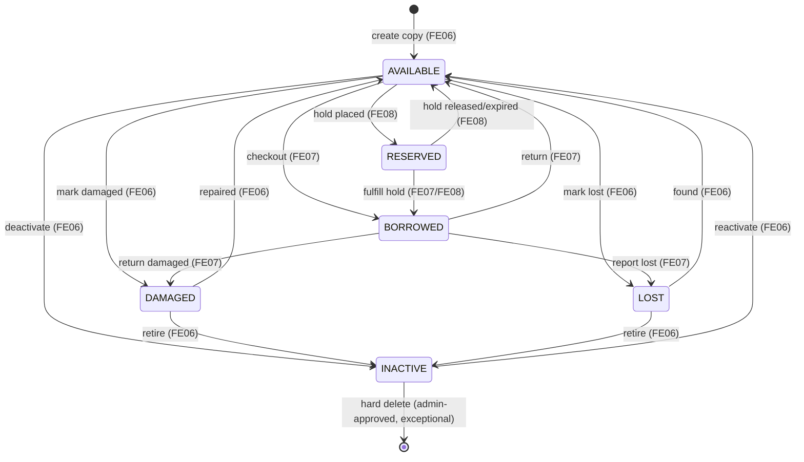

# SPEC.md - FE06 Inventory / Book Copy Management

# Version: 0.3.1

# Status: APPROVED

# Implementation Status: NOT IMPLEMENTED (deferred)

# Owner: Dat

# Last Updated: 2026-06-25

# Feature ID: FE06

# Feature folder: `.sdd/specs/feat-inventory-book-copy/`

> Source of truth for FE06 Inventory / Book Copy Management. This spec is approved for Phase 2 planning. It is intentionally detailed because FE06 controls physical copy availability used by borrowing and reservation.
>
> **Implementation status (2026-06-25): NOT IMPLEMENTED — deferred.** The spec is approved, but no
> backend implementation exists yet beyond the `BookCopies` data model. There are no FE06 routes,
> service, repository, validators, or tests, so the API endpoints in Section 11 and the transition
> guards/invariants in Section 10.3 are **not enforced in code**. Today, copy status is changed only
> indirectly by FE07 (borrow/return) and FE08 (reservation hold/expire). A dedicated FE06 management
> layer is deferred to a later iteration; the Traceability Matrix (Section 16) reflects this with all
> items NOT STARTED.

---

## 1. Feature Overview

### 1.1 Feature Name

Inventory / Book Copy Management

### 1.2 Business Context

The library catalog tells users which books exist, but circulation depends on physical copies. Each physical copy needs a unique barcode, a location, and a status such as available, borrowed, reserved, damaged, lost, or inactive.

Inventory / Book Copy Management keeps these physical copies accurate so that borrowing, reservation, public availability, fines, and reports all read the same source of truth.

### 1.3 Goal / Outcome

The system shall:

- Allow librarians/admins to view inventory.
- Allow librarians/admins to check a specific book copy status.
- Allow authorized staff to update copy availability/status safely.
- Allow authorized staff to manage physical book copies.
- Prevent invalid status transitions that would conflict with borrowing or reservation records.
- Keep copy status traceable and consistent for other features.

### 1.4 Scope Level

- [x] Full Spec - core business logic, high risk, must be correct from the beginning
- [ ] Standard Spec - normal feature with business rules and validations
- [ ] Light Spec - simple UI, documentation, or low-risk feature

---

## 2. Actors and Permissions

| Actor | Description | Permission / Responsibility |
| ----- | ----------- | --------------------------- |
| Librarian | Library staff | View inventory, check copy status, add/update/deactivate copies if allowed. |
| Admin | System administrator | Has librarian permissions and can manage all copies. |
| Member | Registered library user | May see derived availability through FE01/FE05; no direct copy management permission. |
| Guest | Unauthenticated visitor | May see derived public availability only; no direct copy management permission. |
| Borrowing Feature | Internal feature | Updates copy status during borrow/return workflows. |
| Reservation Feature | Internal feature | Uses reserved copy status and reservation availability. |

---

## 3. Preconditions

The feature can only start when:

- PRE-FE06-001: The related book exists in `Books`.
- PRE-FE06-002: Protected inventory actions are performed by authenticated Librarian/Admin.
- PRE-FE06-003: Barcode uniqueness rules are enforced.
- PRE-FE06-004: Allowed copy statuses and status transitions are approved.
- PRE-FE06-005: Active borrow/reservation records can be checked before manual status changes.

---

## 4. Main Flows

### MF-FE06-001: View Inventory

1. Librarian/admin opens inventory management.
2. The system retrieves books and related copy counts.
3. The system calculates counts by copy status.
4. The system displays inventory with filters such as book, status, location, and barcode.
5. The system supports pagination for large inventories.

### MF-FE06-002: Check Book Copy Status

1. Librarian/admin enters or scans a copy barcode, or selects a copy.
2. The system validates the copy identifier.
3. The system retrieves copy details, related book metadata, current status, and location.
4. The system shows whether the copy is available for borrowing according to approved status rules.
5. If borrowed/reserved, the system may show safe related workflow summary for staff if approved.

### MF-FE06-003: Update Book Copy Availability

1. Librarian/admin selects a copy.
2. Librarian/admin chooses a new status or availability state.
3. The system validates the requested transition.
4. The system checks active borrowing/reservation conflicts.
5. The system updates copy status if valid.
6. The system writes an audit log entry if approved.

### MF-FE06-004: Manage Book Copies

1. Librarian/admin opens copy management for a book.
2. Librarian/admin adds, updates, or deactivates a physical copy.
3. The system validates book existence, barcode uniqueness, location, and status.
4. The system saves the copy record.
5. The system updates derived inventory counts.
6. The system writes an audit log entry if approved.

---

## 5. Alternative Flows

### AF-FE06-001: Duplicate Barcode

1. Librarian/admin submits a copy with an existing barcode.
2. The system detects duplicate barcode.
3. The system rejects the create/update.

### AF-FE06-002: Book Does Not Exist

1. Librarian/admin attempts to create a copy for a missing book.
2. The system rejects the request.
3. No copy is created.

### AF-FE06-003: Manual Status Change Conflicts With Borrowing

1. Librarian/admin attempts to mark a borrowed copy as available.
2. The system detects active `BorrowDetails` record.
3. The system rejects the manual status change and directs staff to FE07 return flow.

### AF-FE06-004: Manual Status Change Conflicts With Reservation

1. Librarian/admin attempts to mark a reserved copy as available.
2. The system detects active `Reservations` record.
3. The system rejects the manual status change or requires reservation handling through FE08.

### AF-FE06-005: Copy Deactivation

1. Librarian/admin deactivates a copy that is not actively borrowed or reserved.
2. The system changes status to `INACTIVE` or equivalent.
3. The copy is excluded from availability counts.

---

## 6. Business Rules

Use these stable IDs for tasks and tests.

- BR-FE06-001: Only librarians/admins may manage book copies directly.
- BR-FE06-002: Each book copy must belong to an existing book.
- BR-FE06-003: Each physical copy must have a unique barcode.
- BR-FE06-004: Copy status must be one of the approved values.
- BR-FE06-005: A copy is borrow-available only when its status is `AVAILABLE`.
- BR-FE06-006: `BORROWED`, `RESERVED`, `DAMAGED`, `LOST`, and `INACTIVE` copies must not be counted as available.
- BR-FE06-007: Manual status changes must not override active borrowing records.
- BR-FE06-008: Manual status changes must not override active reservation records.
- BR-FE06-009: Adding a copy must update derived inventory counts.
- BR-FE06-010: Deactivating a copy must be status-based, not physical deletion, unless the team approves deletion.
- BR-FE06-011: Location must follow approved format when provided.
- BR-FE06-012: Copy management actions should be traceable for audit.
- BR-FE06-013: FE06 must not change book title, ISBN, author, category, publisher, or description.
- BR-FE06-014: FE06 must not approve borrow/return/reservation workflows; it only provides inventory state and protected copy update operations.

---

## 7. Functional Requirements

- FR-FE06-001: When a librarian/admin views inventory, the system shall return book copy counts grouped by status.
- FR-FE06-002: When a librarian/admin searches by barcode, the system shall return the matching copy status and book information.
- FR-FE06-003: If a copy barcode does not exist, then the system shall return not found.
- FR-FE06-004: When a librarian/admin creates a copy with valid data, the system shall create the copy.
- FR-FE06-005: If barcode is duplicate, then the system shall reject the copy create/update.
- FR-FE06-006: When a librarian/admin updates copy availability with a valid transition, the system shall update copy status.
- FR-FE06-007: If a manual status update conflicts with active borrow/reservation records, then the system shall reject the update.
- FR-FE06-008: When a copy is deactivated, the system shall exclude it from available copy counts.
- FR-FE06-009: When inventory data is returned, the system shall not expose unrelated user, fine, or protected audit data.
- FR-FE06-010: When copy management changes data, the system shall record traceable action information if audit is approved.

### 7.1 Unwanted Behavior Requirements (Error / Abnormal Conditions)

> EARS Unwanted-behavior requirements derived from approved Alternative Flows, Business Rules, and Edge Cases. No new logic is introduced; each requirement traces to an existing source.

- FR-FE06-011: IF a copy create/update request targets a book that does not exist in `Books`, the system shall reject the request and create no copy. (Source: AF-FE06-002, BR-FE06-002, EC-FE06-001)
- FR-FE06-012: IF a copy create/update request has an empty or missing barcode, the system shall reject the request. (Source: BR-FE06-003, EC-FE06-002)
- FR-FE06-013: IF a requested copy status is not one of the approved status values, the system shall reject the request. (Source: BR-FE06-004, EC-FE06-004)
- FR-FE06-014: IF a manual status change attempts to set `BORROWED` or `RESERVED` directly, the system shall reject the change and require the FE07/FE08 workflow. (Source: Q-FE06-002, BR-FE06-014)
- FR-FE06-015: IF staff attempts to manually mark a borrowed copy as available, the system shall reject the change and direct staff to the FE07 return flow. (Source: AF-FE06-003, BR-FE06-007, EC-FE06-006)
- FR-FE06-016: IF staff attempts to manually mark a reserved copy as available, the system shall reject the change or require reservation handling through FE08. (Source: AF-FE06-004, BR-FE06-008, EC-FE06-007)
- FR-FE06-017: IF a copy is already `INACTIVE` and a duplicate deactivation is requested, the system shall return the current state or reject the duplicate deactivation without altering data. (Source: AF-FE06-005, BR-FE06-010, EC-FE06-008)
- FR-FE06-018: IF a concurrent status update is detected (the underlying copy state changed since it was read), the system shall allow only one update to succeed and require the later update to re-read the current state before retrying. (Source: EC-FE06-009, NFR-FE06-TXN-002)
- FR-FE06-019: IF the copy update and its audit-log write cannot both complete, the system shall roll back the copy update and the audit-log entry together. (Source: EC-FE06-010, NFR-FE06-TXN-001)
- FR-FE06-020: IF an actor without the Librarian/Admin role attempts direct copy management, the system shall deny access. (Source: BR-FE06-001, AC-FE06-010, NFR-FE06-SEC-002)
- FR-FE06-021: WHERE a location value is provided that exceeds the approved length or violates the approved format, the system shall reject the value or normalize it according to the approved policy. (Source: BR-FE06-011, EC-FE06-005)

---

## 8. Acceptance Criteria

- AC-FE06-001: Given existing copies, when a librarian views inventory, then the system displays copy counts by status.
- AC-FE06-002: Given a valid barcode, when a librarian checks copy status, then the system returns the copy status and related book.
- AC-FE06-003: Given an invalid barcode, when copy status is checked, then the system returns not found.
- AC-FE06-004: Given valid copy data and unique barcode, when a librarian adds a copy, then the copy is created.
- AC-FE06-005: Given a duplicate barcode, when a librarian adds or updates a copy, then the system rejects the request.
- AC-FE06-006: Given a copy without active borrow/reservation conflict, when status is updated to an approved status, then the system saves the status.
- AC-FE06-007: Given a copy has active borrow detail, when staff tries to mark it available manually, then the system rejects the update.
- AC-FE06-008: Given a copy has active reservation, when staff tries to mark it available manually, then the system rejects or redirects to FE08 policy.
- AC-FE06-009: Given a copy is deactivated, when availability is calculated, then the copy is not counted as available.
- AC-FE06-010: Given a guest/member, when attempting direct copy management, then access is denied.

---

## 9. Edge Cases and Error Handling

| ID | Edge Case / Error | Expected System Behavior |
| -- | ----------------- | ------------------------ |
| EC-FE06-001 | Book ID does not exist | Reject copy creation/update. |
| EC-FE06-002 | Barcode is empty | Reject request. |
| EC-FE06-003 | Barcode already exists | Reject request. |
| EC-FE06-004 | Unsupported status value | Reject request. |
| EC-FE06-005 | Location too long or invalid | Reject or normalize according to approved policy. |
| EC-FE06-006 | Copy is borrowed and staff marks available manually | Reject; use FE07 return flow. |
| EC-FE06-007 | Copy is reserved and staff marks available manually | Reject or require FE08 reservation handling. |
| EC-FE06-008 | Copy already inactive | Return current state or reject duplicate deactivation. |
| EC-FE06-009 | Concurrent status update | Only one update succeeds; later update must re-read current state. |
| EC-FE06-010 | Database update partially fails | Roll back copy update and audit log. |

---

## 10. Data Requirements

### 10.1 Entities Involved

| Entity | Purpose in this feature |
| ------ | ----------------------- |
| Books | Parent book record for each physical copy. |
| BookCopies | Stores physical copy barcode, status, and location. |
| BorrowDetails | Used to detect active borrowed copies before manual status change. |
| Reservations | Used to detect active reserved copies before manual status change. |
| UserRoles | Checks librarian/admin permissions. |
| AuditLogs | Records copy management actions if approved. |

### 10.2 Data Fields

| Field | Type | Required | Validation / Notes |
| ----- | ---- | -------- | ------------------ |
| copyId | integer | Yes for updates | Must exist in `BookCopies`. |
| bookId | integer | Yes | Must reference `Books`. |
| barcode | string | Yes | Unique, non-empty, max length per schema. |
| status | string | Yes | Proposed values: `AVAILABLE`, `BORROWED`, `RESERVED`, `DAMAGED`, `LOST`, `INACTIVE`. |
| location | string | No/Recommended | Shelf/location, format to be approved. |
| condition | string | Optional | Add only if team extends schema beyond `Status`. |
| createdAt | datetime | Recommended | Add if audit/history is required. |
| updatedAt | datetime | Recommended | Add if update tracking is required. |

### 10.3 State Model & Transition Rules (Book Copy)

> Defines the formal lifecycle of `BookCopy.status`. State set is fixed by Q-FE06-001 and section 10.2: `AVAILABLE`, `BORROWED`, `RESERVED`, `DAMAGED`, `LOST`, `INACTIVE`. Some transitions are **not** performed manually via FE06; they are driven by FE07 (Borrowing) or FE08 (Reservation). This model is the single source of truth for allowed status changes referenced by FR-FE06-006/007/013/014/015/016/017 and BR-FE06-004..008.

#### a) State Diagram

#### b) States

| State | Ý nghĩa |
| ----- | ------- |
| `AVAILABLE` | Copy vật lý sẵn sàng, là trạng thái duy nhất cho phép mượn. Được tính vào số lượng available. |
| `BORROWED` | Copy đang được một thành viên mượn (đang có `BorrowDetails` active). Không tính available. |
| `RESERVED` | Copy đang bị giữ chỗ cho một reservation active. Không tính available. |
| `DAMAGED` | Copy hư hỏng, không cho mượn cho tới khi được sửa hoặc loại bỏ. Không tính available. |
| `LOST` | Copy bị mất/thất lạc. Không tính available. |
| `INACTIVE` | Copy bị vô hiệu hóa (soft-deactivation theo Q-FE06-003), loại khỏi vòng lưu thông và khỏi số đếm available. |

#### c) Valid Transitions

| From | To | Trigger | Điều kiện | Ai điều khiển | FR/BR liên quan |
| ---- | -- | ------- | --------- | ------------- | --------------- |
| (none) | `AVAILABLE` | Create copy | Book tồn tại + barcode unique | FE06 (manual) | FR-FE06-004, BR-FE06-002/003 |
| `AVAILABLE` | `BORROWED` | Checkout | Không cho set thủ công | FE07 | FR-FE06-014, BR-FE06-014, Q-FE06-002 |
| `AVAILABLE` | `RESERVED` | Hold placed | Không cho set thủ công | FE08 | FR-FE06-014, BR-FE06-014, Q-FE06-002 |
| `AVAILABLE` | `DAMAGED` | Mark damaged | Không có borrow/reservation active | FE06 (manual) | FR-FE06-006, BR-FE06-006 |
| `AVAILABLE` | `LOST` | Mark lost | Không có borrow/reservation active | FE06 (manual) | FR-FE06-006, BR-FE06-006 |
| `AVAILABLE` | `INACTIVE` | Deactivate | Không borrowed/reserved | FE06 (manual) | FR-FE06-008, BR-FE06-010, AF-FE06-005 |
| `BORROWED` | `AVAILABLE` | Return | Phải qua return flow, KHÔNG thủ công FE06 | FE07 | FR-FE06-015, BR-FE06-007, AF-FE06-003, EC-FE06-006 |
| `BORROWED` | `LOST` | Report lost (during loan) | Thuộc xử lý mượn/trả | FE07 | BR-FE06-007, BR-FE06-014 |
| `BORROWED` | `DAMAGED` | Return damaged | Thuộc xử lý trả | FE07 | BR-FE06-007, BR-FE06-014 |
| `RESERVED` | `BORROWED` | Fulfill hold | Reservation chuyển sang mượn | FE07/FE08 | BR-FE06-008, BR-FE06-014 |
| `RESERVED` | `AVAILABLE` | Hold released/expired | KHÔNG thủ công FE06; qua FE08 | FE08 | FR-FE06-016, BR-FE06-008, AF-FE06-004, EC-FE06-007 |
| `DAMAGED` | `AVAILABLE` | Repaired | Copy đã sửa xong | FE06 (manual) | FR-FE06-006 |
| `DAMAGED` | `INACTIVE` | Retire | Loại bỏ copy hỏng nặng | FE06 (manual) | BR-FE06-010 |
| `LOST` | `AVAILABLE` | Found | Tìm lại được copy | FE06 (manual) | FR-FE06-006 |
| `LOST` | `INACTIVE` | Retire | Loại bỏ copy đã mất | FE06 (manual) | BR-FE06-010 |
| `INACTIVE` | `AVAILABLE` | Reactivate | Đưa copy trở lại lưu thông | FE06 (manual) | FR-FE06-006, BR-FE06-010 |
| `INACTIVE` | (none) | Hard delete | Chỉ khi team/admin duyệt (ngoại lệ) | FE06 (admin) | BR-FE06-010, Q-FE06-003 |

#### d) Invalid Transitions (cấm tường minh)

| From | To | Lý do cấm | Nguồn |
| ---- | -- | --------- | ----- |
| any | `BORROWED` (manual) | Staff không được set `BORROWED` thủ công; chỉ FE07. | FR-FE06-014, BR-FE06-014, Q-FE06-002 |
| any | `RESERVED` (manual) | Staff không được set `RESERVED` thủ công; chỉ FE08. | FR-FE06-014, BR-FE06-014, Q-FE06-002 |
| `BORROWED` | `AVAILABLE` (manual FE06) | Không được tự đánh dấu available khi đang có `BorrowDetails` active; phải qua FE07 return. | FR-FE06-015, BR-FE06-007, AF-FE06-003, EC-FE06-006 |
| `RESERVED` | `AVAILABLE` (manual FE06) | Không được tự đánh dấu available khi đang có `Reservations` active; phải qua FE08. | FR-FE06-016, BR-FE06-008, AF-FE06-004, EC-FE06-007 |
| `BORROWED` | `INACTIVE` | Không được deactivate copy đang được mượn. | BR-FE06-007, AF-FE06-005 |
| `RESERVED` | `INACTIVE` | Không được deactivate copy đang bị giữ chỗ. | BR-FE06-008, AF-FE06-005 |
| `INACTIVE` | `BORROWED` / `RESERVED` | Copy `INACTIVE` không thể được mượn/giữ chỗ; phải reactivate về `AVAILABLE` trước. | BR-FE06-005/006, FR-FE06-008 |
| any | (unsupported value) | Trạng thái phải thuộc tập đã duyệt. | FR-FE06-013, BR-FE06-004, EC-FE06-004 |
| `INACTIVE` | `INACTIVE` (duplicate) | Deactivate trùng lặp không đổi dữ liệu; trả current state hoặc reject. | FR-FE06-017, EC-FE06-008 |

#### e) Invariants

- INV-FE06-ST-001: Một copy tại mọi thời điểm có đúng MỘT `status` thuộc tập `{AVAILABLE, BORROWED, RESERVED, DAMAGED, LOST, INACTIVE}`. (BR-FE06-004)
- INV-FE06-ST-002: Chỉ copy ở `AVAILABLE` mới borrow-available và được tính vào số lượng available. (BR-FE06-005/006, FR-FE06-008)
- INV-FE06-ST-003: Các chuyển vào/ra `BORROWED` và `RESERVED` chỉ do FE07/FE08 điều khiển, không do thao tác thủ công FE06. (FR-FE06-014, BR-FE06-014, Q-FE06-002)
- INV-FE06-ST-004: Một thao tác thủ công FE06 không bao giờ ghi đè `BorrowDetails`/`Reservations` đang active; transition bị chặn nếu có conflict. (FR-FE06-007, BR-FE06-007/008)
- INV-FE06-ST-005: Mọi đổi trạng thái phải ghi AuditLog (actor, copy, old status, new status, timestamp, kết quả); copy update và audit-log cùng commit hoặc cùng rollback. (BR-FE06-012, Q-FE06-006, FR-FE06-019, NFR-FE06-TXN-001, NFR-FE06-LOG-001)
- INV-FE06-ST-006: Cập nhật trạng thái dựa trên state đã đọc; nếu state nền đã đổi (concurrent), chỉ một update thành công, update sau phải re-read trước khi thử lại. (FR-FE06-018, EC-FE06-009, NFR-FE06-TXN-002)

---

## 11. API / Interface Contract

> Endpoint names are proposed for RESTful API. Final contract may stay in this SPEC.md unless the team reintroduces a dedicated shared API contract document.

| Method | Endpoint | Actor | Request | Response | Notes |
| ------ | -------- | ----- | ------- | -------- | ----- |
| GET | `/api/inventory` | Librarian/Admin | Query: `bookId?, status?, barcode?, location?, page?, limit?` | Paginated inventory/copy list | Protected endpoint. |
| GET | `/api/book-copies/{copyId}` | Librarian/Admin | - | Copy detail | Includes related book summary. |
| GET | `/api/book-copies/barcode/{barcode}` | Librarian/Admin | - | Copy detail/status | Used for barcode lookup. |
| POST | `/api/books/{bookId}/copies` | Librarian/Admin | `{ barcode, status?, location? }` | Created copy | Requires existing book. |
| PUT | `/api/book-copies/{copyId}` | Librarian/Admin | `{ barcode?, location?, status? }` | Updated copy | Must validate transitions. |
| PATCH | `/api/book-copies/{copyId}/status` | Librarian/Admin | `{ status, reason? }` | Updated status | Reject active borrow/reservation conflicts. |
| DELETE | `/api/book-copies/{copyId}` | Admin/Librarian | - | Deactivated copy | Prefer status-based deactivation. |

---

## 12. Non-functional Requirements

### 12.1 Security

- NFR-FE06-SEC-001: Inventory management endpoints must require authentication.
- NFR-FE06-SEC-002: Server must enforce Librarian/Admin role for direct copy management.
- NFR-FE06-SEC-003: Inputs such as barcode, location, status, and IDs must be validated server-side.
- NFR-FE06-SEC-004: Responses must not expose unrelated user, fine, or credential data.

### 12.2 Transaction Integrity

- NFR-FE06-TXN-001: Copy status update and audit log should succeed or roll back together.
- NFR-FE06-TXN-002: Status updates must re-check active borrow/reservation state in the same transaction when possible.

### 12.3 Performance

- NFR-FE06-PERF-001: Inventory list must support pagination.
- NFR-FE06-PERF-002: Barcode lookup should use the unique barcode index.
- NFR-FE06-PERF-003: Inventory count queries should filter by `BookId` and `Status` efficiently.

### 12.4 Logging and Audit

- NFR-FE06-LOG-001: Add, update, deactivate, and manual status changes should be traceable with actor, copy, old status, new status, timestamp, and result.

### 12.5 Usability

- NFR-FE06-UX-001: Inventory screens must clearly distinguish copy status from book metadata.
- NFR-FE06-UX-002: Invalid status transition errors must explain the blocking reason.

---

## 13. Out of Scope

This feature does not include:

- Book title/ISBN/author/category/publisher management.
- Borrow request approval or return processing.
- Reservation queue processing.
- Fine calculation for lost/damaged/overdue copies.
- Public browse UI.
- RFID/QR hardware integration beyond storing/scanning barcode text.

---

## 14. Dependencies

| Dependency | Type | Notes |
| ---------- | ---- | ----- |
| FE05 Book Management | Internal | Provides parent book metadata. |
| FE07 Borrowing Management | Internal | Owns borrow/return state changes that affect copies. |
| FE08 Reservation Management | Internal | Owns reservation state that may hold a copy. |
| FE09 Fine Management | Internal | May create fines from damaged/lost/overdue copy outcomes. |
| FE11 User & Role Management | Internal | Provides staff permissions. |
| SQL Server database | Technical | Current SQL script has `BookCopies`. |

---

## 15. Resolved Questions

| ID | Approved Decision | Source | Status |
| -- | ----------------- | ------ | ------ |
| Q-FE06-001 | Allowed copy statuses: AVAILABLE, BORROWED, RESERVED, DAMAGED, LOST, INACTIVE. | Review packet 2026-06-10 | APPROVED |
| Q-FE06-002 | Staff cannot manually set BORROWED or RESERVED; those come only from FE07/FE08 flows. | Review packet 2026-06-10 | APPROVED |
| Q-FE06-003 | DELETE /api/book-copies/{id} deactivates instead of physical delete. | Review packet 2026-06-10 | APPROVED |
| Q-FE06-004 | Location is optional in Phase 1. | Review packet 2026-06-10 | APPROVED |
| Q-FE06-005 | Copy condition is not separate from status in Phase 1. | Review packet 2026-06-10 | APPROVED |
| Q-FE06-006 | Create/update/deactivate/status-change actions write AuditLogs. | Review packet 2026-06-10 | APPROVED |

---

## 16. Traceability Matrix

| Requirement ID | Related Use Case | Related Test Case | Status |
| -------------- | ---------------- | ----------------- | ------ |
| BR-FE06-001 | UC25, UC26, UC27, UC28 | FT26, FT27, FT28, FT29 | Not Started |
| FR-FE06-001 | UC25 | FT26 | Not Started |
| FR-FE06-002 | UC26 | FT27 | Not Started |
| FR-FE06-004 | UC28 | FT29 | Not Started |
| FR-FE06-005 | UC28 | FT29 | Not Started |
| FR-FE06-006 | UC27 | FT28 | Not Started |
| FR-FE06-007 | UC27 | FT28 | Not Started |
| FR-FE06-008 | UC25, UC27 | FT26, FT28 | Not Started |
| FR-FE06-009 | UC25, UC26 | FT26, FT27 | Not Started |
| FR-FE06-010 | UC27, UC28 | FT28, FT29 | Not Started |
| FR-FE06-011 | UC28 | TBD | Not Started |
| FR-FE06-012 | UC28 | TBD | Not Started |
| FR-FE06-013 | UC27, UC28 | TBD | Not Started |
| FR-FE06-014 | UC27 | TBD | Not Started |
| FR-FE06-015 | UC27 | FT28 | Not Started |
| FR-FE06-016 | UC27 | FT28 | Not Started |
| FR-FE06-017 | UC27, UC28 | TBD | Not Started |
| FR-FE06-018 | UC27 | TBD | Not Started |
| FR-FE06-019 | UC27, UC28 | TBD | Not Started |
| FR-FE06-020 | UC25, UC26, UC27, UC28 | TBD | Not Started |
| FR-FE06-021 | UC28 | TBD | Not Started |
| BR-FE06-005 | UC25, UC26, UC27 | FT26, FT27, FT28 | Not Started |
| BR-FE06-007 | UC27 | FT28 | Not Started |
| BR-FE06-008 | UC27 | FT28 | Not Started |

---

## 17. Review Checklist

Phase 1 approval checklist (completed on 2026-06-10):

- [x] Copy status values are approved across FE06, FE07, and FE08.
- [x] Manual status transition rules are approved.
- [x] Barcode and location validation are approved.
- [x] Soft deactivation policy is approved.
- [x] Audit requirements for copy actions are confirmed.
- [x] API contract is approved in SPEC.md or copied to a dedicated shared API contract file if the team reintroduces one.
- [x] Every acceptance criterion can become a test.
