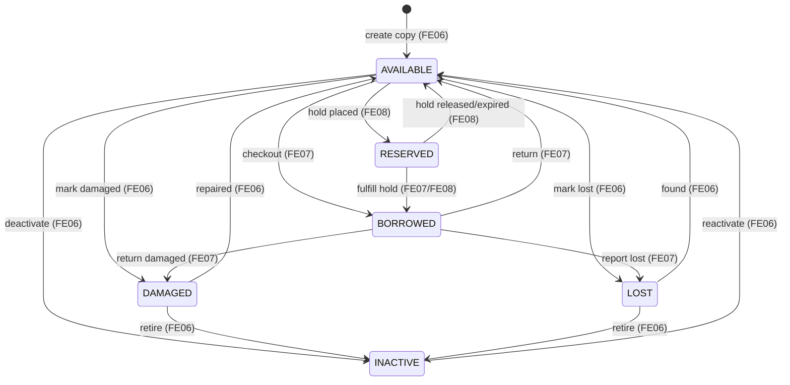

# SPEC.md - FE06 Quản lý tồn kho / bản sao sách

# Phiên bản: 0.4.4

# Trạng thái: YÊU CẦU ĐANG CHỜ PHÊ DUYỆT - ĐANG ĐƯỢC CON NGƯỜI REVIEW

# Tình trạng triển khai: COMPLETE - ĐÃ GHI NHẬN BẰNG CHỨNG HOÀN TẤT GIAI ĐOẠN 2

# Chủ sở hữu: Đạt

# Cập nhật lần cuối: 2026-07-21

# ID tính năng: FE06

# Thư mục tính năng: `.sdd/specs/feat-inventory-book-copy/`

> Trạng thái phân phối hiện tại (2026-07-20): `COMPLETE` cho phạm vi Giai đoạn 1 đã được phê duyệt.
> `TASKS.md` và `.sdd/reviews/phase2-full-exit-validation-2026-07-19.md`
> có thẩm quyền cho trạng thái thực hiện hiện tại. `Not Started` cũ hơn,
> `PARTIAL`, `READY FOR REVIEW` hoặc các nhãn đang chờ xem xét được giữ lại bên dưới là
> ảnh chụp nhanh planning/evidence lịch sử, không phải trạng thái phân phối hiện tại.

> Nguồn sự thật của FE06 Quản lý tồn kho / bản sao sách. Bản sửa đổi v0.4.2 đối chiếu các hợp đồng đồng thời, audit, sổ gốc, API và UI đã được phê duyệt ở v0.4.0 với hành vi đã triển khai.
>
> **Ảnh chụp nhanh đối chiếu lịch sử (2026-07-19; đã được thay thế):** FE06 đã sử dụng SQL
> `rowversion` / `If-Match`, xử lý xung đột và kiểm tra cùng giao dịch, bảo vệ ACTIVE của sổ gốc,
> lý do thay đổi trạng thái bắt buộc và UI tồn kho do máy chủ hỗ trợ. Tại thời điểm kiểm tra đó, việc xác nhận chủ sở hữu liên tính năng,
> H3 cuối cùng, merge và CI `main` sau merge vẫn còn mở; bằng chứng hoàn tất Giai đoạn 2 chuẩn
> ở trên ghi nhận việc các hạng mục này đã hoàn thành sau đó.

---

## 1. Tổng quan về tính năng

### 1.1 Tên tính năng

Quản lý tồn kho / bản sao sách

### 1.2 Bối cảnh kinh doanh

Danh mục thư viện cho người dùng biết những cuốn sách nào tồn tại nhưng việc lưu hành phụ thuộc vào bản sao in. Mỗi bản sao vật lý cần một mã vạch duy nhất, một vị trí và một trạng thái từ `AVAILABLE`, `BORROWED`, `RESERVED`, `DAMAGED`, `LOST` hoặc `INACTIVE`.

Quản lý hàng tồn kho / bản sao sách giữ cho các bản sao vật lý này chính xác để việc mượn, đặt trước, cung cấp công khai, tiền phạt và báo cáo đều có cùng một nguồn sự thật.

### 1.3 Mục tiêu / Kết quả

Hệ thống sẽ:

- Cho phép Thủ thư/Quản trị viên xem tồn kho.
- Cho phép Thủ thư/Quản trị viên kiểm tra trạng thái của một bản sao sách cụ thể.
- Cho phép nhân viên được phân quyền cập nhật tính khả dụng/trạng thái bản sao một cách an toàn.
- Cho phép nhân viên được ủy quyền quản lý các bản sao sách vật lý.
- Ngăn chặn các chuyển đổi trạng thái không hợp lệ có thể xung đột với hồ sơ mượn hoặc đặt trước.
- Giữ trạng thái bản sao có thể truy vết và nhất quán cho các tính năng khác.

### 1.4 Mức độ phạm vi

- [x] Đặc tả đầy đủ - logic nghiệp vụ cốt lõi, rủi ro cao, phải đúng ngay từ đầu
- [ ] Đặc tả tiêu chuẩn - tính năng thông thường, có quy tắc nghiệp vụ và bước xác thực
- [ ] Đặc tả rút gọn - UI đơn giản, tài liệu hoặc tính năng ít rủi ro

---

## 2. Tác nhân và quyền

| Tác nhân | Mô tả | Quyền/Trách nhiệm |
| ----- | ----------- | --------------------------- |
| Thủ thư | Nhân viên thư viện | Xem tồn kho, kiểm tra trạng thái bản sao, thêm/cập nhật/vô hiệu hóa bản sao khi được phép. |
| Quản trị viên | Quản trị viên hệ thống | Có quyền thủ thư và có thể quản lý tất cả các bản sao. |
| Thành viên | Người dùng thư viện đã đăng ký | Có thể xem tính khả dụng dẫn xuất qua FE01/FE05; không có quyền quản lý bản sao trực tiếp. |
| Khách | Khách truy cập chưa xác thực | Chỉ có thể xem tính khả dụng công khai dẫn xuất; không có quyền quản lý bản sao trực tiếp. |
| Tính năng mượn | Tính năng nội bộ | Cập nhật trạng thái bản sao trong quy trình mượn/trả. |
| Tính năng đặt chỗ | Tính năng nội bộ | Sử dụng trạng thái sao chép dành riêng và tính khả dụng đã đặt trước. |

---

## 3. Điều kiện tiên quyết

Tính năng này chỉ có thể bắt đầu khi:

- PRE-FE06-001: Sách liên quan tồn tại trong `Books`.
- PRE-FE06-002: Thao tác tồn kho được bảo vệ do Thủ thư/Quản trị viên đã xác thực thực hiện.
- PRE-FE06-003: Quy tắc về tính duy nhất của mã vạch được thực thi.
- PRE-FE06-004: Các trạng thái bản sao được phép và chuyển đổi trạng thái đã được phê duyệt.
- PRE-FE06-005: Các bản ghi mượn/đặt chỗ đang hoạt động phải sẵn sàng để khóa và kiểm tra lại bên trong giao dịch thay đổi thủ công.
- PRE-FE06-006: Việc tạo bản sao hoặc đặt thủ công sang `AVAILABLE` yêu cầu sổ gốc bị khóa có `Books.Status = ACTIVE`.

---

## 4. Luồng chính

### MF-FE06-001: Xem hàng tồn kho

1. Thủ thư/Quản trị viên mở trang quản lý tồn kho.
2. Hệ thống truy xuất các hàng bản sao phù hợp cùng dữ liệu tóm tắt sách liên quan.
3. Hệ thống trả về siêu dữ liệu phân trang.
4. Hệ thống hiển thị tồn kho với các bộ lọc `bookId`, `status`, `barcode` và `location` đã được phê duyệt.
5. Hệ thống hỗ trợ phân trang cho hàng tồn kho lớn.

### MF-FE06-002: Kiểm tra trạng thái bản sao sách

1. Thủ thư/Quản trị viên nhập hoặc quét mã vạch, hoặc chọn một bản sao.
2. Hệ thống xác nhận mã định danh bản sao.
3. Hệ thống truy xuất thông tin chi tiết về bản sao, siêu dữ liệu sách liên quan, trạng thái hiện tại và vị trí.
4. Hệ thống hiển thị liệu bản sao có sẵn để mượn hay không theo các quy định về trạng thái đã được phê duyệt.
5. Phản hồi không bao gồm danh tính người mượn/Thành viên, danh tính chủ sở hữu đặt chỗ, dữ liệu nhạy cảm hoặc dữ liệu audit được bảo vệ; nhân viên sử dụng FE07/FE08 cho các quy trình đó.

### MF-FE06-003: Cập nhật tính khả dụng của bản sao sách

1. Thủ thư/Quản trị viên chọn một bản sao.
2. Thủ thư/Quản trị viên chọn trạng thái mới do FE06 sở hữu và nhập lý do.
3. Hệ thống xác nhận trạng thái được yêu cầu.
4. Hệ thống khóa bản sao, so sánh `If-Match`, rồi kiểm tra lại xung đột mượn, đặt chỗ và sổ gốc bên trong giao dịch thay đổi.
5. Hệ thống cập nhật trạng thái bản sao nếu hợp lệ.
6. Thay đổi trạng thái và mục log audit cùng commit hoặc cùng rollback.

### MF-FE06-004: Quản lý bản sao sách

1. Thủ thư/Quản trị viên mở tính năng quản lý bản sao cho một cuốn sách.
2. Thủ thư/Quản trị viên thêm, cập nhật hoặc vô hiệu hóa một bản sao vật lý.
3. Hệ thống xác thực trạng thái sách đang hoạt động, tính duy nhất của mã vạch, vị trí và trạng thái ban đầu do máy chủ sở hữu.
4. Hệ thống lưu bản ghi bản sao.
5. Hệ thống cập nhật số lượng tồn kho dẫn xuất.
6. Thay đổi bản sao và mục log audit cùng commit hoặc cùng rollback.

---

## 5. Luồng thay thế

### AF-FE06-001: Mã vạch trùng lặp

1. Thủ thư/Quản trị viên gửi một bản sao có mã vạch đã tồn tại.
2. Hệ thống phát hiện mã vạch trùng lặp.
3. Hệ thống từ chối thao tác tạo/cập nhật.

### AF-FE06-002: Sách không tồn tại

1. Thủ thư/Quản trị viên cố tạo bản sao cho một cuốn sách không tồn tại.
2. Hệ thống từ chối yêu cầu.
3. Không có bản sao nào được tạo ra.

### AF-FE06-003: Xung đột thay đổi trạng thái thủ công với việc vay mượn

1. Thủ thư/Quản trị viên cố đánh dấu một bản sao đang được mượn là có sẵn.
2. Hệ thống phát hiện bản ghi `BorrowDetails` đang hoạt động.
3. Hệ thống từ chối thay đổi trạng thái thủ công và hướng nhân viên đến quy trình trả sách của FE07.

### AF-FE06-004: Xung đột thay đổi trạng thái thủ công với đặt trước

1. Thủ thư/Quản trị viên cố đánh dấu một bản sao đang được giữ chỗ là có sẵn.
2. Hệ thống phát hiện bản ghi `Reservations` đang hoạt động.
3. Hệ thống từ chối thay đổi trạng thái thủ công bằng `RESERVATION_STATE_CONFLICT` và hướng nhân viên đến quy trình đặt trước FE08.

### AF-FE06-005: Vô hiệu hóa bản sao

1. Thủ thư/Quản trị viên yêu cầu vô hiệu hóa một bản sao không có khoản mượn hoặc đặt chỗ đang hoạt động.
2. Hệ thống kiểm tra xung đột và thay đổi trạng thái thành `INACTIVE`.
3. Bản sao bị loại khỏi tập bản sao có sẵn; thay đổi trạng thái và bản ghi audit được commit nguyên tử.

---

## 6. Quy tắc nghiệp vụ

Sử dụng các ID ổn định này cho các nhiệm vụ và bài kiểm tra.

- BR-FE06-001: Chỉ Thủ thư/Quản trị viên mới có thể trực tiếp quản lý bản sao sách.
- BR-FE06-002: Mỗi bản sao của sách phải thuộc về một cuốn sách hiện có.
- BR-FE06-003: Mỗi bản sao vật lý phải có một mã vạch duy nhất.
- BR-FE06-004: Trạng thái bản sao phải là một trong các giá trị được phê duyệt.
- BR-FE06-005: Một bản sao chỉ có thể mượn được khi trạng thái của nó là `AVAILABLE`.
- BR-FE06-006: Các bản sao `BORROWED`, `RESERVED`, `DAMAGED`, `LOST` và `INACTIVE` không được tính là có sẵn.
- BR-FE06-007: Thay đổi trạng thái thủ công không được ghi đè các bản ghi mượn đang hoạt động.
- BR-FE06-008: Thay đổi trạng thái thủ công không được ghi đè các bản ghi đặt chỗ hiện hoạt.
- BR-FE06-009: Việc thêm bản sao phải được phản ánh trong tổng số danh sách tồn kho, phân trang và số lượng nhóm theo trạng thái do cơ sở dữ liệu cung cấp.
- BR-FE06-010: Việc tắt bản sao luôn dựa trên trạng thái (`Status = INACTIVE`); việc xóa vật lý bị cấm trong Giai đoạn 1.
- BR-FE06-011: Vị trí là tùy chọn; khi bị bỏ qua hoặc để trống sau khi cắt, nó được lưu dưới dạng `null` và các giá trị không trống sẽ được cắt bớt và giới hạn ở 100 ký tự.
- BR-FE06-012: Các thao tác tạo, cập nhật, vô hiệu hóa và thay đổi trạng thái thủ công phải ghi bản ghi audit có thể truy vết trong cùng giao dịch với thay đổi bản sao.
- BR-FE06-013: FE06 không được thay đổi tên sách, ISBN, tác giả, danh mục, nhà xuất bản hoặc mô tả.
- BR-FE06-014: FE06 không phê duyệt các quy trình mượn/trả/đặt chỗ; tính năng này chỉ cung cấp trạng thái tồn kho và các thao tác cập nhật bản sao được bảo vệ.
- BR-FE06-015: Việc tạo bản sao và mọi chuyển đổi sang `AVAILABLE` do FE06 sở hữu đều yêu cầu sổ gốc đã khóa có `Books.Status = ACTIVE` bên trong giao dịch thay đổi.
- BR-FE06-016: Mọi thay đổi bản sao hiện có đều yêu cầu `If-Match` khớp SQL `rowversion`; thao tác thay đổi trạng thái/vô hiệu hóa phải khóa và kiểm tra lại `BookCopies -> BorrowDetails -> Reservations` cùng trạng thái sổ gốc trước khi cập nhật.
- BR-FE06-017: Việc chuyển đổi trạng thái bản sao thủ công và vô hiệu hóa yêu cầu lý do đã cắt khoảng trắng, dài từ 1 đến 500 ký tự.
- BR-FE06-018: Phân trang tồn kho dùng `page` mặc định `1` và `limit` mặc định `20`; `page` phải là số nguyên lớn hơn hoặc bằng `1`, còn `limit` phải là số nguyên từ `1` đến `100`. Giá trị không hợp lệ được cung cấp phải bị từ chối thay vì chuẩn hóa.
- BR-FE06-019: Tồn kho chấp nhận `q` tùy chọn đã cắt khoảng trắng, dài tối đa 200 ký tự, và áp dụng nó cùng `bookId`, `status`, `barcode` và `location` trước khi phân trang. Tìm kiếm khớp các trường bản sao/sách an toàn: ID bản sao, ID sách, tiêu đề, ISBN, tác giả, danh mục, mã vạch và vị trí. Các hàng, tổng số và số lượng nhóm theo trạng thái đều dùng cùng bộ lọc hiệu lực.

---

## 7. Yêu cầu chức năng

- FR-FE06-001: Khi Thủ thư/Quản trị viên xem tồn kho, hệ thống sẽ trả về danh sách bản sao được phân trang cùng siêu dữ liệu phân trang cho các bộ lọc đã áp dụng.
- FR-FE06-002: Khi Thủ thư/Quản trị viên tìm kiếm bằng mã vạch, hệ thống sẽ trả về trạng thái bản sao và thông tin sách phù hợp.
- FR-FE06-003: Nếu mã vạch sao chép không tồn tại thì hệ thống sẽ trả về không tìm thấy.
- FR-FE06-004: Khi Thủ thư/Quản trị viên tạo bản sao với dữ liệu hợp lệ, hệ thống sẽ tạo bản sao.
- FR-FE06-005: Nếu mã vạch bị trùng lặp, hệ thống sẽ từ chối thao tác tạo/cập nhật bản sao.
- FR-FE06-006: Khi Thủ thư/Quản trị viên cập nhật tính khả dụng của bản sao bằng một chuyển đổi hợp lệ, hệ thống sẽ cập nhật trạng thái bản sao.
- FR-FE06-007: Nếu cập nhật trạng thái thủ công xung đột với bản ghi mượn/đặt chỗ đang hoạt động, hệ thống sẽ từ chối cập nhật.
- FR-FE06-008: Khi một bản sao bị vô hiệu hóa, hệ thống sẽ loại trừ nó khỏi số lượng bản sao có sẵn.
- FR-FE06-009: Khi dữ liệu kiểm kê được trả về, hệ thống sẽ không tiết lộ dữ liệu kiểm tra người dùng, tiền phạt hoặc dữ liệu được bảo vệ không liên quan.
- FR-FE06-010: Khi thao tác quản lý bản sao thay đổi dữ liệu, hệ thống sẽ commit thông tin hành động có thể truy vết một cách nguyên tử cùng thay đổi bản sao.

### 7.1 Yêu cầu về hành vi không mong muốn (Lỗi / Điều kiện bất thường)

> EARS Các yêu cầu về hành vi không mong muốn bắt nguồn từ các Luồng thay thế, Quy tắc kinh doanh và Trường hợp biên đã được phê duyệt. Không có logic mới nào được đưa ra; mỗi yêu cầu theo dõi một nguồn hiện có.

- FR-FE06-011: NẾU yêu cầu tạo/cập nhật bản sao nhắm tới cuốn sách không tồn tại trong `Books`, hệ thống sẽ từ chối yêu cầu và không tạo bản sao. (Nguồn: AF-FE06-002, BR-FE06-002, EC-FE06-001)
- FR-FE06-012: NẾU yêu cầu tạo/cập nhật bản sao có mã vạch trống hoặc bị thiếu, hệ thống sẽ từ chối yêu cầu. (Nguồn: BR-FE06-003, EC-FE06-002)
- FR-FE06-013: NẾU trạng thái sao chép được yêu cầu không phải là một trong các giá trị trạng thái được phê duyệt thì hệ thống sẽ từ chối yêu cầu. (Nguồn: BR-FE06-004, EC-FE06-004)
- FR-FE06-014: NẾU thay đổi trạng thái thủ công cố gắng thiết lập trực tiếp `BORROWED` hoặc `RESERVED`, hệ thống sẽ từ chối thay đổi và yêu cầu quy trình làm việc FE07/FE08. (Nguồn: Q-FE06-002, BR-FE06-014)
- FR-FE06-015: NẾU nhân viên cố gắng đánh dấu thủ công bản sao đã mượn là có sẵn, hệ thống sẽ từ chối thay đổi và hướng nhân viên đến quy trình trả lại FE07. (Nguồn: AF-FE06-003, BR-FE06-007, EC-FE06-006)
- FR-FE06-016: NẾU nhân viên cố gắng phát hành bản sao đã lưu theo cách thủ công, hệ thống sẽ trả về `409 RESERVATION_STATE_CONFLICT`, không thay đổi bản ghi và chuyển hướng nhân viên tới FE08. (Nguồn: AF-FE06-004, BR-FE06-008, EC-FE06-007)
- FR-FE06-017: NẾU một bản sao đã là `INACTIVE` và yêu cầu hủy kích hoạt trùng lặp, hệ thống sẽ trả về `200` với trạng thái sao chép hiện tại và không có chuyển đổi trạng thái thứ hai. (Nguồn: AF-FE06-005, BR-FE06-010, EC-FE06-008)
- FR-FE06-018: NẾU thao tác thay đổi bản sao hiện có bỏ qua `If-Match` hoặc cung cấp phiên bản cũ, hệ thống sẽ trả về `409 STALE_COPY_STATE` và không thay đổi trạng thái bản sao hoặc audit. (Nguồn: EC-FE06-009, NFR-FE06-TXN-002)
- FR-FE06-019: NẾU việc ghi audit thất bại, hệ thống sẽ rollback cả thay đổi bản sao lẫn audit. (Nguồn: EC-FE06-010, NFR-FE06-TXN-001)
- FR-FE06-020: NẾU tác nhân không có vai trò Thủ thư/Quản trị viên cố trực tiếp quản lý bản sao, hệ thống sẽ từ chối quyền truy cập. (Nguồn: BR-FE06-001, AC-FE06-010, NFR-FE06-SEC-002)
- FR-FE06-021: KHI giá trị vị trí trống sau khi cắt, hệ thống sẽ lưu trữ nó dưới dạng `null`; khi vượt quá 100 ký tự, hệ thống sẽ từ chối giá trị. (Nguồn: BR-FE06-011, EC-FE06-005)
- FR-FE06-022: NẾU sổ gốc đã khóa bị thiếu hoặc không hoạt động khi tạo bản sao hoặc chuyển đổi thủ công sang `AVAILABLE`, hệ thống sẽ từ chối thay đổi và giữ nguyên trạng thái bản sao/audit. (Nguồn: PRE-FE06-006, BR-FE06-015, EC-FE06-011)
- FR-FE06-023: NẾU thiếu lý do chuyển đổi trạng thái thủ công hoặc hủy kích hoạt, để trống hoặc dài hơn 500 ký tự, hệ thống sẽ từ chối lệnh. (Nguồn: BR-FE06-017, EC-FE06-012)
- FR-FE06-024: NẾU `page` hoặc `limit` của tồn kho vi phạm BR-FE06-018, hệ thống sẽ từ chối yêu cầu bằng lỗi xác thực và không chuẩn hóa giá trị hoặc truy vấn tồn kho. (Nguồn: BR-FE06-018, EC-FE06-013)
- FR-FE06-025: Khi nhân viên áp dụng tìm kiếm và bộ lọc tồn kho, FE06 sẽ thực thi hợp đồng truy vấn máy chủ chuẩn, chỉ trả về phép chiếu bản sao/sách an toàn đã được phê duyệt và phân biệt lỗi tải với kết quả trống hợp lệ trong UI.
- FR-FE06-026: NẾU một bản sao thuộc yêu cầu FE07 `PENDING + REQUESTED`, mọi chuyển đổi trạng thái thủ công hoặc thao tác vô hiệu hóa của FE06 sẽ trả về `409 PENDING_BORROW_REQUEST_CONFLICT`, giữ nguyên trạng thái bản sao/audit và hướng nhân viên phê duyệt hoặc từ chối yêu cầu mượn đang sở hữu bản sao.

---

## 8. Tiêu chí chấp nhận

- AC-FE06-001: Với các bản sao hiện có, khi Thủ thư xem tồn kho, hệ thống sẽ trả về trang bản sao được yêu cầu cùng siêu dữ liệu phân trang cho các bộ lọc đã áp dụng.
- AC-FE06-002: Với mã vạch hợp lệ, khi Thủ thư kiểm tra trạng thái bản sao, hệ thống sẽ trả về trạng thái bản sao và sách liên quan.
- AC-FE06-003: Với mã vạch không hợp lệ, khi kiểm tra trạng thái bản sao, hệ thống sẽ trả về phản hồi không tìm thấy.
- AC-FE06-004: Với dữ liệu bản sao hợp lệ và mã vạch duy nhất, khi thủ thư thêm một bản sao thì bản sao đó sẽ được tạo.
- AC-FE06-005: Với mã vạch trùng lặp, khi Thủ thư thêm hoặc cập nhật bản sao, hệ thống sẽ từ chối yêu cầu.
- AC-FE06-006: Với phiên bản khớp và không có xung đột mượn/đặt chỗ đã khóa, khi trạng thái được cập nhật qua chuyển đổi FE06 hợp lệ, hệ thống sẽ commit trạng thái và audit một cách nguyên tử.
- AC-FE06-007: Với bản sao có chi tiết mượn đang hoạt động, khi nhân viên cố đánh dấu thủ công là có sẵn, hệ thống sẽ từ chối cập nhật.
- AC-FE06-008: Với bản sao có đặt chỗ đang hoạt động, khi nhân viên cố đánh dấu thủ công là có sẵn, hệ thống sẽ trả về `409 RESERVATION_STATE_CONFLICT`, giữ nguyên trạng thái và hướng nhân viên đến FE08.
- AC-FE06-009: Với bản sao đã vô hiệu hóa, khi tính khả dụng, bản sao đó không được tính là có sẵn.
- AC-FE06-010: Với Khách/Thành viên, khi cố trực tiếp quản lý bản sao, hệ thống sẽ từ chối quyền truy cập.
- AC-FE06-011: Nếu sách gốc trở thành không hoạt động trước khi khóa thao tác thay đổi, khi nhân viên tạo bản sao hoặc chuyển bản sao sang `AVAILABLE`, FE06 sẽ trả về `409 INACTIVE_PARENT_BOOK` và giữ nguyên trạng thái bản sao/audit.
- AC-FE06-012: Với yêu cầu cập nhật/vô hiệu hóa/kích hoạt lại của nhân viên có `If-Match` bị thiếu hoặc cũ, FE06 sẽ trả về `409 STALE_COPY_STATE` và giữ nguyên trạng thái.
- AC-FE06-013: Với lý do thay đổi trạng thái/vô hiệu hóa thủ công bị thiếu, trống hoặc dài hơn 500 ký tự, FE06 sẽ từ chối lệnh; lý do đã cắt khoảng trắng, dài 1..500 ký tự sẽ được chấp nhận.
- AC-FE06-014: Khi nhân viên xem tồn kho mà không cung cấp giá trị phân trang, FE06 dùng `page = 1` và `limit = 20`; nếu cung cấp giá trị không phải số nguyên, `page < 1`, `limit < 1` hoặc `limit > 100`, FE06 sẽ từ chối yêu cầu mà không chuẩn hóa.
- AC-FE06-015: Khi Thủ thư/Quản trị viên kết hợp các bộ lọc tìm kiếm văn bản, mã vạch, vị trí và trạng thái, các hàng khớp, `totalItems`, `totalPages` và `countsByStatus` phải được dẫn xuất từ cùng một tập đã lọc trong cơ sở dữ liệu; lỗi backend phải hiển thị lỗi thay vì “không có dữ liệu”.
- AC-FE06-016: Với một bản sao `AVAILABLE` đã được yêu cầu mượn đang chờ của FE07 giữ quyền sở hữu, khi nhân viên cố đánh dấu thủ công là hư hỏng/thất lạc/không hoạt động hoặc thay đổi theo cách khác, FE06 sẽ trả về `409 PENDING_BORROW_REQUEST_CONFLICT` và không thay đổi trạng thái bản sao hoặc audit.

---

## 9. Trường hợp biên và xử lý lỗi

| ID | Trường hợp biên / Lỗi | Hành vi hệ thống mong đợi |
| -- | ----------------- | ------------------------ |
| EC-FE06-001 | ID sách không tồn tại | Từ chối thao tác tạo/cập nhật bản sao. |
| EC-FE06-002 | Mã vạch trống | Từ chối yêu cầu. |
| EC-FE06-003 | Mã vạch đã tồn tại | Từ chối yêu cầu. |
| EC-FE06-004 | Giá trị trạng thái không được hỗ trợ | Từ chối yêu cầu. |
| EC-FE06-005 | Vị trí trống/dài hơn 100 ký tự | Chuẩn hóa giá trị trống thành `null`; từ chối giá trị dài hơn 100 ký tự. |
| EC-FE06-006 | Bản sao đang được mượn và nhân viên đánh dấu thủ công là có sẵn | Từ chối; sử dụng luồng trả sách FE07. |
| EC-FE06-007 | Bản sao đang được giữ chỗ và nhân viên đánh dấu thủ công là có sẵn | Trả về `409 RESERVATION_STATE_CONFLICT`; sử dụng FE08. |
| EC-FE06-008 | Bản sao đã không hoạt động | Trả về `200` với trạng thái bản sao hiện tại; không thực hiện chuyển đổi trạng thái lần hai. |
| EC-FE06-009 | `If-Match` rowversion bị thiếu/cũ | Trả về `409 STALE_COPY_STATE`; không thay đổi trạng thái bản sao hoặc audit. |
| EC-FE06-010 | Ghi audit thất bại trong thao tác thay đổi | Rollback trạng thái bản sao và audit cùng nhau. |
| EC-FE06-011 | Sách gốc là `INACTIVE` trong bất kỳ thao tác tạo/chuyển đổi thủ công nào sang `AVAILABLE` do FE06 sở hữu | Trả về `409 INACTIVE_PARENT_BOOK`; không thay đổi trạng thái bản sao hoặc audit. |
| EC-FE06-012 | Lý do thay đổi trạng thái thủ công bị thiếu/trống/quá dài | Từ chối giá trị thiếu/trống hoặc dài hơn 500 ký tự. |
| EC-FE06-013 | `page`/`limit` tồn kho không hợp lệ | Từ chối bằng lỗi xác thực; không chuẩn hóa hoặc truy vấn tồn kho. |
| EC-FE06-014 | Bản sao có yêu cầu FE07 đang chờ giữ quyền sở hữu | Từ chối thay đổi trạng thái/vô hiệu hóa thủ công; giải quyết qua thao tác phê duyệt/từ chối của FE07. |

---

## 10. Yêu cầu về dữ liệu

### 10.1 Các thực thể có liên quan

| Thực thể | Mục đích trong tính năng này |
| ------ | ----------------------- |
| Books | Bản ghi sách gốc của mỗi bản sao vật lý. |
| BookCopies | Lưu trữ mã vạch, trạng thái và vị trí bản sao vật lý. |
| BorrowRequests / BorrowDetails | Được khóa và kiểm tra lại đối với các bản sao đang được mượn và quyền sở hữu `PENDING + REQUESTED` bên trong giao dịch thay đổi trạng thái/vô hiệu hóa thủ công. |
| Reservations | Được khóa và kiểm tra lại đối với các đặt chỗ đang hoạt động bên trong giao dịch thay đổi trạng thái/vô hiệu hóa thủ công. |
| UserRoles | Kiểm tra quyền Thủ thư/Quản trị viên. |
| AuditLogs | Ghi lại mọi chuyển đổi quản lý bản sao. |

### 10.2 Trường dữ liệu

| Trường | Kiểu | Bắt buộc | Xác thực / Ghi chú |
| ----- | ---- | -------- | ------------------ |
| copyId | số nguyên | Có để cập nhật | Phải tồn tại trong `BookCopies`. |
| bookId | số nguyên | Có | Phải tham khảo `Books`. |
| barcode | chuỗi | Có | Duy nhất, không trống, độ dài tối đa theo lược đồ. |
| status | chuỗi | Có | Các giá trị: `AVAILABLE`, `BORROWED`, `RESERVED`, `DAMAGED`, `LOST`, `INACTIVE`. |
| location | chuỗi | Không | Giá trị bị bỏ qua/trống được lưu dưới dạng `null`; giá trị không trống được cắt khoảng trắng và giới hạn ở 100 ký tự. |
| reason | chuỗi | Có khi thay đổi trạng thái/vô hiệu hóa | Đã cắt khoảng trắng, dài từ 1 đến 500 ký tự. |
| createdAt | ngày giờ | Có | Dấu thời gian tạo máy chủ. |
| updatedAt | ngày giờ | Có | Dấu thời gian cập nhật của máy chủ; thay đổi sau mỗi thao tác. |
| version | chuỗi không trong suốt | Có đối với thay đổi bản sao hiện có | Mã hóa Base64 của SQL `rowversion`; được cung cấp qua `If-Match`. |

### 10.3 Mô hình trạng thái & Quy tắc chuyển đổi (Bản sao sách)

> Xác định vòng đời chính thức của `BookCopy.status`. Tập trạng thái được Q-FE06-001 và Mục 10.2 cố định: `AVAILABLE`, `BORROWED`, `RESERVED`, `DAMAGED`, `LOST`, `INACTIVE`. Một số chuyển đổi **không** được thực hiện thủ công qua FE06 mà do FE07 (Mượn) hoặc FE08 (Đặt chỗ) điều khiển. FE06 thực thi quyền sở hữu trạng thái thủ công, kiểm tra lại xung đột/sổ gốc đã khóa, đối chiếu phiên bản, lý do bắt buộc và ghi audit nguyên tử.

#### a) Sơ đồ trạng thái

```mermaid
stateDiagram-v2
    [*] --> AVAILABLE: create copy (FE06)

    AVAILABLE --> BORROWED: checkout (FE07)
    AVAILABLE --> RESERVED: hold placed (FE08)
    AVAILABLE --> DAMAGED: mark damaged (FE06)
    AVAILABLE --> LOST: mark lost (FE06)
    AVAILABLE --> INACTIVE: deactivate (FE06)

    BORROWED --> AVAILABLE: return (FE07)
    BORROWED --> LOST: report lost (FE07)
    BORROWED --> DAMAGED: return damaged (FE07)

    RESERVED --> BORROWED: fulfill hold (FE07/FE08)
    RESERVED --> AVAILABLE: hold released/expired (FE08)

    DAMAGED --> AVAILABLE: repaired (FE06)
    DAMAGED --> INACTIVE: retire (FE06)

    LOST --> AVAILABLE: found (FE06)
    LOST --> INACTIVE: retire (FE06)

    INACTIVE --> AVAILABLE: reactivate (FE06)

```

#### b) Các trạng thái

| Trạng thái | Ý nghĩa |
| ----- | ------- |
| `AVAILABLE` | Bản sao vật lý ở trạng thái sẵn sàng theo `BookCopies.Status`; khả năng lưu thông thực tế còn yêu cầu sách gốc có `Books.Status = ACTIVE`. |
| `BORROWED` | Bản sao đang được một Thành viên mượn (có `BorrowDetails` đang hoạt động). Không được tính là có sẵn. |
| `RESERVED` | Bản sao đang được giữ cho một đặt chỗ hoạt động. Không được tính là có sẵn. |
| `DAMAGED` | Bản sao bị hư hỏng, không được cho mượn cho đến khi sửa chữa hoặc loại bỏ. Không được tính là có sẵn. |
| `LOST` | Bản sao bị mất/thất lạc. Không được tính là có sẵn. |
| `INACTIVE` | Bản sao đã vô hiệu hóa (vô hiệu hóa mềm theo Q-FE06-003), bị loại khỏi lưu thông và số lượng có sẵn. |

#### c) Chuyển đổi hợp lệ

| Từ | Đến | Kích hoạt | Điều kiện | Ai điều khiển | FR/BR liên quan |
| ---- | -- | ------- | --------- | ------------- | --------------- |
| (không có) | `AVAILABLE` | Tạo bản sao | Khóa cha là `ACTIVE` + mã vạch duy nhất | FE06 (thủ công) | FR-FE06-004, FR-FE06-022, BR-FE06-002/003/015 |
| `AVAILABLE` | `BORROWED` | Cho mượn | Không cho đặt thủ công | FE07 | FR-FE06-014, BR-FE06-014, Q-FE06-002 |
| `AVAILABLE` | `RESERVED` | Đặt giữ chỗ | Không cho đặt thủ công | FE08 | FR-FE06-014, BR-FE06-014, Q-FE06-002 |
| `AVAILABLE` | `DAMAGED` | Đánh dấu hư hỏng | Không có khoản mượn/đặt chỗ đang hoạt động | FE06 (thủ công) | FR-FE06-006, BR-FE06-006 |
| `AVAILABLE` | `LOST` | Đánh dấu thất lạc | Không có khoản mượn/đặt chỗ đang hoạt động | FE06 (thủ công) | FR-FE06-006, BR-FE06-006 |
| `AVAILABLE` | `INACTIVE` | Vô hiệu hóa | Không đang được mượn/giữ chỗ | FE06 (thủ công) | FR-FE06-008, BR-FE06-010, AF-FE06-005 |
| `BORROWED` | `AVAILABLE` | Trả sách | Phải qua luồng trả sách, KHÔNG thao tác thủ công bằng FE06 | FE07 | FR-FE06-015, BR-FE06-007, AF-FE06-003, EC-FE06-006 |
| `BORROWED` | `LOST` | Báo thất lạc (trong thời gian mượn) | Thuộc quyền xử lý/trả | FE07 | BR-FE06-007, BR-FE06-014 |
| `BORROWED` | `DAMAGED` | Trả sách bị hư hỏng | Thuộc quy trình xử lý trả sách | FE07 | BR-FE06-007, BR-FE06-014 |
| `RESERVED` | `BORROWED` | Hoàn tất giữ chỗ | Đặt chỗ chuyển thành khoản mượn | FE07/FE08 | BR-FE06-008, BR-FE06-014 |
| `RESERVED` | `AVAILABLE` | Hủy/hết hạn giữ chỗ | KHÔNG thao tác thủ công bằng FE06; phải qua FE08 | FE08 | FR-FE06-016, BR-FE06-008, AF-FE06-004, EC-FE06-007 |
| `DAMAGED` | `AVAILABLE` | Đã sửa chữa | Bản sao đã sửa xong; sách gốc đã khóa là `ACTIVE` | FE06 (thủ công) | FR-FE06-006, FR-FE06-022, BR-FE06-015 |
| `DAMAGED` | `INACTIVE` | Loại bỏ | Loại bỏ bản sao hư hỏng nặng | FE06 (thủ công) | BR-FE06-010 |
| `LOST` | `AVAILABLE` | Tìm thấy | Đã tìm lại bản sao; sách gốc đã khóa là `ACTIVE` | FE06 (thủ công) | FR-FE06-006, FR-FE06-022, BR-FE06-015 |
| `LOST` | `INACTIVE` | Loại bỏ | Loại bỏ bản sao bị mất | FE06 (thủ công) | BR-FE06-010 |
| `INACTIVE` | `AVAILABLE` | Kích hoạt lại | Đưa bản sao trở lại lưu thông; sách gốc đã khóa là `ACTIVE` | FE06 (thủ công) | FR-FE06-006, FR-FE06-022, BR-FE06-010/015 |

#### d) Chuyển đổi không hợp lệ (bị cấm rõ ràng)

| Từ | Đến | Lý do cấm | Nguồn |
| ---- | -- | --------- | ----- |
| bất kỳ | `BORROWED` (thủ công) | Nhân viên không được đặt thủ công thành `BORROWED`; chỉ FE07 được phép. | FR-FE06-014, BR-FE06-014, Q-FE06-002 |
| bất kỳ | `RESERVED` (thủ công) | Nhân viên không được đặt thủ công thành `RESERVED`; chỉ FE08 được phép. | FR-FE06-014, BR-FE06-014, Q-FE06-002 |
| `BORROWED` | `AVAILABLE` (thủ công FE06) | Không thể tự đánh dấu có sẵn khi `BorrowDetails` đang hoạt động; phải qua luồng trả sách FE07. | FR-FE06-015, BR-FE06-007, AF-FE06-003, EC-FE06-006 |
| `RESERVED` | `AVAILABLE` (thủ công FE06) | Không thể tự đánh dấu khi `Reservations` đang hoạt động; phải qua FE08. | FR-FE06-016, BR-FE06-008, AF-FE06-004, EC-FE06-007 |
| `BORROWED` | `INACTIVE` | Không thể vô hiệu hóa bản sao đang được mượn. | BR-FE06-007, AF-FE06-005 |
| `RESERVED` | `INACTIVE` | Không thể vô hiệu hóa bản sao đang được giữ chỗ. | BR-FE06-008, AF-FE06-005 |
| `INACTIVE` | `BORROWED` / `RESERVED` | Bản sao `INACTIVE` không thể được mượn/giữ chỗ; trước tiên phải kích hoạt lại về `AVAILABLE`. | BR-FE06-005/006, FR-FE06-008 |
| bất kỳ | (giá trị không được hỗ trợ) | Trạng thái phải thuộc tập đã phê duyệt. | FR-FE06-013, BR-FE06-004, EC-FE06-004 |
| `INACTIVE` | `INACTIVE` (trùng lặp) | Trả về trạng thái bản sao hiện tại; không thực hiện chuyển đổi lần hai. | FR-FE06-017, EC-FE06-008 |
| bất kỳ | xóa vật lý | Giai đoạn 1 yêu cầu vô hiệu hóa mềm; không chuyển đổi FE06 nào xóa hàng. | BR-FE06-010, Q-FE06-003 |

#### e) Bất biến

- INV-FE06-ST-001: Một bản sao tại mọi thời điểm có đúng MỘT `status` thuộc tập `{AVAILABLE, BORROWED, RESERVED, DAMAGED, LOST, INACTIVE}`. (BR-FE06-004)
- INV-FE06-ST-002: FE06 lưu trạng thái bản sao trong `BookCopies.Status`; tính khả dụng thực tế yêu cầu cả bản sao `AVAILABLE` và sách gốc có `Books.Status = ACTIVE`. (BR-FE06-005/006/015, FR-FE06-008/022)
- INV-FE06-ST-003: Các chuyển đổi vào/ra `BORROWED` và `RESERVED` chỉ do FE07/FE08 điều khiển, không do thao tác thủ công FE06. (FR-FE06-014, BR-FE06-014, Q-FE06-002)
- INV-FE06-ST-004: Một thao tác thủ công FE06 không bao giờ ghi đè `BorrowDetails`/`Reservations` đang hoạt động; quá trình chuyển đổi bị chặn nếu có xung đột. (FR-FE06-007, BR-FE06-007/008)
- INV-FE06-ST-005: Các thao tác tạo/cập nhật/thay đổi trạng thái/vô hiệu hóa và lần ghi AuditLog bắt buộc phải cùng commit hoặc cùng rollback trong một giao dịch. (BR-FE06-012, Q-FE06-006, FR-FE06-019, NFR-FE06-TXN-001, NFR-FE06-LOG-001)
- INV-FE06-ST-006: Các thay đổi bản sao hiện có yêu cầu `If-Match` khớp SQL `rowversion`. (BR-FE06-016, FR-FE06-018, EC-FE06-009, NFR-FE06-TXN-002)
- INV-FE06-ST-007: Việc tạo và chuyển đổi thủ công sang `AVAILABLE` phải khóa và kiểm tra lại sách gốc `ACTIVE` bên trong giao dịch thay đổi. (BR-FE06-015, FR-FE06-022)

---

## 11. API / Hợp đồng giao diện

> Hợp đồng API RESTful cho phần triển khai FE06 đã đối chiếu. Các endpoint thay đổi bản sao hiện có yêu cầu `If-Match`.

| Phương thức | Endpoint | Tác nhân | Yêu cầu | Phản hồi | Ghi chú |
| ------ | -------- | ----- | ------- | -------- | ----- |
| GET | `/api/inventory` | Librarian/Admin | Truy vấn: `q?, bookId?, status?, barcode?, location?, page = 1, limit = 20` | `{ items, page, limit, totalItems, totalPages, countsByStatus }` | Được bảo vệ; `q` dài tối đa 200 ký tự; cùng bộ lọc được áp dụng cho hàng/tổng/số lượng; giá trị phân trang không hợp lệ trả về lỗi xác thực trước khi truy vấn. |
| GET | `/api/book-copies/{copyId}` | Librarian/Admin | - | Chi tiết bản sao | Bao gồm tóm tắt sách liên quan. |
| GET | `/api/book-copies/barcode/{barcode}` | Librarian/Admin | - | Chi tiết/trạng thái bản sao | Dùng để tra cứu mã vạch. |
| POST | `/api/books/{bookId}/copies` | Librarian/Admin | `{ barcode, location? }` | Bản sao `AVAILABLE` đã tạo | Yêu cầu sách gốc đang hoạt động phải được khóa; máy khách không thể kiểm soát trạng thái ban đầu. |
| PUT | `/api/book-copies/{copyId}` | Librarian/Admin | Header `If-Match`; `{ barcode?, location? }` | Bản sao đã cập nhật + phiên bản mới | Chỉ thay đổi siêu dữ liệu; từ chối trạng thái và siêu dữ liệu sách FE05. |
| PATCH | `/api/book-copies/{copyId}/status` | Librarian/Admin | Header `If-Match`; `{ status, reason }` | Trạng thái đã cập nhật + phiên bản mới | Chỉ cho phép trạng thái thủ công của FE06; kiểm tra phiên bản/quy trình/sổ gốc đã khóa trước khi thay đổi. |
| DELETE | `/api/book-copies/{copyId}` | Admin/Librarian | Header `If-Match`; `{ reason }` | `{ changed, copy }` | Chỉ vô hiệu hóa mềm; yêu cầu vô hiệu hóa trùng lặp với phiên bản hiện tại trả về `changed = false`. |

---

## 12. Yêu cầu phi chức năng

### 12.1 Bảo mật

- NFR-FE06-SEC-001: Các endpoint quản lý tồn kho phải yêu cầu xác thực.
- NFR-FE06-SEC-002: Máy chủ phải thực thi vai trò Thủ thư/Quản trị viên đối với việc trực tiếp quản lý bản sao.
- NFR-FE06-SEC-003: `barcode`, `location`, `status` và tất cả đầu vào định danh phải được xác thực phía máy chủ.
- NFR-FE06-SEC-004: Phản hồi không được tiết lộ dữ liệu thông tin xác thực, dữ liệu phạt hoặc dữ liệu người dùng không liên quan.

### 12.2 Tính toàn vẹn của giao dịch

- NFR-FE06-TXN-001: Thay đổi bản sao và lần ghi log audit bắt buộc phải cùng commit hoặc cùng rollback trong một giao dịch cơ sở dữ liệu.
- NFR-FE06-TXN-002: Thao tác thay đổi bản sao hiện có phải khóa bản sao, so sánh `If-Match` với SQL `rowversion`, rồi kiểm tra lại xung đột mượn/đặt chỗ/sổ gốc trước khi cập nhật.

### 12.3 Hiệu năng

- NFR-FE06-PERF-001: Danh sách tồn kho phải sử dụng hợp đồng phân trang xác định trong BR-FE06-018.
- NFR-FE06-PERF-002: Tra cứu mã vạch phải sử dụng khóa hoặc chỉ mục mã vạch duy nhất.
- NFR-FE06-PERF-003: Bộ lọc danh sách tồn kho phải áp dụng `BookId`, `Status`, `location` và `barcode` trong truy vấn cơ sở dữ liệu trước khi phân trang.

### 12.4 Ghi log và audit

- NFR-FE06-LOG-001: Các thao tác thêm, cập nhật, vô hiệu hóa và thay đổi trạng thái thủ công phải được truy vết bằng siêu dữ liệu audit, bao gồm lý do chuyển đổi/vô hiệu hóa bắt buộc.

### 12.5 Khả năng sử dụng

- NFR-FE06-UX-001: Màn hình tồn kho phải phân biệt rõ trạng thái bản sao với siêu dữ liệu sách.
- NFR-FE06-UX-002: Lỗi chuyển đổi trạng thái không hợp lệ phải giải thích lý do chặn.

---

## 13. Ngoài phạm vi

Tính năng này không bao gồm:

- Quản lý tiêu đề/ISBN/tác giả/danh mục/nhà xuất bản của sách.
- Phê duyệt yêu cầu mượn hoặc xử lý trả sách.
- Xử lý hàng đợi đặt chỗ.
- Tính tiền phạt cho bản sao thất lạc/hư hỏng/quá hạn.
- UI duyệt công khai.
- Tích hợp phần cứng RFID/QR ngoài việc lưu/quét văn bản mã vạch.

---

## 14. Sự phụ thuộc

| Phụ thuộc | Loại | Ghi chú |
| ---------- | ---- | ----- |
| FE05 Quản lý sách | Nội bộ | Cung cấp siêu dữ liệu sách gốc. |
| FE07 Quản lý mượn | Nội bộ | Sở hữu các thay đổi trạng thái mượn/trả ảnh hưởng đến bản sao. |
| Quản lý đặt chỗ FE08 | Nội bộ | Sở hữu trạng thái đặt trước có thể chứa một bản sao. |
| FE09 Quản lý tiền phạt | Nội bộ | Có thể tạo tiền phạt từ kết quả bản sao hư hỏng/thất lạc/quá hạn. |
| FE11 Quản lý vai trò và người dùng | Nội bộ | Cung cấp quyền của nhân viên. |
| Cơ sở dữ liệu SQL Server | Kỹ thuật | `BookCopies.Version` cung cấp cơ chế đồng thời rowversion; khóa giao dịch bảo vệ việc kiểm tra bản sao/quy trình/sổ gốc. |

---

## 15. Câu hỏi đã được giải quyết

| ID | Quyết định phê duyệt | Nguồn | Trạng thái |
| -- | ----------------- | ------ | ------ |
| Q-FE06-001 | Các trạng thái bản sao được phép: AVAILABLE, BORROWED, RESERVED, DAMAGED, LOST, INACTIVE. | Gói review 2026-06-10 | APPROVED |
| Q-FE06-002 | Nhân viên không thể đặt thủ công BORROWED hoặc RESERVED; các trạng thái này chỉ đến từ luồng FE07/FE08. | Gói review 2026-06-10 | APPROVED |
| Q-FE06-003 | DELETE /api/book-copies/{id} vô hiệu hóa thay vì xóa vật lý. | Gói review 2026-06-10 | APPROVED |
| Q-FE06-004 | Vị trí là tùy chọn; trống trở thành `null`, các giá trị không trống sẽ bị cắt bớt và giới hạn ở 100 ký tự không có ký tự điều khiển. | Đã phê duyệt đối chiếu FE06 v0.4.0 | APPROVED |
| Q-FE06-005 | Điều kiện của bản sao không tách riêng khỏi trạng thái trong Giai đoạn 1. | Gói review 2026-06-10 | APPROVED |
| Q-FE06-006 | Các thao tác tạo/cập nhật/vô hiệu hóa/thay đổi trạng thái ghi AuditLogs. | Gói review 2026-06-10 | APPROVED |
| Q-FE06-007 | Các thay đổi bản sao hiện có sử dụng SQL `rowversion` qua `If-Match` bắt buộc; việc kiểm tra lại xung đột và sổ gốc diễn ra bên trong giao dịch. | Đã phê duyệt đối chiếu FE06 v0.4.0 | APPROVED |

---

## 16. Ma trận truy vết

Các ghi chú trạng thái trong ma trận này là ảnh chụp nhanh xác minh lịch sử được giữ lại để kiểm tra; việc hoàn thành hiện tại được điều chỉnh bởi bằng chứng kết thúc Giai đoạn 2 được tham chiếu ở đầu tài liệu này.

| ID yêu cầu | Trường hợp sử dụng liên quan | Trường hợp thử nghiệm liên quan | Trạng thái |
| -------------- | ---------------- | ----------------- | ------ |
| BR-FE06-001 | UC25, UC26, UC27, UC28 | Các trường hợp RBAC trong `inventoryRoutes.test.js` | Kiểm thử tự động đạt; chủ sở hữu/H3 đang chờ |
| BR-FE06-002 | UC25, UC26, UC28 | Các trường hợp tạo/thiếu sách gốc ở tuyến; kiểm tra lại thao tác tạo bằng SQL trực tiếp | Kiểm thử tự động đạt; chủ sở hữu/H3 đang chờ |
| BR-FE06-003 | UC26, UC28 | Các trường hợp mã vạch bắt buộc/duy nhất ở tuyến | Kiểm thử tự động đạt; chủ sở hữu/H3 đang chờ |
| BR-FE06-004 | UC25-UC28 | Xác thực trạng thái được phê duyệt/thủ công ở tuyến | Kiểm thử tự động đạt; chủ sở hữu/H3 đang chờ |
| BR-FE06-005 | UC25, UC26, UC27 | Các trường hợp danh sách/trạng thái ở tuyến; trạng thái máy chủ trên frontend | Kiểm thử tự động đạt; chủ sở hữu/H3 đang chờ |
| BR-FE06-006 | UC25, UC27 | Các trường hợp số lượng và trạng thái không khả dụng ở tuyến | Kiểm thử tự động đạt; chủ sở hữu/H3 đang chờ |
| BR-FE06-007 | UC27 | Xung đột mượn ở tuyến; tình huống tranh chấp sau kiểm tra trước bằng SQL trực tiếp | Kiểm thử tự động đạt; chủ sở hữu/H3 đang chờ |
| BR-FE06-008 | UC27 | Xung đột đặt chỗ ở tuyến; tình huống tranh chấp sau kiểm tra trước bằng SQL trực tiếp | Kiểm thử tự động đạt; chủ sở hữu/H3 đang chờ |
| BR-FE06-009 | UC25, UC28 | Các trường hợp danh sách/số lượng/tạo ở tuyến | Kiểm thử tự động đạt; chủ sở hữu/H3 đang chờ |
| BR-FE06-010 | UC27, UC28 | Vô hiệu hóa lặp an toàn ở tuyến; khẳng định SQL không xóa | Kiểm thử tự động đạt; chủ sở hữu/H3 đang chờ |
| BR-FE06-011 | UC28 | Các trường hợp vị trí dài 1..100 ký tự/ký tự điều khiển ở tuyến | Kiểm thử tự động đạt; chủ sở hữu/H3 đang chờ |
| BR-FE06-012 | UC27, UC28 | Các trường hợp audit/rollback ở tuyến; khẳng định giao dịch SQL | Kiểm thử tự động đạt; chủ sở hữu/H3 đang chờ |
| BR-FE06-013 | UC27, UC28 | Các trường hợp quyền sở hữu siêu dữ liệu ở tuyến | Kiểm thử tự động đạt; chủ sở hữu/H3 đang chờ |
| BR-FE06-014 | UC27, UC29-UC39 | Từ chối đặt thủ công `BORROWED`/`RESERVED` ở tuyến | Kiểm thử tự động đạt; chủ sở hữu/H3 đang chờ |
| BR-FE06-015 | UC27, UC28 | Các trường hợp tranh chấp sách gốc ACTIVE ở tuyến và SQL trực tiếp | Kiểm thử tự động đạt; chủ sở hữu/H3 đang chờ |
| BR-FE06-016 | UC27, UC28 | Các trường hợp phiên bản cũ ở tuyến; khóa/phiên bản/kiểm tra lại bằng SQL | Kiểm thử tự động đạt; chủ sở hữu/H3 đang chờ |
| BR-FE06-017 | UC27 | Các trường hợp lý do bắt buộc dài 1..500 ký tự ở tuyến | Kiểm thử tự động đạt; chủ sở hữu/H3 đang chờ |
| BR-FE06-018 | UC25 | Các trường hợp giá trị mặc định/giới hạn/không truy vấn của phân trang ở tuyến | Kiểm thử tự động đạt; chủ sở hữu/H3 đang chờ |
| FR-FE06-001 | UC25 | Trường hợp phong bì tồn kho chính xác ở tuyến | Kiểm thử tự động đạt; chủ sở hữu/H3 đang chờ |
| FR-FE06-002 | UC26 | Các trường hợp tra cứu bản sao/mã vạch ở tuyến | Kiểm thử tự động đạt; chủ sở hữu/H3 đang chờ |
| FR-FE06-003 | UC26 | Trường hợp mã vạch không xác định ở tuyến | Kiểm thử tự động đạt; chủ sở hữu/H3 đang chờ |
| FR-FE06-004 | UC28 | Các trường hợp tạo ở tuyến; tranh chấp sách gốc bằng SQL trực tiếp | Kiểm thử tự động đạt; chủ sở hữu/H3 đang chờ |
| FR-FE06-005 | UC28 | Các trường hợp mã vạch trùng lặp ở tuyến | Kiểm thử tự động đạt; chủ sở hữu/H3 đang chờ |
| FR-FE06-006 | UC27 | Trường hợp chuyển đổi trạng thái hợp lệ ở tuyến | Kiểm thử tự động đạt; chủ sở hữu/H3 đang chờ |
| FR-FE06-007 | UC27 | Kiểm tra lại quy trình đã khóa ở tuyến và bằng SQL trực tiếp | Kiểm thử tự động đạt; chủ sở hữu/H3 đang chờ |
| FR-FE06-008 | UC25, UC27 | Các trường hợp số lượng/vô hiệu hóa ở tuyến | Kiểm thử tự động đạt; chủ sở hữu/H3 đang chờ |
| FR-FE06-009 | UC25, UC26 | Các trường hợp phép chiếu an toàn ở tuyến | Kiểm thử tự động đạt; chủ sở hữu/H3 đang chờ |
| FR-FE06-010 | UC27, UC28 | Các trường hợp audit ở tuyến; khẳng định giao dịch SQL | Kiểm thử tự động đạt; chủ sở hữu/H3 đang chờ |
| FR-FE06-011 | UC28 | Các trường hợp sách gốc thiếu/không hoạt động ở tuyến | Kiểm thử tự động đạt; chủ sở hữu/H3 đang chờ |
| FR-FE06-012 | UC28 | Trường hợp mã vạch trống ở tuyến | Kiểm thử tự động đạt; chủ sở hữu/H3 đang chờ |
| FR-FE06-013 | UC27, UC28 | Các trường hợp trạng thái không được hỗ trợ ở tuyến | Kiểm thử tự động đạt; chủ sở hữu/H3 đang chờ |
| FR-FE06-014 | UC27 | Từ chối trạng thái quy trình thủ công ở tuyến | Kiểm thử tự động đạt; chủ sở hữu/H3 đang chờ |
| FR-FE06-015 | UC27 | Các trường hợp xung đột mượn ở tuyến và SQL trực tiếp | Kiểm thử tự động đạt; chủ sở hữu/H3 đang chờ |
| FR-FE06-016 | UC27 | Các trường hợp xung đột đặt chỗ ở tuyến và SQL trực tiếp | Kiểm thử tự động đạt; chủ sở hữu/H3 đang chờ |
| FR-FE06-017 | UC27, UC28 | Vô hiệu hóa trùng lặp, lặp an toàn ở tuyến | Kiểm thử tự động đạt; chủ sở hữu/H3 đang chờ |
| FR-FE06-018 | UC27, UC28 | `If-Match` thiếu/cũ ở tuyến; khẳng định phiên bản SQL | Kiểm thử tự động đạt; chủ sở hữu/H3 đang chờ |
| FR-FE06-019 | UC27, UC28 | Rollback khi audit thất bại ở tuyến; khẳng định giao dịch SQL | Kiểm thử tự động đạt; chủ sở hữu/H3 đang chờ |
| FR-FE06-020 | UC25-UC28 | Từ chối Khách/Thành viên ở tuyến | Kiểm thử tự động đạt; chủ sở hữu/H3 đang chờ |
| FR-FE06-021 | UC28 | Các trường hợp vị trí không hợp lệ ở tuyến | Kiểm thử tự động đạt; chủ sở hữu/H3 đang chờ |
| FR-FE06-022 | UC27, UC28 | Kiểm tra lại sách gốc đã khóa ở tuyến và SQL trực tiếp | Kiểm thử tự động đạt; chủ sở hữu/H3 đang chờ |
| FR-FE06-023 | UC27 | Các trường hợp cắt khoảng trắng/giới hạn của lý do ở tuyến | Kiểm thử tự động đạt; chủ sở hữu/H3 đang chờ |
| FR-FE06-024 | UC25 | Các trường hợp phân trang/không truy vấn không hợp lệ ở tuyến | Kiểm thử tự động đạt; chủ sở hữu/H3 đang chờ |
| FR-FE06-025 | UC25 | Tìm kiếm/bộ lọc/số lượng kết hợp ở tuyến và trạng thái lỗi tải trên frontend | Kiểm thử tự động đạt; chủ sở hữu/H3 đang chờ |
| AC-FE06-001 | UC25 | Phong bì trang/số lượng chính xác ở tuyến | Kiểm thử tự động đạt; chủ sở hữu/H3 đang chờ |
| AC-FE06-002 | UC26 | Tra cứu bản sao/mã vạch an toàn ở tuyến | Kiểm thử tự động đạt; chủ sở hữu/H3 đang chờ |
| AC-FE06-003 | UC26 | Mã vạch không xác định trả `404` ở tuyến | Kiểm thử tự động đạt; chủ sở hữu/H3 đang chờ |
| AC-FE06-004 | UC28 | Thao tác tạo do máy chủ kiểm soát ở tuyến | Kiểm thử tự động đạt; chủ sở hữu/H3 đang chờ |
| AC-FE06-005 | UC28 | Từ chối mã vạch trùng lặp ở tuyến | Kiểm thử tự động đạt; chủ sở hữu/H3 đang chờ |
| AC-FE06-006 | UC27 | Chuyển đổi/audit hợp lệ và nguyên tử ở tuyến | Kiểm thử tự động đạt; chủ sở hữu/H3 đang chờ |
| AC-FE06-007 | UC27 | Từ chối khoản mượn đang hoạt động ở tuyến/SQL trực tiếp | Kiểm thử tự động đạt; chủ sở hữu/H3 đang chờ |
| AC-FE06-008 | UC27 | Từ chối đặt chỗ ở tuyến/SQL trực tiếp | Kiểm thử tự động đạt; chủ sở hữu/H3 đang chờ |
| AC-FE06-009 | UC25, UC27 | Các trường hợp đếm bản sao không hoạt động/vô hiệu hóa ở tuyến | Kiểm thử tự động đạt; chủ sở hữu/H3 đang chờ |
| AC-FE06-010 | UC25-UC28 | Các trường hợp xác thực/RBAC ở tuyến | Kiểm thử tự động đạt; chủ sở hữu/H3 đang chờ |
| AC-FE06-011 | UC27, UC28 | Tranh chấp sách gốc ACTIVE ở tuyến/SQL trực tiếp | Kiểm thử tự động đạt; chủ sở hữu/H3 đang chờ |
| AC-FE06-012 | UC27, UC28 | Các trường hợp `If-Match` cũ/thiếu ở tuyến | Kiểm thử tự động đạt; chủ sở hữu/H3 đang chờ |
| AC-FE06-013 | UC27 | Các trường hợp lý do dài 1..500 ký tự ở tuyến | Kiểm thử tự động đạt; chủ sở hữu/H3 đang chờ |
| AC-FE06-014 | UC25 | Các trường hợp chính sách phân trang chính xác ở tuyến | Kiểm thử tự động đạt; chủ sở hữu/H3 đang chờ |
| AC-FE06-015 | UC25 | Bộ lọc/số lượng kết hợp ở tuyến và trạng thái lỗi tải trên frontend | Kiểm thử tự động đạt; chủ sở hữu/H3 đang chờ |
| FR-FE06-026; AC-FE06-016 | UC27, UC32 | Hồi quy thay đổi khi yêu cầu đang chờ giữ quyền sở hữu trong inventoryRoutes | Kiểm thử tự động đạt; đang chờ con người review |

---

## 17. Danh sách kiểm tra đánh giá

Danh sách kiểm tra phê duyệt giai đoạn 1 (hoàn thành trên 2026-06-10):

- [x] Các giá trị trạng thái bản sao được phê duyệt trên FE06, FE07 và FE08.
- [x] Quy tắc chuyển đổi trạng thái thủ công đã được phê duyệt.
- [x] Xác thực mã vạch và vị trí được phê duyệt.
- [x] Chính sách vô hiệu hóa mềm được phê duyệt.
- [x] Yêu cầu audit đối với thao tác bản sao được xác nhận.
- [x] Hợp đồng API được phê duyệt trong SPEC.md hoặc được sao chép vào tệp hợp đồng API được chia sẻ chuyên dụng nếu nhóm giới thiệu lại một tệp.
- [x] Mọi tiêu chí chấp nhận đều có thể trở thành một bài kiểm tra.

### 17.1 Cổng đối chiếu bản sửa đổi v0.4.2

- [x] SQL `rowversion`/`If-Match`, audit nguyên tử, vô hiệu hóa mềm và hợp đồng tồn kho do máy chủ hỗ trợ đều được triển khai.
- [x] Việc kiểm tra lại khoản mượn/đặt chỗ đã khóa và sách gốc ACTIVE có phạm vi bao phủ bằng tuyến, SQL tĩnh và hồi quy SQL trực tiếp.
- [x] Các chính sách xác định về phân trang, vị trí, lý do, phép chiếu an toàn và quyền sở hữu đã được triển khai.
- [ ] Chủ sở hữu Đạt và FE05/FE07/FE08 xác nhận quyền sở hữu UX/trạng thái và tính tương thích thứ tự khóa.
- [ ] H3 cuối cùng, merge và CI `main` sau merge được ghi nhận.
## Chỉnh sửa bảng điều khiển nhân viên 2026-07-22

- Các điều khiển từ khóa, mã vạch, vị trí và trạng thái tồn kho chỉ gửi các giá trị đã cắt khoảng trắng, đã áp dụng đến endpoint danh sách máy chủ chuẩn.
- Mỗi hàng tồn kho hiển thị thao tác “Quản lý bản sao” rõ ràng để mở quy trình tạo/cập nhật/thay đổi trạng thái/vô hiệu hóa hiện có; thao tác bấm vào hàng chỉ là tiện ích bổ sung.
- Các hàng tồn kho được sắp xếp xác định theo `CopyId ASC`; thao tác áp dụng, đặt lại, tải lại và phân trang gọi rõ ràng máy chủ với tập bộ lọc đang áp dụng.
