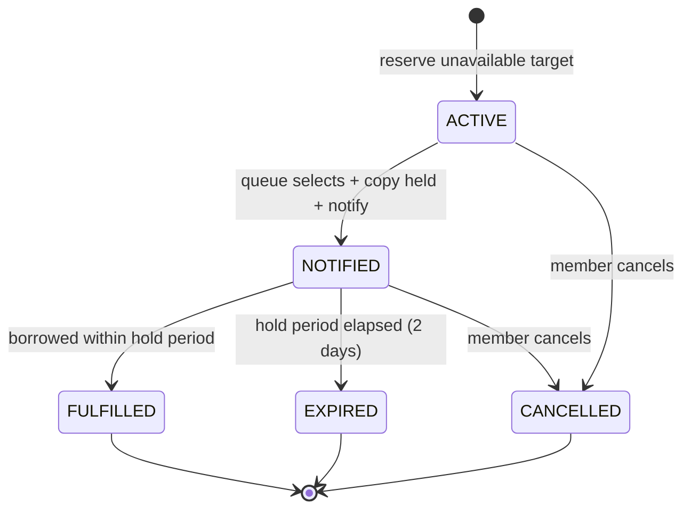

# SPEC.md - FE08 Reservation Management

# Version: 0.4.4

# Status: APPROVED - BASELINE 2026-07-17

# Owner: Nhat

# Last Updated: 2026-07-19

# Feature ID: FE08

# Feature folder: `.sdd/specs/feat-reservation-management/`

> Source of truth for FE08 Reservation Management. Revision v0.4.4 adds the approved member-safe reservation-candidate catalog while preserving the `CopyId` mutation contract and immutable terminal timestamp history. Candidate implementation is automated-validated; final human walkthrough/H3 review remains required before merge.

---

## 1. Feature Overview

### 1.1 Feature Name

Reservation Management

### 1.2 Business Context

When a book is not currently available, members need a fair way to reserve it and wait for availability. Librarians need to view and process the reservation queue so the next eligible member can be notified when a copy becomes available.

Reservation Management protects fairness and prevents confusion when many members want the same book.

### 1.3 Goal / Outcome

The system shall:

- Allow eligible members to reserve unavailable physical copies.
- Allow members to discover unavailable physical-copy targets through a protected, redacted server catalog.
- Allow members to cancel their own `ACTIVE` reservations or `NOTIFIED` holds.
- Allow librarians/admins to view and process reservation queues.
- Update reservation status when a copy becomes available or when reservation is cancelled.
- Trigger notification requirements for FE10 when a reserved book becomes available.

### 1.4 Scope Level

- [ ] Full Spec - core business logic, high risk, must be correct from the beginning
- [x] Standard Spec - normal feature with business rules and validations
- [ ] Light Spec - simple UI, documentation, or low-risk feature

---

## 2. Actors and Permissions

| Actor | Description | Permission / Responsibility |
| ----- | ----------- | --------------------------- |
| Member | Registered library user | View safe reservation candidates, create reservation, cancel own reservation, view own reservation status. |
| Librarian | Library staff | View reservation list, process reservation queue, release/expire reservations when allowed. |
| Admin | System administrator | Has librarian permissions and can view reservation reports/audit. |
| Guest | Unauthenticated visitor | No reservation permissions. |
| Notification Service | External service | Receives notification request when a reserved book becomes available. |

---

## 3. Preconditions

The feature can only start when:

- PRE-FE08-001: The actor is authenticated; Member may create/cancel/view own reservations, and Librarian/Admin may view/process reservations.
- PRE-FE08-002: A member creating a reservation has `Users.Status = ACTIVE`.
- PRE-FE08-003: A member creating a reservation has canonical `Members.Status = APPROVED`.
- PRE-FE08-004: The requested physical copy exists and its parent book exists.
- PRE-FE08-005: Phase 1 policy is fixed: target `CopyId`, maximum 3 open reservations (`ACTIVE` or `NOTIFIED`), a 2-calendar-day notified hold, manual queue processing, and queue order by `ReservedAt ASC, ReservationId ASC`.
- PRE-FE08-006: Candidate catalog access requires an authenticated `MEMBER`; FE01 public browse and FE06 staff inventory contracts are not widened.

---

## 4. Main Flows

### MF-FE08-001: Reserve Physical Copy

1. Member opens a book detail page and selects an unavailable physical copy.
2. Member chooses to reserve that copy.
3. The system validates member eligibility and reservation limit.
4. The system confirms the selected copy is unavailable and is not `AVAILABLE`, `DAMAGED`, `LOST`, or inactive.
5. The system creates a `Reservations` record with status `ACTIVE`.
6. The system records reservation time for queue order.
7. The system shows reservation status to the member.

### MF-FE08-002: Cancel Reservation

1. Member opens their reservation list.
2. Member selects an `ACTIVE` reservation or `NOTIFIED` hold.
3. Member confirms cancellation.
4. The system changes reservation status to `CANCELLED` and atomically releases the copy when the reservation was `NOTIFIED`.
5. The system writes an audit log.

### MF-FE08-003: View Reservation List

1. Librarian/admin opens the reservation management screen.
2. The system displays reservation records with member, book/copy, reserved time, and status.
3. The librarian/admin filters by the supported book, member, or status query fields.

### MF-FE08-004: Process Reservation Queue

1. A copy is `AVAILABLE` and a librarian/admin explicitly invokes queue processing for that `copyId`.
2. The system identifies the earliest eligible active reservation.
3. If an eligible reservation exists, the system atomically marks the reservation `NOTIFIED` and the copy `RESERVED`, sets `NotifiedAt` and `ExpiresAt`, and preserves queue order.
4. The system requests one FE10 notification with `type = RESERVATION_AVAILABLE`, `templateKey = RESERVATION_READY`, and `sourceFeature = FE08` after the hold commits.
5. If notification request fails, the hold remains committed and an audit failure is recorded; no automatic retry worker is part of Phase 1.

### MF-FE08-005: Trigger Book Available Notification

1. Reservation queue selects the next member.
2. The system sends one notification request to FE10.
3. The member receives book available information through the configured channel when FE10 is implemented.

### MF-FE08-006: Fulfill Held Reservation Through FE07

1. The notified member creates the normal FE07 borrow request for the held physical copy.
2. FE07 revalidates that the `NOTIFIED` reservation belongs to the same member and copy.
3. Librarian/admin approves the borrow request.
4. The approval transaction changes the matching reservation to `FULFILLED` while changing the copy to `BORROWED`.
5. Borrowing and reservation-fulfillment audit records commit with the transaction.

---

## 5. Alternative Flows

### AF-FE08-001: Book Copy Is Available

1. Member attempts to reserve an available copy.
2. The system rejects reservation and recommends borrowing instead.

### AF-FE08-002: Duplicate Active Reservation

1. Member already has an active reservation for the same physical copy.
2. Member attempts to reserve again.
3. The system rejects duplicate reservation.

### AF-FE08-003: Member Becomes Ineligible Before Queue Processing

1. Member has active reservation.
2. Queue is processed later.
3. The system detects member is no longer eligible.
4. The system skips the reservation for this processing run, leaves it `ACTIVE`, and does not change the copy. A later manual run may retry it after eligibility is restored.

### AF-FE08-004: Reservation Expires

1. Member is notified that a book is available.
2. Member does not borrow within the reservation hold period.
3. The system marks reservation `EXPIRED` and moves to the next reservation if any.

---

## 6. Business Rules

- BR-FE08-001: A guest cannot create or cancel reservations.
- BR-FE08-002: A member can create reservations only for their own account.
- BR-FE08-003: A member may cancel only their own reservation while its status is `ACTIVE` or `NOTIFIED`.
- BR-FE08-004: Librarian/admin can view and process all reservation records.
- BR-FE08-005: A member must have `Users.Status = ACTIVE` and canonical `Members.Status = APPROVED` to reserve.
- BR-FE08-006: A member cannot create a duplicate open reservation for the same reservation target; both `ACTIVE` and `NOTIFIED` reservations are open, while `FULFILLED`, `CANCELLED`, and `EXPIRED` are terminal.
- BR-FE08-007: A reservation can be created only for an unavailable physical copy; `AVAILABLE`, `DAMAGED`, `LOST`, and inactive copies are rejected.
- BR-FE08-008: The reservation queue must use stable order `ReservedAt ASC, ReservationId ASC`; Phase 1 defines no priority override.
- BR-FE08-009: Cancelled reservations must not be selected by queue processing.
- BR-FE08-010: Expired reservations must not be selected by queue processing.
- BR-FE08-011: When a reserved copy is held for a member, it must not be available for normal borrowing by another member.
- BR-FE08-012: Queue processing must request one FE10 notification with `type = RESERVATION_AVAILABLE`, `templateKey = RESERVATION_READY`, and `sourceFeature = FE08` after the hold commits.
- BR-FE08-013: Reservation status changes must be traceable.
- BR-FE08-014: An active reservation or held copy for another member must block FE07 loan renewal for the same copy/reservation target.
- BR-FE08-015: Only FE07 approval for the same member and copy may transition a `NOTIFIED` reservation to `FULFILLED`.
- BR-FE08-016: An `ACTIVE` queue entry grants reservation priority and blocks ordinary FE07 create/approve actions for that copy until queue processing or terminal resolution. If FE07 returns the copy first, `BookCopies.Status` may be `AVAILABLE` while the `ACTIVE` claim remains enforced; FE08 still owns later queue selection.
- BR-FE08-017: Once a reservation reaches `NOTIFIED`, its `NotifiedAt` and `ExpiresAt` are immutable historical facts and must remain populated after transition to `FULFILLED`, `EXPIRED`, or `CANCELLED`; they are null only for reservations that never reached `NOTIFIED`. `CancelledAt` is populated only for `CANCELLED`.

---

## 7. Functional Requirements

- FR-FE08-001: When an eligible member submits a reservation request, the system shall create an active reservation.
- FR-FE08-002: If the member already has an active reservation for the same target, the system shall reject the duplicate request.
- FR-FE08-003: If the reservation target is available for immediate borrowing, the system shall reject reservation and recommend borrowing.
- FR-FE08-004: When a member cancels their own `ACTIVE` or `NOTIFIED` reservation, the system shall mark it cancelled and release any held copy atomically.
- FR-FE08-005: When a librarian/admin views reservations, the system shall return reservation records with member and book/copy information.
- FR-FE08-006: When queue processing runs, the system shall select the earliest eligible active reservation.
- FR-FE08-007: When a reservation is selected from queue, the system shall make the reserved item unavailable to other members according to policy.
- FR-FE08-008: When a reserved book becomes available, the system shall trigger a notification request for FE10.
- FR-FE08-009: While a reservation is cancelled or expired, the system shall exclude it from active queue processing.
- FR-FE08-010: When a member views reservations, the system shall return only that member's records.

### 7.1 Unwanted Behaviour Requirements (Error / Abnormal Conditions)

> The following requirements use EARS Unwanted syntax (`IF ...` / `WHERE ...`). Each one promotes an existing error branch (Edge Case `EC-*`, Business Rule `BR-*`, Alternative Flow `AF-*`, or approved decision `Q-*`) into a testable functional requirement. No new logic is introduced.

- FR-FE08-011: IF the supplied member ID does not exist when a reservation is requested, the system shall reject the request and return a not-found error. (Source: EC-FE08-001)
- FR-FE08-012: IF the member account status is inactive when a reservation is requested, the system shall reject the reservation. (Source: EC-FE08-002, BR-FE08-005)
- FR-FE08-013: IF the member's membership status is not approved when a reservation is requested, the system shall reject the reservation. (Source: EC-FE08-003, BR-FE08-005, PRE-FE08-003)
- FR-FE08-014: IF the requested physical copy does not exist when a reservation is requested, the system shall reject the request and return a not-found error. (Source: EC-FE08-004, PRE-FE08-004)
- FR-FE08-015: IF a member already holds 3 open reservations in `ACTIVE` or `NOTIFIED` state when a new reservation is requested, the system shall reject the request and report that the reservation limit is reached. (Source: Q-FE08-003, MF-FE08-001 step 3)
- FR-FE08-016: IF a member attempts to cancel a reservation that they do not own, the system shall deny the action and return a forbidden error. (Source: EC-FE08-006, BR-FE08-003)
- FR-FE08-017: IF a member attempts to cancel a reservation outside `ACTIVE` or `NOTIFIED`, the system shall return `409 RESERVATION_NOT_ACTIVE` with the current reservation state and leave the reservation unchanged. (Source: EC-FE08-007, BR-FE08-003)
- FR-FE08-018: WHERE a member becomes ineligible before queue processing reaches their `ACTIVE` reservation, the system shall skip it for that run, leave it `ACTIVE`, and leave the copy unchanged. (Source: AF-FE08-003, Q-FE08-006)
- FR-FE08-019: IF a notified member does not borrow within the approved reservation hold period, the system shall mark the reservation `EXPIRED` and continue with the next eligible reservation in the queue. (Source: AF-FE08-004, Q-FE08-004)
- FR-FE08-020: WHERE queue processing finds no eligible active reservation, the system shall return no selection, leave the copy status unchanged, and change no reservation state. (Source: EC-FE08-008, Q-FE08-007)
- FR-FE08-021: IF the FE10 notification request fails after a hold commits, the system shall preserve `NOTIFIED`/`RESERVED` state and write a `RESERVATION_NOTIFY_FAILED` audit entry; Phase 1 does not run an automatic retry worker. (Source: EC-FE08-009, BR-FE08-012, Q-FE08-008)
- FR-FE08-022: IF concurrent queue processing attempts to select the same reservation, the system shall allow only one selection to succeed and require the later attempt to re-read the current state. (Source: EC-FE08-010, NFR-FE08-TXN-001)
- FR-FE08-023: WHERE a copy is held for a member from the reservation queue, the system shall prevent that held copy from being borrowed by any other member. (Source: BR-FE08-011, AC-FE08-008)
- FR-FE08-024: WHERE an active reservation or a copy held for another member exists for a reservation target, the system shall block FE07 loan renewal for that copy/reservation target. (Source: BR-FE08-014)
- FR-FE08-025: WHEN FE07 approves the notified reservation owner's borrow request, FE08 shall transition the matching reservation to `FULFILLED` in the same transaction.
- FR-FE08-026: IF FE07 evaluates a copy with an active queue or another member's notified hold, FE08 reservation state shall prevent the ordinary borrow operation without exposing the reservation owner.
- FR-FE08-027: IF a supplied reservation-list `page` or `limit` violates the Phase 1 pagination bounds, the system shall reject the request without normalizing the value or querying reservations.
- FR-FE08-028: WHEN a `NOTIFIED` reservation becomes `FULFILLED`, `EXPIRED`, or `CANCELLED`, the system shall preserve its original `NotifiedAt` and `ExpiresAt`; cancellation shall additionally set `CancelledAt`, while non-cancelled states keep `CancelledAt = null`.
- FR-FE08-029: WHEN an authenticated member requests `GET /api/reservations/candidates`, the system shall return a paginated, server-owned catalog of active-book physical copies whose status is `BORROWED` or `RESERVED`, expose only the approved safe projection, and leave `POST /api/reservations { copyId }` authoritative for all mutation-time checks.

---

## 8. Acceptance Criteria

- AC-FE08-001: Given an eligible member and unavailable reservation target, when the member reserves it, then the system creates an `ACTIVE` reservation.
- AC-FE08-002: Given a member with an active reservation for the same target, when the member reserves again, then the system rejects the duplicate reservation.
- AC-FE08-003: Given an available copy, when the member tries to reserve it, then the system rejects reservation and recommends borrowing.
- AC-FE08-004: Given an `ACTIVE` or `NOTIFIED` reservation owned by the member, when the member cancels it, then the system marks it `CANCELLED` and releases any held copy atomically.
- AC-FE08-005: Given a reservation owned by another member, when a member tries to cancel it, then the system denies the action.
- AC-FE08-006: Given multiple active reservations for the same target, when queue processing runs, then the earliest eligible reservation is selected first.
- AC-FE08-007: Given a cancelled reservation, when queue processing runs, then it is skipped.
- AC-FE08-008: Given a selected reservation, when a copy is held for the member, then other members cannot borrow that held copy.
- AC-FE08-009: Given a selected reservation, when the book becomes available, then a notification request is triggered for FE10.
- AC-FE08-010: Given a logged-in member, when viewing reservations, then only that member's reservations are returned.
- AC-FE08-011: Given a notified owner borrows the held copy through FE07 approval, then the reservation becomes `FULFILLED` and the copy becomes `BORROWED` atomically.
- AC-FE08-012: Given a copy has active reservation priority, when another member attempts to borrow it, then the operation is denied and queue order is preserved.
- AC-FE08-013: Given omitted reservation-list pagination, when staff lists reservations, then `page = 1` and `limit = 20` are used; invalid supplied values are rejected without normalization.
- AC-FE08-014: Given a reservation that reached `NOTIFIED`, when it later becomes `FULFILLED`, `EXPIRED`, or `CANCELLED`, then its original `NotifiedAt` and `ExpiresAt` remain unchanged; only `CANCELLED` has a non-null `CancelledAt`.
- AC-FE08-015: Given a member reads reservation candidates, each row contains only `copyId`, `bookId`, `title`, `authorName`, `copyStatus`, and `activeReservationCount`; barcode, location, owner, email, timestamps, and version are absent.
- AC-FE08-016: Given the member reservation page loads or searches candidates, it uses `GET /api/reservations/candidates` and does not import, render, or fall back to `DEMO_RESERVABLE`.

---

## 9. Edge Cases and Error Handling

| ID | Edge Case / Error | Expected System Behavior |
| -- | ----------------- | ------------------------ |
| EC-FE08-001 | Member ID does not exist | Return not found error. |
| EC-FE08-002 | Member account inactive | Reject reservation. |
| EC-FE08-003 | Membership not approved | Reject reservation. |
| EC-FE08-004 | Physical copy does not exist | Return not found error. |
| EC-FE08-005 | Duplicate active reservation | Reject duplicate request. |
| EC-FE08-006 | Member cancels someone else's reservation | Return forbidden error. |
| EC-FE08-007 | Reservation is outside `ACTIVE`/`NOTIFIED` | Return `409 RESERVATION_NOT_ACTIVE` with current state; leave reservation and copy state unchanged. |
| EC-FE08-008 | Queue has no eligible reservation | Return no selection; keep the copy and all reservations unchanged. |
| EC-FE08-009 | Notification service unavailable | Keep the committed hold and write `RESERVATION_NOTIFY_FAILED`; no automatic retry worker runs in Phase 1. |
| EC-FE08-010 | Concurrent queue processing | Only one queue selection may succeed; later action must re-read current state. |

---

## 10. Data Requirements

### 10.1 Entities Involved

| Entity | Purpose in this feature |
| ------ | ----------------------- |
| Users | Identifies member, librarian, admin. |
| UserRoles | Checks permissions. |
| Members | Canonical FE04 membership eligibility projection; only `APPROVED` passes. |
| Books | Provides book information for reservation display. |
| BookCopies | Provides copy status and reservation target in current SQL. |
| Reservations | Stores reservation records and queue order. |
| BorrowDetails | May release a copy into reservation queue after return. |
| AuditLogs | Records reservation state changes. |

### 10.2 Data Fields

| Field | Type | Required | Validation / Notes |
| ----- | ---- | -------- | ------------------ |
| reservationId | integer | Yes for updates | Must exist in `Reservations`. |
| userId | integer | Yes | Must reference a member user. |
| copyId | integer | Yes | Must reference the physical `BookCopies.CopyId`; Phase 1 reservation targets are copy-level. |
| reservedAt | datetime | Yes | Used for queue order. |
| status | string | Yes | Values: `ACTIVE`, `NOTIFIED`, `FULFILLED`, `CANCELLED`, `EXPIRED`. |
| queuePosition | integer | No | Derived for display from `ReservedAt ASC, ReservationId ASC` among `ACTIVE` rows; it is not persisted and is recomputed after every list or queue operation. |
| expiresAt | datetime | Required after first notification | Server sets `NotifiedAt + 2 calendar days`; immutable thereafter and preserved in `NOTIFIED`, `FULFILLED`, `EXPIRED`, or notified-then-cancelled rows. Null only when the reservation never reached `NOTIFIED`. |
| notifiedAt | datetime | Required after first notification | Server timestamp for the original hold notification; immutable and preserved after every terminal transition. Null only when the reservation never reached `NOTIFIED`. |
| cancelledAt | datetime | Required only when `status = CANCELLED` | Server timestamp; never client-supplied. Must be null for every non-cancelled state. |
| candidate projection | read-only DTO | Yes for candidate reads | Exactly `copyId`, `bookId`, `title`, nullable `authorName`, `copyStatus` (`BORROWED` or `RESERVED`), and `activeReservationCount`; no staff-only or reservation-owner fields. |

### 10.3 State Model & Transition Rules (Reservation)

This subsection formalizes the lifecycle of `Reservations.status`. The state set is taken directly from the declared enum in section 10.2 Data Fields: `ACTIVE`, `NOTIFIED`, `FULFILLED`, `CANCELLED`, `EXPIRED`. No new states are introduced.

#### 10.3.1 State Diagram

#### 10.3.2 State Descriptions

| State | Meaning | In queue? | Terminal? |
| ----- | ------- | --------- | --------- |
| `ACTIVE` | Reservation created and waiting in the queue; not yet selected. Holds `ReservedAt` order for fairness. | Yes | No |
| `NOTIFIED` | Reservation reached the front of the queue; a copy is held for the member and the FE10 book-available notification has been triggered. Awaiting borrow within the hold period. | No (already selected) | No |
| `FULFILLED` | The member borrowed the held copy within the hold period; the reservation is satisfied. | No | Yes |
| `CANCELLED` | The member voluntarily cancelled the reservation before it was fulfilled. | No | Yes |
| `EXPIRED` | The hold period elapsed without borrowing; the queue moves to the next member. | No | Yes |

#### 10.3.3 Valid Transitions

| From | To | Trigger | Condition / Guard | Related FR / BR / AF / Q |
| ---- | -- | ------- | ----------------- | ------------------------ |
| `[*]` | `ACTIVE` | Eligible member reserves an unavailable target | Member eligible, within reservation limit, target not available for immediate borrow, no duplicate active reservation | FR-FE08-001, FR-FE08-002, FR-FE08-003, FR-FE08-015, BR-FE08-005, BR-FE08-006, MF-FE08-001 |
| `ACTIVE` | `NOTIFIED` | Queue processing selects earliest eligible reservation, holds a copy, and triggers notification | Reservation is the earliest eligible active record; copy held atomically; FE10 notification request triggered | FR-FE08-006, FR-FE08-007, FR-FE08-008, FR-FE08-023, BR-FE08-008, BR-FE08-011, BR-FE08-012, MF-FE08-004, MF-FE08-005 |
| `ACTIVE` | `CANCELLED` | Owning member cancels their active reservation | Reservation owned by member and currently `ACTIVE` | FR-FE08-004, BR-FE08-003, MF-FE08-002, AC-FE08-004 |
| `NOTIFIED` | `FULFILLED` | FE07 approves the notified owner's borrow request | Borrow request member/copy match; copy/audits commit atomically; original `NotifiedAt`/`ExpiresAt` remain unchanged | FR-FE08-025, FR-FE08-028, BR-FE08-015, BR-FE08-017, MF-FE08-006, AC-FE08-011 |
| `NOTIFIED` | `EXPIRED` | Hold period elapses without borrowing | Queue advances; original `NotifiedAt`/`ExpiresAt` remain unchanged | FR-FE08-019, FR-FE08-028, BR-FE08-017, AF-FE08-004, Q-FE08-004 |
| `NOTIFIED` | `CANCELLED` | Owning member cancels while a copy is held | Held copy released; original notification timestamps remain; `CancelledAt` is set atomically | FR-FE08-004, FR-FE08-028, BR-FE08-003, BR-FE08-017, MF-FE08-002 |

#### 10.3.4 Invalid Transitions (Explicitly Forbidden)

| Forbidden Transition | Reason | Related FR / BR / EC |
| -------------------- | ------ | -------------------- |
| `CANCELLED` -> any state | Terminal; a cancelled reservation cannot be reactivated, re-cancelled, notified, or fulfilled. | FR-FE08-017, EC-FE08-007 |
| `EXPIRED` -> any state | Terminal; an expired reservation cannot be revived or re-entered into the queue. | FR-FE08-009, FR-FE08-017, BR-FE08-010, EC-FE08-007 |
| `FULFILLED` -> any state | Terminal; once fulfilled the lifecycle ends. | NFR-FE08-LOG-001 |
| `ACTIVE` -> `FULFILLED` | A reservation cannot be fulfilled before reaching `NOTIFIED` (i.e. before a copy is held and the member is notified). | FR-FE08-007, FR-FE08-008 |
| `NOTIFIED` -> `ACTIVE` | A selected/held reservation cannot return to the waiting queue. | BR-FE08-008, NFR-FE08-TXN-001 |
| `NOTIFIED` -> `NOTIFIED` (re-select) by concurrent processing | Concurrent queue processing must not select the same reservation twice; only one selection succeeds. | FR-FE08-022, EC-FE08-010, NFR-FE08-TXN-001 |
| Queue selection of any `CANCELLED` / `EXPIRED` reservation | Cancelled and expired reservations are excluded from queue processing. | FR-FE08-009, BR-FE08-009, BR-FE08-010, AC-FE08-007 |

#### 10.3.5 Invariants

- INV-FE08-001: A reservation always holds exactly one `status` value from the declared enum `{ACTIVE, NOTIFIED, FULFILLED, CANCELLED, EXPIRED}`.
- INV-FE08-002: `CANCELLED`, `EXPIRED`, and `FULFILLED` are terminal; no transition may leave them.
- INV-FE08-003: Only `ACTIVE` reservations participate in queue selection; `CANCELLED` and `EXPIRED` are never selected. (FR-FE08-009, BR-FE08-009, BR-FE08-010)
- INV-FE08-004: At any moment, for a given reservation target (CopyId in Phase 1, Q-FE08-001), at most one reservation may be in the held/selected `NOTIFIED` state. (NFR-FE08-TXN-001, BR-FE08-011)
- INV-FE08-005: While an `ACTIVE` queue exists, ordinary FE07 create/approve actions are blocked even when the copy has returned to stored `AVAILABLE`; while a copy is held for a `NOTIFIED` reservation, only that reservation owner may borrow it and FE07 renewal remains blocked for other members. (FR-FE08-023, FR-FE08-024, FR-FE08-026, BR-FE08-011, BR-FE08-014, BR-FE08-016)
- INV-FE08-006: Every status change (create, notify, fulfill, cancel, expire) must be written to the audit log and be traceable. (BR-FE08-013, NFR-FE08-LOG-001)
- INV-FE08-007: Queue processing, cancellation, expiration, and FE07 fulfillment must update copy and reservation state atomically using the shared `BookCopies -> Reservations` lock order. (NFR-FE08-TXN-001, NFR-FE08-TXN-002, BR-FE08-015)
- INV-FE08-008: An ineligible `ACTIVE` reservation skipped during a queue run remains `ACTIVE` and is not selected in that run; a later manual run may retry it.
- INV-FE08-009: A reservation that has ever reached `NOTIFIED` keeps non-null, immutable `NotifiedAt` and `ExpiresAt` in every later terminal state; those fields are null only for reservations never notified.
- INV-FE08-010: `CancelledAt` is non-null if and only if `status = CANCELLED`; fulfillment and expiration never set it.

---

## 11. API / Interface Contract

> RESTful API contract approved for FE08 Phase 1. It remains in this SPEC.md unless the team reintroduces a dedicated shared API contract document.

| Method | Endpoint | Actor | Request | Response | Notes |
| ------ | -------- | ----- | ------- | -------- | ----- |
| POST | `/api/reservations` | Member | `{ copyId: number }` | Created reservation | Phase 1 target is the physical copy identified by `CopyId`. |
| GET | `/api/reservations/candidates` | Member | Query: `q?, page?, limit?` | `{ data, pagination }` safe candidate catalog | Defaults `page = 1`, `limit = 20`; `q` max 200; active books and `BORROWED`/`RESERVED` copies only; order by title, book ID, copy ID. |
| GET | `/api/reservations/me` | Member | Query: `status?, page?, limit?` | Own reservations | Defaults `page = 1`, `limit = 20`; invalid page/limit returns validation error. |
| PATCH | `/api/reservations/{reservationId}/cancel` | Member | Optional reason | Cancelled reservation | Own reservation only. |
| GET | `/api/reservations` | Librarian/Admin | Query: `bookId?, memberId?, status?, page?, limit?` | Reservation list | Defaults `page = 1`, `limit = 20`; order is `ReservedAt ASC, ReservationId ASC`. |
| POST | `/api/reservations/process-queue` | Librarian/Admin | `{ copyId: number }` | Selected reservation or none | Manual Phase 1 action; `copyId` is required and `bookId` is not accepted. |
| POST | `/api/reservations/expire-holds` | Librarian/Admin | No body | Expired count, expired reservations, and promoted reservations | Manually expires overdue `NOTIFIED` holds and advances eligible queues; traces FR-FE08-019. |

---

## 12. Non-functional Requirements

### 12.1 Security

- NFR-FE08-SEC-001: Reservation endpoints must require authentication except public browsing dependencies.
- NFR-FE08-SEC-002: Members must not view or cancel other members' reservations.
- NFR-FE08-SEC-003: Librarian/admin permissions must be checked on the server.
- NFR-FE08-SEC-004: Candidate reads must require the `MEMBER` role and must not expose barcode, location, reservation owner, member email, reservation timestamps, rowversion, or other staff-only metadata.

### 12.2 Transaction Integrity

- NFR-FE08-TXN-001: Queue processing and FE07 fulfillment must update reservation/copy state atomically.
- NFR-FE08-TXN-002: Cancellation and expiration must not leave the reserved copy in an inconsistent state.

### 12.3 Performance

- NFR-FE08-PERF-001: Reservation lists use `page = 1` and `limit = 20` by default; supplied `page` is an integer >= 1 and `limit` is an integer 1..100.
- NFR-FE08-PERF-002: Queue lookup filters by exact `CopyId` and `Status = ACTIVE` and orders by `ReservedAt ASC, ReservationId ASC`.
- NFR-FE08-PERF-003: Candidate reads default to `page = 1` and `limit = 20`, reject `page < 1` or `limit` outside `1..100`, accept trimmed `q` up to 200 characters, and order by `Book.Title ASC, Book.BookId ASC, BookCopy.CopyId ASC`.

### 12.4 Logging and Audit

- NFR-FE08-LOG-001: Create, cancel, queue process, notify, fulfilled, and expired actions must be traceable.

### 12.5 Usability

- NFR-FE08-UX-001: The system must show the canonical reservation status and hold-expiry state to members.
- NFR-FE08-UX-002: Librarians must see queue order using `ReservedAt ASC, ReservationId ASC` and the derived `queuePosition`.

---

## 13. Out of Scope

This feature does not include:

- FE07 borrowing screens, return workflow, and general approval ownership; this spec defines only the reservation state contract consumed by FE07 approval.
- FE10 notification delivery implementation.
- Fine calculation.
- Online payment.
- Study seat reservation.
- Automatic queue processing, automatic notification retry workers, and complex priority rules.

---

## 14. Dependencies

| Dependency | Type | Notes |
| ---------- | ---- | ----- |
| FE02 Authentication | Internal | Identifies actor. |
| FE01 Public Browse | Internal | Keeps public book reads copy-ID-free; the protected FE08 endpoint owns member candidate selection. |
| FE04 Membership Management | Internal | Confirms member eligibility. |
| FE06 Inventory / Book Copy Management | Internal | Provides copy availability/status. |
| FE07 Borrowing Management | Internal | FE07 create/approval and normal-return transaction enforce FE08 queue priority. FE07 approval for the same notified member and copy is the only fulfillment trigger; return releases a normal copy to stored `AVAILABLE` while preserving an `ACTIVE` queue claim for manual FE08 processing. |
| FE10 Notification Management | Internal | Sends book available notification. |
| FE11 User & Role Management | Internal | Provides roles and permissions. |
| SQL Server database | Technical | Current SQL script has `Reservations(UserId, CopyId, ReservedAt, Status)`. |

---

## 15. Resolved Questions

| ID | Approved Decision | Source | Status |
| -- | ----------------- | ------ | ------ |
| Q-FE08-001 | Reservation targets physical copy CopyId in Phase 1. | Review packet 2026-06-10 | APPROVED |
| Q-FE08-002 | Member cannot reserve when a copy is currently available. | Review packet 2026-06-10 | APPROVED |
| Q-FE08-003 | Maximum 3 open reservations per member, counting `ACTIVE` and `NOTIFIED` and excluding terminal states. | Review packet 2026-06-10; queue normalization 2026-07-17 | APPROVED |
| Q-FE08-004 | Notified reservation stays valid for 2 calendar days. | Review packet 2026-06-10 | APPROVED |
| Q-FE08-005 | Queue processing is manual by librarian in Phase 1; automatic trigger is future work. | Review packet 2026-06-10 | APPROVED |
| Q-FE08-006 | An ineligible active reservation is skipped for the current run, remains `ACTIVE`, and is retried only by a later manual run. | Nhat normalization review 2026-07-17 | APPROVED |
| Q-FE08-007 | When no eligible reservation exists, queue processing returns no selection and leaves copy/reservation state unchanged. | Nhat normalization review 2026-07-17 | APPROVED |
| Q-FE08-008 | A failed FE10 request leaves the committed hold in place and writes a failure audit; no automatic retry worker is included in Phase 1. | Nhat normalization review 2026-07-17 | APPROVED |
| Q-FE08-009 | `NotifiedAt` and `ExpiresAt` are immutable history after notification and survive fulfillment, expiration, or cancellation; `CancelledAt` belongs only to cancelled rows. | Spec normalization 2026-07-17 | APPROVED |
| Q-FE08-010 | `queuePosition` is derived from the canonical queue order and only `POST /api/reservations/process-queue` is the Phase 1 queue-processing endpoint. | Queue contract normalization 2026-07-17 | APPROVED |
| Q-FE08-011 | Candidate selection uses protected member-only `GET /api/reservations/candidates`; it returns one safe row per eligible physical copy, keeps FE01/FE06 boundaries unchanged, and preserves `POST /api/reservations { copyId }`. | User approval `APPROVE TD-028 - Option A` and `APPROVE FE08 DESIGN`, 2026-07-19 | APPROVED |

---

## 16. Traceability Matrix

| Requirement ID | Related Use Case | Related Test Case | Status |
| -------------- | ---------------- | ----------------- | ------ |
| BR-FE08-001 | UC36, UC37 | FE08-T03, FE08-T15 | Ready for review |
| BR-FE08-002 | UC36 | FE08-T03, FE08-T04, FE08-T11 | Ready for review |
| BR-FE08-003 | UC37 | FE08-T06, FE08-T12 | Ready for review |
| BR-FE08-004 | UC38, UC39 | FE08-T03, FE08-T07, FE08-T13 | Ready for review |
| BR-FE08-005 | UC36 | FT37 | Ready for review |
| BR-FE08-006 | UC36 | FT37 | Ready for review |
| BR-FE08-007 | UC36 | FE08-T04, FE08-T11 | Ready for review |
| BR-FE08-008 | UC39 | FT40 | Ready for review |
| BR-FE08-009 | UC37, UC39 | FT38, FT40 | Ready for review |
| BR-FE08-010 | UC39 | FT40 | Ready for review |
| BR-FE08-011 | UC39 | FE08-T07, FE08-T13 | Ready for review |
| BR-FE08-012 | UC40 | FE08-T08, FE08-T14 | Ready for review |
| BR-FE08-013 | UC36, UC37, UC39, UC40 | FE08-T09, FE08-T12, FE08-T14 | Ready for review |
| BR-FE08-014 | UC39 | FT40 | Ready for review |
| BR-FE08-015 | UC39, UC40 | FE08-T025 and FE07-T030 fulfillment tests | Automated pass; human review pending |
| BR-FE08-016 | UC36, UC39 | FE08-T025 and FE07-T029 priority tests | Automated pass; human review pending |
| BR-FE08-017 | UC37, UC39, UC40 | FE08-T030 timestamp-retention model/transition tests | Automated pass; human review pending |
| FR-FE08-001 | UC36 | FT37 | Ready for review |
| FR-FE08-002 | UC36 | FT37 | Ready for review |
| FR-FE08-003 | UC36 | FT37 | Ready for review |
| FR-FE08-004 | UC37 | FT38 | Ready for review |
| FR-FE08-005 | UC38 | FT39 | Ready for review |
| FR-FE08-006 | UC39 | FT40 | Ready for review |
| FR-FE08-007 | UC39 | FT40 | Ready for review |
| FR-FE08-008 | UC40 | FT41 | Ready for review |
| FR-FE08-009 | UC39 | FT40 | Ready for review |
| FR-FE08-010 | UC38 | FT39 | Ready for review |
| FR-FE08-011 | UC36 (EC-FE08-001) | FE08-T11 member-not-found rejection test | Ready for review |
| FR-FE08-012 | UC36 (EC-FE08-002) | rejects reservation when member account is inactive (FR-FE08-012) | Ready for review |
| FR-FE08-013 | UC36 (EC-FE08-003) | FT37; rejects reservation when membership is not approved (FR-FE08-013) | Ready for review |
| FR-FE08-014 | UC36 (EC-FE08-004) | rejects reservation when the copy does not exist (FR-FE08-014) | Ready for review |
| FR-FE08-015 | UC36 (Q-FE08-003) | route and SQL tests count `ACTIVE` plus `NOTIFIED` toward the three-open limit | Automated pass; human review pending |
| FR-FE08-016 | UC37 (EC-FE08-006) | member cancels only their own `ACTIVE` or `NOTIFIED` reservation (FR-FE08-016) | Ready for review |
| FR-FE08-017 | UC37 (EC-FE08-007) | member cancellation rejects states outside `ACTIVE` or `NOTIFIED` (FR-FE08-017) | Ready for review |
| FR-FE08-018 | UC39 (AF-FE08-003) | process-queue skips an ineligible member instead of holding (FR-FE08-018) | Ready for review |
| FR-FE08-019 | UC39 (AF-FE08-004) | expire-holds expires an overdue hold and promotes the next reservation (FR-FE08-019) | Ready for review |
| FR-FE08-020 | UC39 (EC-FE08-008) | process-queue selects nothing when no eligible reservation exists (FR-FE08-020) | Ready for review |
| FR-FE08-021 | UC40 (EC-FE08-009) | FT41 | Ready for review |
| FR-FE08-022 | UC39 (EC-FE08-010) | concurrent queue processing holds the copy only once (FR-FE08-022) | Ready for review |
| FR-FE08-023 | UC39 (BR-FE08-011) | FT40 | Ready for review |
| FR-FE08-024 | UC39 (BR-FE08-014) | FT40 | Ready for review |
| FR-FE08-025 | UC39, UC40 | FE08-T025 and FE07-T030 approval fulfillment tests | Automated pass; human review pending |
| FR-FE08-026 | UC36, UC39 | FE08-T025 and FE07-T029 safe priority-conflict tests | Automated pass; human review pending |
| FR-FE08-027 | UC38 | FE08-T028 pagination validation test | Automated pass; human review pending |
| FR-FE08-028 | UC37, UC39, UC40 | FE08-T030 terminal timestamp-retention tests | Automated pass; human review pending |
| FR-FE08-029 | UC36 | FE08-T035 route/service/redaction tests; FE08-T036 SQL projection tests; FE08-T038 browser acceptance | Automated pass; design approved; human walkthrough/H3 pending |
| AC-FE08-001 | UC36 | FT37 eligible unavailable-copy reservation test | Ready for review |
| AC-FE08-002 | UC36 | FT37 duplicate open reservation rejection, including `NOTIFIED` | Automated pass; human review pending |
| AC-FE08-003 | UC36 | FT37 available-copy reservation rejection test | Ready for review |
| AC-FE08-004 | UC37 | FT38 owner cancellation and atomic hold-release test | Ready for review |
| AC-FE08-005 | UC37 | FT38 foreign-owner cancellation denial test | Ready for review |
| AC-FE08-006 | UC39 | FT40 stable earliest-eligible queue selection test | Ready for review |
| AC-FE08-007 | UC39 | FT40 cancelled-reservation exclusion test | Ready for review |
| AC-FE08-008 | UC39 | FT40 and FE07 integration held-copy borrow denial test | Ready for review |
| AC-FE08-009 | UC40 | FT41 FE10 notification-request test | Ready for review |
| AC-FE08-010 | UC38 | FT39 member own-reservation isolation test | Ready for review |
| AC-FE08-011 | UC39, UC40 | FE08-T025 and FE07-T030 atomic fulfillment tests | Automated pass; human review pending |
| AC-FE08-012 | UC36, UC39 | FE08-T025 and FE07-T029 reservation-priority tests | Automated pass; human review pending |
| AC-FE08-013 | UC38 | FE08-T028 pagination defaults/bounds test | Automated pass; human review pending |
| AC-FE08-014 | UC37, UC39, UC40 | FE08-T030 fulfilled/expired/cancelled timestamp-retention cases | Automated pass; human review pending |
| AC-FE08-015 | UC36 | FE08-T035 safe-key route tests; FE08-T036 SQL redaction tests | Automated pass; design approved; human walkthrough/H3 pending |
| AC-FE08-016 | UC36 | FE08-T037 frontend source/API tests; FE08-T038 browser acceptance | Automated pass; design approved; human walkthrough/H3 pending |
| NFR-FE08-SEC-004 | UC36 | FE08-T035 role/redaction/no-mutation tests; FE08-T036 SQL safe projection | Automated pass; design approved; human walkthrough/H3 pending |
| NFR-FE08-PERF-003 | UC36 | FE08-T035 validation/pagination/order tests; FE08-T036 SQL search/order/page tests | Automated pass; design approved; human walkthrough/H3 pending |

---

## 17. Review Checklist

Phase 1 approval checklist (completed on 2026-06-10):

- [x] Reservation target is confirmed as the physical copy identified by `CopyId`.
- [x] Maximum three open reservations (`ACTIVE` plus `NOTIFIED`) is approved.
- [x] Reservation expiry/hold period is approved.
- [x] Queue processing behavior is approved.
- [x] API contract is approved in this SPEC.md or copied to a dedicated shared API contract file if the team reintroduces one.
- [x] FE07 dependency is checked, especially return and renewal behavior.
- [x] Every acceptance criterion can become a test.

### 17.1 Revision v0.4.2 Review Gate

- [ ] Confirm skip-with-`ACTIVE` preservation for ineligible queue entries.
- [ ] Confirm no-selection behavior leaves copy and reservation state unchanged.
- [ ] Confirm `process-queue` accepts only staff `copyId` input.
- [ ] Confirm pagination defaults/bounds and stable queue/list ordering.
- [ ] Confirm FE10 failure is recorded as an audit event without an automatic retry worker.

### 17.2 Revision v0.4.4 Candidate Catalog Gate

- [x] User approved protected member-only Option A on 2026-07-19.
- [x] User approved the written candidate design on 2026-07-19.
- [x] Candidate response fields, eligible statuses, query bounds, ordering, and redaction are explicit.
- [x] FE01 public browse, FE06 staff inventory, and `POST { copyId }` contracts remain unchanged.
- [ ] Candidate implementation, SQL-backed evidence, browser acceptance, and final integration review pass.
