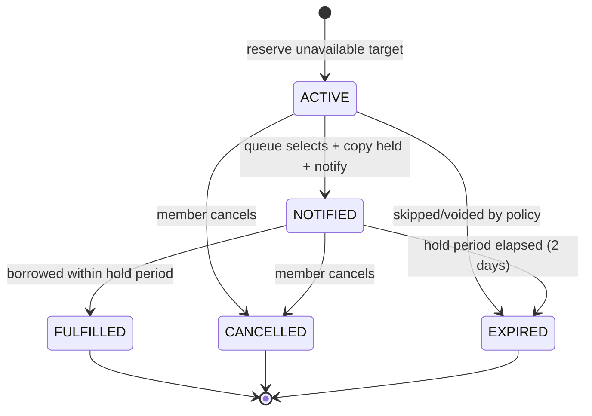

# SPEC.md - FE08 Reservation Management

# Version: 0.3.1

# Status: APPROVED

# Owner: Nhat

# Last Updated: 2026-07-13

# Feature ID: FE08

# Feature folder: `.sdd/specs/feat-reservation-management/`

> Source of truth for FE08 Reservation Management. This spec is approved for Phase 2 planning.

---

## 1. Feature Overview

### 1.1 Feature Name

Reservation Management

### 1.2 Business Context

When a book is not currently available, members need a fair way to reserve it and wait for availability. Librarians need to view and process the reservation queue so the next eligible member can be notified when a copy becomes available.

Reservation Management protects fairness and prevents confusion when many members want the same book.

### 1.3 Goal / Outcome

The system shall:

- Allow eligible members to reserve unavailable books.
- Allow members to cancel their active reservations.
- Allow librarians/admins to view and process reservation queues.
- Update reservation status when a copy becomes available or when reservation is cancelled.
- Trigger notification requirements for FE10 when a reserved book becomes available.

### 1.4 Scope Level

- [ ] Full Spec - core business logic, high risk, must be correct from the beginning
- [x] Standard Spec - normal feature with business rules and validations
- [ ] Light Spec - simple UI, documentation, or low-risk feature

---

## 2. Actors and Permissions

| Actor | Description | Permission / Responsibility |
| ----- | ----------- | --------------------------- |
| Member | Registered library user | Create reservation, cancel own reservation, view own reservation status. |
| Librarian | Library staff | View reservation list, process reservation queue, release/expire reservations when allowed. |
| Admin | System administrator | Has librarian permissions and can view reservation reports/audit. |
| Guest | Unauthenticated visitor | No reservation permissions. |
| Notification Service | External service | Receives notification request when a reserved book becomes available. |

---

## 3. Preconditions

The feature can only start when:

- PRE-FE08-001: The user is authenticated as Member, Librarian, or Admin.
- PRE-FE08-002: The member account is active.
- PRE-FE08-003: The member has approved membership status before creating a reservation.
- PRE-FE08-004: The requested book or book copy exists.
- PRE-FE08-005: Reservation policy is approved: reservation target, maximum active reservations, reservation expiry time, and queue behavior.

---

## 4. Main Flows

### MF-FE08-001: Reserve Book

1. Member opens a book detail page or unavailable copy information.
2. Member chooses to reserve the book.
3. The system validates member eligibility and reservation limit.
4. The system checks whether reservation is allowed for the selected book/copy.
5. The system creates a `Reservations` record with status `ACTIVE`.
6. The system records reservation time for queue order.
7. The system shows reservation status to the member.

### MF-FE08-002: Cancel Reservation

1. Member opens their reservation list.
2. Member selects an active reservation.
3. Member confirms cancellation.
4. The system changes reservation status to `CANCELLED`.
5. The system writes an audit log if required.

### MF-FE08-003: View Reservation List

1. Librarian/admin opens the reservation management screen.
2. The system displays active reservations with member, book/copy, reserved time, and status.
3. The librarian/admin filters by book, member, status, or date range when available.

### MF-FE08-004: Process Reservation Queue

1. A borrowed/reserved copy becomes available, or a librarian opens the queue manually.
2. The system identifies the earliest eligible active reservation.
3. The system marks the copy as reserved for that member or keeps reservation active according to policy.
4. The system triggers FE10 notification requirement.
5. The system updates queue state.

### MF-FE08-005: Trigger Book Available Notification

1. Reservation queue selects the next member.
2. The system creates or sends a notification request to FE10.
3. The member receives book available information through the configured channel when FE10 is implemented.

---

## 5. Alternative Flows

### AF-FE08-001: Book Copy Is Available

1. Member attempts to reserve an available copy.
2. The system rejects reservation and recommends borrowing instead.

### AF-FE08-002: Duplicate Active Reservation

1. Member already has an active reservation for the same book/copy.
2. Member attempts to reserve again.
3. The system rejects duplicate reservation.

### AF-FE08-003: Member Becomes Ineligible Before Queue Processing

1. Member has active reservation.
2. Queue is processed later.
3. The system detects member is no longer eligible.
4. The system skips or holds the reservation according to approved policy.

### AF-FE08-004: Reservation Expires

1. Member is notified that a book is available.
2. Member does not borrow within the reservation hold period.
3. The system marks reservation `EXPIRED` and moves to the next reservation if any.

---

## 6. Business Rules

- BR-FE08-001: A guest cannot create or cancel reservations.
- BR-FE08-002: A member can create reservations only for their own account.
- BR-FE08-003: A member can cancel only their own active reservations.
- BR-FE08-004: Librarian/admin can view and process all reservation records.
- BR-FE08-005: A member must have active account status and approved membership status to reserve.
- BR-FE08-006: A member cannot create duplicate active reservations for the same reservation target.
- BR-FE08-007: A reservation can be created only when reservation is allowed by policy.
- BR-FE08-008: The reservation queue must preserve `ReservedAt` order unless policy defines priority rules.
- BR-FE08-009: Cancelled reservations must not be selected by queue processing.
- BR-FE08-010: Expired reservations must not be selected by queue processing.
- BR-FE08-011: When a reserved copy is held for a member, it must not be available for normal borrowing by another member.
- BR-FE08-012: Queue processing must trigger a notification requirement for FE10.
- BR-FE08-013: Reservation status changes must be traceable.
- BR-FE08-014: An active reservation or held copy for another member must block FE07 loan renewal for the same copy/reservation target.

---

## 7. Functional Requirements

- FR-FE08-001: When an eligible member submits a reservation request, the system shall create an active reservation.
- FR-FE08-002: If the member already has an active reservation for the same target, the system shall reject the duplicate request.
- FR-FE08-003: If the reservation target is available for immediate borrowing, the system shall reject reservation and recommend borrowing.
- FR-FE08-004: When a member cancels an active reservation, the system shall mark it cancelled.
- FR-FE08-005: When a librarian/admin views reservations, the system shall return reservation records with member and book/copy information.
- FR-FE08-006: When queue processing runs, the system shall select the earliest eligible active reservation.
- FR-FE08-007: When a reservation is selected from queue, the system shall make the reserved item unavailable to other members according to policy.
- FR-FE08-008: When a reserved book becomes available, the system shall trigger a notification request for FE10.
- FR-FE08-009: While a reservation is cancelled or expired, the system shall exclude it from active queue processing.
- FR-FE08-010: When a member views reservations, the system shall return only that member's records.

### 7.1 Unwanted Behaviour Requirements (Error / Abnormal Conditions)

> The following requirements use EARS Unwanted syntax (`IF ...` / `WHERE ...`). Each one promotes an existing error branch (Edge Case `EC-*`, Business Rule `BR-*`, Alternative Flow `AF-*`, or approved decision `Q-*`) into a testable functional requirement. No new logic is introduced.

- FR-FE08-011: IF the supplied member ID does not exist when a reservation is requested, the system shall reject the request and return a not-found error. (Source: EC-FE08-001)
- FR-FE08-012: IF the member account status is inactive when a reservation is requested, the system shall reject the reservation. (Source: EC-FE08-002, BR-FE08-005)
- FR-FE08-013: IF the member's membership status is not approved when a reservation is requested, the system shall reject the reservation. (Source: EC-FE08-003, BR-FE08-005, PRE-FE08-003)
- FR-FE08-014: IF the requested book or book copy does not exist when a reservation is requested, the system shall reject the request and return a not-found error. (Source: EC-FE08-004, PRE-FE08-004)
- FR-FE08-015: IF a member already holds the approved maximum number of active reservations when a new reservation is requested, the system shall reject the request and report that the reservation limit is reached. (Source: Q-FE08-003, MF-FE08-001 step 3)
- FR-FE08-016: IF a member attempts to cancel a reservation that they do not own, the system shall deny the action and return a forbidden error. (Source: EC-FE08-006, BR-FE08-003)
- FR-FE08-017: IF a member attempts to cancel a reservation that is already cancelled or expired, the system shall reject the repeated cancellation and return the current reservation state. (Source: EC-FE08-007)
- FR-FE08-018: WHERE a member becomes ineligible before queue processing reaches their active reservation, the system shall skip or hold that reservation according to the approved policy instead of selecting it. (Source: AF-FE08-003)
- FR-FE08-019: IF a notified member does not borrow within the approved reservation hold period, the system shall mark the reservation `EXPIRED` and continue with the next eligible reservation in the queue. (Source: AF-FE08-004, Q-FE08-004)
- FR-FE08-020: WHERE queue processing finds no eligible active reservation, the system shall leave the item available or follow the approved policy without selecting any reservation. (Source: EC-FE08-008)
- FR-FE08-021: IF the notification service is unavailable when a book-available notification is triggered, the system shall preserve the reservation state and record the notification failure for later retry. (Source: EC-FE08-009, BR-FE08-012)
- FR-FE08-022: IF concurrent queue processing attempts to select the same reservation, the system shall allow only one selection to succeed and require the later attempt to re-read the current state. (Source: EC-FE08-010, NFR-FE08-TXN-001)
- FR-FE08-023: WHERE a copy is held for a member from the reservation queue, the system shall prevent that held copy from being borrowed by any other member. (Source: BR-FE08-011, AC-FE08-008)
- FR-FE08-024: WHERE an active reservation or a copy held for another member exists for a reservation target, the system shall block FE07 loan renewal for that copy/reservation target. (Source: BR-FE08-014)

---

## 8. Acceptance Criteria

- AC-FE08-001: Given an eligible member and unavailable reservation target, when the member reserves it, then the system creates an `ACTIVE` reservation.
- AC-FE08-002: Given a member with an active reservation for the same target, when the member reserves again, then the system rejects the duplicate reservation.
- AC-FE08-003: Given an available copy, when the member tries to reserve it, then the system rejects reservation and recommends borrowing.
- AC-FE08-004: Given an active reservation owned by the member, when the member cancels it, then the system marks it `CANCELLED`.
- AC-FE08-005: Given a reservation owned by another member, when a member tries to cancel it, then the system denies the action.
- AC-FE08-006: Given multiple active reservations for the same target, when queue processing runs, then the earliest eligible reservation is selected first.
- AC-FE08-007: Given a cancelled reservation, when queue processing runs, then it is skipped.
- AC-FE08-008: Given a selected reservation, when a copy is held for the member, then other members cannot borrow that held copy.
- AC-FE08-009: Given a selected reservation, when the book becomes available, then a notification request is triggered for FE10.
- AC-FE08-010: Given a logged-in member, when viewing reservations, then only that member's reservations are returned.

---

## 9. Edge Cases and Error Handling

| ID | Edge Case / Error | Expected System Behavior |
| -- | ----------------- | ------------------------ |
| EC-FE08-001 | Member ID does not exist | Return not found error. |
| EC-FE08-002 | Member account inactive | Reject reservation. |
| EC-FE08-003 | Membership not approved | Reject reservation. |
| EC-FE08-004 | Book/copy does not exist | Return not found error. |
| EC-FE08-005 | Duplicate active reservation | Reject duplicate request. |
| EC-FE08-006 | Member cancels someone else's reservation | Return forbidden error. |
| EC-FE08-007 | Reservation already cancelled/expired | Reject repeated cancellation or return current state. |
| EC-FE08-008 | Queue has no eligible reservation | Leave item available or follow approved policy. |
| EC-FE08-009 | Notification service unavailable | Keep reservation state and record notification failure for retry if supported. |
| EC-FE08-010 | Concurrent queue processing | Only one queue selection may succeed; later action must re-read current state. |

---

## 10. Data Requirements

### 10.1 Entities Involved

| Entity | Purpose in this feature |
| ------ | ----------------------- |
| Users | Identifies member, librarian, admin. |
| UserRoles | Checks permissions. |
| MembershipApplications | Confirms member eligibility if used as membership source. |
| Books | Provides book information for reservation display. |
| BookCopies | Provides copy status and reservation target in current SQL. |
| Reservations | Stores reservation records and queue order. |
| BorrowDetails | May release a copy into reservation queue after return. |
| AuditLogs | Records reservation state changes. |

### 10.2 Data Fields

| Field | Type | Required | Validation / Notes |
| ----- | ---- | -------- | ------------------ |
| reservationId | integer | Yes for updates | Must exist in `Reservations`. |
| userId | integer | Yes | Must reference a member user. |
| copyId | integer | Current SQL: Yes | Current SQL reserves a copy; team may change to book-level reservation. |
| reservedAt | datetime | Yes | Used for queue order. |
| status | string | Yes | Proposed values: `ACTIVE`, `CANCELLED`, `NOTIFIED`, `FULFILLED`, `EXPIRED`. |
| expiresAt | datetime | Recommended | Needed if reservation hold period is supported. |

### 10.3 State Model & Transition Rules (Reservation)

This subsection formalizes the lifecycle of `Reservations.status`. The state set is taken directly from the declared enum in section 10.2 Data Fields: `ACTIVE`, `NOTIFIED`, `FULFILLED`, `CANCELLED`, `EXPIRED`. No new states are introduced.

#### 10.3.1 State Diagram

#### 10.3.2 State Descriptions

| State | Meaning | In queue? | Terminal? |
| ----- | ------- | --------- | --------- |
| `ACTIVE` | Reservation created and waiting in the queue; not yet selected. Holds `ReservedAt` order for fairness. | Yes | No |
| `NOTIFIED` | Reservation reached the front of the queue; a copy is held for the member and the FE10 book-available notification has been triggered. Awaiting borrow within the hold period. | No (already selected) | No |
| `FULFILLED` | The member borrowed the held copy within the hold period; the reservation is satisfied. | No | Yes |
| `CANCELLED` | The member voluntarily cancelled the reservation before it was fulfilled. | No | Yes |
| `EXPIRED` | The hold period elapsed without borrowing, or the reservation was voided by approved policy; the queue moves to the next member. | No | Yes |

#### 10.3.3 Valid Transitions

| From | To | Trigger | Condition / Guard | Related FR / BR / AF / Q |
| ---- | -- | ------- | ----------------- | ------------------------ |
| `[*]` | `ACTIVE` | Eligible member reserves an unavailable target | Member eligible, within reservation limit, target not available for immediate borrow, no duplicate active reservation | FR-FE08-001, FR-FE08-002, FR-FE08-003, FR-FE08-015, BR-FE08-005, BR-FE08-006, MF-FE08-001 |
| `ACTIVE` | `NOTIFIED` | Queue processing selects earliest eligible reservation, holds a copy, and triggers notification | Reservation is the earliest eligible active record; copy held atomically; FE10 notification request triggered | FR-FE08-006, FR-FE08-007, FR-FE08-008, FR-FE08-023, BR-FE08-008, BR-FE08-011, BR-FE08-012, MF-FE08-004, MF-FE08-005 |
| `ACTIVE` | `CANCELLED` | Owning member cancels their active reservation | Reservation owned by member and currently `ACTIVE` | FR-FE08-004, BR-FE08-003, MF-FE08-002, AC-FE08-004 |
| `ACTIVE` | `EXPIRED` | Reservation skipped/voided by approved policy at queue time | Member became ineligible before processing and policy voids the reservation | FR-FE08-018, AF-FE08-003 |
| `NOTIFIED` | `FULFILLED` | Member borrows the held copy within the hold period | Borrow occurs within the 2-day hold period | NFR-FE08-LOG-001, MF-FE08-005, Q-FE08-004 |
| `NOTIFIED` | `EXPIRED` | Hold period elapses without borrowing | Member did not borrow within the approved hold period (2 calendar days); queue advances to next eligible reservation | FR-FE08-019, AF-FE08-004, Q-FE08-004 |
| `NOTIFIED` | `CANCELLED` | Owning member cancels while a copy is held | Reservation owned by member and currently `NOTIFIED`; held copy released by FE07 flow | FR-FE08-004, BR-FE08-003, MF-FE08-002 |

#### 10.3.4 Invalid Transitions (Explicitly Forbidden)

| Forbidden Transition | Reason | Related FR / BR / EC |
| -------------------- | ------ | -------------------- |
| `CANCELLED` -> any state | Terminal; a cancelled reservation cannot be reactivated, re-cancelled, notified, or fulfilled. | FR-FE08-017, EC-FE08-007 |
| `EXPIRED` -> any state | Terminal; an expired reservation cannot be revived or re-entered into the queue. | FR-FE08-009, FR-FE08-017, BR-FE08-010, EC-FE08-007 |
| `FULFILLED` -> any state | Terminal; once fulfilled the lifecycle ends. | NFR-FE08-LOG-001 |
| `ACTIVE` -> `FULFILLED` | A reservation cannot be fulfilled before reaching `NOTIFIED` (i.e. before a copy is held and the member is notified). | FR-FE08-007, FR-FE08-008 |
| `NOTIFIED` -> `ACTIVE` | A selected/held reservation cannot return to the waiting queue. | BR-FE08-008, NFR-FE08-TXN-001 |
| `NOTIFIED` -> `NOTIFIED` (re-select) by concurrent processing | Concurrent queue processing must not select the same reservation twice; only one selection succeeds. | FR-FE08-022, EC-FE08-010, NFR-FE08-TXN-001 |
| Queue selection of any `CANCELLED` / `EXPIRED` reservation | Cancelled and expired reservations are excluded from queue processing. | FR-FE08-009, BR-FE08-009, BR-FE08-010, AC-FE08-007 |

#### 10.3.5 Invariants

- INV-FE08-001: A reservation always holds exactly one `status` value from the declared enum `{ACTIVE, NOTIFIED, FULFILLED, CANCELLED, EXPIRED}`.
- INV-FE08-002: `CANCELLED`, `EXPIRED`, and `FULFILLED` are terminal; no transition may leave them.
- INV-FE08-003: Only `ACTIVE` reservations participate in queue selection; `CANCELLED` and `EXPIRED` are never selected. (FR-FE08-009, BR-FE08-009, BR-FE08-010)
- INV-FE08-004: At any moment, for a given reservation target (CopyId in Phase 1, Q-FE08-001), at most one reservation may be in the held/selected `NOTIFIED` state. (NFR-FE08-TXN-001, BR-FE08-011)
- INV-FE08-005: While a copy is held for a `NOTIFIED` reservation, that copy must not be borrowable by any other member nor allow FE07 renewal for the same target. (FR-FE08-023, FR-FE08-024, BR-FE08-011, BR-FE08-014)
- INV-FE08-006: Every status change (create, notify, fulfill, cancel, expire) must be written to the audit log and be traceable. (BR-FE08-013, NFR-FE08-LOG-001)
- INV-FE08-007: State transitions caused by queue processing or cancellation must be applied atomically so the reservation and copy never rest in an inconsistent intermediate state. (NFR-FE08-TXN-001, NFR-FE08-TXN-002)

---

## 11. API / Interface Contract

> Endpoint names are proposed for RESTful API. Final contract may stay in this SPEC.md unless the team reintroduces a dedicated shared API contract document.

| Method | Endpoint | Actor | Request | Response | Notes |
| ------ | -------- | ----- | ------- | -------- | ----- |
| POST | `/api/reservations` | Member | `{ bookId?: number, copyId?: number }` | Created reservation | Target depends on database decision. |
| GET | `/api/reservations/me` | Member | Query: status | Own reservations | Member records only. |
| PATCH | `/api/reservations/{reservationId}/cancel` | Member | Optional reason | Cancelled reservation | Own reservation only. |
| GET | `/api/reservations` | Librarian/Admin | Query: bookId, memberId, status | Reservation list | Protected endpoint. |
| PATCH | `/api/reservations/{reservationId}/process` | Librarian/Admin | Optional copyId | Processed reservation | Used for queue processing/manual hold. |
| POST | `/api/reservations/process-queue` | Librarian/Admin/System | `{ bookId?: number, copyId?: number }` | Selected reservation or none | Optional if queue runs manually. |
| POST | `/api/reservations/expire-holds` | Librarian/Admin | No body | Expired count, expired reservations, and promoted reservations | Manually expires overdue `NOTIFIED` holds and advances eligible queues; traces FR-FE08-019. |

---

## 12. Non-functional Requirements

### 12.1 Security

- NFR-FE08-SEC-001: Reservation endpoints must require authentication except public browsing dependencies.
- NFR-FE08-SEC-002: Members must not view or cancel other members' reservations.
- NFR-FE08-SEC-003: Librarian/admin permissions must be checked on the server.

### 12.2 Transaction Integrity

- NFR-FE08-TXN-001: Queue processing must update reservation/copy state atomically.
- NFR-FE08-TXN-002: Cancellation must not leave the reserved copy in an inconsistent state.

### 12.3 Performance

- NFR-FE08-PERF-001: Reservation list should support pagination/filtering.
- NFR-FE08-PERF-002: Queue lookup should use reservation target and status filters.

### 12.4 Logging and Audit

- NFR-FE08-LOG-001: Create, cancel, queue process, notify, fulfilled, and expired actions should be traceable.

### 12.5 Usability

- NFR-FE08-UX-001: The system should show clear reservation status to members.
- NFR-FE08-UX-002: Librarians should see queue order clearly.

---

## 13. Out of Scope

This feature does not include:

- FE07 borrow approval or return implementation.
- FE10 notification delivery implementation.
- Fine calculation.
- Online payment.
- Study seat reservation.
- Complex priority rules unless approved by the team.

---

## 14. Dependencies

| Dependency | Type | Notes |
| ---------- | ---- | ----- |
| FE02 Authentication | Internal | Identifies actor. |
| FE04 Membership Management | Internal | Confirms member eligibility. |
| FE06 Inventory / Book Copy Management | Internal | Provides copy availability/status. |
| FE07 Borrowing Management | Internal | Return flow may release copy into reservation queue. Checked on 2026-06-10: active reservation/held copy for another member blocks FE07 renewal. |
| FE10 Notification Management | Internal | Sends book available notification. |
| FE11 User & Role Management | Internal | Provides roles and permissions. |
| SQL Server database | Technical | Current SQL script has `Reservations(UserId, CopyId, ReservedAt, Status)`. |

---

## 15. Resolved Questions

| ID | Approved Decision | Source | Status |
| -- | ----------------- | ------ | ------ |
| Q-FE08-001 | Reservation targets physical copy CopyId in Phase 1. | Review packet 2026-06-10 | APPROVED |
| Q-FE08-002 | Member cannot reserve when a copy is currently available. | Review packet 2026-06-10 | APPROVED |
| Q-FE08-003 | Maximum 3 active reservations per member. | Review packet 2026-06-10 | APPROVED |
| Q-FE08-004 | Notified reservation stays valid for 2 calendar days. | Review packet 2026-06-10 | APPROVED |
| Q-FE08-005 | Queue processing is manual by librarian in Phase 1; automatic trigger is future work. | Review packet 2026-06-10 | APPROVED |

---

## 16. Traceability Matrix

| Requirement ID | Related Use Case | Related Test Case | Status |
| -------------- | ---------------- | ----------------- | ------ |
| BR-FE08-005 | UC36 | FT37 | Ready for review |
| BR-FE08-006 | UC36 | FT37 | Ready for review |
| BR-FE08-008 | UC39 | FT40 | Ready for review |
| BR-FE08-009 | UC37, UC39 | FT38, FT40 | Ready for review |
| BR-FE08-014 | UC39 | FT40 | Ready for review |
| FR-FE08-001 | UC36 | FT37 | Ready for review |
| FR-FE08-002 | UC36 | FT37 | Ready for review |
| FR-FE08-003 | UC36 | FT37 | Ready for review |
| FR-FE08-004 | UC37 | FT38 | Ready for review |
| FR-FE08-005 | UC38 | FT39 | Ready for review |
| FR-FE08-006 | UC39 | FT40 | Ready for review |
| FR-FE08-007 | UC39 | FT40 | Ready for review |
| FR-FE08-008 | UC40 | FT41 | Ready for review |
| FR-FE08-009 | UC39 | FT40 | Ready for review |
| FR-FE08-010 | UC38 | FT39 | Ready for review |
| FR-FE08-011 | UC36 (EC-FE08-001) | TBD | Ready for review |
| FR-FE08-012 | UC36 (EC-FE08-002) | rejects reservation when member account is inactive (FR-FE08-012) | Ready for review |
| FR-FE08-013 | UC36 (EC-FE08-003) | FT37; rejects reservation when membership is not approved (FR-FE08-013) | Ready for review |
| FR-FE08-014 | UC36 (EC-FE08-004) | rejects reservation when the copy does not exist (FR-FE08-014) | Ready for review |
| FR-FE08-015 | UC36 (Q-FE08-003) | member creates reservations only for unavailable copies within the active limit (FR-FE08-015) | Ready for review |
| FR-FE08-016 | UC37 (EC-FE08-006) | member cancels only their own active reservation (FR-FE08-016) | Ready for review |
| FR-FE08-017 | UC37 (EC-FE08-007) | member cancels only their own active reservation; rejects cancelling a reservation that is already expired (FR-FE08-017) | Ready for review |
| FR-FE08-018 | UC39 (AF-FE08-003) | process-queue skips an ineligible member instead of holding (FR-FE08-018) | Ready for review |
| FR-FE08-019 | UC39 (AF-FE08-004) | expire-holds expires an overdue hold and promotes the next reservation (FR-FE08-019) | Ready for review |
| FR-FE08-020 | UC39 (EC-FE08-008) | process-queue selects nothing when no eligible reservation exists (FR-FE08-020) | Ready for review |
| FR-FE08-021 | UC40 (EC-FE08-009) | FT41 | Ready for review |
| FR-FE08-022 | UC39 (EC-FE08-010) | concurrent queue processing holds the copy only once (FR-FE08-022) | Ready for review |
| FR-FE08-023 | UC39 (BR-FE08-011) | FT40 | Ready for review |
| FR-FE08-024 | UC39 (BR-FE08-014) | FT40 | Ready for review |

---

## 17. Review Checklist

Phase 1 approval checklist (completed on 2026-06-10):

- [x] Reservation target is confirmed: book-level or copy-level.
- [x] Maximum active reservations is approved.
- [x] Reservation expiry/hold period is approved.
- [x] Queue processing behavior is approved.
- [x] API contract is approved in this SPEC.md or copied to a dedicated shared API contract file if the team reintroduces one.
- [x] FE07 dependency is checked, especially return and renewal behavior.
- [x] Every acceptance criterion can become a test.
