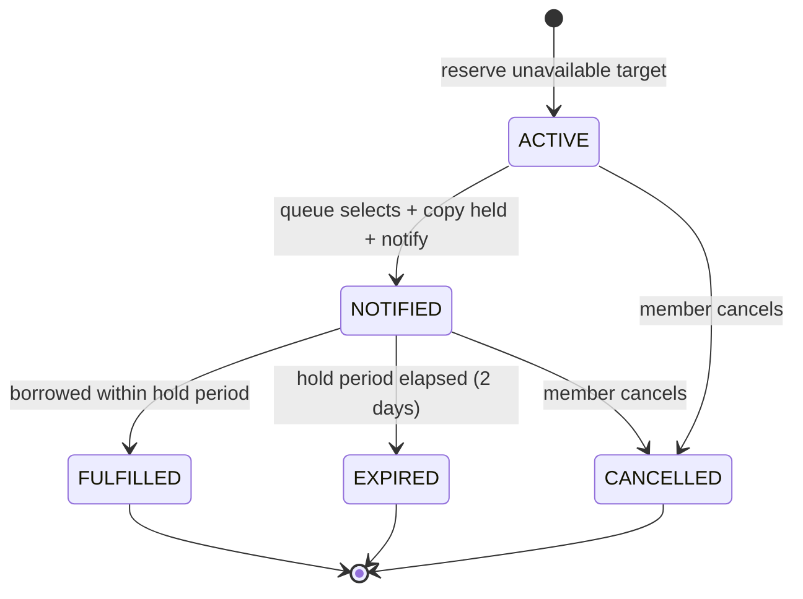

# SPEC.md - Quản lý đặt chỗ FE08

# Phiên bản: 0.5.10

# Trạng thái: APPROVED - MỐC CƠ SỞ 2026-07-17

# Chủ sở hữu: Nhat

# Cập nhật lần cuối: 2026-07-27

# ID tính năng: FE08

# Thư mục tính năng: `.sdd/specs/feat-reservation-management/`

> Trạng thái bàn giao hiện tại (2026-07-20): `COMPLETE` cho phạm vi Giai đoạn 1 đã được phê duyệt.
> `TASKS.md` và `.sdd/reviews/phase2-full-exit-validation-2026-07-19.md`
> là nguồn chuẩn cho trạng thái triển khai hiện tại. Các nhãn cũ `Not Started`,
> `PARTIAL`, `READY FOR REVIEW` hoặc đang chờ rà soát được giữ lại bên dưới chỉ là
> ảnh chụp nhanh kế hoạch/bằng chứng lịch sử, không phải trạng thái bàn giao hiện tại.

> Nguồn chuẩn cho Quản lý đặt chỗ FE08. Bản sửa đổi v0.4.4 bổ sung danh mục ứng viên đặt chỗ an toàn cho Thành viên đã được phê duyệt, đồng thời giữ nguyên hợp đồng thay đổi dữ liệu theo `CopyId` và lịch sử bất biến của các dấu thời gian ở trạng thái cuối. Phần triển khai danh mục ứng viên đã qua xác thực tự động; bước kiểm tra xuyên suốt cuối cùng của con người/đánh giá H3 vẫn bắt buộc trước khi hợp nhất.
>
> Bản sửa đổi v0.5.2 bảo đảm nhật ký kiểm toán vòng đời khi tạo/hủy/giữ/làm hết hạn
> được ghi nguyên tử cùng thay đổi trạng thái tương ứng và loại bỏ thông tin Thành viên lưu đệm
> khỏi bước xác nhận hàng đợi của nhân viên vì máy chủ sẽ chọn lại bản ghi hiện đủ điều kiện đầu tiên.
>
> Bản sửa đổi v0.5.3 giữ nguyên cảnh báo kiểm toán thông báo an toàn sau khi xác nhận giao dịch
> khi việc xử lý hết hạn đẩy một hoặc nhiều đặt chỗ lên lượt kế tiếp, mà không thay đổi
> DTO của các đặt chỗ được đẩy lên.
>
> Bản sửa đổi v0.5.7 giữ nguyên các hợp đồng hiển thị sách đã chọn và phân tách của v0.5.6
> giữa hiện tại/lịch sử, đồng thời làm rõ rằng các mảng vai trò Thành viên/nhân viên
> cũ không hợp lệ chỉ là dữ liệu tương thích, không phải tài khoản lưu trữ được hỗ trợ.
>
> Bản sửa đổi v0.5.8 tích hợp khoảng thời gian nhận sách đã được thông báo từ phiên bản trước và
> luồng bàn giao chính xác bản sao đang được giữ sang FE07, đồng thời giữ nguyên quy tắc tương thích một vai trò.
>
> Bản sửa đổi v0.5.9 tích hợp quy tắc loại trừ v0.5.8 khi đang mượn một bản khác của cùng cuốn
> sách với khoảng thời gian nhận sách, luồng bàn giao chính xác sang FE07 và hợp đồng tương thích
> một vai trò.
>
> Bản sửa đổi v0.5.10 đối soát hợp đồng vị trí hàng đợi v0.5.9 được phát triển song song
> từ `main@8d0059b`, giữ `FE08-T046` cho hành vi đã tích hợp trước đó, chuyển nhiệm vụ chỉ kiểm
> thử hồi quy của nhánh này sang `FE08-T047` và yêu cầu hiển thị vị trí null là
> `Chưa xác định`.

---

## 1. Tổng quan về tính năng

### 1.1 Tên tính năng

Quản lý đặt chỗ

### 1.2 Bối cảnh nghiệp vụ

Khi một cuốn sách hiện không có sẵn, các thành viên cần có một cách hợp lý để đặt trước và chờ có sách. Thủ thư cần xem và xử lý hàng đợi đặt trước để thành viên đủ điều kiện tiếp theo có thể được thông báo khi có bản sao.

Quản lý đặt chỗ bảo vệ sự công bằng và tránh nhầm lẫn khi nhiều thành viên muốn có cùng một cuốn sách.

### 1.3 Mục tiêu / Kết quả

Hệ thống sẽ:

- Cho phép Thành viên đủ điều kiện đặt trước các bản sao vật lý không có sẵn.
- Cho phép Thành viên tìm các bản sao vật lý không có sẵn thông qua danh mục đã lược bỏ dữ liệu nhạy cảm và được máy chủ bảo vệ.
- Cho phép Thành viên hủy đặt chỗ `ACTIVE` hoặc lượt giữ `NOTIFIED` của chính mình.
- Cho phép Thủ thư/Quản trị viên xem và xử lý hàng đợi đặt chỗ.
- Cập nhật trạng thái đặt chỗ khi có bản sao hoặc khi việc đặt chỗ bị hủy.
- Kích hoạt yêu cầu thông báo cho FE10 khi có sách đã được đặt trước.

### 1.4 Mức đặc tả

- [ ] Đặc tả đầy đủ - logic nghiệp vụ cốt lõi, rủi ro cao, phải đúng ngay từ đầu
- [x] Đặc tả tiêu chuẩn - chức năng thông thường có quy tắc nghiệp vụ và kiểm tra hợp lệ
- [ ] Đặc tả rút gọn - giao diện đơn giản, tài liệu hoặc chức năng ít rủi ro

---

## 2. Tác nhân và quyền

| Tác nhân | Mô tả | Quyền / Trách nhiệm |
| ----- | ----------- | --------------------------- |
| Thành viên | Người dùng thư viện đã đăng ký, không phải nhân viên và chỉ có vai trò `MEMBER` | Xem danh mục ứng viên đặt chỗ an toàn, tạo đặt chỗ, hủy đặt chỗ của mình và xem trạng thái đặt chỗ của mình. Các mảng tương thích cũ không hợp lệ có thêm `LIBRARIAN` hoặc `ADMIN` sẽ bị từ chối truy cập chức năng tự phục vụ của Thành viên. |
| Thủ thư | Nhân viên thư viện | Xem danh sách đặt chỗ, xử lý hàng đợi đặt chỗ, giải phóng/làm hết hạn đặt chỗ khi được phép. |
| Quản trị viên | Quản trị viên hệ thống | Có quyền của Thủ thư và có thể xem báo cáo/nhật ký kiểm toán đặt chỗ. |
| Khách | Khách truy cập không được xác thực | Không có quyền đặt chỗ. |
| Dịch vụ thông báo | Dịch vụ bên ngoài | Nhận yêu cầu thông báo khi có sách đã được đặt trước. |

---

## 3. Điều kiện tiên quyết

Tính năng này chỉ có thể bắt đầu khi:

- PRE-FE08-001: Tác nhân đã được xác thực; Thành viên có thể tạo/hủy/xem đặt chỗ của mình, còn Thủ thư/Quản trị viên có thể xem/xử lý đặt chỗ.
- PRE-FE08-002: Thành viên tạo đặt chỗ có `Users.Status = ACTIVE`.
- PRE-FE08-003: Thành viên tạo đặt chỗ có `MEMBER`, không có `LIBRARIAN` hay `ADMIN` và `Users.Status = ACTIVE`; không yêu cầu FE04 phê duyệt.
- PRE-FE08-004: Bản sao vật lý được yêu cầu và sách chứa bản sao đó đều tồn tại.
- PRE-FE08-005: Chính sách Giai đoạn 1 được cố định: mục tiêu là `CopyId`, tối đa 3 đặt chỗ đang mở (`ACTIVE` hoặc `NOTIFIED`), thời gian giữ sau thông báo là 2 ngày theo lịch, xử lý hàng đợi thủ công và sắp xếp theo `ReservedAt ASC, ReservationId ASC`.
- PRE-FE08-006: Chỉ tài khoản `MEMBER` đã xác thực mới được truy cập danh mục ứng viên; không mở rộng hợp đồng duyệt sách công khai của FE01 hoặc hợp đồng kho dành cho nhân viên của FE06.

---

## 4. Luồng chính

### MF-FE08-001: Đặt trước bản sao vật lý

1. Thành viên mở trang chi tiết sách và chọn một bản sao vật lý không có sẵn.
2. Thành viên chọn đặt trước bản sao đó.
3. Hệ thống kiểm tra tính đủ điều kiện của Thành viên và giới hạn đặt chỗ.
4. Hệ thống xác nhận bản sao đã chọn đang không có sẵn và không ở trạng thái `AVAILABLE`, `DAMAGED`, `LOST` hoặc không hoạt động.
5. Hệ thống tạo bản ghi `Reservations` có trạng thái `ACTIVE` và ghi nhật ký kiểm toán vòng đời trong cùng một giao dịch.
6. Hệ thống ghi lại thời gian đặt chỗ cho thứ tự xếp hàng.
7. Hệ thống hiển thị trạng thái đặt chỗ cho Thành viên.

### MF-FE08-002: Hủy đặt chỗ

1. Thành viên mở danh sách đặt chỗ của họ.
2. Thành viên chọn một đặt chỗ `ACTIVE` hoặc lượt giữ `NOTIFIED`.
3. Thành viên xác nhận hủy.
4. Hệ thống đổi trạng thái đặt chỗ thành `CANCELLED`, giải phóng bản sao theo cách nguyên tử nếu đặt chỗ đang là `NOTIFIED` và ghi nhật ký kiểm toán vòng đời trong cùng giao dịch.

### MF-FE08-003: Xem danh sách đặt chỗ

1. Thủ thư/Quản trị viên mở màn hình quản lý đặt chỗ.
2. Hệ thống hiển thị bản ghi đặt chỗ cùng thông tin Thành viên, sách/bản sao, thời gian đặt chỗ và trạng thái.
3. Thủ thư/Quản trị viên lọc theo các trường truy vấn sách, Thành viên hoặc trạng thái được hỗ trợ.

### MF-FE08-004: Xử lý hàng đợi đặt chỗ

1. Một bản sao ở trạng thái `AVAILABLE` và Thủ thư/Quản trị viên chủ động gọi xử lý hàng đợi cho `copyId` đó.
2. Hệ thống xác định đặt chỗ đang hoạt động đủ điều kiện sớm nhất.
3. Nếu có đặt chỗ đủ điều kiện, trong cùng một giao dịch hệ thống đổi đặt chỗ thành `NOTIFIED`, đổi bản sao thành `RESERVED`, thiết lập `NotifiedAt` và `ExpiresAt`, ghi nhật ký kiểm toán vòng đời và giữ nguyên thứ tự hàng đợi.
4. Sau khi giao dịch giữ chỗ được commit, hệ thống gửi một yêu cầu thông báo FE10 với `type = RESERVATION_AVAILABLE`, `templateKey = RESERVATION_READY` và `sourceFeature = FE08`.
5. Nếu yêu cầu thông báo thất bại, lượt giữ vẫn được commit và lỗi được ghi vào nhật ký kiểm toán; nếu chính việc ghi nhật ký lỗi sau commit đó không khả dụng, phản hồi cho nhân viên phải chứa siêu dữ liệu cảnh báo `RESERVATION_NOTIFY_AUDIT_FAILED` an toàn. Giai đoạn 1 không có tiến trình thử lại tự động.

### MF-FE08-005: Kích hoạt thông báo có sách

1. Hàng đợi đặt chỗ chọn Thành viên tiếp theo.
2. Hệ thống gửi một yêu cầu thông báo tới FE10.
3. Khi FE10 được triển khai, Thành viên nhận thông tin sách đã có qua kênh được cấu hình.

### MF-FE08-006: Hoàn tất lượt giữ qua FE07

1. Thành viên được thông báo sẽ tạo yêu cầu mượn FE07 thông thường đối với bản sao vật lý được giữ.
2. FE07 kiểm tra lại đặt chỗ `NOTIFIED` thuộc đúng Thành viên và bản sao đó.
3. Thủ thư/Quản trị viên phê duyệt yêu cầu mượn.
4. Trong giao dịch phê duyệt, đặt chỗ khớp được đổi thành `FULFILLED` đồng thời bản sao được đổi thành `BORROWED`.
5. Nhật ký kiểm toán việc mượn và hoàn tất đặt chỗ được commit cùng giao dịch.

---

## 5. Luồng thay thế

### AF-FE08-001: Bản sao sách đang có sẵn

1. Thành viên cố gắng đặt trước một bản sao có sẵn.
2. Hệ thống từ chối đặt chỗ và đề xuất mượn sách thay thế.

### AF-FE08-002: Đặt chỗ hiện hoạt trùng lặp

1. Thành viên đã có một đặt chỗ đang mở cho cùng bản sao vật lý.
2. Thành viên cố gắng đặt chỗ lần nữa.
3. Hệ thống từ chối đặt chỗ trùng lặp.

### AF-FE08-003: Thành viên trở nên không đủ điều kiện trước khi xử lý hàng đợi

1. Thành viên có một đặt chỗ đang hoạt động.
2. Hàng đợi được xử lý sau.
3. Hệ thống phát hiện thành viên không còn đủ điều kiện.
4. Hệ thống bỏ qua đặt chỗ trong lần xử lý này, giữ trạng thái `ACTIVE` và không thay đổi bản sao. Một lần chạy thủ công sau có thể thử lại khi Thành viên đủ điều kiện trở lại.

### AF-FE08-004: Hết hạn đặt trước

1. Thành viên được thông báo rằng sách đã có.
2. Thành viên không mượn trong thời gian giữ chỗ.
3. Hệ thống đổi đặt chỗ thành `EXPIRED` và ghi nhật ký kiểm toán vòng đời trong cùng một giao dịch, sau đó chuyển sang đặt chỗ tiếp theo nếu có.

---

## 6. Quy tắc nghiệp vụ

- BR-FE08-001: Khách không thể tạo hoặc hủy đặt chỗ.
- BR-FE08-002: Thành viên chỉ có thể tạo đặt chỗ cho tài khoản của chính họ.
- BR-FE08-003: Thành viên chỉ có thể hủy đặt chỗ của chính họ khi trạng thái của nó là `ACTIVE` hoặc `NOTIFIED`.
- BR-FE08-004: Thủ thư/Quản trị viên có thể xem và xử lý tất cả bản ghi đặt chỗ.
- BR-FE08-005: Thành viên phải có vai trò `MEMBER` và `Users.Status = ACTIVE` để đặt chỗ; trạng thái FE04 không chặn FE08.
- BR-FE08-006: Thành viên không thể tạo đặt chỗ đang mở trùng lặp cho cùng một mục tiêu đặt chỗ; cả `ACTIVE` và `NOTIFIED` đều là trạng thái đang mở, còn `FULFILLED`, `CANCELLED` và `EXPIRED` là trạng thái cuối.
- BR-FE08-007: Chỉ có thể tạo đặt chỗ cho bản sao vật lý không có sẵn; `AVAILABLE`, `DAMAGED`, `LOST` và các bản sao không hoạt động đều bị từ chối.
- BR-FE08-008: Hàng đợi đặt chỗ phải dùng thứ tự ổn định `ReservedAt ASC, ReservationId ASC`; Giai đoạn 1 không có cơ chế ghi đè mức ưu tiên.
- BR-FE08-009: Quá trình xử lý hàng đợi không được chọn đặt chỗ đã hủy.
- BR-FE08-010: Quá trình xử lý hàng đợi không được chọn đặt chỗ đã hết hạn.
- BR-FE08-011: Khi bản sao đã đặt trước được giữ cho một Thành viên, Thành viên khác không được mượn bản sao đó theo luồng thông thường.
- BR-FE08-012: Sau khi giao dịch giữ chỗ được commit, quá trình xử lý hàng đợi phải gửi một yêu cầu thông báo FE10 với `type = RESERVATION_AVAILABLE`, `templateKey = RESERVATION_READY` và `sourceFeature = FE08`.
- BR-FE08-013: Các thay đổi trạng thái khi tạo, hủy, giữ và làm hết hạn đặt chỗ phải ghi nhật ký kiểm toán vòng đời trong cùng giao dịch cơ sở dữ liệu, để thay đổi dữ liệu và nhật ký kiểm toán không thể commit riêng lẻ. Việc ghi nhật ký lỗi FE10 sau commit không hoàn tác lượt giữ đã commit và phải đưa ra cảnh báo an toàn nếu không thể ghi nhật ký kiểm toán đó.
- BR-FE08-014: Đặt chỗ đang hoạt động hoặc bản sao đang được giữ cho Thành viên khác phải chặn gia hạn lượt mượn FE07 cho cùng bản sao/mục tiêu đặt chỗ.
- BR-FE08-015: Chỉ việc FE07 phê duyệt cho đúng Thành viên và bản sao mới được chuyển đặt chỗ `NOTIFIED` sang `FULFILLED`.
- BR-FE08-016: Một bản ghi hàng đợi `ACTIVE` tạo quyền ưu tiên đặt chỗ và chặn các hành động tạo/phê duyệt FE07 thông thường cho bản sao đó cho đến khi hàng đợi được xử lý hoặc đặt chỗ chuyển sang trạng thái cuối. Nếu FE07 trả bản sao trước, `BookCopies.Status` có thể là `AVAILABLE` trong khi quyền giữ `ACTIVE` vẫn được thực thi; FE08 vẫn chịu trách nhiệm chọn hàng đợi sau đó.
- BR-FE08-017: Khi một đặt chỗ đã đạt `NOTIFIED`, `NotifiedAt` và `ExpiresAt` là các sự kiện lịch sử bất biến và phải tiếp tục có giá trị sau khi chuyển sang `FULFILLED`, `EXPIRED` hoặc `CANCELLED`; chúng chỉ là null đối với đặt chỗ chưa từng đạt `NOTIFIED`. `CancelledAt` chỉ có giá trị đối với `CANCELLED`.
- BR-FE08-018: Các điểm cuối danh mục ứng viên đặt chỗ, tạo, danh sách của bản thân và hủy bởi chủ sở hữu yêu cầu vai trò duy nhất của tài khoản là `MEMBER`; tài khoản `LIBRARIAN` và `ADMIN` không thể tự đặt sách cho mình.
- BR-FE08-019: Thành viên hiện đang mượn bất kỳ bản sao nào của một cuốn sách với `BorrowDetails.Status = BORROWED` không thể đặt một bản sao vật lý khác có cùng `BookId`. Lịch sử đã trả, mất, hỏng, bị từ chối và lịch sử đặt chỗ ở trạng thái cuối không kích hoạt quy tắc này; Thành viên khác vẫn có thể đủ điều kiện độc lập.
- BR-FE08-020: Vị trí hàng đợi chỉ có phạm vi trong một mục tiêu đặt chỗ vật lý (`CopyId`) và chỉ được tính từ các bản ghi `ACTIVE` của bản sao đó. Các vị trí bằng nhau ở những sách/bản sao khác nhau là hợp lệ và không được hiển thị như một thứ tự toàn cục của Thành viên.

---

## 7. Yêu cầu chức năng

- FR-FE08-001: Khi Thành viên đủ điều kiện gửi yêu cầu đặt chỗ, hệ thống phải tạo một đặt chỗ đang hoạt động và nhật ký kiểm toán vòng đời của nó theo cách nguyên tử.
- FR-FE08-002: Nếu Thành viên đã có đặt chỗ đang hoạt động cho cùng mục tiêu, hệ thống phải từ chối yêu cầu trùng lặp.
- FR-FE08-003: Nếu mục tiêu đặt chỗ có thể được mượn ngay, hệ thống phải từ chối đặt chỗ và đề xuất mượn sách.
- FR-FE08-004: Khi Thành viên hủy đặt chỗ `ACTIVE` hoặc `NOTIFIED` của mình, hệ thống phải đánh dấu đặt chỗ đã hủy, giải phóng bản sao đang được giữ nếu có và lưu nhật ký kiểm toán hủy theo cách nguyên tử.
- FR-FE08-005: Khi Thủ thư/Quản trị viên xem các đặt chỗ, hệ thống phải trả về bản ghi đặt chỗ cùng thông tin Thành viên và sách/bản sao.
- FR-FE08-006: Khi xử lý hàng đợi, hệ thống phải chọn đặt chỗ đang hoạt động đủ điều kiện sớm nhất.
- FR-FE08-007: Khi một đặt chỗ được chọn từ hàng đợi, hệ thống phải làm cho bản sao đã đặt không còn khả dụng với các Thành viên khác theo chính sách.
- FR-FE08-008: Khi sách đã đặt trước trở nên có sẵn, hệ thống phải kích hoạt yêu cầu thông báo cho FE10.
- FR-FE08-009: Khi đặt chỗ ở trạng thái đã hủy hoặc hết hạn, hệ thống phải loại đặt chỗ đó khỏi quá trình xử lý hàng đợi đang hoạt động.
- FR-FE08-010: Khi Thành viên xem các đặt chỗ, hệ thống phải chỉ trả về bản ghi của Thành viên đó.

### 7.1 Yêu cầu hành vi không mong muốn (Lỗi / Điều kiện bất thường)

> Các yêu cầu sau dùng cú pháp EARS cho hành vi không mong muốn (`IF ...` / `WHERE ...`). Mỗi yêu cầu nâng một nhánh lỗi hiện có (Trường hợp biên `EC-*`, Quy tắc nghiệp vụ `BR-*`, Luồng thay thế `AF-*` hoặc quyết định đã phê duyệt `Q-*`) thành yêu cầu chức năng có thể kiểm thử. Không bổ sung logic mới.

- FR-FE08-011: NẾU ID Thành viên được cung cấp không tồn tại khi yêu cầu đặt chỗ, hệ thống phải từ chối yêu cầu và trả về lỗi không tìm thấy. (Nguồn: EC-FE08-001)
- FR-FE08-012: NẾU trạng thái tài khoản Thành viên không hoạt động khi yêu cầu đặt chỗ, hệ thống phải từ chối đặt chỗ. (Nguồn: EC-FE08-002, BR-FE08-005)
- FR-FE08-013: NẾU tài khoản Thành viên đang hoạt động và có vai trò `MEMBER`, hệ thống phải cho phép đánh giá tính đủ điều kiện mà không yêu cầu FE04 phê duyệt. (Nguồn: BR-FE08-005, PRE-FE08-003)
- FR-FE08-014: NẾU bản sao vật lý được yêu cầu không tồn tại khi yêu cầu đặt chỗ, hệ thống phải từ chối yêu cầu và trả về lỗi không tìm thấy. (Nguồn: EC-FE08-004, PRE-FE08-004)
- FR-FE08-015: NẾU Thành viên đã có 3 đặt chỗ đang mở ở trạng thái `ACTIVE` hoặc `NOTIFIED` khi yêu cầu đặt chỗ mới, hệ thống phải từ chối yêu cầu và báo rằng đã đạt giới hạn đặt chỗ. (Nguồn: Q-FE08-003, MF-FE08-001 bước 3)
- FR-FE08-016: NẾU Thành viên cố hủy đặt chỗ mà họ không sở hữu, hệ thống phải từ chối hành động và trả về lỗi bị cấm. (Nguồn: EC-FE08-006, BR-FE08-003)
- FR-FE08-017: NẾU Thành viên cố hủy một đặt chỗ không ở trạng thái `ACTIVE` hoặc `NOTIFIED`, hệ thống phải trả về `409 RESERVATION_NOT_ACTIVE` cùng trạng thái đặt chỗ hiện tại và giữ nguyên đặt chỗ. (Nguồn: EC-FE08-007, BR-FE08-003)
- FR-FE08-018: TRONG TRƯỜNG HỢP Thành viên trở nên không đủ điều kiện trước khi quá trình xử lý hàng đợi tới đặt chỗ `ACTIVE` của họ, hệ thống phải bỏ qua đặt chỗ đó trong lần chạy này, giữ trạng thái `ACTIVE` và không thay đổi bản sao. (Nguồn: AF-FE08-003, Q-FE08-006)
- FR-FE08-019: NẾU Thành viên đã được thông báo không mượn sách trong thời gian giữ chỗ được phê duyệt, hệ thống phải đổi đặt chỗ thành `EXPIRED` và tiếp tục với đặt chỗ đủ điều kiện tiếp theo trong hàng đợi. (Nguồn: AF-FE08-004, Q-FE08-004)
- FR-FE08-020: TRONG TRƯỜNG HỢP quá trình xử lý hàng đợi không tìm thấy đặt chỗ đang hoạt động đủ điều kiện, hệ thống phải không trả về lựa chọn nào, giữ nguyên trạng thái bản sao và không thay đổi trạng thái đặt chỗ. (Nguồn: EC-FE08-008, Q-FE08-007)
- FR-FE08-021: NẾU yêu cầu thông báo FE10 thất bại sau khi lượt giữ đã được xác nhận, hệ thống phải giữ nguyên trạng thái `NOTIFIED`/`RESERVED` và ghi một mục kiểm toán `RESERVATION_NOTIFY_FAILED`; nếu việc ghi kiểm toán sau xác nhận đó cũng thất bại, `process-queue` phải trả về một `notificationWarning` ở cấp cao nhất, còn `expire-holds` phải trả về một mục tùy chọn trong `notificationWarnings[]` ở cấp cao nhất cho mỗi lần đẩy đặt chỗ bị ảnh hưởng. Khi nhận diện một lần đẩy do hết hạn, mỗi cảnh báo chỉ được chứa `reservationId` và `copyId`, cùng `code` và `message` an toàn; DTO của đặt chỗ được đẩy lên phải giữ nguyên, còn siêu dữ liệu cảnh báo không được chứa danh tính Thành viên hoặc chi tiết nhà cung cấp. Giai đoạn 1 không chạy tiến trình thử lại tự động. (Nguồn: EC-FE08-009, BR-FE08-012, BR-FE08-013, Q-FE08-008)
- FR-FE08-022: NẾU nhiều tiến trình xử lý hàng đợi đồng thời cố chọn cùng một đặt chỗ, hệ thống phải chỉ cho phép một lần chọn thành công và yêu cầu lần xử lý sau đọc lại trạng thái hiện tại. (Nguồn: EC-FE08-010, NFR-FE08-TXN-001)
- FR-FE08-023: TRONG TRƯỜNG HỢP một bản sao được giữ cho Thành viên từ hàng đợi đặt chỗ, hệ thống phải ngăn mọi Thành viên khác mượn bản sao đang giữ đó. (Nguồn: BR-FE08-011, AC-FE08-008)
- FR-FE08-024: TRONG TRƯỜNG HỢP tồn tại đặt chỗ đang hoạt động hoặc bản sao được giữ cho Thành viên khác đối với một mục tiêu đặt chỗ, hệ thống phải chặn FE07 gia hạn lượt mượn cho bản sao/mục tiêu đặt chỗ đó. (Nguồn: BR-FE08-014)
- FR-FE08-025: KHI FE07 phê duyệt yêu cầu mượn của chủ sở hữu đặt chỗ đã được thông báo, FE08 phải chuyển đặt chỗ khớp sang `FULFILLED` trong cùng một giao dịch.
- FR-FE08-026: NẾU FE07 đánh giá một bản sao đang có hàng đợi hoạt động hoặc lượt giữ đã thông báo của Thành viên khác, trạng thái đặt chỗ FE08 phải chặn thao tác mượn thông thường mà không làm lộ chủ sở hữu đặt chỗ.
- FR-FE08-027: NẾU `page` hoặc `limit` được cung cấp cho danh sách đặt chỗ vi phạm giới hạn phân trang Giai đoạn 1, hệ thống phải từ chối yêu cầu mà không chuẩn hóa giá trị hoặc truy vấn đặt chỗ.
- FR-FE08-028: KHI một đặt chỗ `NOTIFIED` chuyển thành `FULFILLED`, `EXPIRED` hoặc `CANCELLED`, hệ thống phải giữ nguyên `NotifiedAt` và `ExpiresAt` ban đầu; thao tác hủy phải thiết lập thêm `CancelledAt`, còn các trạng thái không phải hủy giữ `CancelledAt = null`.
- FR-FE08-029: KHI Thành viên đã xác thực yêu cầu `GET /api/reservations/candidates`, hệ thống phải trả về danh mục có phân trang do máy chủ quản lý, gồm các bản sao vật lý của sách đang hoạt động có trạng thái `BORROWED` hoặc `RESERVED`; danh mục chỉ được hiển thị phép chiếu an toàn đã phê duyệt và `POST /api/reservations { copyId }` vẫn là nguồn có thẩm quyền cho mọi kiểm tra tại thời điểm thay đổi dữ liệu.
- FR-FE08-030: NẾU mảng vai trò tương thích là dữ liệu cũ không hợp lệ chứa `MEMBER` cùng `LIBRARIAN` hoặc `ADMIN` bất chấp `DEC-GEN-005`, hệ thống phải chủ động từ chối truy cập danh mục ứng viên đặt chỗ, tạo, danh sách của bản thân và hủy bởi chủ sở hữu bằng `403 ROLE_REQUIRED`; các tuyến hàng đợi/danh sách/xử lý dành cho nhân viên vẫn khả dụng theo các bộ bảo vệ vai trò hiện có. Đây không phải mô hình tài khoản đa vai trò được hỗ trợ.
- FR-FE08-031: KHI tài khoản chỉ có vai trò `MEMBER` đi từ FE01 tới `/reservations/mine?bookId={bookId}`, giao diện phải phân giải cuốn sách công khai đó, khởi tạo tìm kiếm ứng viên FE08 được bảo vệ bằng tiêu đề sách và hiển thị các bản sao vật lý không có sẵn, nhưng không làm lộ mã định danh bản sao qua FE01.
- FR-FE08-032: KHI Thành viên xem các đặt chỗ của mình sau thao tác tạo, hủy, hoàn tất qua FE07 hoặc xử lý hàng đợi của nhân viên, giao diện phải tách các bản ghi chuẩn `ACTIVE` và `NOTIFIED` khỏi lịch sử ở trạng thái cuối `FULFILLED`, `CANCELLED` và `EXPIRED`, hiển thị rõ nhãn của từng trạng thái vòng đời thô và giữ lịch sử trạng thái cuối mà không trình bày chúng như đặt chỗ hiện tại.
- FR-FE08-033: KHI xử lý hàng đợi của Thủ thư/Quản trị viên chuyển đặt chỗ của Thành viên thành `NOTIFIED`, giao diện Thành viên phải hiển thị khoảng thời gian nhận sách chuẩn từ `NotifiedAt` đến `ExpiresAt` và cung cấp luồng bàn giao FE07 chứa `bookId` và `copyId` của đặt chỗ đó; FE07 vẫn chịu trách nhiệm tạo yêu cầu và Thủ thư/Quản trị viên vẫn chịu trách nhiệm phê duyệt.
- FR-FE08-034: TRONG TRƯỜNG HỢP FE07 ghi nhận Thành viên hiện đang mượn một bản sao của một cuốn sách, FE08 phải loại mọi bản sao có cùng `BookId` khỏi danh mục ứng viên của Thành viên đó, từ chối tạo đặt chỗ trực tiếp bằng `409 BOOK_ALREADY_BORROWED` và bỏ qua mọi bản ghi hàng đợi `ACTIVE` cũ của Thành viên đó khi Thủ thư/Quản trị viên xử lý, đồng thời giữ nguyên trạng thái `ACTIVE` của bản ghi và trạng thái bản sao.
- FR-FE08-035: KHI Thành viên hoặc nhân viên xem đặt chỗ `ACTIVE`, giao diện phải ghi rõ vị trí hàng đợi là vị trí của bản sao sách cụ thể đó; khi giá trị chuẩn là null, giao diện phải hiển thị `Chưa xác định` và không được tự tạo hoặc chuyển vị trí thành chuỗi.

---

## 8. Tiêu chí chấp nhận

- AC-FE08-001: Với một Thành viên đủ điều kiện và mục tiêu đặt chỗ không có sẵn, khi Thành viên đặt chỗ, hệ thống phải tạo một đặt chỗ `ACTIVE`.
- AC-FE08-002: Với một Thành viên đã có đặt chỗ đang hoạt động cho cùng mục tiêu, khi Thành viên đặt chỗ lần nữa, hệ thống phải từ chối đặt chỗ trùng lặp.
- AC-FE08-003: Với một bản sao đang có sẵn, khi Thành viên cố đặt chỗ, hệ thống phải từ chối và đề xuất mượn sách.
- AC-FE08-004: Với đặt chỗ `ACTIVE` hoặc `NOTIFIED` do Thành viên sở hữu, khi Thành viên hủy, hệ thống phải đổi đặt chỗ thành `CANCELLED` và giải phóng nguyên tử mọi bản sao đang được giữ.
- AC-FE08-005: Với đặt chỗ thuộc sở hữu của Thành viên khác, khi một Thành viên cố hủy, hệ thống phải từ chối hành động.
- AC-FE08-006: Với nhiều đặt chỗ đang hoạt động cho cùng mục tiêu, khi xử lý hàng đợi, hệ thống phải chọn đặt chỗ đủ điều kiện sớm nhất trước tiên.
- AC-FE08-007: Với một đặt chỗ đã hủy, khi xử lý hàng đợi, hệ thống phải bỏ qua đặt chỗ đó.
- AC-FE08-008: Với một đặt chỗ đã được chọn, khi bản sao được giữ cho Thành viên, các Thành viên khác không thể mượn bản sao đang giữ đó.
- AC-FE08-009: Với một đặt chỗ đã được chọn, khi sách trở nên có sẵn, hệ thống phải kích hoạt một yêu cầu thông báo cho FE10.
- AC-FE08-010: Với một Thành viên đã đăng nhập, khi xem đặt chỗ, hệ thống phải chỉ trả về các đặt chỗ của Thành viên đó.
- AC-FE08-011: Khi chủ sở hữu đã được thông báo mượn bản sao đang giữ qua phê duyệt FE07, đặt chỗ phải chuyển thành `FULFILLED` và bản sao phải chuyển thành `BORROWED` theo cách nguyên tử.
- AC-FE08-012: Với một bản sao có quyền ưu tiên đặt chỗ đang hoạt động, khi Thành viên khác cố mượn bản sao đó, thao tác phải bị từ chối và thứ tự hàng đợi phải được giữ nguyên.
- AC-FE08-013: Khi nhân viên liệt kê đặt chỗ mà không cung cấp tham số phân trang, hệ thống phải dùng `page = 1` và `limit = 20`; các giá trị được cung cấp không hợp lệ phải bị từ chối mà không chuẩn hóa.
- AC-FE08-014: Với một đặt chỗ đã đạt `NOTIFIED`, khi sau đó chuyển thành `FULFILLED`, `EXPIRED` hoặc `CANCELLED`, `NotifiedAt` và `ExpiresAt` ban đầu phải giữ nguyên; chỉ `CANCELLED` có `CancelledAt` khác null.
- AC-FE08-015: Khi Thành viên đọc danh mục ứng viên đặt chỗ, mỗi bản ghi chỉ chứa `copyId`, `bookId`, `title`, `authorName`, `copyStatus`, `activeReservationCount` và giá trị luận lý `hasActiveReservation` trong phạm vi Thành viên; không có mã vạch, vị trí, chủ sở hữu, email, dấu thời gian hoặc phiên bản.
- AC-FE08-016: Khi trang đặt chỗ của Thành viên tải hoặc tìm kiếm ứng viên, trang phải dùng `GET /api/reservations/candidates` và không nhập, hiển thị hoặc dùng `DEMO_RESERVABLE` làm phương án dự phòng.
- AC-FE08-017: Với một mảng vai trò tương thích cũ bị cố ý làm hỏng chứa `MEMBER + LIBRARIAN` hoặc `MEMBER + ADMIN`, khi tác nhân trực tiếp mở hoặc gọi danh mục ứng viên, tạo, danh sách của bản thân hoặc hủy đặt chỗ dành cho Thành viên, giao diện phải chuyển hướng tới trang chủ nhân viên và phần máy chủ phải trả về `403 ROLE_REQUIRED` mà không thay đổi trạng thái đặt chỗ; tài khoản được lưu trữ vẫn có đúng một vai trò.
- AC-FE08-018: Với Thành viên chọn `Đặt chỗ sách này` trên HomePage, khi trang FE08 mở cùng `bookId` hợp lệ, danh mục ứng viên phải được lọc theo tiêu đề công khai của cuốn sách đã chọn và Thành viên phải chọn một ứng viên `copyId` có thẩm quyền trước khi tạo đặt chỗ.
- AC-FE08-019: Với Thành viên có một đặt chỗ cũ đã hủy và một đặt chỗ mới `ACTIVE` hoặc `NOTIFIED` cho cùng sách/bản sao, khi trang tải lại trạng thái chuẩn, đặt chỗ đang mở phải xuất hiện trong phần đặt chỗ hiện tại với `Đang chờ` hoặc `Sẵn sàng nhận`, bản ghi đã hủy chỉ còn trong lịch sử, và hành động của ứng viên khớp phải hiển thị `Đang đặt chỗ` hoặc `Đến lượt bạn`.
- AC-FE08-020: Với một đặt chỗ `NOTIFIED`, khi Thành viên xem đặt chỗ, trang phải nêu ngày bắt đầu và hạn chót nhận sách, đồng thời cung cấp hành động `Tạo yêu cầu mượn` cho đúng `bookId`/`copyId` đang được giữ; tài khoản Khách và nhân viên không có hành động dành cho Thành viên này.
- AC-FE08-021: Với Thành viên hiện đang mượn một bản sao của một cuốn sách, khi hệ thống liệt kê ứng viên hoặc gửi yêu cầu cho bản sao khác của cùng cuốn sách, hệ thống phải không trả về ứng viên cùng sách và thao tác tạo phải thất bại với `BOOK_ALREADY_BORROWED`; nếu lượt mượn bắt đầu sau khi đã tạo đặt chỗ `ACTIVE`, quá trình xử lý hàng đợi của nhân viên phải bỏ qua đặt chỗ đó mà không thay đổi trạng thái đặt chỗ hoặc bản sao.
- AC-FE08-022: Với hai đặt chỗ cho hai bản sao khác nhau đều có giá trị chuẩn `queuePosition = 2`, khi Thành viên hoặc nhân viên xem chúng, cả hai phải giữ nguyên `#2` và mỗi vị trí phải được mô tả rõ là thuộc hàng đợi của bản sao tương ứng thay vì được đánh số lại toàn cục; với vị trí chuẩn là null, giao diện phải hiển thị `Chưa xác định` thay cho `#1`, `#null` hoặc `#undefined`.

---

## 9. Trường hợp biên và xử lý lỗi

| ID | Trường hợp biên / Lỗi | Hành vi hệ thống dự kiến |
| -- | ----------------- | ------------------------ |
| EC-FE08-001 | ID Thành viên không tồn tại | Trả về lỗi không tìm thấy. |
| EC-FE08-002 | Tài khoản Thành viên không hoạt động | Từ chối đặt chỗ. |
| EC-FE08-003 | Tư cách thành viên không được chấp thuận | Từ chối đặt chỗ. |
| EC-FE08-004 | Bản sao vật lý không tồn tại | Trả về lỗi không tìm thấy. |
| EC-FE08-005 | Đặt chỗ đang hoạt động bị trùng lặp | Từ chối yêu cầu trùng lặp. |
| EC-FE08-006 | Thành viên hủy đặt chỗ của người khác | Trả lại lỗi bị cấm. |
| EC-FE08-007 | Đặt chỗ không ở trạng thái `ACTIVE`/`NOTIFIED` | Trả về `409 RESERVATION_NOT_ACTIVE` cùng trạng thái hiện tại; giữ nguyên trạng thái đặt chỗ và bản sao. |
| EC-FE08-008 | Hàng đợi không có đặt chỗ đủ điều kiện | Không trả về lựa chọn; giữ nguyên bản sao và tất cả đặt chỗ. |
| EC-FE08-009 | Dịch vụ thông báo không khả dụng | Giữ nguyên lượt giữ đã xác nhận và ghi `RESERVATION_NOTIFY_FAILED`; nếu không thể ghi nhật ký kiểm toán đó, trả về siêu dữ liệu cảnh báo `RESERVATION_NOTIFY_AUDIT_FAILED` an toàn; Giai đoạn 1 không chạy tiến trình thử lại tự động. |
| EC-FE08-010 | Xử lý hàng đợi đồng thời | Chỉ một lần chọn từ hàng đợi được phép thành công; hành động sau phải đọc lại trạng thái hiện tại. |
| EC-FE08-011 | Thành viên đã mượn một bản sao khác của cùng cuốn sách | Ẩn mọi bản sao của cuốn sách đó khỏi danh mục ứng viên dành cho Thành viên; từ chối tạo trực tiếp bằng `409 BOOK_ALREADY_BORROWED`; bỏ qua bản ghi hàng đợi cũ mà không thay đổi dữ liệu. |

---

## 10. Yêu cầu về dữ liệu

### 10.1 Các thực thể có liên quan

| Thực thể | Mục đích trong tính năng này |
| ------ | ----------------------- |
| Users | Xác định Thành viên, Thủ thư, Quản trị viên. |
| UserRoles | Kiểm tra quyền. |
| Users/UserRoles | Cơ chế chuẩn FE02/FE11 để xác thực tài khoản và vai trò; tài khoản `MEMBER` đang hoạt động được phép tiếp tục. |
| Books | Cung cấp thông tin sách để hiển thị đặt chỗ. |
| BookCopies | Cung cấp trạng thái bản sao và mục tiêu đặt chỗ trong SQL hiện tại. |
| Reservations | Lưu bản ghi đặt chỗ và thứ tự hàng đợi. |
| BorrowDetails | Có thể giải phóng bản sao vào hàng đợi đặt chỗ sau khi trả. |
| AuditLogs | Ghi các thay đổi trạng thái đặt chỗ. |

### 10.2 Trường dữ liệu

| Trường | Kiểu | Bắt buộc | Kiểm tra hợp lệ / Ghi chú |
| ----- | ---- | -------- | ------------------ |
| reservationId | integer | Có khi cập nhật | Phải tồn tại trong `Reservations`. |
| userId | integer | Có | Phải tham chiếu một người dùng là Thành viên. |
| copyId | integer | Có | Phải tham chiếu bản sao vật lý `BookCopies.CopyId`; mục tiêu đặt chỗ Giai đoạn 1 ở cấp bản sao. |
| reservedAt | datetime | Có | Dùng để xác định thứ tự hàng đợi. |
| status | string | Có | Các giá trị: `ACTIVE`, `NOTIFIED`, `FULFILLED`, `CANCELLED`, `EXPIRED`. |
| queuePosition | integer | Không | Được tính để hiển thị theo `ReservedAt ASC, ReservationId ASC` trong các bản ghi `ACTIVE`; không lưu bền và được tính lại sau mỗi thao tác danh sách hoặc hàng đợi. |
| expiresAt | datetime | Bắt buộc sau thông báo đầu tiên | Máy chủ thiết lập `NotifiedAt + 2 calendar days`; sau đó giá trị bất biến và được giữ trong các bản ghi `NOTIFIED`, `FULFILLED`, `EXPIRED` hoặc đã được thông báo rồi hủy. Chỉ là null khi đặt chỗ chưa từng đạt `NOTIFIED`. |
| notifiedAt | datetime | Bắt buộc sau thông báo đầu tiên | Dấu thời gian máy chủ của thông báo giữ chỗ ban đầu; bất biến và được giữ sau mọi lần chuyển sang trạng thái cuối. Chỉ là null khi đặt chỗ chưa từng đạt `NOTIFIED`. |
| cancelledAt | datetime | Chỉ bắt buộc khi `status = CANCELLED` | Dấu thời gian máy chủ; máy khách không bao giờ được cung cấp. Phải là null ở mọi trạng thái không phải hủy. |
| phép chiếu ứng viên | DTO chỉ đọc | Có khi đọc ứng viên | Chính xác gồm `copyId`, `bookId`, `title`, `authorName` có thể là null, `copyStatus` (`BORROWED` hoặc `RESERVED`), `activeReservationCount` và `hasActiveReservation` trong phạm vi Thành viên; không có trường chỉ dành cho nhân viên hoặc chủ sở hữu đặt chỗ. |

### 10.3 Mô hình trạng thái và quy tắc chuyển đổi (Đặt chỗ)

Tiểu mục này chính thức hóa vòng đời của `Reservations.status`. Tập trạng thái được lấy trực tiếp từ enum đã khai báo tại mục 10.2 Trường dữ liệu: `ACTIVE`, `NOTIFIED`, `FULFILLED`, `CANCELLED`, `EXPIRED`. Không bổ sung trạng thái mới.

#### 10.3.1 Sơ đồ trạng thái

```mermaid
stateDiagram-v2
    [*] --> ACTIVE: reserve unavailable target
    ACTIVE --> NOTIFIED: queue selects + copy held + notify
    ACTIVE --> CANCELLED: member cancels
    NOTIFIED --> FULFILLED: borrowed within hold period
    NOTIFIED --> EXPIRED: hold period elapsed (2 days)
    NOTIFIED --> CANCELLED: member cancels
    FULFILLED --> [*]
    CANCELLED --> [*]
    EXPIRED --> [*]
```

#### 10.3.2 Mô tả trạng thái

| Trạng thái | Ý nghĩa | Trong hàng đợi? | Trạng thái cuối? |
| ----- | ------- | --------- | --------- |
| `ACTIVE` | Đặt chỗ đã được tạo và đang chờ trong hàng đợi; chưa được chọn. Giữ thứ tự `ReservedAt` để bảo đảm công bằng. | Có | Không |
| `NOTIFIED` | Đặt chỗ đã tới đầu hàng đợi; một bản sao được giữ cho Thành viên và thông báo có sách của FE10 đã được kích hoạt. Đang chờ Thành viên mượn trong thời gian giữ. | Không (đã được chọn) | Không |
| `FULFILLED` | Thành viên đã mượn bản sao đang giữ trong thời gian giữ; đặt chỗ đã được hoàn tất. | Không | Có |
| `CANCELLED` | Thành viên chủ động hủy đặt chỗ trước khi hoàn tất. | Không | Có |
| `EXPIRED` | Thời gian giữ đã kết thúc mà Thành viên không mượn; hàng đợi chuyển sang Thành viên tiếp theo. | Không | Có |

#### 10.3.3 Chuyển đổi hợp lệ

| Từ | Đến | Tác nhân kích hoạt | Điều kiện / Bộ bảo vệ | FR / BR / AF / Q liên quan |
| ---- | -- | ------- | ----------------- | ------------------------ |
| `[*]` | `ACTIVE` | Thành viên đủ điều kiện đặt một mục tiêu không có sẵn | Thành viên đủ điều kiện, chưa vượt giới hạn đặt chỗ, mục tiêu không thể mượn ngay và không có đặt chỗ đang hoạt động trùng lặp | FR-FE08-001, FR-FE08-002, FR-FE08-003, FR-FE08-015, BR-FE08-005, BR-FE08-006, MF-FE08-001 |
| `ACTIVE` | `NOTIFIED` | Xử lý hàng đợi chọn đặt chỗ đủ điều kiện sớm nhất, giữ một bản sao và kích hoạt thông báo | Đây là bản ghi đang hoạt động đủ điều kiện sớm nhất; bản sao được giữ nguyên tử; yêu cầu thông báo FE10 được kích hoạt | FR-FE08-006, FR-FE08-007, FR-FE08-008, FR-FE08-023, BR-FE08-008, BR-FE08-011, BR-FE08-012, MF-FE08-004, MF-FE08-005 |
| `ACTIVE` | `CANCELLED` | Thành viên sở hữu hủy đặt chỗ đang hoạt động của mình | Đặt chỗ thuộc sở hữu của Thành viên và hiện là `ACTIVE` | FR-FE08-004, BR-FE08-003, MF-FE08-002, AC-FE08-004 |
| `NOTIFIED` | `FULFILLED` | FE07 phê duyệt yêu cầu mượn của chủ sở hữu đã được thông báo | Thành viên/bản sao của yêu cầu mượn khớp; bản sao/nhật ký kiểm toán được xác nhận nguyên tử; `NotifiedAt`/`ExpiresAt` ban đầu không thay đổi | FR-FE08-025, FR-FE08-028, BR-FE08-015, BR-FE08-017, MF-FE08-006, AC-FE08-011 |
| `NOTIFIED` | `EXPIRED` | Thời gian giữ kết thúc mà không mượn | Hàng đợi chuyển tiếp; `NotifiedAt`/`ExpiresAt` ban đầu không thay đổi | FR-FE08-019, FR-FE08-028, BR-FE08-017, AF-FE08-004, Q-FE08-004 |
| `NOTIFIED` | `CANCELLED` | Thành viên sở hữu hủy khi bản sao đang được giữ | Bản sao đang giữ được giải phóng; các dấu thời gian thông báo ban đầu được giữ nguyên; `CancelledAt` được thiết lập nguyên tử | FR-FE08-004, FR-FE08-028, BR-FE08-003, BR-FE08-017, MF-FE08-002 |

#### 10.3.4 Chuyển đổi không hợp lệ (Bị cấm rõ ràng)

| Chuyển đổi bị cấm | Lý do | FR / BR / EC liên quan |
| -------------------- | ------ | -------------------- |
| `CANCELLED` -> bất kỳ trạng thái nào | Trạng thái cuối; đặt chỗ đã hủy không thể được kích hoạt lại, hủy lại, thông báo hoặc hoàn tất. | FR-FE08-017, EC-FE08-007 |
| `EXPIRED` -> bất kỳ trạng thái nào | Trạng thái cuối; đặt chỗ đã hết hạn không thể được khôi phục hoặc đưa lại vào hàng đợi. | FR-FE08-009, FR-FE08-017, BR-FE08-010, EC-FE08-007 |
| `FULFILLED` -> bất kỳ trạng thái nào | Trạng thái cuối; vòng đời kết thúc sau khi đặt chỗ được hoàn tất. | NFR-FE08-LOG-001 |
| `ACTIVE` -> `FULFILLED` | Đặt chỗ không thể hoàn tất trước khi đạt `NOTIFIED` (tức là trước khi bản sao được giữ và Thành viên được thông báo). | FR-FE08-007, FR-FE08-008 |
| `NOTIFIED` -> `ACTIVE` | Đặt chỗ đã được chọn/giữ không thể quay lại hàng đợi chờ. | BR-FE08-008, NFR-FE08-TXN-001 |
| `NOTIFIED` -> `NOTIFIED` (chọn lại) do xử lý đồng thời | Xử lý hàng đợi đồng thời không được chọn cùng một đặt chỗ hai lần; chỉ một lần chọn được thành công. | FR-FE08-022, EC-FE08-010, NFR-FE08-TXN-001 |
| Chọn bất kỳ đặt chỗ `CANCELLED` / `EXPIRED` nào từ hàng đợi | Đặt chỗ đã hủy và hết hạn bị loại khỏi quá trình xử lý hàng đợi. | FR-FE08-009, BR-FE08-009, BR-FE08-010, AC-FE08-007 |

#### 10.3.5 Bất biến

- INV-FE08-001: Đặt chỗ luôn có đúng một giá trị `status` thuộc enum đã khai báo `{ACTIVE, NOTIFIED, FULFILLED, CANCELLED, EXPIRED}`.
- INV-FE08-002: `CANCELLED`, `EXPIRED` và `FULFILLED` là trạng thái cuối; không được có chuyển đổi nào rời khỏi các trạng thái đó.
- INV-FE08-003: Chỉ các đặt chỗ `ACTIVE` mới tham gia lựa chọn hàng đợi; `CANCELLED` và `EXPIRED` không bao giờ được chọn. (FR-FE08-009, BR-FE08-009, BR-FE08-010)
- INV-FE08-004: Tại mọi thời điểm, với một mục tiêu đặt chỗ nhất định (CopyId trong Giai đoạn 1, Q-FE08-001), tối đa một đặt chỗ được ở trạng thái đã giữ/đã chọn `NOTIFIED`. (NFR-FE08-TXN-001, BR-FE08-011)
- INV-FE08-005: Khi tồn tại hàng đợi `ACTIVE`, các hành động tạo/phê duyệt FE07 thông thường bị chặn ngay cả khi bản sao đã trở lại trạng thái lưu trữ `AVAILABLE`; khi bản sao được giữ cho một đặt chỗ `NOTIFIED`, chỉ chủ sở hữu đặt chỗ đó được mượn và FE07 vẫn chặn Thành viên khác gia hạn. (FR-FE08-023, FR-FE08-024, FR-FE08-026, BR-FE08-011, BR-FE08-014, BR-FE08-016)
- INV-FE08-006: Mọi thay đổi trạng thái (tạo, thông báo, hoàn tất, hủy, hết hạn) phải được ghi vào nhật ký kiểm toán và có thể truy vết. (BR-FE08-013, NFR-FE08-LOG-001)
- INV-FE08-007: Xử lý hàng đợi, hủy, hết hạn và hoàn tất qua FE07 phải cập nhật trạng thái bản sao và đặt chỗ theo cách nguyên tử, dùng chung thứ tự khóa `BookCopies -> Reservations`. (NFR-FE08-TXN-001, NFR-FE08-TXN-002, BR-FE08-015)
- INV-FE08-008: Đặt chỗ `ACTIVE` không đủ điều kiện bị bỏ qua trong một lần xử lý hàng đợi phải vẫn là `ACTIVE` và không được chọn trong lần đó; một lần chạy thủ công sau có thể thử lại.
- INV-FE08-009: Đặt chỗ đã từng đạt `NOTIFIED` phải giữ `NotifiedAt` và `ExpiresAt` khác null, bất biến trong mọi trạng thái cuối sau đó; các trường này chỉ là null với đặt chỗ chưa từng được thông báo.
- INV-FE08-010: `CancelledAt` khác null khi và chỉ khi `status = CANCELLED`; thao tác hoàn tất và hết hạn không bao giờ thiết lập trường này.

---

## 11. API / Hợp đồng giao diện

> Hợp đồng RESTful API đã được phê duyệt cho FE08 Giai đoạn 1. Hợp đồng tiếp tục nằm trong SPEC.md này, trừ khi nhóm khôi phục một tài liệu hợp đồng API dùng chung chuyên biệt.

| Phương thức | Endpoint | Tác nhân | Yêu cầu | Phản hồi | Ghi chú |
| ------ | -------- | ----- | ------- | -------- | ----- |
| POST | `/api/reservations` | Thành viên | `{ copyId: number }` | Đặt chỗ đã tạo | Mục tiêu Giai đoạn 1 là bản sao vật lý được xác định bởi `CopyId`; đang mượn cùng cuốn sách trả về `409 BOOK_ALREADY_BORROWED`. |
| GET | `/api/reservations/candidates` | Thành viên | Truy vấn: `q?, page?, limit?` | Danh mục ứng viên an toàn `{ data, pagination }` | Mặc định `page = 1`, `limit = 20`; `q` tối đa 200; chỉ gồm sách đang hoạt động và bản sao `BORROWED`/`RESERVED`, loại mọi `BookId` mà Thành viên hiện đang mượn; sắp xếp theo tiêu đề, ID sách, ID bản sao. |
| GET | `/api/reservations/me` | Thành viên | Truy vấn: `status?, page?, limit?` | Đặt chỗ của bản thân | Mặc định `page = 1`, `limit = 20`; page/limit không hợp lệ trả về lỗi kiểm tra hợp lệ. |
| PATCH | `/api/reservations/{reservationId}/cancel` | Thành viên | Lý do tùy chọn | Đặt chỗ đã hủy | Chỉ đặt chỗ của chính mình. |
| GET | `/api/reservations` | Thủ thư/Quản trị viên | Truy vấn: `bookId?, memberId?, status?, page?, limit?` | Danh sách đặt chỗ | Mặc định `page = 1`, `limit = 20`; sắp xếp theo `ReservedAt ASC, ReservationId ASC`. |
| POST | `/api/reservations/process-queue` | Thủ thư/Quản trị viên | `{ copyId: number }` | Đặt chỗ đã chọn hoặc không có lựa chọn | Hành động thủ công Giai đoạn 1; bắt buộc có `copyId` và không chấp nhận `bookId`. |
| POST | `/api/reservations/expire-holds` | Thủ thư/Quản trị viên | Không có body | `{ expiredCount, expired, promoted, notificationWarnings? }` | Làm hết hạn thủ công các lượt giữ `NOTIFIED` quá hạn và chuyển tiếp hàng đợi đủ điều kiện; mỗi cảnh báo tùy chọn phải chính xác là `{ reservationId, copyId, code, message }`, không làm thay đổi DTO đặt chỗ được đẩy lên; truy vết FR-FE08-019/021. |

---

## 12. Yêu cầu phi chức năng

### 12.1 Bảo mật

- NFR-FE08-SEC-001: Các điểm cuối đặt chỗ phải yêu cầu xác thực, ngoại trừ các phụ thuộc duyệt sách công khai.
- NFR-FE08-SEC-002: Thành viên không được xem hoặc hủy đặt chỗ của Thành viên khác.
- NFR-FE08-SEC-003: Quyền Thủ thư/Quản trị viên phải được kiểm tra ở máy chủ.
- NFR-FE08-SEC-004: Việc đọc danh mục ứng viên phải yêu cầu vai trò `MEMBER` và không được làm lộ mã vạch, vị trí, chủ sở hữu đặt chỗ, email Thành viên, dấu thời gian đặt chỗ, rowversion hoặc siêu dữ liệu chỉ dành cho nhân viên khác.
- NFR-FE08-UX-003: Danh sách ứng viên của Thành viên phải giữ hiển thị mọi bản sao `BORROWED` hoặc `RESERVED` đủ điều kiện, đánh dấu đặt chỗ `ACTIVE` do Thành viên sở hữu là `Đang đặt chỗ` và đặt chỗ `NOTIFIED` do Thành viên sở hữu là `Đến lượt bạn`, vô hiệu hóa thao tác tạo trùng lặp cho bản sao đó và không hiển thị các banner thông báo đồng bộ thành công thông thường.

### 12.2 Tính toàn vẹn giao dịch

- NFR-FE08-TXN-001: Xử lý hàng đợi và hoàn tất qua FE07 phải cập nhật trạng thái đặt chỗ/bản sao theo cách nguyên tử; nhật ký kiểm toán vòng đời của hàng đợi phải commit hoặc rollback cùng thay đổi hàng đợi.
- NFR-FE08-TXN-002: Tạo, hủy và hết hạn không được để trạng thái đặt chỗ/bản sao thiếu nhất quán với nhật ký kiểm toán vòng đời bắt buộc.

### 12.3 Hiệu năng

- NFR-FE08-PERF-001: Danh sách đặt chỗ mặc định dùng `page = 1` và `limit = 20`; giá trị `page` được cung cấp phải là số nguyên >= 1 và `limit` phải là số nguyên trong 1..100.
- NFR-FE08-PERF-002: Truy vấn hàng đợi phải lọc chính xác theo `CopyId` và `Status = ACTIVE`, rồi sắp xếp theo `ReservedAt ASC, ReservationId ASC`.
- NFR-FE08-PERF-003: Danh mục ứng viên mặc định dùng `page = 1` và `limit = 20`, từ chối `page < 1` hoặc `limit` ngoài `1..100`, chấp nhận `q` đã loại khoảng trắng đầu/cuối với tối đa 200 ký tự và sắp xếp theo `Book.Title ASC, Book.BookId ASC, BookCopy.CopyId ASC`.

### 12.4 Ghi log và kiểm toán

- NFR-FE08-LOG-001: Nhật ký kiểm toán vòng đời khi tạo, hủy, xử lý hàng đợi và hết hạn phải tham gia cùng giao dịch. Nhật ký kiểm toán lỗi thông báo được ghi sau commit; nếu chính việc ghi này thất bại thì chỉ trả về dưới dạng cảnh báo an toàn.

### 12.5 Khả năng sử dụng

- NFR-FE08-UX-001: Hệ thống phải hiển thị trạng thái đặt chỗ chuẩn và trạng thái hết hạn lượt giữ cho Thành viên.
- NFR-FE08-UX-002: Thủ thư phải thấy thứ tự hàng đợi theo `ReservedAt ASC, ReservationId ASC` và giá trị `queuePosition` được tính. Bước xác nhận xử lý hàng đợi phải xác định bản sao và giải thích rằng máy chủ sẽ chọn lại Thành viên hiện đủ điều kiện đầu tiên; không được cam kết chọn Thành viên đã được lưu đệm.

---

## 13. Ngoài phạm vi

Tính năng này không bao gồm:

- Màn hình mượn FE07, luồng trả sách và trách nhiệm phê duyệt chung; đặc tả này chỉ xác định hợp đồng trạng thái đặt chỗ mà bước phê duyệt FE07 sử dụng.
- Triển khai gửi thông báo FE10.
- Tính tiền phạt.
- Thanh toán trực tuyến.
- Đặt chỗ ngồi học.
- Xử lý hàng đợi tự động, tiến trình thử lại thông báo tự động và các quy tắc ưu tiên phức tạp.

---

## 14. Phụ thuộc

| Phụ thuộc | Loại | Ghi chú |
| ---------- | ---- | ----- |
| Xác thực FE02 | Nội bộ | Xác định tác nhân. |
| Duyệt sách công khai FE01 | Nội bộ | Không để hoạt động đọc sách công khai chứa ID bản sao; điểm cuối FE08 được bảo vệ chịu trách nhiệm chọn ứng viên cho Thành viên. |
| Quản lý tư cách thành viên FE04 | Nội bộ | Xác nhận tính đủ điều kiện của Thành viên. |
| Quản lý kho / Bản sao sách FE06 | Nội bộ | Cung cấp trạng thái khả dụng/trạng thái của bản sao. |
| Quản lý mượn sách FE07 | Nội bộ | Giao dịch tạo/phê duyệt và trả sách thông thường của FE07 thực thi quyền ưu tiên hàng đợi FE08. Chỉ phê duyệt FE07 cho đúng Thành viên đã được thông báo và đúng bản sao mới kích hoạt hoàn tất; thao tác trả đưa một bản sao thông thường về trạng thái lưu trữ `AVAILABLE`, đồng thời giữ quyền hàng đợi `ACTIVE` để FE08 xử lý thủ công. |
| Quản lý thông báo FE10 | Nội bộ | Gửi thông báo có sách. |
| Quản lý người dùng và vai trò FE11 | Nội bộ | Cung cấp vai trò và quyền. |
| Cơ sở dữ liệu SQL Server | Kỹ thuật | Tập lệnh SQL hiện tại có `Reservations(UserId, CopyId, ReservedAt, Status)`. |

---

## 15. Câu hỏi đã được giải quyết

| ID | Quyết định phê duyệt | Nguồn | Trạng thái |
| -- | ----------------- | ------ | ------ |
| Q-FE08-001 | Mục tiêu đặt chỗ là bản sao vật lý CopyId trong Giai đoạn 1. | Gói rà soát 2026-06-10 | APPROVED |
| Q-FE08-002 | Thành viên không thể đặt chỗ khi một bản sao hiện đang có sẵn. | Gói rà soát 2026-06-10 | APPROVED |
| Q-FE08-003 | Mỗi Thành viên có tối đa 3 đặt chỗ đang mở, tính cả `ACTIVE` và `NOTIFIED`, không tính các trạng thái cuối. | Gói rà soát 2026-06-10; chuẩn hóa hàng đợi 2026-07-17 | APPROVED |
| Q-FE08-004 | Đặt chỗ đã thông báo có hiệu lực trong 2 ngày theo lịch. | Gói rà soát 2026-06-10 | APPROVED |
| Q-FE08-005 | Thủ thư xử lý hàng đợi thủ công trong Giai đoạn 1; kích hoạt tự động là công việc tương lai. | Gói rà soát 2026-06-10 | APPROVED |
| Q-FE08-006 | Đặt chỗ đang hoạt động nhưng không đủ điều kiện bị bỏ qua trong lần chạy hiện tại, vẫn giữ `ACTIVE` và chỉ được thử lại trong một lần chạy thủ công sau. | Đánh giá chuẩn hóa của Nhat 2026-07-17 | APPROVED |
| Q-FE08-007 | Khi không có đặt chỗ đủ điều kiện, quá trình xử lý hàng đợi không trả về lựa chọn và giữ nguyên trạng thái bản sao/đặt chỗ. | Đánh giá chuẩn hóa của Nhat 2026-07-17 | APPROVED |
| Q-FE08-008 | Yêu cầu FE10 thất bại vẫn giữ lượt giữ đã xác nhận và ghi nhật ký kiểm toán lỗi; Giai đoạn 1 không có tiến trình thử lại tự động. | Đánh giá chuẩn hóa của Nhat 2026-07-17 | APPROVED |
| Q-FE08-009 | `NotifiedAt` và `ExpiresAt` là lịch sử bất biến sau khi thông báo và được giữ sau khi hoàn tất, hết hạn hoặc hủy; `CancelledAt` chỉ thuộc các bản ghi đã hủy. | Chuẩn hóa đặc tả 2026-07-17 | APPROVED |
| Q-FE08-010 | `queuePosition` được tính từ thứ tự hàng đợi chuẩn và `POST /api/reservations/process-queue` là điểm cuối xử lý hàng đợi duy nhất trong Giai đoạn 1. | Chuẩn hóa hợp đồng hàng đợi 2026-07-17 | APPROVED |
| Q-FE08-011 | Việc chọn ứng viên dùng `GET /api/reservations/candidates` được bảo vệ và chỉ dành cho Thành viên; điểm cuối trả về một bản ghi an toàn cho mỗi bản sao vật lý đủ điều kiện cùng `hasActiveReservation` trong phạm vi Thành viên, vẫn hiển thị các bản sao đã được đặt chỗ nhưng vô hiệu hóa thao tác trùng lặp, giữ nguyên ranh giới FE01/FE06 và giữ hợp đồng `POST /api/reservations { copyId }`. | Người dùng phê duyệt `APPROVE TD-028 - Option A` và `APPROVE FE08 DESIGN`, 2026-07-19; làm rõ giao diện Thành viên 2026-07-21 | APPROVED |

---

## 16. Ma trận truy vết

| ID yêu cầu | Trường hợp sử dụng liên quan | Trường hợp thử nghiệm liên quan | Trạng thái |
| -------------- | ---------------- | ----------------- | ------ |
| BR-FE08-001 | UC36, UC37 | FE08-T03, FE08-T15 | Sẵn sàng rà soát |
| BR-FE08-002 | UC36 | FE08-T03, FE08-T04, FE08-T11 | Sẵn sàng rà soát |
| BR-FE08-003 | UC37 | FE08-T06, FE08-T12 | Sẵn sàng review |
| BR-FE08-004 | UC38, UC39 | FE08-T03, FE08-T07, FE08-T13 | Sẵn sàng review |
| BR-FE08-005 | UC36 | FT37 | Sẵn sàng review |
| BR-FE08-006 | UC36 | FT37 | Sẵn sàng review |
| BR-FE08-007 | UC36 | FE08-T04, FE08-T11 | Sẵn sàng review |
| BR-FE08-008 | UC39 | FT40 | Sẵn sàng review |
| BR-FE08-009 | UC37, UC39 | FT38, FT40 | Sẵn sàng review |
| BR-FE08-010 | UC39 | FT40 | Sẵn sàng review |
| BR-FE08-011 | UC39 | FE08-T07, FE08-T13 | Sẵn sàng review |
| BR-FE08-012 | UC40 | FE08-T08, FE08-T14 | Sẵn sàng review |
| BR-FE08-013 | UC36, UC37, UC39, UC40 | FE08-T09, FE08-T12, FE08-T14 | Sẵn sàng review |
| BR-FE08-014 | UC39 | FT40 | Sẵn sàng review |
| BR-FE08-015 | UC39, UC40 | Kiểm thử hoàn tất FE08-T025 và FE07-T030 | Đã đạt kiểm tra tự động; đang chờ review của con người |
| BR-FE08-016 | UC36, UC39 | Kiểm thử ưu tiên FE08-T025 và FE07-T029 | Đã đạt kiểm tra tự động; đang chờ review của con người |
| BR-FE08-017 | UC37, UC39, UC40 | Kiểm thử mô hình/chuyển đổi giữ dấu thời gian FE08-T030 | Đã đạt kiểm tra tự động; đang chờ review của con người |
| BR-FE08-019 | UC36, UC39 | Kiểm thử tuyến và hàng đợi khi đang mượn cùng cuốn sách FE08-T045 | Đã đạt kiểm tra tự động; đang chờ review của con người |
| BR-FE08-020 | UC36, UC38, UC39 | Kiểm thử hiển thị hàng đợi theo phạm vi bản sao FE08-T046 | Đã đạt kiểm tra tự động; đang chờ review của con người |
| FR-FE08-001 | UC36 | FT37 | Sẵn sàng review |
| FR-FE08-002 | UC36 | FT37 | Sẵn sàng review |
| FR-FE08-003 | UC36 | FT37 | Sẵn sàng review |
| FR-FE08-004 | UC37 | FT38 | Sẵn sàng review |
| FR-FE08-005 | UC38 | FT39 | Sẵn sàng review |
| FR-FE08-006 | UC39 | FT40 | Sẵn sàng review |
| FR-FE08-007 | UC39 | FT40 | Sẵn sàng review |
| FR-FE08-008 | UC40 | FT41 | Sẵn sàng review |
| FR-FE08-009 | UC39 | FT40 | Sẵn sàng review |
| FR-FE08-010 | UC38 | FT39 | Sẵn sàng review |
| FR-FE08-011 | UC36 (EC-FE08-001) | Kiểm thử FE08-T11 từ chối khi không tìm thấy Thành viên | Sẵn sàng review |
| FR-FE08-012 | UC36 (EC-FE08-002) | từ chối đặt chỗ khi tài khoản Thành viên không hoạt động (FR-FE08-012) | Sẵn sàng review |
| FR-FE08-013 | UC36 | reservationRoutes.test.js > "allows an active MEMBER to reserve without FE04 approval" | Sẵn sàng review |
| FR-FE08-014 | UC36 (EC-FE08-004) | từ chối đặt chỗ khi bản sao không tồn tại (FR-FE08-014) | Sẵn sàng review |
| FR-FE08-015 | UC36 (Q-FE08-003) | Kiểm thử tuyến và SQL tính cả `ACTIVE` lẫn `NOTIFIED` vào giới hạn ba đặt chỗ đang mở | Đã đạt kiểm tra tự động; đang chờ review của con người |
| FR-FE08-016 | UC37 (EC-FE08-006) | Thành viên chỉ hủy đặt chỗ `ACTIVE` hoặc `NOTIFIED` của mình (FR-FE08-016) | Sẵn sàng review |
| FR-FE08-017 | UC37 (EC-FE08-007) | thao tác hủy của Thành viên từ chối các trạng thái ngoài `ACTIVE` hoặc `NOTIFIED` (FR-FE08-017) | Sẵn sàng review |
| FR-FE08-018 | UC39 (AF-FE08-003) | process-queue bỏ qua Thành viên không đủ điều kiện thay vì giữ bản sao (FR-FE08-018) | Sẵn sàng review |
| FR-FE08-019 | UC39 (AF-FE08-004) | expire-holds làm hết hạn lượt giữ quá hạn và đẩy đặt chỗ tiếp theo lên (FR-FE08-019) | Sẵn sàng review |
| FR-FE08-020 | UC39 (EC-FE08-008) | process-queue không chọn gì khi không có đặt chỗ đủ điều kiện (FR-FE08-020) | Sẵn sàng review |
| FR-FE08-021 | UC40 (EC-FE08-009) | FT41 | Sẵn sàng review |
| FR-FE08-022 | UC39 (EC-FE08-010) | xử lý hàng đợi đồng thời chỉ giữ bản sao một lần (FR-FE08-022) | Sẵn sàng review |
| FR-FE08-023 | UC39 (BR-FE08-011) | FT40 | Sẵn sàng review |
| FR-FE08-024 | UC39 (BR-FE08-014) | FT40 | Sẵn sàng review |
| FR-FE08-025 | UC39, UC40 | Kiểm thử hoàn tất khi phê duyệt FE08-T025 và FE07-T030 | Đã đạt kiểm tra tự động; đang chờ review của con người |
| FR-FE08-026 | UC36, UC39 | Kiểm thử xung đột ưu tiên an toàn FE08-T025 và FE07-T029 | Đã đạt kiểm tra tự động; đang chờ review của con người |
| FR-FE08-027 | UC38 | Kiểm thử xác thực phân trang FE08-T028 | Đã đạt kiểm tra tự động; đang chờ review của con người |
| FR-FE08-028 | UC37, UC39, UC40 | Kiểm thử giữ dấu thời gian ở trạng thái cuối FE08-T030 | Đã đạt kiểm tra tự động; đang chờ review của con người |
| FR-FE08-029 | UC36 | Kiểm thử tuyến/dịch vụ/lược bỏ dữ liệu FE08-T035; kiểm thử phép chiếu SQL FE08-T036; chấp nhận trình duyệt FE08-T038 | Đã đạt kiểm tra tự động; thiết kế đã phê duyệt; đang chờ kiểm tra xuyên suốt của con người/H3 |
| FR-FE08-030 | UC36-UC38 | Kiểm thử quyền truy cập một vai trò ở phần máy chủ/giao diện FE08-T041 | Đã đạt kiểm tra tự động; đang chờ review của con người |
| FR-FE08-031 | UC36 | Kiểm thử giao diện bàn giao sách đã chọn từ FE01 FE08-T042 | Đã đạt kiểm tra tự động; đang chờ review của con người |
| FR-FE08-032 | UC36-UC38 | Kiểm thử hiển thị vòng đời hiện tại/lịch sử của Thành viên FE08-T043 | Đã đạt kiểm tra tự động; đang chờ review của con người |
| FR-FE08-033 | UC36, UC38 | Kiểm thử giao diện về khoảng thời gian nhận sách và bàn giao chính xác sang FE07 FE08-T044 | Đã đạt kiểm tra tự động; đang chờ review của con người |
| FR-FE08-034 | UC36, UC39 | Kiểm thử ứng viên/tạo/hàng đợi khi đang mượn FE08-T045 | Đã đạt kiểm tra tự động; đang chờ review của con người |
| FR-FE08-035 | UC36, UC38, UC39 | Kiểm thử giao diện hàng đợi theo phạm vi bản sao, an toàn với null FE08-T046 | Đã đạt kiểm tra tự động; đang chờ review của con người |
| AC-FE08-001 | UC36 | Kiểm thử FT37 đặt bản sao không có sẵn khi đủ điều kiện | Sẵn sàng review |
| AC-FE08-002 | UC36 | Kiểm thử FT37 từ chối đặt chỗ đang mở trùng lặp, gồm cả `NOTIFIED` | Đã đạt kiểm tra tự động; đang chờ review của con người |
| AC-FE08-003 | UC36 | Kiểm thử FT37 từ chối đặt bản sao có sẵn | Sẵn sàng review |
| AC-FE08-004 | UC37 | Kiểm thử FT38 chủ sở hữu hủy và giải phóng lượt giữ nguyên tử | Sẵn sàng review |
| AC-FE08-005 | UC37 | Kiểm thử FT38 từ chối hủy đặt chỗ của chủ sở hữu khác | Sẵn sàng review |
| AC-FE08-006 | UC39 | Kiểm thử FT40 chọn ổn định đặt chỗ đủ điều kiện sớm nhất | Sẵn sàng review |
| AC-FE08-007 | UC39 | Kiểm thử FT40 loại trừ đặt chỗ đã hủy | Sẵn sàng review |
| AC-FE08-008 | UC39 | Kiểm thử tích hợp FT40 và FE07 từ chối mượn bản sao đang giữ | Sẵn sàng review |
| AC-FE08-009 | UC40 | Kiểm thử FT41 yêu cầu thông báo FE10 | Sẵn sàng review |
| AC-FE08-010 | UC38 | Kiểm thử FT39 cô lập đặt chỗ của chính Thành viên | Sẵn sàng review |
| AC-FE08-011 | UC39, UC40 | Kiểm thử hoàn tất nguyên tử FE08-T025 và FE07-T030 | Đã đạt kiểm tra tự động; đang chờ review của con người |
| AC-FE08-012 | UC36, UC39 | Kiểm thử ưu tiên đặt chỗ FE08-T025 và FE07-T029 | Đã đạt kiểm tra tự động; đang chờ review của con người |
| AC-FE08-013 | UC38 | Kiểm thử giá trị mặc định/giới hạn phân trang FE08-T028 | Đã đạt kiểm tra tự động; đang chờ review của con người |
| AC-FE08-014 | UC37, UC39, UC40 | Các trường hợp giữ dấu thời gian khi hoàn tất/hết hạn/hủy FE08-T030 | Đã đạt kiểm tra tự động; đang chờ review của con người |
| AC-FE08-015 | UC36 | Kiểm thử tuyến dùng khóa an toàn FE08-T035; kiểm thử lược bỏ dữ liệu SQL FE08-T036 | Đã đạt kiểm tra tự động; thiết kế đã phê duyệt; đang chờ kiểm tra xuyên suốt của con người/H3 |
| AC-FE08-016 | UC36 | Kiểm thử mã nguồn/API giao diện FE08-T037; chấp nhận trình duyệt FE08-T038 | Đã đạt kiểm tra tự động; thiết kế đã phê duyệt; đang chờ kiểm tra xuyên suốt của con người/H3 |
| AC-FE08-017 | UC36-UC38 | Kiểm thử từ chối mảng cũ không hợp lệ FE08-T041 | Đã đạt kiểm tra tự động; đang chờ review của con người |
| AC-FE08-018 | UC36 | Kiểm thử khởi tạo ứng viên cho sách đã chọn FE08-T042 | Đã đạt kiểm tra tự động; đang chờ review của con người |
| AC-FE08-019 | UC36-UC38 | Kiểm thử giao diện về nhãn trạng thái và hiện tại so với lịch sử FE08-T043 | Đã đạt kiểm tra tự động; đang chờ review của con người |
| AC-FE08-020 | UC36, UC38 | Kiểm thử khoảng thời gian nhận sách đã thông báo và bàn giao đúng bản sao FE08-T044 | Đã đạt kiểm tra tự động; đang chờ review của con người |
| AC-FE08-021 | UC36, UC39 | Kiểm thử loại trừ cùng sách, xung đột và hàng đợi cũ FE08-T045 | Đã đạt kiểm tra tự động; đang chờ review của con người |
| AC-FE08-022 | UC36, UC38, UC39 | Kiểm thử hiển thị vị trí bằng nhau/null FE08-T046 | Đã đạt kiểm tra tự động; đang chờ review của con người |
| NFR-FE08-SEC-004 | UC36 | Kiểm thử vai trò/lược bỏ dữ liệu/không thay đổi dữ liệu FE08-T035; phép chiếu SQL an toàn FE08-T036 | Đã đạt kiểm tra tự động; thiết kế đã phê duyệt; đang chờ kiểm tra xuyên suốt của con người/H3 |
| NFR-FE08-PERF-003 | UC36 | Kiểm thử kiểm tra hợp lệ/phân trang/thứ tự FE08-T035; kiểm thử tìm kiếm/thứ tự/trang bằng SQL FE08-T036 | Đã đạt kiểm tra tự động; thiết kế đã phê duyệt; đang chờ kiểm tra xuyên suốt của con người/H3 |

---

## 17. Danh sách kiểm tra đánh giá

Danh sách kiểm tra phê duyệt Giai đoạn 1 (hoàn thành ngày 2026-06-10):

- [x] Mục tiêu đặt trước được xác nhận là bản sao vật lý được xác định bởi `CopyId`.
- [x] Tối đa ba đặt chỗ mở (`ACTIVE` cộng với `NOTIFIED`) được phê duyệt.
- [x] Thời gian hết hạn/giữ chỗ đã được phê duyệt.
- [x] Hành vi xử lý hàng đợi được phê duyệt.
- [x] Hợp đồng API được phê duyệt trong SPEC.md này hoặc được sao chép sang tệp hợp đồng API dùng chung chuyên biệt nếu nhóm khôi phục tệp đó.
- [x] Phụ thuộc FE07 đã được kiểm tra, đặc biệt là hành vi trả sách và gia hạn.
- [x] Mọi tiêu chí chấp nhận đều có thể chuyển thành ca kiểm thử.

### 17.1 Gate rà soát bản sửa đổi v0.4.2

- [ ] Xác nhận bản ghi hàng đợi không đủ điều kiện bị bỏ qua nhưng vẫn giữ `ACTIVE`.
- [ ] Xác nhận hành vi không có lựa chọn giữ nguyên trạng thái bản sao và đặt chỗ.
- [ ] Xác nhận `process-queue` chỉ chấp nhận đầu vào `copyId` của nhân viên.
- [ ] Xác nhận giá trị mặc định/giới hạn phân trang và thứ tự hàng đợi/danh sách ổn định.
- [ ] Xác nhận lỗi FE10 được ghi thành sự kiện kiểm toán mà không có tiến trình thử lại tự động.

### 17.2 Gate danh mục ứng viên của bản sửa đổi v0.4.4

- [x] Người dùng đã phê duyệt Phương án A được bảo vệ, chỉ dành cho Thành viên vào ngày 2026-07-19.
- [x] Người dùng đã phê duyệt bằng văn bản thiết kế danh mục ứng viên vào ngày 2026-07-19.
- [x] Các trường phản hồi của ứng viên, trạng thái đủ điều kiện, giới hạn truy vấn, thứ tự và quy tắc lược bỏ dữ liệu đều rõ ràng.
- [x] Hợp đồng duyệt sách công khai FE01, kho dành cho nhân viên FE06 và `POST { copyId }` không thay đổi.
- [ ] Phần triển khai ứng viên, bằng chứng dựa trên SQL, chấp nhận trình duyệt và rà soát tích hợp cuối cùng đều đạt.
