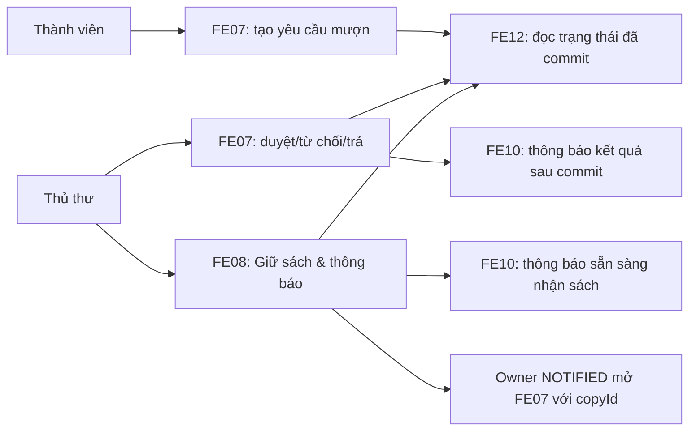

# FE07-FE08-FE10-FE12: Bản đồ trình bày code và nghiệp vụ

Tài liệu này giúp lần theo code khi bảo vệ. Nó không thay thế bốn `SPEC.md` và
không tạo quy tắc nghiệp vụ mới.

## Cách dùng trong lúc bảo vệ

Khi thầy cô hỏi một thao tác, mở code theo đúng thứ tự sau:

```text
Trang React -> libraryFeatureApi -> Route + validator -> Controller
-> Service -> Repository -> SQL Server
```

Bạn chỉ cần nói theo mẫu: **bấm gì -> gửi gì -> server kiểm tra gì -> dữ liệu
nào đổi/được đọc -> người dùng thấy gì**. Danh tính người thao tác luôn đến từ
`Authorization: Bearer <accessToken>`, không phải một trường do form tự gửi.

## Luồng liên hoàn FE07 -> FE08 -> FE10 -> FE12



1. Thành viên tạo yêu cầu mượn tại FE07. Server đánh giá điều kiện và ghi
   transaction, không tin kết quả kiểm tra ở giao diện.
2. Thủ thư duyệt hoặc từ chối tại FE07. Sau khi transaction nguồn đã commit,
   FE07 có thể yêu cầu FE10 tạo **một** thông báo kết quả an toàn.
3. Việc trả sách FE07 chỉ trả handoff đọc về hàng đợi. Thủ thư phải chủ động mở
   FE08 và chọn **Giữ sách & thông báo** để xử lý hàng đợi.
4. FE08 chọn người hợp lệ đầu tiên, giữ đúng bản sao, rồi yêu cầu FE10 thông
   báo. Chủ sở hữu reservation `NOTIFIED` mới được chuyển sang FE07 với đúng
   `copyId`; FE07 vẫn đánh giá lại điều kiện mượn ở server.
5. FE12 chỉ đọc snapshot/danh sách từ dữ liệu đã commit. Frontend không tự
   cộng KPI từ các trang danh sách.

Năm câu trên tương ứng các ranh giới `BR-FE07-035` đến `BR-FE07-037`,
`BR-FE08-021` đến `BR-FE08-022`, `BR-FE10-021` đến `BR-FE10-023`, và
`BR-FE12-017` đến `BR-FE12-020`.

## FE07 — Quản lý mượn sách

### Khi thầy cô hỏi gì

“FE07 cho thành viên tạo yêu cầu mượn; Thủ thư/Quản trị viên mới duyệt, từ
chối, trả hoặc gia hạn. Quyết định nghiệp vụ nằm trong service và transaction,
không nằm ở nút giao diện.”

### Bấm ở đâu

| Actor | Route và page |
| --- | --- |
| Thành viên tạo yêu cầu | `/borrowing/new` -> `frontend/src/page/borrowing/BorrowRequestPage.jsx` |
| Thủ thư quyết định yêu cầu | `/librarian/borrow-requests` -> `frontend/src/page/borrowing/BorrowRequestsAdminPage.jsx` |
| Thủ thư trả sách | `/librarian/returns` -> `frontend/src/page/borrowing/ProcessReturnsPage.jsx` |
| Thành viên xem lịch sử | `/borrowing/history` -> `frontend/src/page/borrowing/BorrowingHistoryPage.jsx` |

### Request

| Thao tác | HTTP request từ `borrowingApi` |
| --- | --- |
| Tạo yêu cầu | `POST /api/borrow-requests` với `{ copyIds: [...] }` |
| Duyệt | `PATCH /api/borrow-requests/:requestId/approve` với `{}` hoặc dữ liệu UI được validator cho phép |
| Từ chối | `PATCH /api/borrow-requests/:requestId/reject` với `{ reason }` |
| Trả sách | `PATCH /api/borrow-details/:borrowDetailId/return` với `{ condition }` |
| Gia hạn | `PATCH /api/borrow-details/:borrowDetailId/renew` với `{}` |
| Lịch sử của tôi | `GET /api/borrow-requests/me` với query filter/phân trang |

### Server xử lý

Mở lần lượt:

```text
frontend/src/api/libraryFeatureApi.js: borrowingApi
backend/src/routes/borrowingRoutes.js
backend/src/controllers/borrowingController.js
backend/src/services/borrowingService.js
backend/src/repositories/borrowingRepository.js
```

Route kiểm tra đăng nhập, role và validator. Controller truyền `req.body`,
`req.params`, `req.query` cùng `req.user` vào service. Các hàm service chính là
`createBorrowRequest`, `approveBorrowRequest`, `rejectBorrowRequest`,
`returnBorrowDetail` và `renewBorrowDetail`.

Khi trình bày phần khó, mở `borrowingService.js` và nói: service kiểm tra điều
kiện mượn, ưu tiên reservation, giới hạn mượn, quá hạn/phạt; repository thực
hiện transaction và khóa theo thứ tự đã đặc tả. Đây là lý do hai thao tác xung
đột không cùng được duyệt thành công (`FR-FE07-019`).

### Dữ liệu

`BorrowRequests` giữ trạng thái yêu cầu; `BorrowDetails` giữ trạng thái theo
bản sao; `BookCopies` phản ánh bản sao vật lý. Service còn đọc `Fines` để chặn
khi có phạt chưa thanh toán và đọc/cập nhật `Reservations` theo quy tắc ưu
tiên. `AuditLogs` lưu dấu vết thao tác quan trọng.

Điểm nên nhớ: `OVERDUE` là trạng thái **dẫn xuất** từ `dueDate` theo ngày kinh
doanh `Asia/Ho_Chi_Minh`; không được giải thích là trạng thái được tự do ghi
vào `BorrowDetails`.

### Kết quả thật

- Tạo yêu cầu chỉ thành công theo chính sách tất cả-hoặc-không; không tạo một
  yêu cầu nửa chừng.
- Duyệt chuyển chi tiết phù hợp thành mượn, cập nhật bản sao và có thể hoàn tất
  reservation `NOTIFIED` đúng owner trong cùng transaction.
- Trả sách cập nhật trạng thái chi tiết, ngày trả và trạng thái bản sao. Nếu có
  hàng đợi, response chỉ đưa `reservationQueueAction` đọc để chỉ đường sang
  `/librarian/reservations`; nó không tự xử lý FE08.
- Sau duyệt/từ chối/trả/gia hạn, FE10 được yêu cầu sau commit với source key
  lũy đẳng. Nếu FE10 lỗi, FE07 vẫn giữ kết quả transaction và UI chỉ hiển thị
  cảnh báo trung thực (`BR-FE07-035`).

## FE08 — Quản lý đặt chỗ

### Khi thầy cô hỏi gì

“FE08 quản lý hàng đợi cho **bản sao vật lý**. Thành viên đặt hoặc hủy của mình;
Thủ thư chủ động chọn thao tác xử lý hàng đợi để giữ sách cho người hợp lệ đầu
tiên. FE08 không tự chọn người thắng từ frontend.”

### Bấm ở đâu

| Actor | Route và page |
| --- | --- |
| Thành viên đặt/xem/hủy | `/reservations/mine` -> `frontend/src/page/reservation/MyReservationsPage.jsx` |
| Thủ thư xử lý hàng đợi | `/librarian/reservations` -> `frontend/src/page/reservation/ReservationsLibrarianPage.jsx` |

### Request

| Thao tác | HTTP request từ `reservationApi` |
| --- | --- |
| Tạo reservation | `POST /api/reservations` với `{ copyId }` |
| Hủy reservation của mình | `PATCH /api/reservations/:reservationId/cancel` với `{ reason }` |
| Xem của mình | `GET /api/reservations/me` |
| Thủ thư xem hàng đợi | `GET /api/reservations` |
| Giữ sách & thông báo | `POST /api/reservations/process-queue` với `{ copyId }` |
| Xử lý lượt giữ hết hạn | `POST /api/reservations/expire-holds` không có body |

### Server xử lý

Mở lần lượt:

```text
frontend/src/api/libraryFeatureApi.js: reservationApi
backend/src/routes/reservationRoutes.js
backend/src/controllers/reservationController.js
backend/src/services/reservationService.js
backend/src/repositories/reservationRepository.js
```

Các hàm service cần tìm là `createReservation`, `cancelReservation`,
`processQueue` và `expireHolds`. `processQueue` là nơi server quyết định người
hợp lệ đầu tiên và giữ bản sao; giao diện chỉ gửi `copyId`, không gửi `userId`
hay kết quả xếp hạng để áp đặt lên server.

### Dữ liệu

`Reservations` lưu owner, `copyId`, thứ tự và trạng thái hàng đợi;
`BookCopies` xác nhận trạng thái bản sao. Khi cần, service đọc trạng thái mượn
và điều kiện thành viên để không đưa một người đã không đủ điều kiện lên nhận
bản sao đang giữ.

### Kết quả thật

- Reservation `NOTIFIED` chỉ hiển thị CTA tạo yêu cầu mượn cho đúng owner
  (`BR-FE08-021`). CTA đưa đúng `copyId` sang FE07, nhưng FE07 vẫn kiểm tra lại
  điều kiện mượn.
- Xử lý queue là thao tác có chủ ý của Thủ thư. Race chỉ cho một transaction
  thắng; xung đột trạng thái trả `409` để UI tải lại dữ liệu chính tắc.
- FE10 lỗi sau khi lượt giữ đã commit không rollback lượt giữ FE08. UI chỉ nhận
  cảnh báo an toàn, không lộ chi tiết nhà cung cấp (`BR-FE08-022`).

## FE10 — Thông báo cá nhân

### Khi thầy cô hỏi gì

“FE10 không phải một nút gửi email tự do ở frontend. FE07 và FE08 gọi source
processor ở backend sau nghiệp vụ nguồn; thành viên xem kết quả qua hộp thư cá
nhân đã đăng nhập.”

### Bấm ở đâu

Sau đăng nhập, mở `/notifications` ->
`frontend/src/page/notification/NotificationsPage.jsx`. Chuông trong
`frontend/src/component/notification/NotificationBell.jsx` chỉ hiển thị preview
và số chưa đọc. Nếu chưa đăng nhập, route đưa người dùng về `/login`.

### Request

| Thao tác inbox | HTTP request từ `notificationInboxApi` |
| --- | --- |
| Xem hộp thư | `GET /api/notifications/mine` |
| Lấy số chưa đọc | `GET /api/notifications/mine/unread-count` |
| Đánh dấu một bản ghi đã đọc | `PATCH /api/notifications/:id/read` |
| Đánh dấu tất cả đã đọc | `PATCH /api/notifications/mine/read-all` |

FE07/FE08 không lấy payload thông báo do form người dùng tự tạo. Các source
processor trong `borrowingService`/`reservationService` yêu cầu
`notificationService` với template và source key chuẩn.

### Server xử lý

Mở lần lượt:

```text
frontend/src/api/libraryFeatureApi.js: notificationInboxApi
backend/src/routes/notificationRoutes.js
backend/src/controllers/notificationController.js
backend/src/services/notificationService.js
backend/src/repositories/notificationRepository.js
```

Service giới hạn source/template, kiểm tra ownership và recipient, làm sạch
payload, rồi xử lý replay cùng source key bằng bản ghi có sẵn thay vì tạo bản
ghi trùng. Đây là idempotency được yêu cầu bởi `FR-FE10-018`.

### Dữ liệu

Repository quản lý các yêu cầu, delivery và bản ghi inbox thông báo; API inbox
chỉ đọc/cập nhật read state của **chính người nhận**. Không expose token, email,
lý do từ chối, stack trace hay chi tiết provider trong payload kết quả mượn.

### Kết quả thật

- Duyệt/từ chối FE07 tạo đúng một kết quả inbox cho người nhận hợp lệ.
- Nhấn notification có thể đánh dấu đã đọc theo best-effort và dẫn tới action
  path cố định `/borrowing/history`; caller không được tự gửi URL
  (`BR-FE10-022`).
- Lỗi delivery không rollback nguồn FE07/FE08; đây là cách bảo toàn transaction
  thư viện và không phải một lỗi bị che giấu (`AC-FE10-020`). Payload vẫn giữ
  ranh giới dữ liệu nhạy cảm của `BR-FE10-023`.

## FE12 — Báo cáo và thống kê

### Khi thầy cô hỏi gì

“FE12 là lớp đọc phục vụ vận hành. Chỉ Librarian/Admin được gọi API; service và
repository trả số liệu dựa trên trạng thái nguồn chính tắc, frontend chỉ hiển
thị và gửi bộ lọc.”

### Bấm ở đâu

| Báo cáo | Route và page |
| --- | --- |
| Báo cáo mượn | `/reports/borrowing` -> `frontend/src/page/report/BorrowingReportPage.jsx` |
| Báo cáo tồn kho | `/reports/inventory` -> `frontend/src/page/report/InventoryReportPage.jsx` |
| Thống kê người dùng | `/reports/users` -> `frontend/src/page/report/UserStatisticsPage.jsx` |

`reportApi.operationsSummary()` gọi `GET /api/reports/operations-summary` cho
tổng quan vận hành của Staff; nó không có quyền ghi dữ liệu.

### Request

| Báo cáo | HTTP request và query allowlist |
| --- | --- |
| Borrowing | `GET /api/reports/borrowing` với `q`, `fromDate`, `toDate`, `status`, `userId`, `bookId`, `page`, `limit` |
| Inventory | `GET /api/reports/inventory` với `q`, `categoryId`, `status`, `location`, `bookId`, `page`, `limit` |
| User statistics | `GET /api/reports/users` với `q`, `fromDate`, `toDate`, `status`, `membershipStatus`, `roleId`, `page`, `limit` |
| Operations summary | `GET /api/reports/operations-summary` không nhận query tự do |

### Server xử lý

Mở lần lượt:

```text
frontend/src/api/libraryFeatureApi.js: reportApi
backend/src/routes/reportRoutes.js
backend/src/controllers/reportController.js
backend/src/services/reportService.js
backend/src/repositories/reportRepository.js
```

Route yêu cầu `LIBRARIAN` hoặc `ADMIN` và validator chỉ cho phép query đã công
bố. Service gọi `getBorrowingReport`, `getInventoryReport`,
`getUserStatistics` hoặc operations summary, truyền ngày kinh doanh rõ ràng
cho repository khi có phân loại quá hạn.

### Dữ liệu

`reportRepository` đọc các thực thể nguồn như yêu cầu/chi tiết mượn, bản sao,
reservation, sách và người dùng. Nó không được ghi transaction nghiệp vụ. Với
operations summary, sáu KPI được tính ở server từ một snapshot và dùng cùng một
`businessDate` theo `Asia/Ho_Chi_Minh`.

### Kết quả thật

- Member/Guest bị từ chối trước khi repository chạy.
- Kết quả phân trang, filter và aggregate là response server; giao diện không
  đổi nó thành số liệu khác.
- KPI thiếu/lỗi phải hiển thị trạng thái không tải được, không giả thành `0`
  (`BR-FE12-019`).

## Câu hỏi phản biện thường gặp

| Câu hỏi | Câu trả lời ngắn và file nên mở |
| --- | --- |
| “Tại sao không để frontend tự xét điều kiện mượn?” | Client chỉ hỗ trợ UX. `backend/src/services/borrowingService.js` mới có actor đã xác thực, trạng thái hiện tại và transaction để kiểm tra đúng. |
| “Nếu hai Thủ thư duyệt cùng một bản sao?” | FE07 khóa và xác nhận lại trong transaction; tối đa một thao tác xung đột thắng. Mở `borrowingService.js` và `borrowingRepository.js`, dẫn `FR-FE07-019`. |
| “Trả sách có tự phát cho người đặt đầu không?” | Không. FE07 trả handoff đọc; Thủ thư phải chạy `reservationApi.processQueue(copyId)` ở FE08. Mở `reservationService.js`, dẫn `BR-FE07-036`. |
| “Thông báo lỗi có làm mất kết quả mượn/giữ sách không?” | Không. Notification được yêu cầu sau commit và có idempotency; FE07/FE08 giữ transaction nguồn, UI hiện cảnh báo an toàn. |
| “Tại sao người khác không đọc được thông báo của tôi?” | Inboxes được scope theo actor đã xác thực tại route/controller/service, không nhận `recipientId` do browser áp đặt. |
| “Tại sao báo cáo không tính ở React?” | FE12 là read-only và cần cùng business date/trạng thái chính tắc. `reportService.js` và `reportRepository.js` tạo dữ liệu server-derived. |

## Bảng mở file nhanh

| Muốn giải thích | Mở file đầu tiên | Sau đó mở |
| --- | --- | --- |
| Thành viên tạo yêu cầu mượn | `frontend/src/page/borrowing/BorrowRequestPage.jsx` | `libraryFeatureApi.js` -> `borrowingRoutes.js` -> `borrowingController.js` -> `borrowingService.js` -> `borrowingRepository.js` |
| Thủ thư duyệt/trả | `frontend/src/page/borrowing/BorrowRequestsAdminPage.jsx` hoặc `ProcessReturnsPage.jsx` | Chuỗi FE07 ở trên |
| Thủ thư giữ sách và thông báo | `frontend/src/page/reservation/ReservationsLibrarianPage.jsx` | `reservationRoutes.js` -> `reservationController.js` -> `reservationService.js` -> `reservationRepository.js` |
| Thành viên xem notification | `frontend/src/page/notification/NotificationsPage.jsx` | `libraryFeatureApi.js` -> `notificationRoutes.js` -> `notificationController.js` -> `notificationService.js` -> `notificationRepository.js` |
| Thủ thư xem báo cáo | `frontend/src/page/report/BorrowingReportPage.jsx` | `libraryFeatureApi.js` -> `reportRoutes.js` -> `reportController.js` -> `reportService.js` -> `reportRepository.js` |
