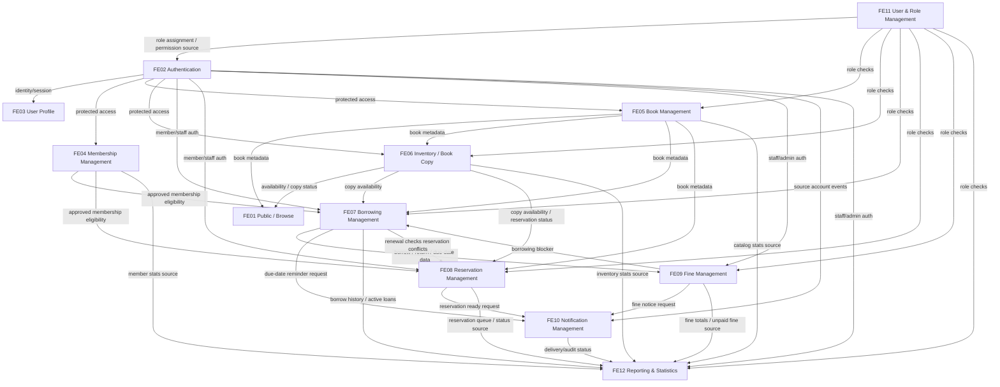
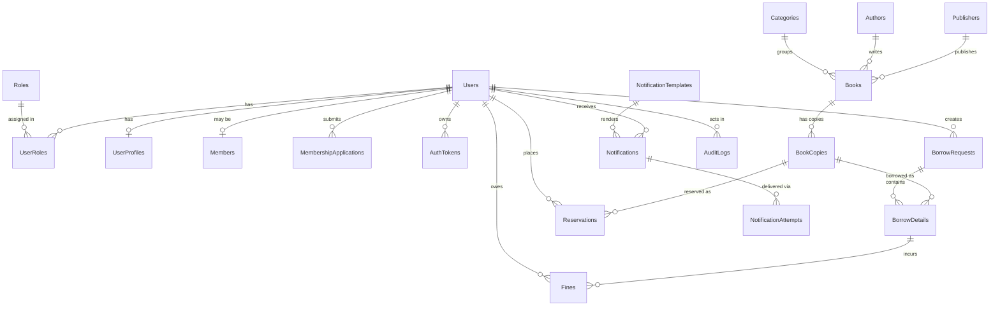

# Feature Integration Map - Library Management System

Version: 1.0.0

Status: APPROVED

Last Updated: 2026-06-25

> This is the Layer 1 (system-level) "big picture" that links the 12 separately-owned feature specs. Approved on 2026-06-25 together with the system ERD (Section 4.1).

---

## 1. Purpose

This document explains how the separately specified Phase 1 features connect to each other.

It answers the question:

> If every feature has its own `SPEC.md`, how does the team know what kind of relationship exists between those features?

The answer follows the Spec-Driven and Agent-Driven Development playbook:

- feature specs are separated for ownership and clarity;
- cross-feature relationships are recorded through dependency sections, data flow, API contracts, task dependencies, traceability, and integration tests;
- no feature should secretly depend on another feature without a documented integration point.

This document is the central map that summarizes those relationships for the Library Management System.

---

## 2. Playbook Basis

The playbook guidance used here:

| Playbook Concept | Meaning For This Project |
| --- | --- |
| `SPEC.md` with Dependencies / Integration Points | Each feature declares what it needs from other features and what it provides to them. |
| `PLAN.md` Data Flow | Each feature plan should show how data moves from user input to processing, storage, response, and downstream features. |
| `PLAN.md` Dependencies | Each feature plan should show what must exist before implementation can work. |
| `TASKS.md` Dependencies | Implementation tasks must be ordered so dependent work happens after prerequisite work. |
| Traceability Matrix | Requirements should trace to code and tests, including cross-feature behavior. |
| Consistency Gate | Before merge, compare `SPEC`, `PLAN`, `TASKS`, `CODE`, and `TESTS` to catch drift. |
| API Contracts / Data Models | Integration between features should happen through agreed REST APIs, shared database entities, or documented service boundaries. |

The important rule:

```text
Separated feature specs do not mean isolated features.
Separated feature specs must still declare their integration points.
```

---

## 3. Integration Relationship Types

Use these relationship types when reading the matrix below.

| Type | Meaning | Example |
| --- | --- | --- |
| Auth / Role dependency | A feature requires authenticated identity or role checks. | FE07 requires FE02 auth and FE11 roles for borrow approval. |
| Data owner dependency | One feature owns data that another feature reads. | FE06 owns copy status used by FE07 and FE08. |
| Eligibility dependency | One feature decides whether a user is allowed to do something. | FE04 membership approval affects FE07 borrowing and FE08 reservation. |
| Workflow trigger | One feature creates an event/action for another feature. | FE07 borrow approval triggers FE10 due-date notification. |
| Reporting source | A feature produces records aggregated by reports. | FE07 borrow records feed FE12 reports. |
| Safety / privacy boundary | A feature must not expose or mutate another feature's protected data. | FE03 profile must not change FE11 roles or FE04 membership status. |
| Conflict check | One feature must check another feature's state before changing status. | FE06 manual copy status changes must not override active FE07/FE08 records. |

---

## 4. High-Level Feature Dependency Graph



---

## 4.1 System Data Model (ERD)

The features above are also linked at the data layer: they share one relational schema
(`database/Librarymanagement.sql`). This ERD shows how the core entities connect. Relationships
are derived from the actual foreign keys in the schema. Per-column details and validation rules
live in each feature `SPEC.md` (Section 10) and in `ADR-002-database-design.md`.



### Entity ownership (which feature owns which table)

| Entity | Owning Feature(s) |
| --- | --- |
| `Users`, `Roles`, `UserRoles` | FE02 Authentication, FE11 User & Role |
| `UserProfiles` | FE03 User Profile |
| `Members`, `MembershipApplications` | FE04 Membership |
| `AuthTokens` | FE02 Authentication |
| `Categories`, `Authors`, `Publishers`, `Books` | FE05 Book Management (FE01 reads) |
| `BookCopies` | FE06 Inventory / Book Copy |
| `BorrowRequests`, `BorrowDetails` | FE07 Borrowing |
| `Reservations` | FE08 Reservation |
| `Fines` | FE09 Fine |
| `NotificationTemplates`, `Notifications`, `NotificationAttempts` | FE10 Notification |
| `AuditLogs` | Cross-feature (FE02, FE05, FE07, FE09, FE11) |

A feature must only write the tables it owns; cross-feature access goes through the documented
integration points in Section 5, never by directly mutating another feature's tables.

---

## 5. Feature-by-Feature Integration Matrix

| Feature | Depends On | Provides To Others | Integration Type |
| --- | --- | --- | --- |
| FE01 Public / Browse | FE05 book metadata, FE06 public availability, FE02 login/register navigation, FE04 membership application navigation | Public discovery flow before auth/membership | Data read, safety/privacy boundary |
| FE02 Authentication | FE11 role data / user-role tables | Identity, tokens, sessions, account events, protected request user context | Auth / role foundation |
| FE03 User Profile | FE02 authenticated identity, FE04 membership status read-only, FE11 role/status read-only | Safe personal profile data for workflows | Data read, safety/privacy boundary |
| FE04 Membership Management | FE02 authenticated user, FE11 staff/admin roles | Approved membership status for FE07/FE08 and member stats for FE12 | Eligibility dependency |
| FE05 Book Management | FE02 auth, FE11 staff/admin roles | Book metadata for FE01/FE06/FE07/FE08/FE12 | Data owner dependency |
| FE06 Inventory / Book Copy | FE02 auth, FE05 book metadata, FE11 staff/admin roles, FE07/FE08 conflict records | Copy availability and copy status for FE01/FE07/FE08/FE12 | Data owner dependency, conflict check |
| FE07 Borrowing Management | FE02 auth, FE04 membership, FE06 copy availability, FE08 reservation conflict, FE09 unpaid fine blocker, FE11 roles | Borrow records, due dates, return data, notification requests, report data | Core workflow, trigger, reporting source |
| FE08 Reservation Management | FE02 auth, FE04 membership, FE06 copy status, FE11 roles | Reservation queue/status, reservation-ready notification requests, renewal conflict data | Core workflow, trigger, conflict check |
| FE09 Fine Management | FE02 auth, FE07 borrow/return/due-date data, FE11 roles | Fine records, unpaid fine blockers, fine notifications, report data | Derived workflow, eligibility blocker |
| FE10 Notification Management | Source features FE02/FE07/FE08/FE09, approved templates, email/mock provider | Notification records, delivery attempts/status | Workflow trigger receiver |
| FE11 User & Role Management | FE02/role tables, admin identity, FE10 for password setup links if needed | Role assignments and account lifecycle data used by protected features | Authorization data owner |
| FE12 Reporting & Statistics | FE02 auth, FE11 roles, FE04 membership, FE06 inventory, FE07 borrowing, FE08 reservations, FE09 fines | Read-only aggregate reports | Reporting source aggregation |

---

## 6. Cross-Feature Flow Map

### 6.1 Public Discovery To Membership

```text
FE01 Public / Browse
  -> reads FE05 book metadata
  -> optionally reads FE06 public availability
  -> links user to FE02 login/register
  -> after registration, user may apply via FE04 Membership
```

Evidence in specs:

- FE01 depends on FE06 for public availability.
- FE01 depends on FE02 for login/register navigation.
- FE01 depends on FE04 for membership application after discovery.

### 6.2 Authentication And Protected Feature Access

```text
FE02 Authentication
  -> verifies identity/session
  -> returns userId and roles
  -> protected features enforce role checks
  -> FE11 manages user-role data
```

Used by:

- FE03 Profile
- FE04 Membership
- FE05 Book Management
- FE06 Inventory
- FE07 Borrowing
- FE08 Reservation
- FE09 Fine
- FE10 Notification APIs
- FE12 Reporting

### 6.3 Borrowing Core Flow

```text
FE02 Auth
  -> FE04 Membership eligibility
  -> FE06 Copy availability
  -> FE07 Borrow request / approval / return
  -> FE10 Due-date notification
  -> FE09 Fine candidate or fine data if overdue/damaged/lost
  -> FE12 Borrowing reports
```

Integration notes:

- FE07 must not let guests borrow.
- FE07 must require approved membership.
- FE07 uses copy availability from FE06.
- FE07 checks reservation conflict from FE08 for renewal.
- FE07 exposes overdue/damaged/lost return data for FE09.
- FE07 creates notification requirements for FE10.
- FE07 produces report data for FE12.

### 6.4 Reservation Core Flow

```text
FE02 Auth
  -> FE04 Membership eligibility
  -> FE06 Copy/book availability
  -> FE08 Reservation queue
  -> FE10 Reservation-ready notification
  -> FE12 Reservation/reporting data
```

Integration notes:

- FE08 must require approved membership.
- FE08 uses inventory/copy status from FE06.
- FE08 triggers FE10 when a reserved book becomes available.
- FE08 can affect FE07 renewal decisions through reservation conflicts.

### 6.5 Fine Flow

```text
FE07 Borrowing return/due-date data
  -> FE09 Fine calculation
  -> FE09 unpaid fine status
  -> FE07 borrowing eligibility blocker
  -> FE10 fine/overdue notification
  -> FE12 fine/reporting aggregates
```

Integration notes:

- FE09 calculation is derived from FE07 borrowing records.
- FE09 unpaid fine can block future FE07 borrowing.
- FE09 can request FE10 fine notifications.
- FE09 feeds FE12 reporting.

### 6.6 Reporting Flow

```text
FE12 Reporting reads from:
  -> FE04 Membership
  -> FE06 Inventory / Copy status
  -> FE07 Borrowing
  -> FE08 Reservation
  -> FE09 Fine
  -> FE11 Users/Roles
```

Integration notes:

- FE12 is read-only.
- FE12 must not mutate business records.
- FE12 must enforce staff/admin access through FE02/FE11.

---

## 7. Integration Evidence From Current Automated Tests

| Flow | Evidence Test File | Current Coverage |
| --- | --- | --- |
| FE02 -> FE07 | `backend/tests/integration.test.js` | Member registers/verifies/logs in, then creates borrow request. |
| FE02 -> FE08 | `backend/tests/integration.test.js` | Member registers/verifies/logs in, then creates reservation. |
| FE02 -> FE10 | `backend/tests/integration.test.js` | Staff user authenticates, then creates notification request. |
| FE02 -> FE12 | `backend/tests/integration.test.js` | Admin/staff authenticates, then views borrowing report. |
| FE07 -> FE10 | `backend/tests/integration.test.js`, `backend/tests/borrowingRoutes.test.js` | Borrow approval creates due-date reminder notification data. |
| FE07 -> FE09 | `backend/tests/integration.test.js`, `backend/tests/borrowingRoutes.test.js` | Overdue/damaged return exposes fine candidate data. |
| FE08 -> FE10 | `backend/tests/reservationRoutes.test.js` | Processing reservation queue creates reservation-ready notification data. |
| FE09 permissions / fine behavior | `backend/tests/fineRoutes.test.js` | Fine APIs and business rules are tested. |
| FE12 aggregation | `backend/tests/reportRoutes.test.js` | Borrowing, inventory, and user reports aggregate source data without mutating it. |

Known test gaps:

- No browser E2E test currently proves full UI-level cross-feature flows.
- No SQL Server-backed integration test currently proves DB schema-level integration.
- FE01/FE04/FE05/FE06 backend coverage should be reviewed and expanded if code is implemented.

---

## 8. How To Know A New Feature Link Is Valid

When adding or changing a feature relationship, the team should update these artifacts:

| Artifact | Required Update |
| --- | --- |
| Source feature `SPEC.md` | Add dependency / integration point / trigger rule. |
| Target feature `SPEC.md` | Add accepted input/event/API or out-of-scope boundary. |
| `PLAN.md` | Add data flow and dependency order. |
| `TASKS.md` | Add dependent implementation/test tasks. |
| Code | Implement through agreed service/API/repository boundary. |
| Tests | Add unit/API/integration tests for the relationship. |
| Docs | Update this map if the relationship is project-level. |

Reviewer question:

```text
Can I trace this feature link from spec -> plan -> task -> code -> test?
```

If the answer is no, the integration is not documented enough.

---

## 9. Consistency Gate For Cross-Feature Changes

Before merging cross-feature work, verify:

- [ ] The source feature spec declares the outgoing integration.
- [ ] The target feature spec declares the incoming dependency or accepted request.
- [ ] Data ownership is clear.
- [ ] The feature does not mutate data owned by another feature without an approved rule.
- [ ] Role/auth requirements are enforced by backend code.
- [ ] A test covers the cross-feature path, or manual evidence is documented.
- [ ] Reporting remains read-only.
- [ ] Notification payloads do not expose secrets or sensitive tokens.
- [ ] Out-of-scope UI or workflow was not added accidentally.

---

## 10. Teacher-Facing Short Answer

If asked in a presentation, use this answer:

> We split specs per feature for ownership, but we do not treat features as isolated. Each feature declares its dependencies and integration points in `SPEC.md`. Then `PLAN.md` describes data flow and implementation dependencies, `TASKS.md` orders the dependent tasks, and the traceability/consistency gate checks `SPEC`, `PLAN`, `TASKS`, `CODE`, and `TESTS` together. Cross-feature flows such as Auth to Borrowing, Borrowing to Notification, Borrowing to Fine, and Reporting aggregation are verified with integration tests. So the relationship between features is known through documented dependencies, data flow, traceability, and tests.

Vietnamese version:

> Tụi em tách spec theo feature để dễ phân công, nhưng không xem các feature là rời rạc. Mỗi `SPEC.md` có phần dependencies và integration points để nói feature đó phụ thuộc ai và cung cấp gì. Sau đó `PLAN.md` mô tả data flow, `TASKS.md` ghi dependency giữa các task, còn traceability matrix và consistency gate kiểm tra chéo giữa spec, plan, task, code và test. Các luồng liên feature như Auth -> Borrowing, Borrowing -> Notification, Borrowing -> Fine, Reporting tổng hợp dữ liệu được kiểm chứng bằng integration tests.

---

## 11. Maintenance Rules

Update this document when:

- a new feature is added;
- a feature starts reading/writing another feature's data;
- a new notification/event trigger is introduced;
- a new report source is added;
- role/permission ownership changes;
- API contracts change;
- integration tests are added or removed.

This document should be reviewed during major SDD documentation passes and before final project defense.

