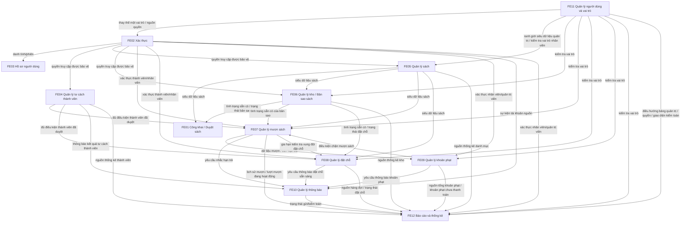
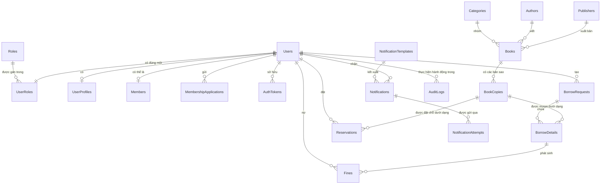

# Bản đồ tích hợp chức năng - Hệ thống quản lý thư viện

Phiên bản: 1.3.0

Trạng thái: H1 GOVERNANCE ACTIVATION - APPROVED; AWAITING H3/hợp nhất

Cập nhật lần cuối: 2026-07-29

> Đây là "bức tranh lớn" Lớp 1 (cấp hệ thống) liên kết 12 thông số chức năng được sở hữu riêng. Được phê duyệt vào ngày 25-06-2026 cùng với hệ thống ERD (Mục 4.1).

---

## 1. Mục đích

Tài liệu này giải thích cách các chức năng của Giai đoạn 1 được chỉ định riêng kết nối với nhau.

Nó trả lời câu hỏi:

> Nếu mọi chức năng đều có `SPEC.md` riêng, làm thế nào nhóm biết được mối quan hệ tồn tại giữa các chức năng đó?

Câu trả lời tuân theo cẩm nang Phát triển theo hướng đặc tả và theo hướng tác nhân:

- đặc tả chức năng được tách biệt để đảm bảo quyền sở hữu và tính rõ ràng;
- các mối quan hệ giữa nhiều chức năng được ghi lại thông qua các phần phụ thuộc, luồng dữ liệu, hợp đồng API, các phần phụ thuộc của nhiệm vụ, khả năng truy vết và kiểm tra tích hợp;
- không có chức năng nào được bí mật phụ thuộc vào chức năng khác mà không có điểm tích hợp được ghi lại.

Tài liệu này là bản đồ trung tâm tóm tắt các mối quan hệ đó cho Hệ thống quản lý thư viện.

---

## 2. Cơ sở cẩm nang

Hướng dẫn cẩm nang được sử dụng ở đây:

| Khái niệm cẩm nang | Ý Nghĩa Cho Dự Án Này |
| --- | --- |
| `SPEC.md` với các phần phụ thuộc / điểm tích hợp | Mỗi chức năng khai báo những gì nó cần từ các chức năng khác và những gì nó cung cấp cho chúng. |
| Luồng dữ liệu `PLAN.md` | Mỗi gói chức năng sẽ hiển thị cách dữ liệu di chuyển từ đầu vào của người dùng đến các chức năng xử lý, lưu trữ, phản hồi và hạ nguồn. |
| Phụ thuộc `PLAN.md` | Mỗi gói chức năng sẽ hiển thị những gì phải tồn tại trước khi việc triển khai có thể hoạt động. |
| Phụ thuộc `TASKS.md` | Nhiệm vụ triển khai phải được sắp xếp sao cho công việc phụ thuộc diễn ra sau công việc tiên quyết. |
| Ma trận truy vết | Các yêu cầu phải theo dõi mã và kiểm tra, bao gồm cả hành vi của nhiều chức năng. |
| Cổng nhất quán | Trước khi hợp nhất, hãy so sánh `SPEC`, `PLAN`, `TASKS`, `CODE` và `TESTS` để nắm bắt sự trôi dạt. |
| Hợp đồng / Mô hình dữ liệu API | Việc tích hợp giữa các chức năng sẽ diễn ra thông qua các API REST đã được thống nhất, các thực thể cơ sở dữ liệu dùng chung hoặc ranh giới dịch vụ được ghi lại. |

Nguyên tắc quan trọng:

```text
Các đặc tả chức năng tách biệt không có nghĩa là các chức năng hoạt động độc lập.
Mỗi đặc tả chức năng vẫn phải khai báo rõ các điểm tích hợp của mình.
```

---

## 3. Các loại mối quan hệ tích hợp

Sử dụng các loại mối quan hệ này khi đọc ma trận bên dưới.

| Loại | Ý nghĩa | Ví dụ |
| --- | --- | --- |
| Phụ thuộc xác thực/vai trò | Một chức năng yêu cầu kiểm tra danh tính hoặc vai trò được xác thực. | FE07 yêu cầu vai trò xác thực FE02 và FE11 để phê duyệt lượt mượn. |
| Sự phụ thuộc của chủ sở hữu dữ liệu | Một chức năng sở hữu dữ liệu mà chức năng khác đọc. | FE06 sở hữu trạng thái sao chép được sử dụng bởi FE07 và FE08. |
| Sự phụ thuộc đủ điều kiện | Một chức năng quyết định liệu người dùng có được phép làm điều gì đó hay không. | Phê duyệt thành viên FE04 ảnh hưởng đến việc vay FE07 và đặt chỗ FE08. |
| Trình kích hoạt quy trình làm việc | Một chức năng tạo event/hành động cho chức năng khác. | Phê duyệt lượt mượn FE07 kích hoạt thông báo ngày đến hạn của FE10. |
| Nguồn báo cáo | Một chức năng tạo ra các bản ghi được tổng hợp theo báo cáo. | FE07 mượn hồ sơ cung cấp báo cáo FE12. |
| Ranh giới an toàn/riêng tư | Một chức năng không được tiết lộ hoặc thay đổi dữ liệu được bảo vệ của chức năng khác. | Hồ sơ FE03 không được thay đổi vai trò FE11 hoặc trạng thái thành viên FE04. |
| Kiểm tra xung đột | Một chức năng phải kiểm tra trạng thái của chức năng khác trước khi thay đổi trạng thái. | Các thay đổi trạng thái sao chép thủ công của FE06 không được ghi đè các bản ghi FE07/FE08 đang hoạt động. |

---

## 4. Biểu đồ phụ thuộc chức năng cấp cao


```mermaid
flowchart TD
  FE02["FE02 Xác thực"]
  FE11["FE11 Quản lý người dùng và vai trò"]
  FE03["FE03 Hồ sơ người dùng"]
  FE04["FE04 Quản lý tư cách thành viên"]
  FE01["FE01 Công khai / Duyệt sách"]
  FE05["FE05 Quản lý sách"]
  FE06["FE06 Quản lý kho / Bản sao sách"]
  FE07["FE07 Quản lý mượn sách"]
  FE08["FE08 Quản lý đặt chỗ"]
  FE09["FE09 Quản lý khoản phạt"]
  FE10["FE10 Quản lý thông báo"]
  FE12["FE12 Báo cáo và thống kê"]

  FE02 -->|"danh tính/phiên"| FE03
  FE02 -->|"quyền truy cập được bảo vệ"| FE04
  FE02 -->|"quyền truy cập được bảo vệ"| FE05
  FE02 -->|"quyền truy cập được bảo vệ"| FE06
  FE02 -->|"xác thực thành viên/nhân viên"| FE07
  FE02 -->|"xác thực thành viên/nhân viên"| FE08
  FE02 -->|"xác thực nhân viên/quản trị viên"| FE09
  FE02 -->|"sự kiện tài khoản nguồn"| FE10
  FE02 -->|"xác thực nhân viên/quản trị viên"| FE12

  FE11 -->|"thay thế một vai trò / nguồn quyền"| FE02
  FE11 -->|"ranh giới siêu dữ liệu quản trị / kiểm tra vai trò nhân viên"| FE05
  FE11 -->|"kiểm tra vai trò"| FE06
  FE11 -->|"kiểm tra vai trò"| FE07
  FE11 -->|"kiểm tra vai trò"| FE08
  FE11 -->|"kiểm tra vai trò"| FE09
  FE11 -->|"kiểm tra vai trò"| FE12
  FE11 -->|"điều hướng bảng quản trị / quyền / giao diện kiểm toán"| FE12

  FE04 -->|"đủ điều kiện thành viên đã duyệt"| FE07
  FE04 -->|"đủ điều kiện thành viên đã duyệt"| FE08
  FE04 -->|"thông báo kết quả tư cách thành viên"| FE10
  FE04 -->|"nguồn thống kê thành viên"| FE12

  FE05 -->|"siêu dữ liệu sách"| FE01
  FE05 -->|"siêu dữ liệu sách"| FE06
  FE05 -->|"siêu dữ liệu sách"| FE07
  FE05 -->|"siêu dữ liệu sách"| FE08
  FE05 -->|"nguồn thống kê danh mục"| FE12

  FE06 -->|"tình trạng sẵn có / trạng thái bản sao"| FE01
  FE06 -->|"tình trạng sẵn có của bản sao"| FE07
  FE06 -->|"tình trạng sẵn có / trạng thái đặt chỗ"| FE08
  FE06 -->|"nguồn thống kê kho"| FE12

  FE07 -->|"dữ liệu mượn / trả / hạn trả"| FE09
  FE07 -->|"yêu cầu nhắc hạn trả"| FE10
  FE07 -->|"lịch sử mượn / lượt mượn đang hoạt động"| FE12
  FE07 -->|"gia hạn kiểm tra xung đột đặt chỗ"| FE08

  FE08 -->|"yêu cầu thông báo đặt chỗ sẵn sàng"| FE10
  FE08 -->|"nguồn hàng đợi / trạng thái đặt chỗ"| FE12

  FE09 -->|"yêu cầu thông báo khoản phạt"| FE10
  FE09 -->|"nguồn tổng khoản phạt / khoản phạt chưa thanh toán"| FE12
  FE09 -->|"điều kiện chặn mượn sách"| FE07

  FE10 -->|"trạng thái gửi/kiểm toán"| FE12
```

---

## 4.1 Mô hình dữ liệu hệ thống (ERD)

Các chức năng trên cũng được liên kết ở lớp dữ liệu: chúng chia sẻ một lược đồ quan hệ
(`database/Librarymanagement.sql`). ERD này hiển thị cách các thực thể cốt lõi kết nối. Các mối quan
hệ được bắt nguồn từ các khóa ngoại thực tế trong lược đồ. Chi tiết mỗi cột và quy tắc xác thực có
trong từng chức năng `SPEC.md` (Phần 10) và trong `ADR-002-database-design.md`.


```mermaid
erDiagram
  Roles ||--o{ UserRoles : "được gán trong"
  Users ||--|| UserRoles : "có đúng một"
  Users ||--o| UserProfiles : "có"
  Users ||--o| Members : "có thể là"
  Users ||--o{ MembershipApplications : "gửi"
  Users ||--o{ AuthTokens : "sở hữu"
  Categories ||--o{ Books : "nhóm"
  Authors ||--o{ Books : "viết"
  Publishers ||--o{ Books : "xuất bản"
  Books ||--o{ BookCopies : "có các bản sao"
  Users ||--o{ BorrowRequests : "tạo"
  BorrowRequests ||--o{ BorrowDetails : "chứa"
  BookCopies ||--o{ BorrowDetails : "được mượn dưới dạng"
  Users ||--o{ Reservations : "đặt"
  BookCopies ||--o{ Reservations : "được đặt chỗ dưới dạng"
  Users ||--o{ Fines : "nợ"
  BorrowDetails ||--o{ Fines : "phát sinh"
  NotificationTemplates ||--o{ Notifications : "kết xuất"
  Users ||--o{ Notifications : "nhận"
  Notifications ||--o{ NotificationAttempts : "được gửi qua"
  Users ||--o{ AuditLogs : "thực hiện hành động trong"
```

### Quyền sở hữu thực thể (chức năng nào sở hữu bảng nào)

| Thực thể | Chức năng sở hữu |
| --- | --- |
| `Users`, `Roles`, `UserRoles` | Xác thực FE02, Người dùng & Vai trò FE11 |
| `UserProfiles` | Hồ sơ người dùng FE03 |
| `Members`, `MembershipApplications` | Thành viên FE04 |
| `AuthTokens` | Xác thực FE02 |
| `Categories`, `Authors`, `Publishers`, `Books` | Quản lý sách FE05 (đọc FE01) |
| `BookCopies` | FE06 Kho / Bản sao sách |
| `BorrowRequests`, `BorrowDetails` | FE07 Mượn sách |
| `Reservations` | Đặt chỗ FE08 |
| `Fines` | FE09 Khoản phạt |
| `NotificationTemplates`, `Notifications`, `NotificationAttempts` | Thông báo FE10 |
| `AuditLogs` | chức năng chéo (FE02, FE05, FE07, FE09, FE11) |

Một chức năng chỉ được phép ghi các bảng mà nó sở hữu; quyền truy cập nhiều chức năng sẽ đi qua các
điểm tích hợp được ghi lại trong Phần 5, không bao giờ bằng cách thay đổi trực tiếp các bảng của
chức năng khác.

---

## 5. Ma trận tích hợp từng chức năng

| Chức năng | Phụ thuộc vào | Cung cấp cho chức năng khác | Loại tích hợp |
| --- | --- | --- | --- |
| FE01 Công khai / Duyệt sách | Siêu dữ liệu sách FE05, tình trạng sẵn có công khai từ FE06, đăng nhập/đăng ký FE02, điều hướng đăng ký thành viên FE04 | Luồng khám phá công khai trước khi xác thực/đăng ký thành viên; tình trạng mới nhất tại trang chủ/tìm kiếm/chi tiết sau thay đổi của nhân viên | Đọc dữ liệu, ranh giới an toàn/riêng tư |
| Xác thực FE02 | Dữ liệu vai trò FE11 / bảng vai trò người dùng | Danh tính, mã thông báo, phiên, sự kiện tài khoản, bối cảnh người dùng yêu cầu được bảo vệ | Nền tảng xác thực/vai trò |
| Hồ sơ người dùng FE03 | Danh tính được xác thực FE02, trạng thái thành viên FE04 chỉ đọc, vai trò/trạng thái FE11 chỉ đọc | Dữ liệu hồ sơ cá nhân an toàn cho các quy trình | Đọc dữ liệu, ranh giới an toàn/riêng tư |
| Quản lý tư cách thành viên FE04 | Người dùng được xác thực FE02, vai trò nhân viên/quản trị viên FE11 | Trạng thái thành viên đã duyệt cho FE07/FE08, thông báo kết quả cho FE10 và thống kê thành viên cho FE12 | Phụ thuộc điều kiện, kích hoạt thông báo |
| Quản lý sách FE05 | Xác thực FE02, ranh giới siêu dữ liệu quản trị/kiểm tra vai trò nhân viên FE11, quy tắc trạng thái bản sao FE06 | Siêu dữ liệu sách cho FE01/FE06/FE07/FE08/FE12; lựa chọn thể loại/tác giả/nhà xuất bản đang hoạt động cho biểu mẫu của Thủ thư/Quản trị viên | Phụ thuộc chủ sở hữu dữ liệu, tích hợp tham chiếu được bảo vệ theo vai trò |
| FE06 Quản lý kho / Bản sao sách | Xác thực FE02, siêu dữ liệu sách FE05, vai trò nhân viên/quản trị viên FE11, bản ghi xung đột FE07/FE08 | Tình trạng sẵn có và trạng thái bản sao cho FE01/FE07/FE08/FE12 | Phụ thuộc chủ sở hữu dữ liệu, kiểm tra xung đột |
| Quản lý mượn sách FE07 | Xác thực FE02, tư cách thành viên FE04, tình trạng sẵn có của bản sao FE06, xung đột đặt chỗ FE08, khoản phạt chưa thanh toán FE09, vai trò FE11 | Hồ sơ mượn, ngày đến hạn, dữ liệu trả sách, yêu cầu thông báo, dữ liệu báo cáo | Quy trình cốt lõi, trình kích hoạt, nguồn báo cáo |
| Quản lý đặt chỗ FE08 | Xác thực FE02, tư cách thành viên FE04, trạng thái bản sao FE06, vai trò FE11 | Hàng đợi/trạng thái đặt chỗ, yêu cầu thông báo sách sẵn sàng, dữ liệu xung đột gia hạn | Quy trình cốt lõi, trình kích hoạt, kiểm tra xung đột |
| FE09 Quản lý khoản phạt | Xác thực FE02, dữ liệu mượn/trả/hạn trả FE07, vai trò FE11 | Hồ sơ phạt, trạng thái thu/đã thanh toán ngoại tuyến, chặn khi chưa thanh toán, thông báo phạt, dữ liệu báo cáo | Quy trình dẫn xuất, điều kiện chặn tính đủ điều kiện |
| Quản lý thông báo FE10 | Các chức năng nguồn FE02/FE04/FE07/FE08/FE09/FE11, mẫu đã duyệt, nhà cung cấp email/giả lập, vai trò FE02/FE11 | Bản ghi thông báo, số lần thử/trạng thái gửi, chế độ xem hộp thư cá nhân và `ReadAt` | Bộ thu trình kích hoạt quy trình, mô hình đọc cá nhân đã xác thực |
| FE11 Quản lý người dùng và vai trò | Bảng người dùng/vai trò FE02, danh tính quản trị viên, dữ liệu yêu cầu FE07 để xem xét, FE10 để liên kết thiết lập mật khẩu khi cần, FE12 để báo cáo chi tiết | Gán vai trò, thanh bên/quyền/kiểm toán quản trị và dữ liệu vòng đời tài khoản cho các chức năng được bảo vệ | Chủ sở hữu dữ liệu ủy quyền, khung bảng điều khiển quản trị |
| Báo cáo và thống kê FE12 | Xác thực FE02, vai trò FE11, tư cách thành viên FE04, hàng tồn kho FE06, mượn FE07, đặt chỗ FE08, khoản phạt FE09 | Báo cáo tổng hợp chỉ đọc | Tổng hợp nguồn báo cáo |

---

## 6. Bản đồ luồng chức năng chéo

### 6.1 Khám phá công khai về tư cách thành viên

```text
FE01 Công khai / Duyệt sách
  -> đọc siêu dữ liệu sách từ FE05
  -> có thể đọc tình trạng sẵn có công khai từ FE06
  -> hiển thị tình trạng sẵn có suy ra từ trạng thái `BookCopies` mới nhất do FE06/FE07/FE08 sở hữu
  -> dẫn người dùng tới luồng đăng nhập/đăng ký của FE02
  -> sau khi đăng ký, người dùng có thể nộp đơn thành viên qua FE04
```

Bằng chứng về đặc tả:

- FE01 phụ thuộc vào FE06 để có sẵn công khai.
- FE01 phải coi tình trạng sẵn có là bản tóm tắt công khai chỉ đọc (`Còn sách` / `Đã mượn`) và không được hiển thị mã vạch bản sao, địa điểm, người mượn hoặc trường kiểm kê chỉ dành cho nhân viên.
- FE01 phụ thuộc vào FE02 để điều hướng đăng nhập/register.
- FE01 phụ thuộc vào FE04 cho ứng dụng thành viên sau khi khám phá.

### 6.1.1 Danh mục sẵn có Quyền sở hữu

```text
Giao diện nhân viên quản lý sách FE05
  -> xác thực vai trò thủ thư/quản trị viên qua FE02/FE11
  -> chỉ thay đổi siêu dữ liệu sách hoặc `Books.Status`
  -> đọc `BookCopies.Status` do FE06 sở hữu mà không thay đổi trường này
  -> chỉ suy ra `AVAILABLE` khi sách `ACTIVE` có ít nhất một bản sao `AVAILABLE`
  -> trang `/home`, tìm kiếm và chi tiết của FE01 cùng đọc một bản tóm tắt đã suy ra
```

Ghi chú tích hợp:

- `Books.Status` là khả năng hiển thị danh mục (`ACTIVE` / `INACTIVE`).
- Vòng đời `BookCopies.Status` thuộc sở hữu của FE06/FE07/FE08.
- Trình duyệt công khai phải ẩn những cuốn sách không hoạt động ngay cả khi có sẵn bản sao.
- FE05 không có thao tác ghi `/api/books/{bookId}/availability` và không được ghi trạng thái sao chép.
- Tính khả dụng của Public/staff là bản tóm tắt `AVAILABLE` / `UNAVAILABLE` chỉ đọc, không phải là hướng dẫn sử dụng
  Lệnh `BORROWED`.

### 6.1.2 Dữ liệu tham khảo thư viện quản trị viên

```text
Thư viện quản trị FE11
  -> cấp quyền theo vai trò hiện tại duy nhất của tài khoản
  -> `ADMIN` có thể liệt kê/tạo/cập nhật/vô hiệu hóa mềm Tác giả, Nhà xuất bản và Danh mục
     qua `/api/admin/library/{resource}`
  -> `LIBRARIAN` chỉ được đọc các lựa chọn `ACTIVE` qua `/api/books/metadata` của FE05
  -> `MEMBER` và Khách đều bị từ chối tại hai ranh giới được bảo vệ
  -> thao tác tạo/cập nhật sách của FE05 lưu các ID tham chiếu đã chọn
  -> vô hiệu hóa mềm vẫn bảo toàn các quan hệ hiện có của `Books`
```

Nguồn hợp đồng:

- FE05: `BR-FE05-021`, `FR-FE05-030`, `AC-FE05-021`, `Q-FE05-012`.
- FE11: `BR-FE11-033`, `FR-FE11-043`, `AC-FE11-026`.
- Bằng chứng ranh giới tự động:
  `backend/tests/adminLibraryRoleBoundary.test.js` và `backend/tests/bookRoutes.test.js`.

### 6.2 Quyền truy cập chức năng xác thực và được bảo vệ

```text
Xác thực FE02
  -> xác minh danh tính/phiên
  -> trả về `userId` và các vai trò
  -> các chức năng được bảo vệ thực thi kiểm tra vai trò
  -> FE11 quản lý dữ liệu vai trò của người dùng
```

Được sử dụng bởi:

- FE03 Hồ sơ
- FE04 Tư cách thành viên
- FE05 Quản lý sách
- FE06 Hàng tồn kho
- FE07 Mượn sách
- FE08 Đặt chỗ
- FE09 Khoản phạt
- FE10 API thông báo
- FE12 Báo cáo

### 6.3 Luồng vay mượn cốt lõi

```text
Xác thực FE02
  -> điều kiện thành viên FE04
  -> tình trạng sẵn có của bản sao FE06
  -> yêu cầu mượn / phê duyệt / trả sách FE07
  -> thông báo ngày đến hạn FE10
  -> dữ liệu ứng viên khoản phạt hoặc khoản phạt FE09 khi quá hạn/hư hỏng/mất
  -> báo cáo mượn sách FE12
```

Ghi chú tích hợp:

- FE07 không được cho khách mượn.
- FE07 phải yêu cầu thành viên được phê duyệt.
- FE07 sử dụng tính khả dụng của bản sao từ FE06.
- FE07 kiểm tra xung đột đặt chỗ từ FE08 để gia hạn.
- FE07 hiển thị dữ liệu trả về quá hạn/damaged/lost cho FE09.
- FE07 tạo các yêu cầu thông báo cho FE10.
- FE07 tạo dữ liệu báo cáo cho FE12.

### 6.4 Luồng cốt lõi đặt chỗ

```text
Xác thực FE02
  -> điều kiện thành viên FE04
  -> tình trạng sẵn có của sách/bản sao FE06
  -> hàng đợi đặt chỗ FE08
  -> thông báo đặt chỗ sẵn sàng FE10
  -> dữ liệu đặt chỗ/báo cáo FE12
```

Ghi chú tích hợp:

- FE08 phải yêu cầu thành viên được phê duyệt.
- FE08 sử dụng trạng thái inventory/copy từ FE06.
- FE08 kích hoạt FE10 khi có sẵn sách dành riêng.
- FE08 có thể ảnh hưởng đến quyết định gia hạn FE07 thông qua xung đột bảo lưu.

### 6.5 dòng chảy tốt

```text
Dữ liệu trả sách/ngày đến hạn của FE07
  -> tính khoản phạt FE09
  -> thủ thư/quản trị viên ghi nhận khoản thu ngoại tuyến trong FE09
  -> thu đủ tiền sẽ đặt trạng thái khoản phạt FE09 thành `PAID`
  -> trạng thái khoản phạt chưa thanh toán của FE09
  -> điều kiện chặn quyền mượn sách của FE07
  -> thông báo khoản phạt/quá hạn của FE10
  -> dữ liệu tổng hợp khoản phạt/báo cáo của FE12
```

Ghi chú tích hợp:

- FE09 tính toán được bắt nguồn từ hồ sơ mượn FE07.
- FE09 Giai đoạn 1 chỉ ghi lại việc thu thập ngoại tuyến; không có cổng trực tuyến và không có bước thanh toán confirm/refuse của quản trị viên được yêu cầu sau khi thủ thư thu thập trừ khi đặc tả sau này bổ sung nó.
- FE09 khoản phạt chưa thanh toán có thể chặn lượt mượn FE07 trong tương lai.
- FE09 có thể yêu cầu thông báo phạt FE10.
- FE09 cung cấp báo cáo FE12.

### 6.6 Luồng báo cáo

```text
Báo cáo FE12 đọc dữ liệu từ:
  -> tư cách thành viên FE04
  -> trạng thái kho / bản sao FE06
  -> mượn sách FE07
  -> đặt chỗ FE08
  -> khoản phạt FE09
  -> người dùng/vai trò FE11
```

Ghi chú tích hợp:

- FE12 là chỉ đọc.
- FE12 không được thay đổi hồ sơ kinh doanh.
- FE12 phải thực thi quyền truy cập staff/admin thông qua FE02/FE11.

### 6.7 Luồng hộp thư đến thông báo cá nhân

```text
Kết quả thành viên FE04 / lượt mượn FE07 đến hạn hoặc quá hạn / đặt chỗ FE08 đã sẵn sàng
  -> một bản ghi thông báo FE10 đủ điều kiện và có địa chỉ email
  -> phép chiếu được lọc bằng SQL chỉ dành cho chủ sở hữu đã xác thực
  -> số thông báo chưa đọc trên biểu tượng chuông và bản xem trước năm thông báo chưa đọc
  -> các trang tất cả/chưa đọc/đã đọc tại `/notifications`
  -> thao tác đánh dấu một hoặc tất cả chỉ thay đổi `Notifications.ReadAt`
  -> đường dẫn hành động do máy chủ quyết định tới `/membership`, `/reservations/mine`,
     `/borrowing/history` hoặc `/fines/mine`
```

Ghi chú tích hợp:

- Fan-in được triển khai chứng minh kết quả thành viên FE04, các sự kiện FE07 due/quá hạn và FE08
sự kiện sẵn sàng đặt chỗ. Cặp `FINE_NOTICE` đủ điều kiện để chiếu, trong khi người gọi FE09 mới vẫn
được chuyển sang quyền sở hữu FE09.
- `ACCOUNT_VERIFICATION`, `PASSWORD_RESET`, `ACCOUNT_SETUP`, `EMAIL_VERIFY` cũ, các hàng không có người dùng,
  và các bản ghi thuộc về người dùng khác không bao giờ thực hiện các thao tác liệt kê, đếm hoặc đọc.
- Tất cả người dùng `MEMBER`, `LIBRARIAN` và `ADMIN` đã được xác thực đều sử dụng cùng một ranh giới bản ghi riêng. nhân viên
  vai trò không nhận được nhật ký thông báo chung.
- Lỗi đọc đánh dấu không bị chặn đối với một hành động đã được đưa vào danh sách cho phép: giao diện người dùng hiển thị cảnh báo an toàn
và vẫn điều hướng. Việc thăm dò không chồng chéo ở 60 giây và làm mới tiêu điểm và thao tác ghi thành công.

### 6.8 Luồng bảng điều khiển dành cho quản trị viên

```text
Quản lý người dùng và vai trò FE11
  -> sở hữu lớp bao truy cập quản trị, khả năng hiển thị thanh bên, ma trận quyền và ranh giới giao diện nhật ký kiểm toán
  -> đọc dữ liệu tóm tắt FE05/FE06/FE07/FE09/FE12 cho bảng điều khiển và màn hình quản trị
  -> dữ liệu quản lý yêu cầu FE07 chỉ cho phép xem/thao tác khi trạng thái yêu cầu đang chờ xử lý
  -> các yêu cầu đã hoàn tất chỉ được đọc
```

Ghi chú tích hợp:

- Thanh bên quản trị viên hiện bao gồm Trang chủ, Trang tổng quan, Thư viện, Quản lý lượt mượn, Quản lý yêu cầu, Tất cả người dùng, Quyền và Nhật ký kiểm tra.
- Xác nhận thanh toán và Xác nhận vay được loại bỏ quy trình làm việc trên thanh bên của quản trị viên đối với nguyên mẫu hiện tại.
- Hình ảnh tóm tắt kiểu báo cáo được hợp nhất vào Trang tổng quan; báo cáo chi tiết vẫn là FE12 và phải ở chế độ chỉ đọc.

---

## 7. Bằng chứng tích hợp từ các kiểm thử tự động hiện tại

| Luồng | Tệp kiểm thử bằng chứng | Phạm vi kiểm thử hiện tại |
| --- | --- | --- |
| FE02 -> FE07 | `backend/tests/integration.test.js` | Thành viên đăng ký, xác minh, đăng nhập rồi tạo yêu cầu mượn. |
| FE02 -> FE08 | `backend/tests/integration.test.js` | Thành viên đăng ký, xác minh, đăng nhập rồi tạo đặt chỗ. |
| FE02 -> FE10 | `backend/tests/integration.test.js` | Người dùng nhân viên xác thực, sau đó tạo yêu cầu thông báo. |
| FE04/FE07/FE08 -> Hộp thư cá nhân FE10 | `backend/tests/integration.test.js`, `tests/e2e/fe10-notification-inbox.spec.js` | Một hàng nguồn đủ điều kiện chỉ xuất hiện cho chủ sở hữu của nó; không có các hàng nhạy cảm, không có người dùng và nhiều người dùng; ba vai trò, bộ lọc, phân trang, hành động đọc, `99+`, bố cục trên thiết bị di động và lỗi đọc không chặn đã được xác minh. |
| FE02 -> FE12 | `backend/tests/integration.test.js` | Quản trị viên/nhân viên xác thực, sau đó xem báo cáo mượn. |
| FE02/FE11 -> FE07/FE08/FE09/FE10/FE12 ủy quyền | `backend/tests/systemIntegration.test.js` (`SIT-001`) | Ứng dụng được chia sẻ từ chối xác thực bị thiếu và thực thi các ranh giới Thành viên, Thủ thư và Quản trị viên. |
| FE07 -> FE10 -> FE12 | `backend/tests/systemIntegration.test.js` (`SIT-002`, `SIT-007`, `SIT-009`) | Phê duyệt tạo dữ liệu thông báo hạn trả an toàn và lũy đẳng, đưa lượt mượn vào báo cáo; lỗi thông báo không hoàn tác FE07. |
| FE08 -> FE10 -> FE07 | `backend/tests/systemIntegration.test.js` (`SIT-003`) | Xử lý hàng đợi giữ bản sao, tạo dữ liệu thông báo sẵn sàng đặt chỗ và chặn lượt mượn khác. |
| Xung đột gia hạn FE08 -> FE07 | `backend/tests/systemIntegration.test.js` (`SIT-004`) | Ưu tiên đặt chỗ chặn việc gia hạn mà không làm thay đổi lượt mượn đang hoạt động. |
| FE07 -> FE09 -> Điều kiện mượn FE07 | `backend/tests/systemIntegration.test.js` (`SIT-005`, `SIT-006`) | Trả sách quá hạn 14 ngày tạo khoản phạt 70.000 VND; khoản chưa thanh toán chặn mượn và thanh toán sẽ gỡ điều kiện chặn. |
| Tổng hợp chỉ đọc FE12 | `backend/tests/systemIntegration.test.js` (`SIT-008`) | Các báo cáo loại trừ thông tin chi tiết về `REQUESTED` khỏi hoạt động cho vay thực tế và không làm thay đổi trạng thái nguồn. |
| FE07 -> FE10 -> FE09 -> FE12 đã chia sẻ trạng thái SQL | `backend/tests/sql/systemIntegration.sqltest.js` (`SIT-SQL-001`) | Dịch vụ sản xuất chia sẻ trạng thái SQL từ phê duyệt thông qua thông báo, trả sách, tính phạt và báo cáo; việc dọn dẹp được khẳng định. |
| Tình trạng sẵn có dẫn xuất từ FE05/FE06 -> FE01 | `backend/tests/bookAvailabilityRepository.test.js`, `backend/tests/publicBrowseRoutes.test.js`, `frontend/test/bookManagementFrontend.test.js` | FE05 không thay đổi trạng thái bản sao; dữ liệu công khai/nhân viên suy ra tình trạng sẵn có từ trạng thái sách đang hoạt động và các bản sao mới nhất do FE06 sở hữu. |
| FE11 -> FE05 Ranh giới vai trò siêu dữ liệu quản trị | `backend/tests/adminLibraryRoleBoundary.test.js`, `backend/tests/bookRoutes.test.js` | Chỉ Quản trị viên được ghi tác giả/nhà xuất bản/thể loại; Thủ thư/Quản trị viên đọc các lựa chọn FE05 đang hoạt động; Thành viên/Khách bị từ chối. |
| Bảng điều khiển dành cho quản trị viên FE11 / chế độ xem yêu cầu | `frontend/src/page/UserManagement.jsx`, `backend/src/routes/adminRoutes.js` | Nguyên mẫu bao gồm thanh bên quản trị viên, bảng điều khiển, quyền, nhật ký kiểm tra, thư viện, lượt mượn và chế độ xem yêu cầu. Vẫn cần có vùng phủ sóng UI/API tự động chuyên dụng. |

Khoảng cách kiểm tra đã biết:

- `tests/e2e/system-golden-path.spec.js` hiện chứng minh hành trình kết hợp FE02 -> FE07 -> FE09 -> FE12 trong Chrome; FE09 vẫn là bằng chứng ở cấp API cho đến khi giao diện cũ được căn chỉnh.
- độ bao phủ trạng thái chia sẻ SQL Server hiện chứng minh luồng nghiệp vụ chuẩn FE07 -> FE10 -> FE09 -> FE12; độ bao phủ SQL rộng hơn vẫn bị kiểm soát thao tác ghi và chỉ cục bộ.
- Việc chấp nhận ở cấp trình duyệt phải tiếp tục xác minh rằng việc làm mới FE01 phản ánh đã cam kết
  Thay đổi trạng thái sao chép FE06/FE07/FE08 mà không thêm thao tác ghi sao chép FE05.
- FE11 Hành vi ở trạng thái hoàn thành quản lý yêu cầu sẽ nhận được kiểm thử hồi quy chuyên dụng.

---

## 8. Làm thế nào để biết một liên kết chức năng mới là hợp lệ

Khi thêm hoặc thay đổi mối quan hệ đối tượng, nhóm nên cập nhật các tạo phẩm này:

| Tệp liên quan | Cập nhật bắt buộc |
| --- | --- |
| chức năng nguồn `SPEC.md` | Thêm quy tắc phụ thuộc/điểm tích hợp/kích hoạt. |
| `SPEC.md` của chức năng đích | Thêm đầu vào/sự kiện/API được chấp nhận hoặc ranh giới ngoài phạm vi. |
| `PLAN.md` | Thêm luồng dữ liệu và thứ tự phụ thuộc. |
| `TASKS.md` | Thêm các nhiệm vụ triển khai/kiểm thử phụ thuộc. |
| Mã nguồn | Triển khai qua ranh giới dịch vụ/API/kho dữ liệu đã thống nhất. |
| Kiểm thử | Thêm kiểm thử đơn vị/API/tích hợp cho mối quan hệ. |
| Tài liệu | Cập nhật bản đồ này nếu mối quan hệ ở cấp độ dự án. |

Câu hỏi của người đánh giá:

```text
Có thể truy vết liên kết chức năng này từ đặc tả -> kế hoạch -> nhiệm vụ -> mã nguồn -> kiểm thử không?
```

Nếu câu trả lời là không thì việc tích hợp chưa được ghi chép đầy đủ.

---

## 9. Cổng nhất quán để thay đổi nhiều chức năng

Trước khi hợp nhất công việc có chức năng chéo, hãy xác minh:

- [ ] Thông số chức năng nguồn khai báo quá trình tích hợp đi.
- [ ] Thông số chức năng đích khai báo phần phụ thuộc sắp đến hoặc yêu cầu được chấp nhận.
- [ ] Quyền sở hữu dữ liệu là rõ ràng.
- [ ] chức năng này không thay đổi dữ liệu thuộc sở hữu của chức năng khác mà không có quy tắc được phê duyệt.
- [ ] Yêu cầu vai trò/xác thực được thực thi bằng mã máy chủ.
- [ ] Một kiểm thử bao gồm đường dẫn chức năng chéo hoặc bằng chứng thủ công được ghi lại.
- [ ] Báo cáo vẫn ở chế độ chỉ đọc.
- [ ] Tải trọng thông báo không làm lộ bí mật hoặc mã thông báo nhạy cảm.
- [ ] Giao diện người dùng hoặc quy trình làm việc ngoài phạm vi không được thêm vào một cách ngẫu nhiên.

---

## 10. Câu trả lời ngắn gọn đối mặt với giáo viên

Nếu được hỏi trong bài thuyết trình, hãy sử dụng câu trả lời này:

> Nhóm tách đặc tả theo từng chức năng để xác định quyền sở hữu, nhưng không xem các chức năng là độc lập. Mỗi chức năng khai báo phần phụ thuộc và điểm tích hợp trong `SPEC.md`. `PLAN.md` mô tả luồng dữ liệu và phần phụ thuộc triển khai, `TASKS.md` sắp xếp các nhiệm vụ phụ thuộc, còn cổng nhất quán và truy vết kiểm tra đồng thời `SPEC`, `PLAN`, `TASKS`, mã nguồn và kiểm thử. Các luồng liên chức năng như xác thực -> mượn sách, mượn sách -> thông báo, mượn sách -> khoản phạt và tổng hợp báo cáo đều được xác minh bằng kiểm thử tích hợp.

Phiên bản tiếng Việt:

> Tụi em tách đặc tả theo chức năng để dễ phân công, nhưng không xem các chức năng là rời rạc. Mỗi `SPEC.md` nêu phần phụ thuộc và điểm tích hợp để xác định chức năng đó cần gì và cung cấp gì. Sau đó `PLAN.md` mô tả luồng dữ liệu, `TASKS.md` ghi phụ thuộc giữa các nhiệm vụ, còn ma trận truy vết và cổng nhất quán kiểm tra chéo giữa đặc tả, kế hoạch, nhiệm vụ, mã nguồn và kiểm thử. Các luồng liên chức năng như xác thực -> mượn sách, mượn sách -> thông báo, mượn sách -> khoản phạt và tổng hợp báo cáo được kiểm chứng bằng kiểm thử tích hợp.

---

## 11. Quy tắc bảo trì

Cập nhật tài liệu này khi:

- một chức năng mới được thêm vào;
- một chức năng bắt đầu đọc/ghi dữ liệu của chức năng khác;
- một trình kích hoạt thông báo/sự kiện mới được bổ sung;
- một nguồn báo cáo mới được thêm vào;
- Thay đổi quyền sở hữu vai trò/permission;
- Hợp đồng API thay đổi;
- kiểm tra tích hợp được thêm vào hoặc loại bỏ.

Tài liệu này cần được xem xét trong quá trình chuyển tài liệu SDD chính và trước khi bảo vệ dự án cuối cùng.

## 12. Bản trình diễn liên hoàn FE07-FE12 ngày 29-07-2026

ID lô: `BATCH-FE07-FE12-CONNECTED-DEMO-2026-07-29`.

```text
Nguồn giao dịch FE07
  -> thông báo kết quả mượn FE10 sau khi giao dịch hoàn tất
  -> bàn giao hàng đợi thủ công cho FE08 sau khi trả sách
  -> thông báo đặt chỗ sẵn sàng FE10 sau khi giao dịch hoàn tất
  -> yêu cầu mượn đúng bản sao của FE07 do chủ sở hữu `NOTIFIED` tạo
  -> ảnh chụp nhanh vận hành chỉ đọc của FE12 từ trạng thái SQL đã ghi nhận
```

Quyền sở hữu:

- FE07 sở hữu các thao tác ghi mượn sách/trả sách/renew và chỉ hiển thị FE08 chỉ đọc
  chuyển giao.
- FE08 sở hữu thao tác ghi FIFO/reservation/hold; việc xử lý vẫn còn thủ công.
- FE10 sở hữu thông báo persistence/delivery/hộp thư đến và ánh xạ hành động cố định;
  nó không bao giờ thay đổi trạng thái FE07/FE08.
- FE12 không có thao tác ghi nguồn. Dịch vụ cung cấp một ngày làm việc cho SQL và
  kho lưu trữ trong bộ nhớ nên trạng thái quá hạn là mang tính quyết định.
- FE12 tính khả dụng hiệu quả chỉ bao gồm các sách đang hoạt động và các bản sao có sẵn;
  sách không hoạt động được loại trừ khỏi `availableCopies` và `lowStockBooks`.

Các đường dẫn hành động được phép là `/borrowing/history`, `/reservations/mine` và
`/librarian/reservations` tại các điểm chuyển giao được ghi lại của chúng. Không có URL do người gọi
xác định, xử lý hàng đợi tự động, channel/table mới, bộ lập lịch, SSE hoặc WebSocket là một phần của
lô này.

Bằng chứng được lập kế hoạch: bộ RED/GREEN tập trung, thiết bị cố định hệ thống nhiều chức năng,
Chrome `1440x900` dành cho máy tính để bàn, cổng L1-L4 đầy đủ và xác minh Môi trường tiền sản xuất
Azure chính xác.
