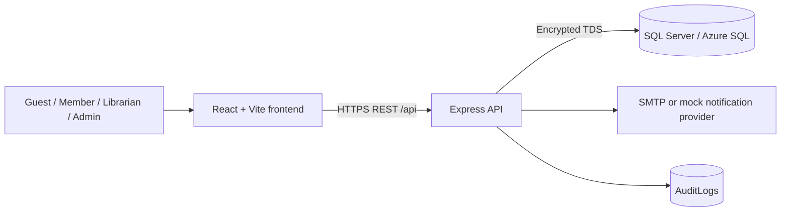
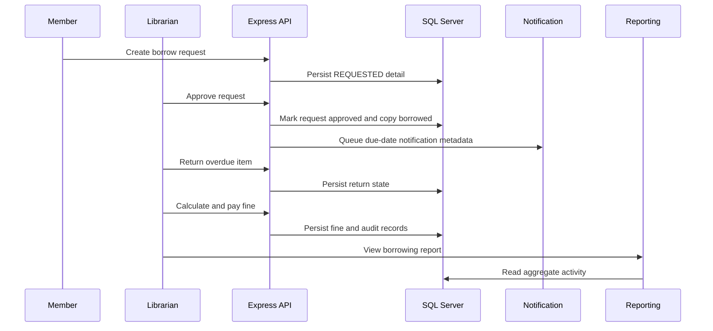
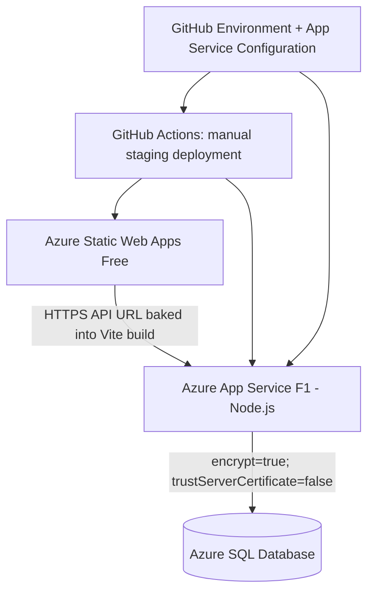

# System Architecture

## Runtime Overview



The frontend is a presentation and interaction layer. The Express backend is the authority for
authentication, authorization, input validation, business rules, audit records, and database state.

## Trust Boundaries

| Boundary | Rule |
| --- | --- |
| Browser -> API | Browser input is untrusted. The backend validates every protected operation. |
| Authentication | Access tokens are verified by backend middleware before protected controllers run. |
| Authorization | Route middleware and services enforce Member, Librarian, and Admin boundaries. |
| API -> database | Values use `mssql.Request.input`; dynamic identifiers are selected from code-owned allowlists. |
| API -> notification provider | Sensitive verification/reset content is not persisted in normal notification fields or returned by HTTP responses. |
| Runtime -> configuration | Secrets come from local ignored environments or Azure App Service settings. |
| CI -> staging | Deployment credentials are scoped to the GitHub `staging` Environment. CI never mutates database schema. |

## Module Ownership

| Feature | Backend responsibility | Frontend responsibility | Source of truth |
| --- | --- | --- | --- |
| FE02 Authentication | Credentials, hashing, tokens, lockout, audit | Login/register/reset forms and session storage | [FE02 spec](../../.sdd/specs/feat-auth/SPEC.md) |
| FE07 Borrowing | Eligibility, requests, approval, return, renewal | Member/staff borrowing workflows | [FE07 spec](../../.sdd/specs/feat-borrowing-management/SPEC.md) |
| FE08 Reservation | Queue, holds, cancellation, promotion | Member reservation and staff queue views | [FE08 spec](../../.sdd/specs/feat-reservation-management/SPEC.md) |
| FE09 Fine | Calculation, collection, payment state, authorization | Legacy UI is limited; server API is release evidence | [FE09 spec](../../.sdd/specs/feat-fine-management/SPEC.md) |
| FE10 Notification | Templates, safe payloads, queue, retry, provider result | No completed inbox UI in the release scope | [FE10 spec](../../.sdd/specs/feat-notification-management/SPEC.md) |
| FE12 Reporting | Read-only aggregate queries and audit | Staff report filters, tables, and KPI views | [FE12 spec](../../.sdd/specs/feat-reporting-statistics/SPEC.md) |

The detailed cross-feature state flow, table ownership, and presentation answers live in the
[feature integration map](feature-integration-map.md).

## Primary Integrated Flow



The Playwright golden path uses the real React application with production-aligned services. Its
FE09 step intentionally uses the API because the legacy fine page is not aligned to the final server
contract.

## Local Topology

```text
React/Vite     http://localhost:5173
Express API   http://localhost:3000
Swagger UI    http://localhost:3000/api-docs
SQL Server    backend/.env configuration
```

`npm run dev` starts frontend and backend together. The browser API base is configured through
`VITE_API_BASE_URL`.

## Azure Staging Topology



Staging deployment keeps frontend and backend separate:

- Static Web Apps serves only frontend assets.
- App Service runs `npm start` from the backend package with `NODE_ENV=production`.
- Azure SQL hosts the explicitly initialized staging database.
- App Service `CORS_ORIGINS` contains only the observed Static Web Apps URL.
- The GitHub workflow does not execute database schema SQL.

## Data And Transaction Boundaries

- Borrow approval/return and reservation queue transitions use repository transactions where the
  specification requires atomic state changes.
- Fine calculation reads stored due/return data; the client cannot submit the calculated amount.
- Reports use read-only aggregate queries and cannot mutate circulation state.
- Audit records capture important auth, circulation, fine, notification, report, and admin actions.
- The canonical schema is [`database/Librarymanagement.sql`](../../database/Librarymanagement.sql).

## Reliability And Security Boundaries

- `/health` is the deployment health endpoint.
- Helmet provides baseline HTTP security headers.
- Production CORS fails closed for unconfigured cross-origin requests.
- Unknown and internal 5xx responses use a generic client envelope.
- Notification provider failures use fixed safe messages and do not expose provider internals.
- Dependency, secret, RBAC, validation, and error-boundary findings are recorded in the
  [Week 12 security audit](../../.sdd/reviews/week12-security-audit-2026-07-14.md).
- Staging smoke tests are read-only and verify health, CORS, and anonymous rejection.

## Operational Limitations

- Access and refresh tokens currently use browser storage; migration to HttpOnly refresh cookies is
  a documented pre-public-release risk.
- HTTPS enforcement is provided by Azure endpoints and deployment configuration.
- Per-IP login rate limiting remains a documented follow-up beyond account lockout.
- Uploaded avatars use application filesystem storage and need durable object storage before a
  production-scale deployment.
- Staging is a student-credit environment, not a production SLA environment.
