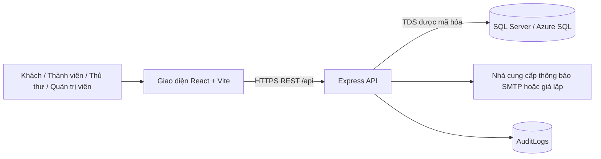
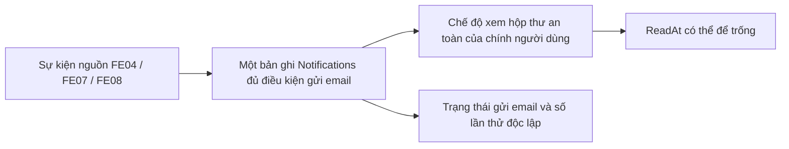
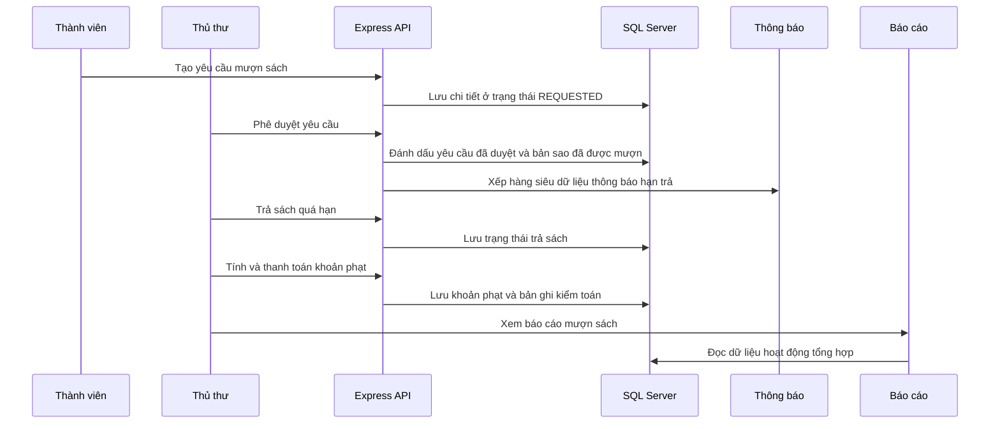
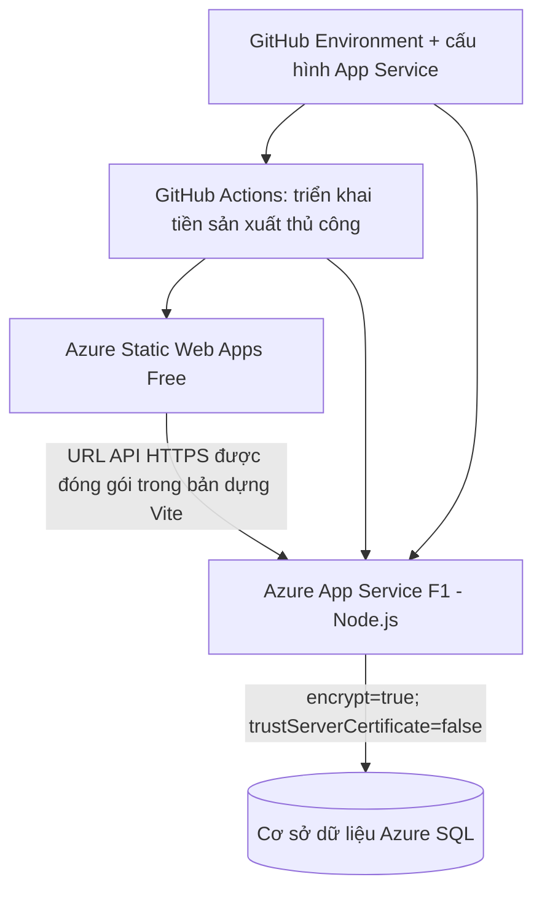

# Kiến trúc hệ thống

## Tổng quan về thời gian chạy


```mermaid
flowchart LR
  U["Khách / Thành viên / Thủ thư / Quản trị viên"] --> F["Giao diện React + Vite"]
  F -->|"HTTPS REST /api"| B["Express API"]
  B -->|"TDS được mã hóa"| D[("SQL Server / Azure SQL")]
  B --> N["Nhà cung cấp thông báo SMTP hoặc giả lập"]
  B --> A[("AuditLogs")]
```

Giao diện là lớp trình bày và tương tác. Máy chủ Express chịu trách nhiệm xác thực, ủy quyền, kiểm tra
đầu vào, quy tắc nghiệp vụ, nhật ký kiểm toán và trạng thái cơ sở dữ liệu.

## Ranh giới tin cậy

| Ranh giới | Quy tắc |
| --- | --- |
| Trình duyệt -> API | Đầu vào của trình duyệt không đáng tin cậy. Phần máy chủ xác nhận mọi hoạt động được bảo vệ. |
| Xác thực | Mã thông báo truy cập được xác minh bằng phần mềm trung gian máy chủ trước khi chạy bộ điều khiển được bảo vệ. |
| Ủy quyền | Định tuyến phần mềm trung gian và dịch vụ thực thi ranh giới Thành viên, Thủ thư và Quản trị viên. |
| API -> cơ sở dữ liệu | Các giá trị sử dụng `mssql.Request.input`; giá trị nhận dạng động được chọn từ danh sách cho phép do mã sở hữu. |
| API -> nhà cung cấp thông báo | Nội dung xác minh/đặt lại nhạy cảm không được lưu giữ trong các trường thông báo thông thường hoặc được phản hồi HTTP trả về. |
| Thời gian chạy -> cấu hình | Bí mật đến từ môi trường cục bộ bị bỏ qua hoặc cài đặt Azure App Service. |
| CI -> môi trường tiền sản xuất | Thông tin xác thực triển khai nằm trong phạm vi Môi trường GitHub `staging`. CI không bao giờ thay đổi lược đồ cơ sở dữ liệu; quá trình di chuyển FE10 đã được đánh giá sẽ được nhà điều hành áp dụng và xác minh trước khi triển khai. |

## Quyền sở hữu mô-đun

| chức năng | Trách nhiệm máy chủ | Trách nhiệm giao diện người dùng | Nguồn chuẩn |
| --- | --- | --- | --- |
| Xác thực FE02 | Thông tin xác thực, băm, mã thông báo, khóa tài khoản, kiểm toán | Biểu mẫu đăng nhập/đăng ký/đặt lại và lưu trữ phiên | [Đặc tả FE02](../../.sdd/specs/feat-auth/SPEC.md) |
| Mượn sách FE07 | Điều kiện mượn, yêu cầu, phê duyệt, trả sách, gia hạn | Quy trình mượn sách của thành viên/nhân viên | [Đặc tả FE07](../../.sdd/specs/feat-borrowing-management/SPEC.md) |
| Đặt chỗ FE08 | Hàng đợi, giữ sách, hủy, chuyển người tiếp theo | Đặt chỗ của thành viên và chế độ xem hàng đợi của nhân viên | [Đặc tả FE08](../../.sdd/specs/feat-reservation-management/SPEC.md) |
| Khoản phạt FE09 | Tính khoản phạt, thu tiền, trạng thái thanh toán, ủy quyền | Giao diện kế thừa bị giới hạn; API máy chủ là bằng chứng phát hành | [Đặc tả FE09](../../.sdd/specs/feat-fine-management/SPEC.md) |
| Thông báo FE10 | Mẫu, dữ liệu an toàn, hàng đợi, thử lại, kết quả nhà cung cấp, chế độ xem hộp thư cá nhân và `ReadAt` | Xem trước thông báo và `/notifications` cho Thành viên/Thủ thư/Quản trị viên đã xác thực | [Đặc tả FE10](../../.sdd/specs/feat-notification-management/SPEC.md) |
| Báo cáo FE12 | Kiểm toán và truy vấn tổng hợp chỉ đọc | Bộ lọc báo cáo nhân viên, bảng và chế độ xem KPI | [Đặc tả FE12](../../.sdd/specs/feat-reporting-statistics/SPEC.md) |

Luồng trạng thái chức năng chéo chi tiết, quyền sở hữu bảng và câu trả lời trình bày có trong [bản
đồ tích hợp chức năng](feature-integration-map.md).

### Chiếu hộp thư đến thông báo cá nhân


```mermaid
flowchart LR
  S["Sự kiện nguồn FE04 / FE07 / FE08"] --> E["Một bản ghi Notifications đủ điều kiện gửi email"]
  E --> P["Chế độ xem hộp thư an toàn của chính người dùng"]
  P --> R["ReadAt có thể để trống"]
  E --> Q["Trạng thái gửi email và số lần thử độc lập"]
```

Hộp thư đến không tạo kênh `IN_APP` hoặc bản ghi trùng lặp. SQL lọc theo `UserId` đã được xác thực
và danh sách cho phép loại/mẫu đủ điều kiện cố định trước khi tạo kết quả. Việc xác minh, đặt
lại mật khẩu, thiết lập tài khoản, `EMAIL_VERIFY` cũ, hồ sơ không có người dùng và người dùng khác
đều bị loại trừ. API chỉ hiển thị các hoạt động danh sách, số lượng chưa đọc, đánh dấu một và đánh
dấu tất cả; không có điểm cuối nhật ký, xóa hoặc lưu trữ toàn cầu. Đường dẫn hành động được chọn bởi
các hằng số thuộc sở hữu máy chủ thay vì dữ liệu được lưu trữ trong thông báo hoặc do trình duyệt
cung cấp.

## Luồng tích hợp chính


```mermaid
sequenceDiagram
  participant M as Thành viên
  participant L as Thủ thư
  participant API as Express API
  participant DB as SQL Server
  participant N as Thông báo
  participant R as Báo cáo

  M->>API: Tạo yêu cầu mượn sách
  API->>DB: Lưu chi tiết ở trạng thái REQUESTED
  L->>API: Phê duyệt yêu cầu
  API->>DB: Đánh dấu yêu cầu đã duyệt và bản sao đã được mượn
  API->>N: Xếp hàng siêu dữ liệu thông báo hạn trả
  L->>API: Trả sách quá hạn
  API->>DB: Lưu trạng thái trả sách
  L->>API: Tính và thanh toán khoản phạt
  API->>DB: Lưu khoản phạt và bản ghi kiểm toán
  L->>R: Xem báo cáo mượn sách
  R->>DB: Đọc dữ liệu hoạt động tổng hợp
```

luồng nghiệp vụ chuẩn Playwright sử dụng ứng dụng React thực với các dịch vụ phù hợp với sản xuất.
Bước FE09 của nó có chủ ý sử dụng API vì trang phạt cũ không được căn chỉnh theo hợp đồng máy chủ
cuối cùng.

## Cấu trúc liên kết cục bộ

```text
React/Vite     http://localhost:5173
Express API   http://localhost:3000
Swagger UI    http://localhost:3000/api-docs
SQL Server    cấu hình backend/.env
```

`npm run dev` bắt đầu giao diện người dùng và máy chủ cùng nhau. Cơ sở trình duyệt API được định cấu
hình thông qua `VITE_API_BASE_URL`.

## Cấu trúc liên kết môi trường tiền sản xuất Azure


```mermaid
flowchart TB
  GH["GitHub Actions: triển khai tiền sản xuất thủ công"]
  SWA["Azure Static Web Apps Free"]
  APP["Azure App Service F1 - Node.js"]
  SQL[("Cơ sở dữ liệu Azure SQL")]
  CFG["GitHub Environment + cấu hình App Service"]

  GH --> SWA
  GH --> APP
  CFG --> GH
  CFG --> APP
  SWA -->|"URL API HTTPS được đóng gói trong bản dựng Vite"| APP
  APP -->|"encrypt=true; trustServerCertificate=false"| SQL
```

Triển khai theo giai đoạn giúp tách biệt giao diện người dùng và máy chủ:

- Static Web Apps chỉ phục vụ nội dung giao diện người dùng.
- App Service chạy `npm start` từ gói máy chủ với `NODE_ENV=production`.
- Azure SQL lưu trữ cơ sở dữ liệu môi trường tiền sản xuất được khởi tạo rõ ràng.
- App Service `CORS_ORIGINS` chỉ chứa URL Static Web Apps đã được quan sát.
- Luồng công việc GitHub không thực thi lược đồ cơ sở dữ liệu SQL.

## Ranh giới dữ liệu và giao dịch

- phê duyệt/trả sách và chuyển tiếp hàng đợi đặt chỗ sử dụng các giao dịch kho lưu trữ trong đó
  đặc tả yêu cầu thay đổi trạng thái nguyên tử.
- Tính khoản phạt đọc ngày đến hạn/ngày trả đã lưu; máy khách không thể gửi số tiền tự tính.
- Báo cáo sử dụng truy vấn tổng hợp chỉ đọc và không thể thay đổi trạng thái lưu hành.
- nhật ký kiểm toán nắm bắt các hành động xác thực, lưu hành, khoản phạt, thông báo, báo cáo và quản trị viên quan trọng.
- FE10 trạng thái đọc cá nhân độc lập với trạng thái gửi: việc đánh dấu một mục đã đọc chỉ thay đổi
  `Notifications.ReadAt` và không bao giờ thay đổi trạng thái email, số lần thử, siêu dữ liệu nguồn
  hoặc trạng thái chuẩn hóa.
- Lược đồ chuẩn là [`database/Librarymanagement.sql`](../../database/Librarymanagement.sql).

## Độ tin cậy và ranh giới bảo mật

- `/health` là điểm cuối tình trạng triển khai.
- Helmet cung cấp các tiêu đề bảo mật HTTP cơ bản.
- CORS ở môi trường sản xuất từ chối mặc định các yêu cầu khác nguồn chưa được cấu hình.
- Phản hồi 5xx nội bộ hoặc không xác định sử dụng cấu trúc lỗi chung cho máy khách.
- Lỗi của nhà cung cấp thông báo sử dụng các thông báo an toàn cố định và không làm lộ thông tin nội bộ của nhà cung cấp.
- Các phát hiện phụ thuộc, bí mật, RBAC, xác thực và ranh giới lỗi được ghi lại trong
  [Kiểm tra bảo mật tuần 12](../../.sdd/reviews/week12-security-audit-2026-07-14.md).
- Các kiểm thử nhanh theo giai đoạn ở dạng chỉ đọc và xác minh tình trạng, CORS cũng như từ chối ẩn danh.
- FE10 khôi phục có tính chất bổ sung và không phá hủy: giữ lại `ReadAt` và chỉ mục hỗ trợ của nó, đồng thời vô hiệu hóa
  hoặc chỉ triển khai lại hộp thư đến API/giao diện nếu cần. Không bao giờ xóa lịch sử đọc hoặc hàng
  gửi email.

## Hạn chế hoạt động

- Mã thông báo truy cập và làm mới hiện đang sử dụng bộ nhớ của trình duyệt; việc di chuyển sang cookie làm mới HttpOnly là
  một rủi ro trước khi phát hành công khai được ghi lại.
- Việc thực thi HTTPS được cung cấp bởi các điểm cuối và cấu hình triển khai Azure.
- Giới hạn tốc độ đăng nhập trên mỗi IP vẫn là một biện pháp tiếp theo được ghi lại ngoài việc khóa tài khoản.
- Hình đại diện đã tải lên sử dụng bộ nhớ hệ thống tệp ứng dụng và cần bộ nhớ đối tượng lâu bền trước khi
  triển khai quy mô sản xuất.
- Môi trường tiền sản xuất sử dụng tín dụng sinh viên, không phải môi trường có SLA sản xuất.
