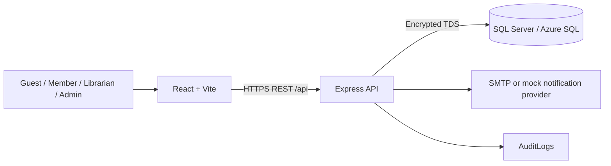

# Week 13 Documentation And Azure Staging Implementation Plan

> **For agentic workers:** REQUIRED SUB-SKILL: Use superpowers:executing-plans to implement this plan task-by-task. Do not create subagents or reviewers for this plan.

**Goal:** Close the six-feature acceptance package, complete Week 13 documentation, and deploy a smoke-tested Azure staging environment using Azure Static Web Apps, App Service, and Azure SQL.

**Architecture:** Keep the React frontend and Express backend as separate deployables. Azure Static Web Apps serves the Vite build, Azure App Service runs the backend, and Azure SQL stores staging data. GitHub Actions performs quality gates and manual staging deployment; database schema execution remains an explicit operator action.

**Tech Stack:** Node.js 22 in CI, React/Vite, Express, SQL Server/Azure SQL, Playwright, GitHub Actions, Azure Static Web Apps, Azure App Service, Azure SQL Database.

## Global Constraints

- Complete Tasks 1-7 on `docs/week13-documentation-deployment`. Create
  `docs/week13-staging-evidence` only after the implementation branch is merged. Do not use `codex`
  in a branch name.
- Preserve unrelated changes in the main worktree, especially `docs/testing/system-integration-demo-runbook.md`, `.superpowers/`, and `docs/briefing-thuyet-trinh-du-an-vi.docx`.
- Do not add product features or change approved business rules.
- Do not align the FE09 legacy frontend in this plan.
- Never commit Azure credentials, database credentials, JWT secrets, deployment tokens, or `.env` values.
- Start App Service on F1 Free. Stop and request approval before selecting B1 or any paid plan.
- Create Azure SQL only after the Azure portal shows that the configuration is inside the free allowance or Azure for Students credit.
- Keep Azure Static Web Apps on the Free plan.
- Do not execute schema SQL automatically from CI.
- Use only synthetic staging accounts and data.
- Keep staging deployment manual through `workflow_dispatch` until the first deployment and smoke test pass.
- Do not claim SMTP delivery when SMTP is not configured.
- Use `apply_patch` for manual file edits and test-driven development for new executable scripts.

---

### Task 1: Close The Six-Feature Acceptance Package

**Files:**
- Create: `docs/release/week13-acceptance-record.md`
- Modify: `.sdd/test-plan.md`

**Interfaces:**
- Consumes: feature `SPEC.md`, `TASKS.md`, `TEST_PLAN.md`, Week 11/12 evidence, FE07/FE12 closeout records, and system integration evidence.
- Produces: one release-level acceptance matrix used by the README, deployment evidence, and human staging review.

- [ ] **Step 1: Record the current feature states without upgrading them**

Use these observed states:

| Feature | Current task state | Week 13 acceptance state |
| --- | --- | --- |
| FE02 Authentication | READY FOR REVIEW | READY FOR HUMAN ACCEPTANCE |
| FE07 Borrowing | COMPLETE | HUMAN REVIEW ALREADY RECORDED; RECHECK ON STAGING |
| FE08 Reservation | READY FOR REVIEW | READY FOR HUMAN ACCEPTANCE |
| FE09 Fine server API | READY FOR REVIEW | READY FOR HUMAN ACCEPTANCE; LEGACY UI LIMITATION |
| FE10 Notification | COMPLETE | READY FOR HUMAN ACCEPTANCE; INBOX UI LIMITATION |
| FE12 Reporting | COMPLETE | HUMAN REVIEW ALREADY RECORDED; RECHECK ON STAGING |

- [ ] **Step 2: Create the acceptance record**

Create `docs/release/week13-acceptance-record.md` with these sections:

```markdown
# Week 13 Core Feature Acceptance Record

Date: 2026-07-14
Release candidate: Week 13 Azure staging
Overall status: READY FOR HUMAN ACCEPTANCE

## Evidence Rules

- L1 automated evidence does not replace L4 human acceptance.
- Only observed results are marked PASS.
- FE09 browser alignment and FE10 inbox UI remain explicit limitations.

## Feature Matrix

| Feature | Spec/Tasks | Automated evidence | Human evidence | Current decision |
| --- | --- | --- | --- | --- |
| FE02 | `.sdd/specs/feat-auth/` | `authRoutes`, `authUtils`, security regression, full backend gate | Staging login/logout/reset review required | READY FOR HUMAN ACCEPTANCE |
| FE07 | `.sdd/specs/feat-borrowing-management/` | FE07 tests, system integration, browser golden path | FE07 B7 review confirmed; staging recheck required | READY FOR STAGING RECHECK |
| FE08 | `.sdd/specs/feat-reservation-management/` | reservation route/service and system integration evidence | Staging member/staff queue review required | READY FOR HUMAN ACCEPTANCE |
| FE09 | `.sdd/specs/feat-fine-management/` | fine management tests and Playwright API handoff | Production API review required; legacy UI is not acceptance evidence | READY WITH UI LIMITATION |
| FE10 | `.sdd/specs/feat-notification-management/` | notification safety tests and system integration evidence | Metadata/failure behavior review required; inbox UI is deferred | READY WITH UI LIMITATION |
| FE12 | `.sdd/specs/feat-reporting-statistics/` | report tests and browser golden path | FE12 B7 review confirmed; staging recheck required | READY FOR STAGING RECHECK |

## Staging Human Checklist

- [ ] Member login and protected-route redirect are correct.
- [ ] Member creates a borrow request using synthetic data.
- [ ] Librarian approves and returns the item.
- [ ] FE09 API calculates 14 overdue days as 70,000 VND and records PAID.
- [ ] FE10 exposes safe metadata without sensitive body/token content.
- [ ] FE12 displays the integrated activity without mutation controls.
- [ ] Desktop and mobile views have no blocking overlap.

## Sign-Off

Reviewer:
Date:
Decision: READY FOR STAGING / CHANGES REQUIRED
Notes:
```

- [ ] **Step 3: Update the Week 10 milestone truthfully**

Change `.sdd/test-plan.md` from:

```markdown
| Week 10: Core features pass acceptance | Each implemented core feature has acceptance evidence mapped to `SPEC.md` | In progress (6 features implemented) |
```

to:

```markdown
| Week 10: Core features pass acceptance | Each implemented core feature has acceptance evidence mapped to `SPEC.md` | Ready for human staging acceptance (6 features) |
```

- [ ] **Step 4: Verify references and diff**

Run:

```powershell
$paths = @(
  '.sdd/specs/feat-auth/SPEC.md',
  '.sdd/specs/feat-borrowing-management/SPEC.md',
  '.sdd/specs/feat-reservation-management/SPEC.md',
  '.sdd/specs/feat-fine-management/SPEC.md',
  '.sdd/specs/feat-notification-management/SPEC.md',
  '.sdd/specs/feat-reporting-statistics/SPEC.md',
  '.sdd/reviews/system-integration-evidence-2026-07-14.md',
  '.sdd/reviews/week11-e2e-evidence-2026-07-14.md',
  '.sdd/reviews/week12-security-audit-2026-07-14.md'
)
$missing = $paths | Where-Object { -not (Test-Path -LiteralPath $_) }
if ($missing) { throw "Missing acceptance references: $missing" }
git diff --check
```

Expected: no missing path and `git diff --check` exits 0.

- [ ] **Step 5: Commit**

```powershell
git add docs/release/week13-acceptance-record.md .sdd/test-plan.md
git commit -m "docs: prepare week 13 acceptance gate"
```

---

### Task 2: Add The Technical Documentation Entry Points

**Files:**
- Create: `README.md`
- Create: `docs/architecture/system-architecture.md`
- Modify: `backend/README.md`

**Interfaces:**
- Consumes: `docs/architecture/feature-integration-map.md`, `backend/src/docs/openapi.yaml`, package scripts, and the Week 13 design.
- Produces: the root navigation/documentation entry point used by developers, reviewers, and deployment operators.

- [ ] **Step 1: Create the system architecture document**

Create `docs/architecture/system-architecture.md` with:

````markdown
# System Architecture

## Runtime Overview



## Trust Boundaries

- Browser input is untrusted and is validated again by the backend.
- Bearer authentication and role authorization are enforced by Express middleware and services.
- SQL values use `mssql.Request.input`; code-owned allowlists select dynamic identifiers.
- Secrets are environment/App Service settings and never browser build values.
- Notification responses and persistence exclude sensitive reset/verification content.

## Module Ownership

Link FE02, FE07, FE08, FE09, FE10, and FE12 to their `.sdd/specs/feat-*/` folders and link the full integration map.

## Local Topology

- Frontend: `http://localhost:5173`
- Backend: `http://localhost:3000`
- SQL Server: configured by `backend/.env`

## Azure Staging Topology

- Azure Static Web Apps Free: frontend HTTPS endpoint.
- Azure App Service F1: backend HTTPS endpoint.
- Azure SQL Database: encrypted database endpoint.
- GitHub `staging` Environment: deployment secrets and URL variables.

## Reliability And Security Boundaries

Document health checks, CORS allowlist, safe 5xx responses, no automatic schema mutation, and the accepted Week 12 risks.
````

Keep the Mermaid fence valid by using a four-backtick outer fence while editing if needed.

- [ ] **Step 2: Create the root README**

Create `README.md` with these exact top-level sections:

```markdown
# Library Management System

## Overview
## Implemented Scope
## Architecture
## Technology Stack
## Repository Structure
## Prerequisites
## Local Setup
## Environment Configuration
## Development Commands
## Test And Quality Gates
## API Documentation
## Azure Staging
## User Documentation
## Current Limitations
## Security Notes
## Team Workflow
```

Requirements for the content:

- State that FE02, FE07, FE08, FE09 server API, FE10, and FE12 are the completed production-aligned scope.
- Do not claim FE09 legacy browser storage is production evidence.
- Link `docs/architecture/system-architecture.md`, `docs/architecture/feature-integration-map.md`,
  `backend/src/docs/openapi.yaml`, `docs/user-manual.md`,
  `docs/deployment/azure-staging-guide.md`, `docs/release/week13-acceptance-record.md`, and
  `docs/testing/system-integration-demo-runbook.md`.
- Include commands already present in package files; do not invent commands before their task adds them.
- Explain that Azure deployment is staging-only and manually dispatched.

- [ ] **Step 3: Link the backend README to the root documentation**

Add near the top of `backend/README.md`:

```markdown
Project-level setup, architecture, quality gates, and Azure staging instructions live in the root
[`README.md`](../README.md).
```

- [ ] **Step 4: Verify the documented commands exist**

Run:

```powershell
$root = Get-Content package.json -Raw | ConvertFrom-Json
$backend = Get-Content backend/package.json -Raw | ConvertFrom-Json
$frontend = Get-Content frontend/package.json -Raw | ConvertFrom-Json
@('dev','test:e2e','test:system','trace:enforce') | ForEach-Object {
  if (-not $root.scripts.$_) { throw "Missing root script: $_" }
}
@('test','test:coverage:ci','test:sql:system') | ForEach-Object {
  if (-not $backend.scripts.$_) { throw "Missing backend script: $_" }
}
@('test','lint','build') | ForEach-Object {
  if (-not $frontend.scripts.$_) { throw "Missing frontend script: $_" }
}
git diff --check
```

Expected: all scripts exist and diff check exits 0.

- [ ] **Step 5: Commit**

```powershell
git add README.md docs/architecture/system-architecture.md backend/README.md
git commit -m "docs: add project technical documentation"
```

---

### Task 3: Add Safe Environment Templates And Azure Deployment Guide

**Files:**
- Modify: `.gitignore`
- Create: `backend/.env.example`
- Create: `frontend/.env.example`
- Create: `docs/deployment/azure-staging-guide.md`

**Interfaces:**
- Consumes: environment reads in `backend/src/config/db.js`, `backend/src/config/env.js`, `backend/src/app.js`, and frontend API modules.
- Produces: the configuration contract used by local developers, Azure App Service, GitHub Actions, and smoke testing.

- [ ] **Step 1: Allow tracked example files while keeping real environments ignored**

Immediately after `.env.*` in `.gitignore`, add:

```gitignore
!.env.example
!backend/.env.example
!frontend/.env.example
```

- [ ] **Step 2: Create the backend environment template**

Create `backend/.env.example`:

```dotenv
NODE_ENV=development
PORT=3000

JWT_SECRET=
BCRYPT_COST=10
ACCESS_TOKEN_TTL_SECONDS=900
REFRESH_TOKEN_TTL_DAYS=7

DB_SERVER=localhost
DB_NAME=LibraryManagementDB
DB_USER=
DB_PASSWORD=
DB_PORT=1433
DB_INSTANCE_NAME=
DB_ENCRYPT=false
DB_TRUST_SERVER_CERTIFICATE=true

CORS_ORIGINS=http://localhost:5173
FRONTEND_BASE_URL=http://localhost:5173

SMTP_HOST=
SMTP_PORT=587
SMTP_SECURE=false
SMTP_USER=
SMTP_PASSWORD=
MAIL_FROM=
```

- [ ] **Step 3: Create the frontend environment template**

Create `frontend/.env.example`:

```dotenv
VITE_API_BASE_URL=http://localhost:3000/api
```

- [ ] **Step 4: Write the Azure staging guide**

Create `docs/deployment/azure-staging-guide.md` with these sections and exact resource names:

```markdown
# Azure Staging Deployment Guide

## Cost Guardrails
## Resource Names And Regions
## Install And Sign In To Azure CLI
## Create Resource Group And App Service F1
## Create Azure Static Web Apps Free
## Create Azure SQL Inside Student Credit
## Configure Azure SQL Firewall
## Prepare And Execute The Azure-Compatible Schema
## Configure App Service Runtime Settings
## Configure GitHub Environment Variables And Secrets
## Run The First Manual Deployment
## Run Smoke Tests
## Rollback
## Stop/Delete Resources
```

Use these names:

```text
Resource group: rg-library-staging
App Service plan: plan-library-staging
Backend web app: app-library-api-staging-nhat714
Static Web App: swa-library-staging-nhat714
SQL logical server: sql-library-staging-ea-nhat714
Database: LibraryManagementStaging
App Service region: malaysiawest
SQL region: eastasia
Static Web Apps region: eastasia
SQL administrator username: libraryadmin
```

Document these GitHub `staging` Environment variables:

```text
AZURE_WEBAPP_NAME=app-library-api-staging-nhat714
STAGING_API_URL=https://app-library-api-staging-nhat714.azurewebsites.net
```

Create `STAGING_FRONTEND_URL` with the exact Static Web Apps URL displayed by Azure after resource
creation. It is an operator-observed value and must not be guessed from the resource name.

Document these GitHub secrets:

```text
AZURE_WEBAPP_PUBLISH_PROFILE
AZURE_STATIC_WEB_APPS_API_TOKEN
```

Document that database credentials and `JWT_SECRET` live only in App Service Configuration.

- [ ] **Step 5: Verify examples are tracked and real environments remain ignored**

Run:

```powershell
git check-ignore backend/.env frontend/.env
if ($LASTEXITCODE -ne 0) { throw 'Real env files must remain ignored.' }
git check-ignore backend/.env.example frontend/.env.example
if ($LASTEXITCODE -eq 0) { throw 'Example env files must be trackable.' }
git diff --check
```

Then scan the examples for non-empty secret assignments:

```powershell
$unsafe = Select-String -Path backend/.env.example,frontend/.env.example `
  -Pattern '^(JWT_SECRET|DB_PASSWORD|SMTP_PASSWORD)=[^\s]+$'
if ($unsafe) { throw 'Environment example contains a non-empty secret.' }
```

- [ ] **Step 6: Commit**

```powershell
git add .gitignore backend/.env.example frontend/.env.example docs/deployment/azure-staging-guide.md
git commit -m "docs: add azure staging configuration guide"
```

---

### Task 4: Generate An Azure-Compatible Schema Without Duplicating The Source

**Files:**
- Create: `scripts/prepare-azure-schema.js`
- Create: `tests/deployment/azureSchema.test.js`
- Modify: `package.json`
- Modify: `README.md`

**Interfaces:**
- Consumes: canonical `database/Librarymanagement.sql`.
- Produces: `transformSchema(source: string): string` and generated ignored file `tmp/azure/LibraryManagementStaging.sql`.

- [ ] **Step 1: Write the failing schema transformation tests**

Create `tests/deployment/azureSchema.test.js`:

```javascript
const test = require('node:test');
const assert = require('node:assert/strict');

const { transformSchema } = require('../../scripts/prepare-azure-schema');

test('removes CREATE DATABASE and USE batches for an existing Azure SQL database', () => {
  const source = `
SET ANSI_NULLS ON;
GO
CREATE DATABASE LibraryManagementDB;
GO
USE LibraryManagementDB;
GO
CREATE TABLE Roles (RoleId INT PRIMARY KEY);
GO
CREATE TABLE AuditLogs (AuditLogId INT PRIMARY KEY);
GO
`;

  const result = transformSchema(source);

  assert.doesNotMatch(result, /CREATE\s+DATABASE/i);
  assert.doesNotMatch(result, /^\s*USE\s+/im);
  assert.match(result, /CREATE TABLE Roles/);
  assert.match(result, /CREATE TABLE AuditLogs/);
});

test('rejects a schema missing required application tables', () => {
  const source = `
CREATE TABLE Roles (RoleId INT);
GO
CREATE TABLE Users (UserId INT);
GO
CREATE TABLE BorrowRequests (BorrowRequestId INT);
GO
CREATE TABLE Fines (FineId INT);
GO
CREATE TABLE Notifications (NotificationId INT);
GO
`;
  assert.throws(
    () => transformSchema(source),
    /required table AuditLogs/i
  );
});
```

- [ ] **Step 2: Run the tests to verify RED**

Run:

```powershell
node --test tests/deployment/azureSchema.test.js
```

Expected: FAIL because `scripts/prepare-azure-schema.js` does not exist.

- [ ] **Step 3: Implement the schema transformer**

Create `scripts/prepare-azure-schema.js`:

```javascript
const fs = require('node:fs');
const path = require('node:path');

const SOURCE_PATH = path.resolve(__dirname, '../database/Librarymanagement.sql');
const OUTPUT_PATH = path.resolve(__dirname, '../tmp/azure/LibraryManagementStaging.sql');
const REQUIRED_TABLES = ['Roles', 'Users', 'BorrowRequests', 'Fines', 'Notifications', 'AuditLogs'];

function transformSchema(source) {
  const batches = String(source)
    .split(/^\s*GO\s*;?\s*$/gim)
    .map((batch) => batch.trim())
    .filter(Boolean)
    .filter((batch) => !/^CREATE\s+DATABASE\b/i.test(batch))
    .filter((batch) => !/^USE\s+/i.test(batch));

  const result = `${batches.join('\nGO\n\n')}\nGO\n`;

  if (/CREATE\s+DATABASE/i.test(result) || /^\s*USE\s+/im.test(result)) {
    throw new Error('Azure schema must not create or switch databases.');
  }

  for (const table of REQUIRED_TABLES) {
    if (!new RegExp(`CREATE\\s+TABLE\\s+${table}\\b`, 'i').test(result)) {
      throw new Error(`Azure schema is missing required table ${table}.`);
    }
  }

  return result;
}

function prepareAzureSchema({ sourcePath = SOURCE_PATH, outputPath = OUTPUT_PATH } = {}) {
  const source = fs.readFileSync(sourcePath, 'utf8');
  const result = transformSchema(source);
  fs.mkdirSync(path.dirname(outputPath), { recursive: true });
  fs.writeFileSync(outputPath, result, 'utf8');
  return outputPath;
}

if (require.main === module) {
  const outputPath = prepareAzureSchema();
  console.log(`Azure-compatible schema written to ${outputPath}`);
}

module.exports = {
  prepareAzureSchema,
  transformSchema,
};
```

- [ ] **Step 4: Add root scripts**

Add to `package.json`:

```json
"schema:azure:prepare": "node scripts/prepare-azure-schema.js",
"test:deployment": "node --test tests/deployment/*.test.js"
```

Add `npm.cmd run schema:azure:prepare` and `npm.cmd run test:deployment` to the root README command
list after the scripts exist.

- [ ] **Step 5: Verify GREEN and generated output**

Run:

```powershell
npm.cmd run test:deployment
npm.cmd run schema:azure:prepare
Select-String -Path tmp/azure/LibraryManagementStaging.sql -Pattern 'CREATE DATABASE|^USE '
if ($LASTEXITCODE -eq 0) { throw 'Generated Azure schema still contains database switching.' }
git check-ignore tmp/azure/LibraryManagementStaging.sql
```

Expected: tests pass, no forbidden statement is found, and the generated file is ignored.

- [ ] **Step 6: Commit**

```powershell
git add package.json scripts/prepare-azure-schema.js tests/deployment/azureSchema.test.js
git commit -m "chore: add azure schema preparation"
```

---

### Task 5: Add A Read-Only Staging Smoke Test

**Files:**
- Create: `scripts/smoke-staging.js`
- Create: `tests/deployment/smokeStaging.test.js`
- Modify: `package.json`
- Modify: `README.md`

**Interfaces:**
- Consumes: `STAGING_FRONTEND_URL`, `STAGING_API_URL`, and Fetch-compatible HTTP responses.
- Produces: `runStagingSmoke(options): Promise<object>` and CLI command `npm run smoke:staging`.

- [ ] **Step 1: Write failing smoke tests**

Create `tests/deployment/smokeStaging.test.js` with a local HTTP server:

```javascript
const http = require('node:http');
const test = require('node:test');
const assert = require('node:assert/strict');

const { runStagingSmoke } = require('../../scripts/smoke-staging');

async function startFixture({ permissiveCors = false, protectedStatus = 401 } = {}) {
  let allowedOrigin = '';
  const server = http.createServer((req, res) => {
    const origin = req.headers.origin;
    const allowOrigin = permissiveCors ? '*' : origin === allowedOrigin ? origin : null;
    if (allowOrigin) res.setHeader('Access-Control-Allow-Origin', allowOrigin);

    if (req.url === '/') {
      res.writeHead(200, { 'Content-Type': 'text/html' });
      res.end('<!doctype html><title>Library</title>');
      return;
    }
    if (req.url === '/health') {
      res.writeHead(200, { 'Content-Type': 'application/json' });
      res.end(JSON.stringify({ status: 'ok' }));
      return;
    }
    if (req.url === '/api/auth/me') {
      res.writeHead(protectedStatus, { 'Content-Type': 'application/json' });
      res.end(JSON.stringify({ error: { code: 'UNAUTHORIZED' } }));
      return;
    }
    res.writeHead(404).end();
  });

  await new Promise((resolve) => server.listen(0, '127.0.0.1', resolve));
  const address = server.address();
  const baseUrl = `http://127.0.0.1:${address.port}`;
  allowedOrigin = baseUrl;
  return { baseUrl, close: () => new Promise((resolve) => server.close(resolve)) };
}

test('passes for healthy frontend, API, strict CORS, and protected auth route', async () => {
  const fixture = await startFixture();
  try {
    const result = await runStagingSmoke({
      frontendUrl: fixture.baseUrl,
      apiUrl: fixture.baseUrl,
    });
    assert.equal(result.status, 'PASS');
    assert.equal(result.checks.length, 5);
  } finally {
    await fixture.close();
  }
});

test('fails when the API allows an untrusted origin', async () => {
  const fixture = await startFixture({ permissiveCors: true });
  try {
    await assert.rejects(
      runStagingSmoke({ frontendUrl: fixture.baseUrl, apiUrl: fixture.baseUrl }),
      /untrusted origin/i
    );
  } finally {
    await fixture.close();
  }
});

test('fails when a protected endpoint accepts an anonymous request', async () => {
  const fixture = await startFixture({ protectedStatus: 200 });
  try {
    await assert.rejects(
      runStagingSmoke({ frontendUrl: fixture.baseUrl, apiUrl: fixture.baseUrl }),
      /expected 401/i
    );
  } finally {
    await fixture.close();
  }
});
```

- [ ] **Step 2: Run tests to verify RED**

```powershell
npm.cmd run test:deployment
```

Expected: FAIL because `scripts/smoke-staging.js` does not exist.

- [ ] **Step 3: Implement the smoke runner**

Create `scripts/smoke-staging.js`:

```javascript
const DEFAULT_TIMEOUT_MS = 15000;
const UNTRUSTED_ORIGIN = 'https://untrusted.example.test';

function normalizeUrl(value, name) {
  if (!value) throw new Error(`${name} is required.`);
  const parsed = new URL(value);
  if (!['http:', 'https:'].includes(parsed.protocol)) {
    throw new Error(`${name} must use HTTP or HTTPS.`);
  }
  return parsed.origin;
}

async function request(fetchImpl, url, options, timeoutMs) {
  const controller = new AbortController();
  const timer = setTimeout(() => controller.abort(), timeoutMs);
  try {
    return await fetchImpl(url, { ...options, signal: controller.signal });
  } finally {
    clearTimeout(timer);
  }
}

async function runStagingSmoke({
  frontendUrl = process.env.STAGING_FRONTEND_URL,
  apiUrl = process.env.STAGING_API_URL,
  fetchImpl = global.fetch,
  timeoutMs = DEFAULT_TIMEOUT_MS,
} = {}) {
  const frontend = normalizeUrl(frontendUrl, 'STAGING_FRONTEND_URL');
  const api = normalizeUrl(apiUrl, 'STAGING_API_URL');
  const checks = [];

  const frontendResponse = await request(fetchImpl, `${frontend}/`, {}, timeoutMs);
  if (frontendResponse.status !== 200 || !String(frontendResponse.headers.get('content-type')).includes('text/html')) {
    throw new Error(`Frontend check failed with HTTP ${frontendResponse.status}.`);
  }
  checks.push('frontend');

  const healthResponse = await request(fetchImpl, `${api}/health`, {}, timeoutMs);
  const health = await healthResponse.json().catch(() => ({}));
  if (healthResponse.status !== 200 || health.status !== 'ok') {
    throw new Error(`API health check failed with HTTP ${healthResponse.status}.`);
  }
  checks.push('health');

  const allowedResponse = await request(fetchImpl, `${api}/health`, {
    headers: { Origin: frontend },
  }, timeoutMs);
  if (allowedResponse.headers.get('access-control-allow-origin') !== frontend) {
    throw new Error('Configured staging frontend origin was not allowed by CORS.');
  }
  checks.push('allowed-cors');

  const untrustedResponse = await request(fetchImpl, `${api}/health`, {
    headers: { Origin: UNTRUSTED_ORIGIN },
  }, timeoutMs);
  if (untrustedResponse.headers.get('access-control-allow-origin')) {
    throw new Error('API allowed an untrusted origin.');
  }
  checks.push('blocked-cors');

  const protectedResponse = await request(fetchImpl, `${api}/api/auth/me`, {}, timeoutMs);
  if (protectedResponse.status !== 401) {
    throw new Error(`Protected endpoint expected 401 but received ${protectedResponse.status}.`);
  }
  checks.push('protected-route');

  return { status: 'PASS', frontendUrl: frontend, apiUrl: api, checks };
}

if (require.main === module) {
  runStagingSmoke()
    .then((result) => console.log(JSON.stringify(result, null, 2)))
    .catch((error) => {
      console.error(`[staging smoke] ${error.message}`);
      process.exitCode = 1;
    });
}

module.exports = { runStagingSmoke };
```

- [ ] **Step 4: Add the CLI script**

Add to root `package.json`:

```json
"smoke:staging": "node scripts/smoke-staging.js"
```

Add `npm.cmd run smoke:staging` to the Azure staging command section in the root README.

- [ ] **Step 5: Verify GREEN**

```powershell
npm.cmd run test:deployment
```

Expected: all deployment tests pass.

- [ ] **Step 6: Commit**

```powershell
git add package.json scripts/smoke-staging.js tests/deployment/smokeStaging.test.js
git commit -m "test: add staging smoke checks"
```

---

### Task 6: Create The User Manual And Synthetic Screenshots

**Files:**
- Modify: `tests/e2e/system-golden-path.spec.js`
- Create: `scripts/promote-doc-screenshots.js`
- Create: `docs/user-manual.md`
- Create generated images under: `docs/assets/user-manual/`
- Modify: `package.json`
- Modify: `README.md`

**Interfaces:**
- Consumes: deterministic Playwright actors and the existing browser golden path.
- Produces: four synthetic screenshots and a role-based user manual.

- [ ] **Step 1: Add deterministic screenshot capture points**

In `tests/e2e/system-golden-path.spec.js`, keep existing assertions and add these screenshots:

```javascript
await page.goto(`${FRONTEND_URL}/login`);
await page.screenshot({ path: 'output/playwright/manual-login.png', fullPage: true });
```

Add after the member request success assertion:

```javascript
await page.screenshot({ path: 'output/playwright/manual-member-borrow-request.png', fullPage: true });
```

Add after librarian approval succeeds:

```javascript
await page.screenshot({ path: 'output/playwright/manual-librarian-approval.png', fullPage: true });
```

Rename/copy the existing report screenshot source as:

```javascript
await page.screenshot({ path: 'output/playwright/manual-borrowing-report.png', fullPage: true });
```

Do not remove the mobile overflow assertion.

- [ ] **Step 2: Add the screenshot promotion script**

Create `scripts/promote-doc-screenshots.js`:

```javascript
const fs = require('node:fs');
const path = require('node:path');

const names = [
  'manual-login.png',
  'manual-member-borrow-request.png',
  'manual-librarian-approval.png',
  'manual-borrowing-report.png',
];
const sourceDir = path.resolve(__dirname, '../output/playwright');
const targetDir = path.resolve(__dirname, '../docs/assets/user-manual');

fs.mkdirSync(targetDir, { recursive: true });
for (const name of names) {
  const source = path.join(sourceDir, name);
  if (!fs.existsSync(source)) throw new Error(`Missing screenshot ${source}`);
  fs.copyFileSync(source, path.join(targetDir, name));
}
console.log(`Promoted ${names.length} user-manual screenshots.`);
```

- [ ] **Step 3: Add the screenshot command**

Add to root `package.json`:

```json
"docs:screenshots": "playwright test tests/e2e/system-golden-path.spec.js --project=chromium && node scripts/promote-doc-screenshots.js"
```

Add `npm.cmd run docs:screenshots` to the documentation command list in the root README.

- [ ] **Step 4: Run the browser flow and generate images**

```powershell
npm.cmd run docs:screenshots
```

Expected: Playwright 1/1 passes and four PNG files appear in `docs/assets/user-manual/`.

- [ ] **Step 5: Inspect every screenshot**

Use the local image viewer on each PNG. Confirm:

- only synthetic `example.test` data appears;
- no password, token, notification body, `.env`, or connection string appears;
- no modal, text, or navigation element overlaps incoherently;
- the report screenshot shows the real-backend notice and integrated KPI.

- [ ] **Step 6: Write the user manual**

Create `docs/user-manual.md` with:

```markdown
# Library Management System User Manual

## Supported Roles
## Sign In And Sign Out

## Member: Create A Borrow Request

## Member: View Borrowing History
## Member: Manage Reservations
## Librarian: Approve Borrow Requests

## Librarian: Process Returns
## Librarian/Admin: Fine API Boundary
## Librarian/Admin: View Reports

## Admin: User And Role Management
## Common Errors And Recovery
## Security And Privacy Notes
## Known Limitations
```

State explicitly that FE09 legacy browser rows are not proof of Azure SQL persistence and FE10 has no
completed inbox UI acceptance. Reference the production-aligned API and staging evidence instead.

- [ ] **Step 7: Re-run E2E and verify image paths**

```powershell
npm.cmd run test:e2e
$images = @(
  'docs/assets/user-manual/manual-login.png',
  'docs/assets/user-manual/manual-member-borrow-request.png',
  'docs/assets/user-manual/manual-librarian-approval.png',
  'docs/assets/user-manual/manual-borrowing-report.png'
)
$missing = $images | Where-Object { -not (Test-Path -LiteralPath $_) }
if ($missing) { throw "Missing manual images: $missing" }
git diff --check
```

- [ ] **Step 8: Commit**

```powershell
git add package.json tests/e2e/system-golden-path.spec.js scripts/promote-doc-screenshots.js docs/user-manual.md docs/assets/user-manual
git commit -m "docs: add user manual and screenshots"
```

---

### Task 7: Add The Manual Azure Staging Deployment Workflow

**Files:**
- Create: `.github/workflows/deploy-staging.yml`

**Interfaces:**
- Consumes: GitHub `staging` variables/secrets, App Service build configuration, Static Web Apps token, and `npm run smoke:staging`.
- Produces: a manually dispatched quality-gated deployment of backend and frontend followed by smoke testing.

- [ ] **Step 1: Create the workflow**

Create `.github/workflows/deploy-staging.yml`:

```yaml
name: Deploy staging

on:
  workflow_dispatch:

permissions:
  contents: read

concurrency:
  group: library-staging
  cancel-in-progress: false

jobs:
  quality-gate:
    runs-on: ubuntu-latest
    environment:
      name: staging
    steps:
      - uses: actions/checkout@v4
      - uses: actions/setup-node@v4
        with:
          node-version: 22
          cache: npm
      - run: npm ci
      - run: npm ci
        working-directory: backend
      - run: npm ci
        working-directory: frontend
      - run: npm run trace:enforce
      - run: npm run test:coverage:ci
        working-directory: backend
      - run: npm run test:integration:system
        working-directory: backend
      - run: npm test
        working-directory: frontend
      - run: npm run lint
        working-directory: frontend
      - run: npm run build
        working-directory: frontend
        env:
          VITE_API_BASE_URL: ${{ vars.STAGING_API_URL }}/api
      - run: npx playwright install --with-deps chromium
      - run: npm run test:e2e
      - run: npm run test:deployment

  deploy-backend:
    needs: quality-gate
    runs-on: ubuntu-latest
    environment:
      name: staging
      url: ${{ vars.STAGING_API_URL }}
    steps:
      - uses: actions/checkout@v4
      - name: Prepare backend deployment package
        shell: pwsh
        run: |
          New-Item -ItemType Directory -Force deploy/backend | Out-Null
          Copy-Item backend/package.json,backend/package-lock.json deploy/backend/
          Copy-Item backend/src deploy/backend/src -Recurse
      - name: Deploy backend
        uses: azure/webapps-deploy@v3
        with:
          app-name: ${{ vars.AZURE_WEBAPP_NAME }}
          publish-profile: ${{ secrets.AZURE_WEBAPP_PUBLISH_PROFILE }}
          package: deploy/backend

  deploy-frontend:
    needs: quality-gate
    runs-on: ubuntu-latest
    environment:
      name: staging
      url: ${{ vars.STAGING_FRONTEND_URL }}
    steps:
      - uses: actions/checkout@v4
      - uses: actions/setup-node@v4
        with:
          node-version: 22
          cache: npm
          cache-dependency-path: frontend/package-lock.json
      - run: npm ci
        working-directory: frontend
      - run: npm run build
        working-directory: frontend
        env:
          VITE_API_BASE_URL: ${{ vars.STAGING_API_URL }}/api
      - name: Deploy frontend
        uses: Azure/static-web-apps-deploy@v1
        with:
          azure_static_web_apps_api_token: ${{ secrets.AZURE_STATIC_WEB_APPS_API_TOKEN }}
          action: upload
          app_location: frontend/dist
          output_location: ''
          skip_app_build: true

  smoke-test:
    needs: [deploy-backend, deploy-frontend]
    runs-on: ubuntu-latest
    environment:
      name: staging
      url: ${{ vars.STAGING_FRONTEND_URL }}
    steps:
      - uses: actions/checkout@v4
      - uses: actions/setup-node@v4
        with:
          node-version: 22
      - run: npm run smoke:staging
        env:
          STAGING_FRONTEND_URL: ${{ vars.STAGING_FRONTEND_URL }}
          STAGING_API_URL: ${{ vars.STAGING_API_URL }}
```

- [ ] **Step 2: Validate YAML syntax with the existing backend dependency**

```powershell
npm.cmd --prefix backend ci
Push-Location backend
node -e "require('yamljs').load('../.github/workflows/deploy-staging.yml'); console.log('workflow yaml ok')"
Pop-Location
```

Expected: `workflow yaml ok`.

- [ ] **Step 3: Verify required variable and secret names are consistent**

```powershell
$workflow = Get-Content .github/workflows/deploy-staging.yml -Raw
@('AZURE_WEBAPP_NAME','STAGING_API_URL','STAGING_FRONTEND_URL') | ForEach-Object {
  if ($workflow -notmatch [regex]::Escape($_)) { throw "Missing workflow variable $_" }
}
@('AZURE_WEBAPP_PUBLISH_PROFILE','AZURE_STATIC_WEB_APPS_API_TOKEN') | ForEach-Object {
  if ($workflow -notmatch [regex]::Escape($_)) { throw "Missing workflow secret $_" }
}
git diff --check
```

- [ ] **Step 4: Run the local quality subset**

```powershell
npm.cmd run test:deployment
npm.cmd run trace:enforce
npm.cmd --prefix frontend run build
```

Expected: all commands exit 0.

- [ ] **Step 5: Commit**

```powershell
git add .github/workflows/deploy-staging.yml
git commit -m "ci: add azure staging deployment"
```

---

### Task 8: Provision Azure, Deploy, Smoke-Test, And Record Evidence

**Files:**
- Create after observed deployment: `.sdd/reviews/week13-staging-deployment-evidence-2026-07-14.md`
- Modify after human review: `docs/release/week13-acceptance-record.md`
- Modify after completion: `.sdd/test-plan.md`

**Interfaces:**
- Consumes: committed Week 13 branch, Azure for Students subscription, GitHub repository settings, generated Azure schema, and deployment workflow.
- Produces: public staging URLs, smoke evidence, human acceptance decision, and Week 13 completion record.

- [ ] **Step 1: Install Azure CLI and authenticate**

Run from an interactive PowerShell terminal:

```powershell
winget install --exact --id Microsoft.AzureCLI
az login --use-device-code
az account list --output table
az account show --output table
```

Expected: the active subscription is the Azure for Students subscription. Stop if a different
subscription is active.

- [ ] **Step 2: Create the resource group and F1 App Service**

```powershell
az group create --name rg-library-staging --location southeastasia
az appservice plan create `
  --name plan-library-staging `
  --resource-group rg-library-staging `
  --location malaysiawest `
  --is-linux `
  --sku F1
az webapp create `
  --name app-library-api-staging-nhat714 `
  --resource-group rg-library-staging `
  --plan plan-library-staging `
  --runtime "NODE:22-lts"
az webapp config set `
  --name app-library-api-staging-nhat714 `
  --resource-group rg-library-staging `
  --startup-file "npm start"
```

Expected: every command exits 0 and the plan SKU is F1. Stop before retrying with a paid SKU.

- [ ] **Step 3: Configure non-secret App Service settings**

```powershell
az webapp config appsettings set `
  --name app-library-api-staging-nhat714 `
  --resource-group rg-library-staging `
  --settings `
    NODE_ENV=production `
    PORT=8080 `
    DB_SERVER=sql-library-staging-ea-nhat714.database.windows.net `
    DB_NAME=LibraryManagementStaging `
    DB_PORT=1433 `
    DB_ENCRYPT=true `
    DB_TRUST_SERVER_CERTIFICATE=false `
    SCM_DO_BUILD_DURING_DEPLOYMENT=true
```

Use Azure Portal App Service Configuration to enter `JWT_SECRET`, `DB_USER`, and `DB_PASSWORD`.
Generate `JWT_SECRET` locally with:

```powershell
node -e "console.log(require('crypto').randomBytes(32).toString('hex'))"
```

Do not paste the generated value into chat, source files, command history, or evidence.

- [ ] **Step 4: Create Azure SQL with an observed cost check**

In Azure Portal:

1. Create logical server `sql-library-staging-ea-nhat714` in `rg-library-staging`, East Asia. The
   free limit API rejected Malaysia West during observed provisioning even though the portal
   displayed the offer.
2. Use administrator username `libraryadmin` and a newly generated password.
3. Create database `LibraryManagementStaging` only after the cost page shows free allowance or
   confirms coverage by Azure for Students credit.
4. Record the displayed SKU and cost estimate in private operator notes and only the SKU in evidence.
5. Do not enable a permanent all-Internet firewall rule.

- [ ] **Step 5: Restrict the SQL firewall**

Get App Service outbound addresses:

```powershell
az webapp show `
  --name app-library-api-staging-nhat714 `
  --resource-group rg-library-staging `
  --query outboundIpAddresses `
  --output tsv
```

Add those addresses and the current operator IP through Azure SQL Networking. Remove the operator IP
after schema initialization if it is no longer needed.

- [ ] **Step 6: Create Static Web Apps Free and record its URL**

In Azure Portal:

1. Create `swa-library-staging-nhat714` in `rg-library-staging` using the Free plan and East Asia.
2. Select deployment source `Other` so the repository-owned workflow remains authoritative.
3. Copy the generated `https://*.azurestaticapps.net` URL.
4. Copy the deployment token without placing it in a file.

Set App Service non-secret URL settings:

```powershell
$staticUrl = Read-Host 'Paste the exact Azure Static Web Apps URL'
az webapp config appsettings set `
  --name app-library-api-staging-nhat714 `
  --resource-group rg-library-staging `
  --settings `
    "CORS_ORIGINS=$staticUrl" `
    "FRONTEND_BASE_URL=$staticUrl"
```

The URL is public, but it must still be copied accurately from the Azure resource output.

- [ ] **Step 7: Prepare and initialize the Azure SQL schema**

```powershell
npm.cmd run schema:azure:prepare
```

Review `tmp/azure/LibraryManagementStaging.sql`, confirm the connected database is
`LibraryManagementStaging`, then execute it using Azure Query Editor, SSMS, or `sqlcmd`. Verify:

```sql
SELECT
  DB_NAME() AS DatabaseName,
  COUNT(*) AS TableCount
FROM sys.tables;
```

Expected: `DatabaseName = LibraryManagementStaging` and a non-zero table count. Do not record
credentials in evidence.

- [ ] **Step 8: Configure the GitHub staging Environment**

In GitHub repository Settings -> Environments -> New environment, create `staging`.

Variables:

```text
AZURE_WEBAPP_NAME=app-library-api-staging-nhat714
STAGING_API_URL=https://app-library-api-staging-nhat714.azurewebsites.net
```

Create `STAGING_FRONTEND_URL` with the exact observed Static Web Apps URL.

Secrets:

```text
AZURE_WEBAPP_PUBLISH_PROFILE
AZURE_STATIC_WEB_APPS_API_TOKEN
```

Set the first secret to the backend App Service publish profile and the second to the Static Web Apps
deployment token. Do not paste either value into a local file.

Enable required reviewer approval for the `staging` Environment if the repository plan supports it.

- [ ] **Step 9: Review, merge, and push the Week 13 implementation branch**

Run the full pre-merge gate on the feature branch:

```powershell
npm.cmd --prefix backend test
npm.cmd --prefix backend run test:coverage:ci
npm.cmd --prefix frontend test
npm.cmd --prefix frontend run lint
npm.cmd --prefix frontend run build
npm.cmd run test:e2e
npm.cmd run test:deployment
npm.cmd run trace:enforce
git diff --check
```

The local `main` is currently ahead of `origin/main` with the completed Week 11/12 quality commits.
Request explicit confirmation before the first push, then push `main` so the Week 13 branch has the
correct remote base:

```powershell
git -C D:\SWP391\library-management-system push origin main
```

Use `superpowers:finishing-a-development-branch` for the Week 13 implementation branch. A Pull Request
is recommended because the staging workflow and documentation need human review. The workflow must be
merged into pushed `main` before the first `workflow_dispatch` run.

- [ ] **Step 10: Run the deployment workflow**

In GitHub Actions, choose `Deploy staging`, select `main`, and run the workflow. Approve the
`staging` Environment deployment when prompted.

Expected:

- `quality-gate` PASS;
- `deploy-backend` PASS;
- `deploy-frontend` PASS;
- `smoke-test` PASS.

- [ ] **Step 11: Run an independent local smoke check**

```powershell
$env:STAGING_FRONTEND_URL = Read-Host 'Paste the exact Azure Static Web Apps URL'
$env:STAGING_API_URL='https://app-library-api-staging-nhat714.azurewebsites.net'
npm.cmd run smoke:staging
```

Expected: JSON with `status: "PASS"` and five checks.

- [ ] **Step 12: Perform human staging acceptance**

Use synthetic staging data and complete every checkbox in
`docs/release/week13-acceptance-record.md`. Record the human reviewer, date, decision, and limitations.
Do not mark FE09 legacy UI or FE10 inbox UI complete.

- [ ] **Step 13: Create a follow-up evidence branch after deployment**

Update the main worktree after the implementation PR/merge, then create an isolated evidence branch:

```powershell
git -C D:\SWP391\library-management-system pull --ff-only
git -C D:\SWP391\library-management-system worktree add `
  -b docs/week13-staging-evidence `
  D:\SWP391\worktrees\library-management-system-week13-evidence `
  main
```

Perform Steps 14-16 in that evidence worktree so observed deployment results do not get mixed into
the already-reviewed implementation branch.

- [ ] **Step 14: Record deployment evidence using observed values only**

Create `.sdd/reviews/week13-staging-deployment-evidence-2026-07-14.md` containing:

```markdown
# Week 13 Azure Staging Deployment Evidence

Date: 2026-07-14
Deployed commit:
Frontend URL:
API URL: https://app-library-api-staging-nhat714.azurewebsites.net
Azure resource group: rg-library-staging
App Service plan: F1 Free
Azure SQL SKU:

## Deployment Workflow
## Smoke Results
## Database Initialization
## Human Acceptance
## Known Limitations
## Rollback
## Cost Guardrails
```

Fill every blank evidence field from observed deployment output before committing. Do not include
credentials, deployment tokens, connection strings, or sensitive notification content.

- [ ] **Step 15: Mark Week 13 complete only after deployment and human acceptance**

Add a Week 13 milestone to `.sdd/test-plan.md`:

```markdown
| Week 13: Documentation and staging deployment | Staging URLs, technical docs, user manual, deployment workflow, smoke evidence, human acceptance | **Done (2026-07-14)** |
```

If deployment or human acceptance is incomplete, use `In progress` and state the exact blocker.

- [ ] **Step 16: Commit final observed evidence**

```powershell
git add .sdd/reviews/week13-staging-deployment-evidence-2026-07-14.md docs/release/week13-acceptance-record.md .sdd/test-plan.md
git commit -m "docs: record week 13 staging deployment"
```
