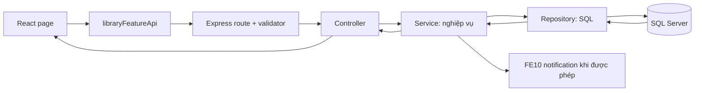

# Thiết kế: Bản đồ trình bày FE07, FE08, FE10 và FE12

**Trạng thái:** Dự thảo đã tự rà soát, chờ người dùng duyệt bản thiết kế viết

**Ngày:** 2026-07-30
**Batch đề xuất:** `BATCH-FE07-FE08-FE10-FE12-PRESENTATION-NAVIGATION-2026-07-30`

## 1. Quyết định

Giữ nguyên kiến trúc layered monolith hiện có. Không tạo `features/`,
`use-cases/`, `domain/`, `adapters/`, hoặc bất kỳ tầng/thư mục mới nào.

Thay vì tái cấu trúc source code, batch này tạo một bản đồ trình bày ngắn để
người bảo vệ có thể lần theo mỗi nghiệp vụ theo cùng một đường đi:

```text
Trang React -> libraryFeatureApi -> Route + validator -> Controller
-> Service (quy tắc nghiệp vụ) -> Repository (SQL) -> kết quả hiển thị
```

Đây là một batch Hybrid, độ sâu **Light**: Core là tính đúng đắn của luồng
nghiệp vụ hiện có và các ràng buộc API/dữ liệu; Shell là tài liệu chỉ đường cho
việc trình bày. Không có Core nào bị thay đổi.

## 2. Mục tiêu và tiêu chí thành công

Mục tiêu là giúp Nhat mở đúng file và giải thích đúng nghiệp vụ khi hội đồng
hỏi, không phải làm lại kiến trúc theo thuật ngữ học thuật.

Hoàn tất khi một tài liệu mới đáp ứng cả bốn điều sau:

1. Mỗi FE07, FE08, FE10 và FE12 có một bảng tra cứu gồm: màn hình/route, lời
   gọi frontend, HTTP request, controller, hàm service, repository và rule
   SPEC liên quan.
2. Có một câu chuyện demo liên hoàn FE07 -> FE08 -> FE10 -> FE12 và nói rõ
   ranh giới: trả sách FE07 chỉ trả handoff đọc; nhân viên mới chủ động xử lý
   hàng đợi FE08; lỗi FE10 không rollback giao dịch nguồn.
3. Mỗi thao tác được giải thích theo mẫu dễ nói: **bấm gì -> gửi gì -> server
   kiểm tra gì -> truy vấn/transaction gì -> người dùng thấy gì**.
4. Tất cả đường dẫn và tên hàm trong tài liệu đều được kiểm tra tồn tại tại
   commit đang làm việc; tài liệu không tự tạo ra nghiệp vụ mới.

## 3. Phạm vi và ranh giới

### Trong phạm vi

- Tạo `docs/architecture/fe07-fe08-fe10-fe12-presentation-map.md`.
- Liên kết chính xác tới các page, `libraryFeatureApi`, route, controller,
  service, repository và SPEC đang có.
- Ghi các điểm trình bày quan trọng cho bốn tính năng và luồng liên hoàn.
- Ghi script demo desktop ngắn, dùng đúng actor và route hiện có.

### Ngoài phạm vi

- Không đổi API, route, payload, phân quyền, schema SQL, trạng thái hoặc quy
  tắc nghiệp vụ.
- Không đổi UI, seed data, cấu hình Azure hay Azure SQL.
- Không tách `borrowingService.js`, `reservationService.js`,
  `notificationService.js`, `reportService.js`, các repository, hoặc React
  page thành nhiều file mới.
- Không đổi task/SPEC đã hoàn tất; tài liệu chỉ tham chiếu các ID hiện có.

## 4. Cấu trúc cần giữ nguyên



| FE | Điểm bắt đầu chính | Service cần tìm | Vai trò trong câu chuyện |
| --- | --- | --- | --- |
| FE07 | `BorrowRequestPage`, `BorrowRequestsAdminPage`, `ProcessReturnsPage`, `BorrowingHistoryPage` | `borrowingService` | Tạo, duyệt/từ chối, trả, gia hạn và lịch sử mượn. |
| FE08 | `MyReservationsPage`, `ReservationsLibrarianPage` | `reservationService` | Đặt chỗ, giữ sách cho người đầu hàng đợi, bàn giao sang FE07. |
| FE10 | `NotificationsPage` và chuông hộp thư | `notificationService` | Hộp thư cá nhân, read state, idempotency và action path cố định. |
| FE12 | `BorrowingReportPage`, `InventoryReportPage`, `UserStatisticsPage` | `reportService` | Báo cáo chỉ đọc, phân quyền nhân viên và số liệu từ trạng thái chính tắc. |

Không tạo một lớp trung gian để nối các cột trên. Các file hiện có chính là
điểm mở đầu duy nhất theo từng lớp.

## 5. Luồng trình bày liên hoàn

Tài liệu sẽ dùng đúng trình tự sau, không khẳng định quan hệ sai giữa các FE:

1. Thành viên tạo yêu cầu mượn ở FE07; service đánh giá điều kiện và repository
   ghi transaction.
2. Thủ thư duyệt/từ chối FE07. Khi transaction thành công, FE07 yêu cầu FE10
   tạo đúng một thông báo kết quả. FE10 lỗi chỉ tạo cảnh báo trung thực, không
   rollback FE07.
3. Nếu bản sao cần được giữ, thủ thư vào FE08 xử lý hàng đợi. FE08 chọn người
   hợp lệ đầu tiên, giữ đúng bản sao và yêu cầu FE10 gửi thông báo. Không có
   thao tác trả FE07 nào tự động xử lý hàng đợi.
4. Chủ sở hữu reservation `NOTIFIED` dùng CTA FE08 để mở FE07 với đúng
   `copyId`; FE07 vẫn kiểm tra lại tất cả điều kiện mượn ở server.
5. FE12 đọc snapshot/report từ trạng thái đã commit. Frontend không tự cộng KPI
   từ danh sách phân trang và không thay đổi dữ liệu nguồn.

## 6. Nội dung của bản đồ trình bày

Mỗi feature có cùng sáu mục, theo thứ tự cố định:

1. **Khi thầy cô hỏi gì:** một câu trả lời nghiệp vụ ngắn.
2. **Bấm ở đâu:** actor, trang và hành động.
3. **Request:** phương thức HTTP, URL, body hoặc query string, đồng thời nêu
   actor lấy từ `Authorization: Bearer`, không lấy từ form.
4. **Server xử lý:** validator -> controller -> service, cùng rule SPEC cần
   nêu.
5. **Dữ liệu:** repository/bảng/trạng thái được đọc hoặc ghi.
6. **Kết quả thật:** response/UI/notification/handoff và tình huống lỗi cần
   nói trung thực.

Hai bảng phụ sẽ được thêm:

- **Bảng “mở file nào”**: mỗi hàng chỉ một đường dẫn source và lý do mở file.
- **Bảng “câu hỏi phản biện thường gặp”**: race condition, quyền sở hữu,
  idempotency, `Asia/Ho_Chi_Minh`, dữ liệu nhạy cảm và read-only reporting.

## 7. Rủi ro và cách kiểm soát

| Rủi ro | Kiểm soát |
| --- | --- |
| Tài liệu dẫn tới file/hàm không còn tồn tại | Kiểm tra bằng `rg` trước khi H2. |
| Tài liệu đơn giản hóa sai nghiệp vụ | Mỗi tuyên bố gắn một SPEC/BR/FR/AC đang có; không tự suy diễn. |
| Người trình bày hiểu FE10 là thao tác frontend độc lập | Ghi rõ FE10 được FE07/FE08 gọi ở backend, còn `/notifications` là inbox đã đăng nhập. |
| Tài liệu trở thành một nguồn luật mới | Nêu rõ SPEC.md vẫn là nguồn sự thật; bản đồ chỉ phục vụ tra cứu/trình bày. |

## 8. Kế hoạch xác minh

- Kiểm tra sạch định dạng bằng `git diff --check`.
- Dò tất cả source path, tên service và endpoint bằng `rg`.
- Đối chiếu từng tuyên bố quan trọng với bốn SPEC, đặc biệt các phụ lục batch
  liên hoàn FE07-FE12.
- Chạy `npm run trace:enforce` nếu tài liệu tham chiếu traceability nằm trong
  phạm vi kiểm tra của script.
- Không cần chạy migration, Azure staging, hoặc browser mutation vì batch không
  làm thay đổi runtime.

## 9. Kế hoạch commit và gate

Sau khi Nhat duyệt bản thiết kế viết, batch sẽ tạo plan chi tiết. Mọi thay đổi
sau đó vẫn ở nhánh `docs/fe07-fe12-presentation-navigation`; H2 sẽ xác nhận
diff tài liệu và bằng chứng trước khi commit/push. Nếu có PR, H3 mới cho phép
merge. Không dùng nhánh tiền tố `codex/`.

## 10. Tự rà soát thiết kế

- Không có `TBD`, `TODO` hoặc placeholder.
- Phạm vi chỉ là navigation/presentation documentation; không biến thành
  refactor source code.
- Các giới hạn FE07/FE08/FE10/FE12 không mâu thuẫn: FE08 là thao tác nhân viên
  có chủ ý, FE10 best-effort sau commit, FE12 chỉ đọc.
- Thành công có thể kiểm chứng bằng đường dẫn source/SPEC và không phụ thuộc
  Azure SQL đang paused.
