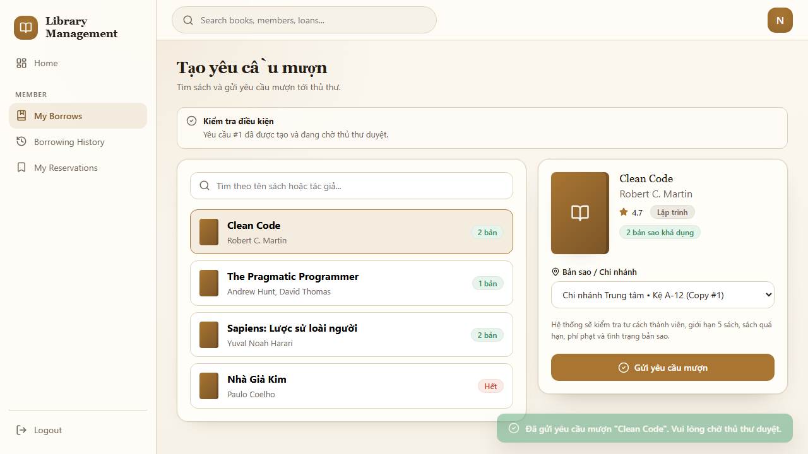
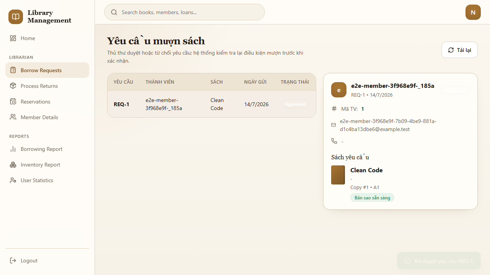
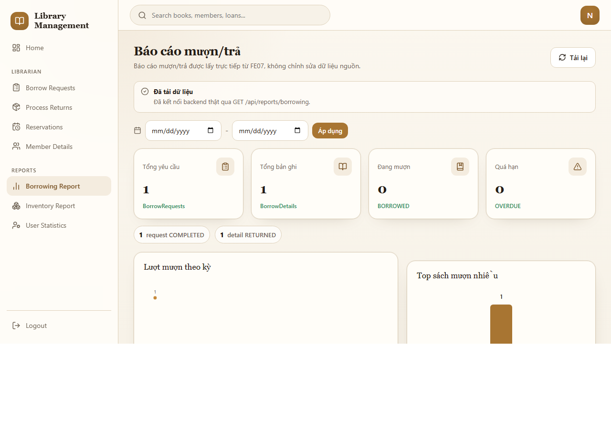

# Hướng Dẫn Sử Dụng Hệ Thống Quản Lý Thư Viện

Tài liệu này mô tả phạm vi release candidate Week 13. Hình ảnh sử dụng dữ liệu kiểm thử tổng hợp,
không phải tài khoản hoặc dữ liệu cá nhân thật.

## Vai Trò Được Hỗ Trợ

| Vai trò | Chức năng chính trong release candidate |
| --- | --- |
| Khách | Xem trang công khai, đăng ký và đăng nhập. |
| Thành viên | Tạo yêu cầu mượn, xem lịch sử mượn và quản lý đặt chỗ của mình. |
| Thủ thư | Duyệt yêu cầu mượn, xử lý trả sách, quản lý queue đặt chỗ, ghi nhận phạt qua API và xem báo cáo. |
| Quản trị viên | Quản lý người dùng/vai trò và có quyền truy cập các chức năng dành cho nhân viên. |

Hệ thống kiểm tra quyền ở backend. Việc nhìn thấy hoặc nhập trực tiếp một URL không đảm bảo người
dùng có quyền thực hiện thao tác đó.

## Đăng Nhập Và Đăng Xuất

Mở `/login`, nhập email hoặc tên tài khoản và mật khẩu, sau đó chọn **Đăng nhập**. Tùy chọn ghi nhớ
đăng nhập lưu phiên trong trình duyệt; không sử dụng tùy chọn này trên máy dùng chung.

Sau khi đăng nhập:

- Thành viên được chuyển tới lịch sử mượn.
- Thủ thư được chuyển tới khu vực nghiệp vụ thủ thư.
- Người không có đúng vai trò sẽ nhận trang cấm truy cập hoặc phản hồi 403.

Để đăng xuất, chọn **Logout** trên thanh điều hướng. Nếu phiên hết hạn, đăng nhập lại thay vì tiếp tục
thử thao tác với phiên cũ.

## Thành Viên: Tạo Yêu Cầu Mượn

1. Đăng nhập bằng tài khoản Thành viên đang hoạt động và đã được duyệt membership.
2. Mở **My Borrows** hoặc `/borrowing/new`.
3. Tìm và chọn sách/bản sao còn khả dụng.
4. Kiểm tra thông tin sách, chi nhánh và bản sao.
5. Chọn **Gửi yêu cầu mượn**.
6. Xác nhận thông báo yêu cầu đã được tạo và đang chờ thủ thư duyệt.

Yêu cầu có thể bị từ chối nếu thành viên đã đạt giới hạn 5 bản đang mượn, có sách quá hạn, có phạt
chưa thanh toán, membership không hợp lệ hoặc bản sao không còn khả dụng.

## Thành Viên: Xem Lịch Sử Mượn

Mở **Borrowing History** hoặc `/borrowing/history` để xem:

- yêu cầu đang chờ duyệt;
- bản sao đang mượn hoặc quá hạn;
- giao dịch đã trả, bị từ chối hoặc đã hoàn tất.

Trạng thái hiển thị được lấy từ backend. Khi API lỗi, giao diện phải hiển thị lỗi và trạng thái rỗng
thay vì tự tạo dữ liệu thành công mẫu.

## Thành Viên: Quản Lý Đặt Chỗ

Mở **My Reservations** hoặc `/reservations/mine`.

- Chỉ đặt chỗ khi bản sao không thể mượn ngay theo quy tắc FE08.
- Một reservation đang hoạt động không được tạo trùng cho cùng bản sao.
- Thành viên chỉ được hủy reservation của chính mình ở trạng thái cho phép.
- Khi đến lượt và có bản sao phù hợp, hệ thống có thể chuyển reservation sang trạng thái được thông
  báo/giữ chỗ theo queue.

Nếu queue thay đổi sau khi thủ thư xử lý, tải lại trang để xem trạng thái chuẩn từ backend.

## Thủ Thư: Duyệt Yêu Cầu Mượn

1. Đăng nhập bằng tài khoản Thủ thư hoặc Quản trị viên.
2. Mở **Borrow Requests** hoặc `/librarian/borrow-requests`.
3. Chọn yêu cầu `PENDING` cần xử lý.
4. Kiểm tra thành viên, sách và bản sao.
5. Chọn **Duyệt**, sau đó xác nhận **Duyệt & cấp sách**.
6. Kiểm tra yêu cầu chuyển thành `APPROVED` và bản sao chuyển sang trạng thái mượn.

Backend kiểm tra lại điều kiện mượn tại thời điểm duyệt. Không dựa vào dữ liệu eligibility do trình
duyệt tự suy đoán.

## Thủ Thư: Xử Lý Trả Sách

1. Mở **Process Returns** hoặc `/librarian/returns`.
2. Chọn bản ghi mượn đang hoạt động.
3. Kiểm tra ngày đến hạn, số ngày quá hạn và tình trạng bản sao.
4. Chọn **Xác nhận trả**.
5. Kiểm tra trạng thái mượn đã chuyển sang trả và bản sao được cập nhật đúng.

Nếu trả quá hạn, phản hồi có thể tạo `fineCandidate` để FE09 tính phạt. Giao diện FE07 không tự quyết
định số tiền phạt.

## Thủ Thư/Quản Trị Viên: Biên API Quản Lý Phạt

Luồng FE09 production-aligned chạy ở backend:

1. Tính phạt từ ngày đến hạn/ngày trả đã lưu, không nhận số tiền do client gửi.
2. Áp dụng 5.000 VND cho mỗi ngày quá hạn, bắt đầu từ ngày sau hạn trả.
3. Ngăn tạo trùng phạt quá hạn đang hoạt động cho cùng chi tiết mượn.
4. Cho phép Thủ thư/Quản trị viên ghi nhận thu tiền hoặc đánh dấu đã thanh toán.
5. Chỉ Quản trị viên được miễn/hủy phạt và phải ghi lý do.

Ví dụ kiểm thử chuẩn: 14 ngày quá hạn tạo số tiền 70.000 VND.

Trang `FineManagement.jsx` hiện vẫn có luồng local-storage phục vụ demo lớp học. Dữ liệu ở trang này
không được dùng làm bằng chứng Azure SQL; acceptance Week 13 sử dụng API production-aligned, system
integration test và staging evidence.

## Thủ Thư/Quản Trị Viên: Xem Báo Cáo

Mở một trong các trang:

- `/reports/borrowing`: báo cáo mượn/trả;
- `/reports/inventory`: báo cáo tồn kho;
- `/reports/users`: thống kê người dùng.

Sử dụng bộ lọc ngày, trạng thái, sách, danh mục hoặc vai trò theo từng trang. Báo cáo chỉ đọc dữ liệu
và không có quyền thay đổi giao dịch nguồn.

Dòng **Đã kết nối backend thật** xác nhận trang đang dùng API báo cáo thay vì dữ liệu fallback mẫu.

## Quản Trị Viên: Quản Lý Người Dùng Và Vai Trò

Mở `/admin/users` bằng tài khoản Quản trị viên để:

- xem và lọc danh sách người dùng;
- tạo tài khoản theo phạm vi FE11 hiện có;
- cập nhật thông tin/trạng thái;
- gán hoặc thu hồi vai trò;
- xem audit log được cấp quyền.

Backend từ chối người dùng không có vai trò Admin. Không dùng tài khoản giả hoặc bypass xác thực trong
môi trường development/staging.

## Lỗi Thường Gặp Và Cách Khôi Phục

| Hiện tượng | Cách xử lý an toàn |
| --- | --- |
| 401 hoặc bị chuyển về login | Xóa phiên cũ bằng Logout và đăng nhập lại. |
| 403 / Forbidden | Kiểm tra tài khoản có đúng vai trò; không thử vượt quyền bằng URL trực tiếp. |
| Không kết nối được backend | Kiểm tra `/health`, URL API và kết nối mạng; không coi dữ liệu demo là thành công. |
| Yêu cầu mượn bị từ chối | Kiểm tra membership, giới hạn mượn, sách quá hạn, phạt chưa trả và trạng thái bản sao. |
| Reservation không thể tạo/hủy | Tải lại trạng thái chuẩn và kiểm tra ownership/state transition FE08. |
| Email không nhận được | Kiểm tra SMTP staging; notification metadata không đồng nghĩa email đã gửi thành công. |
| Báo cáo rỗng | Xóa bộ lọc không phù hợp, kiểm tra quyền và khoảng ngày, sau đó tải lại. |

Không chụp hoặc chia sẻ phản hồi chứa bearer token, reset link, OTP, notification body hoặc connection
string khi báo lỗi.

## Bảo Mật Và Quyền Riêng Tư

- Chỉ sử dụng tài khoản synthetic trong staging và thuyết trình.
- Không lưu mật khẩu/token trong tài liệu, slide, source code hoặc terminal history dùng chung.
- Không hiển thị notification body, `SafePayload` hoặc biến môi trường trong demo.
- Đăng xuất khỏi trình duyệt dùng chung sau khi hoàn tất.
- Thủ thư/Quản trị viên chỉ xem dữ liệu cần thiết cho nghiệp vụ.
- Các hành động quan trọng được ghi audit theo phạm vi feature.

## Giới Hạn Đã Biết

- FE09 frontend chưa được căn chỉnh hoàn toàn với server API production-aligned.
- FE10 chưa có notification inbox UI hoàn chỉnh.
- SMTP chỉ hoạt động khi staging mail provider được cấu hình.
- Avatar trên App Service cần storage bền vững trước khi triển khai production quy mô lớn.
- Frontend build hiện có cảnh báo chunk lớn nhưng không chặn build.

## Tài Liệu Liên Quan

- [Acceptance record Week 13](release/week13-acceptance-record.md)
- [System architecture](architecture/system-architecture.md)
- [Azure staging guide](deployment/azure-staging-guide.md)
- [System integration demo runbook](testing/system-integration-demo-runbook.md)
