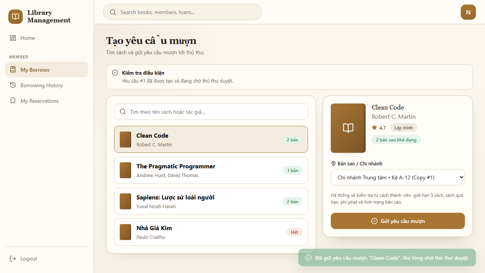
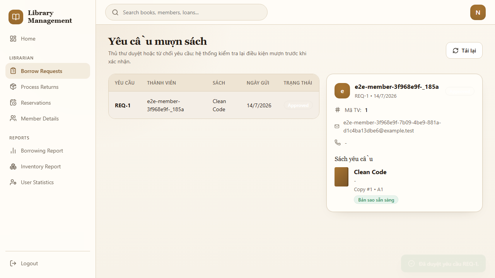
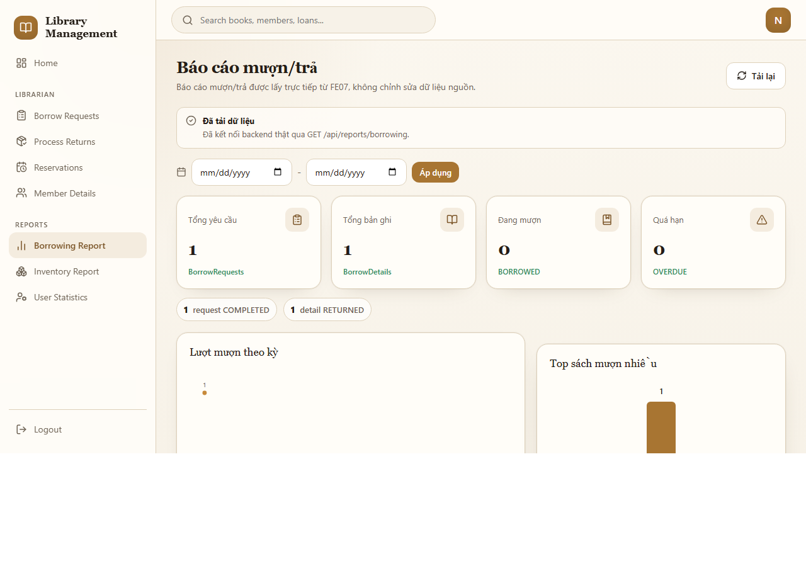

# Hướng Dẫn Sử Dụng Hệ Thống Quản Lý Thư Viện

Tài liệu này mô tả phạm vi release candidate Week 13. Hình ảnh sử dụng dữ liệu kiểm thử tổng hợp,
không phải tài khoản hoặc dữ liệu cá nhân thật.

## Vai Trò Được Hỗ Trợ

| Vai trò | Chức năng chính trong release candidate |
| --- | --- |
| Khách | Xem trang công khai, đăng ký và đăng nhập. |
| Thành viên | Tạo yêu cầu mượn, xem lịch sử mượn, quản lý đặt chỗ và xem thông báo cá nhân của mình. |
| Thủ thư | Duyệt yêu cầu mượn, xử lý trả sách, quản lý queue đặt chỗ, ghi nhận phạt qua API, xem báo cáo và thông báo cá nhân của mình. |
| Quản trị viên | Quản lý người dùng/vai trò, có quyền truy cập các chức năng dành cho nhân viên và xem thông báo cá nhân của mình. |

Hệ thống kiểm tra quyền ở backend. Việc nhìn thấy hoặc nhập trực tiếp một URL không đảm bảo người
dùng có quyền thực hiện thao tác đó.

## Đăng Nhập Và Đăng Xuất

Mở `/login`, nhập email hoặc tên tài khoản và mật khẩu, sau đó chọn **Đăng nhập**. Tùy chọn ghi nhớ
đăng nhập lưu phiên trong trình duyệt; không sử dụng tùy chọn này trên máy dùng chung.

Sau khi đăng nhập:

- Thành viên được chuyển tới lịch sử mượn.
- Thủ thư được chuyển tới khu vực nghiệp vụ thủ thư.
- Người không có đúng vai trò sẽ nhận trang cấm truy cập hoặc phản hồi 403.

Để đăng xuất, chọn **Logout** trên thanh điều hướng. Nếu phiên hết hạn, đăng nhập lại thay vì tiếp tục
thử thao tác với phiên cũ.

## Thành Viên: Tạo Yêu Cầu Mượn

1. Đăng nhập bằng tài khoản Thành viên đang hoạt động và đã được duyệt membership.
2. Mở **My Borrows** hoặc `/borrowing/new`.
3. Tìm và chọn sách/bản sao còn khả dụng.
4. Kiểm tra thông tin sách, chi nhánh và bản sao.
5. Chọn **Gửi yêu cầu mượn**.
6. Xác nhận thông báo yêu cầu đã được tạo và đang chờ thủ thư duyệt.

Yêu cầu có thể bị từ chối nếu thành viên đã đạt giới hạn 5 bản đang mượn, có sách quá hạn, có phạt
chưa thanh toán, membership không hợp lệ hoặc bản sao không còn khả dụng.

## Thành Viên: Xem Lịch Sử Mượn

Mở **Borrowing History** hoặc `/borrowing/history` để xem:

- yêu cầu đang chờ duyệt;
- bản sao đang mượn hoặc quá hạn;
- giao dịch đã trả, bị từ chối hoặc đã hoàn tất.

Mỗi giao dịch hiển thị timeline từ dữ liệu backend: đã gửi yêu cầu, đã duyệt
hoặc từ chối, đang mượn và đã trả. Mốc nào backend chưa ghi thời gian thì giao
diện để trống; trình duyệt không tự tạo thời gian để làm timeline có vẻ hoàn tất.

Trạng thái hiển thị được lấy từ backend. Khi API lỗi, giao diện phải hiển thị lỗi và trạng thái rỗng
thay vì tự tạo dữ liệu thành công mẫu.

## Thành Viên: Quản Lý Đặt Chỗ

Mở **My Reservations** hoặc `/reservations/mine`.

- Chỉ đặt chỗ khi bản sao không thể mượn ngay theo quy tắc FE08.
- Một reservation đang hoạt động không được tạo trùng cho cùng bản sao.
- Thành viên chỉ được hủy reservation của chính mình ở trạng thái cho phép.
- Khi đến lượt và có bản sao phù hợp, hệ thống có thể chuyển reservation sang trạng thái được thông
  báo/giữ chỗ theo queue.
- Reservation `NOTIFIED` hiển thị thời gian bắt đầu và hạn nhận sách. Chỉ đúng
  Thành viên được giữ sách mới thấy nút **Tạo yêu cầu mượn** cho chính xác
  `bookId`/`copyId` đó.

Nếu queue thay đổi sau khi thủ thư xử lý, tải lại trang để xem trạng thái chuẩn từ backend.

## Thủ Thư: Duyệt Yêu Cầu Mượn

1. Đăng nhập bằng tài khoản Thủ thư hoặc Quản trị viên.
2. Mở **Borrow Requests** hoặc `/librarian/borrow-requests`.
3. Chọn yêu cầu `PENDING` cần xử lý.
4. Kiểm tra thành viên, sách và bản sao.
5. Chọn **Duyệt**, sau đó xác nhận **Duyệt và cấp sách**.
6. Kiểm tra yêu cầu chuyển thành `APPROVED` và bản sao chuyển sang trạng thái mượn.

Backend kiểm tra lại điều kiện mượn tại thời điểm duyệt. Không dựa vào dữ liệu eligibility do trình
duyệt tự suy đoán.

## Thủ Thư: Xử Lý Trả Sách

1. Mở **Process Returns** hoặc `/librarian/returns`.
2. Chọn bản ghi mượn đang hoạt động.
3. Kiểm tra ngày đến hạn, số ngày quá hạn và tình trạng bản sao.
4. Chọn **Xác nhận trả**.
5. Kiểm tra trạng thái mượn đã chuyển sang trả và bản sao được cập nhật đúng.
6. Nếu bản sao có hàng đợi `ACTIVE`, chọn **Xử lý hàng đợi đặt chỗ** trong
   panel bàn giao xuất hiện sau khi trả thành công.
7. FE08 mở đúng hàng đợi của bản sao vừa trả. Chọn **Giữ sách & thông báo**,
   sau đó xác nhận **Xác nhận giữ sách**.

Nếu trả quá hạn, phản hồi có thể tạo `fineCandidate` để FE09 tính phạt. Giao diện FE07 không tự quyết
định số tiền phạt.

Trả sách và giữ chỗ là hai transaction riêng. Nút bàn giao FE07 chỉ điều hướng
tới FE08; nếu chưa xác nhận tại FE08 thì hàng đợi chưa chuyển sang `NOTIFIED`.
Nếu tạo thông báo lỗi sau khi transaction nguồn đã commit, giao diện hiển thị
cảnh báo thay vì nói rằng cả nghiệp vụ đã thất bại.

## Demo Liên Hoàn FE07 → FE08 → FE10 → FE12

Dùng hai tài khoản Thành viên A/B và một tài khoản Thủ thư:

1. A mở `/borrowing/new`, gửi yêu cầu cho một bản sao `AVAILABLE`.
2. Thủ thư mở `/librarian/borrow-requests` và duyệt; A nhận thông báo
   **Yêu cầu mượn đã được duyệt**.
3. A mở thông báo; hệ thống đánh dấu đã đọc và điều hướng cố định tới
   `/borrowing/history`, nơi timeline hiển thị trạng thái `BORROWED`.
4. B mở `/reservations/mine` và đặt đúng bản sao đang được A mượn; reservation
   chuyển sang `ACTIVE`.
5. Thủ thư trả sách tại `/librarian/returns`, dùng panel bàn giao để mở đúng
   queue tại `/librarian/reservations`, rồi giữ sách cho người đầu hàng đợi.
6. B nhận **Reservation ready**, mở `/reservations/mine`, kiểm tra hạn nhận và
   chọn **Tạo yêu cầu mượn** cho đúng bản sao được giữ.
7. Thủ thư duyệt yêu cầu của B. FE07 chuyển bản sao sang `BORROWED`, đồng thời
   reservation của B chuyển sang `FULFILLED`.
8. Thủ thư mở `/home`. Sáu KPI FE12 phải khớp snapshot backend: yêu cầu chờ
   duyệt, sách đang mượn, sách quá hạn, đặt chỗ đang mở, bản sao sẵn có và đầu
   sách sắp hết.

Luồng này đúng nghiệp vụ vì mỗi feature chỉ sở hữu transaction của mình:
FE07 sở hữu mượn/trả, FE08 sở hữu queue/hold, FE10 chỉ ghi yêu cầu thông báo
sau commit và FE12 chỉ đọc snapshot tổng hợp.

## Thủ Thư/Quản Trị Viên: Biên API Quản Lý Phạt

Luồng FE09 production-aligned chạy ở backend:

1. Tính phạt từ ngày đến hạn/ngày trả đã lưu, không nhận số tiền do client gửi.
2. Áp dụng 5.000 VND cho mỗi ngày quá hạn, bắt đầu từ ngày sau hạn trả.
3. Ngăn tạo trùng phạt quá hạn đang hoạt động cho cùng chi tiết mượn.
4. Cho phép Thủ thư/Quản trị viên ghi nhận thu tiền hoặc đánh dấu đã thanh toán.
5. Chỉ Quản trị viên được miễn/hủy phạt và phải ghi lý do.

Ví dụ kiểm thử chuẩn: 14 ngày quá hạn tạo số tiền 70.000 VND.

Trang `FineManagement.jsx` hiện vẫn có luồng local-storage phục vụ demo lớp học. Dữ liệu ở trang này
không được dùng làm bằng chứng Azure SQL; acceptance Week 13 sử dụng API production-aligned, system
integration test và staging evidence.

## Thủ Thư/Quản Trị Viên: Xem Báo Cáo

Mở một trong các trang:

- `/reports/borrowing`: báo cáo mượn/trả;
- `/reports/inventory`: báo cáo tồn kho;
- `/reports/users`: thống kê người dùng.

Sử dụng bộ lọc ngày, trạng thái, sách, danh mục hoặc vai trò theo từng trang. Báo cáo chỉ đọc dữ liệu
và không có quyền thay đổi giao dịch nguồn.

Dòng **Đã kết nối backend thật** xác nhận trang đang dùng API báo cáo thay vì dữ liệu fallback mẫu.

Trang `/home` của Thủ thư/Quản trị viên còn hiển thị sáu KPI vận hành từ một
request `GET /api/reports/operations-summary`. Giá trị không tải được phải hiện
**Không tải được**, không được thay bằng `0`. Mỗi thẻ điều hướng tới màn nghiệp
vụ cố định và không thay đổi dữ liệu nguồn.

## Quản Trị Viên: Quản Lý Người Dùng Và Vai Trò

Mở `/admin/users` bằng tài khoản Quản trị viên để:

- xem và lọc danh sách người dùng;
- tạo tài khoản theo phạm vi FE11 hiện có;
- cập nhật thông tin/trạng thái;
- gán hoặc thu hồi vai trò;
- xem audit log được cấp quyền.

Backend từ chối người dùng không có vai trò Admin. Không dùng tài khoản giả hoặc bypass xác thực trong
môi trường development/staging.

## Thành Viên/Thủ Thư/Quản Trị Viên: Thông Báo Cá Nhân

Sau khi đăng nhập, chọn biểu tượng chuông trên thanh điều hướng. Số chưa đọc hiển thị trên badge và
được rút gọn thành `99+` khi vượt quá 99. Mở chuông để xem tối đa năm thông báo chưa đọc mới nhất;
chọn **Xem tất cả** hoặc mở `/notifications` để xem toàn bộ hộp thư cá nhân.

Trên trang thông báo:

1. Chọn **Tất cả**, **Chưa đọc** hoặc **Đã đọc**; mỗi trang hiển thị tối đa 20 mục.
2. Chọn một mục để đánh dấu đã đọc và mở đúng nghiệp vụ: membership, đặt chỗ, lịch sử mượn hoặc phạt.
3. Chọn **Đánh dấu tất cả đã đọc** để cập nhật các mục chưa đọc của chính tài khoản hiện tại.
4. Nếu cập nhật trạng thái đọc lỗi, hệ thống hiển thị cảnh báo an toàn nhưng vẫn mở đường dẫn nghiệp
   vụ đã được backend cho phép. Tải lại trang để đồng bộ trạng thái đọc.

Kết quả duyệt/từ chối/gia hạn/trả của FE07 dùng bốn template do FE07 sở hữu và
luôn mở `/borrowing/history`. Thông báo sách sẵn sàng của FE08 luôn mở
`/reservations/mine`. Nội dung từ chối không chứa lý do từ chối, email, token,
OTP hoặc dữ liệu nhạy cảm khác.

Hộp thư chỉ hiển thị các thông báo nghiệp vụ không nhạy cảm thuộc chính người đang đăng nhập. OTP,
đặt lại mật khẩu, liên kết thiết lập tài khoản, thông báo legacy, bản ghi hệ thống không có người nhận
và thông báo của người khác không xuất hiện. Thủ thư/Quản trị viên không có hộp thư toàn hệ thống và
không thể xóa hay lưu trữ thông báo.

## Lỗi Thường Gặp Và Cách Khôi Phục

| Hiện tượng | Cách xử lý an toàn |
| --- | --- |
| 401 hoặc bị chuyển về login | Xóa phiên cũ bằng Logout và đăng nhập lại. |
| 403 / Forbidden | Kiểm tra tài khoản có đúng vai trò; không thử vượt quyền bằng URL trực tiếp. |
| Không kết nối được backend | Kiểm tra `/health`, URL API và kết nối mạng; không coi dữ liệu demo là thành công. |
| Yêu cầu mượn bị từ chối | Kiểm tra membership, giới hạn mượn, sách quá hạn, phạt chưa trả và trạng thái bản sao. |
| Reservation không thể tạo/hủy | Tải lại trạng thái chuẩn và kiểm tra ownership/state transition FE08. |
| Chuông/trang thông báo không cập nhật | Chuyển focus lại trình duyệt hoặc tải lại trang; kiểm tra phiên đăng nhập và API. Polling nền chạy mỗi 60 giây và không chồng request. |
| Chọn thông báo nhưng vẫn còn trạng thái chưa đọc | Hệ thống vẫn cho mở nghiệp vụ an toàn khi thao tác đọc lỗi; tải lại và thử đánh dấu lại sau. |
| Email không nhận được | Kiểm tra SMTP staging; notification metadata không đồng nghĩa email đã gửi thành công. |
| Báo cáo rỗng | Xóa bộ lọc không phù hợp, kiểm tra quyền và khoảng ngày, sau đó tải lại. |

Không chụp hoặc chia sẻ phản hồi chứa bearer token, reset link, OTP, notification body hoặc connection
string khi báo lỗi.

## Bảo Mật Và Quyền Riêng Tư

- Chỉ sử dụng tài khoản synthetic trong staging và thuyết trình.
- Không lưu mật khẩu/token trong tài liệu, slide, source code hoặc terminal history dùng chung.
- Chỉ hiển thị nội dung inbox không nhạy cảm bằng chính tài khoản nhận; không hiển thị OTP, link xác
  thực/thiết lập, `SafePayload`, metadata giao hàng hoặc biến môi trường trong demo.
- Đăng xuất khỏi trình duyệt dùng chung sau khi hoàn tất.
- Thủ thư/Quản trị viên chỉ xem dữ liệu cần thiết cho nghiệp vụ.
- Các hành động quan trọng được ghi audit theo phạm vi feature.

## Giới Hạn Đã Biết

- FE09 frontend chưa được căn chỉnh hoàn toàn với server API production-aligned.
- SMTP chỉ hoạt động khi staging mail provider được cấu hình.
- Avatar trên App Service cần storage bền vững trước khi triển khai production quy mô lớn.
- Frontend build hiện có cảnh báo chunk lớn nhưng không chặn build.

## Tài Liệu Liên Quan

- [Acceptance record Week 13](release/week13-acceptance-record.md)
- [System architecture](architecture/system-architecture.md)
- [Azure staging guide](deployment/azure-staging-guide.md)
- [System integration demo runbook](testing/system-integration-demo-runbook.md)
