# Library Management Class Diagram Specification

## 1. Purpose and Notation

This document specifies the backend class structure of the Library Management System by feature (FE01-FE12). It is derived from the current route, controller, service, repository, model, and approved SDS artifacts.

The Node.js implementation uses CommonJS objects and factory functions rather than JavaScript `class` declarations. Each UML class below therefore represents a logical runtime component.

| Relationship | Meaning |
| --- | --- |
| `A --> B` | A calls or depends on B. |
| `A ..> B` | A uses B as a cross-feature dependency. |
| `Repository --> Model` | Repository maps rows using model metadata. |

## 2. FE01 - Public Browse

### Class Diagram

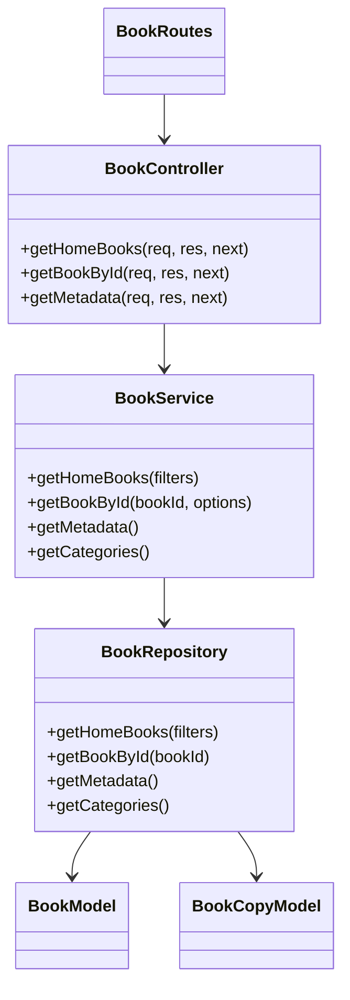

| Component | Responsibility | Source |
| --- | --- | --- |
| `BookRoutes` | Exposes public catalogue, detail, and metadata endpoints. | `backend/src/routes/bookRoutes.js` |
| `BookController` | Maps HTTP queries and identifiers to service calls. | `backend/src/controllers/bookController.js` |
| `BookService` | Enforces public-safe visibility and validates catalogue requests. | `backend/src/services/bookService.js` |
| `BookRepository` | Reads active books, metadata, copy counts, and availability. | `backend/src/repositories/bookRepository.js` |
| `BookModel`, `BookCopyModel` | Define row mappings for catalogue and copy data. | `backend/src/models/Book.js`, `backend/src/models/BookCopy.js` |

## 3. FE02 - Authentication

### Class Diagram

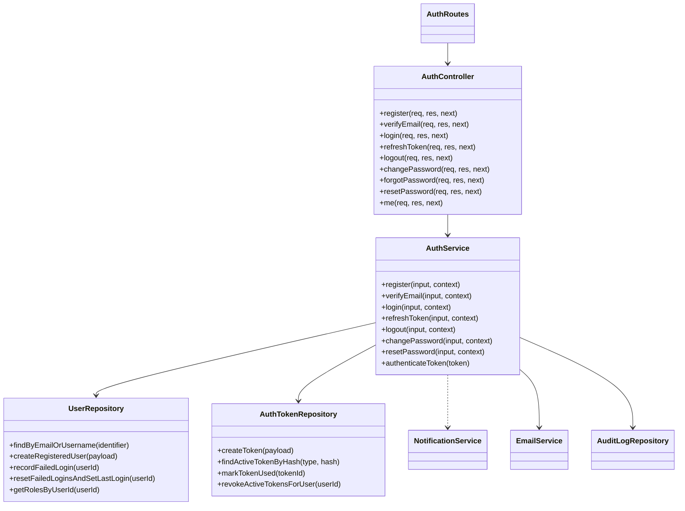

| Component | Responsibility | Source |
| --- | --- | --- |
| `AuthRoutes` | Declares authentication endpoints, validators, and middleware. | `backend/src/routes/authRoutes.js` |
| `AuthController` | Converts authentication HTTP requests into service commands. | `backend/src/controllers/authController.js` |
| `AuthService` | Implements registration, verification, sessions, password flows, and authorization identity. | `backend/src/services/authService.js` |
| `UserRepository` | Persists accounts, rolling login failures, verification, passwords, and role reads. | `backend/src/repositories/userRepository.js` |
| `AuthTokenRepository` | Persists only hashed refresh and one-time token records. | `backend/src/repositories/authTokenRepository.js` |
| `NotificationService`, `EmailService` | Deliver feature-owned verification/reset/setup messages. | `backend/src/services/notificationService.js`, `backend/src/services/emailService.js` |
| `AuditLogRepository` | Records security-sensitive authentication events. | `backend/src/repositories/auditLogRepository.js` |

## 4. FE03 - User Profile

### Class Diagram

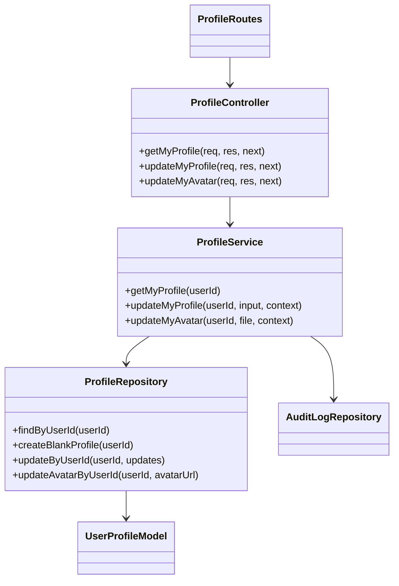

| Component | Responsibility | Source |
| --- | --- | --- |
| `ProfileRoutes` | Protects profile and avatar endpoints. | `backend/src/routes/profileRoutes.js` |
| `ProfileController` | Reads the authenticated identity and request payload/file. | `backend/src/controllers/profileController.js` |
| `ProfileService` | Validates editable fields and JPG/JPEG/PNG/WebP avatars up to 2 MB. | `backend/src/services/profileService.js` |
| `ProfileRepository` | Reads and updates `Users` and `UserProfiles`. | `backend/src/repositories/profileRepository.js` |
| `AuditLogRepository` | Records profile and avatar changes. | `backend/src/repositories/auditLogRepository.js` |

## 5. FE04 - Membership Management

### Class Diagram

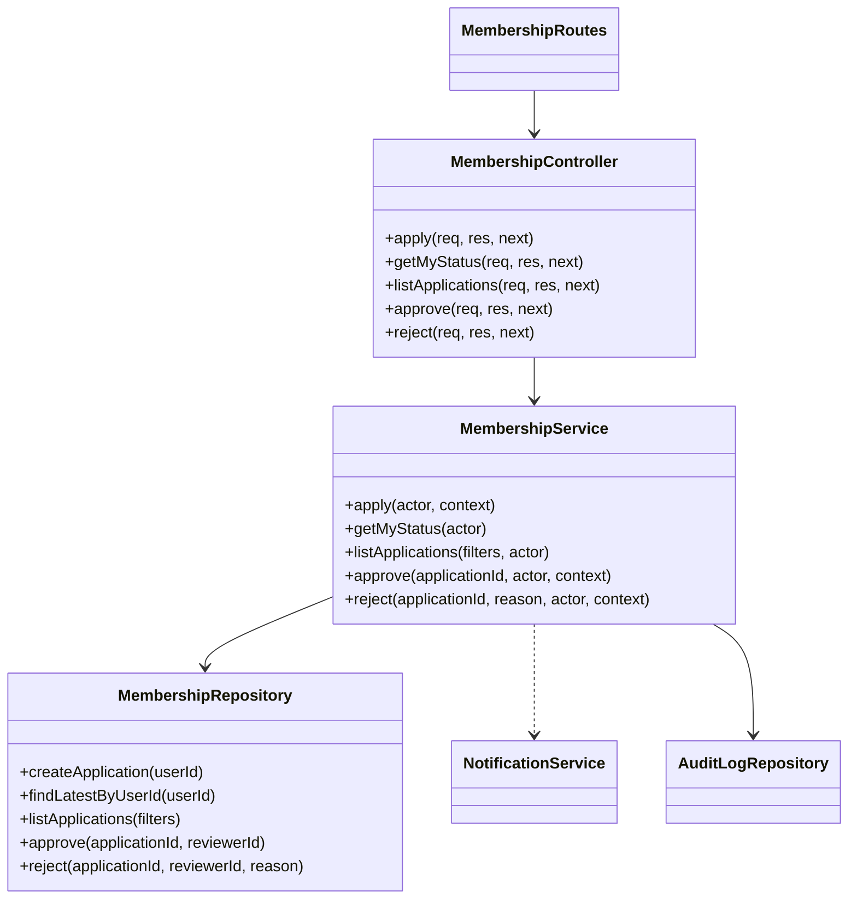

| Component | Responsibility | Source |
| --- | --- | --- |
| `MembershipRoutes` | Separates member self-service from staff review endpoints. | `backend/src/routes/membershipRoutes.js` |
| `MembershipController` | Maps application/review requests to the service. | `backend/src/controllers/membershipController.js` |
| `MembershipService` | Enforces application eligibility and review permissions. | `backend/src/services/membershipService.js` |
| `MembershipRepository` | Persists applications and the canonical member projection transactionally. | `backend/src/repositories/membershipRepository.js` |
| `NotificationService`, `AuditLogRepository` | Notify applicants and record review actions. | Shared FE10 and audit components. |

## 6. FE05 - Book Management

### Class Diagram

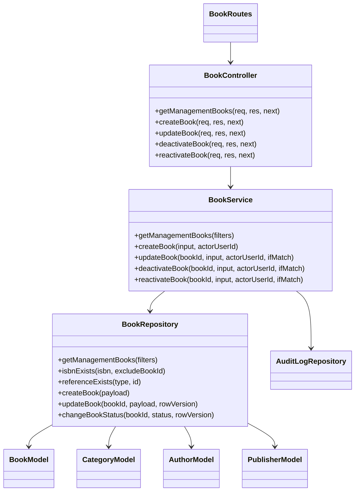

| Component | Responsibility | Source |
| --- | --- | --- |
| `BookRoutes` | Exposes Librarian/Admin catalogue-management endpoints. | `backend/src/routes/bookRoutes.js` |
| `BookController` | Reads payloads, uploads, and `If-Match` tokens. | `backend/src/controllers/bookController.js` |
| `BookService` | Validates catalogue fields, references, ISBN, cover upload, reason, and concurrency. | `backend/src/services/bookService.js` |
| `BookRepository` | Executes parameterized catalogue and metadata queries. | `backend/src/repositories/bookRepository.js` |
| Catalogue models | Map `Books`, `Categories`, `Authors`, and `Publishers`. | `backend/src/models/` |

## 7. FE06 - Inventory / Book Copy

### Class Diagram

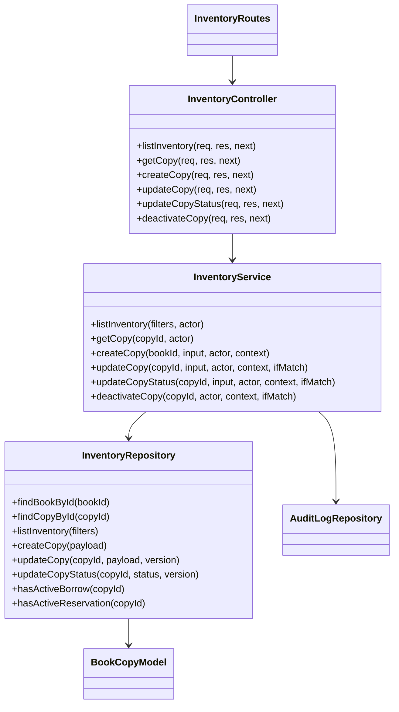

| Component | Responsibility | Source |
| --- | --- | --- |
| `InventoryRoutes` | Exposes protected physical-copy endpoints. | `backend/src/routes/inventoryRoutes.js` |
| `InventoryController` | Maps copy identifiers, payloads, and concurrency headers. | `backend/src/controllers/inventoryController.js` |
| `InventoryService` | Enforces copy status ownership, parent-book state, active use, and `If-Match`. | `backend/src/services/inventoryService.js` |
| `InventoryRepository` | Persists copy metadata/status and checks active borrowing/reservations. | `backend/src/repositories/inventoryRepository.js` |
| `BookCopyModel` | Maps `BookCopies`, including `Version`. | `backend/src/models/BookCopy.js` |

## 8. FE07 - Borrowing Management

### Class Diagram

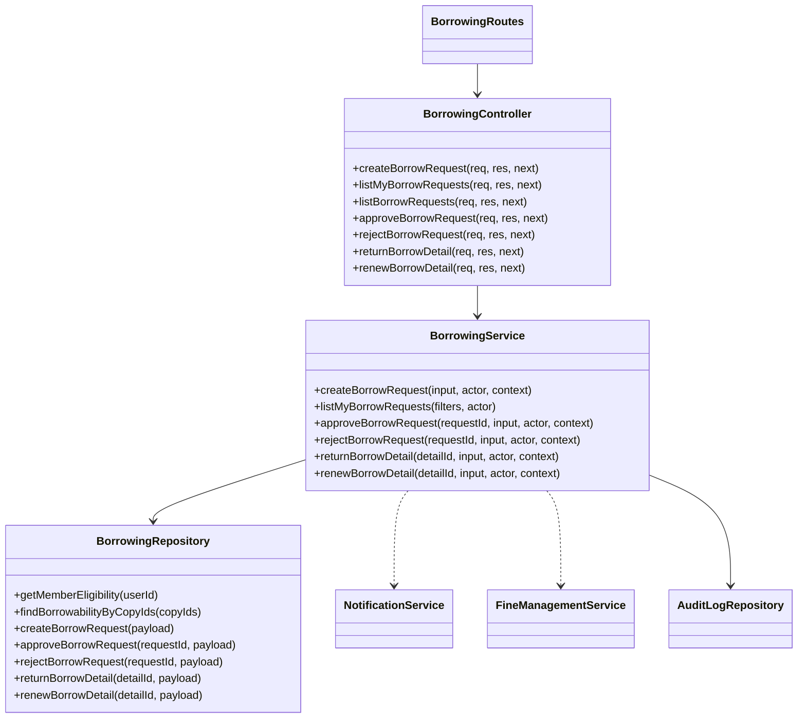

| Component | Responsibility | Source |
| --- | --- | --- |
| `BorrowingRoutes` | Exposes member requests/history and staff processing endpoints. | `backend/src/routes/borrowingRoutes.js` |
| `BorrowingController` | Maps request/detail identifiers and lifecycle commands. | `backend/src/controllers/borrowingController.js` |
| `BorrowingService` | Enforces membership, blockers, daily/active limits, 14-day loan, return, and renewal rules. | `backend/src/services/borrowingService.js` |
| `BorrowingRepository` | Executes eligibility reads and transactional request/detail/copy mutations. | `backend/src/repositories/borrowingRepository.js` |
| Cross-feature services | Send notices and trigger fine calculation where required. | FE10 and FE09 services. |

## 9. FE08 - Reservation Management

### Class Diagram

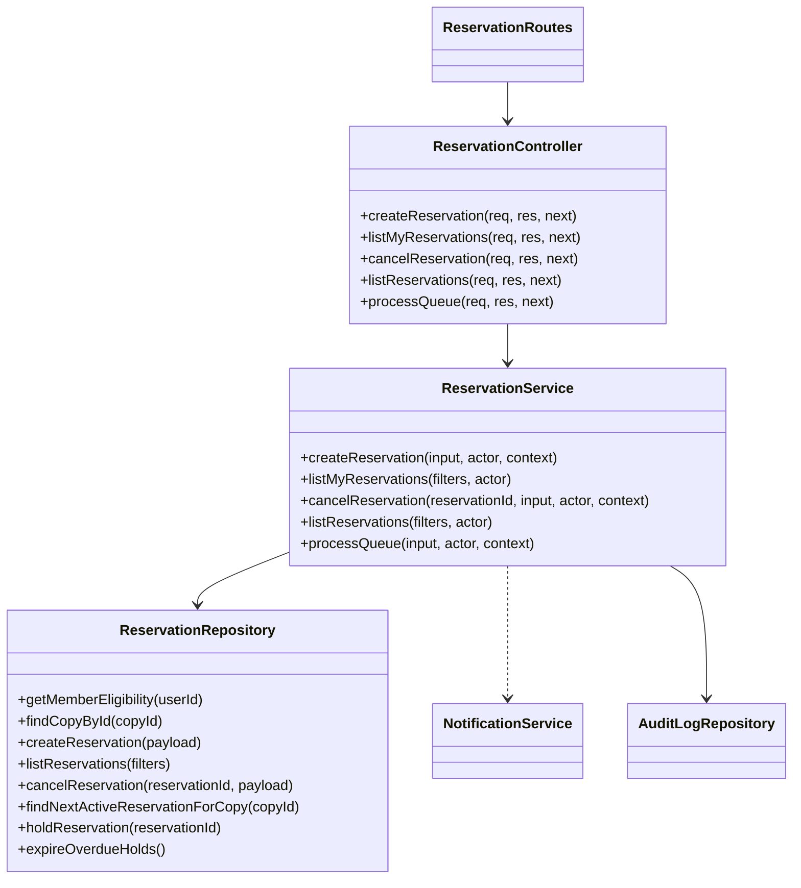

| Component | Responsibility | Source |
| --- | --- | --- |
| `ReservationRoutes` | Exposes member reservation and staff queue endpoints. | `backend/src/routes/reservationRoutes.js` |
| `ReservationController` | Maps reservation filters, identifiers, and queue commands. | `backend/src/controllers/reservationController.js` |
| `ReservationService` | Enforces eligibility, duplicate prevention, queue order, holds, cancellation, and expiry. | `backend/src/services/reservationService.js` |
| `ReservationRepository` | Persists queue state and performs locked queue selection/mutation. | `backend/src/repositories/reservationRepository.js` |
| `NotificationService` | Sends availability and reservation lifecycle notifications. | `backend/src/services/notificationService.js` |

## 10. FE09 - Fine Management

### Class Diagram

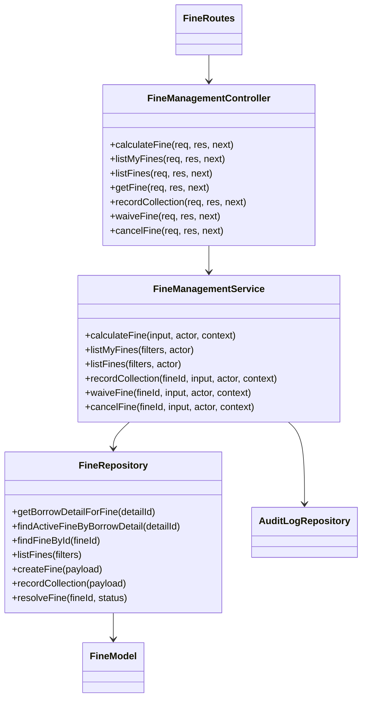

| Component | Responsibility | Source |
| --- | --- | --- |
| `FineRoutes` | Separates member reads, staff collection, and Admin-only resolution. | `backend/src/routes/fineRoutes.js` |
| `FineManagementController` | Maps fine identifiers and collection/waiver/cancellation commands. | `backend/src/controllers/fineManagementController.js` |
| `FineManagementService` | Calculates 5,000 VND/day fines, rejects partial payment, and enforces resolution permissions. | `backend/src/services/fineManagementService.js` |
| `FineRepository` | Persists traceable calculation and terminal fine state. | `backend/src/repositories/fineRepository.js` |
| `AuditLogRepository` | Records collection, waiver, and cancellation actions. | `backend/src/repositories/auditLogRepository.js` |

## 11. FE10 - Notification Management

### Class Diagram

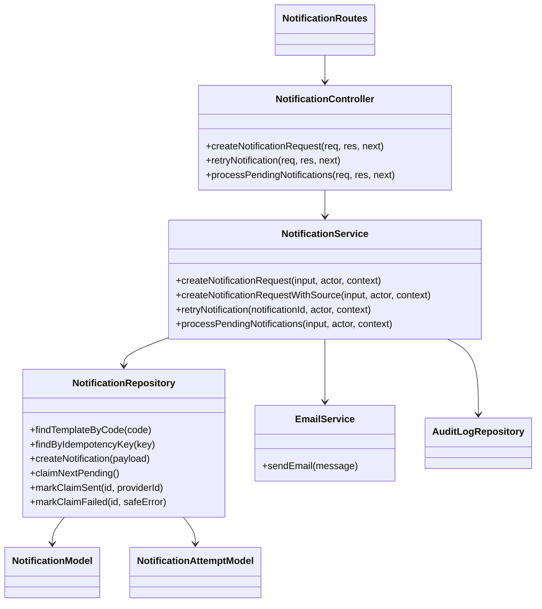

| Component | Responsibility | Source |
| --- | --- | --- |
| `NotificationRoutes` | Exposes authorized non-sensitive request/retry/worker endpoints. | `backend/src/routes/notificationRoutes.js` |
| `NotificationController` | Maps HTTP commands to the notification service. | `backend/src/controllers/notificationController.js` |
| `NotificationService` | Enforces source ownership, sensitive boundaries, templates, idempotency, and delivery lifecycle. | `backend/src/services/notificationService.js` |
| `NotificationRepository` | Claims durable work and atomically records terminal state plus attempts. | `backend/src/repositories/notificationRepository.js` |
| `EmailService` | Performs provider I/O without persisting raw credentials. | `backend/src/services/emailService.js` |

## 12. FE11 - User and Role Management

### Class Diagram

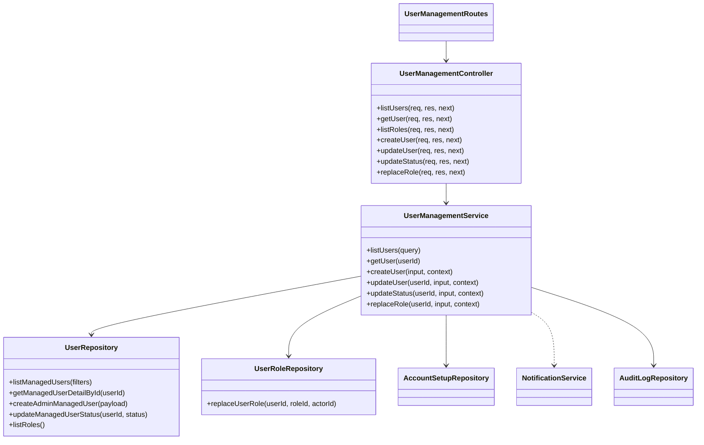

| Component | Responsibility | Source |
| --- | --- | --- |
| `UserManagementRoutes` | Exposes Admin-only user, status, role, and setup operations. | `backend/src/routes/userManagementRoutes.js` |
| `UserManagementController` | Maps management requests and request context to the service. | `backend/src/controllers/userManagementController.js` |
| `UserManagementService` | Enforces safe fields, lifecycle rules, exactly-one role, last-Admin protection, setup delivery, and audit. | `backend/src/services/userManagementService.js` |
| `UserRepository` | Reads and persists managed account/profile state. | `backend/src/repositories/userRepository.js` |
| `UserRoleRepository` | Atomically replaces the current role and audit entry. | `backend/src/repositories/userRoleRepository.js` |
| `AccountSetupRepository` | Creates/revokes account-setup credentials. | `backend/src/repositories/accountSetupRepository.js` |

## 13. FE12 - Reporting and Statistics

### Class Diagram

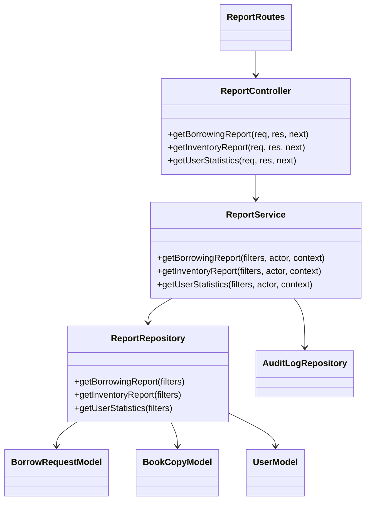

| Component | Responsibility | Source |
| --- | --- | --- |
| `ReportRoutes` | Exposes authorized borrowing, inventory, and user reports. | `backend/src/routes/reportRoutes.js` |
| `ReportController` | Maps report filters and returns chart/table DTOs. | `backend/src/controllers/reportController.js` |
| `ReportService` | Validates access and filters, then audits report access. | `backend/src/services/reportService.js` |
| `ReportRepository` | Executes read-only aggregate queries over source tables. | `backend/src/repositories/reportRepository.js` |
| `AuditLogRepository` | Records protected report access. | `backend/src/repositories/auditLogRepository.js` |

## 14. Cross-Feature Dependency Summary

| Source feature | Target component | Reason |
| --- | --- | --- |
| FE02 | FE10 `NotificationService` | Verification, reset, and account security delivery. |
| FE04 | FE10 `NotificationService` | Membership review result delivery. |
| FE07 | FE09 `FineManagementService` | Fine calculation after overdue/lost/damaged returns. |
| FE07, FE08 | FE10 `NotificationService` | Borrowing and reservation lifecycle delivery. |
| FE09 | `AuditLogRepository` | Fine collection and resolution traceability. |
| FE11 | FE10 `NotificationService` | Account-setup delivery. |
| FE12 | `AuditLogRepository` | Protected report-access traceability. |

## 15. Source-of-Truth Boundary

- The diagrams describe implemented logical components, not a proposal to introduce JavaScript classes.
- Route files own HTTP wiring; controllers own request/response mapping; services own business rules; repositories own parameterized SQL; models own table metadata and row mapping.
- Feature permissions and business behavior remain authoritative in each `.sdd/specs/feat-*/SPEC.md`.
- Database entities and columns are specified separately in `document/DatabaseSpecification.md`.
