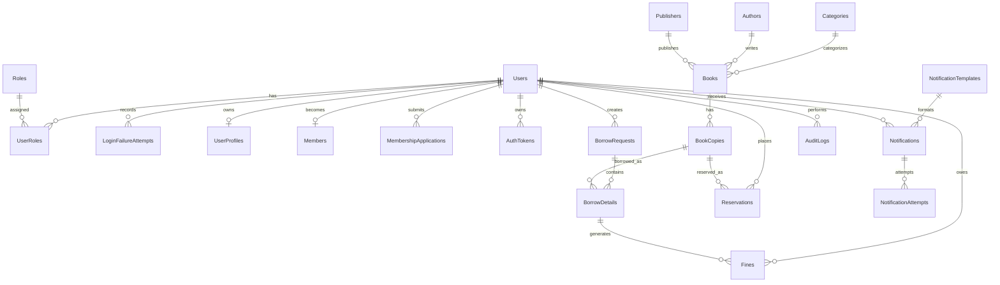

# Library Management Database Specification

## 1. Overview

| Item | Specification |
| --- | --- |
| Database | `LibraryManagementDB` |
| Platform | Microsoft SQL Server |
| Canonical schema | `database/Librarymanagement.sql` |
| Migration scripts | `database/migrations/` |
| Number of tables | 21 |

This document specifies the implemented database baseline. Feature behavior remains governed by the approved `.sdd/specs/feat-*/SPEC.md` files and `.sdd/rfcs/ADR-002-database-design.md`.

### Notation

- `PK`: primary key.
- `FK`: foreign key.
- `UQ`: unique constraint or unique index.
- `NN`: `NOT NULL`.
- `NULL`: optional column.
- `IDENTITY`: database-generated numeric value.

## 2. Entity Relationships

## 3. Table Catalogue

| No. | Table | Purpose |
| --- | --- | --- |
| 01 | `Roles` | Stores authorization role names. |
| 02 | `Users` | Stores login accounts, security state, and account lifecycle timestamps. |
| 03 | `LoginFailureAttempts` | Stores timestamped failures for the rolling login-lock window. |
| 04 | `UserRoles` | Stores exactly one role mapping per persisted account. |
| 05 | `UserProfiles` | Stores personal and librarian profile data. |
| 06 | `Members` | Stores the membership projection used for borrowing eligibility. |
| 07 | `MembershipApplications` | Stores membership application and review history. |
| 08 | `AuthTokens` | Stores hashed refresh, verification, reset, setup, and OTP tokens. |
| 09 | `Categories` | Stores book categories. |
| 10 | `Authors` | Stores book authors. |
| 11 | `Publishers` | Stores book publishers. |
| 12 | `Books` | Stores book catalogue metadata. |
| 13 | `BookCopies` | Stores physical book copies and availability state. |
| 14 | `BorrowRequests` | Stores borrowing request headers and processing state. |
| 15 | `BorrowDetails` | Stores per-copy borrowing, return, and renewal data. |
| 16 | `Reservations` | Stores reservations and queue/hold state. |
| 17 | `Fines` | Stores fine calculation and collection data. |
| 18 | `NotificationTemplates` | Stores reusable notification templates. |
| 19 | `Notifications` | Stores durable notification delivery records. |
| 20 | `NotificationAttempts` | Stores individual delivery attempts. |
| 21 | `AuditLogs` | Stores security and administrative audit events. |

## 4. Column Specifications

### 4.1 `Roles`

| Column | Data type | Rules | Description |
| --- | --- | --- | --- |
| `RoleId` | INT | PK, IDENTITY | Database-generated role identifier. |
| `RoleName` | NVARCHAR(50) | NN, UQ; `ADMIN`, `LIBRARIAN`, `MEMBER`, `GUEST` | Authorization role name. |

### 4.2 `Users`

| Column | Data type | Rules | Description |
| --- | --- | --- | --- |
| `UserId` | INT | PK, IDENTITY | Account identifier. |
| `Username` | NVARCHAR(50) | NN, UQ | Unique login name. |
| `Email` | NVARCHAR(255) | NN, UQ (`UX_Users_Email`) | Unique account email. |
| `PasswordHash` | NVARCHAR(255) | NN | Password hash; plaintext passwords are never stored. |
| `Phone` | NVARCHAR(20) | NULL | Contact phone number. |
| `Status` | NVARCHAR(20) | NN, default `ACTIVE`; `ACTIVE`, `INACTIVE`, `LOCKED` | Account lifecycle status. |
| `EmailVerifiedAt` | DATETIME | NULL | Email verification time. |
| `FailedLoginCount` | INT | NN, default `0` | Current failed-login counter retained with lock state. |
| `LockedUntil` | DATETIME | NULL | Automatic account-unlock time. |
| `LastLoginAt` | DATETIME | NULL | Most recent successful login time. |
| `CreatedAt` | DATETIME | NN, default `GETDATE()` | Creation time. |
| `UpdatedAt` | DATETIME | NULL | Most recent update time. |
| `DeactivatedAt` | DATETIME | NULL | Account deactivation time. |

### 4.3 `LoginFailureAttempts`

| Column | Data type | Rules | Description |
| --- | --- | --- | --- |
| `AttemptId` | BIGINT | PK, IDENTITY | Failed-attempt identifier. |
| `UserId` | INT | NN, FK → `Users.UserId` | Known account that failed authentication. |
| `AttemptedAt` | DATETIME | NN, default `GETDATE()` | Failure time used by the rolling lockout window. |

### 4.4 `UserRoles`

| Column | Data type | Rules | Description |
| --- | --- | --- | --- |
| `UserId` | INT | PK, FK → `Users.UserId`, UQ (`UX_UserRoles_UserId`) | Account receiving the role. |
| `RoleId` | INT | PK, FK → `Roles.RoleId` | Assigned role. |
| `CreatedAt` | DATETIME | NN, default `GETDATE()` | Assignment creation time. |

### 4.5 `UserProfiles`

| Column | Data type | Rules | Description |
| --- | --- | --- | --- |
| `ProfileId` | INT | PK, IDENTITY | Profile identifier. |
| `UserId` | INT | NN, UQ, FK → `Users.UserId` | Owning account; enforces one profile per user. |
| `FullName` | NVARCHAR(100) | NULL | User's full name. |
| `Address` | NVARCHAR(255) | NULL | Contact address. |
| `DateOfBirth` | DATE | NULL | Date of birth. |
| `AvatarUrl` | NVARCHAR(255) | NULL | Stored avatar resource URL. |
| `Department` | NVARCHAR(100) | NULL | Librarian department. |
| `Specialization` | NVARCHAR(100) | NULL | Librarian specialization. |
| `CreatedAt` | DATETIME | NN, default `GETDATE()` | Creation time. |
| `UpdatedAt` | DATETIME | NULL | Most recent update time. |

### 4.6 `Members`

| Column | Data type | Rules | Description |
| --- | --- | --- | --- |
| `MemberId` | INT | PK, IDENTITY | Member identifier. |
| `UserId` | INT | NN, UQ, FK → `Users.UserId` | Account represented by this member record. |
| `Status` | NVARCHAR(20) | NN, default `PENDING`; `PENDING`, `APPROVED`, `REJECTED`, `INACTIVE` | Membership eligibility status. |
| `ApprovedAt` | DATETIME | NULL | Approval time. |
| `ApprovedBy` | INT | NULL, FK → `Users.UserId` | Staff account that approved membership. |
| `CreatedAt` | DATETIME | NN, default `GETDATE()` | Creation time. |
| `UpdatedAt` | DATETIME | NULL | Most recent update time. |

### 4.7 `MembershipApplications`

| Column | Data type | Rules | Description |
| --- | --- | --- | --- |
| `ApplicationId` | INT | PK, IDENTITY | Application identifier. |
| `UserId` | INT | NN, FK → `Users.UserId`; one pending row per user | Applicant account. |
| `Status` | NVARCHAR(20) | NN, default `PENDING`; `PENDING`, `APPROVED`, `REJECTED` | Review status. |
| `AppliedAt` | DATETIME | NN, default `GETDATE()` | Submission time. |
| `ApprovedAt` | DATETIME | NULL | Approval time when approved. |
| `ReviewedBy` | INT | NULL, FK → `Users.UserId` | Reviewing staff account. |
| `ReviewNote` | NVARCHAR(500) | NULL | Review reason or note. |

### 4.8 `AuthTokens`

| Column | Data type | Rules | Description |
| --- | --- | --- | --- |
| `TokenId` | INT | PK, IDENTITY | Token record identifier. |
| `UserId` | INT | NN, FK → `Users.UserId` | Owning account. |
| `TokenType` | NVARCHAR(30) | NN; `REFRESH`, `PASSWORD_RESET`, `EMAIL_VERIFY`, `ACCOUNT_SETUP`, `CHANGE_PASSWORD_OTP` | Token purpose. |
| `TokenHash` | NVARCHAR(255) | NN, indexed | Hash of the secret token or OTP. |
| `ExpiresAt` | DATETIME | NN | Expiration time. |
| `UsedAt` | DATETIME | NULL | One-time token consumption time. |
| `RevokedAt` | DATETIME | NULL | Revocation time. |
| `CreatedAt` | DATETIME | NN, default `GETDATE()` | Creation time. |
| `CreatedByIp` | NVARCHAR(50) | NULL | Request IP captured at creation. |

### 4.9 `Categories`

| Column | Data type | Rules | Description |
| --- | --- | --- | --- |
| `CategoryId` | INT | PK, IDENTITY | Category identifier. |
| `CategoryName` | NVARCHAR(100) | NN, UQ | Category name. |
| `Status` | NVARCHAR(20) | NN, default `ACTIVE` | Lifecycle status. |
| `CreatedAt` | DATETIME | NN, default `GETDATE()` | Creation time. |

### 4.10 `Authors`

| Column | Data type | Rules | Description |
| --- | --- | --- | --- |
| `AuthorId` | INT | PK, IDENTITY | Author identifier. |
| `AuthorName` | NVARCHAR(100) | NN, UQ | Author name. |
| `Status` | NVARCHAR(20) | NN, default `ACTIVE` | Lifecycle status. |
| `CreatedAt` | DATETIME | NN, default `GETDATE()` | Creation time. |

### 4.11 `Publishers`

| Column | Data type | Rules | Description |
| --- | --- | --- | --- |
| `PublisherId` | INT | PK, IDENTITY | Publisher identifier. |
| `PublisherName` | NVARCHAR(100) | NN, UQ | Publisher name. |
| `Status` | NVARCHAR(20) | NN, default `ACTIVE` | Lifecycle status. |
| `CreatedAt` | DATETIME | NN, default `GETDATE()` | Creation time. |

### 4.12 `Books`

| Column | Data type | Rules | Description |
| --- | --- | --- | --- |
| `BookId` | INT | PK, IDENTITY | Catalogue book identifier. |
| `Title` | NVARCHAR(255) | NN | Book title. |
| `ISBN` | NVARCHAR(20) | NULL, filtered UQ when present | ISBN. |
| `CategoryId` | INT | NULL, FK → `Categories.CategoryId` | Category reference. |
| `AuthorId` | INT | NULL, FK → `Authors.AuthorId` | Author reference. |
| `PublisherId` | INT | NULL, FK → `Publishers.PublisherId` | Publisher reference. |
| `PublishYear` | INT | NULL | Publication year. |
| `Description` | NVARCHAR(MAX) | NULL | Catalogue description. |
| `CoverUrl` | NVARCHAR(255) | NULL | Cover image URL. |
| `Rating` | DECIMAL(2,1) | NULL | Display rating. |
| `Pages` | INT | NULL | Page count. |
| `Status` | NVARCHAR(20) | NN, default `ACTIVE`; `ACTIVE`, `INACTIVE` | Catalogue lifecycle status. |
| `CreatedBy` | INT | NULL, FK → `Users.UserId` | Creating staff account. |
| `UpdatedBy` | INT | NULL, FK → `Users.UserId` | Last updating staff account. |
| `CreatedAt` | DATETIME | NN, default `GETDATE()` | Creation time. |
| `UpdatedAt` | DATETIME | NULL | Most recent update time. |
| `RowVersion` | ROWVERSION | NN | Optimistic concurrency token for book updates. |

### 4.13 `BookCopies`

| Column | Data type | Rules | Description |
| --- | --- | --- | --- |
| `CopyId` | INT | PK, IDENTITY | Physical-copy identifier. |
| `BookId` | INT | NN, FK → `Books.BookId` | Parent catalogue book. |
| `Barcode` | NVARCHAR(100) | NN, UQ | Physical-copy barcode. |
| `Status` | NVARCHAR(20) | NN, default `AVAILABLE`; `AVAILABLE`, `BORROWED`, `RESERVED`, `DAMAGED`, `LOST`, `INACTIVE` | Copy lifecycle and availability status. |
| `Location` | NVARCHAR(100) | NULL | Shelf or storage location. |
| `CreatedAt` | DATETIME | NN, default `GETDATE()` | Creation time. |
| `UpdatedAt` | DATETIME | NULL | Most recent update time. |
| `Version` | ROWVERSION | NN | Optimistic concurrency token for copy mutations. |

### 4.14 `BorrowRequests`

| Column | Data type | Rules | Description |
| --- | --- | --- | --- |
| `RequestId` | INT | PK, IDENTITY | Borrow-request identifier. |
| `UserId` | INT | NN, FK → `Users.UserId` | Requesting account. |
| `RequestDate` | DATETIME | NN, default `GETDATE()` | Business request time. |
| `Status` | NVARCHAR(20) | NN, default `PENDING`; `PENDING`, `APPROVED`, `REJECTED`, `COMPLETED`, `CANCELLED` | Request lifecycle status. |
| `CreatedBy` | INT | NULL, FK → `Users.UserId` | Account that created the request. |
| `ApprovedBy` | INT | NULL, FK → `Users.UserId` | Staff account that processed the request. |
| `ApprovedAt` | DATETIME | NULL | Approval time. |
| `RejectedAt` | DATETIME | NULL | Rejection time. |
| `ProcessedAt` | DATETIME | NULL | Final processing time. |
| `CreatedAt` | DATETIME | NN, default `GETDATE()` | Persistence creation time. |
| `UpdatedAt` | DATETIME | NULL | Most recent update time. |

### 4.15 `BorrowDetails`

| Column | Data type | Rules | Description |
| --- | --- | --- | --- |
| `BorrowDetailId` | INT | PK, IDENTITY | Borrow line identifier. |
| `RequestId` | INT | NN, FK → `BorrowRequests.RequestId` | Parent borrow request. |
| `CopyId` | INT | NN, FK → `BookCopies.CopyId` | Requested or borrowed physical copy. |
| `BorrowDate` | DATE | NULL | Checkout date assigned on approval. |
| `DueDate` | DATE | NULL | Due date assigned before status becomes `BORROWED`. |
| `ReturnDate` | DATE | NULL | Actual return date. |
| `RenewalCount` | INT | NN, default `0` | Number of approved renewals. |
| `Status` | NVARCHAR(20) | NN, default `REQUESTED`; `REQUESTED`, `BORROWED`, `RETURNED`, `LOST`, `DAMAGED` | Item lifecycle status. |
| `CreatedAt` | DATETIME | NN, default `GETDATE()` | Creation time. |
| `UpdatedAt` | DATETIME | NULL | Most recent update time. |

### 4.16 `Reservations`

| Column | Data type | Rules | Description |
| --- | --- | --- | --- |
| `ReservationId` | INT | PK, IDENTITY | Reservation identifier. |
| `UserId` | INT | NN, FK → `Users.UserId` | Reserving account. |
| `CopyId` | INT | NN, FK → `BookCopies.CopyId` | Reserved physical copy. |
| `ReservedAt` | DATETIME | NN, default `GETDATE()` | Reservation time. |
| `QueuePosition` | INT | NULL | Position in the reservation queue. |
| `ExpiresAt` | DATETIME | NULL | Hold expiration time. |
| `NotifiedAt` | DATETIME | NULL | Availability-notification time. |
| `CancelledAt` | DATETIME | NULL | Cancellation time. |
| `Status` | NVARCHAR(20) | NN, default `ACTIVE`; `ACTIVE`, `FULFILLED`, `CANCELLED`, `EXPIRED`, `NOTIFIED` | Reservation lifecycle status. |
| `CreatedAt` | DATETIME | NN, default `GETDATE()` | Creation time. |
| `UpdatedAt` | DATETIME | NULL | Most recent update time. |

### 4.17 `Fines`

| Column | Data type | Rules | Description |
| --- | --- | --- | --- |
| `FineId` | INT | PK, IDENTITY | Fine identifier. |
| `UserId` | INT | NN, FK → `Users.UserId` | Account owing the fine. |
| `BorrowDetailId` | INT | NN, FK → `BorrowDetails.BorrowDetailId` | Related borrow line. |
| `OverdueDays` | INT | NN, default `0` | Traceable overdue-day count. |
| `RatePerDay` | DECIMAL(10,2) | NN, default `5000` | Fine rate per overdue day. |
| `Amount` | DECIMAL(10,2) | NN | Calculated fine amount. |
| `PaidAmount` | DECIMAL(10,2) | NN, default `0` | Collected amount. |
| `Reason` | NVARCHAR(255) | NULL | Fine, waiver, or cancellation reason. |
| `Status` | NVARCHAR(20) | NN, default `UNPAID`; `UNPAID`, `PAID`, `WAIVED`, `CANCELLED` | Fine lifecycle status. |
| `CalculatedAt` | DATETIME | NN, default `GETDATE()` | Calculation time. |
| `PaidAt` | DATETIME | NULL | Payment completion time. |
| `CreatedBy` | INT | NULL, FK → `Users.UserId` | Account that created the fine. |
| `CollectedBy` | INT | NULL, FK → `Users.UserId` | Staff account that collected payment. |
| `PaymentMethod` | NVARCHAR(50) | NULL | Recorded payment method. |
| `CreatedAt` | DATETIME | NN, default `GETDATE()` | Creation time. |
| `UpdatedAt` | DATETIME | NULL | Most recent update time. |

### 4.18 `NotificationTemplates`

| Column | Data type | Rules | Description |
| --- | --- | --- | --- |
| `TemplateId` | INT | PK, IDENTITY | Template identifier. |
| `TemplateCode` | NVARCHAR(100) | NN, UQ | Stable template code. |
| `Subject` | NVARCHAR(255) | NN | Email subject template. |
| `Body` | NVARCHAR(MAX) | NN | Email body template. |
| `Status` | NVARCHAR(20) | NN, default `ACTIVE`; `ACTIVE`, `INACTIVE` | Template lifecycle status. |
| `CreatedAt` | DATETIME | NN, default `GETDATE()` | Creation time. |
| `UpdatedAt` | DATETIME | NULL | Most recent update time. |

### 4.19 `Notifications`

| Column | Data type | Rules | Description |
| --- | --- | --- | --- |
| `NotificationId` | INT | PK, IDENTITY | Notification identifier. |
| `NotificationType` | NVARCHAR(50) | NULL; supported type constraint | Business notification type. |
| `TemplateId` | INT | NULL, FK → `NotificationTemplates.TemplateId` | Selected template. |
| `TemplateKey` | NVARCHAR(100) | NULL | Template lookup key retained with the notification. |
| `UserId` | INT | NULL, FK → `Users.UserId` | Recipient account when available. |
| `RecipientEmail` | NVARCHAR(255) | NN | Delivery email address. |
| `Channel` | NVARCHAR(20) | NN, default `EMAIL`; `EMAIL` only | Delivery channel. |
| `Status` | NVARCHAR(20) | NN, default `PENDING`; `PENDING`, `PROCESSING`, `SENT`, `DELIVERED`, `FAILED`, `SKIPPED`, `CANCELLED` | Durable delivery status. |
| `Title` | NVARCHAR(255) | NULL | Rendered notification title. |
| `Body` | NVARCHAR(MAX) | NULL | Rendered notification body. |
| `SourceFeature` | NVARCHAR(20) | NULL | Originating feature identifier. |
| `SourceEntityType` | NVARCHAR(50) | NULL | Originating entity type. |
| `SourceEntityId` | INT | NULL | Originating entity identifier. |
| `IdempotencyKey` | NVARCHAR(100) | NULL, filtered UQ when present | Duplicate-delivery prevention key. |
| `SafePayload` | NVARCHAR(MAX) | NULL | Redacted, non-secret delivery payload. |
| `AttemptCount` | INT | NN, default `0` | Number of delivery attempts. |
| `LastErrorMessage` | NVARCHAR(500) | NULL | Latest safe error summary. |
| `CreatedAt` | DATETIME | NN, default `GETDATE()` | Creation time. |
| `SentAt` | DATETIME | NULL | Successful send time. |

Supported `NotificationType` values: `ACCOUNT_VERIFICATION`, `PASSWORD_RESET`, `ACCOUNT_SETUP`, `RESERVATION_AVAILABLE`, `DUE_DATE_REMINDER`, `OVERDUE_NOTICE`, `FINE_NOTICE`, and `GENERAL_SYSTEM`.

### 4.20 `NotificationAttempts`

| Column | Data type | Rules | Description |
| --- | --- | --- | --- |
| `AttemptId` | INT | PK, IDENTITY | Delivery-attempt identifier. |
| `NotificationId` | INT | NN, FK → `Notifications.NotificationId` | Parent notification. |
| `AttemptedAt` | DATETIME | NN, default `GETDATE()` | Attempt time. |
| `Status` | NVARCHAR(20) | NN; `SENT`, `FAILED` | Attempt result. |
| `SafeErrorMessage` | NVARCHAR(500) | NULL | Redacted provider error. |
| `ProviderMessageId` | NVARCHAR(255) | NULL | Provider-side message identifier. |

### 4.21 `AuditLogs`

| Column | Data type | Rules | Description |
| --- | --- | --- | --- |
| `LogId` | INT | PK, IDENTITY | Audit-event identifier. |
| `UserId` | INT | NULL, FK → `Users.UserId` | Actor account when authenticated. |
| `Action` | NVARCHAR(255) | NN | Audited action name. |
| `TargetType` | NVARCHAR(100) | NULL | Affected entity type. |
| `TargetId` | INT | NULL | Affected entity identifier. |
| `Metadata` | NVARCHAR(MAX) | NULL | Safe structured audit metadata. |
| `IpAddress` | NVARCHAR(50) | NULL | Request IP address. |
| `UserAgent` | NVARCHAR(255) | NULL | Request user-agent value. |
| `CreatedAt` | DATETIME | NN, default `GETDATE()` | Event time. |

## 5. Indexes and Database Invariants

| Index | Table/columns | Purpose |
| --- | --- | --- |
| `UX_Users_Email` | `Users(Email)` | Enforces unique account email. |
| `IX_LoginFailureAttempts_User_AttemptedAt` | `LoginFailureAttempts(UserId, AttemptedAt)` | Supports rolling-window failure counting. |
| `UX_UserRoles_UserId` | `UserRoles(UserId)` | Enforces at most one role row per account. |
| `UX_MembershipApplications_User_Pending` | `MembershipApplications(UserId)` where `Status = 'PENDING'` | Enforces one pending application per user. |
| `IX_AuthTokens_UserId_TokenType` | `AuthTokens(UserId, TokenType)` | Supports account/token-purpose lookup. |
| `IX_AuthTokens_TokenHash` | `AuthTokens(TokenHash)` | Supports hashed-token lookup. |
| `UX_Books_ISBN_NotNull` | `Books(ISBN)` where ISBN is not null | Enforces unique provided ISBN values. |
| `UX_Notifications_IdempotencyKey_NotNull` | `Notifications(IdempotencyKey)` where key is not null | Prevents duplicate notification creation. |

All foreign keys use the SQL Server default `NO ACTION` behavior because the canonical schema does not declare cascading updates or deletes. Schema changes must update the canonical SQL script, the owning feature specification, and ADR-002 before implementation.
