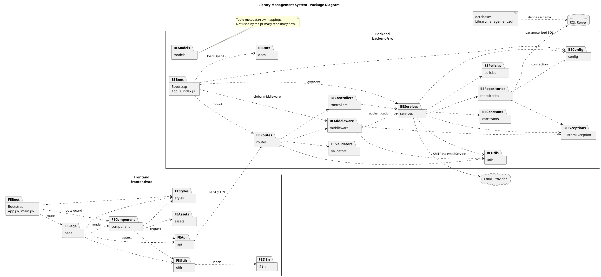

# Đặc tả Package Diagram — Library Management System

| Thuộc tính | Giá trị |
| --- | --- |
| Trạng thái | DRAFT |
| Góc nhìn | Kiến trúc mã nguồn hiện tại (as-is) |
| Ngày cập nhật | 27-07-2026 |
| Phạm vi | `frontend/src`, `backend/src`, `database` |

## 1. Mục đích

Package Diagram mô tả cách mã nguồn được chia thành các package chính và chiều phụ thuộc giữa chúng. Sơ đồ dùng để:

- xác định trách nhiệm của từng package;
- kiểm tra luồng phụ thuộc từ giao diện đến cơ sở dữ liệu;
- ngăn business logic đi vào UI hoặc tầng HTTP;
- làm căn cứ khi bổ sung module mà không phá vỡ kiến trúc hiện hữu.

Sơ đồ này mô tả cấu trúc triển khai, không mô tả thứ tự xử lý như Sequence Diagram và không mô tả lớp chi tiết như Class Diagram.

## 2. Quy ước

- Mỗi package tương ứng với một thư mục mã nguồn đang tồn tại.
- Mũi tên `A ..> B` nghĩa là package `A` sử dụng hoặc gọi package `B`.
- `REST/JSON` là phụ thuộc thời gian chạy giữa frontend và backend, không phải import mã nguồn.
- SQL Server và Email Provider là hệ thống ngoài ranh giới mã nguồn ứng dụng.
- Các thư mục rỗng như `backend/src/Migrations` và `backend/src/seeders` không được xem là package đang hoạt động.

## 3. Danh mục package

### 3.1 Frontend

| ID | Package | Trách nhiệm |
| --- | --- | --- |
| PKG-FE-01 | `frontend/src/App.jsx`, `main.jsx` | Khởi tạo React, router và ánh xạ route đến màn hình. |
| PKG-FE-02 | `frontend/src/page` | Chứa màn hình cấp route và điều phối trạng thái của từng chức năng. |
| PKG-FE-03 | `frontend/src/component` | Chứa UI component dùng chung, layout, bảng, modal và route guard. |
| PKG-FE-04 | `frontend/src/api` | Đóng gói HTTP request đến REST API của backend. |
| PKG-FE-05 | `frontend/src/utils` | Chứa access check, formatter, filter, workflow helper và view-model helper. |
| PKG-FE-06 | `frontend/src/i18n` | Chứa nội dung hiển thị tiếng Việt dùng bởi UI helper. |
| PKG-FE-07 | `frontend/src/styles` | Chứa CSS dùng cho layout, page và component. |
| PKG-FE-08 | `frontend/src/assets` | Chứa hình ảnh và tài nguyên tĩnh của frontend. |

### 3.2 Backend

| ID | Package | Trách nhiệm |
| --- | --- | --- |
| PKG-BE-01 | `backend/src/app.js`, `index.js` | Khởi tạo Express, middleware toàn cục, route và tiến trình HTTP. |
| PKG-BE-02 | `backend/src/routes` | Khai báo endpoint và ghép middleware, validator, controller. |
| PKG-BE-03 | `backend/src/middleware` | Xác thực, phân quyền, upload, HTTPS enforcement và xử lý lỗi dùng chung. |
| PKG-BE-04 | `backend/src/validators` | Kiểm tra path, query và request body tại biên API. |
| PKG-BE-05 | `backend/src/controllers` | Chuyển HTTP request thành lời gọi service và tạo HTTP response. |
| PKG-BE-06 | `backend/src/services` | Chứa business logic và điều phối transaction, notification, audit. |
| PKG-BE-07 | `backend/src/repositories` | Thực thi truy vấn tham số hóa và thao tác dữ liệu SQL Server. |
| PKG-BE-08 | `backend/src/policies` | Chứa policy phân quyền hoặc policy nghiệp vụ dùng lại. |
| PKG-BE-09 | `backend/src/utils` | Chứa tiện ích token, password, thời gian nghiệp vụ, lưu file và lỗi an toàn. |
| PKG-BE-10 | `backend/src/config` | Đọc cấu hình môi trường và cung cấp kết nối SQL Server. |
| PKG-BE-11 | `backend/src/CustomException` | Định nghĩa exception ứng dụng có kiểm soát. |
| PKG-BE-12 | `backend/src/constrants` | Chứa hằng lỗi kế thừa; giữ nguyên tên thư mục hiện tại. |
| PKG-BE-13 | `backend/src/models` | Chứa metadata/row mapping của các bảng; hiện không nằm trên luồng repository chính. |
| PKG-BE-14 | `backend/src/docs` | Chứa đặc tả OpenAPI được ứng dụng nạp cho Swagger UI. |

### 3.3 Data và external systems

| ID | Thành phần | Trách nhiệm |
| --- | --- | --- |
| PKG-DATA-01 | `database/Librarymanagement.sql` | Đặc tả schema SQL Server dùng làm nguồn chuẩn của cấu trúc dữ liệu. |
| EXT-01 | SQL Server | Lưu dữ liệu nghiệp vụ; chỉ backend repository được truy cập trực tiếp. |
| EXT-02 | Email Provider | Gửi email thông qua `emailService` thuộc package services. |

## 4. Quy tắc phụ thuộc

| ID | Quy tắc |
| --- | --- |
| DEP-01 | Frontend chỉ gọi backend qua REST API; không truy cập SQL Server trực tiếp. |
| DEP-02 | `page` và `component` gọi HTTP qua `api`; không chứa truy vấn dữ liệu backend. |
| DEP-03 | `routes` phải áp dụng middleware/validator cần thiết trước khi gọi controller. |
| DEP-04 | `controllers` chỉ xử lý biên HTTP và ủy quyền nghiệp vụ cho `services`. |
| DEP-05 | Business rule nằm trong `services` hoặc `policies`, không nằm trong UI, route hoặc controller. |
| DEP-06 | Chỉ `repositories` và `config` quản lý truy cập SQL Server; truy vấn phải tham số hóa. |
| DEP-07 | `services` có thể điều phối service khác cho notification/email nhưng không được tạo phụ thuộc vòng. |
| DEP-08 | Chi tiết lỗi nội bộ phải đi qua `CustomException`, `utils/safeErrors` hoặc error middleware trước khi trả cho client. |
| DEP-09 | Mọi package mới phải có trách nhiệm riêng và có ít nhất một phụ thuộc sử dụng thực tế; không tạo package để dự phòng. |

## 5. Package Diagram

## 6. Tiêu chí kiểm tra

| ID | Tiêu chí đạt |
| --- | --- |
| AC-PKG-01 | Tất cả package trên sơ đồ tương ứng với file hoặc thư mục đang tồn tại. |
| AC-PKG-02 | Luồng chính thể hiện đúng `frontend → routes → controllers → services → repositories → SQL Server`. |
| AC-PKG-03 | Middleware và validator được đặt tại biên API. |
| AC-PKG-04 | Không có quan hệ frontend truy cập trực tiếp database. |
| AC-PKG-05 | Không trình bày thư mục rỗng như package đang triển khai. |
| AC-PKG-06 | Các phụ thuộc ngoại vi được phân biệt với import nội bộ. |

## 7. Nguồn đối chiếu

- Frontend bootstrap và routing: `frontend/src/main.jsx`, `frontend/src/App.jsx`.
- Backend composition root: `backend/src/app.js`, `backend/src/index.js`.
- Luồng backend: `backend/src/routes`, `controllers`, `services`, `repositories`.
- Validation và security boundary: `backend/src/middleware`, `backend/src/validators`.
- Cấu hình dữ liệu: `backend/src/config/db.js`.
- Schema chuẩn: `database/Librarymanagement.sql`.
- Tài liệu liên quan: `document/RDS.md` mục 3.2 và `document/SDS.md` mục I.1.

## 8. Ngoài phạm vi

- Class Diagram chi tiết cho từng feature.
- Sequence Diagram của từng use case.
- Deployment topology trên Azure.
- Package dự kiến nhưng chưa có mã nguồn sử dụng.
