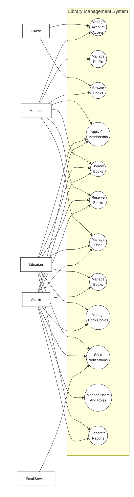
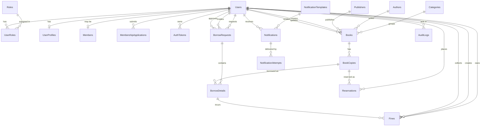
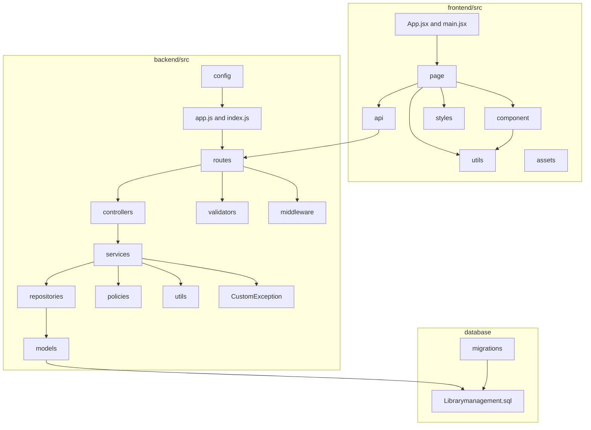

**Requirement & Design Specification**
**Library Management System**
**Version: 1.0**

## Record of Changes

| Version | Date | A,M,D | In change | Change Description |
| ------- | ---- | ----- | --------- | ------------------ |
| 1.0 | 2026-06-02 | A | DungTH | FE05 Book Management specification created. |
| 1.0 | 2026-06-03 | A | DatDT | FE02 Authentication feature specification structure created. |
| 1.0 | 2026-06-03 | A | DungTH | FE11 User & Role Management feature specification structure created. |
| 1.0 | 2026-06-10 | A | DungTH | FE01 Public Browse review decisions approved. |
| 1.0 | 2026-06-10 | A | DatDT | FE02 foundation slice implemented and authentication flows ready for review. |
| 1.0 | 2026-06-10 | A | DatDT | FE03 User Profile review decisions approved. |
| 1.0 | 2026-06-10 | A | DatDT | FE04 Membership Management review decisions approved. |
| 1.0 | 2026-06-10 | A | DatDT | FE06 Inventory/Book Copy review decisions approved. |
| 1.0 | 2026-06-10 | A | NhatNHA | FE07 Borrowing backend slice ready for review. |
| 1.0 | 2026-06-10 | A | NhatNHA | FE08 Reservation backend slice ready for review. |
| 1.0 | 2026-06-10 | A | DungTH | FE09 Fine Management review decisions approved. |
| 1.0 | 2026-06-10 | A | NhatNHA | FE10 Notification backend slice ready for review. |
| 1.0 | 2026-06-10 | A | NhatNHA | FE12 Reporting backend slice ready for review. |
| 1.0 | 2026-06-20 | A | DatDT | FE03 backend and frontend avatar upload implemented. |
| 1.0 | 2026-06-20 | A | NhatNHA | FE07 frontend UI implemented and accessibility validated. |
| 1.0 | 2026-06-20 | A | NhatNHA | FE08 frontend UI implemented and accessibility validated. |
| 1.0 | 2026-06-20 | A | NhatNHA | FE12 frontend UI implemented and accessibility validated. |
| 1.0 | 2026-06-25 | A | DungTH | FE09 server-side implementation completed. |
| 1.0 | 2026-07-10 | M | NhatNHA | FE12 inventory category filter completed. |
| 1.0 | 2026-07-13 | M | NhatNHA | FE08 frontend correctness aligned with approved lifecycle. |
| 1.0 | 2026-07-13 | M | NhatNHA | FE10 hardening implemented and B7 integration closed out. |
| 1.0 | 2026-07-13 | M | NhatNHA | FE12 B7 integration and review closeout completed. |
| 1.0 | 2026-07-14 | M | NhatNHA | FE07 B7 integration and validation closeout completed. |
| 1.0 | 2026-07-15 | M | DungTH | FE01 read-only availability ownership defined. |
| 1.0 | 2026-07-15 | M | DatDT | FE02 account setup implementation and validation completed. |
| 1.0 | 2026-07-15 | M | DatDT | FE04 canonical membership contract added. |
| 1.0 | 2026-07-15 | M | DungTH | FE05 catalog ownership and deterministic contract added. |
| 1.0 | 2026-07-15 | M | DatDT | FE06 deterministic inventory contract added. |
| 1.0 | 2026-07-15 | M | NhatNHA | FE10 account setup delivery implemented and OTP security boundary approved. |
| 1.0 | 2026-07-15 | M | DungTH | FE11 account setup slice implemented and validation ready. |
| 1.0 | 2026-07-17 | M | DatDT | FE03 deterministic profile and avatar failure contracts updated. |
| 1.0 | 2026-07-18 | M | DungTH | FE01 authenticated homepage navigation updated. |
| 1.0 | 2026-07-18 | M | DatDT | FE04 member, librarian, and admin review UI integrated. |
| 1.0 | 2026-07-18 | M | DungTH | FE05 librarian book management navigation and catalog metadata timestamps updated. |
| 1.0 | 2026-07-18 | M | DatDT | FE06 navigation label clarified. |
| 1.0 | 2026-07-18 | M | NhatNHA | FE07 member and librarian borrowing workspace polished. |
| 1.0 | 2026-07-18 | M | NhatNHA | FE08 member and librarian reservation operations aligned with canonical data. |
| 1.0 | 2026-07-18 | M | DungTH | FE09 librarian fine navigation and page restored. |
| 1.0 | 2026-07-18 | M | DungTH | FE11 transactional role management, safe user reads, admin role UI, and audit log integrated. |
| 1.0 | 2026-07-19 | M | DatDT | FE02 FE11 finalization schema contract activated. |
| 1.0 | 2026-07-19 | M | DatDT | FE03 FE11 librarian column ownership activated. |
| 1.0 | 2026-07-19 | M | NhatNHA | FE10 recipient email width synchronization activated. |
| 1.0 | 2026-07-19 | M | DungTH | FE11 admin navigation permissions and finalization governance activated. |
| 1.0 | 2026-07-19 | M | DatDT | System access login and setting management screen details completed. |

***A - Added M - Modified D - Deleted**

## Content

- Record of Changes
- I. Overview
  - 1. User Requirements
    - 1.1 Actors
    - 1.2 Use Cases
  - 2. Overall Functionalities
    - 2.1 Screens Flow
    - 2.2 Screen Descriptions
    - 2.3 Screen Authorization
    - 2.4 Non-UI Functions
  - 3. System High Level Design
    - 3.1 Database Design
    - 3.2 Code Packages
- II. Requirement Specifications
  - 1. Core System Use Cases By Feature Owner
    - 1.1 UC-01 Browse Books
  - 2. Common Functions
    - 2.1 UC-2 Login System
  - 3. Member Feature
    - 3.1 UC-MEM-01 Browse Book Catalog
    - 3.2 UC-MEM-02 Apply For Membership
    - 3.3 UC-MEM-03 Create Borrow Request
    - 3.4 UC-MEM-04 Manage Own Reservations
    - 3.5 UC-MEM-05 View Borrowing And Fines
- III. Design Specifications
  - 1. Authentication
    - 1.1 Account Access
  - 2. Public / Browse
  - 3. User Profile
  - 4. Membership Management
  - 5. Book And Inventory Management
  - 6. Borrowing And Reservation
  - 7. Fine Management
  - 8. User And Role Management
  - 9. Reporting And Statistics
- IV. Appendix
  - 1. Assumptions & Dependencies
  - 2. Limitations & Exclusions
  - 3. Business Rules

# I. Overview

## 1. User Requirements

### 1.1 Actors

An actor is a person, role, or external service that interacts with the Library Management System to perform a use case. The system actors are listed below.

| # | Actor | Description |
| - | ----- | ----------- |
| 1 | Guest | Unauthenticated visitor who can browse public book information and register/login to use member functions. |
| 2 | Member | Registered library user who can manage profile information, browse books, request membership, borrow books, reserve books, view borrowing/reservation history, and view fines. |
| 3 | Librarian | Library staff who manages book copies, borrowing requests, returns, reservations, membership review support, and fine-related operations. |
| 4 | Admin | System administrator who manages users, roles, permissions, audit logs, system dashboards, and administrative library operations. |
| 5 | EmailService | Internal/external delivery service used by the system to send verification, password reset, account setup, borrowing, reservation, membership, and fine notifications. |

### 1.2 Use Cases

A use case describes a sequence of interactions between an external actor and the Library Management System that helps the actor achieve a business outcome. The use cases below are derived from the approved Phase 1 feature list and feature specifications.

#### a. Diagram(s)

##### Figure 1. Overall Use Case Diagram



#### b. Use Case List

| UC ID | Use Case Name | Primary Actor(s) | Supporting Actor(s) | Outcome |
| ----- | ------------- | ---------------- | ------------------- | ------- |
| UC-01 | Browse Books | Guest, Member | Internal database | Actor can search, browse, and view public book information and current availability. |
| UC-02 | Manage Account Access | Guest, Member, Admin-created user | EmailService, Internal database | Actor can register, verify email, login, logout, change password, request password reset, reset password, and complete admin-created account setup. |
| UC-03 | Manage Profile | Member | Internal database | Member can view and update profile information, including avatar where supported. |
| UC-04 | Apply For Membership | Member, Librarian, Admin | EmailService, Internal database | Member can submit a membership application and authorized staff can approve or reject it. |
| UC-05 | Manage Books | Librarian, Admin | Internal database | Authorized staff can create, update, deactivate, search, and view book catalog records; reactivation is an approved FE05 follow-up contract. |
| UC-06 | Manage Book Copies | Librarian, Admin | Internal database | Authorized staff can manage physical copies, barcodes, location, status, and inventory availability. |
| UC-07 | Borrow Books | Member, Librarian, Admin | EmailService, Internal database | Member can request borrowing; authorized staff can approve, reject, process returns, renew borrowing, and maintain borrowing history. |
| UC-08 | Reserve Books | Member, Librarian, Admin | EmailService, Internal database | Member can reserve or cancel reservations; authorized staff can manage queues and fulfill held reservations. |
| UC-09 | Manage Fines | Member, Librarian, Admin | EmailService, Internal database | Member can view fine information; authorized staff can calculate, collect, mark paid, or resolve fines. |
| UC-10 | Send Notifications | EmailService, Librarian, Admin | Internal database | System can create and deliver account, reservation, due date, fine, membership, and account setup notifications. |
| UC-11 | Manage Users And Roles | Admin | EmailService, Internal database | Admin can manage users, librarian accounts, roles, permissions, admin request review view, and audit logs. |
| UC-12 | Generate Reports | Librarian, Admin | Internal database | Authorized staff can view borrowing reports, inventory reports, and user statistics. |

#### c. Use Case Relationships

| Relationship | Description |
| ------------ | ----------- |
| UC-02 includes UC-10 | Account registration, verification, password reset, and admin-created account setup require notification delivery. |
| UC-04 includes UC-10 | Membership approval or rejection can queue a membership result notification. |
| UC-07 includes UC-06 | Borrowing and returning depend on current physical copy status and availability. |
| UC-07 extends UC-09 | Returning an overdue, lost, or damaged copy may trigger fine calculation or fine management. |
| UC-08 includes UC-06 | Reservation queue processing depends on physical copy availability. |
| UC-08 includes UC-10 | Reservation availability and queue events can trigger notifications. |
| UC-09 includes UC-10 | Fine and overdue events can trigger due date or fine notifications. |
| UC-11 includes UC-10 | Admin-created user accounts can trigger account setup notifications. |
| UC-01 to UC-12 use internal database reads or persistence | Each use case reads from or writes to the database according to its feature data contract; the database is an internal component, not a use case actor in this diagram. |

## 2. Overall Functionalities

### 2.1 Screens Flow

This section shows the main system screens and navigation relationship among screens. The screen flow is based on the current frontend routes in `frontend/src/App.jsx`.


### 2.2 Screen Descriptions

This section describes the screens shown in the Screens Flow above.

| # | Feature | Screen | Description |
| - | ------- | ------ | ----------- |
| 1 | Authentication | Login | Allows a user to sign in with account credentials and enter the system according to their role. |
| 2 | Authentication | Register | Allows a guest to create a new account before using member functions. |
| 3 | Authentication | Forgot Password | Allows a user to request password reset support through email. |
| 4 | Public / Browse | Home | Routes the user to the proper home experience after opening the system or signing in. |
| 5 | Public / Browse | Public Book Homepage | Shows public book information, searchable catalog content, and book availability. |
| 6 | User Profile | User Profile | Allows an authenticated user to view and update profile information. |
| 7 | Membership Management | Membership | Allows a member to submit or view membership status and allows authorized staff to review membership information. |
| 8 | Book Management | Book Management | Allows librarian or admin users to create, update, deactivate, search, and view book records; reactivation remains an approved FE05 follow-up. |
| 9 | Inventory / Book Copy Management | Inventory | Allows librarian or admin users to manage physical book copies, barcode, status, location, and availability. |
| 10 | Borrowing Management | Create Borrow Request | Allows a member to create a request to borrow available books. |
| 11 | Borrowing Management | Borrowing History | Allows a member to view their borrowing requests, active borrowings, returns, and renewal-related information. |
| 12 | Borrowing Management | Borrow Requests | Allows librarian or admin users to review, approve, or reject member borrow requests. |
| 13 | Borrowing Management | Process Returns | Allows librarian or admin users to process returned book copies and update borrowing status. |
| 14 | Borrowing Management | Member Borrowing Details | Allows librarian or admin users to view borrowing details for library members. |
| 15 | Reservation Management | My Reservations | Allows a member to view or cancel their own reservations. |
| 16 | Reservation Management | Reservation Management | Allows librarian or admin users to manage reservation queues and staff reservation actions. |
| 17 | Fine Management | Fine Management | Allows librarian or admin users to view, calculate, collect, mark paid, or resolve fines. |
| 18 | Reporting & Statistics | Borrowing Report | Shows borrowing report data for operational review. |
| 19 | Reporting & Statistics | Inventory Report | Shows inventory and availability report data. |
| 20 | Reporting & Statistics | User Statistics | Shows user statistics for administrative review. |
| 21 | User & Role Management | Admin User Management | Allows admin users to manage user accounts, librarian accounts, roles, permissions, audit logs, and admin console sections. |

### 2.3 Screen Authorization

This section defines which system roles can access each screen or activity.

| Screen / Activity | Guest | Member | Librarian | Admin |
| ----------------- | ----- | ------ | --------- | ----- |
| Login | X |  |  |  |
| Register | X |  |  |  |
| Forgot Password | X | X | X | X |
| Home | X | X | X | X |
| Public Book Homepage | X | X | X | X |
| User Profile |  | X | X | X |
| Membership |  | X | X | X |
| Apply for membership |  | X |  |  |
| View own membership status |  | X |  |  |
| Review membership application |  |  | X | X |
| Book Management |  |  | X | X |
| Query book data | X | X | X | X |
| Add book data |  |  | X | X |
| Update book data |  |  | X | X |
| Deactivate book data |  |  | X | X |
| Inventory |  |  | X | X |
| Query copy data |  |  | X | X |
| Add copy data |  |  | X | X |
| Update copy data |  |  | X | X |
| Deactivate copy data |  |  | X | X |
| Create Borrow Request |  | X |  |  |
| Borrowing History |  | X |  |  |
| Borrow Requests |  |  | X | X |
| Approve or reject borrow request |  |  | X | X |
| Process Returns |  |  | X | X |
| Member Borrowing Details |  |  | X | X |
| My Reservations |  | X |  |  |
| Create or cancel own reservation |  | X |  |  |
| Reservation Management |  |  | X | X |
| Process reservation queue |  |  | X | X |
| Fine Management |  |  | X | X |
| View own fine information through API |  | X |  |  |
| Calculate or update fine data |  |  | X | X |
| Mark fine as paid or resolved |  |  | X | X |
| Borrowing Report |  |  | X | X |
| Inventory Report |  |  | X | X |
| User Statistics |  |  | X | X |
| Admin User Management |  |  |  | X |
| Create or update user account |  |  |  | X |
| Manage roles and permissions |  |  |  | X |
| View audit logs |  |  |  | X |

### 2.4 Non-UI Functions

This section describes system functions that run behind the screens, through services, APIs, guards, or internal processing.

| # | Feature | System Function | Description |
| - | ------- | --------------- | ----------- |
| 1 | Authentication | Validate Session / Token | Validates the authenticated user's token before protected API or screen access is allowed. |
| 2 | Authentication | Hash Password | Stores user passwords using secure hashing instead of plain text. |
| 3 | Authentication | Generate Verification Token | Creates a time-limited credential for email verification after registration. |
| 4 | Authentication | Generate Password Reset Token | Creates a time-limited credential for password reset requests. |
| 5 | Authentication | Complete Admin-Created Account Setup | Allows a user created by an admin to finish account setup through a secure setup link. |
| 6 | Notification Management | Send Account Verification Email | Sends account verification email through EmailService. |
| 7 | Notification Management | Send Password Reset Email | Sends password reset email through EmailService. |
| 8 | Notification Management | Send Account Setup Email | Sends setup email for admin-created accounts through EmailService. |
| 9 | Notification Management | Queue Membership Result Notification | Creates a notification request when a membership application is approved or rejected. |
| 10 | Notification Management | Send Reservation Notification | Sends reservation availability or queue-related email notification. |
| 11 | Notification Management | Send Due Date Or Fine Notification | Sends due date, overdue, or fine-related notification when requested by the system. |
| 12 | Book Management | Derive Public Availability | Calculates public-facing book availability from active inventory copy data. |
| 13 | Inventory / Book Copy Management | Validate Copy Status Transition | Prevents invalid manual copy status changes that conflict with borrowing or reservation state. |
| 14 | Borrowing Management | Check Borrowing Eligibility | Checks membership, borrow limit, overdue, unpaid fine, and copy availability rules before borrowing is approved. |
| 15 | Borrowing Management | Calculate Due Date | Calculates due date from the approved borrow date using the default loan duration. |
| 16 | Borrowing Management | Update Borrowing And Copy Status | Updates borrow detail status and physical copy status during approve, return, and renewal operations. |
| 17 | Reservation Management | Process Reservation Queue | Selects the next valid reservation when a reserved copy becomes available. |
| 18 | Reservation Management | Fulfill Held Reservation | Connects a held reservation to borrowing processing when the member borrows the held copy. |
| 19 | Fine Management | Calculate Overdue Fine | Calculates overdue fines based on overdue days and configured fine rate. |
| 20 | Fine Management | Prevent Duplicate Fine | Ensures the same overdue borrowing detail does not create duplicate active fine records. |
| 21 | User & Role Management | Enforce Role-Based Authorization | Blocks protected actions when the current user does not have the required role. |
| 22 | User & Role Management | Prevent Last Admin Removal | Prevents deactivation or role changes that would leave the system without an admin. |
| 23 | User & Role Management | Write Audit Log | Records important administrative actions that affect users, roles, books, borrowing, returning, fines, or membership. |
| 24 | Reporting & Statistics | Aggregate Borrowing Report Data | Builds borrowing report summaries from borrowing records. |
| 25 | Reporting & Statistics | Aggregate Inventory Report Data | Builds inventory report summaries from book and copy records. |
| 26 | Reporting & Statistics | Aggregate User Statistics | Builds user statistics from account, role, and member data. |

## 3. System High Level Design

### 3.1 Database Design

#### a. Database Schema

The database schema is based on `database/Librarymanagement.sql`. The diagram below shows the main table relationships used by the Library Management System.



#### b. Table Descriptions

| No | Table | Description |
| -- | ----- | ----------- |
| 01 | Roles | Stores system role definitions.<br/>- Primary keys: RoleId<br/>- Foreign keys: None |
| 02 | Users | Stores login account, email, password hash, phone, account status, and login tracking data.<br/>- Primary keys: UserId<br/>- Foreign keys: None |
| 03 | UserRoles | Stores many-to-many assignments between users and roles.<br/>- Primary keys: UserId, RoleId<br/>- Foreign keys: UserId, RoleId |
| 04 | UserProfiles | Stores personal profile information for a user.<br/>- Primary keys: ProfileId<br/>- Foreign keys: UserId |
| 05 | Members | Stores library membership status for a user.<br/>- Primary keys: MemberId<br/>- Foreign keys: UserId, ApprovedBy |
| 06 | MembershipApplications | Stores membership application and review records.<br/>- Primary keys: ApplicationId<br/>- Foreign keys: UserId, ReviewedBy |
| 07 | AuthTokens | Stores refresh, password reset, email verification, account setup, and compatibility-only change-password OTP token hashes.<br/>- Primary keys: TokenId<br/>- Foreign keys: UserId |
| 08 | Categories | Stores book category information.<br/>- Primary keys: CategoryId<br/>- Foreign keys: None |
| 09 | Authors | Stores author information.<br/>- Primary keys: AuthorId<br/>- Foreign keys: None |
| 10 | Publishers | Stores publisher information.<br/>- Primary keys: PublisherId<br/>- Foreign keys: None |
| 11 | Books | Stores catalog metadata such as title, ISBN, category, author, publisher, cover, rating, pages, and status.<br/>- Primary keys: BookId<br/>- Foreign keys: CategoryId, AuthorId, PublisherId, CreatedBy, UpdatedBy |
| 12 | BookCopies | Stores physical copy records, barcode, status, and location.<br/>- Primary keys: CopyId<br/>- Foreign keys: BookId |
| 13 | BorrowRequests | Stores borrow request header data, request status, approval data, and processing timestamps.<br/>- Primary keys: RequestId<br/>- Foreign keys: UserId, CreatedBy, ApprovedBy |
| 14 | BorrowDetails | Stores per-copy borrow data, borrow date, due date, return date, renewal count, and copy-level status.<br/>- Primary keys: BorrowDetailId<br/>- Foreign keys: RequestId, CopyId |
| 15 | Reservations | Stores reservation queue records for users and book copies.<br/>- Primary keys: ReservationId<br/>- Foreign keys: UserId, CopyId |
| 16 | Fines | Stores fine amount, overdue days, paid amount, reason, status, payment method, and collection data.<br/>- Primary keys: FineId<br/>- Foreign keys: UserId, BorrowDetailId, CreatedBy, CollectedBy |
| 17 | NotificationTemplates | Stores reusable email notification templates.<br/>- Primary keys: TemplateId<br/>- Foreign keys: None |
| 18 | Notifications | Stores notification requests, recipient email, delivery status, source metadata, and safe payload.<br/>- Primary keys: NotificationId<br/>- Foreign keys: TemplateId, UserId |
| 19 | NotificationAttempts | Stores individual notification delivery attempt results.<br/>- Primary keys: AttemptId<br/>- Foreign keys: NotificationId |
| 20 | AuditLogs | Stores administrative action logs, target metadata, IP address, user agent, and creation time.<br/>- Primary keys: LogId<br/>- Foreign keys: UserId |

### 3.2 Code Packages

This section describes the main code packages used by the Library Management System. The current implementation is organized as a React frontend, an Express backend, and a SQL Server database schema.



#### Package descriptions

| No | Package | Description |
| -- | ------- | ----------- |
| 01 | `frontend/src/page` | Contains route-level React screens for authentication, home, profile, membership, book management, inventory, borrowing, reservation, fine management, reporting, and admin user management. |
| 02 | `frontend/src/component` | Contains reusable UI components, layout components, feature components, modals, tables, filters, and route guards. |
| 03 | `frontend/src/api` | Contains frontend API client functions used to call backend REST endpoints. |
| 04 | `frontend/src/utils` | Contains frontend helper logic such as navigation helpers, access checks, filters, workflow helpers, and view-model helpers. |
| 05 | `frontend/src/styles` | Contains CSS files for page-level and shared frontend styling. |
| 06 | `frontend/src/assets` | Contains static assets used by the frontend. |
| 07 | `backend/src/routes` | Defines Express route modules and maps HTTP endpoints to middleware, validators, and controllers. |
| 08 | `backend/src/controllers` | Handles HTTP request and response logic, then delegates business processing to service modules. |
| 09 | `backend/src/validators` | Validates request parameters and request body data before controller logic runs. |
| 10 | `backend/src/middleware` | Contains shared Express middleware such as authentication, authorization, and error handling. |
| 11 | `backend/src/services` | Contains business logic for authentication, profile, membership, books, inventory, borrowing, reservation, fine, notification, reporting, and user management. |
| 12 | `backend/src/repositories` | Contains database access logic used by services. |
| 13 | `backend/src/models` | Contains lightweight table metadata and row-mapping definitions used with repository-based SQL Server access. |
| 14 | `backend/src/policies` | Contains reusable authorization or business policy checks. |
| 15 | `backend/src/utils` | Contains backend utility functions for tokens, password policy, avatar storage, and safe errors. |
| 16 | `backend/src/config` | Contains backend configuration files such as database configuration. |
| 17 | `backend/src/CustomException` | Contains custom application exception classes. |
| 18 | `database` | Contains the SQL Server schema and migration scripts for the Library Management database. |

# II. Requirement Specifications

## 1. Core System Use Cases By Feature Owner

### 1.1 UC-01 Browse Books

#### a. Functionalities

| Field | Description |
| ----- | ----------- |
| UC ID and Name | UC-01 Browse Books |
| Created By | DungTH |
| Date Created | 2026-07-19 |
| Primary Actor | Guest, Member |
| Secondary Actors | Internal database |
| Trigger | Actor opens the home page, public book page, or search function. |
| Description | Actor searches, browses, and views public book catalog information and availability. |
| Preconditions | PRE-1: Book catalog data exists in the system.<br/>PRE-2: Public browse route is available. |
| Postconditions | POST-1: Matching book information is displayed.<br/>POST-2: Staff-only copy details remain hidden from public/member views. |
| Normal Flow | 1.0.1 Actor opens the public book page.<br/>1.0.2 System displays active books.<br/>1.0.3 Actor enters search or filter criteria.<br/>1.0.4 System returns matching books with public availability.<br/>1.0.5 Actor opens a book detail.<br/>1.0.6 System displays book metadata and availability summary. |
| Alternative Flows | 1.1 No search criteria: system displays default active book list.<br/>1.2 No matching books: system displays an empty result message. |
| Exceptions | 1.0.E1 Catalog service unavailable: system displays a safe error message and no internal error details. |
| Priority | High, Must Have |
| Frequency of Use | High, multiple times per day |
| Business Rules | BR-GEN-001, BR-GEN-003 |
| Other Information | Public browse must not expose barcode, borrower, location, or staff-only inventory data. |
| Assumptions | Only active books are shown in public catalog views. |

#### b. Business Rules

| ID | Business Rule | Business Rule Description |
| -- | ------------- | ------------------------- |
| BR-FE05-001 | Public Book Search | Guests may only search books and view book details. |
| BR-FE05-009 | Hide Inactive Books | Deactivated books must not appear in public search/detail results. |
| BR-FE05-013 | Derived Availability | Public availability is available only when an active book has at least one available copy. |

### 1.2 UC-02 Manage Account Access

#### a. Functionalities

| Field | Description |
| ----- | ----------- |
| UC ID and Name | UC-02 Manage Account Access |
| Created By | DatDT |
| Date Created | 2026-07-19 |
| Primary Actor | Guest, Member, Librarian, Admin |
| Secondary Actors | EmailService, Internal database |
| Trigger | Actor registers, logs in, logs out, changes password, requests password reset, verifies email, or completes account setup. |
| Description | Actor manages account access securely through authentication and account recovery flows. |
| Preconditions | PRE-1: Authentication service is available.<br/>PRE-2: Actor provides required account information.<br/>PRE-3: EmailService is available for email-based flows. |
| Postconditions | POST-1: Successful login creates an authenticated session.<br/>POST-2: Password or account setup changes are persisted securely.<br/>POST-3: Verification/reset/setup email is queued or sent when required. |
| Normal Flow | 2.0.1 Actor submits account credentials or account request data.<br/>2.0.2 System validates input.<br/>2.0.3 System checks account and token rules.<br/>2.0.4 System completes the requested account action.<br/>2.0.5 System displays success result or redirects actor to the proper screen. |
| Alternative Flows | 2.1 Forgot password: actor submits email and system sends reset instruction.<br/>2.2 Email verification: actor opens verification link and system verifies account.<br/>2.3 Admin-created setup: actor opens setup link and creates initial password. |
| Exceptions | 2.0.E1 Invalid credentials: system rejects login safely.<br/>2.0.E2 Expired or used token: system rejects the token and asks actor to request a new one.<br/>2.0.E3 Email delivery failure: system records failure without exposing sensitive details. |
| Priority | High, Must Have |
| Frequency of Use | High, multiple times per day |
| Business Rules | BR-GEN-003 |
| Other Information | Passwords and tokens must never be stored in plain text. |
| Assumptions | Email address is unique per user account. |

#### b. Business Rules

| ID | Business Rule | Business Rule Description |
| -- | ------------- | ------------------------- |
| BR-FE02-004 | Email Verification | A registered user account must be verified via email before activation. |
| BR-FE02-005 | Password Hashing | A user password must be hashed with bcrypt before storage. |
| BR-FE02-007 | Login Privacy | Login must not reveal whether a user email is registered. |
| BR-FE02-012 | Token Validation | Every protected request must validate the session/token before processing. |

### 1.3 UC-03 Manage Profile

#### a. Functionalities

| Field | Description |
| ----- | ----------- |
| UC ID and Name | UC-03 Manage Profile |
| Created By | DatDT |
| Date Created | 2026-07-19 |
| Primary Actor | Member, Librarian, Admin |
| Secondary Actors | Internal database |
| Trigger | Authenticated actor opens profile screen or submits profile changes. |
| Description | Actor views and updates personal profile information. |
| Preconditions | PRE-1: Actor is authenticated.<br/>PRE-2: Profile route and profile service are available. |
| Postconditions | POST-1: Current profile data is displayed.<br/>POST-2: Valid updates are saved. |
| Normal Flow | 3.0.1 Actor opens profile screen.<br/>3.0.2 System loads current profile data.<br/>3.0.3 Actor updates editable fields.<br/>3.0.4 System validates input.<br/>3.0.5 System saves changes and displays updated profile. |
| Alternative Flows | 3.1 Upload avatar: actor selects avatar file and system saves avatar URL if valid. |
| Exceptions | 3.0.E1 Invalid profile data: system rejects update and displays validation message.<br/>3.1.E1 Invalid avatar upload: system rejects file and keeps existing avatar. |
| Priority | Medium, Should Have |
| Frequency of Use | Medium, weekly or monthly |
| Business Rules | BR-GEN-002, BR-GEN-003 |
| Other Information | Actor can update own profile only unless an admin workflow explicitly allows otherwise. |
| Assumptions | Profile data belongs to an existing authenticated user. |

#### b. Business Rules

| ID | Business Rule | Business Rule Description |
| -- | ------------- | ------------------------- |
| BR-GEN-003 | Authorized Profile Access | Only authorized users can access protected profile functions. |
| BR-GEN-002 | Unique Member Identity | A member must have a unique identifier linked to account/profile data. |

### 1.4 UC-04 Apply For Membership

#### a. Functionalities

| Field | Description |
| ----- | ----------- |
| UC ID and Name | UC-04 Apply For Membership |
| Created By | DatDT |
| Date Created | 2026-07-19 |
| Primary Actor | Member |
| Secondary Actors | Librarian, Admin, EmailService, Internal database |
| Trigger | Member opens membership screen and submits an application. |
| Description | Member applies for membership; authorized staff reviews and approves or rejects the application. |
| Preconditions | PRE-1: Member is authenticated.<br/>PRE-2: Member does not already have an approved active membership.<br/>PRE-3: No duplicate pending application blocks submission. |
| Postconditions | POST-1: Application is stored as pending, approved, or rejected.<br/>POST-2: Membership status is visible to the member.<br/>POST-3: Review result notification may be queued. |
| Normal Flow | 4.0.1 Member opens membership screen.<br/>4.0.2 System displays current membership status.<br/>4.0.3 Member submits application.<br/>4.0.4 System validates membership rules and stores pending application.<br/>4.0.5 Librarian or admin reviews the application.<br/>4.0.6 System records approval or rejection and updates status. |
| Alternative Flows | 4.1 Rejected member reapplies after correcting information.<br/>4.2 Staff rejects application with required rejection reason. |
| Exceptions | 4.0.E1 Duplicate pending application: system blocks new application.<br/>4.0.E2 Unauthorized review action: system returns forbidden response. |
| Priority | High, Must Have |
| Frequency of Use | Medium, daily or weekly |
| Business Rules | BR-GEN-002, BR-GEN-003 |
| Other Information | Phase 1 does not include membership payment or points-based membership. |
| Assumptions | Membership approval does not change the user's login role. |

#### b. Business Rules

| ID | Business Rule | Business Rule Description |
| -- | ------------- | ------------------------- |
| BR-GEN-002 | Unique Member | A member must have a unique identifier. |
| BR-GEN-003 | Authorized Review | Only authorized users can manage members and membership review actions. |
| BR-GEN-010 | Audit Staff Action | Important administrative membership actions must be logged. |

### 1.5 UC-05 Manage Books

#### a. Functionalities

| Field | Description |
| ----- | ----------- |
| UC ID and Name | UC-05 Manage Books |
| Created By | DungTH |
| Date Created | 2026-07-19 |
| Primary Actor | Librarian, Admin |
| Secondary Actors | Internal database |
| Trigger | Authorized staff opens book management screen or submits catalog changes. |
| Description | Authorized staff manages catalog records for books. |
| Preconditions | PRE-1: Actor is authenticated.<br/>PRE-2: Actor has Librarian or Admin role.<br/>PRE-3: Required category, author, or publisher data exists when referenced. |
| Postconditions | POST-1: Current implementation supports book create, update, and deactivate; reactivation is an approved FE05 contract follow-up and requires the planned API/schema alignment before it is claimed as implemented.<br/>POST-2: Catalog changes are available to browse and inventory features. |
| Normal Flow | 5.0.1 Actor opens book management screen.<br/>5.0.2 System displays book list.<br/>5.0.3 Actor creates or edits book data.<br/>5.0.4 System validates catalog fields.<br/>5.0.5 System persists the change and updates the list. |
| Alternative Flows | 5.1 Actor searches or filters book records.<br/>5.2 Actor deactivates a book.<br/>5.3 Approved contract follow-up: actor reactivates a book after the FE05 reactivation endpoint, `If-Match`, and rowversion alignment are implemented. |
| Exceptions | 5.0.E1 Duplicate ISBN: system rejects duplicate book ISBN.<br/>5.0.E2 Invalid reference data: system rejects unknown category, author, or publisher. |
| Priority | High, Must Have |
| Frequency of Use | High, daily |
| Business Rules | BR-GEN-001, BR-GEN-003, BR-GEN-010 |
| Other Information | Public visibility depends on book active/inactive state. |
| Assumptions | Book metadata is managed separately from physical copy inventory. |

#### b. Business Rules

| ID | Business Rule | Business Rule Description |
| -- | ------------- | ------------------------- |
| BR-FE05-002 | Add Book Authorization | Only librarians and admins may add books. |
| BR-FE05-003 | Update Book Authorization | Only librarians and admins may update books. |
| BR-FE05-005 | Unique ISBN | ISBN must be unique across all books. |
| BR-FE05-010 | Book Audit | Current implementation must audit create, update, and deactivate actions; the approved reactivation follow-up must also be auditable before it is claimed as implemented. |

### 1.6 UC-06 Manage Book Copies

#### a. Functionalities

| Field | Description |
| ----- | ----------- |
| UC ID and Name | UC-06 Manage Book Copies |
| Created By | DatDT |
| Date Created | 2026-07-19 |
| Primary Actor | Librarian, Admin |
| Secondary Actors | Internal database |
| Trigger | Authorized staff opens inventory screen or changes copy data/status. |
| Description | Authorized staff manages physical copies, barcodes, locations, and availability status. |
| Preconditions | PRE-1: Actor is authenticated.<br/>PRE-2: Actor has Librarian or Admin role.<br/>PRE-3: Related book exists. |
| Postconditions | POST-1: Copy data is stored with valid status.<br/>POST-2: Availability changes are reflected in borrowing, reservation, and public browse flows. |
| Normal Flow | 6.0.1 Actor opens inventory screen.<br/>6.0.2 System displays copy data.<br/>6.0.3 Actor adds, updates, changes status, or deactivates a copy.<br/>6.0.4 System validates barcode, book reference, and status transition.<br/>6.0.5 System saves the copy change. |
| Alternative Flows | 6.1 Actor searches by barcode.<br/>6.2 Actor updates copy availability from a staff workflow. |
| Exceptions | 6.0.E1 Duplicate barcode: system rejects new or updated copy.<br/>6.0.E2 Status conflicts with active borrowing or reservation: system blocks status change. |
| Priority | High, Must Have |
| Frequency of Use | High, daily |
| Business Rules | BR-GEN-003, BR-GEN-004, BR-GEN-010 |
| Other Information | Copy status is the source for availability-sensitive workflows. |
| Assumptions | One physical copy has one unique barcode. |

#### b. Business Rules

| ID | Business Rule | Business Rule Description |
| -- | ------------- | ------------------------- |
| BR-GEN-004 | Availability Required | A book cannot be borrowed if available quantity is 0. |
| BR-GEN-003 | Inventory Authorization | Only authorized users can manage inventory and copy records. |
| BR-GEN-010 | Inventory Audit | Important administrative inventory actions must be logged. |

### 1.7 UC-07 Borrow Books

#### a. Functionalities

| Field | Description |
| ----- | ----------- |
| UC ID and Name | UC-07 Borrow Books |
| Created By | NhatNHA |
| Date Created | 2026-07-19 |
| Primary Actor | Member |
| Secondary Actors | Librarian, Admin, EmailService, Internal database |
| Trigger | Member creates a borrow request or staff processes borrowing/returning. |
| Description | Member requests books and authorized staff approves, rejects, renews, or processes returns. |
| Preconditions | PRE-1: Member is authenticated.<br/>PRE-2: Member is eligible to borrow.<br/>PRE-3: Requested copies are available or processable according to status rules. |
| Postconditions | POST-1: Borrow request and details are stored.<br/>POST-2: Approved borrow details include borrow date and due date.<br/>POST-3: Returned copies update borrowing and copy status.<br/>POST-4: Overdue return may create fine data. |
| Normal Flow | 7.0.1 Member creates borrow request.<br/>7.0.2 System validates eligibility and selected copies.<br/>7.0.3 System stores request as pending.<br/>7.0.4 Librarian or admin reviews request.<br/>7.0.5 System approves request, sets due date, and updates copy status.<br/>7.0.6 Staff processes return when copy is returned.<br/>7.0.7 System updates borrow detail and copy status. |
| Alternative Flows | 7.1 Staff rejects request with reason.<br/>7.2 Member views borrowing history.<br/>7.3 Eligible borrowed copy is renewed. |
| Exceptions | 7.0.E1 Borrow limit exceeded: system blocks request or approval.<br/>7.0.E2 Copy unavailable: system blocks approval.<br/>7.0.E3 Unpaid fine or overdue blocker: system blocks borrowing. |
| Priority | High, Must Have |
| Frequency of Use | High, daily |
| Business Rules | BR-GEN-004, BR-GEN-005, BR-GEN-006, BR-GEN-007, BR-GEN-008, BR-GEN-009 |
| Other Information | Default loan duration is 14 calendar days. |
| Assumptions | Staff approval is required before a request becomes an active loan. |

#### b. Business Rules

| ID | Business Rule | Business Rule Description |
| -- | ------------- | ------------------------- |
| BR-GEN-004 | Copy Availability | A book cannot be borrowed if available quantity is 0. |
| BR-GEN-005 | Borrow Limit | A member cannot borrow more than 5 active borrowed copies at the same time. |
| BR-GEN-006 | Borrowing Restriction | A member with overdue books or unpaid fines may be restricted from borrowing. |
| BR-GEN-007 | Borrow Transaction Record | Every borrow transaction must store member, book, borrow date, due date, status, and creator. |
| BR-GEN-008 | Return Transaction Update | Every return transaction must update the related borrowing transaction. |

### 1.8 UC-08 Reserve Books

#### a. Functionalities

| Field | Description |
| ----- | ----------- |
| UC ID and Name | UC-08 Reserve Books |
| Created By | NhatNHA |
| Date Created | 2026-07-19 |
| Primary Actor | Member |
| Secondary Actors | Librarian, Admin, EmailService, Internal database |
| Trigger | Member reserves a book copy or staff processes reservation queue. |
| Description | Member reserves books and staff manages reservation queue and fulfillment. |
| Preconditions | PRE-1: Member is authenticated.<br/>PRE-2: Member is allowed to reserve.<br/>PRE-3: Copy exists and supports reservation workflow. |
| Postconditions | POST-1: Reservation is stored or cancelled.<br/>POST-2: Queue position or held status is updated.<br/>POST-3: Availability notification may be created. |
| Normal Flow | 8.0.1 Member opens reservation screen.<br/>8.0.2 Member creates reservation.<br/>8.0.3 System validates copy and member eligibility.<br/>8.0.4 System stores active reservation and queue position.<br/>8.0.5 Staff processes queue when copy becomes available.<br/>8.0.6 System notifies member and allows fulfillment through borrowing. |
| Alternative Flows | 8.1 Member cancels own reservation.<br/>8.2 Reservation expires before fulfillment. |
| Exceptions | 8.0.E1 Duplicate or invalid reservation: system rejects request.<br/>8.0.E2 Unauthorized queue action: system returns forbidden response. |
| Priority | Medium, Should Have |
| Frequency of Use | Medium, daily or weekly |
| Business Rules | BR-GEN-003, BR-GEN-004, BR-GEN-006 |
| Other Information | Reservation fulfillment is completed through borrowing workflow. |
| Assumptions | Reservation queue processing respects copy availability. |

#### b. Business Rules

| ID | Business Rule | Business Rule Description |
| -- | ------------- | ------------------------- |
| BR-GEN-003 | Reservation Authorization | Only authorized users can manage reservation operations. |
| BR-GEN-004 | Copy Availability | Reservation queue processing depends on physical copy availability. |
| BR-GEN-006 | Member Eligibility | Members with overdue books or unpaid fines may be restricted from reservation-to-borrow fulfillment. |

### 1.9 UC-09 Manage Fines

#### a. Functionalities

| Field | Description |
| ----- | ----------- |
| UC ID and Name | UC-09 Manage Fines |
| Created By | DungTH |
| Date Created | 2026-07-19 |
| Primary Actor | Librarian, Admin |
| Secondary Actors | Member, EmailService, Internal database |
| Trigger | A return is overdue, a fine list is opened, or staff updates fine status. |
| Description | System calculates fine records and authorized staff manages collection, payment, or resolution. |
| Preconditions | PRE-1: Borrow detail exists.<br/>PRE-2: Fine calculation source data is available.<br/>PRE-3: Staff actor is authenticated for fine updates. |
| Postconditions | POST-1: Fine is calculated or confirmed as not required.<br/>POST-2: Fine status is stored as unpaid, paid, waived, or cancelled.<br/>POST-3: Member borrowing eligibility reflects unpaid fine state. |
| Normal Flow | 9.0.1 Staff opens fine management screen or return workflow triggers fine check.<br/>9.0.2 System calculates overdue days and amount.<br/>9.0.3 System stores or displays fine information.<br/>9.0.4 Staff records collection, marks paid, or resolves fine.<br/>9.0.5 System updates fine status. |
| Alternative Flows | 9.1 Member views own fine information.<br/>9.2 Fine is resolved without collection when business rule allows. |
| Exceptions | 9.0.E1 Fine already exists: system prevents duplicate active fine.<br/>9.0.E2 Unauthorized fine update: system rejects update.<br/>9.0.E3 Paid fine updated again: system blocks invalid transition. |
| Priority | High, Must Have |
| Frequency of Use | Medium, daily or weekly |
| Business Rules | BR-GEN-006, BR-GEN-009, BR-GEN-010 |
| Other Information | Phase 1 overdue fine is 5,000 VND per overdue day per copy, starting the day after due date. |
| Assumptions | Fine payment is recorded offline; online payment gateway is out of scope. |

#### b. Business Rules

| ID | Business Rule | Business Rule Description |
| -- | ------------- | ------------------------- |
| BR-GEN-006 | Fine Borrowing Blocker | A member with unpaid fines may be restricted from borrowing. |
| BR-GEN-009 | Traceable Fine Calculation | Fine calculation must be traceable and testable. |
| BR-GEN-010 | Fine Audit | Important administrative fine actions must be logged. |

### 1.10 UC-10 Send Notifications

#### a. Functionalities

| Field | Description |
| ----- | ----------- |
| UC ID and Name | UC-10 Send Notifications |
| Created By | NhatNHA |
| Date Created | 2026-07-19 |
| Primary Actor | EmailService |
| Secondary Actors | Source feature, Librarian, Admin, Internal database |
| Trigger | A source feature requests a notification or authorized staff submits a non-sensitive notification request. |
| Description | System creates notification records and sends email notifications through EmailService. |
| Preconditions | PRE-1: Notification template or safe notification content exists.<br/>PRE-2: Recipient email is valid.<br/>PRE-3: Source feature is allowed to request the notification type. |
| Postconditions | POST-1: Notification request is stored.<br/>POST-2: Delivery attempt result is stored.<br/>POST-3: Sensitive notification content is not exposed through public or staff HTTP responses. |
| Normal Flow | 10.0.1 Source feature creates notification request.<br/>10.0.2 System validates recipient, type, template, and idempotency key.<br/>10.0.3 System stores notification record.<br/>10.0.4 System sends email through EmailService.<br/>10.0.5 System records delivery attempt status. |
| Alternative Flows | 10.1 Duplicate idempotency key: system returns existing notification summary.<br/>10.2 Optional notification disabled: system records skipped state where applicable. |
| Exceptions | 10.0.E1 Missing recipient: system rejects request.<br/>10.0.E2 Email provider unavailable: system records failed attempt.<br/>10.0.E3 Unauthorized sensitive notification request: system rejects request safely. |
| Priority | High, Must Have |
| Frequency of Use | High, multiple times per day |
| Business Rules | BR-GEN-003, BR-GEN-010 |
| Other Information | Verification, reset, and setup notifications must be requested internally by the owning feature boundary. Canonical Phase 1 type/template pairs are `ACCOUNT_VERIFICATION -> ACCOUNT_VERIFICATION`, `PASSWORD_RESET -> PASSWORD_RESET`, `ACCOUNT_SETUP -> ACCOUNT_SETUP`, `RESERVATION_AVAILABLE -> RESERVATION_READY`, `DUE_DATE_REMINDER -> DUE_DATE_REMINDER`, `OVERDUE_NOTICE -> OVERDUE_NOTICE`, `FINE_NOTICE -> FINE_NOTICE`, and `GENERAL_SYSTEM -> MEMBERSHIP_RESULT`. |
| Assumptions | Email is the only supported delivery channel in Phase 1. |

#### b. Business Rules

| ID | Business Rule | Business Rule Description |
| -- | ------------- | ------------------------- |
| BR-FE02-020 | Safe Auth Notification | Account verification and password reset notifications must not expose OTPs in production responses. |
| BR-FE02-022 | Notification Failure Boundary | Notification delivery failure must not roll back completed source transactions. |
| BR-GEN-010 | Notification Audit | Important administrative notification-related actions must be logged. |

### 1.11 UC-11 Manage Users And Roles

#### a. Functionalities

| Field | Description |
| ----- | ----------- |
| UC ID and Name | UC-11 Manage Users And Roles |
| Created By | DungTH |
| Date Created | 2026-07-19 |
| Primary Actor | Admin |
| Secondary Actors | EmailService, Internal database |
| Trigger | Admin opens user management screen or performs account/role action. |
| Description | Admin manages users, librarian accounts, roles, permissions, audit logs, and admin request review view. |
| Preconditions | PRE-1: Actor is authenticated.<br/>PRE-2: Actor has Admin role.<br/>PRE-3: Target user exists for update/deactivation actions. |
| Postconditions | POST-1: User or role changes are saved.<br/>POST-2: Account setup email may be sent for admin-created accounts.<br/>POST-3: Administrative actions are audited. |
| Normal Flow | 11.0.1 Admin opens user management screen.<br/>11.0.2 System displays user list and admin console sections.<br/>11.0.3 Admin creates, updates, deactivates, or changes roles for a user.<br/>11.0.4 System validates action and role rules.<br/>11.0.5 System persists changes and writes audit log. |
| Alternative Flows | 11.1 Admin views permissions.<br/>11.2 Admin views audit logs.<br/>11.3 Admin resends account setup email. |
| Exceptions | 11.0.E1 Duplicate email: system rejects create/update.<br/>11.0.E2 Last admin removal: system blocks role removal or deactivation.<br/>11.0.E3 User has active borrowings: system blocks unsafe deactivation. |
| Priority | High, Must Have |
| Frequency of Use | Medium, weekly |
| Business Rules | BR-GEN-003, BR-GEN-010 |
| Other Information | Admin views must not expose sensitive password or token data. |
| Assumptions | Only Admin can manage role assignments. |

#### b. Business Rules

| ID | Business Rule | Business Rule Description |
| -- | ------------- | ------------------------- |
| BR-GEN-003 | Admin Authorization | Only authorized users can manage users, roles, and permissions. |
| BR-FE02-015 | Server-Side Roles | A user's roles are determined by the UserRoles table and must be verified on sensitive operations. |
| BR-GEN-010 | Admin Audit | Important administrative actions must be logged. |

### 1.12 UC-12 Generate Reports

#### a. Functionalities

| Field | Description |
| ----- | ----------- |
| UC ID and Name | UC-12 Generate Reports |
| Created By | NhatNHA |
| Date Created | 2026-07-19 |
| Primary Actor | Librarian, Admin |
| Secondary Actors | Internal database |
| Trigger | Authorized staff opens a report screen or applies report filters. |
| Description | Authorized staff views borrowing, inventory, and user statistics reports. |
| Preconditions | PRE-1: Actor is authenticated.<br/>PRE-2: Actor has Librarian or Admin role.<br/>PRE-3: Source data exists or system can return empty report safely. |
| Postconditions | POST-1: Report data is displayed.<br/>POST-2: Source operational data remains unchanged. |
| Normal Flow | 12.0.1 Actor opens report screen.<br/>12.0.2 System validates role access.<br/>12.0.3 Actor selects or applies filters.<br/>12.0.4 System validates filters and aggregates report data.<br/>12.0.5 System displays report summary. |
| Alternative Flows | 12.1 No data exists: system displays an empty report state.<br/>12.2 Actor changes filters and system refreshes report. |
| Exceptions | 12.0.E1 Unauthorized report access: system blocks access.<br/>12.0.E2 Invalid filter: system rejects request and displays validation message.<br/>12.0.E3 Source data incomplete: system returns safe partial/empty result according to report contract. |
| Priority | Medium, Should Have |
| Frequency of Use | Medium, weekly or monthly |
| Business Rules | BR-GEN-003, BR-GEN-010 |
| Other Information | Reporting is read-only and must not mutate source records. |
| Assumptions | Reports are generated from existing library operational data. |

#### b. Business Rules

| ID | Business Rule | Business Rule Description |
| -- | ------------- | ------------------------- |
| BR-GEN-003 | Report Authorization | Only authorized librarian/admin users can access reports. |
| BR-GEN-010 | Report Audit Context | Important administrative report access or related actions may be logged when required. |

## 2. Common Functions

### 2.1 UC-2_Login System

#### a. Functional Description

| Field | Description |
| ----- | ----------- |
| UC ID and Name | UC-2_Login System |
| Created By | DatDT |
| Date Created | 2026-07-19 |
| Primary Actor | Guest, Member, Librarian, Admin |
| Secondary Actors | Internal database |
| Trigger | User clicks the Login button from the login screen, or user accesses an authenticated feature directly by URL. |
| Description | As a user, I want to log into the system so that I can use authenticated features and access my role-based account workspace. |
| Preconditions | PRE-1: User account has been created.<br/>PRE-2: User account is active and email has been verified.<br/>PRE-3: User account is not locked. |
| Postconditions | POST-1: User logs in successfully.<br/>POST-2: System returns session/token data for authenticated access.<br/>POST-3: System records the successful login event for audit/logging. |
| Normal Flow | 2.0 Login System<br/>1. User accesses the Login screen.<br/>2. User enters email and password.<br/>3. User clicks the Login button.<br/>4. System validates the login input.<br/>5. System verifies the password against the stored password hash.<br/>6. System checks account status, email verification status, and lock status.<br/>7. System allows the user to access authenticated features.<br/>8. System records the successful login event.<br/>9. System redirects the user to the Home page or the previous requested page. |
| Alternative Flows | 2.1 Forgot Password<br/>1. User clicks the Forgot Password link.<br/>2. System opens the Forgot Password screen.<br/>3. User submits email address.<br/>4. System sends password reset instruction if the account is eligible.<br/><br/>2.2 Register Account<br/>1. User clicks the Register link.<br/>2. System opens the Register screen.<br/>3. User submits registration information.<br/>4. System creates an inactive account and sends verification email if data is valid. |
| Exceptions | 2.0.E1 System cannot authenticate the user<br/>1. System shows a safe error message.<br/>2. User may retry login.<br/>3. User may click Forgot Password and continue with password reset.<br/>4. User may click Register and continue with account registration.<br/><br/>2.0.E2 Account is not verified<br/>1. System rejects login.<br/>2. System instructs user to verify email or request a new verification code.<br/><br/>2.0.E3 Account is locked<br/>1. System rejects login until the lock expires or a supported recovery flow is completed. |
| Priority | Must Have |
| Frequency of Use | High, multiple times per day |
| Business Rules | BR-CF-LOGIN-001, BR-CF-LOGIN-002, BR-CF-LOGIN-003, BR-CF-LOGIN-004 |
| Other Information | Google Login and Facebook Login are not included in the current Phase 1 implementation. |
| Assumptions | User logs in with system account credentials using email and password. |

#### b. Business Rules

| ID | Business Rule | Business Rule Description |
| -- | ------------- | ------------------------- |
| BR-CF-LOGIN-001 | Password Hashing | User password must be hashed with bcrypt before storage. |
| BR-CF-LOGIN-002 | Invalid Login | User cannot be authenticated if login details are incorrect, email is not verified, account is inactive, or account is locked. |
| BR-CF-LOGIN-003 | Account Locking | If a known account reaches 5 consecutive failed password attempts within a rolling 15-minute window, the account is locked for 30 minutes. |
| BR-CF-LOGIN-004 | Session Validation | Every protected request must validate the session/token before processing. |

### 2.2 UC-3_Register User Account

#### a. Functional Description

| Field | Description |
| ----- | ----------- |
| UC ID and Name | UC-3_Register User Account |
| Created By | DatDT |
| Date Created | 2026-07-19 |
| Primary Actor | Guest |
| Secondary Actors | EmailService, Internal database |
| Trigger | Guest clicks Register or submits the registration form. |
| Description | As a guest, I want to register an account so that I can verify my email and use member features. |
| Preconditions | PRE-1: Guest is not logged in.<br/>PRE-2: Registration screen is available.<br/>PRE-3: Submitted email is not already registered. |
| Postconditions | POST-1: System creates an inactive user account.<br/>POST-2: System assigns the member role where supported.<br/>POST-3: System sends or queues email verification instruction. |
| Normal Flow | 3.0 Register User Account<br/>1. Guest accesses Register screen.<br/>2. Guest enters required registration information.<br/>3. Guest submits the form.<br/>4. System validates input and duplicate email.<br/>5. System hashes the password.<br/>6. System creates an inactive account.<br/>7. System sends verification email.<br/>8. System informs the guest to verify email before login. |
| Alternative Flows | 3.1 Guest clicks Login: system opens Login screen.<br/>3.2 Verification email delivery fails: system keeps the account and allows resend flow. |
| Exceptions | 3.0.E1 Email already registered: system rejects registration without creating a user.<br/>3.0.E2 Invalid password: system rejects registration and displays password policy message.<br/>3.0.E3 Invalid input: system displays validation errors. |
| Priority | Must Have |
| Frequency of Use | Medium, daily or weekly |
| Business Rules | BR-CF-REGISTER-001, BR-CF-REGISTER-002, BR-CF-REGISTER-003, BR-CF-REGISTER-004 |
| Other Information | Account cannot be used for login until email verification is completed. |
| Assumptions | Guest registers using email and password. |

#### b. Business Rules

| ID | Business Rule | Business Rule Description |
| -- | ------------- | ------------------------- |
| BR-CF-REGISTER-001 | Required Registration Data | Guest must provide valid email, password, and required confirmation fields. |
| BR-CF-REGISTER-002 | Unique Email | Registration must reject an email that is already registered. |
| BR-CF-REGISTER-003 | Password Hashing | User password must be hashed with bcrypt before storage. |
| BR-CF-REGISTER-004 | Email Verification Required | New registered account must be verified by email before activation. |

### 2.3 UC-4_Verify Email

#### a. Functional Description

| Field | Description |
| ----- | ----------- |
| UC ID and Name | UC-4_Verify Email |
| Created By | DatDT |
| Date Created | 2026-07-19 |
| Primary Actor | Guest, Member |
| Secondary Actors | EmailService, Internal database |
| Trigger | User submits verification OTP/code or opens verification link from email. |
| Description | As a registered user, I want to verify my email so that my account can become active. |
| Preconditions | PRE-1: User account exists.<br/>PRE-2: User account is not already verified.<br/>PRE-3: Verification credential exists and has not expired or been used. |
| Postconditions | POST-1: Account email verification timestamp is saved.<br/>POST-2: Account status is activated if verification is successful.<br/>POST-3: Verification credential is marked used or revoked according to token rules. |
| Normal Flow | 4.0 Verify Email<br/>1. User opens verification page or submits verification code.<br/>2. System validates the verification credential.<br/>3. System matches credential to the user account.<br/>4. System activates the account.<br/>5. System records the verification event.<br/>6. System allows the user to continue to login. |
| Alternative Flows | 4.1 User requests resend verification: system revokes active verification token and creates a new one.<br/>4.2 Account already verified: system informs user that verification is already complete. |
| Exceptions | 4.0.E1 Expired credential: system rejects verification and offers resend.<br/>4.0.E2 Invalid credential: system rejects verification safely.<br/>4.0.E3 Token already used: system rejects verification and asks user to request a new credential if needed. |
| Priority | Must Have |
| Frequency of Use | Medium, daily or weekly |
| Business Rules | BR-CF-VERIFY-001, BR-CF-VERIFY-002, BR-CF-VERIFY-003 |
| Other Information | Verification responses must not expose sensitive token hash data. |
| Assumptions | Verification is delivered through EmailService. |

#### b. Business Rules

| ID | Business Rule | Business Rule Description |
| -- | ------------- | ------------------------- |
| BR-CF-VERIFY-001 | Email Verification Required | A registered user account must be verified via email before activation. |
| BR-CF-VERIFY-002 | Verification Credential Expiry | Expired, malformed, used, or mismatched verification credentials must be rejected. |
| BR-CF-VERIFY-003 | Safe Verification Response | Verification failure must not expose token hash or sensitive account internals. |

### 2.4 UC-5_Reset Password

#### a. Functional Description

| Field | Description |
| ----- | ----------- |
| UC ID and Name | UC-5_Reset Password |
| Created By | DatDT |
| Date Created | 2026-07-19 |
| Primary Actor | Guest, Member, Librarian, Admin |
| Secondary Actors | EmailService, Internal database |
| Trigger | User clicks Forgot Password or submits reset credential and new password. |
| Description | As a user, I want to reset my password when I cannot log in. |
| Preconditions | PRE-1: User account exists and is eligible for password reset.<br/>PRE-2: Reset credential is valid, unused, and not expired.<br/>PRE-3: New password satisfies password policy. |
| Postconditions | POST-1: Password hash is updated after successful reset.<br/>POST-2: Reset credential is marked used or revoked.<br/>POST-3: Reset event is auditable. |
| Normal Flow | 5.0 Reset Password<br/>1. User opens Forgot Password screen.<br/>2. User enters email address.<br/>3. System accepts the request without revealing whether the email exists.<br/>4. System sends reset instruction if the account is eligible.<br/>5. User submits reset credential and new password.<br/>6. System validates credential and password policy.<br/>7. System hashes and stores new password.<br/>8. System confirms password reset result. |
| Alternative Flows | 5.1 User returns to Login screen without resetting password.<br/>5.2 Email delivery fails: system preserves generic response and allows a new reset request. |
| Exceptions | 5.0.E1 Invalid or expired credential: system rejects reset without changing password.<br/>5.0.E2 New password fails policy: system rejects reset and displays validation message.<br/>5.0.E3 Ineligible inactive account: system rejects reset without activating account. |
| Priority | Must Have |
| Frequency of Use | Medium, weekly |
| Business Rules | BR-CF-RESET-001, BR-CF-RESET-002, BR-CF-RESET-003, BR-CF-RESET-004 |
| Other Information | Password reset must not activate ordinary inactive accounts. |
| Assumptions | Reset instruction is delivered through EmailService. |

#### b. Business Rules

| ID | Business Rule | Business Rule Description |
| -- | ------------- | ------------------------- |
| BR-CF-RESET-001 | No Account Enumeration | Forgot password response must not reveal whether the submitted email is registered. |
| BR-CF-RESET-002 | Reset Credential Required | Password reset must prove email ownership through a valid purpose-specific credential. |
| BR-CF-RESET-003 | Reset Token Expiry | Password reset credentials expire after the configured reset window. |
| BR-CF-RESET-004 | Password Hashing | New password must be hashed with bcrypt before storage. |

### 2.5 UC-6_Change Password

#### a. Functional Description

| Field | Description |
| ----- | ----------- |
| UC ID and Name | UC-6_Change Password |
| Created By | DatDT |
| Date Created | 2026-07-19 |
| Primary Actor | Member, Librarian, Admin |
| Secondary Actors | Internal database |
| Trigger | Authenticated user opens account/profile security function and submits password change. |
| Description | As an authenticated user, I want to change my password while logged in. |
| Preconditions | PRE-1: User is authenticated.<br/>PRE-2: Current password is known by the user.<br/>PRE-3: New password satisfies password policy. |
| Postconditions | POST-1: Password hash is updated.<br/>POST-2: Password change event is auditable.<br/>POST-3: User can use the new password for future login. |
| Normal Flow | 6.0 Change Password<br/>1. User opens password change function.<br/>2. User enters current password and new password.<br/>3. System validates current password.<br/>4. System validates new password policy.<br/>5. System hashes and stores the new password.<br/>6. System records password change event.<br/>7. System confirms success. |
| Alternative Flows | 6.1 User cancels change: system keeps existing password unchanged. |
| Exceptions | 6.0.E1 Current password is incorrect: system rejects the change.<br/>6.0.E2 New password fails complexity policy: system rejects the change.<br/>6.0.E3 New password matches old password: system rejects the change. |
| Priority | Should Have |
| Frequency of Use | Low, monthly or less |
| Business Rules | BR-CF-CHANGE-001, BR-CF-CHANGE-002, BR-CF-CHANGE-003 |
| Other Information | Current code baseline does not revoke all other active refresh/session credentials after password change. |
| Assumptions | User is already authenticated before changing password. |

#### b. Business Rules

| ID | Business Rule | Business Rule Description |
| -- | ------------- | ------------------------- |
| BR-CF-CHANGE-001 | Authenticated Change Only | User may change password only when authenticated. |
| BR-CF-CHANGE-002 | Current Password Required | Password change must require entry and validation of current password. |
| BR-CF-CHANGE-003 | Password Hashing | New password must be hashed with bcrypt before storage. |

### 2.6 UC-7_Logout System

#### a. Functional Description

| Field | Description |
| ----- | ----------- |
| UC ID and Name | UC-7_Logout System |
| Created By | DatDT |
| Date Created | 2026-07-19 |
| Primary Actor | Member, Librarian, Admin |
| Secondary Actors | Internal database |
| Trigger | Authenticated user clicks Logout. |
| Description | As an authenticated user, I want to log out so that my session can no longer be used. |
| Preconditions | PRE-1: User is authenticated.<br/>PRE-2: Current refresh/session credential exists. |
| Postconditions | POST-1: Current refresh/session credential is revoked where supported.<br/>POST-2: User is redirected to Login screen or public screen.<br/>POST-3: Logout event is auditable. |
| Normal Flow | 7.0 Logout System<br/>1. User clicks Logout.<br/>2. System receives logout request.<br/>3. System revokes submitted/current refresh-session credential.<br/>4. System clears client authentication state.<br/>5. System redirects user to Login screen. |
| Alternative Flows | 7.1 Session already expired: system clears client state and redirects to Login. |
| Exceptions | 7.0.E1 Logout request fails: client clears local authentication state and protected requests remain subject to token validation. |
| Priority | Must Have |
| Frequency of Use | High, daily |
| Business Rules | BR-CF-LOGOUT-001, BR-CF-LOGOUT-002 |
| Other Information | Logout must not expose token contents in logs or responses. |
| Assumptions | User has an active authenticated session before logout. |

#### b. Business Rules

| ID | Business Rule | Business Rule Description |
| -- | ------------- | ------------------------- |
| BR-CF-LOGOUT-001 | Refresh Credential Revocation | Logout must revoke the submitted/current refresh-session credential. |
| BR-CF-LOGOUT-002 | Protected Access After Logout | Subsequent protected requests associated with the revoked credential must fail authorization. |

### 2.7 UC-8_Validate Protected Access

#### a. Functional Description

| Field | Description |
| ----- | ----------- |
| UC ID and Name | UC-8_Validate Protected Access |
| Created By | DatDT |
| Date Created | 2026-07-19 |
| Primary Actor | Member, Librarian, Admin |
| Secondary Actors | Internal database |
| Trigger | User opens a protected screen or submits a protected API request. |
| Description | As the system, I need to validate identity and role before allowing protected operations. |
| Preconditions | PRE-1: Request targets a protected route or API.<br/>PRE-2: Request includes session/token data where required. |
| Postconditions | POST-1: Authorized request continues to the target function.<br/>POST-2: Unauthorized request is rejected safely.<br/>POST-3: Role-restricted screens redirect or show forbidden result where applicable. |
| Normal Flow | 8.0 Validate Protected Access<br/>1. User requests a protected screen or API.<br/>2. System reads session/token data.<br/>3. System validates token signature, expiry, and user identity.<br/>4. System loads or verifies user roles.<br/>5. System checks required role for the target function.<br/>6. System allows the request to continue. |
| Alternative Flows | 8.1 Missing authentication: system redirects to Login or returns 401.<br/>8.2 Authenticated but forbidden role: system redirects to forbidden screen or returns 403. |
| Exceptions | 8.0.E1 Malformed token: system rejects the request with unauthorized response.<br/>8.0.E2 Expired token: system rejects the request or requires refresh flow.<br/>8.0.E3 User disabled or locked: system rejects protected access. |
| Priority | Must Have |
| Frequency of Use | Very High, every protected request |
| Business Rules | BR-CF-AUTHZ-001, BR-CF-AUTHZ-002, BR-CF-AUTHZ-003 |
| Other Information | Client-side route guards improve navigation UX, but server-side authorization remains required for protected APIs. |
| Assumptions | Sensitive operations verify roles from trusted server-side data. |

#### b. Business Rules

| ID | Business Rule | Business Rule Description |
| -- | ------------- | ------------------------- |
| BR-CF-AUTHZ-001 | Token Validation | Every protected request must validate the session/token before processing. |
| BR-CF-AUTHZ-002 | Server-Side Roles | User roles are determined by UserRoles and must be verified on sensitive operations. |
| BR-CF-AUTHZ-003 | Forbidden Access | Authenticated users without the required role must be denied access to protected operations. |

## 3. Member Feature

### 3.1 UC-MEM-01 Browse Book Catalog

#### a. Functional Description

| Field | Description |
| ----- | ----------- |
| UC ID and Name | UC-MEM-01 Browse Book Catalog |
| Created By | DungTH |
| Date Created | 2026-07-19 |
| Primary Actor | Member |
| Secondary Actors | Internal database |
| Description | A member views the library catalog, searches for books, and opens book details before borrowing or reserving. |
| Trigger | Member opens the public book homepage or searches for a book. |
| Preconditions | PRE-1: Catalog data exists.<br/>PRE-2: Book browse screen is available. |
| Postconditions | POST-1: Matching active books are shown.<br/>POST-2: Selected book details and public availability are displayed. |
| Normal Flow | MEM-01.0 Browse Book Catalog<br/>1. Member opens the book homepage.<br/>2. System displays active books.<br/>3. Member enters keyword or filter criteria.<br/>4. System displays matching books.<br/>5. Member selects a book.<br/>6. System displays public book details and availability. |
| Alternative Flows | MEM-01.1 No keyword entered: system displays default active book list.<br/>MEM-01.2 No matching result: system displays an empty result message. |
| Exceptions | MEM-01.0.E1 Catalog data cannot be loaded: system displays a safe error message. |
| Priority | High |
| Frequency of Use | High, multiple times per day |
| Business Rules | BR-MEM-CATALOG-001, BR-MEM-CATALOG-002 |
| Other Information | Member cannot see staff-only copy barcode, location, or borrower information. |
| Assumptions | Public availability is derived from active book and copy status. |

#### b. Business Rules

| ID | Business Rule | Business Rule Description |
| -- | ------------- | ------------------------- |
| BR-MEM-CATALOG-001 | Active Books Only | Member can browse only active/public-visible books. |
| BR-MEM-CATALOG-002 | Safe Availability | Member sees availability summary, not internal copy management data. |

### 3.2 UC-MEM-02 Apply For Membership

#### a. Functional Description

| Field | Description |
| ----- | ----------- |
| UC ID and Name | UC-MEM-02 Apply For Membership |
| Created By | DatDT |
| Date Created | 2026-07-19 |
| Primary Actor | Member |
| Secondary Actors | Librarian, Admin, EmailService, Internal database |
| Description | A member submits a membership application so the account can become an approved library member for borrowing and reservation eligibility. Librarian or Admin reviews the application and the system stores the final decision. |
| Trigger | Member requests to apply for membership, or Librarian/Admin opens pending membership applications for review. |
| Preconditions | PRE-1: Member is logged in and has an active account.<br/>PRE-2: Member does not already have `Members.Status = APPROVED`.<br/>PRE-3: Member has no existing `PENDING` membership application.<br/>PRE-4: Review actor has Librarian or Admin permission. |
| Postconditions | POST-1: Target contract stores a new membership application with status `PENDING`.<br/>POST-2: Target contract updates application and canonical member status to `APPROVED` on approval.<br/>POST-3: Target contract updates application and canonical member status to `REJECTED` with a rejection reason on rejection.<br/>POST-4: Target contract requests `GENERAL_SYSTEM -> MEMBERSHIP_RESULT` notification after the decision commits. Current implementation still has documented FE04 reconciliation gaps for atomic audit, SQL uniqueness/concurrency evidence, FE10 requester integration, and canonical response shape. |
| Normal Flow | MEM-02.0 Apply For Membership Target Contract<br/>1. Member opens the Membership screen.<br/>2. System loads current canonical membership status and latest application.<br/>3. Member submits membership application.<br/>4. System verifies that the member has no approved membership and no pending application.<br/>5. System creates a new application with status `PENDING` and updates canonical member projection to `PENDING`.<br/>6. Librarian or Admin opens pending membership applications.<br/>7. Librarian or Admin reviews applicant information.<br/>8. Librarian or Admin approves the application.<br/>9. System verifies the application is still `PENDING`.<br/>10. System updates application status and canonical member status to `APPROVED` in one transaction.<br/>11. System records reviewer and approval timestamp.<br/>12. System requests `GENERAL_SYSTEM -> MEMBERSHIP_RESULT` notification when the FE04 requester is configured.<br/>13. Member opens Membership screen and sees approved status. |
| Alternative Flows | MEM-02.1 Reject Membership Application<br/>1. Steps 1-7 follow normal flow.<br/>2. Librarian or Admin enters rejection reason.<br/>3. Librarian or Admin rejects the application.<br/>4. System verifies the application is still `PENDING`.<br/>5. System updates application and canonical member status to `REJECTED` and stores rejection reason.<br/>6. System requests membership result notification when configured.<br/><br/>MEM-02.2 Reapply After Rejection<br/>1. Member with `REJECTED` status opens Membership screen.<br/>2. Member submits a new application after correcting information.<br/>3. System creates a new `PENDING` application and keeps previous application history unchanged. |
| Exceptions | MEM-02.0.E1 Guest attempts to apply: system requires login.<br/>MEM-02.0.E2 Member already has approved membership: system rejects new application.<br/>MEM-02.0.E3 Member already has pending application: system rejects duplicate pending application.<br/>MEM-02.0.E4 Unauthorized actor attempts approval/rejection: system denies access.<br/>MEM-02.1.E1 Missing, blank, or overlength rejection reason: system rejects rejection without changing application/member state.<br/>MEM-02.0.E5 Application already reviewed by another staff user: system rejects invalid state transition.<br/>MEM-02.0.E6 Notification delivery fails after decision: system keeps committed membership decision and records safe delivery status. |
| Priority | High |
| Frequency of Use | Medium, daily or weekly |
| Business Rules | BR-FE04-001, BR-FE04-002, BR-FE04-003, BR-FE04-004, BR-FE04-005, BR-FE04-006, BR-FE04-007, BR-FE04-008, BR-FE04-010, BR-FE04-011, BR-FE04-014, BR-FE04-016, BR-FE04-018 |
| Other Information | Membership payment and points are out of scope for Phase 1. |
| Assumptions | Approval/rejection does not change the user's login role. |

#### b. Business Rules

| ID | Business Rule | Business Rule Description |
| -- | ------------- | ------------------------- |
| BR-FE04-001 | Member Authentication Required | Guests cannot apply for membership until authenticated with the `MEMBER` role. |
| BR-FE04-002 | Active Member Application Only | Only authenticated users with the `MEMBER` role and `Users.Status = ACTIVE` may apply. |
| BR-FE04-003 | No Duplicate Pending Application | A user cannot have more than one pending membership application. |
| BR-FE04-004 | Approved Member Cannot Reapply | A user with `Members.Status = APPROVED` cannot submit another application in Phase 1. |
| BR-FE04-005 | Pending Initial State | New applications must start with status `PENDING`. |
| BR-FE04-006 | Approval Authorization | Only librarians/admins may approve membership applications. |
| BR-FE04-007 | Rejection Authorization | Only librarians/admins may reject membership applications. |
| BR-FE04-008 | Pending Review Only | Only `PENDING` applications can be approved or rejected. |
| BR-FE04-010 | Rejection Reason | Rejection must record a non-empty rejection reason of at most 500 characters. |
| BR-FE04-011 | Own Status Visibility | Authenticated members may view only their own membership status. |
| BR-FE04-014 | Canonical Membership Source | `Members.Status` is the canonical membership eligibility source for borrowing and reservation. |
| BR-FE04-016 | Reapply After Rejection | A rejected user may re-apply; the new application starts `PENDING` and previous applications remain unchanged. |
| BR-FE04-018 | Membership Result Notification | Target contract: after approval/rejection commits, FE04 requests one `GENERAL_SYSTEM -> MEMBERSHIP_RESULT` notification when configured; delivery failure is non-blocking. |

### 3.3 UC-MEM-03 Create Borrow Request

#### a. Functional Description

| Field | Description |
| ----- | ----------- |
| UC ID and Name | UC-MEM-03 Create Borrow Request |
| Created By | NhatNHA |
| Date Created | 2026-07-19 |
| Primary Actor | Member |
| Secondary Actors | Librarian, Admin, Internal database |
| Description | A member selects available copies and creates a borrow request for staff approval. |
| Trigger | Member clicks borrow action for one or more available books. |
| Preconditions | PRE-1: Member is authenticated.<br/>PRE-2: Member is eligible to borrow.<br/>PRE-3: Selected copies are available and borrowable. |
| Postconditions | POST-1: Borrow request is stored with pending status.<br/>POST-2: Borrow request details are stored for selected copies. |
| Normal Flow | MEM-03.0 Create Borrow Request<br/>1. Member opens Create Borrow Request screen.<br/>2. System displays borrowable books/copies.<br/>3. Member selects copies.<br/>4. Member submits request.<br/>5. System checks eligibility, borrow limit, unpaid fines, overdue status, and copy availability.<br/>6. System stores pending borrow request.<br/>7. System displays request result to member. |
| Alternative Flows | MEM-03.1 Member removes selected copy before submitting: system recalculates request list.<br/>MEM-03.2 Request is later rejected by staff: member sees rejected status in history. |
| Exceptions | MEM-03.0.E1 Borrow limit exceeded: system rejects request.<br/>MEM-03.0.E2 Copy unavailable: system rejects selected copy.<br/>MEM-03.0.E3 Member has unpaid fine or overdue item: system blocks request. |
| Priority | High |
| Frequency of Use | High, daily |
| Business Rules | BR-MEM-BORROW-001, BR-MEM-BORROW-002, BR-MEM-BORROW-003, BR-MEM-BORROW-004 |
| Other Information | Staff approval is required before the loan becomes active. |
| Assumptions | Default loan duration is 14 calendar days after approval. |

#### b. Business Rules

| ID | Business Rule | Business Rule Description |
| -- | ------------- | ------------------------- |
| BR-MEM-BORROW-001 | Available Copy Required | A book cannot be borrowed if available quantity is 0. |
| BR-MEM-BORROW-002 | Borrow Limit | Member cannot have more than 5 active borrowed copies at the same time. |
| BR-MEM-BORROW-003 | Fine And Overdue Blocker | Member with overdue books or unpaid fines may be restricted from borrowing. |
| BR-MEM-BORROW-004 | Borrow Record Required | Every borrow transaction must store member, book/copy, borrow date, due date, status, and creator. |

### 3.4 UC-MEM-04 Manage Own Reservations

#### a. Functional Description

| Field | Description |
| ----- | ----------- |
| UC ID and Name | UC-MEM-04 Manage Own Reservations |
| Created By | NhatNHA |
| Date Created | 2026-07-19 |
| Primary Actor | Member |
| Secondary Actors | EmailService, Internal database |
| Description | A member creates, views, or cancels their own reservations and receives availability notification when applicable. |
| Trigger | Member opens My Reservations screen or reserves a book. |
| Preconditions | PRE-1: Member is authenticated.<br/>PRE-2: Member is eligible for reservation.<br/>PRE-3: Target copy exists. |
| Postconditions | POST-1: Reservation is created, cancelled, notified, fulfilled, expired, or left active.<br/>POST-2: Availability notification may be sent when a held copy is ready. |
| Normal Flow | MEM-04.0 Manage Own Reservations<br/>1. Member opens reservation function.<br/>2. System displays member reservations.<br/>3. Member creates a reservation or cancels an existing reservation.<br/>4. System validates ownership and reservation rules.<br/>5. System saves reservation state.<br/>6. System updates reservation list. |
| Alternative Flows | MEM-04.1 Copy becomes available: system processes queue and triggers notification.<br/>MEM-04.2 Member borrows held copy: reservation is fulfilled through borrowing workflow. |
| Exceptions | MEM-04.0.E1 Duplicate reservation: system rejects request.<br/>MEM-04.0.E2 Cancel-not-owner: system denies cancellation.<br/>MEM-04.0.E3 Notification failure: committed reservation state remains unchanged and failure is recorded. |
| Priority | Medium |
| Frequency of Use | Medium, daily or weekly |
| Business Rules | BR-MEM-RES-001, BR-MEM-RES-002, BR-MEM-RES-003 |
| Other Information | Automatic retry worker for failed notifications is out of scope for Phase 1. |
| Assumptions | Reservation queue uses copy availability and stable queue order. |

#### b. Business Rules

| ID | Business Rule | Business Rule Description |
| -- | ------------- | ------------------------- |
| BR-MEM-RES-001 | Own Reservation Only | Member can view or cancel only their own reservations. |
| BR-MEM-RES-002 | Queue Processing | Reservation queue processing must select an eligible reservation before holding a copy. |
| BR-MEM-RES-003 | Notification Failure Boundary | Notification failure must not roll back committed reservation hold state. |

### 3.5 UC-MEM-05 View Borrowing And Fines

#### a. Functional Description

| Field | Description |
| ----- | ----------- |
| UC ID and Name | UC-MEM-05 View Borrowing And Fines |
| Created By | NhatNHA, DungTH |
| Date Created | 2026-07-19 |
| Primary Actor | Member |
| Secondary Actors | Internal database |
| Description | A member views borrowing history and fine information related to their account. Borrowing history has a frontend route; own fine data is currently exposed by backend API and has no dedicated member fine screen in `frontend/src/App.jsx`. |
| Trigger | Member opens Borrowing History, My Reservations, or an API-backed fine information capability. |
| Preconditions | PRE-1: Member is authenticated.<br/>PRE-2: Borrowing or fine records may exist for the member. |
| Postconditions | POST-1: Member borrowing history is displayed.<br/>POST-2: Member fine information is displayed when available.<br/>POST-3: No other member's private borrowing or fine data is exposed. |
| Normal Flow | MEM-05.0 View Borrowing And Fines<br/>1. Member opens Borrowing History or fine-related view.<br/>2. System validates member identity.<br/>3. System loads records owned by the member.<br/>4. System displays request status, loan status, due dates, return data, and fine status where available. |
| Alternative Flows | MEM-05.1 No borrowing records exist: system displays empty history state.<br/>MEM-05.2 No fines exist: system displays no-fine state. |
| Exceptions | MEM-05.0.E1 Unauthorized access: system rejects access.<br/>MEM-05.0.E2 Data loading failure: system displays safe error message. |
| Priority | High |
| Frequency of Use | Medium, weekly |
| Business Rules | BR-MEM-HISTORY-001, BR-MEM-HISTORY-002, BR-MEM-HISTORY-003 |
| Other Information | Fine payment is recorded by staff; online payment is out of scope for Phase 1. |
| Assumptions | Member data ownership is determined by authenticated user identity. |

#### b. Business Rules

| ID | Business Rule | Business Rule Description |
| -- | ------------- | ------------------------- |
| BR-MEM-HISTORY-001 | Own Data Only | Member can view only their own borrowing, reservation, and fine data. |
| BR-MEM-HISTORY-002 | Return Updates Borrowing | Every return transaction must update the related borrowing transaction. |
| BR-MEM-HISTORY-003 | Traceable Fine | Fine calculation must be traceable and testable. |

# III. Design Specifications

## 1. Authentication

### 1.1 Account Access

#### a. Login Screen / Login Function

The Login screen allows users to authenticate with email and password. Related use cases: `UC-2_Login System`, `UC-02 Manage Account Access`.

##### UI Design

| Field Name | Field Type | Description | Field Group Name |
| ---------- | ---------- | ----------- | ---------------- |
| Email | Text input | User enters registered email address. | Login Form |
| Password | Password input | User enters account password. | Login Form |
| Login | Button | Submits login request. | Login Form |
| Forgot Password | Link | Navigates to password reset screen. | Login Links |
| Register | Link | Navigates to registration screen. | Login Links |

##### Database Access

| Table | CRUD | Description |
| ----- | ---- | ----------- |
| Users | R, U | Read account by email; update failed login count, lock state, and last login timestamp. |
| UserRoles | R | Read assigned roles after successful authentication. |
| Roles | R | Resolve role names for authorization and navigation. |
| AuthTokens | C | Create refresh/session token record when login succeeds. |
| AuditLogs | C | Record login success or failure where audit logging is enabled. |

##### SQL Commands

```sql
SELECT UserId, Email, PasswordHash, Status, EmailVerifiedAt, FailedLoginCount, LockedUntil
FROM Users
WHERE Email = @Email;

SELECT r.RoleName
FROM UserRoles ur
JOIN Roles r ON r.RoleId = ur.RoleId
WHERE ur.UserId = @UserId;

UPDATE Users
SET FailedLoginCount = @FailedLoginCount,
    LockedUntil = @LockedUntil,
    LastLoginAt = @LastLoginAt,
    UpdatedAt = GETDATE()
WHERE UserId = @UserId;

INSERT INTO AuthTokens (UserId, TokenType, TokenHash, ExpiresAt, CreatedAt)
VALUES (@UserId, 'REFRESH', @TokenHash, @ExpiresAt, GETDATE());
```

### 1.2 System Access

#### a. User Login

This screen allows a user to be authenticated to system screens and functionalities. Related use case: `UC02_Login System`.

##### UI Design

| Field Name | Field Type | Description | Field Group Name |
| ---------- | ---------- | ----------- | ---------------- |
| Email | Text box | User inputs a valid email address for logging in. | Login Form |
| Password | Password box | User inputs password for logging in. | Login Form |
| Login | Button | User clicks to authenticate into the system with the provided email and password. | Login Form |
| Register | Button/Link | User clicks to redirect to the User Register page for registering a new account. | Login Links |
| Forgot Password? | Hyperlink | User clicks to redirect to the Password Reset page. | Login Links |
| Social login placeholder | Future/out-of-scope link area | Google/Facebook login is not part of the current Phase 1 implementation; add only after an approved FE02 spec/API update. | Future Social Login |

##### Database Access

| Table | CRUD | Description |
| ----- | ---- | ----------- |
| Users | R, U | Verify email and password hash; update failed-login tracking and last login time. |
| UserProfiles | R | Read full name and avatar data for the logged-in user where available. |
| UserRoles | R | Read role mappings for authorization. |
| Roles | R | Resolve authorization role names. |

##### SQL Commands

```sql
SELECT u.UserId, up.FullName, u.Email, up.AvatarUrl, u.Status,
       u.PasswordHash, u.EmailVerifiedAt, u.FailedLoginCount, u.LockedUntil
FROM Users u
LEFT JOIN UserProfiles up ON up.UserId = u.UserId
WHERE u.Email = @Email;

SELECT r.RoleName
FROM UserRoles ur
JOIN Roles r ON r.RoleId = ur.RoleId
WHERE ur.UserId = @UserId;
```

#### b. Setting List

The Setting List screen is a proposed/future system master-data screen. The current project schema and backend do not include a `Settings` table or Settings API, so this section is design reference only until a reviewed SPEC, migration, and API contract are approved.

##### UI Design

| Field Name | Field Type | Description | Field Group Name |
| ---------- | ---------- | ----------- | ---------------- |
| Setting Type | Combo box | Single-choice filter filled with the list of current active setting types. Default value is `All Types`. | Search Fields |
| Setting Status | Combo box | Values: `All Statuses`, `Active`, and `Inactive`. Default value is `All Statuses`. | Search Fields |
| Search Phrase | Text box | String(30). Allows searching by setting name or mapped values. Default value is blank. | Search Fields |
| Search | Button | Refreshes the list with the defined filters and search phrase. | Actions |
| Add New | Hyperlink | Opens the Setting Details page for adding a new setting. | Actions |
| ID | Integer | Auto-increased identifier of the setting. | Data Table |
| Name | Text | Name of the setting. | Data Table |
| Mapped Values | Text | Supplementary information for the setting. | Data Table |
| Type | Text | Type of the setting. | Data Table |
| Order | Integer | Display order among settings with the same type. | Data Table |
| Edit | Icon | Opens the Setting Details page for updating the setting. | Data Actions |
| Activate | Icon | Shown when status is inactive; activates the setting. | Data Actions |
| Deactivate | Icon | Shown when status is active; deactivates the setting. | Data Actions |

##### Proposed Database Access

| Table | CRUD | Description |
| ----- | ---- | ----------- |
| Settings | R, U | Query the current setting list and update status of a specific setting. |

##### Proposed SQL Commands

```sql
SELECT s.SettingId, s.SettingName, s.MappedValues, s.TypeId, s.DisplayOrder, s.Status
FROM Settings s
WHERE (@SettingType IS NULL OR s.TypeId = @SettingType)
  AND (@Status IS NULL OR s.Status = @Status)
  AND (
    @SearchPhrase IS NULL
    OR s.SettingName LIKE '%' + @SearchPhrase + '%'
    OR s.MappedValues LIKE '%' + @SearchPhrase + '%'
  )
ORDER BY s.TypeId, s.DisplayOrder, s.SettingName;

UPDATE Settings
SET Status = @Status,
    UpdatedAt = GETDATE()
WHERE SettingId = @SettingId;
```

#### c. Setting Details

The Setting Details screen is a proposed/future system master-data screen. It is not implemented by the current schema/API and must not be treated as available project behavior before the required SPEC, migration, and API contract exist.

##### UI Design

| Field Name | Field Type | Description | Field Group Name |
| ---------- | ---------- | ----------- | ---------------- |
| Name | Text box | String(20). Name of the setting. | Setting Form |
| Type | Combo box | Single-choice setting type, filled with the list of setting types. Default value is the first type in the list. | Setting Form |
| Mapped Values | Text box | String(50). Supplementary information for the setting, if any. | Setting Form |
| Order | Text box | Integer >= 0. Display order among settings with the same type. | Setting Form |
| Status | On/Off button | Status of the setting: Active or Inactive. Default value is Active. | Setting Form |
| Description | Text area | String(200). Description of the setting. | Setting Form |
| Submit | Button | Stores new or updated setting details. | Actions |
| Reset | Button | Resets field changes back to the values loaded when the screen opened. | Actions |

##### Proposed Database Access

| Table | CRUD | Description |
| ----- | ---- | ----------- |
| Settings | C, R, U | Read setting detail, create new setting, and update existing setting fields. |
| Settings | R | Read active setting types for the Type combo box. |

##### Proposed SQL Commands

```sql
SELECT SettingId, SettingName, MappedValues, TypeId, DisplayOrder, Status, Description
FROM Settings
WHERE SettingId = @SettingId;

SELECT SettingId, SettingName
FROM Settings
WHERE SettingType = 'SETTING_TYPE'
  AND Status = 'ACTIVE'
ORDER BY DisplayOrder, SettingName;

INSERT INTO Settings (SettingName, MappedValues, TypeId, DisplayOrder, Status, Description, CreatedAt)
VALUES (@SettingName, @MappedValues, @TypeId, @DisplayOrder, @Status, @Description, GETDATE());

UPDATE Settings
SET SettingName = @SettingName,
    MappedValues = @MappedValues,
    TypeId = @TypeId,
    DisplayOrder = @DisplayOrder,
    Status = @Status,
    Description = @Description,
    UpdatedAt = GETDATE()
WHERE SettingId = @SettingId;
```

## 2. Public / Browse

### 2.1 Book Discovery

#### a. Public Book Homepage

The Public Book Homepage allows guests and members to search books and view public book availability. Related use cases: `UC-01 Browse Books`, `UC-MEM-01 Browse Book Catalog`.

##### UI Design

| Field Name | Field Type | Description | Field Group Name |
| ---------- | ---------- | ----------- | ---------------- |
| Search Keyword | Text input | Searches by book title or related catalog keyword. | Search Toolbar |
| Category Filter | Select | Filters books by category where available. | Search Toolbar |
| Book List | Data list | Displays active book cards or rows. | Results |
| Book Detail | Detail panel/page | Displays selected public book metadata and availability summary. | Results |

##### Database Access

| Table | CRUD | Description |
| ----- | ---- | ----------- |
| Books | R | Read active/public-visible book metadata. |
| Categories | R | Read category names for display and filtering. |
| Authors | R | Read author names for display and filtering. |
| Publishers | R | Read publisher names for display. |
| BookCopies | R | Read copy statuses to derive public availability summary. |

##### SQL Commands

```sql
SELECT b.BookId, b.Title, b.ISBN, c.CategoryName, a.AuthorName, p.PublisherName,
       b.PublishYear, b.CoverUrl, b.Rating, b.Pages, b.Description,
       SUM(CASE WHEN bc.Status = 'AVAILABLE' THEN 1 ELSE 0 END) AS AvailableCopies
FROM Books b
LEFT JOIN Categories c ON c.CategoryId = b.CategoryId
LEFT JOIN Authors a ON a.AuthorId = b.AuthorId
LEFT JOIN Publishers p ON p.PublisherId = b.PublisherId
LEFT JOIN BookCopies bc ON bc.BookId = b.BookId
WHERE b.Status = 'ACTIVE'
  AND (@Keyword IS NULL OR b.Title LIKE '%' + @Keyword + '%')
GROUP BY b.BookId, b.Title, b.ISBN, c.CategoryName, a.AuthorName, p.PublisherName,
         b.PublishYear, b.CoverUrl, b.Rating, b.Pages, b.Description
ORDER BY b.Title;
```

## 3. User Profile

### 3.1 Profile Management

#### a. User Profile Screen

The User Profile screen allows authenticated users to view and update their own profile information. Related use case: `UC-03 Manage Profile`.

##### UI Design

| Field Name | Field Type | Description | Field Group Name |
| ---------- | ---------- | ----------- | ---------------- |
| Full Name | Text input | User profile full name. | Profile Form |
| Address | Text input | User contact address. | Profile Form |
| Date of Birth | Date input | User date of birth. | Profile Form |
| Avatar | File upload/image | Uploads and displays user avatar. | Profile Form |
| Save | Button | Submits profile updates. | Actions |

##### Database Access

| Table | CRUD | Description |
| ----- | ---- | ----------- |
| Users | R | Read account identity for the current user. |
| UserProfiles | R, U | Read and update personal profile fields. |

##### SQL Commands

```sql
SELECT u.UserId, u.Email, p.FullName, p.Address, p.DateOfBirth, p.AvatarUrl
FROM Users u
LEFT JOIN UserProfiles p ON p.UserId = u.UserId
WHERE u.UserId = @UserId;

UPDATE UserProfiles
SET FullName = @FullName,
    Address = @Address,
    DateOfBirth = @DateOfBirth,
    AvatarUrl = @AvatarUrl,
    UpdatedAt = GETDATE()
WHERE UserId = @UserId;
```

## 4. Membership Management

### 4.1 Membership Application

#### a. Membership Screen

The Membership screen allows members to apply for membership and authorized staff to review applications. Related use cases: `UC-04 Apply For Membership`, `UC-MEM-02 Apply For Membership`.

##### UI Design

| Field Name | Field Type | Description | Field Group Name |
| ---------- | ---------- | ----------- | ---------------- |
| Current Status | Text/Badge | Displays current membership status. | Status |
| Apply | Button | Creates a pending membership application. | Member Actions |
| Application List | Table | Displays applications for staff review. | Staff Review |
| Rejection Reason | Textarea | Required reason when staff rejects an application. | Staff Review |
| Approve / Reject | Buttons | Staff decision actions. | Staff Review |

##### Database Access

| Table | CRUD | Description |
| ----- | ---- | ----------- |
| Members | R, C, U | Read and update canonical membership status. |
| MembershipApplications | R, C, U | Store application history and review decision. |
| Users | R | Validate applicant and reviewer identities. |
| Notifications | C | Create membership result notification request when configured. |
| AuditLogs | C | Record membership apply/review actions. |

##### SQL Commands

```sql
SELECT TOP 1 *
FROM MembershipApplications
WHERE UserId = @UserId
ORDER BY AppliedAt DESC, ApplicationId DESC;

INSERT INTO MembershipApplications (UserId, Status, AppliedAt)
VALUES (@UserId, 'PENDING', GETDATE());

MERGE Members AS target
USING (SELECT @UserId AS UserId) AS source
ON target.UserId = source.UserId
WHEN MATCHED THEN
  UPDATE SET Status = 'PENDING', UpdatedAt = GETDATE()
WHEN NOT MATCHED THEN
  INSERT (UserId, Status, CreatedAt)
  VALUES (@UserId, 'PENDING', GETDATE());

UPDATE MembershipApplications
SET Status = @FinalStatus,
    ReviewedBy = @ReviewedBy,
    ApprovedAt = @ReviewedAt,
    ReviewNote = @ReviewNote
WHERE ApplicationId = @ApplicationId
  AND Status = 'PENDING';
```

## 5. Book And Inventory Management

### 5.1 Catalog And Copy Management

#### a. Book Management / Inventory Screens

Book Management maintains catalog data, while Inventory manages physical book copies. Related use cases: `UC-05 Manage Books`, `UC-06 Manage Book Copies`.

##### UI Design

| Field Name | Field Type | Description | Field Group Name |
| ---------- | ---------- | ----------- | ---------------- |
| Title | Text input | Book title. | Book Form |
| ISBN | Text input | Optional unique ISBN. | Book Form |
| Category | Select | Book category. | Book Form |
| Author | Select/Text | Book author. | Book Form |
| Publisher | Select/Text | Book publisher. | Book Form |
| Barcode | Text input | Unique physical copy barcode. | Copy Form |
| Copy Status | Select | Copy status such as AVAILABLE, BORROWED, RESERVED, DAMAGED, LOST, or INACTIVE. | Copy Form |
| Location | Text input | Physical shelf/location data. | Copy Form |

##### Database Access

| Table | CRUD | Description |
| ----- | ---- | ----------- |
| Books | C, R, U | Create, read, update, and deactivate catalog records; approved reactivation requires the FE05 follow-up endpoint and concurrency alignment. |
| Categories | R | Read categories for book metadata. |
| Authors | R | Read authors for book metadata. |
| Publishers | R | Read publishers for book metadata. |
| BookCopies | C, R, U | Create, read, update, and deactivate physical copy records. |
| AuditLogs | C | Record staff/admin catalog and inventory actions. |

##### SQL Commands

```sql
INSERT INTO Books (Title, ISBN, CategoryId, AuthorId, PublisherId, PublishYear, Description, Status, CreatedBy, CreatedAt)
VALUES (@Title, @ISBN, @CategoryId, @AuthorId, @PublisherId, @PublishYear, @Description, 'ACTIVE', @CreatedBy, GETDATE());

UPDATE Books
SET Title = @Title,
    ISBN = @ISBN,
    CategoryId = @CategoryId,
    AuthorId = @AuthorId,
    PublisherId = @PublisherId,
    UpdatedBy = @UpdatedBy,
    UpdatedAt = GETDATE()
WHERE BookId = @BookId;

INSERT INTO BookCopies (BookId, Barcode, Status, Location, CreatedAt)
VALUES (@BookId, @Barcode, 'AVAILABLE', @Location, GETDATE());

UPDATE BookCopies
SET Status = @Status,
    Location = @Location,
    UpdatedAt = GETDATE()
WHERE CopyId = @CopyId;
```

## 6. Borrowing And Reservation

### 6.1 Borrowing And Reservation Operations

#### a. Borrow Request / Reservation Screens

Borrowing and reservation screens allow members to request books, reserve copies, and allow staff to process requests and queues. Related use cases: `UC-07 Borrow Books`, `UC-08 Reserve Books`, `UC-MEM-03 Create Borrow Request`, `UC-MEM-04 Manage Own Reservations`.

##### UI Design

| Field Name | Field Type | Description | Field Group Name |
| ---------- | ---------- | ----------- | ---------------- |
| Book/Copy Selection | Select/List | Member selects available or reservable books/copies. | Request Form |
| Borrow Request List | Table | Staff reviews pending borrow requests. | Staff Processing |
| Return List | Table | Staff processes returned copies. | Staff Processing |
| Reservation List | Table | Member/staff views reservation status and queue information. | Reservation |
| Approve / Reject / Return / Cancel | Buttons | Executes workflow transition. | Actions |

##### Database Access

| Table | CRUD | Description |
| ----- | ---- | ----------- |
| BorrowRequests | C, R, U | Store request header and approval/rejection/completion status. |
| BorrowDetails | C, R, U | Store per-copy borrow, due date, return date, renewal, and status data. |
| BookCopies | R, U | Check and update copy availability/status. |
| Reservations | C, R, U | Store reservation queue and cancellation/fulfillment state. |
| Members | R | Check approved membership eligibility. |
| Fines | R | Check unpaid fine blocker. |
| Notifications | C | Create due date or reservation availability notification. |
| AuditLogs | C | Record workflow actions. |

##### SQL Commands

```sql
INSERT INTO BorrowRequests (UserId, RequestDate, Status, CreatedBy, CreatedAt)
VALUES (@UserId, GETDATE(), 'PENDING', @CreatedBy, GETDATE());

INSERT INTO BorrowDetails (RequestId, CopyId, Status, CreatedAt)
VALUES (@RequestId, @CopyId, 'REQUESTED', GETDATE());

UPDATE BorrowRequests
SET Status = 'APPROVED',
    ApprovedBy = @ApprovedBy,
    ApprovedAt = GETDATE(),
    UpdatedAt = GETDATE()
WHERE RequestId = @RequestId
  AND Status = 'PENDING';

UPDATE BorrowDetails
SET BorrowDate = @BorrowDate,
    DueDate = @DueDate,
    Status = 'BORROWED',
    UpdatedAt = GETDATE()
WHERE RequestId = @RequestId;

UPDATE BookCopies
SET Status = @CopyStatus,
    UpdatedAt = GETDATE()
WHERE CopyId = @CopyId;

INSERT INTO Reservations (UserId, CopyId, ReservedAt, QueuePosition, Status, CreatedAt)
VALUES (@UserId, @CopyId, GETDATE(), @QueuePosition, 'ACTIVE', GETDATE());
```

## 7. Fine Management

### 7.1 Fine Processing

#### a. Fine Management Screen

The Fine Management screen allows Librarian/Admin users to calculate, collect, or mark fines as paid; only Admin users may waive or cancel fines. Related use cases: `UC-09 Manage Fines`, `UC-MEM-05 View Borrowing And Fines`.

##### UI Design

| Field Name | Field Type | Description | Field Group Name |
| ---------- | ---------- | ----------- | ---------------- |
| Fine List | Table | Displays fine records and status. | Fine Data |
| Status Filter | Select | Filters by unpaid, paid, waived, or cancelled. | Filter |
| Payment Method | Select/Text | Records offline collection method. | Payment |
| Resolve Reason | Textarea | Required reason for waive/cancel actions where applicable. | Resolution |
| Mark Paid / Resolve | Buttons | Updates fine state. | Actions |

##### Database Access

| Table | CRUD | Description |
| ----- | ---- | ----------- |
| Fines | C, R, U | Create calculated fine and update payment/resolution status. |
| BorrowDetails | R | Read due date, return date, and copy-level status for calculation. |
| Users | R | Resolve member and staff identities. |
| AuditLogs | C | Record fine calculation and payment/resolution actions. |
| Notifications | C | Create fine or overdue notification when requested. |

##### SQL Commands

```sql
SELECT BorrowDetailId, BorrowDate, DueDate, ReturnDate, Status
FROM BorrowDetails
WHERE BorrowDetailId = @BorrowDetailId;

INSERT INTO Fines (UserId, BorrowDetailId, OverdueDays, RatePerDay, Amount, Status, CalculatedAt, CreatedBy, CreatedAt)
VALUES (@UserId, @BorrowDetailId, @OverdueDays, @RatePerDay, @Amount, 'UNPAID', GETDATE(), @CreatedBy, GETDATE());

UPDATE Fines
SET PaidAmount = Amount,
    Status = 'PAID',
    PaidAt = GETDATE(),
    CollectedBy = @CollectedBy,
    PaymentMethod = @PaymentMethod,
    UpdatedAt = GETDATE()
WHERE FineId = @FineId
  AND Status = 'UNPAID';
```

## 8. User And Role Management

### 8.1 Admin User Management

#### a. Admin User Management Screen

The Admin User Management screen allows admin users to manage users, librarian accounts, roles, permissions, and view redacted audit logs. Related use case: `UC-11 Manage Users And Roles`.

##### UI Design

| Field Name | Field Type | Description | Field Group Name |
| ---------- | ---------- | ----------- | ---------------- |
| User List | Table | Displays searchable user account list. | User Data |
| Search / Filter | Text input/Select | Filters user list by keyword, role, or status. | Filter |
| User Detail | Detail panel | Displays selected safe user data. | Detail |
| Role Selection | Checkbox/Select | Assigns or updates user roles. | Role Management |
| Audit Log List | Table | Displays redacted admin audit events. | Audit |
| Create / Update / Deactivate | Buttons | Executes admin user lifecycle actions. | Actions |

##### Database Access

| Table | CRUD | Description |
| ----- | ---- | ----------- |
| Users | C, R, U | Create, read, update, and deactivate user accounts. |
| Roles | R | Read available system roles. |
| UserRoles | C, R, U, D | Read and update role assignments. |
| UserProfiles | C, R, U | Create or update related profile data. |
| AuthTokens | C, U | Create or rotate account setup tokens. |
| AuditLogs | R | Read redacted audit list; write operations are internal side effects of admin actions. |
| Notifications | C | Create account setup notification requests. |

##### SQL Commands

```sql
SELECT u.UserId, u.Email, u.Username, u.Status, u.CreatedAt, u.UpdatedAt,
       STRING_AGG(r.RoleName, ',') AS Roles
FROM Users u
LEFT JOIN UserRoles ur ON ur.UserId = u.UserId
LEFT JOIN Roles r ON r.RoleId = ur.RoleId
WHERE (@Keyword IS NULL OR u.Email LIKE '%' + @Keyword + '%' OR u.Username LIKE '%' + @Keyword + '%')
GROUP BY u.UserId, u.Email, u.Username, u.Status, u.CreatedAt, u.UpdatedAt;

INSERT INTO Users (Username, Email, PasswordHash, Status, CreatedAt)
VALUES (@Username, @Email, @PasswordHash, @Status, GETDATE());

INSERT INTO UserRoles (UserId, RoleId, CreatedAt)
VALUES (@UserId, @RoleId, GETDATE());

UPDATE Users
SET Status = @Status,
    UpdatedAt = GETDATE()
WHERE UserId = @UserId;

INSERT INTO AuditLogs (UserId, Action, TargetType, TargetId, Metadata, CreatedAt)
VALUES (@ActorUserId, @Action, @TargetType, @TargetId, @Metadata, GETDATE());
```

## 9. Reporting And Statistics

### 9.1 Operational Reports

#### a. Report Screens

Report screens provide read-only operational summaries for borrowing, inventory, and users. Related use case: `UC-12 Generate Reports`.

##### UI Design

| Field Name | Field Type | Description | Field Group Name |
| ---------- | ---------- | ----------- | ---------------- |
| Date From | Date input | Start date filter for date-based reports. | Filters |
| Date To | Date input | End date filter for date-based reports. | Filters |
| Report Type | Navigation/Tab | Opens borrowing, inventory, or user statistics report. | Report Navigation |
| Summary Cards | Cards | Shows aggregate counts and key metrics. | Report Output |
| Report Table | Table | Displays detailed report rows. | Report Output |

##### Database Access

| Table | CRUD | Description |
| ----- | ---- | ----------- |
| BorrowRequests | R | Read borrowing request summary data. |
| BorrowDetails | R | Read loan and return detail data. |
| BookCopies | R | Read inventory status data. |
| Books | R | Read catalog metadata for inventory summaries. |
| Users | R | Read account/user statistics. |
| Members | R | Read membership status statistics. |
| Fines | R | Read fine status and amount summaries where report requires it. |

##### SQL Commands

```sql
SELECT br.Status, COUNT(*) AS TotalRequests
FROM BorrowRequests br
WHERE br.RequestDate >= @DateFrom
  AND br.RequestDate < DATEADD(day, 1, @DateTo)
GROUP BY br.Status;

SELECT bc.Status, COUNT(*) AS TotalCopies
FROM BookCopies bc
GROUP BY bc.Status;

SELECT r.RoleName, COUNT(DISTINCT u.UserId) AS TotalUsers
FROM Users u
JOIN UserRoles ur ON ur.UserId = u.UserId
JOIN Roles r ON r.RoleId = ur.RoleId
GROUP BY r.RoleName;
```

# IV. Appendix

## 1. Assumptions & Dependencies

### 1.1 Assumptions

| ID | Assumption |
| -- | ---------- |
| AS-1 | The system is used by four Phase 1 roles: Guest, Member, Librarian, and Admin. System/Scheduler is treated as an internal actor, not a login role. |
| AS-2 | Users access the system through a web browser connected to the React frontend and Express REST API. |
| AS-3 | Email address is unique per user account and is the primary credential for login, verification, password reset, and account setup. |
| AS-4 | A registered account must complete email verification before normal login access. |
| AS-5 | Role and permission decisions are resolved from server-side account/role data, not from client-side UI state. |
| AS-6 | Book availability is derived from active catalog records and physical copy status. |
| AS-7 | One physical book copy has one unique barcode. |
| AS-8 | Staff approval is required before a borrow request becomes an active loan. |
| AS-9 | The default loan duration is 14 calendar days from borrow approval. |
| AS-10 | A member may have at most 5 active borrowed copies at the same time. |
| AS-11 | Overdue fine is 5,000 VND per overdue day per copy, starting the day after the due date. |
| AS-12 | Fine payment is recorded offline by staff; online payment is not part of Phase 1. |
| AS-13 | Email is the only supported notification delivery channel in Phase 1. |
| AS-14 | Reports are generated from existing operational data; reports do not modify source transactions. |
| AS-15 | Human review is required before AI-generated work is committed, merged, or accepted as final project output. |

### 1.2 Dependencies

| ID | Dependency |
| -- | ---------- |
| DE-1 | Frontend depends on React, Vite, Bootstrap, Material UI, lucide-react, axios, and configured `VITE_API_BASE_URL`. |
| DE-2 | Backend depends on Node.js, Express.js, JWT, bcrypt, `mssql`, and the configured SQL Server connection. |
| DE-3 | Database persistence depends on SQL Server locally and Azure SQL for staging where staging is used. |
| DE-4 | Authentication, profile, membership, borrowing, reservation, fine, notification, user management, and reporting depend on the canonical schema in `database/Librarymanagement.sql`. |
| DE-5 | Protected features depend on server-side authentication middleware and role-based authorization. |
| DE-6 | Verification, password reset, account setup, membership result, due date, reservation, and fine notifications depend on SMTP/email provider configuration. |
| DE-7 | Staging deployment depends on Azure Static Web Apps, Azure App Service, and Azure SQL resources. |
| DE-8 | Quality gates depend on available automated tests, lint/build commands, security checks, and human review. |
| DE-9 | Core feature behavior depends on approved `.sdd/specs/feat-{name}/SPEC.md`, `PLAN.md`, and `TASKS.md` documents. |

## 2. Limitations & Exclusions

| ID | Limitation / Exclusion |
| -- | ---------------------- |
| LE-1 | Native mobile applications are not included; the Phase 1 system is a web application. |
| LE-2 | Social login such as Google and Facebook is documented as a possible UI entry but is not included in the current Phase 1 implementation. |
| LE-3 | Multi-factor authentication, SSO, LDAP/Active Directory, biometric login, and OAuth/OpenID Connect are out of scope for Phase 1. |
| LE-4 | Online payment gateway integration is out of scope; staff record fine collection manually/offline. |
| LE-5 | SMS, mobile push, marketing/newsletter notifications, and in-app notification inbox UI are out of scope for Phase 1. |
| LE-6 | Real-time dashboards, external BI/analytics warehouse, and unapproved CSV/PDF export are out of scope. |
| LE-7 | Study seat reservation is out of scope. |
| LE-8 | RFID/QR hardware integration is out of scope. |
| LE-9 | Production email delivery requires provider configuration; without SMTP, email send behavior is limited to configured test/development behavior. |
| LE-10 | SQL integration testing is local/manual because CI does not provide a shared disposable SQL Server service. |
| LE-11 | Frontend production build may report a non-blocking chunk-size advisory. |
| LE-12 | FE09 legacy frontend local browser records are not production release evidence; production-aligned evidence uses the server API. |
| LE-13 | Avatar storage on staging App Service requires durable storage before production-scale deployment. |
| LE-14 | Setting master data screens are documented in this RDS, but the current schema does not yet include a `Settings` table/API. Implementation requires a reviewed schema/spec update. |

## 3. Business Rules

| ID | Category | Rule Definition |
| -- | -------- | --------------- |
| BR-01 | Identity | Each user account must have a unique email address. |
| BR-02 | Identity | User passwords must be hashed with bcrypt before storage. |
| BR-03 | Identity | A registered user account must be verified by email before activation/login. |
| BR-04 | Security | Login and password reset responses must not reveal whether an email is registered. |
| BR-05 | Security | A known account that reaches 5 consecutive failed password attempts within the configured window is locked for 30 minutes. |
| BR-06 | Security | Every protected request must validate the session/token before processing. |
| BR-07 | Authorization | Protected operations must enforce role-based authorization on the server. |
| BR-08 | Authorization | Phase 1 login roles are Guest, Member, Librarian, and Admin. |
| BR-09 | Authorization | Only Admin can manage user role assignments. |
| BR-10 | Authorization | A user's roles are determined by `UserRoles` and must not be trusted from the client. |
| BR-11 | Catalog | A book must have a unique identifier. |
| BR-12 | Catalog | ISBN must be unique when provided. |
| BR-13 | Catalog | Deactivated books must not appear in public search/detail results. |
| BR-14 | Inventory | One physical copy must have one unique barcode. |
| BR-15 | Inventory | A book cannot be borrowed when available quantity is 0. |
| BR-16 | Membership | A member must have a unique identifier linked to account/profile data. |
| BR-17 | Membership | A member cannot create a new membership application while another application is pending. |
| BR-18 | Membership | An approved member cannot submit another active membership application in Phase 1. |
| BR-19 | Membership | Only Librarian or Admin may approve or reject membership applications. |
| BR-20 | Membership | Rejection of a membership application must include a non-empty rejection reason. |
| BR-21 | Borrowing | A member cannot have more than 5 active borrowed copies at the same time. |
| BR-22 | Borrowing | A member with overdue books or unpaid fines may be restricted from borrowing. |
| BR-23 | Borrowing | Every borrow transaction must store member, book/copy, borrow date, due date, status, and creator. |
| BR-24 | Borrowing | Every return transaction must update the related borrowing transaction. |
| BR-25 | Borrowing | Default loan duration is 14 calendar days from borrow approval. |
| BR-26 | Reservation | Reservation queue processing depends on physical copy availability. |
| BR-27 | Reservation | Members may view and manage only their own reservation records unless they have staff/admin permission. |
| BR-28 | Fine | Fine calculation must be traceable and testable. |
| BR-29 | Fine | Overdue fine is 5,000 VND per overdue day per copy, starting the day after due date. |
| BR-30 | Fine | Client input must not determine the calculated fine amount. |
| BR-31 | Fine | Fine collection and paid marking may be performed by authorized Librarian/Admin users; fine waive/cancel actions may be performed only by Admin users. |
| BR-32 | Notification | Account verification and password reset notifications must not expose OTPs or token hashes in production responses. |
| BR-33 | Notification | Notification delivery failure must not roll back a completed source transaction. |
| BR-34 | Reporting | Reports are read-only and must not modify borrowing, inventory, user, membership, reservation, or fine records. |
| BR-35 | Audit | Important administrative actions affecting users, roles, books, inventory, membership, borrowing, returning, fines, or notifications must be logged where audit logging is enabled. |
| BR-36 | Data Safety | Source code, fixtures, logs, and commits must not contain real secrets, passwords, tokens, private keys, or production credentials. |
| BR-37 | Data Safety | Server-side validation is required for all user input at trust boundaries. |
| BR-38 | Data Safety | Database access must use parameterized queries or ORM-controlled values to prevent SQL injection. |
| BR-39 | Error Handling | Internal stack traces and framework error details must not be exposed to end users. |

## 4. References

| ID | Reference |
| -- | --------- |
| REF-1 | `.sdd/constitution.md` |
| REF-2 | `.sdd/shared_context.md` |
| REF-3 | `.sdd/constraints/global.md` |
| REF-4 | `.sdd/constraints/business.md` |
| REF-5 | `.sdd/constraints/safety.md` |
| REF-6 | `.sdd/specs/feat-{name}/SPEC.md` |
| REF-7 | `database/Librarymanagement.sql` |
| REF-8 | `README.md` |
