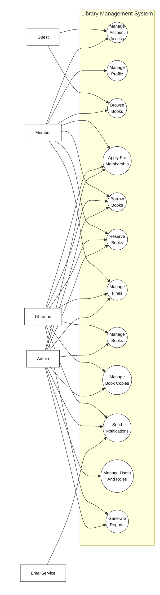
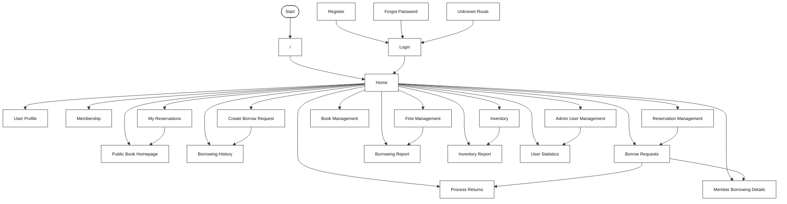

**Requirement & Design Specification**
**Library Management System**
**Version: 1.0**

## Record of Changes

| Version | Date | A,M,D | In change | Change Description |
| ------- | ---- | ----- | --------- | ------------------ |
| 1.0 | 2026-06-02 | A | DungTH | FE05 Book Management specification created. |
| 1.0 | 2026-06-03 | A | DatDT | FE02 Authentication feature specification structure created. |
| 1.0 | 2026-06-03 | A | DungTH | FE11 User & Role Management feature specification structure created. |
| 1.0 | 2026-06-10 | A | DungTH | FE01 Public Browse review decisions approved. |
| 1.0 | 2026-06-10 | A | DatDT | FE02 foundation slice implemented and authentication flows ready for review. |
| 1.0 | 2026-06-10 | A | DatDT | FE03 User Profile review decisions approved. |
| 1.0 | 2026-06-10 | A | DatDT | FE04 Membership Management review decisions approved. |
| 1.0 | 2026-06-10 | A | DatDT | FE06 Inventory/Book Copy review decisions approved. |
| 1.0 | 2026-06-10 | A | NhatNHA | FE07 Borrowing backend slice ready for review. |
| 1.0 | 2026-06-10 | A | NhatNHA | FE08 Reservation backend slice ready for review. |
| 1.0 | 2026-06-10 | A | DungTH | FE09 Fine Management review decisions approved. |
| 1.0 | 2026-06-10 | A | NhatNHA | FE10 Notification backend slice ready for review. |
| 1.0 | 2026-06-10 | A | NhatNHA | FE12 Reporting backend slice ready for review. |
| 1.0 | 2026-06-20 | A | DatDT | FE03 backend and frontend avatar upload implemented. |
| 1.0 | 2026-06-20 | A | NhatNHA | FE07 frontend UI implemented and accessibility validated. |
| 1.0 | 2026-06-20 | A | NhatNHA | FE08 frontend UI implemented and accessibility validated. |
| 1.0 | 2026-06-20 | A | NhatNHA | FE12 frontend UI implemented and accessibility validated. |
| 1.0 | 2026-06-25 | A | DungTH | FE09 server-side implementation completed. |
| 1.0 | 2026-07-10 | M | NhatNHA | FE12 inventory category filter completed. |
| 1.0 | 2026-07-13 | M | NhatNHA | FE08 frontend correctness aligned with approved lifecycle. |
| 1.0 | 2026-07-13 | M | NhatNHA | FE10 hardening implemented and B7 integration closed out. |
| 1.0 | 2026-07-13 | M | NhatNHA | FE12 B7 integration and review closeout completed. |
| 1.0 | 2026-07-14 | M | NhatNHA | FE07 B7 integration and validation closeout completed. |
| 1.0 | 2026-07-15 | M | DungTH | FE01 read-only availability ownership defined. |
| 1.0 | 2026-07-15 | M | DatDT | FE02 account setup implementation and validation completed. |
| 1.0 | 2026-07-15 | M | DatDT | FE04 canonical membership contract added. |
| 1.0 | 2026-07-15 | M | DungTH | FE05 catalog ownership and deterministic contract added. |
| 1.0 | 2026-07-15 | M | DatDT | FE06 deterministic inventory contract added. |
| 1.0 | 2026-07-15 | M | NhatNHA | FE10 account setup delivery implemented and OTP security boundary approved. |
| 1.0 | 2026-07-15 | M | DungTH | FE11 account setup slice implemented and validation ready. |
| 1.0 | 2026-07-17 | M | DatDT | FE03 deterministic profile and avatar failure contracts updated. |
| 1.0 | 2026-07-18 | M | DungTH | FE01 authenticated homepage navigation updated. |
| 1.0 | 2026-07-18 | M | DatDT | FE04 member, librarian, and admin review UI integrated. |
| 1.0 | 2026-07-18 | M | DungTH | FE05 librarian book management navigation and catalog metadata timestamps updated. |
| 1.0 | 2026-07-18 | M | DatDT | FE06 navigation label clarified. |
| 1.0 | 2026-07-18 | M | NhatNHA | FE07 member and librarian borrowing workspace polished. |
| 1.0 | 2026-07-18 | M | NhatNHA | FE08 member and librarian reservation operations aligned with canonical data. |
| 1.0 | 2026-07-18 | M | DungTH | FE09 librarian fine navigation and page restored. |
| 1.0 | 2026-07-18 | M | DungTH | FE11 transactional role management, safe user reads, admin role UI, and audit log integrated. |
| 1.0 | 2026-07-19 | M | DatDT | FE02 FE11 finalization schema contract activated. |
| 1.0 | 2026-07-19 | M | DatDT | FE03 FE11 librarian column ownership activated. |
| 1.0 | 2026-07-19 | M | NhatNHA | FE10 recipient email width synchronization activated. |
| 1.0 | 2026-07-19 | M | DungTH | FE11 admin navigation permissions and finalization governance activated. |

***A - Added M - Modified D - Deleted**

## Content

- Record of Changes
- I. Overview
  - 1. User Requirements
    - 1.1 Actors
    - 1.2 Use Cases
  - 2. Overall Functionalities
    - 2.1 Screens Flow
    - 2.2 Screen Descriptions
    - 2.3 Screen Authorization
    - 2.4 Non-UI Functions
  - 3. System High Level Design
    - 3.1 Database Design
    - 3.2 Code Packages
- II. Requirement Specifications
  - 1. `<<Feature Name>>`
    - 1.1 `<<UseCaseCode_UC Name>>`
  - 2. Common Functions
    - 2.1 UC-2 Login System
  - 3. Patron Feature
    - 3.1 UC-5 Order a Meal
    - 3.2 UC-6 Register for Payroll Deduction
- III. Design Specifications
  - 1. `<<Feature Name>>`
    - 1.1 `<<SubFeature Name>>`
    - 1.2 System Access
- IV. Appendix
  - 1. Assumptions & Dependencies
  - 2. Limitations & Exclusions
  - 3. Business Rules

# I. Overview

## 1. User Requirements

### 1.1 Actors

An actor is a person, role, or external service that interacts with the Library Management System to perform a use case. The system actors are listed below.

| # | Actor | Description |
| - | ----- | ----------- |
| 1 | Guest | Unauthenticated visitor who can browse public book information and register/login to use member functions. |
| 2 | Member | Registered library user who can manage profile information, browse books, request membership, borrow books, reserve books, view borrowing/reservation history, and view fines. |
| 3 | Librarian | Library staff who manages book copies, borrowing requests, returns, reservations, membership review support, and fine-related operations. |
| 4 | Admin | System administrator who manages users, roles, permissions, audit logs, system dashboards, and administrative library operations. |
| 5 | EmailService | Internal/external delivery service used by the system to send verification, password reset, account setup, borrowing, reservation, membership, and fine notifications. |

### 1.2 Use Cases

A use case describes a sequence of interactions between an external actor and the Library Management System that helps the actor achieve a business outcome. The use cases below are derived from the approved Phase 1 feature list and feature specifications.

#### a. Diagram(s)

##### Figure 1. Overall Use Case Diagram

#### b. Use Case List

| UC ID | Use Case Name | Primary Actor(s) | Supporting Actor(s) | Outcome |
| ----- | ------------- | ---------------- | ------------------- | ------- |
| UC-01 | Browse Books | Guest, Member | Internal database | Actor can search, browse, and view public book information and current availability. |
| UC-02 | Manage Account Access | Guest, Member, Admin-created user | EmailService, Internal database | Actor can register, verify email, login, logout, change password, request password reset, reset password, and complete admin-created account setup. |
| UC-03 | Manage Profile | Member | Internal database | Member can view and update profile information, including avatar where supported. |
| UC-04 | Apply For Membership | Member, Librarian, Admin | EmailService, Internal database | Member can submit a membership application and authorized staff can approve or reject it. |
| UC-05 | Manage Books | Librarian, Admin | Internal database | Authorized staff can create, update, deactivate, reactivate, search, and view book catalog records. |
| UC-06 | Manage Book Copies | Librarian, Admin | Internal database | Authorized staff can manage physical copies, barcodes, location, status, and inventory availability. |
| UC-07 | Borrow Books | Member, Librarian, Admin | EmailService, Internal database | Member can request borrowing; authorized staff can approve, reject, process returns, renew borrowing, and maintain borrowing history. |
| UC-08 | Reserve Books | Member, Librarian, Admin | EmailService, Internal database | Member can reserve or cancel reservations; authorized staff can manage queues and fulfill held reservations. |
| UC-09 | Manage Fines | Member, Librarian, Admin | EmailService, Internal database | Member can view fine information; authorized staff can calculate, collect, mark paid, or resolve fines. |
| UC-10 | Send Notifications | EmailService, Librarian, Admin | Internal database | System can create and deliver account, reservation, due date, fine, membership, and account setup notifications. |
| UC-11 | Manage Users And Roles | Admin | EmailService, Internal database | Admin can manage users, librarian accounts, roles, permissions, admin request review view, and audit logs. |
| UC-12 | Generate Reports | Librarian, Admin | Internal database | Authorized staff can view borrowing reports, inventory reports, and user statistics. |

#### c. Use Case Relationships

| Relationship | Description |
| ------------ | ----------- |
| UC-02 includes UC-10 | Account registration, verification, password reset, and admin-created account setup require notification delivery. |
| UC-04 includes UC-10 | Membership approval or rejection can queue a membership result notification. |
| UC-07 includes UC-06 | Borrowing and returning depend on current physical copy status and availability. |
| UC-07 extends UC-09 | Returning an overdue, lost, or damaged copy may trigger fine calculation or fine management. |
| UC-08 includes UC-06 | Reservation queue processing depends on physical copy availability. |
| UC-08 includes UC-10 | Reservation availability and queue events can trigger notifications. |
| UC-09 includes UC-10 | Fine and overdue events can trigger due date or fine notifications. |
| UC-11 includes UC-10 | Admin-created user accounts can trigger account setup notifications. |
| UC-01 to UC-12 use internal database reads or persistence | Each use case reads from or writes to the database according to its feature data contract; the database is an internal component, not a use case actor in this diagram. |

## 2. Overall Functionalities

### 2.1 Screens Flow

This section shows the main system screens and navigation relationship among screens. The screen flow is based on the current frontend routes in `frontend/src/App.jsx`.

| Screen | Route | Main Actor(s) | Purpose |
| ------ | ----- | ------------- | ------- |
| Login | `/login` | Guest, Member, Librarian, Admin | Authenticate an existing user. |
| Register | `/register` | Guest | Create a new user account. |
| Forgot Password | `/forgot-password` | Guest, Member, Librarian, Admin | Request password reset support. |
| Home | `/home` | Guest, Member, Librarian, Admin | Route users to the proper home experience. |
| Public Book Homepage | `/homepage` | Guest, Member | Browse public book information. |
| User Profile | `/profile` | Member, Librarian, Admin | View and update personal profile information. |
| Membership | `/membership` | Member, Librarian, Admin | Submit or review membership-related information. |
| Admin User Management | `/admin/users` | Admin | Manage users, roles, permissions, audit logs, and admin console sections. |
| Fine Management | `/librarian/fines` | Librarian, Admin | Manage fine list, collection, paid status, and resolution. |
| Inventory | `/librarian/inventory` | Librarian, Admin | Manage physical book copies and availability. |
| Book Management | `/librarian/books` | Librarian, Admin | Manage catalog book records. |
| Create Borrow Request | `/borrowing/new` | Member | Create a new borrow request. |
| Borrowing History | `/borrowing/history` | Member | View personal borrowing history. |
| Borrow Requests | `/librarian/borrow-requests` | Librarian, Admin | Review and process borrow requests. |
| Process Returns | `/librarian/returns` | Librarian, Admin | Process returned borrowed copies. |
| Member Borrowing Details | `/librarian/members` | Librarian, Admin | View member borrowing details. |
| My Reservations | `/reservations/mine` | Member | View and manage personal reservations. |
| Reservation Management | `/librarian/reservations` | Librarian, Admin | Manage reservation queues and staff reservation operations. |
| Borrowing Report | `/reports/borrowing` | Librarian, Admin | View borrowing report data. |
| Inventory Report | `/reports/inventory` | Librarian, Admin | View inventory report data. |
| User Statistics | `/reports/users` | Librarian, Admin | View user statistics. |
