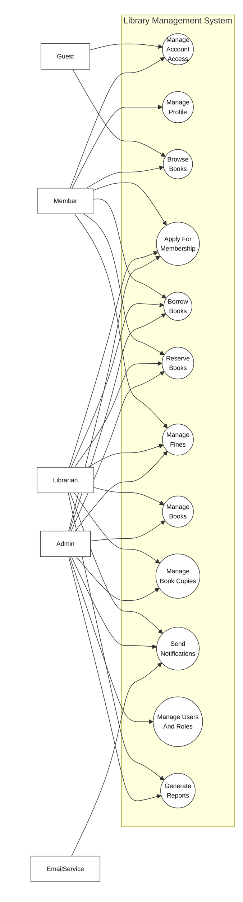
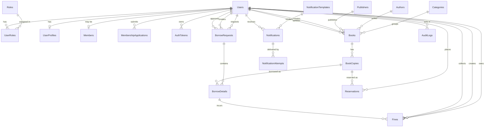

**Requirement & Design Specification**
**Library Management System**
**Version: 1.0**

## Record of Changes

| Version | Date | A,M,D | In change | Change Description |
| ------- | ---- | ----- | --------- | ------------------ |
| 1.0 | 2026-06-02 | A | DungTH | FE05 Book Management specification created. |
| 1.0 | 2026-06-03 | A | DatDT | FE02 Authentication feature specification structure created. |
| 1.0 | 2026-06-03 | A | DungTH | FE11 User & Role Management feature specification structure created. |
| 1.0 | 2026-06-10 | A | DungTH | FE01 Public Browse review decisions approved. |
| 1.0 | 2026-06-10 | A | DatDT | FE02 foundation slice implemented and authentication flows ready for review. |
| 1.0 | 2026-06-10 | A | DatDT | FE03 User Profile review decisions approved. |
| 1.0 | 2026-06-10 | A | DatDT | FE04 Membership Management review decisions approved. |
| 1.0 | 2026-06-10 | A | DatDT | FE06 Inventory/Book Copy review decisions approved. |
| 1.0 | 2026-06-10 | A | NhatNHA | FE07 Borrowing backend slice ready for review. |
| 1.0 | 2026-06-10 | A | NhatNHA | FE08 Reservation backend slice ready for review. |
| 1.0 | 2026-06-10 | A | DungTH | FE09 Fine Management review decisions approved. |
| 1.0 | 2026-06-10 | A | NhatNHA | FE10 Notification backend slice ready for review. |
| 1.0 | 2026-06-10 | A | NhatNHA | FE12 Reporting backend slice ready for review. |
| 1.0 | 2026-06-20 | A | DatDT | FE03 backend and frontend avatar upload implemented. |
| 1.0 | 2026-06-20 | A | NhatNHA | FE07 frontend UI implemented and accessibility validated. |
| 1.0 | 2026-06-20 | A | NhatNHA | FE08 frontend UI implemented and accessibility validated. |
| 1.0 | 2026-06-20 | A | NhatNHA | FE12 frontend UI implemented and accessibility validated. |
| 1.0 | 2026-06-25 | A | DungTH | FE09 server-side implementation completed. |
| 1.0 | 2026-07-10 | M | NhatNHA | FE12 inventory category filter completed. |
| 1.0 | 2026-07-13 | M | NhatNHA | FE08 frontend correctness aligned with approved lifecycle. |
| 1.0 | 2026-07-13 | M | NhatNHA | FE10 hardening implemented and B7 integration closed out. |
| 1.0 | 2026-07-13 | M | NhatNHA | FE12 B7 integration and review closeout completed. |
| 1.0 | 2026-07-14 | M | NhatNHA | FE07 B7 integration and validation closeout completed. |
| 1.0 | 2026-07-15 | M | DungTH | FE01 read-only availability ownership defined. |
| 1.0 | 2026-07-15 | M | DatDT | FE02 account setup implementation and validation completed. |
| 1.0 | 2026-07-15 | M | DatDT | FE04 canonical membership contract added. |
| 1.0 | 2026-07-15 | M | DungTH | FE05 catalog ownership and deterministic contract added. |
| 1.0 | 2026-07-15 | M | DatDT | FE06 deterministic inventory contract added. |
| 1.0 | 2026-07-15 | M | NhatNHA | FE10 account setup delivery implemented and OTP security boundary approved. |
| 1.0 | 2026-07-15 | M | DungTH | FE11 account setup slice implemented and validation ready. |
| 1.0 | 2026-07-17 | M | DatDT | FE03 deterministic profile and avatar failure contracts updated. |
| 1.0 | 2026-07-18 | M | DungTH | FE01 authenticated homepage navigation updated. |
| 1.0 | 2026-07-18 | M | DatDT | FE04 member, librarian, and admin review UI integrated. |
| 1.0 | 2026-07-18 | M | DungTH | FE05 librarian book management navigation and catalog metadata timestamps updated. |
| 1.0 | 2026-07-18 | M | DatDT | FE06 navigation label clarified. |
| 1.0 | 2026-07-18 | M | NhatNHA | FE07 member and librarian borrowing workspace polished. |
| 1.0 | 2026-07-18 | M | NhatNHA | FE08 member and librarian reservation operations aligned with canonical data. |
| 1.0 | 2026-07-18 | M | DungTH | FE09 librarian fine navigation and page restored. |
| 1.0 | 2026-07-18 | M | DungTH | FE11 transactional role management, safe user reads, admin role UI, and audit log integrated. |
| 1.0 | 2026-07-19 | M | DatDT | FE02 FE11 finalization schema contract activated. |
| 1.0 | 2026-07-19 | M | DatDT | FE03 FE11 librarian column ownership activated. |
| 1.0 | 2026-07-19 | M | NhatNHA | FE10 recipient email width synchronization activated. |
| 1.0 | 2026-07-19 | M | DungTH | FE11 admin navigation permissions and finalization governance activated. |

***A - Added M - Modified D - Deleted**

## Content

- Record of Changes
- I. Overview
  - 1. User Requirements
    - 1.1 Actors
    - 1.2 Use Cases
  - 2. Overall Functionalities
    - 2.1 Screens Flow
    - 2.2 Screen Descriptions
    - 2.3 Screen Authorization
    - 2.4 Non-UI Functions
  - 3. System High Level Design
    - 3.1 Database Design
    - 3.2 Code Packages
- II. Requirement Specifications
  - 1. `<<Feature Name>>`
    - 1.1 `<<UseCaseCode_UC Name>>`
  - 2. Common Functions
    - 2.1 UC-2 Login System
  - 3. Patron Feature
    - 3.1 UC-5 Order a Meal
    - 3.2 UC-6 Register for Payroll Deduction
- III. Design Specifications
  - 1. `<<Feature Name>>`
    - 1.1 `<<SubFeature Name>>`
    - 1.2 System Access
- IV. Appendix
  - 1. Assumptions & Dependencies
  - 2. Limitations & Exclusions
  - 3. Business Rules

# I. Overview

## 1. User Requirements

### 1.1 Actors

An actor is a person, role, or external service that interacts with the Library Management System to perform a use case. The system actors are listed below.

| # | Actor | Description |
| - | ----- | ----------- |
| 1 | Guest | Unauthenticated visitor who can browse public book information and register/login to use member functions. |
| 2 | Member | Registered library user who can manage profile information, browse books, request membership, borrow books, reserve books, view borrowing/reservation history, and view fines. |
| 3 | Librarian | Library staff who manages book copies, borrowing requests, returns, reservations, membership review support, and fine-related operations. |
| 4 | Admin | System administrator who manages users, roles, permissions, audit logs, system dashboards, and administrative library operations. |
| 5 | EmailService | Internal/external delivery service used by the system to send verification, password reset, account setup, borrowing, reservation, membership, and fine notifications. |

### 1.2 Use Cases

A use case describes a sequence of interactions between an external actor and the Library Management System that helps the actor achieve a business outcome. The use cases below are derived from the approved Phase 1 feature list and feature specifications.

#### a. Diagram(s)

##### Figure 1. Overall Use Case Diagram

#### b. Use Case List

| UC ID | Use Case Name | Primary Actor(s) | Supporting Actor(s) | Outcome |
| ----- | ------------- | ---------------- | ------------------- | ------- |
| UC-01 | Browse Books | Guest, Member | Internal database | Actor can search, browse, and view public book information and current availability. |
| UC-02 | Manage Account Access | Guest, Member, Admin-created user | EmailService, Internal database | Actor can register, verify email, login, logout, change password, request password reset, reset password, and complete admin-created account setup. |
| UC-03 | Manage Profile | Member | Internal database | Member can view and update profile information, including avatar where supported. |
| UC-04 | Apply For Membership | Member, Librarian, Admin | EmailService, Internal database | Member can submit a membership application and authorized staff can approve or reject it. |
| UC-05 | Manage Books | Librarian, Admin | Internal database | Authorized staff can create, update, deactivate, reactivate, search, and view book catalog records. |
| UC-06 | Manage Book Copies | Librarian, Admin | Internal database | Authorized staff can manage physical copies, barcodes, location, status, and inventory availability. |
| UC-07 | Borrow Books | Member, Librarian, Admin | EmailService, Internal database | Member can request borrowing; authorized staff can approve, reject, process returns, renew borrowing, and maintain borrowing history. |
| UC-08 | Reserve Books | Member, Librarian, Admin | EmailService, Internal database | Member can reserve or cancel reservations; authorized staff can manage queues and fulfill held reservations. |
| UC-09 | Manage Fines | Member, Librarian, Admin | EmailService, Internal database | Member can view fine information; authorized staff can calculate, collect, mark paid, or resolve fines. |
| UC-10 | Send Notifications | EmailService, Librarian, Admin | Internal database | System can create and deliver account, reservation, due date, fine, membership, and account setup notifications. |
| UC-11 | Manage Users And Roles | Admin | EmailService, Internal database | Admin can manage users, librarian accounts, roles, permissions, admin request review view, and audit logs. |
| UC-12 | Generate Reports | Librarian, Admin | Internal database | Authorized staff can view borrowing reports, inventory reports, and user statistics. |

#### c. Use Case Relationships

| Relationship | Description |
| ------------ | ----------- |
| UC-02 includes UC-10 | Account registration, verification, password reset, and admin-created account setup require notification delivery. |
| UC-04 includes UC-10 | Membership approval or rejection can queue a membership result notification. |
| UC-07 includes UC-06 | Borrowing and returning depend on current physical copy status and availability. |
| UC-07 extends UC-09 | Returning an overdue, lost, or damaged copy may trigger fine calculation or fine management. |
| UC-08 includes UC-06 | Reservation queue processing depends on physical copy availability. |
| UC-08 includes UC-10 | Reservation availability and queue events can trigger notifications. |
| UC-09 includes UC-10 | Fine and overdue events can trigger due date or fine notifications. |
| UC-11 includes UC-10 | Admin-created user accounts can trigger account setup notifications. |
| UC-01 to UC-12 use internal database reads or persistence | Each use case reads from or writes to the database according to its feature data contract; the database is an internal component, not a use case actor in this diagram. |

## 2. Overall Functionalities

### 2.1 Screens Flow

This section shows the main system screens and navigation relationship among screens. The screen flow is based on the current frontend routes in `frontend/src/App.jsx`.

### 2.2 Screen Descriptions

This section describes the screens shown in the Screens Flow above.

| # | Feature | Screen | Description |
| - | ------- | ------ | ----------- |
| 1 | Authentication | Login | Allows a user to sign in with account credentials and enter the system according to their role. |
| 2 | Authentication | Register | Allows a guest to create a new account before using member functions. |
| 3 | Authentication | Forgot Password | Allows a user to request password reset support through email. |
| 4 | Public / Browse | Home | Routes the user to the proper home experience after opening the system or signing in. |
| 5 | Public / Browse | Public Book Homepage | Shows public book information, searchable catalog content, and book availability. |
| 6 | User Profile | User Profile | Allows an authenticated user to view and update profile information. |
| 7 | Membership Management | Membership | Allows a member to submit or view membership status and allows authorized staff to review membership information. |
| 8 | Book Management | Book Management | Allows librarian or admin users to create, update, deactivate, reactivate, search, and view book records. |
| 9 | Inventory / Book Copy Management | Inventory | Allows librarian or admin users to manage physical book copies, barcode, status, location, and availability. |
| 10 | Borrowing Management | Create Borrow Request | Allows a member to create a request to borrow available books. |
| 11 | Borrowing Management | Borrowing History | Allows a member to view their borrowing requests, active borrowings, returns, and renewal-related information. |
| 12 | Borrowing Management | Borrow Requests | Allows librarian or admin users to review, approve, or reject member borrow requests. |
| 13 | Borrowing Management | Process Returns | Allows librarian or admin users to process returned book copies and update borrowing status. |
| 14 | Borrowing Management | Member Borrowing Details | Allows librarian or admin users to view borrowing details for library members. |
| 15 | Reservation Management | My Reservations | Allows a member to view or cancel their own reservations. |
| 16 | Reservation Management | Reservation Management | Allows librarian or admin users to manage reservation queues and staff reservation actions. |
| 17 | Fine Management | Fine Management | Allows librarian or admin users to view, calculate, collect, mark paid, or resolve fines. |
| 18 | Reporting & Statistics | Borrowing Report | Shows borrowing report data for operational review. |
| 19 | Reporting & Statistics | Inventory Report | Shows inventory and availability report data. |
| 20 | Reporting & Statistics | User Statistics | Shows user statistics for administrative review. |
| 21 | User & Role Management | Admin User Management | Allows admin users to manage user accounts, librarian accounts, roles, permissions, audit logs, and admin console sections. |

### 2.3 Screen Authorization

This section defines which system roles can access each screen or activity.

| Screen / Activity | Guest | Member | Librarian | Admin |
| ----------------- | ----- | ------ | --------- | ----- |
| Login | X | X | X | X |
| Register | X |  |  |  |
| Forgot Password | X | X | X | X |
| Home | X | X | X | X |
| Public Book Homepage | X | X | X | X |
| User Profile |  | X | X | X |
| Membership |  | X | X | X |
| Apply for membership |  | X |  |  |
| View own membership status |  | X |  |  |
| Review membership application |  |  | X | X |
| Book Management |  |  | X | X |
| Query book data | X | X | X | X |
| Add book data |  |  | X | X |
| Update book data |  |  | X | X |
| Deactivate or reactivate book data |  |  | X | X |
| Inventory |  |  | X | X |
| Query copy data |  |  | X | X |
| Add copy data |  |  | X | X |
| Update copy data |  |  | X | X |
| Deactivate copy data |  |  | X | X |
| Create Borrow Request |  | X |  |  |
| Borrowing History |  | X |  |  |
| Borrow Requests |  |  | X | X |
| Approve or reject borrow request |  |  | X | X |
| Process Returns |  |  | X | X |
| Member Borrowing Details |  |  | X | X |
| My Reservations |  | X |  |  |
| Create or cancel own reservation |  | X |  |  |
| Reservation Management |  |  | X | X |
| Process reservation queue |  |  | X | X |
| Fine Management |  |  | X | X |
| View own fine information |  | X |  |  |
| Calculate or update fine data |  |  | X | X |
| Mark fine as paid or resolved |  |  | X | X |
| Borrowing Report |  |  | X | X |
| Inventory Report |  |  | X | X |
| User Statistics |  |  | X | X |
| Admin User Management |  |  |  | X |
| Create or update user account |  |  |  | X |
| Manage roles and permissions |  |  |  | X |
| View audit logs |  |  |  | X |

### 2.4 Non-UI Functions

This section describes system functions that run behind the screens, through services, APIs, guards, or internal processing.

| # | Feature | System Function | Description |
| - | ------- | --------------- | ----------- |
| 1 | Authentication | Validate Session / Token | Validates the authenticated user's token before protected API or screen access is allowed. |
| 2 | Authentication | Hash Password | Stores user passwords using secure hashing instead of plain text. |
| 3 | Authentication | Generate Verification Token | Creates a time-limited credential for email verification after registration. |
| 4 | Authentication | Generate Password Reset Token | Creates a time-limited credential for password reset requests. |
| 5 | Authentication | Complete Admin-Created Account Setup | Allows a user created by an admin to finish account setup through a secure setup link. |
| 6 | Notification Management | Send Account Verification Email | Sends account verification email through EmailService. |
| 7 | Notification Management | Send Password Reset Email | Sends password reset email through EmailService. |
| 8 | Notification Management | Send Account Setup Email | Sends setup email for admin-created accounts through EmailService. |
| 9 | Notification Management | Queue Membership Result Notification | Creates a notification request when a membership application is approved or rejected. |
| 10 | Notification Management | Send Reservation Notification | Sends reservation availability or queue-related email notification. |
| 11 | Notification Management | Send Due Date Or Fine Notification | Sends due date, overdue, or fine-related notification when requested by the system. |
| 12 | Book Management | Derive Public Availability | Calculates public-facing book availability from active inventory copy data. |
| 13 | Inventory / Book Copy Management | Validate Copy Status Transition | Prevents invalid manual copy status changes that conflict with borrowing or reservation state. |
| 14 | Borrowing Management | Check Borrowing Eligibility | Checks membership, borrow limit, overdue, unpaid fine, and copy availability rules before borrowing is approved. |
| 15 | Borrowing Management | Calculate Due Date | Calculates due date from the approved borrow date using the default loan duration. |
| 16 | Borrowing Management | Update Borrowing And Copy Status | Updates borrow detail status and physical copy status during approve, return, and renewal operations. |
| 17 | Reservation Management | Process Reservation Queue | Selects the next valid reservation when a reserved copy becomes available. |
| 18 | Reservation Management | Fulfill Held Reservation | Connects a held reservation to borrowing processing when the member borrows the held copy. |
| 19 | Fine Management | Calculate Overdue Fine | Calculates overdue fines based on overdue days and configured fine rate. |
| 20 | Fine Management | Prevent Duplicate Fine | Ensures the same overdue borrowing detail does not create duplicate active fine records. |
| 21 | User & Role Management | Enforce Role-Based Authorization | Blocks protected actions when the current user does not have the required role. |
| 22 | User & Role Management | Prevent Last Admin Removal | Prevents deactivation or role changes that would leave the system without an admin. |
| 23 | User & Role Management | Write Audit Log | Records important administrative actions that affect users, roles, books, borrowing, returning, fines, or membership. |
| 24 | Reporting & Statistics | Aggregate Borrowing Report Data | Builds borrowing report summaries from borrowing records. |
| 25 | Reporting & Statistics | Aggregate Inventory Report Data | Builds inventory report summaries from book and copy records. |
| 26 | Reporting & Statistics | Aggregate User Statistics | Builds user statistics from account, role, and member data. |

## 3. System High Level Design

### 3.1 Database Design

#### a. Database Schema

The database schema is based on `database/Librarymanagement.sql`. The diagram below shows the main table relationships used by the Library Management System.

#### b. Table Descriptions

| No | Table | Description |
| -- | ----- | ----------- |
| 01 | Roles | Stores system role definitions. - Primary keys: RoleId - Foreign keys: None |
| 02 | Users | Stores login account, email, password hash, phone, account status, and login tracking data. - Primary keys: UserId - Foreign keys: None |
| 03 | UserRoles | Stores many-to-many assignments between users and roles. - Primary keys: UserId, RoleId - Foreign keys: UserId, RoleId |
| 04 | UserProfiles | Stores personal profile information for a user. - Primary keys: ProfileId - Foreign keys: UserId |
| 05 | Members | Stores library membership status for a user. - Primary keys: MemberId - Foreign keys: UserId, ApprovedBy |
| 06 | MembershipApplications | Stores membership application and review records. - Primary keys: ApplicationId - Foreign keys: UserId, ReviewedBy |
| 07 | AuthTokens | Stores refresh, password reset, email verification, and account setup token hashes. - Primary keys: TokenId - Foreign keys: UserId |
| 08 | Categories | Stores book category information. - Primary keys: CategoryId - Foreign keys: None |
| 09 | Authors | Stores author information. - Primary keys: AuthorId - Foreign keys: None |
| 10 | Publishers | Stores publisher information. - Primary keys: PublisherId - Foreign keys: None |
| 11 | Books | Stores catalog metadata such as title, ISBN, category, author, publisher, cover, rating, pages, and status. - Primary keys: BookId - Foreign keys: CategoryId, AuthorId, PublisherId, CreatedBy, UpdatedBy |
| 12 | BookCopies | Stores physical copy records, barcode, status, and location. - Primary keys: CopyId - Foreign keys: BookId |
| 13 | BorrowRequests | Stores borrow request header data, request status, approval data, and processing timestamps. - Primary keys: RequestId - Foreign keys: UserId, CreatedBy, ApprovedBy |
| 14 | BorrowDetails | Stores per-copy borrow data, borrow date, due date, return date, renewal count, and copy-level status. - Primary keys: BorrowDetailId - Foreign keys: RequestId, CopyId |
| 15 | Reservations | Stores reservation queue records for users and book copies. - Primary keys: ReservationId - Foreign keys: UserId, CopyId |
| 16 | Fines | Stores fine amount, overdue days, paid amount, reason, status, payment method, and collection data. - Primary keys: FineId - Foreign keys: UserId, BorrowDetailId, CreatedBy, CollectedBy |
| 17 | NotificationTemplates | Stores reusable email notification templates. - Primary keys: TemplateId - Foreign keys: None |
| 18 | Notifications | Stores notification requests, recipient email, delivery status, source metadata, and safe payload. - Primary keys: NotificationId - Foreign keys: TemplateId, UserId |
| 19 | NotificationAttempts | Stores individual notification delivery attempt results. - Primary keys: AttemptId - Foreign keys: NotificationId |
| 20 | AuditLogs | Stores administrative action logs, target metadata, IP address, user agent, and creation time. - Primary keys: LogId - Foreign keys: UserId |
