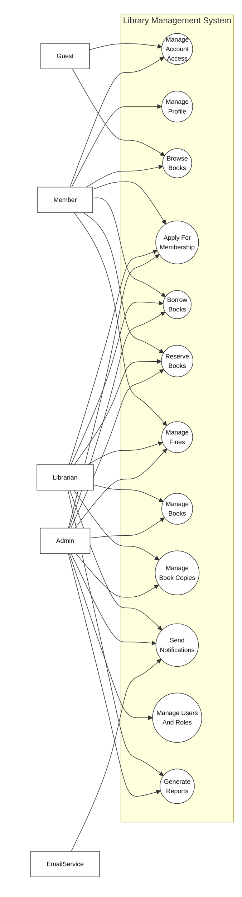
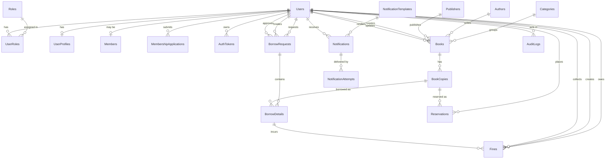
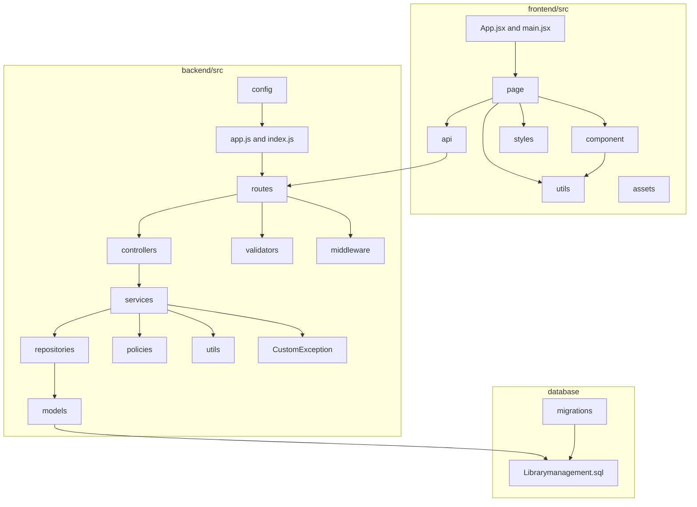

**Requirement & Design Specification**
**Library Management System**
**Version: 1.0**

## Record of Changes

| Version | Date | A,M,D | In change | Change Description |
| ------- | ---- | ----- | --------- | ------------------ |
| 1.0 | 2026-06-02 | A | DungTH | FE05 Book Management specification created. |
| 1.0 | 2026-06-03 | A | DatDT | FE02 Authentication feature specification structure created. |
| 1.0 | 2026-06-03 | A | DungTH | FE11 User & Role Management feature specification structure created. |
| 1.0 | 2026-06-10 | A | DungTH | FE01 Public Browse review decisions approved. |
| 1.0 | 2026-06-10 | A | DatDT | FE02 foundation slice implemented and authentication flows ready for review. |
| 1.0 | 2026-06-10 | A | DatDT | FE03 User Profile review decisions approved. |
| 1.0 | 2026-06-10 | A | DatDT | FE04 Membership Management review decisions approved. |
| 1.0 | 2026-06-10 | A | DatDT | FE06 Inventory/Book Copy review decisions approved. |
| 1.0 | 2026-06-10 | A | NhatNHA | FE07 Borrowing backend slice ready for review. |
| 1.0 | 2026-06-10 | A | NhatNHA | FE08 Reservation backend slice ready for review. |
| 1.0 | 2026-06-10 | A | DungTH | FE09 Fine Management review decisions approved. |
| 1.0 | 2026-06-10 | A | NhatNHA | FE10 Notification backend slice ready for review. |
| 1.0 | 2026-06-10 | A | NhatNHA | FE12 Reporting backend slice ready for review. |
| 1.0 | 2026-06-20 | A | DatDT | FE03 backend and frontend avatar upload implemented. |
| 1.0 | 2026-06-20 | A | NhatNHA | FE07 frontend UI implemented and accessibility validated. |
| 1.0 | 2026-06-20 | A | NhatNHA | FE08 frontend UI implemented and accessibility validated. |
| 1.0 | 2026-06-20 | A | NhatNHA | FE12 frontend UI implemented and accessibility validated. |
| 1.0 | 2026-06-25 | A | DungTH | FE09 server-side implementation completed. |
| 1.0 | 2026-07-10 | M | NhatNHA | FE12 inventory category filter completed. |
| 1.0 | 2026-07-13 | M | NhatNHA | FE08 frontend correctness aligned with approved lifecycle. |
| 1.0 | 2026-07-13 | M | NhatNHA | FE10 hardening implemented and B7 integration closed out. |
| 1.0 | 2026-07-13 | M | NhatNHA | FE12 B7 integration and review closeout completed. |
| 1.0 | 2026-07-14 | M | NhatNHA | FE07 B7 integration and validation closeout completed. |
| 1.0 | 2026-07-15 | M | DungTH | FE01 read-only availability ownership defined. |
| 1.0 | 2026-07-15 | M | DatDT | FE02 account setup implementation and validation completed. |
| 1.0 | 2026-07-15 | M | DatDT | FE04 canonical membership contract added. |
| 1.0 | 2026-07-15 | M | DungTH | FE05 catalog ownership and deterministic contract added. |
| 1.0 | 2026-07-15 | M | DatDT | FE06 deterministic inventory contract added. |
| 1.0 | 2026-07-15 | M | NhatNHA | FE10 account setup delivery implemented and OTP security boundary approved. |
| 1.0 | 2026-07-15 | M | DungTH | FE11 account setup slice implemented and validation ready. |
| 1.0 | 2026-07-17 | M | DatDT | FE03 deterministic profile and avatar failure contracts updated. |
| 1.0 | 2026-07-18 | M | DungTH | FE01 authenticated homepage navigation updated. |
| 1.0 | 2026-07-18 | M | DatDT | FE04 member, librarian, and admin review UI integrated. |
| 1.0 | 2026-07-18 | M | DungTH | FE05 librarian book management navigation and catalog metadata timestamps updated. |
| 1.0 | 2026-07-18 | M | DatDT | FE06 navigation label clarified. |
| 1.0 | 2026-07-18 | M | NhatNHA | FE07 member and librarian borrowing workspace polished. |
| 1.0 | 2026-07-18 | M | NhatNHA | FE08 member and librarian reservation operations aligned with canonical data. |
| 1.0 | 2026-07-18 | M | DungTH | FE09 librarian fine navigation and page restored. |
| 1.0 | 2026-07-18 | M | DungTH | FE11 transactional role management, safe user reads, admin role UI, and audit log integrated. |
| 1.0 | 2026-07-19 | M | DatDT | FE02 FE11 finalization schema contract activated. |
| 1.0 | 2026-07-19 | M | DatDT | FE03 FE11 librarian column ownership activated. |
| 1.0 | 2026-07-19 | M | NhatNHA | FE10 recipient email width synchronization activated. |
| 1.0 | 2026-07-19 | M | DungTH | FE11 admin navigation permissions and finalization governance activated. |

***A - Added M - Modified D - Deleted**

## Content

- Record of Changes
- I. Overview
  - 1. User Requirements
    - 1.1 Actors
    - 1.2 Use Cases
  - 2. Overall Functionalities
    - 2.1 Screens Flow
    - 2.2 Screen Descriptions
    - 2.3 Screen Authorization
    - 2.4 Non-UI Functions
  - 3. System High Level Design
    - 3.1 Database Design
    - 3.2 Code Packages
- II. Requirement Specifications
  - 1. `<<Feature Name>>`
    - 1.1 `<<UseCaseCode_UC Name>>`
  - 2. Common Functions
    - 2.1 UC-2 Login System
  - 3. Patron Feature
    - 3.1 UC-5 Order a Meal
    - 3.2 UC-6 Register for Payroll Deduction
- III. Design Specifications
  - 1. `<<Feature Name>>`
    - 1.1 `<<SubFeature Name>>`
    - 1.2 System Access
- IV. Appendix
  - 1. Assumptions & Dependencies
  - 2. Limitations & Exclusions
  - 3. Business Rules

# I. Overview

## 1. User Requirements

### 1.1 Actors

An actor is a person, role, or external service that interacts with the Library Management System to perform a use case. The system actors are listed below.

| # | Actor | Description |
| - | ----- | ----------- |
| 1 | Guest | Unauthenticated visitor who can browse public book information and register/login to use member functions. |
| 2 | Member | Registered library user who can manage profile information, browse books, request membership, borrow books, reserve books, view borrowing/reservation history, and view fines. |
| 3 | Librarian | Library staff who manages book copies, borrowing requests, returns, reservations, membership review support, and fine-related operations. |
| 4 | Admin | System administrator who manages users, roles, permissions, audit logs, system dashboards, and administrative library operations. |
| 5 | EmailService | Internal/external delivery service used by the system to send verification, password reset, account setup, borrowing, reservation, membership, and fine notifications. |

### 1.2 Use Cases

A use case describes a sequence of interactions between an external actor and the Library Management System that helps the actor achieve a business outcome. The use cases below are derived from the approved Phase 1 feature list and feature specifications.

#### a. Diagram(s)

##### Figure 1. Overall Use Case Diagram

#### b. Use Case List

| UC ID | Use Case Name | Primary Actor(s) | Supporting Actor(s) | Outcome |
| ----- | ------------- | ---------------- | ------------------- | ------- |
| UC-01 | Browse Books | Guest, Member | Internal database | Actor can search, browse, and view public book information and current availability. |
| UC-02 | Manage Account Access | Guest, Member, Admin-created user | EmailService, Internal database | Actor can register, verify email, login, logout, change password, request password reset, reset password, and complete admin-created account setup. |
| UC-03 | Manage Profile | Member | Internal database | Member can view and update profile information, including avatar where supported. |
| UC-04 | Apply For Membership | Member, Librarian, Admin | EmailService, Internal database | Member can submit a membership application and authorized staff can approve or reject it. |
| UC-05 | Manage Books | Librarian, Admin | Internal database | Authorized staff can create, update, deactivate, reactivate, search, and view book catalog records. |
| UC-06 | Manage Book Copies | Librarian, Admin | Internal database | Authorized staff can manage physical copies, barcodes, location, status, and inventory availability. |
| UC-07 | Borrow Books | Member, Librarian, Admin | EmailService, Internal database | Member can request borrowing; authorized staff can approve, reject, process returns, renew borrowing, and maintain borrowing history. |
| UC-08 | Reserve Books | Member, Librarian, Admin | EmailService, Internal database | Member can reserve or cancel reservations; authorized staff can manage queues and fulfill held reservations. |
| UC-09 | Manage Fines | Member, Librarian, Admin | EmailService, Internal database | Member can view fine information; authorized staff can calculate, collect, mark paid, or resolve fines. |
| UC-10 | Send Notifications | EmailService, Librarian, Admin | Internal database | System can create and deliver account, reservation, due date, fine, membership, and account setup notifications. |
| UC-11 | Manage Users And Roles | Admin | EmailService, Internal database | Admin can manage users, librarian accounts, roles, permissions, admin request review view, and audit logs. |
| UC-12 | Generate Reports | Librarian, Admin | Internal database | Authorized staff can view borrowing reports, inventory reports, and user statistics. |

#### c. Use Case Relationships

| Relationship | Description |
| ------------ | ----------- |
| UC-02 includes UC-10 | Account registration, verification, password reset, and admin-created account setup require notification delivery. |
| UC-04 includes UC-10 | Membership approval or rejection can queue a membership result notification. |
| UC-07 includes UC-06 | Borrowing and returning depend on current physical copy status and availability. |
| UC-07 extends UC-09 | Returning an overdue, lost, or damaged copy may trigger fine calculation or fine management. |
| UC-08 includes UC-06 | Reservation queue processing depends on physical copy availability. |
| UC-08 includes UC-10 | Reservation availability and queue events can trigger notifications. |
| UC-09 includes UC-10 | Fine and overdue events can trigger due date or fine notifications. |
| UC-11 includes UC-10 | Admin-created user accounts can trigger account setup notifications. |
| UC-01 to UC-12 use internal database reads or persistence | Each use case reads from or writes to the database according to its feature data contract; the database is an internal component, not a use case actor in this diagram. |

## 2. Overall Functionalities

### 2.1 Screens Flow

This section shows the main system screens and navigation relationship among screens. The screen flow is based on the current frontend routes in `frontend/src/App.jsx`.

### 2.2 Screen Descriptions

This section describes the screens shown in the Screens Flow above.

| # | Feature | Screen | Description |
| - | ------- | ------ | ----------- |
| 1 | Authentication | Login | Allows a user to sign in with account credentials and enter the system according to their role. |
| 2 | Authentication | Register | Allows a guest to create a new account before using member functions. |
| 3 | Authentication | Forgot Password | Allows a user to request password reset support through email. |
| 4 | Public / Browse | Home | Routes the user to the proper home experience after opening the system or signing in. |
| 5 | Public / Browse | Public Book Homepage | Shows public book information, searchable catalog content, and book availability. |
| 6 | User Profile | User Profile | Allows an authenticated user to view and update profile information. |
| 7 | Membership Management | Membership | Allows a member to submit or view membership status and allows authorized staff to review membership information. |
| 8 | Book Management | Book Management | Allows librarian or admin users to create, update, deactivate, reactivate, search, and view book records. |
| 9 | Inventory / Book Copy Management | Inventory | Allows librarian or admin users to manage physical book copies, barcode, status, location, and availability. |
| 10 | Borrowing Management | Create Borrow Request | Allows a member to create a request to borrow available books. |
| 11 | Borrowing Management | Borrowing History | Allows a member to view their borrowing requests, active borrowings, returns, and renewal-related information. |
| 12 | Borrowing Management | Borrow Requests | Allows librarian or admin users to review, approve, or reject member borrow requests. |
| 13 | Borrowing Management | Process Returns | Allows librarian or admin users to process returned book copies and update borrowing status. |
| 14 | Borrowing Management | Member Borrowing Details | Allows librarian or admin users to view borrowing details for library members. |
| 15 | Reservation Management | My Reservations | Allows a member to view or cancel their own reservations. |
| 16 | Reservation Management | Reservation Management | Allows librarian or admin users to manage reservation queues and staff reservation actions. |
| 17 | Fine Management | Fine Management | Allows librarian or admin users to view, calculate, collect, mark paid, or resolve fines. |
| 18 | Reporting & Statistics | Borrowing Report | Shows borrowing report data for operational review. |
| 19 | Reporting & Statistics | Inventory Report | Shows inventory and availability report data. |
| 20 | Reporting & Statistics | User Statistics | Shows user statistics for administrative review. |
| 21 | User & Role Management | Admin User Management | Allows admin users to manage user accounts, librarian accounts, roles, permissions, audit logs, and admin console sections. |

### 2.3 Screen Authorization

This section defines which system roles can access each screen or activity.

| Screen / Activity | Guest | Member | Librarian | Admin |
| ----------------- | ----- | ------ | --------- | ----- |
| Login | X | X | X | X |
| Register | X |  |  |  |
| Forgot Password | X | X | X | X |
| Home | X | X | X | X |
| Public Book Homepage | X | X | X | X |
| User Profile |  | X | X | X |
| Membership |  | X | X | X |
| Apply for membership |  | X |  |  |
| View own membership status |  | X |  |  |
| Review membership application |  |  | X | X |
| Book Management |  |  | X | X |
| Query book data | X | X | X | X |
| Add book data |  |  | X | X |
| Update book data |  |  | X | X |
| Deactivate or reactivate book data |  |  | X | X |
| Inventory |  |  | X | X |
| Query copy data |  |  | X | X |
| Add copy data |  |  | X | X |
| Update copy data |  |  | X | X |
| Deactivate copy data |  |  | X | X |
| Create Borrow Request |  | X |  |  |
| Borrowing History |  | X |  |  |
| Borrow Requests |  |  | X | X |
| Approve or reject borrow request |  |  | X | X |
| Process Returns |  |  | X | X |
| Member Borrowing Details |  |  | X | X |
| My Reservations |  | X |  |  |
| Create or cancel own reservation |  | X |  |  |
| Reservation Management |  |  | X | X |
| Process reservation queue |  |  | X | X |
| Fine Management |  |  | X | X |
| View own fine information |  | X |  |  |
| Calculate or update fine data |  |  | X | X |
| Mark fine as paid or resolved |  |  | X | X |
| Borrowing Report |  |  | X | X |
| Inventory Report |  |  | X | X |
| User Statistics |  |  | X | X |
| Admin User Management |  |  |  | X |
| Create or update user account |  |  |  | X |
| Manage roles and permissions |  |  |  | X |
| View audit logs |  |  |  | X |

### 2.4 Non-UI Functions

This section describes system functions that run behind the screens, through services, APIs, guards, or internal processing.

| # | Feature | System Function | Description |
| - | ------- | --------------- | ----------- |
| 1 | Authentication | Validate Session / Token | Validates the authenticated user's token before protected API or screen access is allowed. |
| 2 | Authentication | Hash Password | Stores user passwords using secure hashing instead of plain text. |
| 3 | Authentication | Generate Verification Token | Creates a time-limited credential for email verification after registration. |
| 4 | Authentication | Generate Password Reset Token | Creates a time-limited credential for password reset requests. |
| 5 | Authentication | Complete Admin-Created Account Setup | Allows a user created by an admin to finish account setup through a secure setup link. |
| 6 | Notification Management | Send Account Verification Email | Sends account verification email through EmailService. |
| 7 | Notification Management | Send Password Reset Email | Sends password reset email through EmailService. |
| 8 | Notification Management | Send Account Setup Email | Sends setup email for admin-created accounts through EmailService. |
| 9 | Notification Management | Queue Membership Result Notification | Creates a notification request when a membership application is approved or rejected. |
| 10 | Notification Management | Send Reservation Notification | Sends reservation availability or queue-related email notification. |
| 11 | Notification Management | Send Due Date Or Fine Notification | Sends due date, overdue, or fine-related notification when requested by the system. |
| 12 | Book Management | Derive Public Availability | Calculates public-facing book availability from active inventory copy data. |
| 13 | Inventory / Book Copy Management | Validate Copy Status Transition | Prevents invalid manual copy status changes that conflict with borrowing or reservation state. |
| 14 | Borrowing Management | Check Borrowing Eligibility | Checks membership, borrow limit, overdue, unpaid fine, and copy availability rules before borrowing is approved. |
| 15 | Borrowing Management | Calculate Due Date | Calculates due date from the approved borrow date using the default loan duration. |
| 16 | Borrowing Management | Update Borrowing And Copy Status | Updates borrow detail status and physical copy status during approve, return, and renewal operations. |
| 17 | Reservation Management | Process Reservation Queue | Selects the next valid reservation when a reserved copy becomes available. |
| 18 | Reservation Management | Fulfill Held Reservation | Connects a held reservation to borrowing processing when the member borrows the held copy. |
| 19 | Fine Management | Calculate Overdue Fine | Calculates overdue fines based on overdue days and configured fine rate. |
| 20 | Fine Management | Prevent Duplicate Fine | Ensures the same overdue borrowing detail does not create duplicate active fine records. |
| 21 | User & Role Management | Enforce Role-Based Authorization | Blocks protected actions when the current user does not have the required role. |
| 22 | User & Role Management | Prevent Last Admin Removal | Prevents deactivation or role changes that would leave the system without an admin. |
| 23 | User & Role Management | Write Audit Log | Records important administrative actions that affect users, roles, books, borrowing, returning, fines, or membership. |
| 24 | Reporting & Statistics | Aggregate Borrowing Report Data | Builds borrowing report summaries from borrowing records. |
| 25 | Reporting & Statistics | Aggregate Inventory Report Data | Builds inventory report summaries from book and copy records. |
| 26 | Reporting & Statistics | Aggregate User Statistics | Builds user statistics from account, role, and member data. |

## 3. System High Level Design

### 3.1 Database Design

#### a. Database Schema

The database schema is based on `database/Librarymanagement.sql`. The diagram below shows the main table relationships used by the Library Management System.

#### b. Table Descriptions

| No | Table | Description |
| -- | ----- | ----------- |
| 01 | Roles | Stores system role definitions. - Primary keys: RoleId - Foreign keys: None |
| 02 | Users | Stores login account, email, password hash, phone, account status, and login tracking data. - Primary keys: UserId - Foreign keys: None |
| 03 | UserRoles | Stores many-to-many assignments between users and roles. - Primary keys: UserId, RoleId - Foreign keys: UserId, RoleId |
| 04 | UserProfiles | Stores personal profile information for a user. - Primary keys: ProfileId - Foreign keys: UserId |
| 05 | Members | Stores library membership status for a user. - Primary keys: MemberId - Foreign keys: UserId, ApprovedBy |
| 06 | MembershipApplications | Stores membership application and review records. - Primary keys: ApplicationId - Foreign keys: UserId, ReviewedBy |
| 07 | AuthTokens | Stores refresh, password reset, email verification, and account setup token hashes. - Primary keys: TokenId - Foreign keys: UserId |
| 08 | Categories | Stores book category information. - Primary keys: CategoryId - Foreign keys: None |
| 09 | Authors | Stores author information. - Primary keys: AuthorId - Foreign keys: None |
| 10 | Publishers | Stores publisher information. - Primary keys: PublisherId - Foreign keys: None |
| 11 | Books | Stores catalog metadata such as title, ISBN, category, author, publisher, cover, rating, pages, and status. - Primary keys: BookId - Foreign keys: CategoryId, AuthorId, PublisherId, CreatedBy, UpdatedBy |
| 12 | BookCopies | Stores physical copy records, barcode, status, and location. - Primary keys: CopyId - Foreign keys: BookId |
| 13 | BorrowRequests | Stores borrow request header data, request status, approval data, and processing timestamps. - Primary keys: RequestId - Foreign keys: UserId, CreatedBy, ApprovedBy |
| 14 | BorrowDetails | Stores per-copy borrow data, borrow date, due date, return date, renewal count, and copy-level status. - Primary keys: BorrowDetailId - Foreign keys: RequestId, CopyId |
| 15 | Reservations | Stores reservation queue records for users and book copies. - Primary keys: ReservationId - Foreign keys: UserId, CopyId |
| 16 | Fines | Stores fine amount, overdue days, paid amount, reason, status, payment method, and collection data. - Primary keys: FineId - Foreign keys: UserId, BorrowDetailId, CreatedBy, CollectedBy |
| 17 | NotificationTemplates | Stores reusable email notification templates. - Primary keys: TemplateId - Foreign keys: None |
| 18 | Notifications | Stores notification requests, recipient email, delivery status, source metadata, and safe payload. - Primary keys: NotificationId - Foreign keys: TemplateId, UserId |
| 19 | NotificationAttempts | Stores individual notification delivery attempt results. - Primary keys: AttemptId - Foreign keys: NotificationId |
| 20 | AuditLogs | Stores administrative action logs, target metadata, IP address, user agent, and creation time. - Primary keys: LogId - Foreign keys: UserId |

### 3.2 Code Packages

This section describes the main code packages used by the Library Management System. The current implementation is organized as a React frontend, an Express backend, and a SQL Server database schema.

#### Package descriptions

| No | Package | Description |
| -- | ------- | ----------- |
| 01 | `frontend/src/page` | Contains route-level React screens for authentication, home, profile, membership, book management, inventory, borrowing, reservation, fine management, reporting, and admin user management. |
| 02 | `frontend/src/component` | Contains reusable UI components, layout components, feature components, modals, tables, filters, and route guards. |
| 03 | `frontend/src/api` | Contains frontend API client functions used to call backend REST endpoints. |
| 04 | `frontend/src/utils` | Contains frontend helper logic such as navigation helpers, access checks, filters, workflow helpers, and view-model helpers. |
| 05 | `frontend/src/styles` | Contains CSS files for page-level and shared frontend styling. |
| 06 | `frontend/src/assets` | Contains static assets used by the frontend. |
| 07 | `backend/src/routes` | Defines Express route modules and maps HTTP endpoints to middleware, validators, and controllers. |
| 08 | `backend/src/controllers` | Handles HTTP request and response logic, then delegates business processing to service modules. |
| 09 | `backend/src/validators` | Validates request parameters and request body data before controller logic runs. |
| 10 | `backend/src/middleware` | Contains shared Express middleware such as authentication, authorization, and error handling. |
| 11 | `backend/src/services` | Contains business logic for authentication, profile, membership, books, inventory, borrowing, reservation, fine, notification, reporting, and user management. |
| 12 | `backend/src/repositories` | Contains database access logic used by services. |
| 13 | `backend/src/models` | Contains Sequelize model definitions that map application entities to database tables. |
| 14 | `backend/src/policies` | Contains reusable authorization or business policy checks. |
| 15 | `backend/src/utils` | Contains backend utility functions for tokens, password policy, avatar storage, and safe errors. |
| 16 | `backend/src/config` | Contains backend configuration files such as database configuration. |
| 17 | `backend/src/CustomException` | Contains custom application exception classes. |
| 18 | `database` | Contains the SQL Server schema and migration scripts for the Library Management database. |

# II. Requirement Specifications

## 1. Core System Use Cases By Feature Owner

### 1.1 UC-01 Browse Books

#### a. Functionalities

| Field | Description |
| ----- | ----------- |
| UC ID and Name | UC-01 Browse Books |
| Created By | DungTH |
| Date Created | 2026-07-19 |
| Primary Actor | Guest, Member |
| Secondary Actors | Internal database |
| Trigger | Actor opens the home page, public book page, or search function. |
| Description | Actor searches, browses, and views public book catalog information and availability. |
| Preconditions | PRE-1: Book catalog data exists in the system. PRE-2: Public browse route is available. |
| Postconditions | POST-1: Matching book information is displayed. POST-2: Staff-only copy details remain hidden from public/member views. |
| Normal Flow | 1.0.1 Actor opens the public book page. 1.0.2 System displays active books. 1.0.3 Actor enters search or filter criteria. 1.0.4 System returns matching books with public availability. 1.0.5 Actor opens a book detail. 1.0.6 System displays book metadata and availability summary. |
| Alternative Flows | 1.1 No search criteria: system displays default active book list. 1.2 No matching books: system displays an empty result message. |
| Exceptions | 1.0.E1 Catalog service unavailable: system displays a safe error message and no internal error details. |
| Priority | High, Must Have |
| Frequency of Use | High, multiple times per day |
| Business Rules | BR-GEN-001, BR-GEN-003 |
| Other Information | Public browse must not expose barcode, borrower, location, or staff-only inventory data. |
| Assumptions | Only active books are shown in public catalog views. |

#### b. Business Rules

| ID | Business Rule | Business Rule Description |
| -- | ------------- | ------------------------- |
| BR-FE05-001 | Public Book Search | Guests may only search books and view book details. |
| BR-FE05-009 | Hide Inactive Books | Deactivated books must not appear in public search/detail results. |
| BR-FE05-013 | Derived Availability | Public availability is available only when an active book has at least one available copy. |

### 1.2 UC-02 Manage Account Access

#### a. Functionalities

| Field | Description |
| ----- | ----------- |
| UC ID and Name | UC-02 Manage Account Access |
| Created By | DatDT |
| Date Created | 2026-07-19 |
| Primary Actor | Guest, Member, Librarian, Admin |
| Secondary Actors | EmailService, Internal database |
| Trigger | Actor registers, logs in, logs out, changes password, requests password reset, verifies email, or completes account setup. |
| Description | Actor manages account access securely through authentication and account recovery flows. |
| Preconditions | PRE-1: Authentication service is available. PRE-2: Actor provides required account information. PRE-3: EmailService is available for email-based flows. |
| Postconditions | POST-1: Successful login creates an authenticated session. POST-2: Password or account setup changes are persisted securely. POST-3: Verification/reset/setup email is queued or sent when required. |
| Normal Flow | 2.0.1 Actor submits account credentials or account request data. 2.0.2 System validates input. 2.0.3 System checks account and token rules. 2.0.4 System completes the requested account action. 2.0.5 System displays success result or redirects actor to the proper screen. |
| Alternative Flows | 2.1 Forgot password: actor submits email and system sends reset instruction. 2.2 Email verification: actor opens verification link and system verifies account. 2.3 Admin-created setup: actor opens setup link and creates initial password. |
| Exceptions | 2.0.E1 Invalid credentials: system rejects login safely. 2.0.E2 Expired or used token: system rejects the token and asks actor to request a new one. 2.0.E3 Email delivery failure: system records failure without exposing sensitive details. |
| Priority | High, Must Have |
| Frequency of Use | High, multiple times per day |
| Business Rules | BR-GEN-003 |
| Other Information | Passwords and tokens must never be stored in plain text. |
| Assumptions | Email address is unique per user account. |

#### b. Business Rules

| ID | Business Rule | Business Rule Description |
| -- | ------------- | ------------------------- |
| BR-FE02-004 | Email Verification | A registered user account must be verified via email before activation. |
| BR-FE02-005 | Password Hashing | A user password must be hashed with bcrypt before storage. |
| BR-FE02-007 | Login Privacy | Login must not reveal whether a user email is registered. |
| BR-FE02-012 | Token Validation | Every protected request must validate the session/token before processing. |

### 1.3 UC-03 Manage Profile

#### a. Functionalities

| Field | Description |
| ----- | ----------- |
| UC ID and Name | UC-03 Manage Profile |
| Created By | DatDT |
| Date Created | 2026-07-19 |
| Primary Actor | Member, Librarian, Admin |
| Secondary Actors | Internal database |
| Trigger | Authenticated actor opens profile screen or submits profile changes. |
| Description | Actor views and updates personal profile information. |
| Preconditions | PRE-1: Actor is authenticated. PRE-2: Profile route and profile service are available. |
| Postconditions | POST-1: Current profile data is displayed. POST-2: Valid updates are saved. |
| Normal Flow | 3.0.1 Actor opens profile screen. 3.0.2 System loads current profile data. 3.0.3 Actor updates editable fields. 3.0.4 System validates input. 3.0.5 System saves changes and displays updated profile. |
| Alternative Flows | 3.1 Upload avatar: actor selects avatar file and system saves avatar URL if valid. |
| Exceptions | 3.0.E1 Invalid profile data: system rejects update and displays validation message. 3.1.E1 Invalid avatar upload: system rejects file and keeps existing avatar. |
| Priority | Medium, Should Have |
| Frequency of Use | Medium, weekly or monthly |
| Business Rules | BR-GEN-002, BR-GEN-003 |
| Other Information | Actor can update own profile only unless an admin workflow explicitly allows otherwise. |
| Assumptions | Profile data belongs to an existing authenticated user. |

#### b. Business Rules

| ID | Business Rule | Business Rule Description |
| -- | ------------- | ------------------------- |
| BR-GEN-003 | Authorized Profile Access | Only authorized users can access protected profile functions. |
| BR-GEN-002 | Unique Member Identity | A member must have a unique identifier linked to account/profile data. |

### 1.4 UC-04 Apply For Membership

#### a. Functionalities

| Field | Description |
| ----- | ----------- |
| UC ID and Name | UC-04 Apply For Membership |
| Created By | DatDT |
| Date Created | 2026-07-19 |
| Primary Actor | Member |
| Secondary Actors | Librarian, Admin, EmailService, Internal database |
| Trigger | Member opens membership screen and submits an application. |
| Description | Member applies for membership; authorized staff reviews and approves or rejects the application. |
| Preconditions | PRE-1: Member is authenticated. PRE-2: Member does not already have an approved active membership. PRE-3: No duplicate pending application blocks submission. |
| Postconditions | POST-1: Application is stored as pending, approved, or rejected. POST-2: Membership status is visible to the member. POST-3: Review result notification may be queued. |
| Normal Flow | 4.0.1 Member opens membership screen. 4.0.2 System displays current membership status. 4.0.3 Member submits application. 4.0.4 System validates membership rules and stores pending application. 4.0.5 Librarian or admin reviews the application. 4.0.6 System records approval or rejection and updates status. |
| Alternative Flows | 4.1 Rejected member reapplies after correcting information. 4.2 Staff rejects application with required rejection reason. |
| Exceptions | 4.0.E1 Duplicate pending application: system blocks new application. 4.0.E2 Unauthorized review action: system returns forbidden response. |
| Priority | High, Must Have |
| Frequency of Use | Medium, daily or weekly |
| Business Rules | BR-GEN-002, BR-GEN-003 |
| Other Information | Phase 1 does not include membership payment or points-based membership. |
| Assumptions | Membership approval does not change the user's login role. |

#### b. Business Rules

| ID | Business Rule | Business Rule Description |
| -- | ------------- | ------------------------- |
| BR-GEN-002 | Unique Member | A member must have a unique identifier. |
| BR-GEN-003 | Authorized Review | Only authorized users can manage members and membership review actions. |
| BR-GEN-010 | Audit Staff Action | Important administrative membership actions must be logged. |

### 1.5 UC-05 Manage Books

#### a. Functionalities

| Field | Description |
| ----- | ----------- |
| UC ID and Name | UC-05 Manage Books |
| Created By | DungTH |
| Date Created | 2026-07-19 |
| Primary Actor | Librarian, Admin |
| Secondary Actors | Internal database |
| Trigger | Authorized staff opens book management screen or submits catalog changes. |
| Description | Authorized staff manages catalog records for books. |
| Preconditions | PRE-1: Actor is authenticated. PRE-2: Actor has Librarian or Admin role. PRE-3: Required category, author, or publisher data exists when referenced. |
| Postconditions | POST-1: Book data is created, updated, deactivated, or reactivated. POST-2: Catalog changes are available to browse and inventory features. |
| Normal Flow | 5.0.1 Actor opens book management screen. 5.0.2 System displays book list. 5.0.3 Actor creates or edits book data. 5.0.4 System validates catalog fields. 5.0.5 System persists the change and updates the list. |
| Alternative Flows | 5.1 Actor searches or filters book records. 5.2 Actor deactivates or reactivates a book. |
| Exceptions | 5.0.E1 Duplicate ISBN: system rejects duplicate book ISBN. 5.0.E2 Invalid reference data: system rejects unknown category, author, or publisher. |
| Priority | High, Must Have |
| Frequency of Use | High, daily |
| Business Rules | BR-GEN-001, BR-GEN-003, BR-GEN-010 |
| Other Information | Public visibility depends on book active/inactive state. |
| Assumptions | Book metadata is managed separately from physical copy inventory. |

#### b. Business Rules

| ID | Business Rule | Business Rule Description |
| -- | ------------- | ------------------------- |
| BR-FE05-002 | Add Book Authorization | Only librarians and admins may add books. |
| BR-FE05-003 | Update Book Authorization | Only librarians and admins may update books. |
| BR-FE05-005 | Unique ISBN | ISBN must be unique across all books. |
| BR-FE05-010 | Book Audit | Every create, update, deactivate, and reactivate action must be auditable. |

### 1.6 UC-06 Manage Book Copies

#### a. Functionalities

| Field | Description |
| ----- | ----------- |
| UC ID and Name | UC-06 Manage Book Copies |
| Created By | DatDT |
| Date Created | 2026-07-19 |
| Primary Actor | Librarian, Admin |
| Secondary Actors | Internal database |
| Trigger | Authorized staff opens inventory screen or changes copy data/status. |
| Description | Authorized staff manages physical copies, barcodes, locations, and availability status. |
| Preconditions | PRE-1: Actor is authenticated. PRE-2: Actor has Librarian or Admin role. PRE-3: Related book exists. |
| Postconditions | POST-1: Copy data is stored with valid status. POST-2: Availability changes are reflected in borrowing, reservation, and public browse flows. |
| Normal Flow | 6.0.1 Actor opens inventory screen. 6.0.2 System displays copy data. 6.0.3 Actor adds, updates, changes status, or deactivates a copy. 6.0.4 System validates barcode, book reference, and status transition. 6.0.5 System saves the copy change. |
| Alternative Flows | 6.1 Actor searches by barcode. 6.2 Actor updates copy availability from a staff workflow. |
| Exceptions | 6.0.E1 Duplicate barcode: system rejects new or updated copy. 6.0.E2 Status conflicts with active borrowing or reservation: system blocks status change. |
| Priority | High, Must Have |
| Frequency of Use | High, daily |
| Business Rules | BR-GEN-003, BR-GEN-004, BR-GEN-010 |
| Other Information | Copy status is the source for availability-sensitive workflows. |
| Assumptions | One physical copy has one unique barcode. |

#### b. Business Rules

| ID | Business Rule | Business Rule Description |
| -- | ------------- | ------------------------- |
| BR-GEN-004 | Availability Required | A book cannot be borrowed if available quantity is 0. |
| BR-GEN-003 | Inventory Authorization | Only authorized users can manage inventory and copy records. |
| BR-GEN-010 | Inventory Audit | Important administrative inventory actions must be logged. |

### 1.7 UC-07 Borrow Books

#### a. Functionalities

| Field | Description |
| ----- | ----------- |
| UC ID and Name | UC-07 Borrow Books |
| Created By | NhatNHA |
| Date Created | 2026-07-19 |
| Primary Actor | Member |
| Secondary Actors | Librarian, Admin, EmailService, Internal database |
| Trigger | Member creates a borrow request or staff processes borrowing/returning. |
| Description | Member requests books and authorized staff approves, rejects, renews, or processes returns. |
| Preconditions | PRE-1: Member is authenticated. PRE-2: Member is eligible to borrow. PRE-3: Requested copies are available or processable according to status rules. |
| Postconditions | POST-1: Borrow request and details are stored. POST-2: Approved borrow details include borrow date and due date. POST-3: Returned copies update borrowing and copy status. POST-4: Overdue return may create fine data. |
| Normal Flow | 7.0.1 Member creates borrow request. 7.0.2 System validates eligibility and selected copies. 7.0.3 System stores request as pending. 7.0.4 Librarian or admin reviews request. 7.0.5 System approves request, sets due date, and updates copy status. 7.0.6 Staff processes return when copy is returned. 7.0.7 System updates borrow detail and copy status. |
| Alternative Flows | 7.1 Staff rejects request with reason. 7.2 Member views borrowing history. 7.3 Eligible borrowed copy is renewed. |
| Exceptions | 7.0.E1 Borrow limit exceeded: system blocks request or approval. 7.0.E2 Copy unavailable: system blocks approval. 7.0.E3 Unpaid fine or overdue blocker: system blocks borrowing. |
| Priority | High, Must Have |
| Frequency of Use | High, daily |
| Business Rules | BR-GEN-004, BR-GEN-005, BR-GEN-006, BR-GEN-007, BR-GEN-008, BR-GEN-009 |
| Other Information | Default loan duration is 14 calendar days. |
| Assumptions | Staff approval is required before a request becomes an active loan. |

#### b. Business Rules

| ID | Business Rule | Business Rule Description |
| -- | ------------- | ------------------------- |
| BR-GEN-004 | Copy Availability | A book cannot be borrowed if available quantity is 0. |
| BR-GEN-005 | Borrow Limit | A member cannot borrow more than 5 active borrowed copies at the same time. |
| BR-GEN-006 | Borrowing Restriction | A member with overdue books or unpaid fines may be restricted from borrowing. |
| BR-GEN-007 | Borrow Transaction Record | Every borrow transaction must store member, book, borrow date, due date, status, and creator. |
| BR-GEN-008 | Return Transaction Update | Every return transaction must update the related borrowing transaction. |

### 1.8 UC-08 Reserve Books

#### a. Functionalities

| Field | Description |
| ----- | ----------- |
| UC ID and Name | UC-08 Reserve Books |
| Created By | NhatNHA |
| Date Created | 2026-07-19 |
| Primary Actor | Member |
| Secondary Actors | Librarian, Admin, EmailService, Internal database |
| Trigger | Member reserves a book copy or staff processes reservation queue. |
| Description | Member reserves books and staff manages reservation queue and fulfillment. |
| Preconditions | PRE-1: Member is authenticated. PRE-2: Member is allowed to reserve. PRE-3: Copy exists and supports reservation workflow. |
| Postconditions | POST-1: Reservation is stored or cancelled. POST-2: Queue position or held status is updated. POST-3: Availability notification may be created. |
| Normal Flow | 8.0.1 Member opens reservation screen. 8.0.2 Member creates reservation. 8.0.3 System validates copy and member eligibility. 8.0.4 System stores active reservation and queue position. 8.0.5 Staff processes queue when copy becomes available. 8.0.6 System notifies member and allows fulfillment through borrowing. |
| Alternative Flows | 8.1 Member cancels own reservation. 8.2 Reservation expires before fulfillment. |
| Exceptions | 8.0.E1 Duplicate or invalid reservation: system rejects request. 8.0.E2 Unauthorized queue action: system returns forbidden response. |
| Priority | Medium, Should Have |
| Frequency of Use | Medium, daily or weekly |
| Business Rules | BR-GEN-003, BR-GEN-004, BR-GEN-006 |
| Other Information | Reservation fulfillment is completed through borrowing workflow. |
| Assumptions | Reservation queue processing respects copy availability. |

#### b. Business Rules

| ID | Business Rule | Business Rule Description |
| -- | ------------- | ------------------------- |
| BR-GEN-003 | Reservation Authorization | Only authorized users can manage reservation operations. |
| BR-GEN-004 | Copy Availability | Reservation queue processing depends on physical copy availability. |
| BR-GEN-006 | Member Eligibility | Members with overdue books or unpaid fines may be restricted from reservation-to-borrow fulfillment. |

### 1.9 UC-09 Manage Fines

#### a. Functionalities

| Field | Description |
| ----- | ----------- |
| UC ID and Name | UC-09 Manage Fines |
| Created By | DungTH |
| Date Created | 2026-07-19 |
| Primary Actor | Librarian, Admin |
| Secondary Actors | Member, EmailService, Internal database |
| Trigger | A return is overdue, a fine list is opened, or staff updates fine status. |
| Description | System calculates fine records and authorized staff manages collection, payment, or resolution. |
| Preconditions | PRE-1: Borrow detail exists. PRE-2: Fine calculation source data is available. PRE-3: Staff actor is authenticated for fine updates. |
| Postconditions | POST-1: Fine is calculated or confirmed as not required. POST-2: Fine status is stored as unpaid, paid, waived, or cancelled. POST-3: Member borrowing eligibility reflects unpaid fine state. |
| Normal Flow | 9.0.1 Staff opens fine management screen or return workflow triggers fine check. 9.0.2 System calculates overdue days and amount. 9.0.3 System stores or displays fine information. 9.0.4 Staff records collection, marks paid, or resolves fine. 9.0.5 System updates fine status. |
| Alternative Flows | 9.1 Member views own fine information. 9.2 Fine is resolved without collection when business rule allows. |
| Exceptions | 9.0.E1 Fine already exists: system prevents duplicate active fine. 9.0.E2 Unauthorized fine update: system rejects update. 9.0.E3 Paid fine updated again: system blocks invalid transition. |
| Priority | High, Must Have |
| Frequency of Use | Medium, daily or weekly |
| Business Rules | BR-GEN-006, BR-GEN-009, BR-GEN-010 |
| Other Information | Phase 1 overdue fine is 5,000 VND per overdue day per copy, starting the day after due date. |
| Assumptions | Fine payment is recorded offline; online payment gateway is out of scope. |

#### b. Business Rules

| ID | Business Rule | Business Rule Description |
| -- | ------------- | ------------------------- |
| BR-GEN-006 | Fine Borrowing Blocker | A member with unpaid fines may be restricted from borrowing. |
| BR-GEN-009 | Traceable Fine Calculation | Fine calculation must be traceable and testable. |
| BR-GEN-010 | Fine Audit | Important administrative fine actions must be logged. |

### 1.10 UC-10 Send Notifications

#### a. Functionalities

| Field | Description |
| ----- | ----------- |
| UC ID and Name | UC-10 Send Notifications |
| Created By | NhatNHA |
| Date Created | 2026-07-19 |
| Primary Actor | EmailService |
| Secondary Actors | Source feature, Librarian, Admin, Internal database |
| Trigger | A source feature requests a notification or authorized staff submits a non-sensitive notification request. |
| Description | System creates notification records and sends email notifications through EmailService. |
| Preconditions | PRE-1: Notification template or safe notification content exists. PRE-2: Recipient email is valid. PRE-3: Source feature is allowed to request the notification type. |
| Postconditions | POST-1: Notification request is stored. POST-2: Delivery attempt result is stored. POST-3: Sensitive notification content is not exposed through public or staff HTTP responses. |
| Normal Flow | 10.0.1 Source feature creates notification request. 10.0.2 System validates recipient, type, template, and idempotency key. 10.0.3 System stores notification record. 10.0.4 System sends email through EmailService. 10.0.5 System records delivery attempt status. |
| Alternative Flows | 10.1 Duplicate idempotency key: system returns existing notification summary. 10.2 Optional notification disabled: system records skipped state where applicable. |
| Exceptions | 10.0.E1 Missing recipient: system rejects request. 10.0.E2 Email provider unavailable: system records failed attempt. 10.0.E3 Unauthorized sensitive notification request: system rejects request safely. |
| Priority | High, Must Have |
| Frequency of Use | High, multiple times per day |
| Business Rules | BR-GEN-003, BR-GEN-010 |
| Other Information | Verification, reset, and setup notifications must be requested internally by the owning feature boundary. |
| Assumptions | Email is the only supported delivery channel in Phase 1. |

#### b. Business Rules

| ID | Business Rule | Business Rule Description |
| -- | ------------- | ------------------------- |
| BR-FE02-020 | Safe Auth Notification | Account verification and password reset notifications must not expose OTPs in production responses. |
| BR-FE02-022 | Notification Failure Boundary | Notification delivery failure must not roll back completed source transactions. |
| BR-GEN-010 | Notification Audit | Important administrative notification-related actions must be logged. |

### 1.11 UC-11 Manage Users And Roles

#### a. Functionalities

| Field | Description |
| ----- | ----------- |
| UC ID and Name | UC-11 Manage Users And Roles |
| Created By | DungTH |
| Date Created | 2026-07-19 |
| Primary Actor | Admin |
| Secondary Actors | EmailService, Internal database |
| Trigger | Admin opens user management screen or performs account/role action. |
| Description | Admin manages users, librarian accounts, roles, permissions, audit logs, and admin request review view. |
| Preconditions | PRE-1: Actor is authenticated. PRE-2: Actor has Admin role. PRE-3: Target user exists for update/deactivation actions. |
| Postconditions | POST-1: User or role changes are saved. POST-2: Account setup email may be sent for admin-created accounts. POST-3: Administrative actions are audited. |
| Normal Flow | 11.0.1 Admin opens user management screen. 11.0.2 System displays user list and admin console sections. 11.0.3 Admin creates, updates, deactivates, or changes roles for a user. 11.0.4 System validates action and role rules. 11.0.5 System persists changes and writes audit log. |
| Alternative Flows | 11.1 Admin views permissions. 11.2 Admin views audit logs. 11.3 Admin resends account setup email. |
| Exceptions | 11.0.E1 Duplicate email: system rejects create/update. 11.0.E2 Last admin removal: system blocks role removal or deactivation. 11.0.E3 User has active borrowings: system blocks unsafe deactivation. |
| Priority | High, Must Have |
| Frequency of Use | Medium, weekly |
| Business Rules | BR-GEN-003, BR-GEN-010 |
| Other Information | Admin views must not expose sensitive password or token data. |
| Assumptions | Only Admin can manage role assignments. |

#### b. Business Rules

| ID | Business Rule | Business Rule Description |
| -- | ------------- | ------------------------- |
| BR-GEN-003 | Admin Authorization | Only authorized users can manage users, roles, and permissions. |
| BR-FE02-015 | Server-Side Roles | A user's roles are determined by the UserRoles table and must be verified on sensitive operations. |
| BR-GEN-010 | Admin Audit | Important administrative actions must be logged. |

### 1.12 UC-12 Generate Reports

#### a. Functionalities

| Field | Description |
| ----- | ----------- |
| UC ID and Name | UC-12 Generate Reports |
| Created By | NhatNHA |
| Date Created | 2026-07-19 |
| Primary Actor | Librarian, Admin |
| Secondary Actors | Internal database |
| Trigger | Authorized staff opens a report screen or applies report filters. |
| Description | Authorized staff views borrowing, inventory, and user statistics reports. |
| Preconditions | PRE-1: Actor is authenticated. PRE-2: Actor has Librarian or Admin role. PRE-3: Source data exists or system can return empty report safely. |
| Postconditions | POST-1: Report data is displayed. POST-2: Source operational data remains unchanged. |
| Normal Flow | 12.0.1 Actor opens report screen. 12.0.2 System validates role access. 12.0.3 Actor selects or applies filters. 12.0.4 System validates filters and aggregates report data. 12.0.5 System displays report summary. |
| Alternative Flows | 12.1 No data exists: system displays an empty report state. 12.2 Actor changes filters and system refreshes report. |
| Exceptions | 12.0.E1 Unauthorized report access: system blocks access. 12.0.E2 Invalid filter: system rejects request and displays validation message. 12.0.E3 Source data incomplete: system returns safe partial/empty result according to report contract. |
| Priority | Medium, Should Have |
| Frequency of Use | Medium, weekly or monthly |
| Business Rules | BR-GEN-003, BR-GEN-010 |
| Other Information | Reporting is read-only and must not mutate source records. |
| Assumptions | Reports are generated from existing library operational data. |

#### b. Business Rules

| ID | Business Rule | Business Rule Description |
| -- | ------------- | ------------------------- |
| BR-GEN-003 | Report Authorization | Only authorized librarian/admin users can access reports. |
| BR-GEN-010 | Report Audit Context | Important administrative report access or related actions may be logged when required. |

## 2. Common Functions

### 2.1 UC-2_Login System

#### a. Functional Description

| Field | Description |
| ----- | ----------- |
| UC ID and Name | UC-2_Login System |
| Created By | DatDT |
| Date Created | 2026-07-19 |
| Primary Actor | Guest, Member, Librarian, Admin |
| Secondary Actors | Internal database |
| Trigger | User clicks the Login button from the login screen, or user accesses an authenticated feature directly by URL. |
| Description | As a user, I want to log into the system so that I can use authenticated features and access my role-based account workspace. |
| Preconditions | PRE-1: User account has been created. PRE-2: User account is active and email has been verified. PRE-3: User account is not locked. |
| Postconditions | POST-1: User logs in successfully. POST-2: System returns session/token data for authenticated access. POST-3: System records the successful login event for audit/logging. |
| Normal Flow | 2.0 Login System 1. User accesses the Login screen. 2. User enters email and password. 3. User clicks the Login button. 4. System validates the login input. 5. System verifies the password against the stored password hash. 6. System checks account status, email verification status, and lock status. 7. System allows the user to access authenticated features. 8. System records the successful login event. 9. System redirects the user to the Home page or the previous requested page. |
| Alternative Flows | 2.1 Forgot Password 1. User clicks the Forgot Password link. 2. System opens the Forgot Password screen. 3. User submits email address. 4. System sends password reset instruction if the account is eligible.  2.2 Register Account 1. User clicks the Register link. 2. System opens the Register screen. 3. User submits registration information. 4. System creates an inactive account and sends verification email if data is valid. |
| Exceptions | 2.0.E1 System cannot authenticate the user 1. System shows a safe error message. 2. User may retry login. 3. User may click Forgot Password and continue with password reset. 4. User may click Register and continue with account registration.  2.0.E2 Account is not verified 1. System rejects login. 2. System instructs user to verify email or request a new verification code.  2.0.E3 Account is locked 1. System rejects login until the lock expires or a supported recovery flow is completed. |
| Priority | Must Have |
| Frequency of Use | High, multiple times per day |
| Business Rules | FR1, FR2, FR3, FR4 |
| Other Information | Google Login and Facebook Login are not included in the current Phase 1 implementation. |
| Assumptions | User logs in with system account credentials using email and password. |

#### b. Business Rules

| ID | Business Rule | Business Rule Description |
| -- | ------------- | ------------------------- |
| FR1 | Password Hashing | User password must be hashed with bcrypt before storage. |
| FR2 | Invalid Login | User cannot be authenticated if login details are incorrect, email is not verified, account is inactive, or account is locked. |
| FR3 | Account Locking | If a known account reaches 5 consecutive failed password attempts within a rolling 15-minute window, the account is locked for 30 minutes. |
| FR4 | Session Validation | Every protected request must validate the session/token before processing. |

### 2.2 UC-3_Register User Account

#### a. Functional Description

| Field | Description |
| ----- | ----------- |
| UC ID and Name | UC-3_Register User Account |
| Created By | DatDT |
| Date Created | 2026-07-19 |
| Primary Actor | Guest |
| Secondary Actors | EmailService, Internal database |
| Trigger | Guest clicks Register or submits the registration form. |
| Description | As a guest, I want to register an account so that I can verify my email and use member features. |
| Preconditions | PRE-1: Guest is not logged in. PRE-2: Registration screen is available. PRE-3: Submitted email is not already registered. |
| Postconditions | POST-1: System creates an inactive user account. POST-2: System assigns the member role where supported. POST-3: System sends or queues email verification instruction. |
| Normal Flow | 3.0 Register User Account 1. Guest accesses Register screen. 2. Guest enters required registration information. 3. Guest submits the form. 4. System validates input and duplicate email. 5. System hashes the password. 6. System creates an inactive account. 7. System sends verification email. 8. System informs the guest to verify email before login. |
| Alternative Flows | 3.1 Guest clicks Login: system opens Login screen. 3.2 Verification email delivery fails: system keeps the account and allows resend flow. |
| Exceptions | 3.0.E1 Email already registered: system rejects registration without creating a user. 3.0.E2 Invalid password: system rejects registration and displays password policy message. 3.0.E3 Invalid input: system displays validation errors. |
| Priority | Must Have |
| Frequency of Use | Medium, daily or weekly |
| Business Rules | FR1, FR2, FR3, FR4 |
| Other Information | Account cannot be used for login until email verification is completed. |
| Assumptions | Guest registers using email and password. |

#### b. Business Rules

| ID | Business Rule | Business Rule Description |
| -- | ------------- | ------------------------- |
| FR1 | Required Registration Data | Guest must provide valid email, password, and required confirmation fields. |
| FR2 | Unique Email | Registration must reject an email that is already registered. |
| FR3 | Password Hashing | User password must be hashed with bcrypt before storage. |
| FR4 | Email Verification Required | New registered account must be verified by email before activation. |

### 2.3 UC-4_Verify Email

#### a. Functional Description

| Field | Description |
| ----- | ----------- |
| UC ID and Name | UC-4_Verify Email |
| Created By | DatDT |
| Date Created | 2026-07-19 |
| Primary Actor | Guest, Member |
| Secondary Actors | EmailService, Internal database |
| Trigger | User submits verification OTP/code or opens verification link from email. |
| Description | As a registered user, I want to verify my email so that my account can become active. |
| Preconditions | PRE-1: User account exists. PRE-2: User account is not already verified. PRE-3: Verification credential exists and has not expired or been used. |
| Postconditions | POST-1: Account email verification timestamp is saved. POST-2: Account status is activated if verification is successful. POST-3: Verification credential is marked used or revoked according to token rules. |
| Normal Flow | 4.0 Verify Email 1. User opens verification page or submits verification code. 2. System validates the verification credential. 3. System matches credential to the user account. 4. System activates the account. 5. System records the verification event. 6. System allows the user to continue to login. |
| Alternative Flows | 4.1 User requests resend verification: system revokes active verification token and creates a new one. 4.2 Account already verified: system informs user that verification is already complete. |
| Exceptions | 4.0.E1 Expired credential: system rejects verification and offers resend. 4.0.E2 Invalid credential: system rejects verification safely. 4.0.E3 Token already used: system rejects verification and asks user to request a new credential if needed. |
| Priority | Must Have |
| Frequency of Use | Medium, daily or weekly |
| Business Rules | FR1, FR2, FR3 |
| Other Information | Verification responses must not expose sensitive token hash data. |
| Assumptions | Verification is delivered through EmailService. |

#### b. Business Rules

| ID | Business Rule | Business Rule Description |
| -- | ------------- | ------------------------- |
| FR1 | Email Verification Required | A registered user account must be verified via email before activation. |
| FR2 | Verification Credential Expiry | Expired, malformed, used, or mismatched verification credentials must be rejected. |
| FR3 | Safe Verification Response | Verification failure must not expose token hash or sensitive account internals. |

### 2.4 UC-5_Reset Password

#### a. Functional Description

| Field | Description |
| ----- | ----------- |
| UC ID and Name | UC-5_Reset Password |
| Created By | DatDT |
| Date Created | 2026-07-19 |
| Primary Actor | Guest, Member, Librarian, Admin |
| Secondary Actors | EmailService, Internal database |
| Trigger | User clicks Forgot Password or submits reset credential and new password. |
| Description | As a user, I want to reset my password when I cannot log in. |
| Preconditions | PRE-1: User account exists and is eligible for password reset. PRE-2: Reset credential is valid, unused, and not expired. PRE-3: New password satisfies password policy. |
| Postconditions | POST-1: Password hash is updated after successful reset. POST-2: Reset credential is marked used or revoked. POST-3: Reset event is auditable. |
| Normal Flow | 5.0 Reset Password 1. User opens Forgot Password screen. 2. User enters email address. 3. System accepts the request without revealing whether the email exists. 4. System sends reset instruction if the account is eligible. 5. User submits reset credential and new password. 6. System validates credential and password policy. 7. System hashes and stores new password. 8. System confirms password reset result. |
| Alternative Flows | 5.1 User returns to Login screen without resetting password. 5.2 Email delivery fails: system preserves generic response and allows a new reset request. |
| Exceptions | 5.0.E1 Invalid or expired credential: system rejects reset without changing password. 5.0.E2 New password fails policy: system rejects reset and displays validation message. 5.0.E3 Ineligible inactive account: system rejects reset without activating account. |
| Priority | Must Have |
| Frequency of Use | Medium, weekly |
| Business Rules | FR1, FR2, FR3, FR4 |
| Other Information | Password reset must not activate ordinary inactive accounts. |
| Assumptions | Reset instruction is delivered through EmailService. |

#### b. Business Rules

| ID | Business Rule | Business Rule Description |
| -- | ------------- | ------------------------- |
| FR1 | No Account Enumeration | Forgot password response must not reveal whether the submitted email is registered. |
| FR2 | Reset Credential Required | Password reset must prove email ownership through a valid purpose-specific credential. |
| FR3 | Reset Token Expiry | Password reset credentials expire after the configured reset window. |
| FR4 | Password Hashing | New password must be hashed with bcrypt before storage. |

### 2.5 UC-6_Change Password

#### a. Functional Description

| Field | Description |
| ----- | ----------- |
| UC ID and Name | UC-6_Change Password |
| Created By | DatDT |
| Date Created | 2026-07-19 |
| Primary Actor | Member, Librarian, Admin |
| Secondary Actors | Internal database |
| Trigger | Authenticated user opens account/profile security function and submits password change. |
| Description | As an authenticated user, I want to change my password while logged in. |
| Preconditions | PRE-1: User is authenticated. PRE-2: Current password is known by the user. PRE-3: New password satisfies password policy. |
| Postconditions | POST-1: Password hash is updated. POST-2: Password change event is auditable. POST-3: User can use the new password for future login. |
| Normal Flow | 6.0 Change Password 1. User opens password change function. 2. User enters current password and new password. 3. System validates current password. 4. System validates new password policy. 5. System hashes and stores the new password. 6. System records password change event. 7. System confirms success. |
| Alternative Flows | 6.1 User cancels change: system keeps existing password unchanged. |
| Exceptions | 6.0.E1 Current password is incorrect: system rejects the change. 6.0.E2 New password fails complexity policy: system rejects the change. 6.0.E3 New password matches old password: system rejects the change. |
| Priority | Should Have |
| Frequency of Use | Low, monthly or less |
| Business Rules | FR1, FR2, FR3 |
| Other Information | Current code baseline does not revoke all other active refresh/session credentials after password change. |
| Assumptions | User is already authenticated before changing password. |

#### b. Business Rules

| ID | Business Rule | Business Rule Description |
| -- | ------------- | ------------------------- |
| FR1 | Authenticated Change Only | User may change password only when authenticated. |
| FR2 | Current Password Required | Password change must require entry and validation of current password. |
| FR3 | Password Hashing | New password must be hashed with bcrypt before storage. |

### 2.6 UC-7_Logout System

#### a. Functional Description

| Field | Description |
| ----- | ----------- |
| UC ID and Name | UC-7_Logout System |
| Created By | DatDT |
| Date Created | 2026-07-19 |
| Primary Actor | Member, Librarian, Admin |
| Secondary Actors | Internal database |
| Trigger | Authenticated user clicks Logout. |
| Description | As an authenticated user, I want to log out so that my session can no longer be used. |
| Preconditions | PRE-1: User is authenticated. PRE-2: Current refresh/session credential exists. |
| Postconditions | POST-1: Current refresh/session credential is revoked where supported. POST-2: User is redirected to Login screen or public screen. POST-3: Logout event is auditable. |
| Normal Flow | 7.0 Logout System 1. User clicks Logout. 2. System receives logout request. 3. System revokes submitted/current refresh-session credential. 4. System clears client authentication state. 5. System redirects user to Login screen. |
| Alternative Flows | 7.1 Session already expired: system clears client state and redirects to Login. |
| Exceptions | 7.0.E1 Logout request fails: client clears local authentication state and protected requests remain subject to token validation. |
| Priority | Must Have |
| Frequency of Use | High, daily |
| Business Rules | FR1, FR2 |
| Other Information | Logout must not expose token contents in logs or responses. |
| Assumptions | User has an active authenticated session before logout. |

#### b. Business Rules

| ID | Business Rule | Business Rule Description |
| -- | ------------- | ------------------------- |
| FR1 | Refresh Credential Revocation | Logout must revoke the submitted/current refresh-session credential. |
| FR2 | Protected Access After Logout | Subsequent protected requests associated with the revoked credential must fail authorization. |

### 2.7 UC-8_Validate Protected Access

#### a. Functional Description

| Field | Description |
| ----- | ----------- |
| UC ID and Name | UC-8_Validate Protected Access |
| Created By | DatDT |
| Date Created | 2026-07-19 |
| Primary Actor | Member, Librarian, Admin |
| Secondary Actors | Internal database |
| Trigger | User opens a protected screen or submits a protected API request. |
| Description | As the system, I need to validate identity and role before allowing protected operations. |
| Preconditions | PRE-1: Request targets a protected route or API. PRE-2: Request includes session/token data where required. |
| Postconditions | POST-1: Authorized request continues to the target function. POST-2: Unauthorized request is rejected safely. POST-3: Role-restricted screens redirect or show forbidden result where applicable. |
| Normal Flow | 8.0 Validate Protected Access 1. User requests a protected screen or API. 2. System reads session/token data. 3. System validates token signature, expiry, and user identity. 4. System loads or verifies user roles. 5. System checks required role for the target function. 6. System allows the request to continue. |
| Alternative Flows | 8.1 Missing authentication: system redirects to Login or returns 401. 8.2 Authenticated but forbidden role: system redirects to forbidden screen or returns 403. |
| Exceptions | 8.0.E1 Malformed token: system rejects the request with unauthorized response. 8.0.E2 Expired token: system rejects the request or requires refresh flow. 8.0.E3 User disabled or locked: system rejects protected access. |
| Priority | Must Have |
| Frequency of Use | Very High, every protected request |
| Business Rules | FR1, FR2, FR3 |
| Other Information | Client-side route guards improve navigation UX, but server-side authorization remains required for protected APIs. |
| Assumptions | Sensitive operations verify roles from trusted server-side data. |

#### b. Business Rules

| ID | Business Rule | Business Rule Description |
| -- | ------------- | ------------------------- |
| FR1 | Token Validation | Every protected request must validate the session/token before processing. |
| FR2 | Server-Side Roles | User roles are determined by UserRoles and must be verified on sensitive operations. |
| FR3 | Forbidden Access | Authenticated users without the required role must be denied access to protected operations. |
