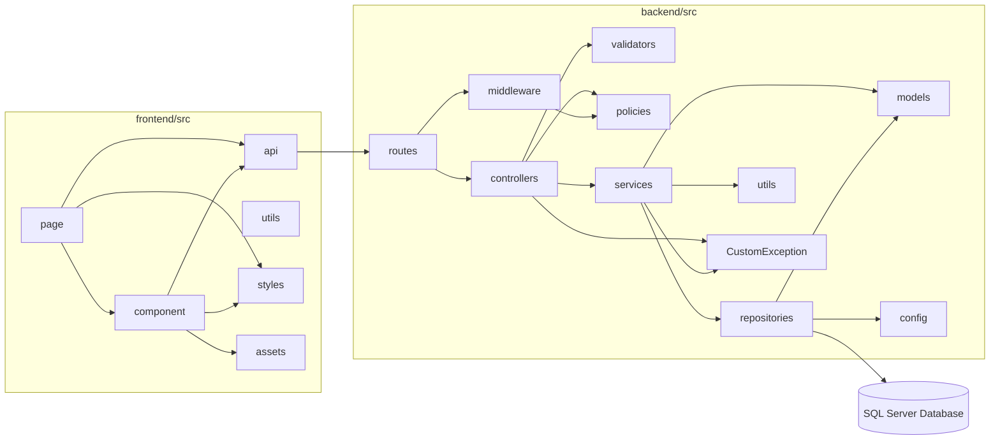
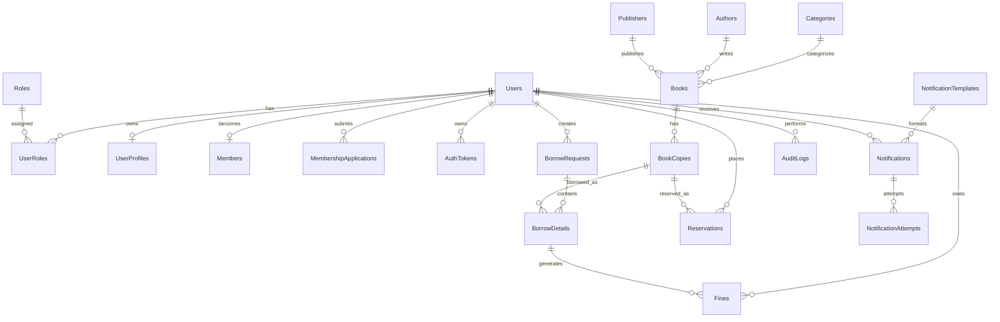

# SWP391 Library Management System

**Software Design Specification**

## Record of Changes

| Version | Date | A,M,D | In change | Change Description |
| ------- | ---- | ----- | --------- | ------------------ |
| 1.0 | 2026-06-02 | A | DungTH | FE05 Book Management specification created. |
| 1.0 | 2026-06-03 | A | DatDT | FE02 Authentication feature specification structure created. |
| 1.0 | 2026-06-03 | A | DungTH | FE11 User & Role Management feature specification structure created. |
| 1.0 | 2026-06-10 | A | DungTH | FE01 Public Browse review decisions approved. |
| 1.0 | 2026-06-10 | A | DatDT | FE02 foundation slice implemented and authentication flows ready for review. |
| 1.0 | 2026-06-10 | A | DatDT | FE03 User Profile review decisions approved. |
| 1.0 | 2026-06-10 | A | DatDT | FE04 Membership Management review decisions approved. |
| 1.0 | 2026-06-10 | A | DatDT | FE06 Inventory/Book Copy review decisions approved. |
| 1.0 | 2026-06-10 | A | NhatNHA | FE07 Borrowing backend slice ready for review. |
| 1.0 | 2026-06-10 | A | NhatNHA | FE08 Reservation backend slice ready for review. |
| 1.0 | 2026-06-10 | A | DungTH | FE09 Fine Management review decisions approved. |
| 1.0 | 2026-06-10 | A | NhatNHA | FE10 Notification backend slice ready for review. |
| 1.0 | 2026-06-10 | A | NhatNHA | FE12 Reporting backend slice ready for review. |
| 1.0 | 2026-06-20 | A | DatDT | FE03 backend and frontend avatar upload implemented. |
| 1.0 | 2026-06-20 | A | NhatNHA | FE07 frontend UI implemented and accessibility validated. |
| 1.0 | 2026-06-20 | A | NhatNHA | FE08 frontend UI implemented and accessibility validated. |
| 1.0 | 2026-06-20 | A | NhatNHA | FE12 frontend UI implemented and accessibility validated. |
| 1.0 | 2026-06-25 | A | DungTH | FE09 server-side implementation completed. |
| 1.0 | 2026-07-10 | M | NhatNHA | FE12 inventory category filter completed. |
| 1.0 | 2026-07-13 | M | NhatNHA | FE08 frontend correctness aligned with approved lifecycle. |
| 1.0 | 2026-07-13 | M | NhatNHA | FE10 hardening implemented and B7 integration closed out. |
| 1.0 | 2026-07-13 | M | NhatNHA | FE12 B7 integration and review closeout completed. |
| 1.0 | 2026-07-14 | M | NhatNHA | FE07 B7 integration and validation closeout completed. |
| 1.0 | 2026-07-15 | M | DungTH | FE01 read-only availability ownership defined. |
| 1.0 | 2026-07-15 | M | DatDT | FE02 account setup implementation and validation completed. |
| 1.0 | 2026-07-15 | M | DatDT | FE04 canonical membership contract added. |
| 1.0 | 2026-07-15 | M | DungTH | FE05 catalog ownership and deterministic contract added. |
| 1.0 | 2026-07-15 | M | DatDT | FE06 deterministic inventory contract added. |
| 1.0 | 2026-07-15 | M | NhatNHA | FE10 account setup delivery implemented and OTP security boundary approved. |
| 1.0 | 2026-07-15 | M | DungTH | FE11 account setup slice implemented and validation ready. |
| 1.0 | 2026-07-17 | M | DatDT | FE03 deterministic profile and avatar failure contracts updated. |
| 1.0 | 2026-07-18 | M | DungTH | FE01 authenticated homepage navigation updated. |
| 1.0 | 2026-07-18 | M | DatDT | FE04 member, librarian, and admin review UI integrated. |
| 1.0 | 2026-07-18 | M | DungTH | FE05 librarian book management navigation and catalog metadata timestamps updated. |
| 1.0 | 2026-07-18 | M | DatDT | FE06 navigation label clarified. |
| 1.0 | 2026-07-18 | M | NhatNHA | FE07 member and librarian borrowing workspace polished. |
| 1.0 | 2026-07-18 | M | NhatNHA | FE08 member and librarian reservation operations aligned with canonical data. |
| 1.0 | 2026-07-18 | M | DungTH | FE09 librarian fine navigation and page restored. |
| 1.0 | 2026-07-18 | M | DungTH | FE11 transactional role management, safe user reads, admin role UI, and audit log integrated. |
| 1.0 | 2026-07-19 | M | DatDT | FE02 FE11 finalization schema contract activated. |
| 1.0 | 2026-07-19 | M | DatDT | FE03 FE11 librarian column ownership activated. |
| 1.0 | 2026-07-19 | M | NhatNHA | FE10 recipient email width synchronization activated. |
| 1.0 | 2026-07-19 | M | DungTH | FE11 admin navigation permissions and finalization governance activated. |
| 1.0 | 2026-07-19 | M | DatDT | System access login and setting management screen details completed. |

***A - Added M - Modified D - Deleted**

## Table of Contents

- I. Overview
  - 1. Code Packages
  - 2. Database Design
    - a. Database Schema
    - b. Table Description
- II. Code Designs
  - 1. Authentication
    - a. Class Diagram
    - b. Class Specifications
    - c. Sequence Diagram(s)
    - d. Database queries
  - 2. Public Browse
    - a. Class Diagram
    - b. Class Specifications
    - c. Sequence Diagram(s)
    - d. Database queries
  - 3. User Profile
    - a. Class Diagram
    - b. Class Specifications
    - c. Sequence Diagram(s)
    - d. Database queries
  - 4. Membership Management
    - a. Class Diagram
    - b. Class Specifications
    - c. Sequence Diagram(s)
    - d. Database queries
  - 5. Book and Inventory Management
    - a. Class Diagram
    - b. Class Specifications
    - c. Sequence Diagram(s)
    - d. Database queries
  - 6. Borrowing and Reservation
    - a. Class Diagram
    - b. Class Specifications
    - c. Sequence Diagram(s)
    - d. Database queries
  - 7. Fine Management
    - a. Class Diagram
    - b. Class Specifications
    - c. Sequence Diagram(s)
    - d. Database queries
  - 8. Notification
    - a. Class Diagram
    - b. Class Specifications
    - c. Sequence Diagram(s)
    - d. Database queries
  - 9. User and Role Management
    - a. Class Diagram
    - b. Class Specifications
    - c. Sequence Diagram(s)
    - d. Database queries
  - 10. Reporting and Statistics
    - a. Class Diagram
    - b. Class Specifications
    - c. Sequence Diagram(s)
    - d. Database queries

# I. Overview

## 1. Code Packages

This section describes the main source-code packages used by the Library Management System. The backend is organized by Express API responsibilities, while the frontend is organized by React application layers.

### Overall Package Diagram

### Package descriptions

| No | Package | Description |
| --- | --- | --- |
| 01 | backend/src/config | Stores backend configuration for database connections, environment values, and shared runtime setup. |
| 02 | backend/src/controllers | Handles HTTP request/response logic for each REST API feature. |
| 03 | backend/src/routes | Defines Express route mappings and connects API endpoints to controllers and middleware. |
| 04 | backend/src/services | Contains business logic for authentication, books, inventory, borrowing, reservation, fines, notifications, reports, and user management. |
| 05 | backend/src/repositories | Encapsulates SQL Server data access and query execution for backend services. |
| 06 | backend/src/models | Defines backend data models and shared data structures used by services and repositories. |
| 07 | backend/src/middleware | Provides reusable Express middleware for authentication, authorization, validation, and request handling. |
| 08 | backend/src/validators | Contains input validation rules for API request payloads and parameters. |
| 09 | backend/src/policies | Defines permission and access-control policy logic used by protected backend operations. |
| 10 | backend/src/utils | Provides shared backend helper functions used across multiple modules. |
| 11 | frontend/src/api | Contains frontend API client functions for calling backend REST endpoints. |
| 12 | frontend/src/component | Contains reusable React UI components shared across pages. |
| 13 | frontend/src/page | Contains React page-level screens for member, librarian, and admin workflows. |
| 14 | frontend/src/styles | Stores shared frontend styling assets and CSS. |
| 15 | frontend/src/utils | Provides shared frontend helper functions used by UI and API layers. |

## 2. Database Design

The approved project database is SQL Server. Table names below follow the current schema in `database/Librarymanagement.sql`.

### a. Database Schema

### b. Table Description

| No | Table | Description |
| --- | --- | --- |
| 01 | Roles | Stores system roles such as ADMIN, LIBRARIAN, MEMBER, and GUEST. |
| 02 | Users | Stores login accounts, email, password hash, account status, and security timestamps. |
| 03 | UserRoles | Maps users to one or more roles. |
| 04 | UserProfiles | Stores profile details for a user, including full name, address, date of birth, and avatar URL. |
| 05 | Members | Stores the approved member projection used for borrowing and reservation eligibility. |
| 06 | MembershipApplications | Stores membership application history, review status, reviewer, and review note. |
| 07 | AuthTokens | Stores hashed authentication tokens for refresh, email verification, password reset, account setup, and OTP flows. |
| 08 | Categories | Stores book categories used by catalog and inventory features. |
| 09 | Authors | Stores book author records. |
| 10 | Publishers | Stores book publisher records. |
| 11 | Books | Stores catalog metadata including title, ISBN, category, author, publisher, status, and audit ownership. |
| 12 | BookCopies | Stores physical copy records, barcode, location, and availability status. |
| 13 | BorrowRequests | Stores borrowing request headers, requester, processing status, and approval metadata. |
| 14 | BorrowDetails | Stores individual borrowed copy lines, due dates, return dates, renewal count, and item status. |
| 15 | Reservations | Stores reservation queue records for users and book copies. |
| 16 | Fines | Stores overdue fine calculation, payment, waiver/cancel status, and collection metadata. |
| 17 | NotificationTemplates | Stores reusable notification subject/body templates. |
| 18 | Notifications | Stores queued and sent notification records, recipient email, status, source feature, and safe payload. |
| 19 | NotificationAttempts | Stores delivery attempt history for each notification. |
| 20 | AuditLogs | Stores administrative/user action audit records with target metadata and request context. |
