# SWP391 Library Management System

**Software Design Specification**

## Record of Changes

| Version | Date | A,M,D | In change | Change Description |
| ------- | ---- | ----- | --------- | ------------------ |
| 1.0 | 2026-06-02 | A | DungTH | FE05 Book Management specification created. |
| 1.0 | 2026-06-03 | A | DatDT | FE02 Authentication feature specification structure created. |
| 1.0 | 2026-06-03 | A | DungTH | FE11 User & Role Management feature specification structure created. |
| 1.0 | 2026-06-10 | A | DungTH | FE01 Public Browse review decisions approved. |
| 1.0 | 2026-06-10 | A | DatDT | FE02 foundation slice implemented and authentication flows ready for review. |
| 1.0 | 2026-06-10 | A | DatDT | FE03 User Profile review decisions approved. |
| 1.0 | 2026-06-10 | A | DatDT | FE04 Membership Management review decisions approved. |
| 1.0 | 2026-06-10 | A | DatDT | FE06 Inventory/Book Copy review decisions approved. |
| 1.0 | 2026-06-10 | A | NhatNHA | FE07 Borrowing backend slice ready for review. |
| 1.0 | 2026-06-10 | A | NhatNHA | FE08 Reservation backend slice ready for review. |
| 1.0 | 2026-06-10 | A | DungTH | FE09 Fine Management review decisions approved. |
| 1.0 | 2026-06-10 | A | NhatNHA | FE10 Notification backend slice ready for review. |
| 1.0 | 2026-06-10 | A | NhatNHA | FE12 Reporting backend slice ready for review. |
| 1.0 | 2026-06-20 | A | DatDT | FE03 backend and frontend avatar upload implemented. |
| 1.0 | 2026-06-20 | A | NhatNHA | FE07 frontend UI implemented and accessibility validated. |
| 1.0 | 2026-06-20 | A | NhatNHA | FE08 frontend UI implemented and accessibility validated. |
| 1.0 | 2026-06-20 | A | NhatNHA | FE12 frontend UI implemented and accessibility validated. |
| 1.0 | 2026-06-25 | A | DungTH | FE09 server-side implementation completed. |
| 1.0 | 2026-07-10 | M | NhatNHA | FE12 inventory category filter completed. |
| 1.0 | 2026-07-13 | M | NhatNHA | FE08 frontend correctness aligned with approved lifecycle. |
| 1.0 | 2026-07-13 | M | NhatNHA | FE10 hardening implemented and B7 integration closed out. |
| 1.0 | 2026-07-13 | M | NhatNHA | FE12 B7 integration and review closeout completed. |
| 1.0 | 2026-07-14 | M | NhatNHA | FE07 B7 integration and validation closeout completed. |
| 1.0 | 2026-07-15 | M | DungTH | FE01 read-only availability ownership defined. |
| 1.0 | 2026-07-15 | M | DatDT | FE02 account setup implementation and validation completed. |
| 1.0 | 2026-07-15 | M | DatDT | FE04 canonical membership contract added. |
| 1.0 | 2026-07-15 | M | DungTH | FE05 catalog ownership and deterministic contract added. |
| 1.0 | 2026-07-15 | M | DatDT | FE06 deterministic inventory contract added. |
| 1.0 | 2026-07-15 | M | NhatNHA | FE10 account setup delivery implemented and OTP security boundary approved. |
| 1.0 | 2026-07-15 | M | DungTH | FE11 account setup slice implemented and validation ready. |
| 1.0 | 2026-07-17 | M | DatDT | FE03 deterministic profile and avatar failure contracts updated. |
| 1.0 | 2026-07-18 | M | DungTH | FE01 authenticated homepage navigation updated. |
| 1.0 | 2026-07-18 | M | DatDT | FE04 member, librarian, and admin review UI integrated. |
| 1.0 | 2026-07-18 | M | DungTH | FE05 librarian book management navigation and catalog metadata timestamps updated. |
| 1.0 | 2026-07-18 | M | DatDT | FE06 navigation label clarified. |
| 1.0 | 2026-07-18 | M | NhatNHA | FE07 member and librarian borrowing workspace polished. |
| 1.0 | 2026-07-18 | M | NhatNHA | FE08 member and librarian reservation operations aligned with canonical data. |
| 1.0 | 2026-07-18 | M | DungTH | FE09 librarian fine navigation and page restored. |
| 1.0 | 2026-07-18 | M | DungTH | FE11 transactional role management, safe user reads, admin role UI, and audit log integrated. |
| 1.0 | 2026-07-19 | M | DatDT | FE02 FE11 finalization schema contract activated. |
| 1.0 | 2026-07-19 | M | DatDT | FE03 FE11 librarian column ownership activated. |
| 1.0 | 2026-07-19 | M | NhatNHA | FE10 recipient email width synchronization activated. |
| 1.0 | 2026-07-19 | M | DungTH | FE11 admin navigation permissions and finalization governance activated. |
| 1.0 | 2026-07-19 | M | DatDT | System access login and setting management screen details completed. |

***A - Added M - Modified D - Deleted**

## Table of Contents

- I. Overview
  - 1. Code Packages
  - 2. Database Design
    - a. Database Schema
    - b. Table Description
- II. Code Designs
  - 1. Authentication
    - a. Class Diagram
    - b. Class Specifications
    - c. Sequence Diagram(s)
    - d. Database queries
  - 2. Public Browse
    - a. Class Diagram
    - b. Class Specifications
    - c. Sequence Diagram(s)
    - d. Database queries
  - 3. User Profile
    - a. Class Diagram
    - b. Class Specifications
    - c. Sequence Diagram(s)
    - d. Database queries
  - 4. Membership Management
    - a. Class Diagram
    - b. Class Specifications
    - c. Sequence Diagram(s)
    - d. Database queries
  - 5. Book and Inventory Management
    - a. Class Diagram
    - b. Class Specifications
    - c. Sequence Diagram(s)
    - d. Database queries
  - 6. Borrowing and Reservation
    - a. Class Diagram
    - b. Class Specifications
    - c. Sequence Diagram(s)
    - d. Database queries
  - 7. Fine Management
    - a. Class Diagram
    - b. Class Specifications
    - c. Sequence Diagram(s)
    - d. Database queries
  - 8. Notification
    - a. Class Diagram
    - b. Class Specifications
    - c. Sequence Diagram(s)
    - d. Database queries
  - 9. User and Role Management
    - a. Class Diagram
    - b. Class Specifications
    - c. Sequence Diagram(s)
    - d. Database queries
  - 10. Reporting and Statistics
    - a. Class Diagram
    - b. Class Specifications
    - c. Sequence Diagram(s)
    - d. Database queries

# I. Overview

## 1. Code Packages

This section describes the main source-code packages used by the Library Management System. The backend is organized by Express API responsibilities, while the frontend is organized by React/Vite application layers using Bootstrap, Material UI, and lucide-react UI dependencies.

### Overall Package Diagram

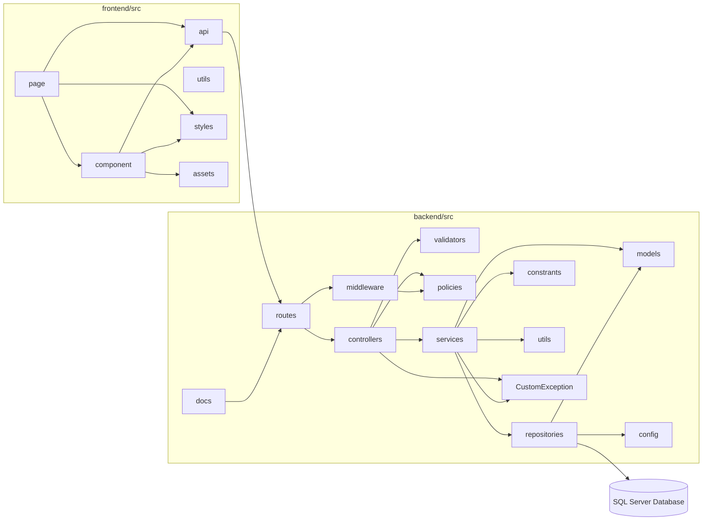

### Package descriptions

| No | Package | Description |
| --- | --- | --- |
| 01 | backend/src/config | Stores backend configuration for database connections, environment values, and shared runtime setup. |
| 02 | backend/src/controllers | Handles HTTP request/response logic for each REST API feature. |
| 03 | backend/src/routes | Defines Express route mappings and connects API endpoints to controllers and middleware. |
| 04 | backend/src/services | Contains business logic for authentication, books, inventory, borrowing, reservation, fines, notifications, reports, and user management. |
| 05 | backend/src/repositories | Encapsulates SQL Server data access and query execution for backend services. |
| 06 | backend/src/models | Defines backend data models and shared data structures used by services and repositories. |
| 07 | backend/src/middleware | Provides reusable Express middleware for authentication, authorization, validation, and request handling. |
| 08 | backend/src/validators | Contains input validation rules for API request payloads and parameters. |
| 09 | backend/src/policies | Defines permission and access-control policy logic used by protected backend operations. |
| 10 | backend/src/utils | Provides shared backend helper functions used across multiple modules. |
| 11 | backend/src/constrants | Stores shared backend constants; the current repository directory name is `constrants`. |
| 12 | backend/src/docs | Stores machine-readable API documentation, including `openapi.yaml`. |
| 13 | frontend/src/api | Contains frontend API client functions for calling backend REST endpoints. |
| 14 | frontend/src/component | Contains reusable React UI components shared across pages. |
| 15 | frontend/src/page | Contains React page-level screens for member, librarian, and admin workflows. |
| 16 | frontend/src/styles | Stores shared frontend styling assets and CSS. |
| 17 | frontend/src/utils | Provides shared frontend helper functions used by UI and API layers. |
| 18 | frontend/src/assets | Stores frontend static assets used by the React application. |

## 2. Database Design

The approved project database is SQL Server. Table names below follow the current schema in `database/Librarymanagement.sql`.

### a. Database Schema

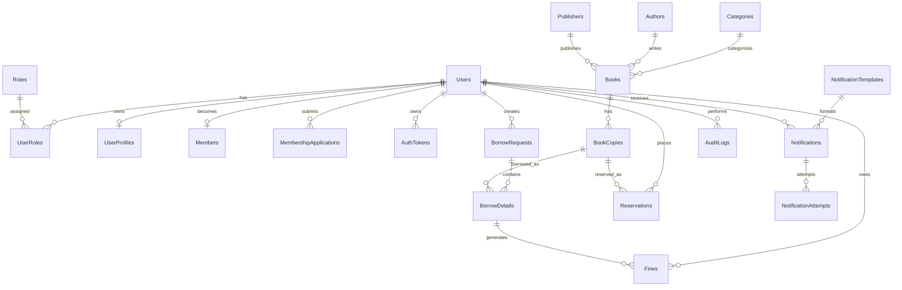

### b. Table Description

| No | Table | Description |
| --- | --- | --- |
| 01 | Roles | Stores role names used by authorization (`ADMIN`, `LIBRARIAN`, `MEMBER`, and compatibility `GUEST`). Guest remains an unauthenticated actor for public flows, not a normal login workspace. |
| 02 | Users | Stores login accounts, email, password hash, account status, security timestamps, and deactivation timestamp. |
| 03 | UserRoles | Maps users to one or more roles. |
| 04 | UserProfiles | Stores profile details for a user, including full name, address, date of birth, avatar URL, and FE11 librarian-only department/specialization fields. |
| 05 | Members | Stores the approved member projection used for borrowing and reservation eligibility. |
| 06 | MembershipApplications | Stores membership application history, review status, reviewer, and review note. |
| 07 | AuthTokens | Stores hashed authentication tokens for refresh, email verification, password reset, account setup, and OTP flows. |
| 08 | Categories | Stores book categories used by catalog and inventory features. |
| 09 | Authors | Stores book author records. |
| 10 | Publishers | Stores book publisher records. |
| 11 | Books | Stores catalog metadata including title, ISBN, category, author, publisher, status, audit ownership, and `RowVersion` for `If-Match` concurrency. |
| 12 | BookCopies | Stores physical copy records, barcode, location, availability status, and `Version` rowversion for copy mutation concurrency. |
| 13 | BorrowRequests | Stores borrowing request headers, requester, processing status, and approval metadata. |
| 14 | BorrowDetails | Stores individual borrowed copy lines, due dates, return dates, renewal count, and item status. |
| 15 | Reservations | Stores reservation queue records for users and book copies. |
| 16 | Fines | Stores overdue fine calculation, payment, waiver/cancel status, and collection metadata. |
| 17 | NotificationTemplates | Stores reusable notification subject/body templates. |
| 18 | Notifications | Stores queued and sent notification records, recipient email, status, source feature, and safe payload. |
| 19 | NotificationAttempts | Stores delivery attempt history for each notification. |
| 20 | AuditLogs | Stores administrative/user action audit records with target metadata and request context. |

# II. Code Designs

The following sections describe the backend-centered design for the main Library Management System features. Each feature follows the same implementation pattern: route/controller receives the REST request, service enforces business rules, repository executes parameterized SQL Server queries, and the frontend calls the API through `frontend/src/api`.

## 1. Authentication

This feature supports registration, email verification, login, token refresh, logout, password change, password reset, account setup, and current-user lookup.

### a. Class Diagram

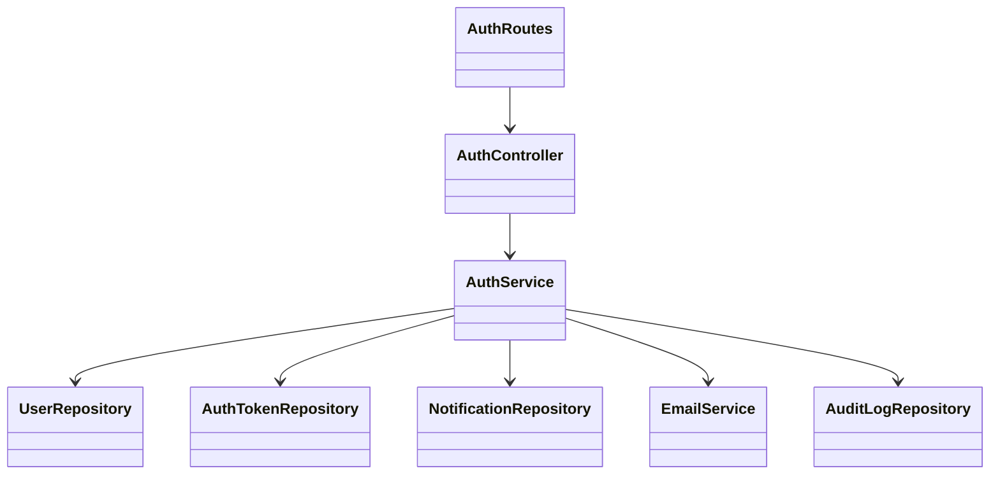

### b. Class Specifications

**AuthController Class**

| No | Method | Description |
| --- | --- | --- |
| 01 | register(req, res, next) | Accepts registration input, passes request context to `AuthService.register`, returns created account response. |
| 02 | verifyEmail(req, res, next) | Accepts verification token or OTP, delegates validation and account activation to the service. |
| 03 | resendVerification(req, res, next) | Requests a new email verification OTP for an unverified account. |
| 04 | login(req, res, next) | Validates credentials through the service and returns access/refresh tokens. |
| 05 | refreshToken(req, res, next) | Exchanges a valid refresh token for a new access token. |
| 06 | logout(req, res, next) | Revokes the submitted refresh/session token. |
| 07 | changePassword(req, res, next) | Changes password for the authenticated user after current-password validation. |
| 08 | requestChangePasswordOtp(req, res, next) | Sends a change-password OTP for the authenticated user. |
| 09 | confirmChangePassword(req, res, next) | Confirms the change-password OTP and persists the new password hash. |
| 10 | forgotPassword(req, res, next) | Creates a password reset token or OTP and sends reset instructions. |
| 11 | resetPassword(req, res, next) | Validates reset token/OTP or account-setup token and persists the new password hash. |
| 12 | me(req, res, next) | Returns the authenticated user's safe profile and roles. |

**AuthService Class**

| No | Method | Description |
| --- | --- | --- |
| 01 | register(input, context) | Normalizes email/username, validates password, checks duplicates, creates user/profile/member-related defaults, stores a verification OTP hash, and requests FE10 delivery through the FE02-bound notification requester. |
| 02 | verifyEmail(input, context) | Finds active token, checks expiry, marks token used, marks user email verified, writes audit log. |
| 03 | login(input, context) | Finds account by email/username, checks status/lock, verifies password, resets failed-login count, creates refresh token, signs JWT access token. |
| 04 | refreshToken(input, context) | Hashes refresh token, loads active session token, validates expiry and user status, returns a new access token. |
| 05 | logout(input, context) | Revokes one refresh token or active user tokens and records audit data. |
| 06 | changePassword(input, context) | Validates current and new password, updates password hash, revokes active tokens. |
| 07 | requestChangePasswordOtp(input, context) | Validates the authenticated user and sends a one-time OTP for password change confirmation. |
| 08 | confirmChangePassword(input, context) | Validates the OTP, applies password policy, updates password, marks token used, and revokes active sessions. |
| 09 | forgotPassword(input, context) | Creates a reset OTP for an eligible active account and requests FE10 delivery without exposing account existence. |
| 10 | resetPassword(input, context) | Validates reset token/OTP or account-setup token, applies password policy, updates password, marks token used, revokes active sessions. |
| 11 | authenticateToken(token) | Verifies JWT, validates active session token, loads safe user and roles. |

**UserRepository Class**

| No | Method | Description |
| --- | --- | --- |
| 01 | findByEmail(email) | Selects a user row by email. |
| 02 | findByUsername(username) | Selects a user row by username. |
| 03 | findByEmailOrUsername(identifier) | Selects a user for login using email or username. |
| 04 | createRegisteredUser(payload) | Inserts `Users` and `UserProfiles` records for self-registration. |
| 05 | markEmailVerified(userId) | Updates `Users.EmailVerifiedAt`. |
| 06 | updatePassword(userId, passwordHash) | Persists a new password hash. |
| 07 | getRolesByUserId(userId) | Reads role names from `UserRoles` and `Roles`. |

**AuthTokenRepository Class**

| No | Method | Description |
| --- | --- | --- |
| 01 | createToken(payload) | Inserts hashed token metadata into `AuthTokens`. |
| 02 | findActiveTokenByHash(tokenType, tokenHash) | Selects the newest unused, non-revoked token by hash and type. |
| 03 | markTokenUsed(tokenId) | Sets `UsedAt` when a one-time token is consumed. |
| 04 | revokeActiveTokensForUser(userId) | Revokes active tokens for a user after sensitive account changes. |

### c. Sequence Diagram(s)

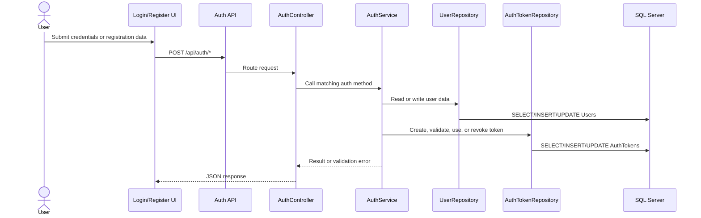

### d. Database Queries

```sql
SELECT TOP 1 * FROM Users WHERE LOWER(Email) = LOWER(@Email);
SELECT TOP 1 * FROM Users WHERE LOWER(Email) = LOWER(@Identifier) OR LOWER(Username) = LOWER(@Identifier);
INSERT INTO Users (Username, Email, PasswordHash, Phone, Status) VALUES (@Username, @Email, @PasswordHash, @Phone, @Status);
INSERT INTO UserProfiles (UserId, FullName) VALUES (@UserId, @FullName);
SELECT r.RoleName FROM UserRoles ur INNER JOIN Roles r ON ur.RoleId = r.RoleId WHERE ur.UserId = @UserId;
INSERT INTO AuthTokens (UserId, TokenType, TokenHash, ExpiresAt, CreatedByIp) VALUES (@UserId, @TokenType, @TokenHash, @ExpiresAt, @CreatedByIp);
SELECT TOP 1 * FROM AuthTokens WHERE TokenType = @TokenType AND TokenHash = @TokenHash AND UsedAt IS NULL AND RevokedAt IS NULL ORDER BY CreatedAt DESC;
UPDATE AuthTokens SET UsedAt = COALESCE(UsedAt, GETDATE()) WHERE TokenId = @TokenId;
UPDATE AuthTokens SET RevokedAt = COALESCE(RevokedAt, GETDATE()) WHERE UserId = @UserId AND UsedAt IS NULL AND RevokedAt IS NULL;
UPDATE Users SET EmailVerifiedAt = COALESCE(EmailVerifiedAt, GETDATE()), UpdatedAt = GETDATE() WHERE UserId = @UserId;
UPDATE Users SET PasswordHash = @PasswordHash, UpdatedAt = GETDATE() WHERE UserId = @UserId;
```

## 2. Public Browse

This feature supports public catalog browsing, homepage book lists, metadata loading, and book detail viewing.

### a. Class Diagram

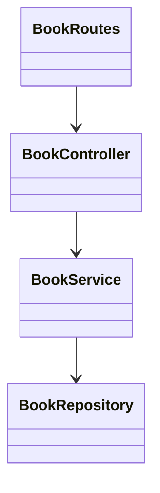

### b. Class Specifications

**BookController Class**

| No | Method | Description |
| --- | --- | --- |
| 01 | getHomeBooks(req, res, next) | Reads public filters and returns active public catalog books. |
| 02 | getBookById(req, res, next) | Loads one book by id; public callers see only active public-safe fields, while staff can view management fields. |
| 03 | getMetadata(req, res, next) | Returns category, author, and publisher metadata. |

**BookService Class**

| No | Method | Description |
| --- | --- | --- |
| 01 | getHomeBooks(filters) | Returns active books for homepage/catalog display. |
| 02 | getBookById(bookId, options) | Validates id and returns a book detail or not-found error. |
| 03 | getMetadata() | Loads lookup values used by filters and forms. |
| 04 | getCategories() | Loads active categories for browsing. |

**BookRepository Class**

| No | Method | Description |
| --- | --- | --- |
| 01 | getHomeBooks(filters) | Selects active books with category, author, publisher, copy counts, and `RowVersion`. |
| 02 | getBookById(bookId) | Selects one book detail with metadata, copy counts, and `RowVersion`. |
| 03 | getMetadata() | Selects active categories, authors, and publishers. |

### c. Sequence Diagram(s)

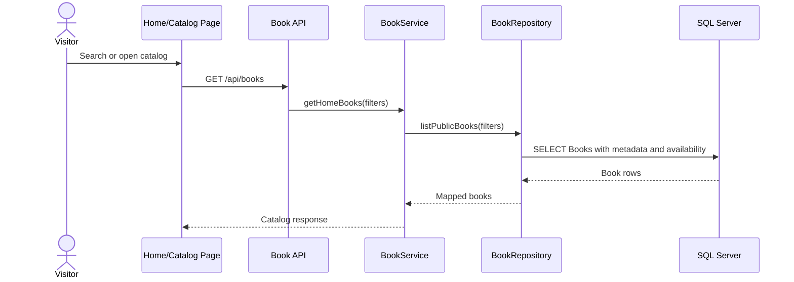

### d. Database Queries

```sql
SELECT b.BookId, b.Title, b.ISBN, c.CategoryName, a.AuthorName, p.PublisherName,
       b.RowVersion, COUNT(bc.CopyId) AS totalCopies,
       SUM(CASE WHEN bc.Status = 'AVAILABLE' THEN 1 ELSE 0 END) AS availableCopies
FROM Books b
LEFT JOIN Categories c ON b.CategoryId = c.CategoryId
LEFT JOIN Authors a ON b.AuthorId = a.AuthorId
LEFT JOIN Publishers p ON b.PublisherId = p.PublisherId
LEFT JOIN BookCopies bc ON b.BookId = bc.BookId
WHERE b.Status = 'ACTIVE'
GROUP BY b.BookId, b.Title, b.ISBN, c.CategoryName, a.AuthorName, p.PublisherName, b.RowVersion;
SELECT * FROM Categories WHERE Status = 'ACTIVE' ORDER BY CategoryName;
SELECT * FROM Authors WHERE Status = 'ACTIVE' ORDER BY AuthorName;
SELECT * FROM Publishers WHERE Status = 'ACTIVE' ORDER BY PublisherName;
```

## 3. User Profile

This feature supports viewing and updating the authenticated user's profile and avatar.

### a. Class Diagram

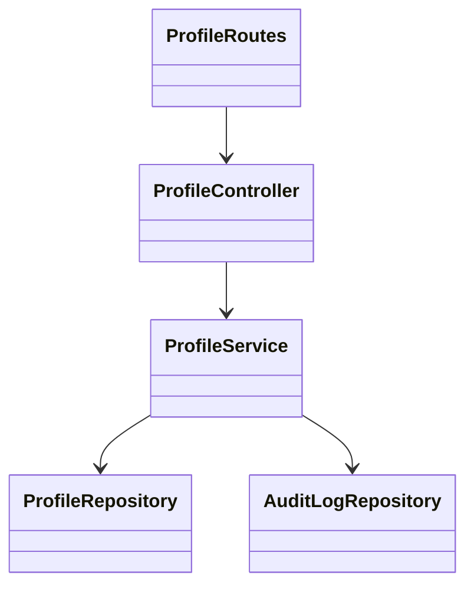

### b. Class Specifications

**ProfileController Class**

| No | Method | Description |
| --- | --- | --- |
| 01 | getMyProfile(req, res, next) | Returns the authenticated user's profile. |
| 02 | updateMyProfile(req, res, next) | Accepts editable profile fields and delegates validation/update. |
| 03 | updateMyAvatar(req, res, next) | Accepts uploaded avatar file metadata and stores avatar URL. |

**ProfileService Class**

| No | Method | Description |
| --- | --- | --- |
| 01 | getMyProfile(userId) | Loads profile and user account data for the current user. |
| 02 | updateMyProfile(userId, input, context) | Validates profile fields, updates allowed columns, writes audit log. |
| 03 | updateMyAvatar(userId, file, context) | Validates upload, stores avatar path, updates `AvatarUrl`, writes audit log. |

**ProfileRepository Class**

| No | Method | Description |
| --- | --- | --- |
| 01 | findByUserId(userId) | Selects profile by user id. |
| 02 | updateProfile(userId, updates) | Updates editable profile columns. |
| 03 | updateAvatar(userId, avatarUrl) | Updates avatar URL and timestamp. |

### c. Sequence Diagram(s)

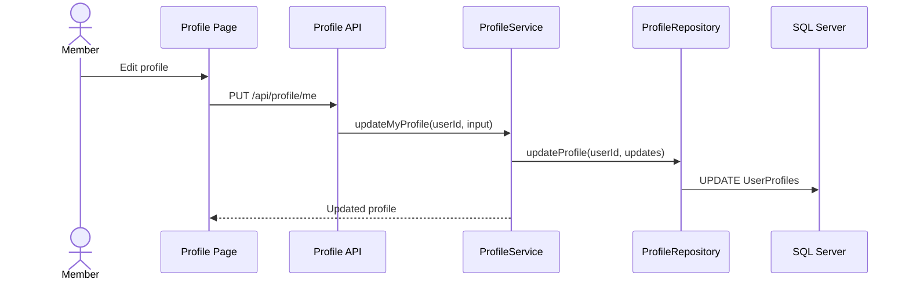

### d. Database Queries

```sql
SELECT u.UserId, u.Email, u.Phone, up.FullName, up.Address, up.DateOfBirth, up.AvatarUrl
FROM Users u LEFT JOIN UserProfiles up ON u.UserId = up.UserId
WHERE u.UserId = @UserId;
UPDATE UserProfiles SET FullName = @FullName, Address = @Address, DateOfBirth = @DateOfBirth, UpdatedAt = GETDATE() WHERE UserId = @UserId;
UPDATE UserProfiles SET AvatarUrl = @AvatarUrl, UpdatedAt = GETDATE() WHERE UserId = @UserId;
INSERT INTO AuditLogs (UserId, Action, TargetType, TargetId, Metadata, IpAddress, UserAgent) VALUES (@UserId, @Action, @TargetType, @TargetId, @Metadata, @IpAddress, @UserAgent);
```

## 4. Membership Management

This feature supports member application submission, status lookup, librarian/admin review, approval, rejection, and membership result notification.

### a. Class Diagram

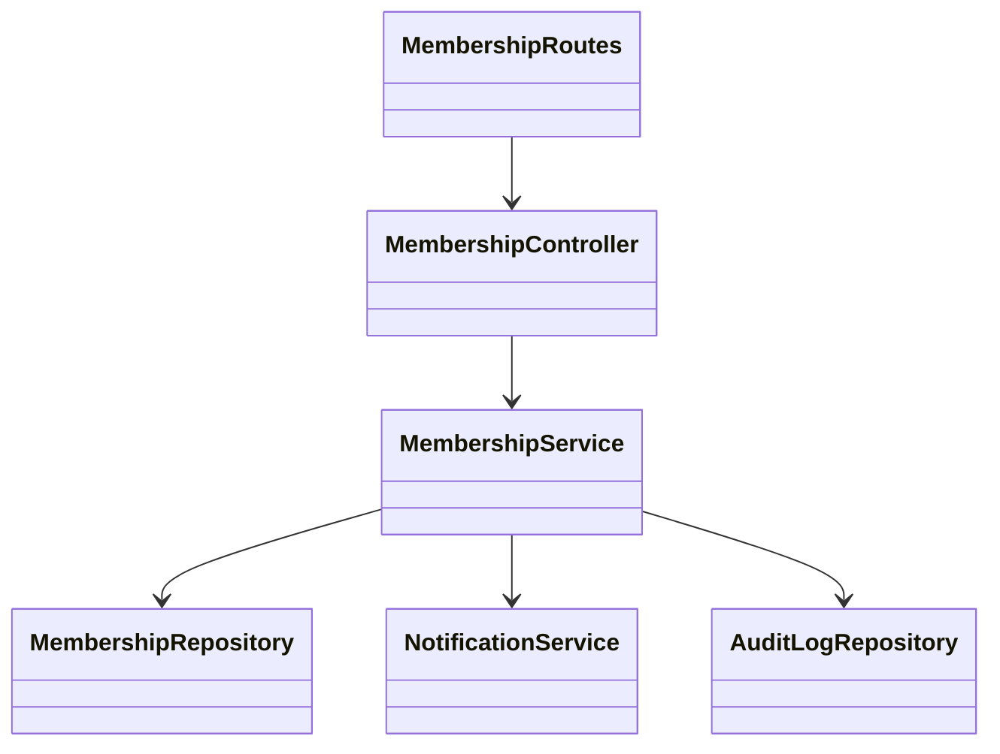

### b. Class Specifications

**MembershipController Class**

| No | Method | Description |
| --- | --- | --- |
| 01 | apply(req, res, next) | Creates a membership application for the authenticated user. |
| 02 | getMyStatus(req, res, next) | Returns current membership and latest application status. |
| 03 | listApplications(req, res, next) | Returns review queue for staff/admin users. |
| 04 | approve(req, res, next) | Approves an application and activates the member projection. |
| 05 | reject(req, res, next) | Rejects an application with review reason. |

**MembershipService Class**

| No | Method | Description |
| --- | --- | --- |
| 01 | apply(actor, context) | Ensures no duplicate pending/approved membership and inserts a pending application. |
| 02 | getMyStatus(actor) | Reads member status and latest application for the current user. |
| 03 | listApplications(filters, actor) | Checks reviewer role and loads filtered applications. |
| 04 | approve(applicationId, actor, context) | Updates application/member status, reviewer fields, audit log, and notification. |
| 05 | reject(applicationId, reason, actor, context) | Updates rejected status with note, audit log, and notification. |

**MembershipRepository Class**

| No | Method | Description |
| --- | --- | --- |
| 01 | createApplication(userId) | Inserts a pending membership application. |
| 02 | findLatestByUserId(userId) | Selects latest application for a user. |
| 03 | listApplications(filters) | Selects applications with user/profile details. |
| 04 | approveApplication(applicationId, reviewerId) | Updates application to approved and upserts `Members`. |
| 05 | rejectApplication(applicationId, reviewerId, reason) | Updates application to rejected with review note. |

### c. Sequence Diagram(s)

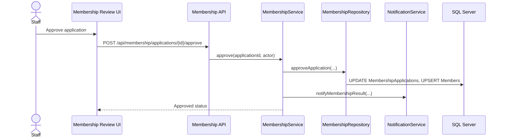

### d. Database Queries

```sql
INSERT INTO MembershipApplications (UserId, Status) VALUES (@UserId, 'PENDING');
SELECT TOP 1 * FROM MembershipApplications WHERE UserId = @UserId ORDER BY AppliedAt DESC;
SELECT ma.*, u.Email, up.FullName FROM MembershipApplications ma INNER JOIN Users u ON ma.UserId = u.UserId LEFT JOIN UserProfiles up ON u.UserId = up.UserId WHERE ma.Status = @Status;
UPDATE MembershipApplications SET Status = 'APPROVED', ApprovedAt = GETDATE(), ReviewedBy = @ReviewedBy, ReviewNote = @ReviewNote WHERE ApplicationId = @ApplicationId;
MERGE Members AS target USING (SELECT @UserId AS UserId) AS source ON target.UserId = source.UserId WHEN MATCHED THEN UPDATE SET Status = 'APPROVED', ApprovedAt = GETDATE(), ApprovedBy = @ReviewedBy, UpdatedAt = GETDATE() WHEN NOT MATCHED THEN INSERT (UserId, Status, ApprovedAt, ApprovedBy) VALUES (@UserId, 'APPROVED', GETDATE(), @ReviewedBy);
UPDATE MembershipApplications SET Status = 'REJECTED', ReviewedBy = @ReviewedBy, ReviewNote = @ReviewNote WHERE ApplicationId = @ApplicationId;
```

## 5. Book and Inventory Management

This feature supports librarian/admin book catalog management and physical copy inventory management.

### a. Class Diagram

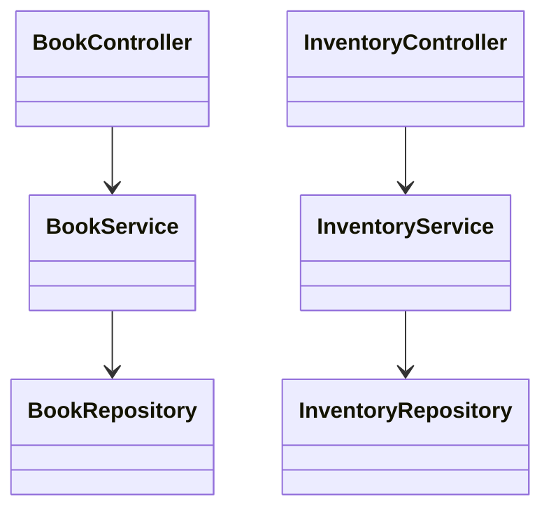

### b. Class Specifications

**BookService Class**

| No | Method | Description |
| --- | --- | --- |
| 01 | getManagementBooks(filters) | Loads books for librarian/admin management with filters. |
| 02 | createBook(body, actorUserId) | Validates references and ISBN uniqueness, inserts a book. |
| 03 | updateBook(bookId, body, actorUserId, ifMatch) | Validates editable fields and updates catalog metadata when `If-Match` matches `Books.RowVersion`. |
| 04 | deactivateBook(bookId, body, actorUserId, ifMatch) | Marks a book inactive with a required reason and matching `If-Match`. |
| 05 | reactivateBook(bookId, body, actorUserId, ifMatch) | Restores inactive book to active with a required reason and matching `If-Match`. |

**InventoryService Class**

| No | Method | Description |
| --- | --- | --- |
| 01 | listInventory(filters, actor) | Lists physical copies with book metadata. |
| 02 | getCopy(copyId, actor) | Loads one copy by id. |
| 03 | createCopy(bookId, input, actor, context) | Validates book/barcode and inserts a copy. |
| 04 | updateCopy(copyId, input, actor, context, ifMatch) | Updates barcode/location for a copy when `If-Match` matches `BookCopies.Version`. |
| 05 | updateCopyStatus(copyId, input, actor, context, ifMatch) | Updates copy status after `If-Match`, active borrowing/reservation, and parent-book checks pass. |
| 06 | deactivateCopy(copyId, actor, context, ifMatch) | Soft-deactivates an unused copy with a matching `If-Match`. |

**BookRepository / InventoryRepository Classes**

| No | Method | Description |
| --- | --- | --- |
| 01 | insert/update/select book records | Executes parameterized SQL against `Books`, `Categories`, `Authors`, and `Publishers`. |
| 02 | insert/update/select copy records | Executes parameterized SQL against `BookCopies` and joins `Books`. |

### c. Sequence Diagram(s)

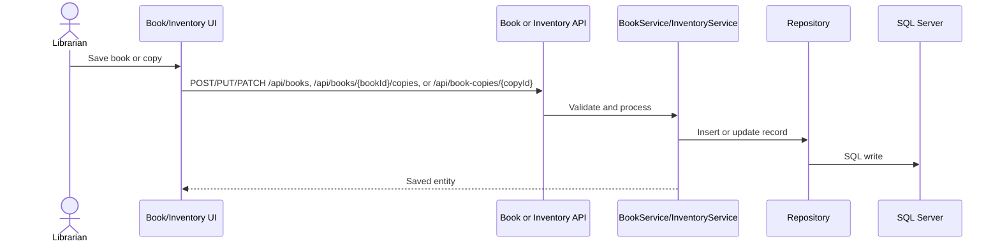

### d. Database Queries

```sql
INSERT INTO Books (Title, ISBN, CategoryId, AuthorId, PublisherId, PublishYear, Description, CoverUrl, Rating, Pages, CreatedBy) VALUES (@Title, @ISBN, @CategoryId, @AuthorId, @PublisherId, @PublishYear, @Description, @CoverUrl, @Rating, @Pages, @CreatedBy);
UPDATE Books SET Title = @Title, ISBN = @ISBN, CategoryId = @CategoryId, AuthorId = @AuthorId, PublisherId = @PublisherId, PublishYear = @PublishYear, Description = @Description, CoverUrl = @CoverUrl, Rating = @Rating, Pages = @Pages, UpdatedBy = @UpdatedBy, UpdatedAt = GETDATE() WHERE BookId = @BookId AND RowVersion = @ExpectedRowVersion;
UPDATE Books SET Status = 'INACTIVE', UpdatedBy = @UpdatedBy, UpdatedAt = GETDATE() WHERE BookId = @BookId AND RowVersion = @ExpectedRowVersion;
UPDATE Books SET Status = 'ACTIVE', UpdatedBy = @UpdatedBy, UpdatedAt = GETDATE() WHERE BookId = @BookId AND RowVersion = @ExpectedRowVersion;
INSERT INTO BookCopies (BookId, Barcode, Status, Location) VALUES (@BookId, @Barcode, @Status, @Location);
UPDATE BookCopies SET Barcode = @Barcode, Location = @Location, UpdatedAt = GETDATE() WHERE CopyId = @CopyId AND Version = @ExpectedVersion;
UPDATE BookCopies SET Status = @Status, UpdatedAt = GETDATE() WHERE CopyId = @CopyId AND Version = @ExpectedVersion;
SELECT bc.*, bc.Version, b.Title FROM BookCopies bc INNER JOIN Books b ON bc.BookId = b.BookId WHERE bc.CopyId = @CopyId;
```

## 6. Borrowing and Reservation

This feature supports member borrow requests, staff approval/rejection, returns, renewals, reservation creation, queue processing, holds, and expiration.

### a. Class Diagram

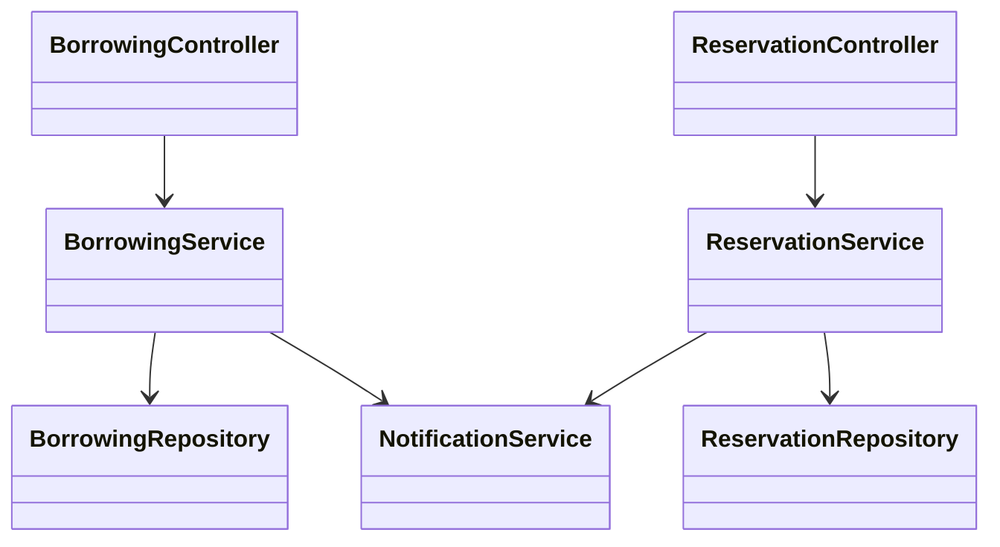

### b. Class Specifications

**BorrowingService Class**

| No | Method | Description |
| --- | --- | --- |
| 01 | createBorrowRequest(input, actor, context) | Checks membership, blockers, copy availability, borrow limit, then creates request/detail rows. |
| 02 | listMyBorrowRequests(filters, actor) | Lists the current member's borrowing requests. |
| 03 | listBorrowRequests(filters, actor) | Lists staff review queue. |
| 04 | approveBorrowRequest(requestId, input, actor, context) | Approves request, sets borrow/due dates, marks copies borrowed, sends notification. |
| 05 | rejectBorrowRequest(requestId, input, actor, context) | Rejects pending request and writes audit log. |
| 06 | returnBorrowDetail(borrowDetailId, input, actor, context) | Updates detail return state and copy status, then triggers fine calculation when needed. |
| 07 | renewBorrowDetail(borrowDetailId, input, actor, context) | Extends due date when renewal rules allow it. |

**ReservationService Class**

| No | Method | Description |
| --- | --- | --- |
| 01 | createReservation(input, actor, context) | Checks member eligibility and inserts reservation for a copy. |
| 02 | listMyReservations(filters, actor) | Lists reservations for the current member. |
| 03 | cancelReservation(reservationId, input, actor, context) | Cancels active reservation. |
| 04 | listReservations(filters, actor) | Lists reservation queue for staff. |
| 05 | processReservation(reservationId, input, actor, context) | Holds, fulfills, cancels, or expires a reservation based on staff action. |
| 06 | processQueue(input, actor, context) | Promotes the next eligible reservation in queue. |

**BorrowingRepository / ReservationRepository Classes**

| No | Method | Description |
| --- | --- | --- |
| 01 | create request/detail/reservation records | Inserts `BorrowRequests`, `BorrowDetails`, and `Reservations`. |
| 02 | update lifecycle state | Updates request/detail/copy/reservation status columns. |
| 03 | list by filters | Selects rows with user, book, and copy joins for UI display. |

### c. Sequence Diagram(s)

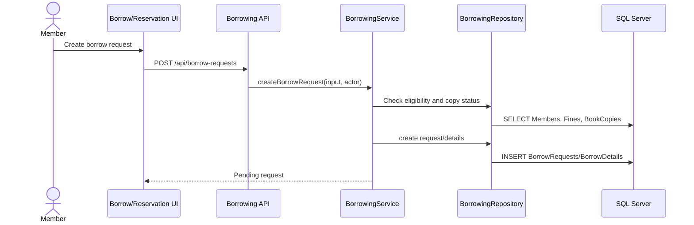

### d. Database Queries

```sql
SELECT * FROM Members WHERE UserId = @UserId AND Status = 'APPROVED';
SELECT * FROM BookCopies WHERE CopyId IN (@CopyIds) AND Status = 'AVAILABLE';
INSERT INTO BorrowRequests (UserId, Status, CreatedBy) VALUES (@UserId, 'PENDING', @CreatedBy);
INSERT INTO BorrowDetails (RequestId, CopyId, Status) VALUES (@RequestId, @CopyId, 'REQUESTED');
UPDATE BorrowRequests SET Status = 'APPROVED', ApprovedBy = @ApprovedBy, ApprovedAt = GETDATE(), UpdatedAt = GETDATE() WHERE RequestId = @RequestId;
UPDATE BorrowDetails SET BorrowDate = @BorrowDate, DueDate = @DueDate, Status = 'BORROWED', UpdatedAt = GETDATE() WHERE RequestId = @RequestId;
UPDATE BookCopies SET Status = 'BORROWED', UpdatedAt = GETDATE() WHERE CopyId = @CopyId;
UPDATE BorrowDetails SET ReturnDate = @ReturnDate, Status = @Status, UpdatedAt = GETDATE() WHERE BorrowDetailId = @BorrowDetailId;
INSERT INTO Reservations (UserId, CopyId, QueuePosition, Status) VALUES (@UserId, @CopyId, @QueuePosition, 'ACTIVE');
UPDATE Reservations SET Status = @Status, UpdatedAt = GETDATE() WHERE ReservationId = @ReservationId;
```

## 7. Fine Management

This feature supports overdue fine calculation, member fine viewing, Librarian/Admin full offline collection or paid marking, and Admin-only waiver/cancellation.

### a. Class Diagram

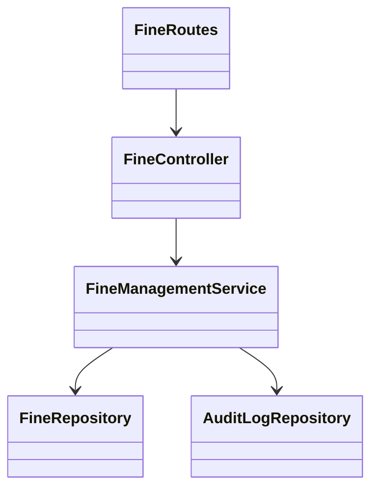

### b. Class Specifications

**FineController Class**

| No | Method | Description |
| --- | --- | --- |
| 01 | calculateFine(req, res, next) | Requests fine calculation for a borrow detail. |
| 02 | listMyFines(req, res, next) | Returns fines for the authenticated member. |
| 03 | listFines(req, res, next) | Returns staff fine list. |
| 04 | getFine(req, res, next) | Returns one fine detail. |
| 05 | recordCollection(req, res, next) | Records one full offline collection; client-supplied partial amounts are rejected. |
| 06 | waiveFine(req, res, next) | Waives an unpaid fine with an Admin role and required reason. |
| 07 | cancelFine(req, res, next) | Cancels an unpaid fine with an Admin role and required reason. |

**FineManagementService Class**

| No | Method | Description |
| --- | --- | --- |
| 01 | calculateFine(input, actor, context) | Calculates overdue days and amount, avoids duplicate active fine records. |
| 02 | listMyFines(filters, actor) | Loads current member fines only. |
| 03 | listFines(filters, actor) | Loads staff-managed fine list. |
| 04 | recordCollection(fineId, input, actor, context) | Sets `PaidAmount = Amount`, payment method, paid timestamp, collector, and audit log. |
| 05 | waiveFine(fineId, input, actor, context) | Marks fine waived only for Admin with a valid reason. |
| 06 | cancelFine(fineId, input, actor, context) | Marks fine cancelled only for Admin with a valid reason. |

**FineRepository Class**

| No | Method | Description |
| --- | --- | --- |
| 01 | findByBorrowDetailId(borrowDetailId) | Finds an existing fine for a borrow detail. |
| 02 | createFine(payload) | Inserts calculated fine. |
| 03 | recordCollection(payload) / markPaid(payload) | Updates full payment metadata and `PAID` status. |
| 04 | resolveFine(fineId, status) | Updates Admin-only waive/cancel terminal status. |

### c. Sequence Diagram(s)

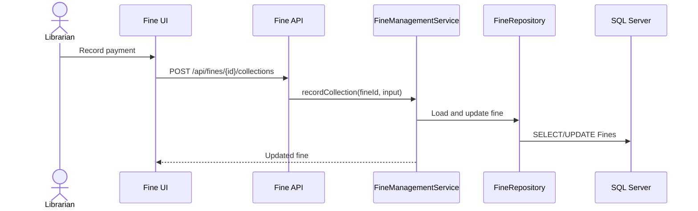

### d. Database Queries

```sql
SELECT bd.*, br.UserId FROM BorrowDetails bd INNER JOIN BorrowRequests br ON bd.RequestId = br.RequestId WHERE bd.BorrowDetailId = @BorrowDetailId;
SELECT TOP 1 * FROM Fines WHERE BorrowDetailId = @BorrowDetailId AND Status IN ('UNPAID', 'PAID');
INSERT INTO Fines (UserId, BorrowDetailId, OverdueDays, RatePerDay, Amount, Reason, CreatedBy) VALUES (@UserId, @BorrowDetailId, @OverdueDays, @RatePerDay, @Amount, @Reason, @CreatedBy);
SELECT f.*, u.Email FROM Fines f INNER JOIN Users u ON f.UserId = u.UserId WHERE f.UserId = @UserId;
UPDATE Fines SET PaidAmount = Amount, Status = 'PAID', PaidAt = @PaidAt, CollectedBy = @CollectedBy, PaymentMethod = @PaymentMethod, UpdatedAt = GETDATE() WHERE FineId = @FineId AND Status = 'UNPAID';
UPDATE Fines SET Status = @Status, Reason = @Reason, UpdatedAt = GETDATE() WHERE FineId = @FineId;
```

## 8. Notification

This feature supports safe notification creation, email delivery attempts, retry, pending queue processing, and audit records. HTTP callers must be Librarian/Admin and may submit only non-sensitive notification types; sensitive authentication/setup notifications use source-bound internal requesters.

### a. Class Diagram

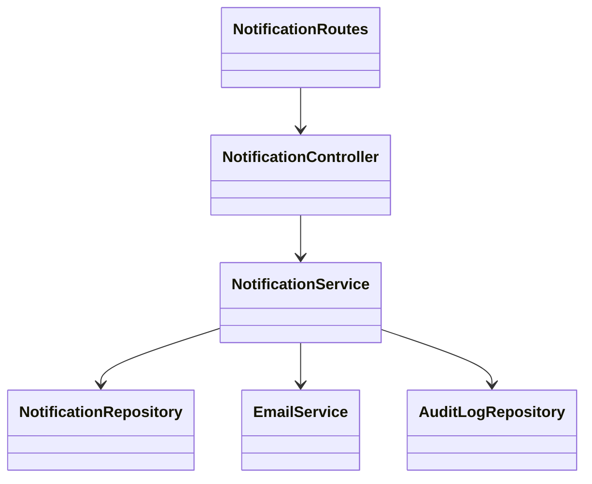

### b. Class Specifications

**NotificationController Class**

| No | Method | Description |
| --- | --- | --- |
| 01 | createNotificationRequest(req, res, next) | Queues a non-sensitive notification request after validation and Librarian/Admin authorization. |
| 02 | retryNotification(req, res, next) | Retries a failed non-sensitive notification by id; sensitive records require source reissue. |
| 03 | processPendingNotifications(req, res, next) | Processes pending notification queue. |

**NotificationService Class**

| No | Method | Description |
| --- | --- | --- |
| 01 | createNotificationRequest(input, actor, context) | Resolves recipient/template, rejects HTTP `sourceFeature` and sensitive auth types, stores safe payload, applies idempotency. |
| 02 | createNotificationRequestWithSource(input, actor, context) | Queues feature-owned notification with construction-bound source metadata. |
| 03 | retryNotification(notificationId, actor, context) | Re-sends a failed non-sensitive notification and records attempt. |
| 04 | processPendingNotifications(input, actor, context) | Sends pending notifications within configured limit. |

**NotificationRepository Class**

| No | Method | Description |
| --- | --- | --- |
| 01 | createNotification(payload) | Inserts a notification row. |
| 02 | listPendingNotifications(limit) | Selects pending rows for worker processing. |
| 03 | markNotificationSent(notificationId, providerMessageId) | Updates notification as sent and inserts attempt. |
| 04 | markNotificationFailed(notificationId, safeError) | Updates failure status and attempt history. |

### c. Sequence Diagram(s)

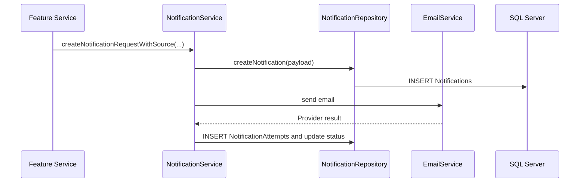

### d. Database Queries

```sql
SELECT TOP 1 * FROM NotificationTemplates WHERE TemplateCode = @TemplateCode AND Status = 'ACTIVE';
INSERT INTO Notifications (NotificationType, TemplateId, TemplateKey, UserId, RecipientEmail, Channel, Status, Title, Body, SourceFeature, SourceEntityType, SourceEntityId, IdempotencyKey, SafePayload) VALUES (@NotificationType, @TemplateId, @TemplateKey, @UserId, @RecipientEmail, @Channel, @Status, @Title, @Body, @SourceFeature, @SourceEntityType, @SourceEntityId, @IdempotencyKey, @SafePayload);
SELECT TOP (@Limit) * FROM Notifications WHERE Status = 'PENDING' ORDER BY CreatedAt ASC;
UPDATE Notifications SET Status = 'SENT', SentAt = GETDATE(), AttemptCount = AttemptCount + 1 WHERE NotificationId = @NotificationId;
UPDATE Notifications SET Status = 'FAILED', LastErrorMessage = @SafeErrorMessage, AttemptCount = AttemptCount + 1 WHERE NotificationId = @NotificationId;
INSERT INTO NotificationAttempts (NotificationId, Status, SafeErrorMessage, ProviderMessageId) VALUES (@NotificationId, @Status, @SafeErrorMessage, @ProviderMessageId);
```

## 9. User and Role Management

This feature supports admin user listing, detail viewing, account creation, setup resend, profile/status updates, role assignment/revocation, and audit log access.

### a. Class Diagram

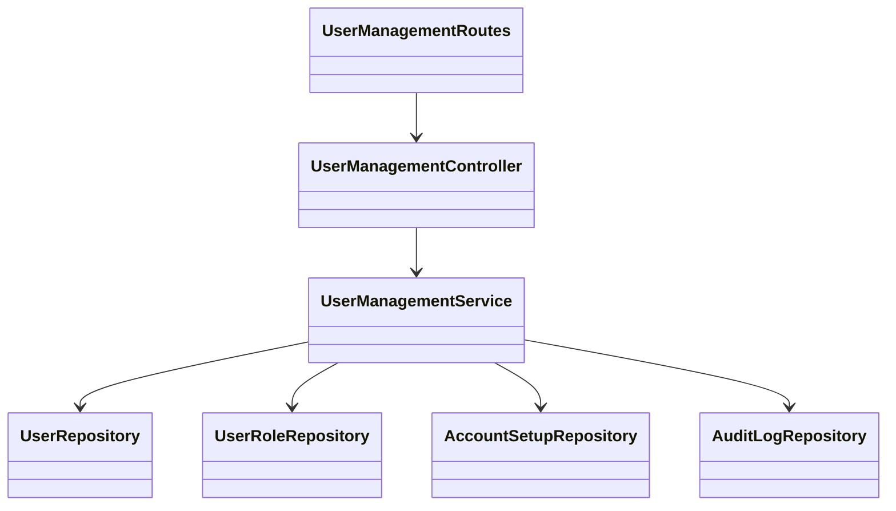

### b. Class Specifications

**UserManagementController Class**

| No | Method | Description |
| --- | --- | --- |
| 01 | listUsers(req, res, next) | Returns paged users with filters. |
| 02 | getUser(req, res, next) | Returns one safe managed user detail. |
| 03 | listRoles(req, res, next) | Returns assignable roles. |
| 04 | createUser(req, res, next) | Creates admin-managed account and account setup token. |
| 05 | updateUser(req, res, next) | Updates safe editable user/profile fields. |
| 06 | updateStatus(req, res, next) | Activates, locks, or deactivates a user. |
| 07 | assignRole(req, res, next) | Adds one role to a user. |
| 08 | revokeRole(req, res, next) | Removes one role from a user. |

**UserManagementService Class**

| No | Method | Description |
| --- | --- | --- |
| 01 | listUsers(query) | Normalizes filters and calls repository pagination. |
| 02 | getUser(userId) | Loads detail and related borrowing/fine/reservation summary. |
| 03 | createUser(input, context) | Validates uniqueness and role, creates account/profile/role, sends setup notification. |
| 04 | updateUser(userId, input, context) | Validates and updates allowed fields. |
| 05 | updateStatus(userId, input, context) | Applies account status transition and audit log. |
| 06 | assignRole(userId, input, context) | Validates role and inserts `UserRoles`. |
| 07 | revokeRole(userId, roleId, context) | Validates role removal and deletes `UserRoles`. |

**UserRepository / UserRoleRepository Classes**

| No | Method | Description |
| --- | --- | --- |
| 01 | listManagedUsers(filters) | Selects paged users with roles and profile fields. |
| 02 | createAdminManagedUser(payload) | Inserts user, profile, and initial role. |
| 03 | updateManagedUser(userId, updates) | Updates account/profile fields. |
| 04 | assignRole(userId, roleId) | Inserts user-role mapping. |
| 05 | revokeRole(userId, roleId) | Deletes user-role mapping. |

### c. Sequence Diagram(s)

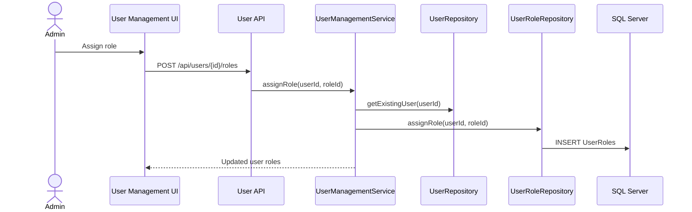

### d. Database Queries

```sql
SELECT u.UserId, u.Username, u.Email, u.Phone, u.Status, u.LastLoginAt,
       COALESCE(u.UpdatedAt, u.CreatedAt) AS EffectiveUpdatedAt,
       up.FullName, up.Address, up.Department, up.Specialization
FROM Users u
LEFT JOIN UserProfiles up ON u.UserId = up.UserId
ORDER BY u.CreatedAt DESC, u.UserId DESC
OFFSET @Offset ROWS FETCH NEXT @Limit ROWS ONLY;
SELECT r.RoleId, r.RoleName FROM Roles r ORDER BY r.RoleName;
INSERT INTO Users (Username, Email, PasswordHash, Phone, Status) VALUES (@Username, @Email, @PasswordHash, @Phone, @Status);
INSERT INTO UserRoles (UserId, RoleId) VALUES (@UserId, @RoleId);
UPDATE Users SET Phone = @Phone, UpdatedAt = GETDATE() WHERE UserId = @UserId;
UPDATE UserProfiles SET FullName = @FullName, Address = @Address, Department = @Department, Specialization = @Specialization, UpdatedAt = GETDATE() WHERE UserId = @UserId;
UPDATE Users SET Status = @Status, UpdatedAt = GETDATE() WHERE UserId = @UserId;
DELETE FROM UserRoles WHERE UserId = @UserId AND RoleId = @RoleId;
SELECT * FROM AuditLogs WHERE UserId = @UserId OR TargetId = @UserId ORDER BY CreatedAt DESC;
```

## 10. Reporting and Statistics

This feature supports borrowing, inventory, and user aggregate reports for authorized staff/admin users.

### a. Class Diagram

```mermaid
classDiagram
  class ReportRoutes
  class ReportController
  class ReportService
  class ReportRepository
  class AuditLogRepository
  ReportRoutes --> ReportController
  ReportController --> ReportService
  ReportService --> ReportRepository
  ReportService --> AuditLogRepository
```

### b. Class Specifications

**ReportController Class**

| No | Method | Description |
| --- | --- | --- |
| 01 | getBorrowingReport(req, res, next) | Returns borrowing totals and status breakdown. |
| 02 | getInventoryReport(req, res, next) | Returns book/copy availability statistics. |
| 03 | getUserStatistics(req, res, next) | Returns user/member/role statistics. |

**ReportService Class**

| No | Method | Description |
| --- | --- | --- |
| 01 | getBorrowingReport(filters, actor, context) | Validates report access, calls repository aggregation, writes access audit. |
| 02 | getInventoryReport(filters, actor, context) | Loads inventory aggregates by status/category. |
| 03 | getUserStatistics(filters, actor, context) | Loads account, role, and membership aggregates. |

**ReportRepository Class**

| No | Method | Description |
| --- | --- | --- |
| 01 | getBorrowingReport(filters) | Aggregates `BorrowRequests` and `BorrowDetails`. |
| 02 | getInventoryReport(filters) | Aggregates `Books` and `BookCopies`. |
| 03 | getUserStatistics(filters) | Aggregates `Users`, `UserRoles`, `Roles`, and `Members`. |

### c. Sequence Diagram(s)

```mermaid
sequenceDiagram
  actor Admin
  participant UI as Report Page
  participant API as Report API
  participant S as ReportService
  participant R as ReportRepository
  participant DB as SQL Server
  Admin->>UI: Open report
  UI->>API: GET /api/reports/borrowing
  API->>S: getBorrowingReport(filters, actor)
  S->>R: getBorrowingReport(filters)
  R->>DB: Aggregate SQL query
  S-->>UI: Chart/table data
```

### d. Database Queries

```sql
SELECT Status, COUNT(*) AS Total FROM BorrowRequests GROUP BY Status;
SELECT bd.Status, COUNT(*) AS Total FROM BorrowDetails bd GROUP BY bd.Status;
SELECT bc.Status, COUNT(*) AS Total FROM BookCopies bc GROUP BY bc.Status;
SELECT c.CategoryName, COUNT(b.BookId) AS BookCount FROM Categories c LEFT JOIN Books b ON c.CategoryId = b.CategoryId GROUP BY c.CategoryName;
SELECT u.Status, COUNT(*) AS Total FROM Users u GROUP BY u.Status;
SELECT r.RoleName, COUNT(ur.UserId) AS Total FROM Roles r LEFT JOIN UserRoles ur ON r.RoleId = ur.RoleId GROUP BY r.RoleName;
SELECT m.Status, COUNT(*) AS Total FROM Members m GROUP BY m.Status;
```
