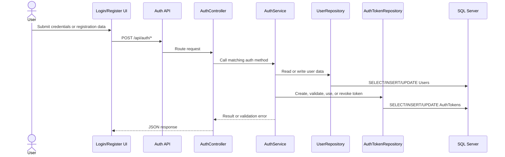
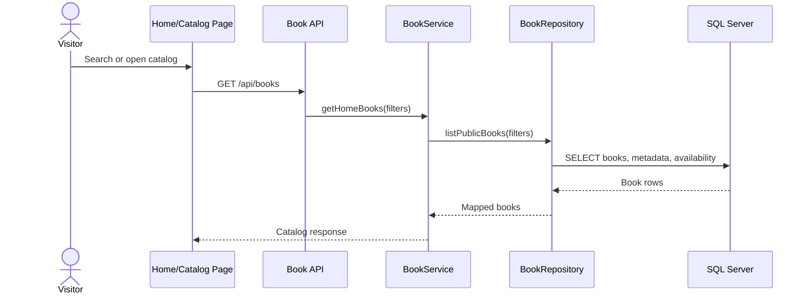
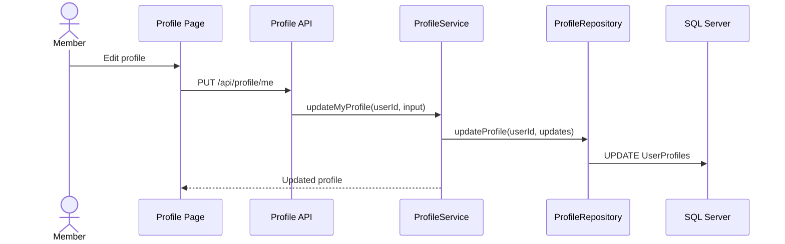
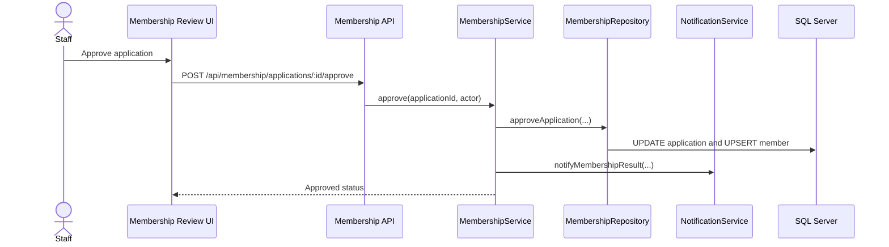
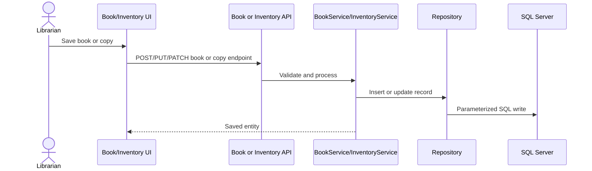
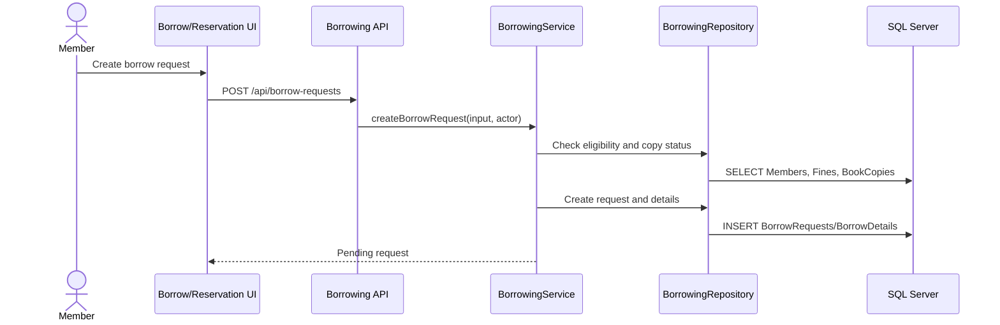
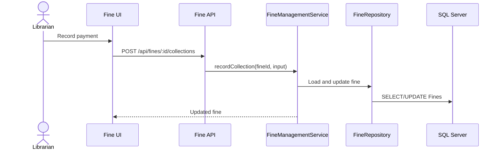
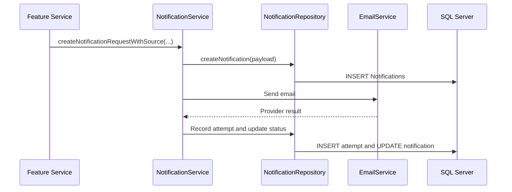
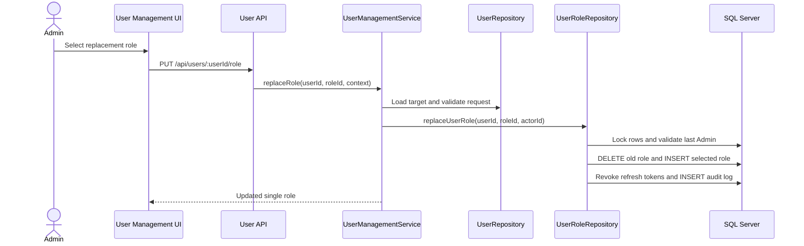
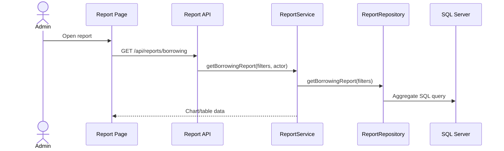

# ĐẶC TẢ SEQUENCE DIAGRAM

## 1. Mục đích và phạm vi

Tài liệu tách các Sequence Diagram trong `document/SDS.md` thành một đặc tả độc lập, mô tả luồng tương tác từ actor/giao diện đến API, service, repository và SQL Server.

- Phạm vi gồm 10 module Code Design hiện có trong SDS.
- FE05 và FE06 được mô tả chung trong module Book and Inventory Management.
- FE07 và FE08 được mô tả chung trong module Borrowing and Reservation.
- FE11 được đồng bộ với cơ chế hiện tại: mỗi người dùng có đúng một role và role được thay thế qua `PUT /api/users/:userId/role`.
- Diagram mô tả luồng thiết kế chính; nhánh lỗi chi tiết tuân theo SPEC và xử lý hiện có của từng feature.

## 2. Danh mục diagram

| STT | Module | Feature liên quan | Luồng chính |
|---:|---|---|---|
| 1 | Authentication | FE02 | Đăng nhập/đăng ký và quản lý token |
| 2 | Public Browse | FE01 | Tra cứu danh mục công khai |
| 3 | User Profile | FE03 | Cập nhật hồ sơ cá nhân |
| 4 | Membership Management | FE04 | Duyệt đơn thành viên |
| 5 | Book and Inventory Management | FE05, FE06 | Lưu sách hoặc bản sao |
| 6 | Borrowing and Reservation | FE07, FE08 | Tạo yêu cầu mượn |
| 7 | Fine Management | FE09 | Ghi nhận thanh toán tiền phạt |
| 8 | Notification | FE10 | Tạo và gửi thông báo |
| 9 | User and Role Management | FE11 | Thay thế role duy nhất |
| 10 | Reporting and Statistics | FE12 | Lấy dữ liệu báo cáo tổng hợp |

## 3. Sequence Diagram theo module

### 3.1. Authentication

**Điểm vào:** `POST /api/auth/*`  
**Thành phần dữ liệu:** `Users`, `UserProfiles`, `UserRoles`, `Roles`, `AuthTokens`.

### 3.2. Public Browse

**Điểm vào:** `GET /api/books`  
**Thành phần dữ liệu:** `Books`, `BookCopies`, `Categories`, `Authors`, `Publishers`.

### 3.3. User Profile

**Điểm vào:** `PUT /api/profile/me`  
**Thành phần dữ liệu:** `Users`, `UserProfiles`, `AuditLogs`.

### 3.4. Membership Management

**Điểm vào:** `POST /api/membership/applications/:id/approve`  
**Thành phần dữ liệu:** `MembershipApplications`, `Members`, `Notifications`.

### 3.5. Book and Inventory Management

**Điểm vào:** `/api/books`, `/api/books/:bookId/copies`, `/api/book-copies/:copyId`  
**Thành phần dữ liệu:** `Books`, `BookCopies` và dữ liệu danh mục liên quan.

### 3.6. Borrowing and Reservation

**Điểm vào:** `POST /api/borrow-requests`  
**Thành phần dữ liệu:** `Members`, `Fines`, `BookCopies`, `BorrowRequests`, `BorrowDetails`, `Reservations`.

### 3.7. Fine Management

**Điểm vào:** `POST /api/fines/:id/collections`  
**Thành phần dữ liệu:** `BorrowDetails`, `BorrowRequests`, `Fines`.

### 3.8. Notification

**Điểm vào:** lời gọi nội bộ từ các feature service  
**Thành phần dữ liệu:** `NotificationTemplates`, `Notifications`, `NotificationAttempts`.

### 3.9. User and Role Management

**Điểm vào:** `PUT /api/users/:userId/role`  
**Thành phần dữ liệu:** `Users`, `Roles`, `UserRoles`, `AuthTokens`, `AuditLogs`.

**Ràng buộc:** thao tác thay role chạy trong một transaction; không cho phép loại bỏ role của Admin hoạt động cuối cùng.

### 3.10. Reporting and Statistics

**Điểm vào:** `GET /api/reports/borrowing` và các endpoint báo cáo liên quan  
**Thành phần dữ liệu:** dữ liệu tổng hợp từ mượn/trả, kho, người dùng, role và membership.

## 4. Quy ước kiểm tra

- Mỗi diagram phải render được bằng Mermaid CLI.
- Tên route, service và repository phải khớp code hiện hành.
- Thay đổi luồng nghiệp vụ phải được cập nhật đồng thời trong feature SPEC, `document/SDS.md` và tài liệu này.
- SQL chi tiết của các bước repository được đặc tả trong `document/DatabaseQueriesSpecification.md`.
